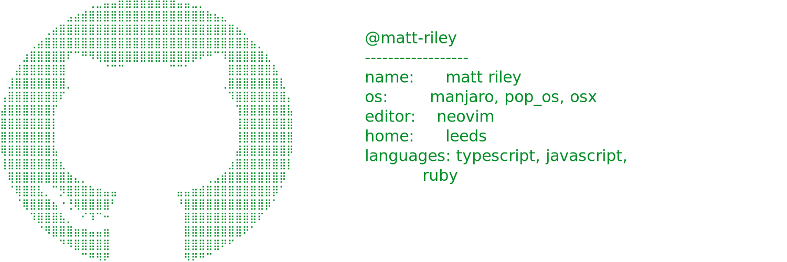

<!-- STARRED-REPOS-START -->
## Starred Repositories (Past Week)

_Last updated: 2026-02-16 04:48:30 UTC_
_Source account: `matt-riley`_

Total repositories starred this week: **8**

### [lettertwo/occurrence.nvim](https://github.com/lettertwo/occurrence.nvim)

> A Neovim plugin to mark occurrences of words/patterns/selections in a buffer and perform operations on them.  Inspired by vim-mode-plus's occurrence feature.

**Homepage:** n/a

---

### [aikhe/wrapped.nvim](https://github.com/aikhe/wrapped.nvim)

> View your Neovim configuration insights, history, and heatmaps.

**Homepage:** n/a

---

### [bajor/nvim-raccoon](https://github.com/bajor/nvim-raccoon)

> Neovim plugin for reviewing PRs and browsing commits

**Homepage:** n/a

---

### [zion-off/mole.nvim](https://github.com/zion-off/mole.nvim)

> code annotation plugin for neovim

**Homepage:** n/a

---

### [michael-andreuzza/bearnie](https://github.com/michael-andreuzza/bearnie)

> Accessible components for Astro and Tailwind CSS. Components are copied to your project. You own and control the code.

**Homepage:** [https://bearnie.dev](https://bearnie.dev)

---

### [github/gh-aw](https://github.com/github/gh-aw)

> GitHub Agentic Workflows

**Homepage:** [https://gh.io/gh-aw](https://gh.io/gh-aw)

---

### [aperturerobotics/goscript](https://github.com/aperturerobotics/goscript)

> Go to TypeScript transpiler

**Homepage:** [https://goscript.spacewave.app](https://goscript.spacewave.app)

---

### [lucasgelfond/zerobrew](https://github.com/lucasgelfond/zerobrew)

> A 5-20x faster experimental Homebrew alternative

**Homepage:** n/a
<!-- STARRED-REPOS-END -->
