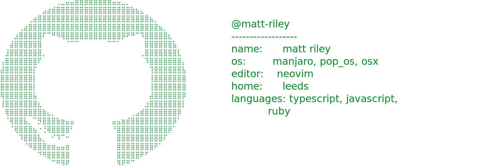

<!-- STARRED-REPOS-START -->
## Starred Repositories (Past Week)

_Last updated: 2026-03-09 04:42:18 UTC_
_Source account: `matt-riley`_

Total repositories starred this week: **7**

### [rtk-ai/rtk](https://github.com/rtk-ai/rtk)

> CLI proxy that reduces LLM token consumption by 60-90% on common dev commands. Single Rust binary, zero dependencies

**Homepage:** [https://www.rtk-ai.app](https://www.rtk-ai.app)

---

### [tmuxpack/tpack](https://github.com/tmuxpack/tpack)

> A drop-in replacement for tmux-plugin-manager (tpm) with a TUI. Written in Go.

**Homepage:** n/a

---

### [vercel-labs/agent-browser](https://github.com/vercel-labs/agent-browser)

> Browser automation CLI for AI agents

**Homepage:** [https://agent-browser.dev](https://agent-browser.dev)

---

### [pranshuparmar/witr](https://github.com/pranshuparmar/witr)

> Why is this running?

**Homepage:** n/a

---

### [flamestro/deff](https://github.com/flamestro/deff)

> interactive, side-by-side file review for git diffs with per-file navigation, vertical and horizontal scrolling, syntax highlighting, and added/deleted line tinting

**Homepage:** n/a

---

### [msitarzewski/agency-agents](https://github.com/msitarzewski/agency-agents)

> A complete AI agency at your fingertips - From frontend wizards to Reddit community ninjas, from whimsy injectors to reality checkers. Each agent is a specialized expert with personality, processes, and proven deliverables.

**Homepage:** n/a

---

### [pinchtab/pinchtab](https://github.com/pinchtab/pinchtab)

> High-performance browser automation bridge and multi-instance orchestrator with advanced stealth injection and real-time dashboard.

**Homepage:** n/a
<!-- STARRED-REPOS-END -->
