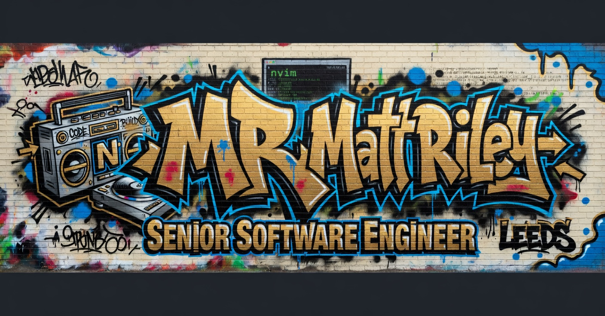

**Matt Riley** — Leeds, United Kingdom

Senior software engineer building backend systems, web applications, and developer tooling. Neovim maximalist, terminal UI tinkerer, and agent infrastructure explorer. 80s/90s hip-hop on heavy rotation.

[Blog & résumé](https://mattriley.work) · [Tools, plugins & Homebrew formulas](https://mattriley.tools)

The crates below are regenerated every Monday from my recent GitHub stars — a live signal of tools and ideas currently on rotation.

<!-- STARRED-REPOS-START -->
## Starred Repositories (Past Week)

_Last updated: 2026-05-11 05:27:58 UTC_
_Source account: `matt-riley`_

Total repositories starred this week: **6**

### [var-gg/pindoc](https://github.com/var-gg/pindoc)

> Where agent work becomes lasting memory. The wiki you never type into.

**Homepage:** n/a

---

### [Hmbown/DeepSeek-TUI](https://github.com/Hmbown/DeepSeek-TUI)

> Coding agent for DeepSeek models that runs in your terminal

**Homepage:** [https://deepseek-tui.com/](https://deepseek-tui.com/)

---

### [antirez/ds4](https://github.com/antirez/ds4)

> DeepSeek 4 Flash local inference engine for Metal

**Homepage:** n/a

---

### [Agent-Field/agentfield](https://github.com/Agent-Field/agentfield)

> Build, run and scale AI agents like API and microservices - observable,auditable and identity-aware from day one.

**Homepage:** [http://www.agentfield.ai](http://www.agentfield.ai)

---

### [qualisero/awesome-pi-agent](https://github.com/qualisero/awesome-pi-agent)

> Awesome list of add-ons, hooks, tools, skills, and resources for the pi coding agent (pi-mono).

**Homepage:** n/a

---

### [Vanilagy/mediabunny](https://github.com/Vanilagy/mediabunny)

> Pure TypeScript media toolkit for reading, writing, and converting video and audio files, directly in the browser.

**Homepage:** [https://mediabunny.dev/](https://mediabunny.dev/)
<!-- STARRED-REPOS-END -->
