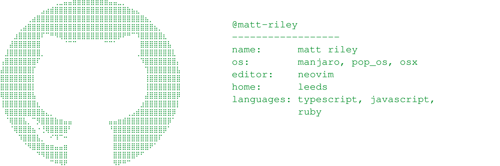

<!-- STARRED-REPOS-START -->
## Starred Repositories (Past Week)

_Last updated: 2026-03-23 04:51:14 UTC_
_Source account: `matt-riley`_

Total repositories starred this week: **7**

### [rustdesk/rustdesk](https://github.com/rustdesk/rustdesk)

> An open-source remote desktop application designed for self-hosting, as an alternative to TeamViewer.

**Homepage:** [https://rustdesk.com](https://rustdesk.com)

---

### [carlos-algms/agentic.nvim](https://github.com/carlos-algms/agentic.nvim)

> Agentic Chat Interface directly in Neovim with ACP providers from Claude-Code, Gemini, Codex, OpenCode, and Cursor-agent

**Homepage:** n/a

---

### [strongdm/attractor](https://github.com/strongdm/attractor)

> nlspec of StrongDM's Attractor, a non-interactive Coding Agent sufficient for use in a Software Factory

**Homepage:** [https://factory.strongdm.ai/products/attractor](https://factory.strongdm.ai/products/attractor)

---

### [ASSERT-KTH/meta-circular](https://github.com/ASSERT-KTH/meta-circular)

> meta-circular coding agent

**Homepage:** n/a

---

### [templui/templui](https://github.com/templui/templui)

> A growing collection of beautifully designed UI components for Go and templ. Install via CLI. Customize everything. Own your code.

**Homepage:** [https://templui.io](https://templui.io)

---

### [lightpanda-io/browser](https://github.com/lightpanda-io/browser)

> Lightpanda: the headless browser designed for AI and automation

**Homepage:** [https://lightpanda.io](https://lightpanda.io)

---

### [ShiftinBits/pmux-agent](https://github.com/ShiftinBits/pmux-agent)

> Agent and CLI package for pmux

**Homepage:** [https://docs.pmux.io](https://docs.pmux.io)
<!-- STARRED-REPOS-END -->
