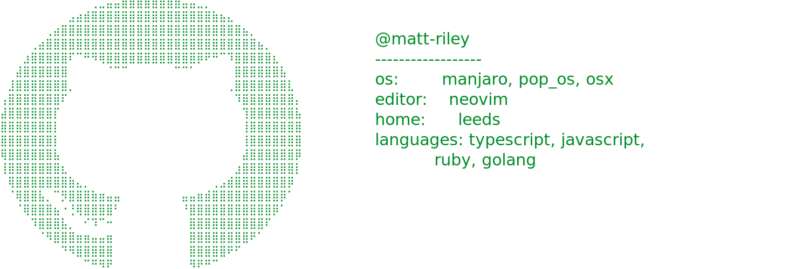

<!-- STARRED-REPOS-START -->
## Starred Repositories (Weekly Snapshot)

_Last updated: 2026-02-13 17:30:50 UTC_
_Source account: `matt-riley`_

Total starred repositories: **1234**

### 1. [github/gh-aw](https://github.com/github/gh-aw)

- Starred at: `2026-02-12T18:22:32Z`
- Description: GitHub Agentic Workflows
- Topics: actions, cai, ci, claude-code, codex, copilot, gh-extension, github-actions
- Language: `Go`
- License: `MIT`
- Visibility: `public`
- Metrics: ⭐ `2146` | Forks `151` | Watchers `2146` | Open issues `35`
- Repo state: archived `no` | fork `no` | disabled `no`
- Default branch: `main`
- Created: `2025-08-12T17:40:41Z`
- Updated: `2026-02-13T17:24:12Z`
- Last push: `2026-02-13T17:24:17Z`
- Size (KB): `775175`
- Homepage: https://gh.io/gh-aw
- Clone URL: `https://github.com/github/gh-aw.git`

### 2. [aperturerobotics/goscript](https://github.com/aperturerobotics/goscript)

- Starred at: `2026-02-12T10:21:37Z`
- Description: Go to TypeScript transpiler
- Topics: compiler, go, typescript
- Language: `TypeScript`
- License: `MIT`
- Visibility: `public`
- Metrics: ⭐ `180` | Forks `7` | Watchers `180` | Open issues `6`
- Repo state: archived `no` | fork `no` | disabled `no`
- Default branch: `master`
- Created: `2017-03-29T00:10:35Z`
- Updated: `2026-02-12T10:21:38Z`
- Last push: `2026-02-13T14:44:18Z`
- Size (KB): `4097`
- Homepage: https://goscript.spacewave.app
- Clone URL: `https://github.com/aperturerobotics/goscript.git`

### 3. [lucasgelfond/zerobrew](https://github.com/lucasgelfond/zerobrew)

- Starred at: `2026-02-12T10:20:57Z`
- Description: A drop-in, 5-20x faster, experimental Homebrew alternative
- Topics: n/a
- Language: `Rust`
- License: `Apache-2.0`
- Visibility: `public`
- Metrics: ⭐ `6190` | Forks `140` | Watchers `6190` | Open issues `21`
- Repo state: archived `no` | fork `no` | disabled `no`
- Default branch: `main`
- Created: `2026-01-19T12:42:04Z`
- Updated: `2026-02-13T17:06:01Z`
- Last push: `2026-02-13T15:32:16Z`
- Size (KB): `3036`
- Homepage: n/a
- Clone URL: `https://github.com/lucasgelfond/zerobrew.git`

### 4. [rapidaai/voice-ai](https://github.com/rapidaai/voice-ai)

- Starred at: `2026-02-09T01:13:22Z`
- Description: Rapida is an open-source, end-to-end voice AI orchestration platform for building real-time conversational voice agents with audio streaming, STT, TTS, VAD, multi-channel integration, agent state management, and observability.
- Topics: agent-framework, ai-voice, ai-voice-agent, audio-streaming, golang, open-source, orchestration, realtime-audio, sip, speech-ai, speech-to-text, telephony, text-to-speech, voice-agents, voice-ai, voice-ai-agents, voice-ai-platform, voice-assistant-ai, voice-bot, voice-observability
- Language: `Go`
- License: `NOASSERTION`
- Visibility: `public`
- Metrics: ⭐ `603` | Forks `198` | Watchers `603` | Open issues `14`
- Repo state: archived `no` | fork `no` | disabled `no`
- Default branch: `main`
- Created: `2023-12-07T07:57:00Z`
- Updated: `2026-02-13T11:57:05Z`
- Last push: `2026-01-30T11:53:54Z`
- Size (KB): `65830`
- Homepage: https://rapida.ai
- Clone URL: `https://github.com/rapidaai/voice-ai.git`

### 5. [danyjacob45/go-concurrency-exercises](https://github.com/danyjacob45/go-concurrency-exercises)

- Starred at: `2026-02-09T01:12:02Z`
- Description: A comprehensive set of exercises to master Go concurrency nuances and patterns
- Topics: concurrency, concurrency-patterns, go
- Language: `Go`
- License: `n/a`
- Visibility: `public`
- Metrics: ⭐ `43` | Forks `3` | Watchers `43` | Open issues `0`
- Repo state: archived `no` | fork `no` | disabled `no`
- Default branch: `main`
- Created: `2026-02-03T06:29:49Z`
- Updated: `2026-02-12T02:24:52Z`
- Last push: `2026-02-05T05:52:08Z`
- Size (KB): `56`
- Homepage: n/a
- Clone URL: `https://github.com/danyjacob45/go-concurrency-exercises.git`

### 6. [shanraisshan/claude-code-best-practice](https://github.com/shanraisshan/claude-code-best-practice)

- Starred at: `2026-02-08T19:55:15Z`
- Description: practice made claude perfect
- Topics: claude-ai, claude-code
- Language: `HTML`
- License: `n/a`
- Visibility: `public`
- Metrics: ⭐ `2488` | Forks `165` | Watchers `2488` | Open issues `0`
- Repo state: archived `no` | fork `no` | disabled `no`
- Default branch: `main`
- Created: `2025-10-31T14:15:28Z`
- Updated: `2026-02-13T17:19:03Z`
- Last push: `2026-02-12T18:07:50Z`
- Size (KB): `3182`
- Homepage: n/a
- Clone URL: `https://github.com/shanraisshan/claude-code-best-practice.git`

### 7. [charmbracelet/fantasy](https://github.com/charmbracelet/fantasy)

- Starred at: `2026-02-06T18:50:30Z`
- Description: Build AI agents with Go. Multiple providers, multiple models, one API 🧙
- Topics: n/a
- Language: `Go`
- License: `Apache-2.0`
- Visibility: `public`
- Metrics: ⭐ `567` | Forks `47` | Watchers `567` | Open issues `25`
- Repo state: archived `no` | fork `no` | disabled `no`
- Default branch: `main`
- Created: `2025-08-15T13:49:22Z`
- Updated: `2026-02-13T16:40:23Z`
- Last push: `2026-02-13T16:40:19Z`
- Size (KB): `3247`
- Homepage: n/a
- Clone URL: `https://github.com/charmbracelet/fantasy.git`

### 8. [maximhq/bifrost](https://github.com/maximhq/bifrost)

- Starred at: `2026-01-30T18:38:42Z`
- Description: Fastest enterprise AI gateway (50x faster than LiteLLM) with adaptive load balancer, cluster mode, guardrails, 1000+ models support & <100 µs overhead at 5k RPS.
- Topics: ai-gateway, gateway, gateway-services, generative-ai, guardrails, llm, llm-cost, llm-gateway, llm-observability, llmops, load-balancing, mcp-client, mcp-gateway, mcp-server, model-router, token-management
- Language: `Go`
- License: `Apache-2.0`
- Visibility: `public`
- Metrics: ⭐ `2321` | Forks `236` | Watchers `2321` | Open issues `131`
- Repo state: archived `no` | fork `no` | disabled `no`
- Default branch: `main`
- Created: `2025-03-19T07:21:26Z`
- Updated: `2026-02-13T16:47:39Z`
- Last push: `2026-02-13T15:21:03Z`
- Size (KB): `436758`
- Homepage: https://www.getmaxim.ai/bifrost
- Clone URL: `https://github.com/maximhq/bifrost.git`

### 9. [openclaw/openclaw](https://github.com/openclaw/openclaw)

- Starred at: `2026-01-26T20:56:54Z`
- Description: Your own personal AI assistant. Any OS. Any Platform. The lobster way. 🦞
- Topics: ai, assistant, crustacean, molty, openclaw, own-your-data, personal
- Language: `TypeScript`
- License: `MIT`
- Visibility: `public`
- Metrics: ⭐ `191216` | Forks `32576` | Watchers `191216` | Open issues `5732`
- Repo state: archived `no` | fork `no` | disabled `no`
- Default branch: `main`
- Created: `2025-11-24T10:16:47Z`
- Updated: `2026-02-13T17:29:56Z`
- Last push: `2026-02-13T17:29:01Z`
- Size (KB): `187999`
- Homepage: https://openclaw.ai
- Clone URL: `https://github.com/openclaw/openclaw.git`

### 10. [ChartGPU/ChartGPU](https://github.com/ChartGPU/ChartGPU)

- Starred at: `2026-01-26T20:44:22Z`
- Description: Beautiful, open source, WebGPU-based charting library
- Topics: awesome-list, candlestick-chart, chart, chart-library, charting-library, data-analysis, data-visualization, financial-charts, gpu, heatmap, high-performance, javascript, open-source, scatter-plot, typescript, webgpu
- Language: `TypeScript`
- License: `MIT`
- Visibility: `public`
- Metrics: ⭐ `2631` | Forks `67` | Watchers `2631` | Open issues `3`
- Repo state: archived `no` | fork `no` | disabled `no`
- Default branch: `main`
- Created: `2026-01-17T00:52:00Z`
- Updated: `2026-02-13T16:19:14Z`
- Last push: `2026-02-11T23:25:55Z`
- Size (KB): `14138`
- Homepage: https://chartgpu.github.io/ChartGPU/
- Clone URL: `https://github.com/ChartGPU/ChartGPU.git`

### 11. [yoanbernabeu/grepai](https://github.com/yoanbernabeu/grepai)

- Starred at: `2026-01-23T18:44:41Z`
- Description: Semantic Search & Call Graphs for AI Agents (100% Local)
- Topics: ai, claude-code, cli, code-search, cursor, developer-tools, embeddings, golang, mcp, privacy-first, semantic-search, vector-search
- Language: `Go`
- License: `MIT`
- Visibility: `public`
- Metrics: ⭐ `1224` | Forks `93` | Watchers `1224` | Open issues `21`
- Repo state: archived `no` | fork `no` | disabled `no`
- Default branch: `main`
- Created: `2026-01-09T13:01:33Z`
- Updated: `2026-02-13T15:54:43Z`
- Last push: `2026-02-13T09:16:13Z`
- Size (KB): `681`
- Homepage: https://yoanbernabeu.github.io/grepai/
- Clone URL: `https://github.com/yoanbernabeu/grepai.git`

### 12. [github/copilot-sdk](https://github.com/github/copilot-sdk)

- Starred at: `2026-01-22T18:17:50Z`
- Description: Multi-platform SDK for integrating GitHub Copilot Agent into apps and services
- Topics: n/a
- Language: `TypeScript`
- License: `MIT`
- Visibility: `public`
- Metrics: ⭐ `7096` | Forks `838` | Watchers `7096` | Open issues `122`
- Repo state: archived `no` | fork `no` | disabled `no`
- Default branch: `main`
- Created: `2026-01-14T00:23:22Z`
- Updated: `2026-02-13T17:18:59Z`
- Last push: `2026-02-13T17:28:52Z`
- Size (KB): `1653`
- Homepage: n/a
- Clone URL: `https://github.com/github/copilot-sdk.git`

### 13. [william-liebenberg/github-gated-deployments](https://github.com/william-liebenberg/github-gated-deployments)

- Starred at: `2026-01-21T12:27:05Z`
- Description: How to set up approval gates for deploying to individual environments
- Topics: n/a
- Language: `n/a`
- License: `MIT`
- Visibility: `public`
- Metrics: ⭐ `27` | Forks `6` | Watchers `27` | Open issues `0`
- Repo state: archived `no` | fork `no` | disabled `no`
- Default branch: `main`
- Created: `2023-07-02T14:40:37Z`
- Updated: `2026-01-21T12:27:06Z`
- Last push: `2023-07-03T06:43:04Z`
- Size (KB): `1271`
- Homepage: n/a
- Clone URL: `https://github.com/william-liebenberg/github-gated-deployments.git`

### 14. [different-ai/openwork](https://github.com/different-ai/openwork)

- Starred at: `2026-01-19T21:08:16Z`
- Description: An open-source alternative to Claude Cowork, powered by opencode
- Topics: n/a
- Language: `TypeScript`
- License: `MIT`
- Visibility: `public`
- Metrics: ⭐ `9673` | Forks `822` | Watchers `9673` | Open issues `65`
- Repo state: archived `no` | fork `no` | disabled `no`
- Default branch: `dev`
- Created: `2026-01-14T01:39:31Z`
- Updated: `2026-02-13T17:21:40Z`
- Last push: `2026-02-13T17:21:28Z`
- Size (KB): `56204`
- Homepage: https://openwork.software
- Clone URL: `https://github.com/different-ai/openwork.git`

### 15. [originalankur/maptoposter](https://github.com/originalankur/maptoposter)

- Starred at: `2026-01-19T21:08:12Z`
- Description: Transform your favorite cities into beautiful, minimalist designs. MapToPoster lets you create and export visually striking map posters with code.
- Topics: design, maps, matplotlib-pyplot, openstreetmap, osmnx, poster, python, visualdesign
- Language: `Python`
- License: `MIT`
- Visibility: `public`
- Metrics: ⭐ `10496` | Forks `916` | Watchers `10496` | Open issues `38`
- Repo state: archived `no` | fork `no` | disabled `no`
- Default branch: `main`
- Created: `2026-01-08T12:29:35Z`
- Updated: `2026-02-13T17:20:52Z`
- Last push: `2026-01-30T14:46:20Z`
- Size (KB): `319891`
- Homepage: n/a
- Clone URL: `https://github.com/originalankur/maptoposter.git`

### 16. [greeeen-dev/natsumi-browser](https://github.com/greeeen-dev/natsumi-browser)

- Starred at: `2026-01-19T15:50:48Z`
- Description: Welcome to your personal internet.
- Topics: firefox, firefox-browser, firefox-css
- Language: `CSS`
- License: `GPL-3.0`
- Visibility: `public`
- Metrics: ⭐ `623` | Forks `22` | Watchers `623` | Open issues `7`
- Repo state: archived `no` | fork `no` | disabled `no`
- Default branch: `main`
- Created: `2024-12-06T10:19:47Z`
- Updated: `2026-02-13T17:11:39Z`
- Last push: `2026-02-13T12:30:57Z`
- Size (KB): `107094`
- Homepage: n/a
- Clone URL: `https://github.com/greeeen-dev/natsumi-browser.git`

### 17. [mutablelogic/go-whisper](https://github.com/mutablelogic/go-whisper)

- Starred at: `2026-01-18T01:01:25Z`
- Description: Speech-to-Text in golang
- Topics: golang, speech-recognition, speech-to-text, whisper
- Language: `Go`
- License: `Apache-2.0`
- Visibility: `public`
- Metrics: ⭐ `169` | Forks `19` | Watchers `169` | Open issues `2`
- Repo state: archived `no` | fork `no` | disabled `no`
- Default branch: `main`
- Created: `2022-12-01T19:17:47Z`
- Updated: `2026-02-11T10:38:12Z`
- Last push: `2026-01-27T10:27:11Z`
- Size (KB): `12235`
- Homepage: https://pkg.go.dev/github.com/mutablelogic/go-whisper
- Clone URL: `https://github.com/mutablelogic/go-whisper.git`

### 18. [awesome-opencode/awesome-opencode](https://github.com/awesome-opencode/awesome-opencode)

- Starred at: `2026-01-17T23:46:09Z`
- Description: A curated list of awesome plugins, themes, agents, projects, and resources for https://opencode.ai
- Topics: n/a
- Language: `JavaScript`
- License: `CC0-1.0`
- Visibility: `public`
- Metrics: ⭐ `2263` | Forks `140` | Watchers `2263` | Open issues `28`
- Repo state: archived `no` | fork `no` | disabled `no`
- Default branch: `main`
- Created: `2025-09-22T00:01:14Z`
- Updated: `2026-02-13T17:26:09Z`
- Last push: `2026-01-26T20:15:13Z`
- Size (KB): `274`
- Homepage: n/a
- Clone URL: `https://github.com/awesome-opencode/awesome-opencode.git`

### 19. [enulus/OpenPackage](https://github.com/enulus/OpenPackage)

- Starred at: `2026-01-16T19:39:59Z`
- Description: The open, universal, coding agent skills, agents, rules, and commands organizer and package manager.
- Topics: agents, ai, cli, coding, commands, openpackage, opkg, package-manager, plugins, rules, skills
- Language: `TypeScript`
- License: `Apache-2.0`
- Visibility: `public`
- Metrics: ⭐ `286` | Forks `15` | Watchers `286` | Open issues `7`
- Repo state: archived `no` | fork `no` | disabled `no`
- Default branch: `main`
- Created: `2025-10-15T03:07:47Z`
- Updated: `2026-02-13T15:50:06Z`
- Last push: `2026-02-13T03:21:56Z`
- Size (KB): `3856`
- Homepage: https://openpackage.dev
- Clone URL: `https://github.com/enulus/OpenPackage.git`

### 20. [Adversis/tailsnitch](https://github.com/Adversis/tailsnitch)

- Starred at: `2026-01-12T17:30:19Z`
- Description: A security auditor for Tailscale configurations. Scans your tailnet for misconfigurations, overly permissive access controls, and security best practice violations.
- Topics: n/a
- Language: `Go`
- License: `MIT`
- Visibility: `public`
- Metrics: ⭐ `1060` | Forks `26` | Watchers `1060` | Open issues `1`
- Repo state: archived `no` | fork `no` | disabled `no`
- Default branch: `main`
- Created: `2025-12-24T21:54:49Z`
- Updated: `2026-02-13T13:11:33Z`
- Last push: `2026-01-07T20:03:36Z`
- Size (KB): `208`
- Homepage: n/a
- Clone URL: `https://github.com/Adversis/tailsnitch.git`

### 21. [huseyinbabal/taws](https://github.com/huseyinbabal/taws)

- Starred at: `2026-01-08T08:22:12Z`
- Description: Terminal UI for AWS (taws) - A terminal-based AWS resource viewer and manager
- Topics: n/a
- Language: `Rust`
- License: `MIT`
- Visibility: `public`
- Metrics: ⭐ `2107` | Forks `55` | Watchers `2107` | Open issues `9`
- Repo state: archived `no` | fork `no` | disabled `no`
- Default branch: `master`
- Created: `2026-01-04T09:50:22Z`
- Updated: `2026-02-13T13:40:02Z`
- Last push: `2026-02-08T04:13:21Z`
- Size (KB): `1751`
- Homepage: n/a
- Clone URL: `https://github.com/huseyinbabal/taws.git`

### 22. [Lissy93/Brewfile](https://github.com/Lissy93/Brewfile)

- Starred at: `2026-01-06T23:23:49Z`
- Description: 🍺 My list of packages to be installed on MacOS via Homebrew, for the ultimate dev setup
- Topics: brew, brewfile, macos
- Language: `Ruby`
- License: `MIT`
- Visibility: `public`
- Metrics: ⭐ `161` | Forks `28` | Watchers `161` | Open issues `0`
- Repo state: archived `no` | fork `no` | disabled `no`
- Default branch: `master`
- Created: `2022-10-23T09:01:26Z`
- Updated: `2026-02-10T04:16:44Z`
- Last push: `2023-12-16T21:18:14Z`
- Size (KB): `61`
- Homepage: https://brewfile.as93.net
- Clone URL: `https://github.com/Lissy93/Brewfile.git`

### 23. [block/goose](https://github.com/block/goose)

- Starred at: `2026-01-05T22:35:04Z`
- Description: an open source, extensible AI agent that goes beyond code suggestions - install, execute, edit, and test with any LLM
- Topics: mcp
- Language: `Rust`
- License: `Apache-2.0`
- Visibility: `public`
- Metrics: ⭐ `30391` | Forks `2744` | Watchers `30391` | Open issues `319`
- Repo state: archived `no` | fork `no` | disabled `no`
- Default branch: `main`
- Created: `2024-08-23T19:03:36Z`
- Updated: `2026-02-13T17:07:44Z`
- Last push: `2026-02-13T17:23:00Z`
- Size (KB): `1074145`
- Homepage: https://block.github.io/goose/
- Clone URL: `https://github.com/block/goose.git`

### 24. [tw93/Mole](https://github.com/tw93/Mole)

- Starred at: `2026-01-05T22:23:34Z`
- Description: 🐹 Deep clean and optimize your Mac.
- Topics: analyzer, appcleaner, clean, cleaner, cleaner-cli, cleaner-script, command-line, daisydisk, istat, mac, macos, optimize, sensei, shell, uninstall
- Language: `Shell`
- License: `MIT`
- Visibility: `public`
- Metrics: ⭐ `34603` | Forks `947` | Watchers `34603` | Open issues `2`
- Repo state: archived `no` | fork `no` | disabled `no`
- Default branch: `main`
- Created: `2025-09-23T06:38:40Z`
- Updated: `2026-02-13T17:21:36Z`
- Last push: `2026-02-13T02:41:28Z`
- Size (KB): `232734`
- Homepage: https://x.com/HiTw93/status/2020078438724354190
- Clone URL: `https://github.com/tw93/Mole.git`

### 25. [mucansever/widelogger](https://github.com/mucansever/widelogger)

- Starred at: `2025-12-30T21:43:12Z`
- Description: package for wide logs containing all the context
- Topics: go, golang, logging
- Language: `Go`
- License: `MIT`
- Visibility: `public`
- Metrics: ⭐ `1` | Forks `0` | Watchers `1` | Open issues `0`
- Repo state: archived `no` | fork `no` | disabled `no`
- Default branch: `main`
- Created: `2025-12-29T23:27:08Z`
- Updated: `2026-01-17T16:27:07Z`
- Last push: `2026-01-17T16:27:04Z`
- Size (KB): `27`
- Homepage: n/a
- Clone URL: `https://github.com/mucansever/widelogger.git`

### 26. [olimorris/codecompanion.nvim](https://github.com/olimorris/codecompanion.nvim)

- Starred at: `2025-12-30T17:27:18Z`
- Description: ✨ AI Coding, Vim Style
- Topics: acp, agent-client-protocol, anthropic, claude-code, copilot, copilot-chat, deepseek, gemini, google-gemini, llm, neovim, nvim, ollama, openai, plugin, vibe-coding
- Language: `Lua`
- License: `Apache-2.0`
- Visibility: `public`
- Metrics: ⭐ `6132` | Forks `370` | Watchers `6132` | Open issues `23`
- Repo state: archived `no` | fork `no` | disabled `no`
- Default branch: `main`
- Created: `2023-12-27T17:32:51Z`
- Updated: `2026-02-13T16:58:08Z`
- Last push: `2026-02-13T17:04:52Z`
- Size (KB): `7986`
- Homepage: https://codecompanion.olimorris.dev
- Clone URL: `https://github.com/olimorris/codecompanion.nvim.git`

### 27. [magicalne/nvim.ai](https://github.com/magicalne/nvim.ai)

- Starred at: `2025-12-30T17:23:54Z`
- Description: Inspired by Zed AI, it allows you to chat with your buffers, insert code with an inline assistant, and leverage various LLM providers for context-aware AI assistance.
- Topics: copilot, llm, neovim-plugin, nvim, nvim-plugin
- Language: `Lua`
- License: `Apache-2.0`
- Visibility: `public`
- Metrics: ⭐ `158` | Forks `4` | Watchers `158` | Open issues `5`
- Repo state: archived `no` | fork `no` | disabled `no`
- Default branch: `main`
- Created: `2024-08-22T22:49:03Z`
- Updated: `2025-12-30T17:23:54Z`
- Last push: `2025-02-25T11:39:03Z`
- Size (KB): `181`
- Homepage: n/a
- Clone URL: `https://github.com/magicalne/nvim.ai.git`

### 28. [Xithrius/twitch-tui](https://github.com/Xithrius/twitch-tui)

- Starred at: `2025-12-30T13:52:53Z`
- Description: Twitch chat in the terminal.
- Topics: chat, rust, tui, twitch
- Language: `Rust`
- License: `Apache-2.0`
- Visibility: `public`
- Metrics: ⭐ `591` | Forks `41` | Watchers `591` | Open issues `9`
- Repo state: archived `no` | fork `no` | disabled `no`
- Default branch: `main`
- Created: `2021-08-23T22:27:10Z`
- Updated: `2026-02-13T01:55:28Z`
- Last push: `2026-02-09T06:46:27Z`
- Size (KB): `3823`
- Homepage: https://xithrius.github.io/twitch-tui/
- Clone URL: `https://github.com/Xithrius/twitch-tui.git`

### 29. [Dispatcharr/Dispatcharr](https://github.com/Dispatcharr/Dispatcharr)

- Starred at: `2025-12-30T11:53:46Z`
- Description: n/a
- Topics: n/a
- Language: `Python`
- License: `NOASSERTION`
- Visibility: `public`
- Metrics: ⭐ `2620` | Forks `170` | Watchers `2620` | Open issues `235`
- Repo state: archived `no` | fork `no` | disabled `no`
- Default branch: `main`
- Created: `2025-02-18T17:15:37Z`
- Updated: `2026-02-13T13:22:26Z`
- Last push: `2026-02-13T17:20:42Z`
- Size (KB): `28868`
- Homepage: n/a
- Clone URL: `https://github.com/Dispatcharr/Dispatcharr.git`

### 30. [ClavixDev/Clavix](https://github.com/ClavixDev/Clavix)

- Starred at: `2025-12-28T20:27:25Z`
- Description: Transform vague ideas into production-ready prompts. Analyze gaps, generate PRDs, and supercharge your AI coding workflow with the CLEAR framework.
- Topics: n/a
- Language: `TypeScript`
- License: `Apache-2.0`
- Visibility: `public`
- Metrics: ⭐ `541` | Forks `38` | Watchers `541` | Open issues `2`
- Repo state: archived `no` | fork `no` | disabled `no`
- Default branch: `main`
- Created: `2025-11-13T10:30:36Z`
- Updated: `2026-02-13T16:24:55Z`
- Last push: `2026-02-03T18:25:16Z`
- Size (KB): `2284`
- Homepage: n/a
- Clone URL: `https://github.com/ClavixDev/Clavix.git`

### 31. [karol-broda/snitch](https://github.com/karol-broda/snitch)

- Starred at: `2025-12-25T09:25:32Z`
- Description: a prettier way to inspect network connections
- Topics: n/a
- Language: `Go`
- License: `MIT`
- Visibility: `public`
- Metrics: ⭐ `3078` | Forks `47` | Watchers `3078` | Open issues `9`
- Repo state: archived `no` | fork `no` | disabled `no`
- Default branch: `master`
- Created: `2025-08-27T08:32:47Z`
- Updated: `2026-02-13T13:46:22Z`
- Last push: `2026-01-01T19:58:14Z`
- Size (KB): `10477`
- Homepage: n/a
- Clone URL: `https://github.com/karol-broda/snitch.git`

### 32. [qdm12/gluetun](https://github.com/qdm12/gluetun)

- Starred at: `2025-12-24T20:42:15Z`
- Description: VPN client in a thin Docker container for multiple VPN providers, written in Go, and using OpenVPN or Wireguard, DNS over TLS, with a few proxy servers built-in.
- Topics: alpine, cyberghost, dns-over-tls, docker, golang, http-proxy, mullvad, nordvpn, openvpn, pia, privado, private-internet-access, purevpn, shadowsocks, surfshark, vpn-client, vyprvpn, windscribe, wireguard
- Language: `Go`
- License: `MIT`
- Visibility: `public`
- Metrics: ⭐ `12947` | Forks `535` | Watchers `12947` | Open issues `312`
- Repo state: archived `no` | fork `no` | disabled `no`
- Default branch: `master`
- Created: `2018-02-06T22:16:29Z`
- Updated: `2026-02-13T15:31:07Z`
- Last push: `2026-02-13T17:14:46Z`
- Size (KB): `17996`
- Homepage: https://github.com/qdm12/gluetun-wiki
- Clone URL: `https://github.com/qdm12/gluetun.git`

### 33. [speakeasy-api/openapi](https://github.com/speakeasy-api/openapi)

- Starred at: `2025-12-22T22:18:59Z`
- Description: A set of packages and tools for working with OpenAPI, Swagger, Arazzo and Overlay Specification documents.
- Topics: arazzo, cli, golang, good-first-issue, oas, oas2, oas3, openapi, openapi-repo, openapi-spec, openapi-specification, openapi2, openapi3, openapi31, openapi32, overlays, parser, swagger, swagger-api, validation
- Language: `Go`
- License: `MIT`
- Visibility: `public`
- Metrics: ⭐ `242` | Forks `12` | Watchers `242` | Open issues `1`
- Repo state: archived `no` | fork `no` | disabled `no`
- Default branch: `main`
- Created: `2024-08-22T08:59:55Z`
- Updated: `2026-02-13T17:27:07Z`
- Last push: `2026-02-13T08:12:45Z`
- Size (KB): `2394`
- Homepage: https://www.speakeasy.com
- Clone URL: `https://github.com/speakeasy-api/openapi.git`

### 34. [github/awesome-copilot](https://github.com/github/awesome-copilot)

- Starred at: `2025-12-21T05:00:52Z`
- Description: Community-contributed instructions, prompts, and configurations to help you make the most of GitHub Copilot.
- Topics: ai, github-copilot, hacktoberfest, prompt-engineering
- Language: `JavaScript`
- License: `MIT`
- Visibility: `public`
- Metrics: ⭐ `21126` | Forks `2413` | Watchers `21126` | Open issues `29`
- Repo state: archived `no` | fork `no` | disabled `no`
- Default branch: `main`
- Created: `2025-06-11T16:57:39Z`
- Updated: `2026-02-13T17:09:15Z`
- Last push: `2026-02-13T04:56:23Z`
- Size (KB): `5538`
- Homepage: https://github.github.com/awesome-copilot/
- Clone URL: `https://github.com/github/awesome-copilot.git`

### 35. [xpipe-io/xpipe](https://github.com/xpipe-io/xpipe)

- Starred at: `2025-12-15T21:45:15Z`
- Description: Access your entire server infrastructure from your local desktop
- Topics: bash, docker, filemanager, files, incus, java, javafx, k8s, kubernetes, lxd, networking, podman, sftp, ssh, tailscale, wsl
- Language: `Java`
- License: `Apache-2.0`
- Visibility: `public`
- Metrics: ⭐ `13752` | Forks `524` | Watchers `13752` | Open issues `44`
- Repo state: archived `no` | fork `no` | disabled `no`
- Default branch: `master`
- Created: `2023-01-27T02:25:38Z`
- Updated: `2026-02-13T17:25:09Z`
- Last push: `2026-02-13T09:54:34Z`
- Size (KB): `62072`
- Homepage: https://xpipe.io
- Clone URL: `https://github.com/xpipe-io/xpipe.git`

### 36. [royshil/obs-backgroundremoval](https://github.com/royshil/obs-backgroundremoval)

- Starred at: `2025-12-12T10:56:41Z`
- Description: An OBS plugin for removing background in portrait images (video), making it easy to replace the background when recording or streaming.
- Topics: background-segmentation, computer-vision, image-segmentation, libobs, mac-osx, obs, obs-plugin, obs-studio, obs-studio-plugin, obsproject, onnx, onnx-runtime, onnxruntime, onnxruntime-gpu, plugin, video-segmentation
- Language: `C++`
- License: `GPL-3.0`
- Visibility: `public`
- Metrics: ⭐ `4105` | Forks `259` | Watchers `4105` | Open issues `6`
- Repo state: archived `no` | fork `no` | disabled `no`
- Default branch: `main`
- Created: `2021-04-15T00:44:35Z`
- Updated: `2026-02-13T16:18:25Z`
- Last push: `2026-02-13T16:18:19Z`
- Size (KB): `104125`
- Homepage: n/a
- Clone URL: `https://github.com/royshil/obs-backgroundremoval.git`

### 37. [dembrandt/dembrandt](https://github.com/dembrandt/dembrandt)

- Starred at: `2025-12-11T21:23:43Z`
- Description: Extract any website’s design system into tokens in seconds: logo, colors, typography, borders & more. One command.
- Topics: automation, cli, component-library, design, design-system, design-systems, design-tokens, developer-tools, figma, frontend, playwright, productivity, reverse-engineering, ui, web-automation, web-scraping
- Language: `JavaScript`
- License: `MIT`
- Visibility: `public`
- Metrics: ⭐ `1309` | Forks `132` | Watchers `1309` | Open issues `7`
- Repo state: archived `no` | fork `no` | disabled `no`
- Default branch: `main`
- Created: `2025-11-22T13:49:09Z`
- Updated: `2026-02-13T12:11:03Z`
- Last push: `2026-02-04T16:25:46Z`
- Size (KB): `3411`
- Homepage: http://dembrandt.com/
- Clone URL: `https://github.com/dembrandt/dembrandt.git`

### 38. [MadAppGang/dingo](https://github.com/MadAppGang/dingo)

- Starred at: `2025-12-11T13:24:15Z`
- Description: A meta-language for Go that adds Result types, error propagation (?), and pattern matching while maintaining 100% Go ecosystem compatibility
- Topics: ast, compiler, developer-tools, go, golang, gopls, language-server, lsp, parser
- Language: `Go`
- License: `n/a`
- Visibility: `public`
- Metrics: ⭐ `1433` | Forks `31` | Watchers `1433` | Open issues `39`
- Repo state: archived `no` | fork `no` | disabled `no`
- Default branch: `main`
- Created: `2025-11-16T03:56:10Z`
- Updated: `2026-02-13T11:27:29Z`
- Last push: `2026-01-31T13:16:24Z`
- Size (KB): `100538`
- Homepage: n/a
- Clone URL: `https://github.com/MadAppGang/dingo.git`

### 39. [KaijuEngine/kaiju](https://github.com/KaijuEngine/kaiju)

- Starred at: `2025-12-08T21:30:32Z`
- Description: General purpose 3D and 2D game engine using Go (golang) and Vulkan with built in editor
- Topics: game-engine, game-engine-2d, game-engine-3d, game-engine-development, game-engine-framework, gameengine, go, golang
- Language: `Go`
- License: `NOASSERTION`
- Visibility: `public`
- Metrics: ⭐ `4165` | Forks `159` | Watchers `4165` | Open issues `70`
- Repo state: archived `no` | fork `no` | disabled `no`
- Default branch: `master`
- Created: `2023-11-17T19:13:22Z`
- Updated: `2026-02-13T16:43:35Z`
- Last push: `2026-02-13T16:44:38Z`
- Size (KB): `68599`
- Homepage: https://kaijuengine.com/
- Clone URL: `https://github.com/KaijuEngine/kaiju.git`

### 40. [antonmedv/gitmal](https://github.com/antonmedv/gitmal)

- Starred at: `2025-12-04T12:25:57Z`
- Description: A static page generator for repos
- Topics: git, go, static-site-generator
- Language: `Go`
- License: `MIT`
- Visibility: `public`
- Metrics: ⭐ `1275` | Forks `43` | Watchers `1275` | Open issues `15`
- Repo state: archived `no` | fork `no` | disabled `no`
- Default branch: `master`
- Created: `2025-11-30T16:18:24Z`
- Updated: `2026-02-12T06:26:12Z`
- Last push: `2025-12-29T14:13:15Z`
- Size (KB): `678`
- Homepage: n/a
- Clone URL: `https://github.com/antonmedv/gitmal.git`

### 41. [neurosnap/zmx](https://github.com/neurosnap/zmx)

- Starred at: `2025-12-04T12:24:32Z`
- Description: Session persistence for terminal processes
- Topics: ghostty, session-persistence, tmux, zig
- Language: `Zig`
- License: `MIT`
- Visibility: `public`
- Metrics: ⭐ `776` | Forks `26` | Watchers `776` | Open issues `9`
- Repo state: archived `no` | fork `no` | disabled `no`
- Default branch: `main`
- Created: `2025-10-10T19:51:40Z`
- Updated: `2026-02-13T14:51:41Z`
- Last push: `2026-02-12T17:59:56Z`
- Size (KB): `298`
- Homepage: https://zmx.sh
- Clone URL: `https://github.com/neurosnap/zmx.git`

### 42. [VERT-sh/VERT](https://github.com/VERT-sh/VERT)

- Starred at: `2025-12-04T10:14:47Z`
- Description: The next-generation file converter. Open source, fully local* and free forever.
- Topics: conversion, ffmpeg, imagemagick, magick, pandoc, svelte, sveltekit, wasm
- Language: `Svelte`
- License: `AGPL-3.0`
- Visibility: `public`
- Metrics: ⭐ `13885` | Forks `717` | Watchers `13885` | Open issues `41`
- Repo state: archived `no` | fork `no` | disabled `no`
- Default branch: `main`
- Created: `2024-11-11T14:27:14Z`
- Updated: `2026-02-13T16:23:46Z`
- Last push: `2026-02-13T16:22:29Z`
- Size (KB): `22277`
- Homepage: https://vert.sh
- Clone URL: `https://github.com/VERT-sh/VERT.git`

### 43. [opencloud-eu/opencloud](https://github.com/opencloud-eu/opencloud)

- Starred at: `2025-11-24T21:13:33Z`
- Description: 🌤️ OpenCloud is the open source platform for file management, sharing and collaboration. Simple and sovereign.
- Topics: n/a
- Language: `Go`
- License: `Apache-2.0`
- Visibility: `public`
- Metrics: ⭐ `4788` | Forks `162` | Watchers `4788` | Open issues `282`
- Repo state: archived `no` | fork `no` | disabled `no`
- Default branch: `main`
- Created: `2025-01-10T12:55:41Z`
- Updated: `2026-02-13T16:12:36Z`
- Last push: `2026-02-13T04:16:22Z`
- Size (KB): `325485`
- Homepage: https://opencloud.eu
- Clone URL: `https://github.com/opencloud-eu/opencloud.git`

### 44. [pamburus/hl](https://github.com/pamburus/hl)

- Starred at: `2025-11-24T21:08:13Z`
- Description: A fast and powerful log viewer and processor that converts JSON logs or logfmt logs into a clear human-readable format.
- Topics: cli, command-line-tool, hl, human, json, json-log, json-logging, json-logs, log, log-viewer, logfmt, logging, logs, rust, structured-logging, translates-json-logs, viewer
- Language: `Rust`
- License: `MIT`
- Visibility: `public`
- Metrics: ⭐ `2813` | Forks `57` | Watchers `2813` | Open issues `8`
- Repo state: archived `no` | fork `no` | disabled `no`
- Default branch: `master`
- Created: `2020-08-04T07:19:46Z`
- Updated: `2026-02-13T17:29:54Z`
- Last push: `2026-02-13T17:29:51Z`
- Size (KB): `12946`
- Homepage: n/a
- Clone URL: `https://github.com/pamburus/hl.git`

### 45. [axelbellec/toon_codec](https://github.com/axelbellec/toon_codec)

- Starred at: `2025-11-12T02:31:53Z`
- Description: A Gleam implementation of TOON (Token-Oriented Object Notation) - a compact, human-readable format designed to reduce token usage in Large Language Model (LLM) input.
- Topics: n/a
- Language: `Gleam`
- License: `MIT`
- Visibility: `public`
- Metrics: ⭐ `9` | Forks `0` | Watchers `9` | Open issues `0`
- Repo state: archived `no` | fork `no` | disabled `no`
- Default branch: `main`
- Created: `2025-10-30T17:33:37Z`
- Updated: `2025-12-03T17:13:57Z`
- Last push: `2025-10-30T19:03:20Z`
- Size (KB): `68`
- Homepage: n/a
- Clone URL: `https://github.com/axelbellec/toon_codec.git`

### 46. [superfly/contextwindow](https://github.com/superfly/contextwindow)

- Starred at: `2025-11-10T23:52:51Z`
- Description: A low-level library for writing Go LLM agents
- Topics: n/a
- Language: `Go`
- License: `Apache-2.0`
- Visibility: `public`
- Metrics: ⭐ `91` | Forks `5` | Watchers `91` | Open issues `1`
- Repo state: archived `no` | fork `no` | disabled `no`
- Default branch: `main`
- Created: `2025-08-27T21:41:39Z`
- Updated: `2026-02-10T21:26:32Z`
- Last push: `2025-11-13T18:46:40Z`
- Size (KB): `101`
- Homepage: n/a
- Clone URL: `https://github.com/superfly/contextwindow.git`

### 47. [gleam-lang/gleam](https://github.com/gleam-lang/gleam)

- Starred at: `2025-11-09T09:46:41Z`
- Description: ⭐️ A friendly language for building type-safe, scalable systems!
- Topics: compiler, erlang, gleam, programming-language, statically-typed
- Language: `Rust`
- License: `Apache-2.0`
- Visibility: `public`
- Metrics: ⭐ `21117` | Forks `908` | Watchers `21117` | Open issues `208`
- Repo state: archived `no` | fork `no` | disabled `no`
- Default branch: `main`
- Created: `2016-06-30T20:52:30Z`
- Updated: `2026-02-13T12:22:01Z`
- Last push: `2026-02-12T20:34:44Z`
- Size (KB): `24901`
- Homepage: https://gleam.run
- Clone URL: `https://github.com/gleam-lang/gleam.git`

### 48. [sindresorhus/image-dimensions](https://github.com/sindresorhus/image-dimensions)

- Starred at: `2025-11-07T20:08:20Z`
- Description: Get the dimensions of an image
- Topics: n/a
- Language: `JavaScript`
- License: `MIT`
- Visibility: `public`
- Metrics: ⭐ `580` | Forks `16` | Watchers `580` | Open issues `1`
- Repo state: archived `no` | fork `no` | disabled `no`
- Default branch: `main`
- Created: `2023-11-05T15:20:19Z`
- Updated: `2026-02-09T18:48:15Z`
- Last push: `2025-09-08T12:20:59Z`
- Size (KB): `2201`
- Homepage: n/a
- Clone URL: `https://github.com/sindresorhus/image-dimensions.git`

### 49. [toon-format/toon](https://github.com/toon-format/toon)

- Starred at: `2025-11-03T20:34:37Z`
- Description: 🎒 Token-Oriented Object Notation (TOON) – Compact, human-readable, schema-aware JSON for LLM prompts. Spec, benchmarks, TypeScript SDK.
- Topics: data-format, llm, serialization, tokenization
- Language: `TypeScript`
- License: `MIT`
- Visibility: `public`
- Metrics: ⭐ `22613` | Forks `998` | Watchers `22613` | Open issues `19`
- Repo state: archived `no` | fork `no` | disabled `no`
- Default branch: `main`
- Created: `2025-10-22T18:17:32Z`
- Updated: `2026-02-13T17:09:11Z`
- Last push: `2026-01-23T07:17:48Z`
- Size (KB): `1673`
- Homepage: https://toonformat.dev
- Clone URL: `https://github.com/toon-format/toon.git`

### 50. [chiragdarji/structural-thinking-mcp](https://github.com/chiragdarji/structural-thinking-mcp)

- Starred at: `2025-10-16T16:31:21Z`
- Description: n/a
- Topics: n/a
- Language: `JavaScript`
- License: `n/a`
- Visibility: `public`
- Metrics: ⭐ `2` | Forks `0` | Watchers `2` | Open issues `0`
- Repo state: archived `no` | fork `no` | disabled `no`
- Default branch: `main`
- Created: `2025-09-02T15:20:40Z`
- Updated: `2025-10-16T16:31:22Z`
- Last push: `2025-09-03T07:33:18Z`
- Size (KB): `130`
- Homepage: n/a
- Clone URL: `https://github.com/chiragdarji/structural-thinking-mcp.git`

### 51. [idursun/jjui](https://github.com/idursun/jjui)

- Starred at: `2025-10-13T20:11:56Z`
- Description: jjui is a TUI designed for interacting with the Jujutsu version control system.
- Topics: bubbletea, golang, jj, tui
- Language: `Go`
- License: `MIT`
- Visibility: `public`
- Metrics: ⭐ `1627` | Forks `76` | Watchers `1627` | Open issues `43`
- Repo state: archived `no` | fork `no` | disabled `no`
- Default branch: `main`
- Created: `2024-09-08T20:23:50Z`
- Updated: `2026-02-13T16:14:22Z`
- Last push: `2026-02-13T14:23:11Z`
- Size (KB): `8254`
- Homepage: https://idursun.github.io/jjui/
- Clone URL: `https://github.com/idursun/jjui.git`

### 52. [ksdme/ut](https://github.com/ksdme/ut)

- Starred at: `2025-10-13T19:08:51Z`
- Description: A Rust based utilty toolbox for developers. Inspired from https://it-tools.tech
- Topics: n/a
- Language: `Rust`
- License: `MIT`
- Visibility: `public`
- Metrics: ⭐ `1187` | Forks `30` | Watchers `1187` | Open issues `6`
- Repo state: archived `no` | fork `no` | disabled `no`
- Default branch: `main`
- Created: `2025-06-28T20:01:57Z`
- Updated: `2026-02-10T23:11:33Z`
- Last push: `2025-12-26T08:05:59Z`
- Size (KB): `264`
- Homepage: n/a
- Clone URL: `https://github.com/ksdme/ut.git`

### 53. [steveyegge/beads](https://github.com/steveyegge/beads)

- Starred at: `2025-10-13T19:08:28Z`
- Description: Beads - A memory upgrade for your coding agent
- Topics: agents, claude-code, coding
- Language: `Go`
- License: `MIT`
- Visibility: `public`
- Metrics: ⭐ `16155` | Forks `954` | Watchers `16155` | Open issues `207`
- Repo state: archived `no` | fork `no` | disabled `no`
- Default branch: `main`
- Created: `2025-10-12T03:09:46Z`
- Updated: `2026-02-13T17:27:02Z`
- Last push: `2026-02-13T00:24:39Z`
- Size (KB): `423692`
- Homepage: n/a
- Clone URL: `https://github.com/steveyegge/beads.git`

### 54. [AFK-surf/open-agent](https://github.com/AFK-surf/open-agent)

- Starred at: `2025-10-10T17:39:05Z`
- Description: Open-source alternative to Claude Agent SDK, ChatGPT Agents, and Manus.
- Topics: agentic-ai, agentic-framework, agents, multiagent-reinforcement-learning, multiagent-systems, workspace
- Language: `TypeScript`
- License: `Apache-2.0`
- Visibility: `public`
- Metrics: ⭐ `647` | Forks `69` | Watchers `647` | Open issues `6`
- Repo state: archived `no` | fork `no` | disabled `no`
- Default branch: `master`
- Created: `2025-07-20T06:26:25Z`
- Updated: `2026-02-13T12:10:07Z`
- Last push: `2025-10-10T08:38:46Z`
- Size (KB): `95490`
- Homepage: https://open-agent.io/
- Clone URL: `https://github.com/AFK-surf/open-agent.git`

### 55. [basecamp/omarchy](https://github.com/basecamp/omarchy)

- Starred at: `2025-09-28T10:58:55Z`
- Description: Beautiful, Modern & Opinionated Linux
- Topics: n/a
- Language: `Shell`
- License: `MIT`
- Visibility: `public`
- Metrics: ⭐ `19890` | Forks `1979` | Watchers `19890` | Open issues `390`
- Repo state: archived `no` | fork `no` | disabled `no`
- Default branch: `dev`
- Created: `2025-06-01T07:26:22Z`
- Updated: `2026-02-13T17:04:22Z`
- Last push: `2026-02-13T17:08:53Z`
- Size (KB): `65295`
- Homepage: https://omarchy.org
- Clone URL: `https://github.com/basecamp/omarchy.git`

### 56. [folke/sidekick.nvim](https://github.com/folke/sidekick.nvim)

- Starred at: `2025-09-28T10:58:34Z`
- Description: Your Neovim AI sidekick
- Topics: claude-code, codex-cli, copilot, copilot-cli, gemini-cli, neovim, neovim-plugin, nvim, nvim-plugin
- Language: `Lua`
- License: `Apache-2.0`
- Visibility: `public`
- Metrics: ⭐ `2284` | Forks `92` | Watchers `2284` | Open issues `39`
- Repo state: archived `no` | fork `no` | disabled `no`
- Default branch: `main`
- Created: `2025-09-26T10:26:48Z`
- Updated: `2026-02-13T13:16:47Z`
- Last push: `2025-10-31T12:08:21Z`
- Size (KB): `518`
- Homepage: n/a
- Clone URL: `https://github.com/folke/sidekick.nvim.git`

### 57. [cdipaolo/sentiment](https://github.com/cdipaolo/sentiment)

- Starred at: `2025-09-08T23:03:43Z`
- Description: Simple Sentiment Analysis in Golang
- Topics: n/a
- Language: `Go`
- License: `MIT`
- Visibility: `public`
- Metrics: ⭐ `282` | Forks `43` | Watchers `282` | Open issues `4`
- Repo state: archived `no` | fork `no` | disabled `no`
- Default branch: `master`
- Created: `2015-07-30T00:20:29Z`
- Updated: `2026-01-24T03:29:31Z`
- Last push: `2020-06-17T00:24:24Z`
- Size (KB): `39344`
- Homepage: n/a
- Clone URL: `https://github.com/cdipaolo/sentiment.git`

### 58. [jonreiter/govader](https://github.com/jonreiter/govader)

- Starred at: `2025-09-08T22:57:43Z`
- Description: vader sentiment analysis in go
- Topics: n/a
- Language: `Go`
- License: `MIT`
- Visibility: `public`
- Metrics: ⭐ `52` | Forks `7` | Watchers `52` | Open issues `1`
- Repo state: archived `no` | fork `no` | disabled `no`
- Default branch: `master`
- Created: `2020-01-19T10:06:15Z`
- Updated: `2026-01-16T21:43:14Z`
- Last push: `2025-04-29T09:39:35Z`
- Size (KB): `8270`
- Homepage: n/a
- Clone URL: `https://github.com/jonreiter/govader.git`

### 59. [ThreeDotsLabs/watermill](https://github.com/ThreeDotsLabs/watermill)

- Starred at: `2025-09-01T15:20:14Z`
- Description: Building event-driven applications the easy way in Go.
- Topics: cqrs, event-driven, event-sourcing, events, go, golang, kafka, nats, rabbitmq, reactive, sagas, stream-processing, watermill
- Language: `Go`
- License: `MIT`
- Visibility: `public`
- Metrics: ⭐ `9516` | Forks `492` | Watchers `9516` | Open issues `100`
- Repo state: archived `no` | fork `no` | disabled `no`
- Default branch: `master`
- Created: `2018-11-08T21:01:09Z`
- Updated: `2026-02-13T17:17:01Z`
- Last push: `2026-01-05T10:43:07Z`
- Size (KB): `27981`
- Homepage: https://watermill.io
- Clone URL: `https://github.com/ThreeDotsLabs/watermill.git`

### 60. [zitadel/zitadel](https://github.com/zitadel/zitadel)

- Starred at: `2025-09-01T15:20:09Z`
- Description: ZITADEL - Identity infrastructure, simplified for you.
- Topics: 2fa, authentication, authorization, fido2, identity, login, mfa, multitenancy, oauth2, oidc, openid-connect, passkeys, saml, scim, sso, user
- Language: `Go`
- License: `AGPL-3.0`
- Visibility: `public`
- Metrics: ⭐ `12949` | Forks `936` | Watchers `12949` | Open issues `956`
- Repo state: archived `no` | fork `no` | disabled `no`
- Default branch: `main`
- Created: `2020-03-16T13:51:31Z`
- Updated: `2026-02-13T14:34:38Z`
- Last push: `2026-02-13T17:21:36Z`
- Size (KB): `577330`
- Homepage: https://zitadel.com
- Clone URL: `https://github.com/zitadel/zitadel.git`

### 61. [cachix/secretspec](https://github.com/cachix/secretspec)

- Starred at: `2025-08-06T11:58:37Z`
- Description: Declarative secrets, every environment, any provider.
- Topics: secret-management, secrets
- Language: `Rust`
- License: `Apache-2.0`
- Visibility: `public`
- Metrics: ⭐ `359` | Forks `20` | Watchers `359` | Open issues `15`
- Repo state: archived `no` | fork `no` | disabled `no`
- Default branch: `main`
- Created: `2025-07-04T20:20:17Z`
- Updated: `2026-02-12T13:30:04Z`
- Last push: `2026-02-09T20:09:57Z`
- Size (KB): `985`
- Homepage: https://secretspec.dev
- Clone URL: `https://github.com/cachix/secretspec.git`

### 62. [vyfor/cord.nvim](https://github.com/vyfor/cord.nvim)

- Starred at: `2025-08-05T23:38:31Z`
- Description: 🚀 Discord Rich Presence for Neovim
- Topics: cord, cord-nvim, discord, discord-rich-presence, linux, lua, macos, neovim, neovim-plugin, neovim-plugins, nix, nvim, plugin, rich-presence, rpc, rust, windows
- Language: `Lua`
- License: `Apache-2.0`
- Visibility: `public`
- Metrics: ⭐ `555` | Forks `23` | Watchers `555` | Open issues `0`
- Repo state: archived `no` | fork `no` | disabled `no`
- Default branch: `master`
- Created: `2024-04-07T15:20:39Z`
- Updated: `2026-02-13T11:47:48Z`
- Last push: `2026-02-08T09:00:46Z`
- Size (KB): `6997`
- Homepage: https://luarocks.org/modules/vyfor/cord.nvim
- Clone URL: `https://github.com/vyfor/cord.nvim.git`

### 63. [charmbracelet/crush](https://github.com/charmbracelet/crush)

- Starred at: `2025-07-30T17:03:53Z`
- Description: Glamourous agentic coding for all 💘
- Topics: agentic-ai, ai, llms, ravishing
- Language: `Go`
- License: `NOASSERTION`
- Visibility: `public`
- Metrics: ⭐ `19838` | Forks `1222` | Watchers `19838` | Open issues `315`
- Repo state: archived `no` | fork `no` | disabled `no`
- Default branch: `main`
- Created: `2025-05-21T12:14:57Z`
- Updated: `2026-02-13T17:26:38Z`
- Last push: `2026-02-13T17:21:09Z`
- Size (KB): `23203`
- Homepage: n/a
- Clone URL: `https://github.com/charmbracelet/crush.git`

### 64. [finnvoor/fx-upscale](https://github.com/finnvoor/fx-upscale)

- Starred at: `2025-07-29T14:41:24Z`
- Description: Metal-powered video upscaling
- Topics: n/a
- Language: `Swift`
- License: `CC0-1.0`
- Visibility: `public`
- Metrics: ⭐ `603` | Forks `19` | Watchers `603` | Open issues `10`
- Repo state: archived `no` | fork `no` | disabled `no`
- Default branch: `main`
- Created: `2023-12-20T17:41:34Z`
- Updated: `2026-02-13T09:41:40Z`
- Last push: `2025-12-10T20:16:22Z`
- Size (KB): `4004`
- Homepage: n/a
- Clone URL: `https://github.com/finnvoor/fx-upscale.git`

### 65. [oraios/serena](https://github.com/oraios/serena)

- Starred at: `2025-07-17T12:00:07Z`
- Description: A powerful coding agent toolkit providing semantic retrieval and editing capabilities (MCP server & other integrations)
- Topics: agent, ai, ai-coding, claude, claude-code, language-server, llms, mcp-server, programming, vibe-coding
- Language: `Python`
- License: `MIT`
- Visibility: `public`
- Metrics: ⭐ `20157` | Forks `1356` | Watchers `20157` | Open issues `72`
- Repo state: archived `no` | fork `no` | disabled `no`
- Default branch: `main`
- Created: `2025-03-23T22:35:24Z`
- Updated: `2026-02-13T17:22:48Z`
- Last push: `2026-02-13T17:20:59Z`
- Size (KB): `6194`
- Homepage: https://oraios.github.io/serena
- Clone URL: `https://github.com/oraios/serena.git`

### 66. [MrLesk/Backlog.md](https://github.com/MrLesk/Backlog.md)

- Starred at: `2025-07-07T21:53:02Z`
- Description: Backlog.md - A tool for managing project collaboration between humans and AI Agents in a git ecosystem
- Topics: agent, agentic-ai, management, markdown, project, task-manager, tasks
- Language: `TypeScript`
- License: `MIT`
- Visibility: `public`
- Metrics: ⭐ `4760` | Forks `238` | Watchers `4760` | Open issues `59`
- Repo state: archived `no` | fork `no` | disabled `no`
- Default branch: `main`
- Created: `2025-06-04T19:43:33Z`
- Updated: `2026-02-13T15:38:28Z`
- Last push: `2026-02-12T03:15:03Z`
- Size (KB): `40004`
- Homepage: https://backlog.md
- Clone URL: `https://github.com/MrLesk/Backlog.md.git`

### 67. [git-quick-stats/git-quick-stats](https://github.com/git-quick-stats/git-quick-stats)

- Starred at: `2025-06-30T21:32:19Z`
- Description: ▁▅▆▃▅ Git quick statistics is a simple and efficient way to access various statistics in git repository.
- Topics: bash, changelog, commits, contributors, detailed, git, git-addons, git-pathspec, gitlog, history, meeting, review, reviewer, shell, shell-script, statistical-analysis, statistics, stats, suggestion, topics
- Language: `Shell`
- License: `MIT`
- Visibility: `public`
- Metrics: ⭐ `6938` | Forks `280` | Watchers `6938` | Open issues `6`
- Repo state: archived `no` | fork `no` | disabled `no`
- Default branch: `master`
- Created: `2017-01-15T17:11:22Z`
- Updated: `2026-02-11T20:41:12Z`
- Last push: `2025-09-02T09:47:19Z`
- Size (KB): `439`
- Homepage: https://git-quick-stats.sh
- Clone URL: `https://github.com/git-quick-stats/git-quick-stats.git`

### 68. [rlxone/Equinox](https://github.com/rlxone/Equinox)

- Starred at: `2025-06-29T22:07:41Z`
- Description: 🌇 🌃  Create dynamic wallpapers for macOS.
- Topics: app, appkit, application, dynamic, macos, native, swift, wallpaper
- Language: `Swift`
- License: `MIT`
- Visibility: `public`
- Metrics: ⭐ `1822` | Forks `56` | Watchers `1822` | Open issues `14`
- Repo state: archived `no` | fork `no` | disabled `no`
- Default branch: `main`
- Created: `2021-10-24T02:16:18Z`
- Updated: `2026-02-13T13:28:12Z`
- Last push: `2026-01-31T17:43:21Z`
- Size (KB): `56309`
- Homepage: https://equinoxmac.com
- Clone URL: `https://github.com/rlxone/Equinox.git`

### 69. [bloom42/markdown-ninja](https://github.com/bloom42/markdown-ninja)

- Starred at: `2025-06-25T17:45:41Z`
- Description: Markdown-first CMS for bloggers, minimalists and startups. Open Source alternative to Medium, Mailchimp and Substack - https://markdown.ninja
- Topics: blog, blogging, cms, email, go, golang, headless, headless-cms, hosting, jamstack, markdown, netlify, newsletter, publishing, static-site-generator, strapi, website, website-builder, wordpress
- Language: `Go`
- License: `AGPL-3.0`
- Visibility: `public`
- Metrics: ⭐ `394` | Forks `13` | Watchers `394` | Open issues `0`
- Repo state: archived `no` | fork `no` | disabled `no`
- Default branch: `main`
- Created: `2025-05-20T06:36:06Z`
- Updated: `2026-02-12T06:06:22Z`
- Last push: `2026-01-25T07:42:19Z`
- Size (KB): `4306`
- Homepage: https://markdown.ninja
- Clone URL: `https://github.com/bloom42/markdown-ninja.git`

### 70. [charmbracelet/fang](https://github.com/charmbracelet/fang)

- Starred at: `2025-06-18T22:47:50Z`
- Description: The CLI starter kit
- Topics: n/a
- Language: `Go`
- License: `MIT`
- Visibility: `public`
- Metrics: ⭐ `1834` | Forks `34` | Watchers `1834` | Open issues `11`
- Repo state: archived `no` | fork `no` | disabled `no`
- Default branch: `main`
- Created: `2024-11-22T19:35:05Z`
- Updated: `2026-02-13T14:00:41Z`
- Last push: `2025-12-20T17:21:25Z`
- Size (KB): `479`
- Homepage: n/a
- Clone URL: `https://github.com/charmbracelet/fang.git`

### 71. [wneessen/go-mail](https://github.com/wneessen/go-mail)

- Starred at: `2025-06-14T17:30:27Z`
- Description: 📧 Easy to use, yet comprehensive library for sending mails with Go
- Topics: email, go, go-mail, golang, golang-library, hacktoberfest, mail, rfc5322, smtp
- Language: `Go`
- License: `MIT`
- Visibility: `public`
- Metrics: ⭐ `1273` | Forks `86` | Watchers `1273` | Open issues `9`
- Repo state: archived `no` | fork `no` | disabled `no`
- Default branch: `main`
- Created: `2022-03-05T11:03:34Z`
- Updated: `2026-02-13T09:54:46Z`
- Last push: `2026-02-10T13:23:39Z`
- Size (KB): `2805`
- Homepage: https://go-mail.dev
- Clone URL: `https://github.com/wneessen/go-mail.git`

### 72. [goforj/godump](https://github.com/goforj/godump)

- Starred at: `2025-05-31T09:31:46Z`
- Description: A minimal, developer-friendly pretty-printer and debug dumper for Go structs, inspired by Laravel’s dump() and Symfony’s VarDumper.
- Topics: dd, debugging, debugging-tools, dump, dumper, go, golang, laravel, pretty-print, var-dump
- Language: `Go`
- License: `MIT`
- Visibility: `public`
- Metrics: ⭐ `1693` | Forks `39` | Watchers `1693` | Open issues `3`
- Repo state: archived `no` | fork `no` | disabled `no`
- Default branch: `main`
- Created: `2025-05-26T20:01:31Z`
- Updated: `2026-02-12T11:31:57Z`
- Last push: `2025-12-24T00:40:15Z`
- Size (KB): `6666`
- Homepage: n/a
- Clone URL: `https://github.com/goforj/godump.git`

### 73. [yarlson/lnk](https://github.com/yarlson/lnk)

- Starred at: `2025-05-27T22:30:03Z`
- Description: 🔗 Git-native dotfiles management that doesn't suck.
- Topics: configuration-management, devtools, dotfiles, dotfiles-manager
- Language: `Go`
- License: `MIT`
- Visibility: `public`
- Metrics: ⭐ `637` | Forks `11` | Watchers `637` | Open issues `7`
- Repo state: archived `no` | fork `no` | disabled `no`
- Default branch: `main`
- Created: `2025-05-23T16:22:43Z`
- Updated: `2026-02-11T16:04:17Z`
- Last push: `2026-02-10T06:26:28Z`
- Size (KB): `332`
- Homepage: n/a
- Clone URL: `https://github.com/yarlson/lnk.git`

### 74. [mark3labs/mcp-go](https://github.com/mark3labs/mcp-go)

- Starred at: `2025-05-19T22:31:30Z`
- Description: A Go implementation of the Model Context Protocol (MCP), enabling seamless integration between LLM applications and external data sources and tools.
- Topics: n/a
- Language: `Go`
- License: `MIT`
- Visibility: `public`
- Metrics: ⭐ `8164` | Forks `766` | Watchers `8164` | Open issues `18`
- Repo state: archived `no` | fork `no` | disabled `no`
- Default branch: `main`
- Created: `2024-11-27T12:38:33Z`
- Updated: `2026-02-13T15:10:17Z`
- Last push: `2026-02-11T08:39:30Z`
- Size (KB): `98837`
- Homepage: http://mcp-go.dev/
- Clone URL: `https://github.com/mark3labs/mcp-go.git`

### 75. [NirDiamant/RAG_Techniques](https://github.com/NirDiamant/RAG_Techniques)

- Starred at: `2025-05-14T10:43:56Z`
- Description: This repository showcases various advanced techniques for Retrieval-Augmented Generation (RAG) systems. RAG systems combine information retrieval with generative models to provide accurate and contextually rich responses.
- Topics: ai, langchain, llama-index, llm, llms, opeani, python, rag, tutorials
- Language: `Jupyter Notebook`
- License: `NOASSERTION`
- Visibility: `public`
- Metrics: ⭐ `24653` | Forks `2892` | Watchers `24653` | Open issues `20`
- Repo state: archived `no` | fork `no` | disabled `no`
- Default branch: `main`
- Created: `2024-07-13T16:08:36Z`
- Updated: `2026-02-13T17:21:08Z`
- Last push: `2026-02-03T17:28:04Z`
- Size (KB): `36225`
- Homepage: n/a
- Clone URL: `https://github.com/NirDiamant/RAG_Techniques.git`

### 76. [dimonomid/nerdlog](https://github.com/dimonomid/nerdlog)

- Starred at: `2025-04-29T00:04:19Z`
- Description: Nerdlog: fast, remote-first, multi-host TUI log viewer with timeline histogram and no central server
- Topics: devops-tools, distributed, go, histogram, log-analysis, log-management, log-monitor, log-search, log-viewer, log-visualization, logging, logs, monitoring, remote, self-hosted, syslog, timeline, tui
- Language: `Go`
- License: `BSD-2-Clause`
- Visibility: `public`
- Metrics: ⭐ `1429` | Forks `38` | Watchers `1429` | Open issues `15`
- Repo state: archived `no` | fork `no` | disabled `no`
- Default branch: `master`
- Created: `2025-04-20T17:57:25Z`
- Updated: `2026-02-13T12:41:52Z`
- Last push: `2025-06-22T16:49:12Z`
- Size (KB): `3097`
- Homepage: https://dmitryfrank.com/projects/nerdlog/article
- Clone URL: `https://github.com/dimonomid/nerdlog.git`

### 77. [alvinunreal/tmuxai](https://github.com/alvinunreal/tmuxai)

- Starred at: `2025-04-27T18:18:51Z`
- Description: AI-Powered, Non-Intrusive Terminal Assistant
- Topics: ai, assistant, chatgpt, tmux, warp
- Language: `Go`
- License: `Apache-2.0`
- Visibility: `public`
- Metrics: ⭐ `1530` | Forks `93` | Watchers `1530` | Open issues `7`
- Repo state: archived `no` | fork `no` | disabled `no`
- Default branch: `main`
- Created: `2025-04-19T05:51:47Z`
- Updated: `2026-02-13T17:06:47Z`
- Last push: `2026-02-11T09:44:59Z`
- Size (KB): `428`
- Homepage: https://tmuxai.dev
- Clone URL: `https://github.com/alvinunreal/tmuxai.git`

### 78. [alexykn/sps](https://github.com/alexykn/sps)

- Starred at: `2025-04-24T09:16:35Z`
- Description: Rust based package manager for macOS
- Topics: brew, homebrew, macos, package-management, package-manager, rust
- Language: `Rust`
- License: `BSD-3-Clause`
- Visibility: `public`
- Metrics: ⭐ `1845` | Forks `21` | Watchers `1845` | Open issues `1`
- Repo state: archived `yes` | fork `no` | disabled `no`
- Default branch: `main`
- Created: `2025-04-12T09:12:20Z`
- Updated: `2026-02-10T18:42:48Z`
- Last push: `2025-09-02T16:53:49Z`
- Size (KB): `2083`
- Homepage: n/a
- Clone URL: `https://github.com/alexykn/sps.git`

### 79. [go-fuego/fuego](https://github.com/go-fuego/fuego)

- Starred at: `2025-04-23T23:28:46Z`
- Description: Golang Fuego - Web framework generating OpenAPI 3 spec from source code - Pluggable to existing Gin & Echo APIs
- Topics: echo, fuego, gin-gonic, golang, http-server, openapi
- Language: `Go`
- License: `MIT`
- Visibility: `public`
- Metrics: ⭐ `1662` | Forks `123` | Watchers `1662` | Open issues `32`
- Repo state: archived `no` | fork `no` | disabled `no`
- Default branch: `main`
- Created: `2023-10-17T15:36:43Z`
- Updated: `2026-02-12T05:09:23Z`
- Last push: `2026-02-09T23:16:08Z`
- Size (KB): `12385`
- Homepage: https://go-fuego.dev/
- Clone URL: `https://github.com/go-fuego/fuego.git`

### 80. [rishi-raj-jain/astro-font](https://github.com/rishi-raj-jain/astro-font)

- Starred at: `2025-04-23T19:38:50Z`
- Description: `astro-font` will automatically optimize your Custom Fonts, Local Fonts, Fonts over any CDN and Google fonts for performance.
- Topics: astro, css, font, fontkit, google-fonts, tsx
- Language: `TypeScript`
- License: `MIT`
- Visibility: `public`
- Metrics: ⭐ `198` | Forks `8` | Watchers `198` | Open issues `3`
- Repo state: archived `no` | fork `no` | disabled `no`
- Default branch: `master`
- Created: `2023-12-11T11:26:34Z`
- Updated: `2026-02-02T18:45:36Z`
- Last push: `2025-04-15T15:25:34Z`
- Size (KB): `13523`
- Homepage: https://www.launchfa.st/features/astro-font
- Clone URL: `https://github.com/rishi-raj-jain/astro-font.git`

### 81. [mickamy/gotcha](https://github.com/mickamy/gotcha)

- Starred at: `2025-04-23T19:16:09Z`
- Description: CLI tool to automatically run go test on file changes
- Topics: n/a
- Language: `Go`
- License: `MIT`
- Visibility: `public`
- Metrics: ⭐ `7` | Forks `0` | Watchers `7` | Open issues `2`
- Repo state: archived `no` | fork `no` | disabled `no`
- Default branch: `main`
- Created: `2025-04-14T10:19:50Z`
- Updated: `2025-07-04T21:02:25Z`
- Last push: `2025-04-28T05:29:33Z`
- Size (KB): `197`
- Homepage: n/a
- Clone URL: `https://github.com/mickamy/gotcha.git`

### 82. [bluz71/vim-moonfly-colors](https://github.com/bluz71/vim-moonfly-colors)

- Starred at: `2025-04-22T07:58:02Z`
- Description: A dark charcoal theme for modern Neovim & classic Vim
- Topics: alacritty-theme, iterm2-theme, kitty-themes, neovim, neovim-colorscheme, neovim-theme, nvim, vim, vim-colorscheme, vim-theme
- Language: `Lua`
- License: `MIT`
- Visibility: `public`
- Metrics: ⭐ `1247` | Forks `72` | Watchers `1247` | Open issues `0`
- Repo state: archived `no` | fork `no` | disabled `no`
- Default branch: `master`
- Created: `2017-05-10T05:48:59Z`
- Updated: `2026-02-13T15:13:25Z`
- Last push: `2026-01-18T09:27:39Z`
- Size (KB): `843`
- Homepage: n/a
- Clone URL: `https://github.com/bluz71/vim-moonfly-colors.git`

### 83. [copilotlsp-nvim/copilot-lsp](https://github.com/copilotlsp-nvim/copilot-lsp)

- Starred at: `2025-04-21T21:19:22Z`
- Description: Copilot LSP: A lightweight and extensible Neovim plugin for integrating GitHub Copilot's AI-powered code suggestions via Language Server Protocol (LSP).
- Topics: n/a
- Language: `Lua`
- License: `Apache-2.0`
- Visibility: `public`
- Metrics: ⭐ `438` | Forks `17` | Watchers `438` | Open issues `14`
- Repo state: archived `no` | fork `no` | disabled `no`
- Default branch: `main`
- Created: `2025-04-17T21:40:57Z`
- Updated: `2026-02-08T03:03:25Z`
- Last push: `2025-12-30T22:57:07Z`
- Size (KB): `74`
- Homepage: n/a
- Clone URL: `https://github.com/copilotlsp-nvim/copilot-lsp.git`

### 84. [agentheroes/agentheroes](https://github.com/agentheroes/agentheroes)

- Starred at: `2025-04-10T09:07:34Z`
- Description: Generate, animate and schedule your AI characters 🤖
- Topics: agent, agents, ai, chatgpt, generate, image, lora, replicate, train, video, workflow
- Language: `TypeScript`
- License: `n/a`
- Visibility: `public`
- Metrics: ⭐ `3378` | Forks `76` | Watchers `3378` | Open issues `12`
- Repo state: archived `no` | fork `no` | disabled `no`
- Default branch: `main`
- Created: `2023-05-22T04:38:29Z`
- Updated: `2026-02-13T12:22:04Z`
- Last push: `2025-06-23T06:44:06Z`
- Size (KB): `1009`
- Homepage: https://agentheroes.ai
- Clone URL: `https://github.com/agentheroes/agentheroes.git`

### 85. [rasadov/EcommerceAPI](https://github.com/rasadov/EcommerceAPI)

- Starred at: `2025-04-05T11:18:11Z`
- Description: Modular e-commerce backend with a GraphQL gateway and gRPC microservices for accounts, products, orders, payments, and recommendations.
- Topics: backend, docker, docker-compose, ecommerce, elasticsearch, event-driven, gin, go, gqlgen, graphql, grpc, kafka, microservices, postgresql, protobuf, python, recommendation-system, recommender-system
- Language: `Go`
- License: `Apache-2.0`
- Visibility: `public`
- Metrics: ⭐ `670` | Forks `102` | Watchers `670` | Open issues `1`
- Repo state: archived `no` | fork `no` | disabled `no`
- Default branch: `master`
- Created: `2025-01-10T13:02:51Z`
- Updated: `2026-02-10T14:27:34Z`
- Last push: `2026-02-02T19:29:39Z`
- Size (KB): `897`
- Homepage: n/a
- Clone URL: `https://github.com/rasadov/EcommerceAPI.git`

### 86. [mindverse/Second-Me](https://github.com/mindverse/Second-Me)

- Starred at: `2025-03-25T20:37:33Z`
- Description: Train your AI self, amplify you, bridge the world
- Topics: n/a
- Language: `Python`
- License: `Apache-2.0`
- Visibility: `public`
- Metrics: ⭐ `15105` | Forks `1170` | Watchers `15105` | Open issues `146`
- Repo state: archived `no` | fork `no` | disabled `no`
- Default branch: `master`
- Created: `2025-03-16T04:06:05Z`
- Updated: `2026-02-13T14:49:30Z`
- Last push: `2025-09-30T00:44:34Z`
- Size (KB): `355668`
- Homepage: https://home.second.me/
- Clone URL: `https://github.com/mindverse/Second-Me.git`

### 87. [xykt/NetQuality](https://github.com/xykt/NetQuality)

- Starred at: `2025-03-17T23:28:16Z`
- Description: 网络质量检测脚本 - Network Quality Check Script
- Topics: n/a
- Language: `Shell`
- License: `AGPL-3.0`
- Visibility: `public`
- Metrics: ⭐ `4299` | Forks `340` | Watchers `4299` | Open issues `0`
- Repo state: archived `no` | fork `no` | disabled `no`
- Default branch: `main`
- Created: `2025-03-12T03:16:44Z`
- Updated: `2026-02-13T03:31:57Z`
- Last push: `2026-01-25T15:48:27Z`
- Size (KB): `9520`
- Homepage: n/a
- Clone URL: `https://github.com/xykt/NetQuality.git`

### 88. [go-vgo/robotgo](https://github.com/go-vgo/robotgo)

- Starred at: `2025-03-13T09:38:16Z`
- Description: RobotGo, Go Native cross-platform RPA, GUI automation, Auto test and Computer use  @vcaesar
- Topics: ai, auto-test, automation, c, computer-use, go, golang, hook, image, mouse, opencv, robot, robotgo, rpa, window
- Language: `Go`
- License: `Apache-2.0`
- Visibility: `public`
- Metrics: ⭐ `10605` | Forks `946` | Watchers `10605` | Open issues `135`
- Repo state: archived `no` | fork `no` | disabled `no`
- Default branch: `master`
- Created: `2016-09-26T16:26:56Z`
- Updated: `2026-02-13T12:12:40Z`
- Last push: `2026-01-18T14:52:45Z`
- Size (KB): `6045`
- Homepage: n/a
- Clone URL: `https://github.com/go-vgo/robotgo.git`

### 89. [mfontanini/presenterm](https://github.com/mfontanini/presenterm)

- Starred at: `2025-03-13T09:37:17Z`
- Description: A markdown terminal slideshow tool
- Topics: cli, markdown, markdown-slides, presentation, rust, slides, slideshow, terminal
- Language: `Rust`
- License: `BSD-2-Clause`
- Visibility: `public`
- Metrics: ⭐ `7815` | Forks `171` | Watchers `7815` | Open issues `41`
- Repo state: archived `no` | fork `no` | disabled `no`
- Default branch: `master`
- Created: `2023-08-27T21:15:15Z`
- Updated: `2026-02-13T14:01:15Z`
- Last push: `2026-02-07T22:03:07Z`
- Size (KB): `7909`
- Homepage: https://mfontanini.github.io/presenterm/
- Clone URL: `https://github.com/mfontanini/presenterm.git`

### 90. [vxfemboy/purrcrypt](https://github.com/vxfemboy/purrcrypt)

- Starred at: `2025-03-10T22:20:02Z`
- Description: A fur-ociously secure encryption tool that encodes your secrets as adorable cat and dog sounds, using real elliptic curve cryptography with a playful disguise.
- Topics: cats, command-line-tool, cryptography, dogs, elliptic-curves, encryption, fun, pets, privacy, secuirty, steganography, terminal-app
- Language: `Rust`
- License: `MIT`
- Visibility: `public`
- Metrics: ⭐ `603` | Forks `19` | Watchers `603` | Open issues `3`
- Repo state: archived `no` | fork `no` | disabled `no`
- Default branch: `main`
- Created: `2024-12-17T00:22:51Z`
- Updated: `2026-02-13T12:01:11Z`
- Last push: `2025-09-23T21:58:18Z`
- Size (KB): `1782`
- Homepage: n/a
- Clone URL: `https://github.com/vxfemboy/purrcrypt.git`

### 91. [superglue-ai/superglue](https://github.com/superglue-ai/superglue)

- Starred at: `2025-03-04T01:33:46Z`
- Description: superglue (YC W25) builds integrations and tools from natural language. Get production-grade tools for long tail and enterprise systems.
- Topics: agents, ai, ai-agents, api, api-gateway, api-orchestration, developer-tools, etl-automation, function-calling, integration, llm, mcp, oauth2, open-source, transformations
- Language: `TypeScript`
- License: `NOASSERTION`
- Visibility: `public`
- Metrics: ⭐ `1983` | Forks `116` | Watchers `1983` | Open issues `19`
- Repo state: archived `no` | fork `no` | disabled `no`
- Default branch: `main`
- Created: `2025-01-10T18:38:47Z`
- Updated: `2026-02-13T11:58:21Z`
- Last push: `2026-02-13T15:48:32Z`
- Size (KB): `137912`
- Homepage: https://superglue.ai
- Clone URL: `https://github.com/superglue-ai/superglue.git`

### 92. [subtrace/subtrace](https://github.com/subtrace/subtrace)

- Starred at: `2025-02-24T23:30:22Z`
- Description: Network inspector for your backend
- Topics: backend, devtools, monitoring, observability
- Language: `Go`
- License: `BSD-3-Clause`
- Visibility: `public`
- Metrics: ⭐ `2720` | Forks `58` | Watchers `2720` | Open issues `14`
- Repo state: archived `no` | fork `no` | disabled `no`
- Default branch: `master`
- Created: `2024-05-14T17:44:49Z`
- Updated: `2026-02-13T16:25:39Z`
- Last push: `2026-01-28T19:21:25Z`
- Size (KB): `14798`
- Homepage: https://subtrace.dev
- Clone URL: `https://github.com/subtrace/subtrace.git`

### 93. [cordx56/rustowl](https://github.com/cordx56/rustowl)

- Starred at: `2025-02-17T22:49:32Z`
- Description: Visualize Ownership and Lifetimes in Rust
- Topics: lifetime, ownership, rust, visualization
- Language: `Rust`
- License: `MPL-2.0`
- Visibility: `public`
- Metrics: ⭐ `4991` | Forks `111` | Watchers `4991` | Open issues `15`
- Repo state: archived `no` | fork `no` | disabled `no`
- Default branch: `main`
- Created: `2024-10-16T19:28:48Z`
- Updated: `2026-02-12T05:21:50Z`
- Last push: `2026-02-09T12:03:23Z`
- Size (KB): `5250`
- Homepage: n/a
- Clone URL: `https://github.com/cordx56/rustowl.git`

### 94. [tmc/langchaingo](https://github.com/tmc/langchaingo)

- Starred at: `2025-01-29T00:16:57Z`
- Description: LangChain for Go, the easiest way to write LLM-based programs in Go
- Topics: ai, go, golang, langchain
- Language: `Go`
- License: `MIT`
- Visibility: `public`
- Metrics: ⭐ `8643` | Forks `1031` | Watchers `8643` | Open issues `388`
- Repo state: archived `no` | fork `no` | disabled `no`
- Default branch: `main`
- Created: `2023-02-18T20:04:54Z`
- Updated: `2026-02-13T15:52:25Z`
- Last push: `2026-01-11T16:59:56Z`
- Size (KB): `64984`
- Homepage: https://tmc.github.io/langchaingo/
- Clone URL: `https://github.com/tmc/langchaingo.git`

### 95. [danrusei/gobot-bsky](https://github.com/danrusei/gobot-bsky)

- Starred at: `2025-01-27T22:28:02Z`
- Description: Bluesky Bot library in Go
- Topics: n/a
- Language: `Go`
- License: `Apache-2.0`
- Visibility: `public`
- Metrics: ⭐ `17` | Forks `11` | Watchers `17` | Open issues `1`
- Repo state: archived `no` | fork `no` | disabled `no`
- Default branch: `main`
- Created: `2024-03-20T12:43:16Z`
- Updated: `2025-12-25T21:02:59Z`
- Last push: `2025-08-25T18:58:22Z`
- Size (KB): `312`
- Homepage: n/a
- Clone URL: `https://github.com/danrusei/gobot-bsky.git`

### 96. [bluesky-social/feed-generator](https://github.com/bluesky-social/feed-generator)

- Starred at: `2025-01-17T15:12:13Z`
- Description: ATProto Feed Generator Starter Kit
- Topics: n/a
- Language: `TypeScript`
- License: `MIT`
- Visibility: `public`
- Metrics: ⭐ `2004` | Forks `714` | Watchers `2004` | Open issues `28`
- Repo state: archived `no` | fork `no` | disabled `no`
- Default branch: `main`
- Created: `2023-05-09T14:17:39Z`
- Updated: `2026-02-12T11:06:17Z`
- Last push: `2026-01-22T12:11:33Z`
- Size (KB): `292`
- Homepage: n/a
- Clone URL: `https://github.com/bluesky-social/feed-generator.git`

### 97. [alexpasmantier/television](https://github.com/alexpasmantier/television)

- Starred at: `2025-01-13T21:52:43Z`
- Description: A very fast, portable and hackable fuzzy finder.
- Topics: cli, command-line-tool, fuzzy, fuzzy-finder, fuzzy-matching, fuzzy-search, fuzzyfinder, grep, rust, television, terminal, tui, tv
- Language: `Rust`
- License: `MIT`
- Visibility: `public`
- Metrics: ⭐ `4186` | Forks `115` | Watchers `4186` | Open issues `32`
- Repo state: archived `no` | fork `no` | disabled `no`
- Default branch: `main`
- Created: `2024-09-15T22:16:18Z`
- Updated: `2026-02-13T16:58:01Z`
- Last push: `2026-02-12T22:02:37Z`
- Size (KB): `30862`
- Homepage: https://alexpasmantier.github.io/television/
- Clone URL: `https://github.com/alexpasmantier/television.git`

### 98. [mathuo/dockview](https://github.com/mathuo/dockview)

- Starred at: `2025-01-11T18:56:38Z`
- Description: Zero dependency Docking Layout Manager. Supports Vanilla TypeScript, React and Vue.
- Topics: components, dock, docking, docking-layout, docking-library, drag, drag-and-drop, drop, javascript, layout, layout-manager, panel, react, reactjs, splitter, splitview, tabs, typescript, vue, vuejs
- Language: `TypeScript`
- License: `MIT`
- Visibility: `public`
- Metrics: ⭐ `2972` | Forks `138` | Watchers `2972` | Open issues `119`
- Repo state: archived `no` | fork `no` | disabled `no`
- Default branch: `master`
- Created: `2020-06-24T20:40:51Z`
- Updated: `2026-02-13T17:21:18Z`
- Last push: `2026-02-13T17:21:14Z`
- Size (KB): `210114`
- Homepage: https://dockview.dev
- Clone URL: `https://github.com/mathuo/dockview.git`

### 99. [composecraft/composecraft](https://github.com/composecraft/composecraft)

- Starred at: `2025-01-07T11:32:33Z`
- Description: n/a
- Topics: n/a
- Language: `TypeScript`
- License: `MIT`
- Visibility: `public`
- Metrics: ⭐ `990` | Forks `31` | Watchers `990` | Open issues `14`
- Repo state: archived `no` | fork `no` | disabled `no`
- Default branch: `main`
- Created: `2025-01-02T00:18:31Z`
- Updated: `2026-02-09T13:11:24Z`
- Last push: `2025-12-26T09:51:06Z`
- Size (KB): `6495`
- Homepage: https://composecraft.com
- Clone URL: `https://github.com/composecraft/composecraft.git`

### 100. [glacambre/firenvim](https://github.com/glacambre/firenvim)

- Starred at: `2025-01-06T23:36:55Z`
- Description: Embed Neovim in Chrome, Firefox & others.
- Topics: n/a
- Language: `TypeScript`
- License: `GPL-3.0`
- Visibility: `public`
- Metrics: ⭐ `5951` | Forks `160` | Watchers `5951` | Open issues `117`
- Repo state: archived `no` | fork `no` | disabled `no`
- Default branch: `master`
- Created: `2019-03-08T11:50:50Z`
- Updated: `2026-02-10T20:02:38Z`
- Last push: `2025-09-30T16:42:16Z`
- Size (KB): `5174`
- Homepage: n/a
- Clone URL: `https://github.com/glacambre/firenvim.git`

### 101. [antiwork/shortest](https://github.com/antiwork/shortest)

- Starred at: `2025-01-06T23:36:28Z`
- Description: QA via natural language AI tests
- Topics: anthropic, automation, chromium, e2e-testing, e2e-tests, end-to-end-testing, javascript, nextjs, playwright, test-automation, testing, testing-framework, testing-tool
- Language: `TypeScript`
- License: `MIT`
- Visibility: `public`
- Metrics: ⭐ `5511` | Forks `330` | Watchers `5511` | Open issues `2`
- Repo state: archived `no` | fork `no` | disabled `no`
- Default branch: `main`
- Created: `2024-09-18T20:44:05Z`
- Updated: `2026-02-13T12:24:06Z`
- Last push: `2025-08-18T21:04:07Z`
- Size (KB): `2091`
- Homepage: https://shortest.com
- Clone URL: `https://github.com/antiwork/shortest.git`

### 102. [yusing/godoxy](https://github.com/yusing/godoxy)

- Starred at: `2024-12-31T17:22:27Z`
- Description: High-performance reverse proxy and container orchestrator for self-hosters
- Topics: docker, go, golang, homepage, letsencrypt, microservice, reverse-proxy, self-hosted, startpage
- Language: `Go`
- License: `NOASSERTION`
- Visibility: `public`
- Metrics: ⭐ `2846` | Forks `112` | Watchers `2846` | Open issues `11`
- Repo state: archived `no` | fork `no` | disabled `no`
- Default branch: `main`
- Created: `2024-02-29T03:52:35Z`
- Updated: `2026-02-13T15:57:16Z`
- Last push: `2026-02-13T15:57:12Z`
- Size (KB): `216621`
- Homepage: https://docs.godoxy.dev
- Clone URL: `https://github.com/yusing/godoxy.git`

### 103. [alanfortlink/animatedbg.nvim](https://github.com/alanfortlink/animatedbg.nvim)

- Starred at: `2024-12-29T02:28:52Z`
- Description: Animate neovim's buffer with extmarks and highlights.
- Topics: n/a
- Language: `Lua`
- License: `MIT`
- Visibility: `public`
- Metrics: ⭐ `63` | Forks `1` | Watchers `63` | Open issues `0`
- Repo state: archived `no` | fork `no` | disabled `no`
- Default branch: `main`
- Created: `2024-12-26T22:23:36Z`
- Updated: `2026-01-27T22:28:32Z`
- Last push: `2025-01-11T00:00:02Z`
- Size (KB): `40`
- Homepage: n/a
- Clone URL: `https://github.com/alanfortlink/animatedbg.nvim.git`

### 104. [ibhagwan/fzf-lua](https://github.com/ibhagwan/fzf-lua)

- Starred at: `2024-12-26T18:04:05Z`
- Description: Improved fzf.vim written in lua
- Topics: fzf, lua, neovim, neovim-plugin, nvim, nvim-plugin
- Language: `Lua`
- License: `MIT`
- Visibility: `public`
- Metrics: ⭐ `4062` | Forks `233` | Watchers `4062` | Open issues `9`
- Repo state: archived `no` | fork `no` | disabled `no`
- Default branch: `main`
- Created: `2021-07-11T03:16:56Z`
- Updated: `2026-02-13T15:38:31Z`
- Last push: `2026-02-12T15:11:33Z`
- Size (KB): `4550`
- Homepage: n/a
- Clone URL: `https://github.com/ibhagwan/fzf-lua.git`

### 105. [anomalyco/openauth](https://github.com/anomalyco/openauth)

- Starred at: `2024-12-15T22:03:48Z`
- Description: ▦ Universal, standards-based auth provider.
- Topics: n/a
- Language: `TypeScript`
- License: `MIT`
- Visibility: `public`
- Metrics: ⭐ `6582` | Forks `240` | Watchers `6582` | Open issues `129`
- Repo state: archived `no` | fork `no` | disabled `no`
- Default branch: `master`
- Created: `2024-11-12T20:58:02Z`
- Updated: `2026-02-13T15:20:39Z`
- Last push: `2025-07-18T20:19:45Z`
- Size (KB): `2992`
- Homepage: https://openauth.js.org
- Clone URL: `https://github.com/anomalyco/openauth.git`

### 106. [RVxLab/rvx.nvim](https://github.com/RVxLab/rvx.nvim)

- Starred at: `2024-12-15T21:15:57Z`
- Description: My Neovim Config
- Topics: neovim, neovim-config, neovim-configuration, neovim-dotfiles
- Language: `Lua`
- License: `MIT`
- Visibility: `public`
- Metrics: ⭐ `2` | Forks `0` | Watchers `2` | Open issues `0`
- Repo state: archived `yes` | fork `no` | disabled `no`
- Default branch: `main`
- Created: `2024-01-05T22:11:34Z`
- Updated: `2025-08-30T22:46:01Z`
- Last push: `2025-08-30T22:45:53Z`
- Size (KB): `1305`
- Homepage: n/a
- Clone URL: `https://github.com/RVxLab/rvx.nvim.git`

### 107. [ph1losof/ecolog.nvim](https://github.com/ph1losof/ecolog.nvim)

- Starred at: `2024-12-15T19:46:16Z`
- Description: The most sophisticated all-in-one toolkit to work with .env files and environment variables in NeoVim
- Topics: neovim, neovim-lua-plugin, neovim-plugin, neovim-plugins, nvim, nvim-cmp, nvim-plugin
- Language: `Lua`
- License: `MIT`
- Visibility: `public`
- Metrics: ⭐ `171` | Forks `11` | Watchers `171` | Open issues `3`
- Repo state: archived `no` | fork `no` | disabled `no`
- Default branch: `main`
- Created: `2024-12-09T20:24:42Z`
- Updated: `2026-02-09T20:04:55Z`
- Last push: `2026-02-02T08:59:03Z`
- Size (KB): `1362`
- Homepage: n/a
- Clone URL: `https://github.com/ph1losof/ecolog.nvim.git`

### 108. [gregorias/coop.nvim](https://github.com/gregorias/coop.nvim)

- Starred at: `2024-12-15T19:45:48Z`
- Description: A Neovim plugin for readable concurrency with coroutines.
- Topics: coroutines, neovim-plugin
- Language: `Lua`
- License: `GPL-3.0`
- Visibility: `public`
- Metrics: ⭐ `143` | Forks `4` | Watchers `143` | Open issues `0`
- Repo state: archived `no` | fork `no` | disabled `no`
- Default branch: `main`
- Created: `2024-10-27T10:47:42Z`
- Updated: `2026-02-02T17:46:50Z`
- Last push: `2025-07-24T06:16:45Z`
- Size (KB): `230`
- Homepage: n/a
- Clone URL: `https://github.com/gregorias/coop.nvim.git`

### 109. [lexicon-community/awesome-lexicons](https://github.com/lexicon-community/awesome-lexicons)

- Starred at: `2024-12-15T10:00:39Z`
- Description: A collection of awesome lexicons
- Topics: n/a
- Language: `n/a`
- License: `n/a`
- Visibility: `public`
- Metrics: ⭐ `98` | Forks `7` | Watchers `98` | Open issues `2`
- Repo state: archived `no` | fork `no` | disabled `no`
- Default branch: `main`
- Created: `2024-12-02T19:01:17Z`
- Updated: `2025-11-27T20:30:06Z`
- Last push: `2025-04-29T22:30:43Z`
- Size (KB): `34`
- Homepage: n/a
- Clone URL: `https://github.com/lexicon-community/awesome-lexicons.git`

### 110. [giuxtaposition/blink-cmp-copilot](https://github.com/giuxtaposition/blink-cmp-copilot)

- Starred at: `2024-12-14T20:24:41Z`
- Description: n/a
- Topics: n/a
- Language: `Lua`
- License: `Apache-2.0`
- Visibility: `public`
- Metrics: ⭐ `126` | Forks `11` | Watchers `126` | Open issues `10`
- Repo state: archived `no` | fork `no` | disabled `no`
- Default branch: `main`
- Created: `2024-10-25T16:29:15Z`
- Updated: `2026-02-09T14:56:36Z`
- Last push: `2025-02-21T12:48:45Z`
- Size (KB): `83`
- Homepage: n/a
- Clone URL: `https://github.com/giuxtaposition/blink-cmp-copilot.git`

### 111. [WIttyJudge/adless](https://github.com/WIttyJudge/adless)

- Starred at: `2024-12-14T01:21:39Z`
- Description: Local domains blocker written in Go
- Topics: ad-blocker, ads, blocker
- Language: `Go`
- License: `Apache-2.0`
- Visibility: `public`
- Metrics: ⭐ `31` | Forks `2` | Watchers `31` | Open issues `3`
- Repo state: archived `no` | fork `no` | disabled `no`
- Default branch: `main`
- Created: `2024-10-08T12:49:20Z`
- Updated: `2025-12-29T20:54:32Z`
- Last push: `2024-12-16T14:50:36Z`
- Size (KB): `2739`
- Homepage: n/a
- Clone URL: `https://github.com/WIttyJudge/adless.git`

### 112. [mifi/lossless-cut](https://github.com/mifi/lossless-cut)

- Starred at: `2024-12-09T00:17:52Z`
- Description: The swiss army knife of lossless video/audio editing
- Topics: codec, cut, editor, ffmpeg, lossless, losslesscut, player, video, video-editor, video-files
- Language: `TypeScript`
- License: `GPL-2.0`
- Visibility: `public`
- Metrics: ⭐ `38138` | Forks `1854` | Watchers `38138` | Open issues `246`
- Repo state: archived `no` | fork `no` | disabled `no`
- Default branch: `master`
- Created: `2016-10-30T10:49:56Z`
- Updated: `2026-02-13T17:24:59Z`
- Last push: `2026-02-12T15:13:41Z`
- Size (KB): `27159`
- Homepage: https://losslesscut.app/
- Clone URL: `https://github.com/mifi/lossless-cut.git`

### 113. [sainnhe/tmux-fzf](https://github.com/sainnhe/tmux-fzf)

- Starred at: `2024-12-05T09:18:37Z`
- Description: Use fzf to manage your tmux work environment!
- Topics: fzf, tmux, tmux-plugin
- Language: `Shell`
- License: `MIT`
- Visibility: `public`
- Metrics: ⭐ `1328` | Forks `69` | Watchers `1328` | Open issues `21`
- Repo state: archived `no` | fork `no` | disabled `no`
- Default branch: `master`
- Created: `2019-04-17T11:09:15Z`
- Updated: `2026-02-13T00:09:28Z`
- Last push: `2025-09-24T13:51:26Z`
- Size (KB): `814`
- Homepage: n/a
- Clone URL: `https://github.com/sainnhe/tmux-fzf.git`

### 114. [binbandit/ultimate-gomake](https://github.com/binbandit/ultimate-gomake)

- Starred at: `2024-12-04T08:35:58Z`
- Description: The ultimate makefile for any golang project
- Topics: n/a
- Language: `Makefile`
- License: `MIT`
- Visibility: `public`
- Metrics: ⭐ `245` | Forks `15` | Watchers `245` | Open issues `1`
- Repo state: archived `no` | fork `no` | disabled `no`
- Default branch: `main`
- Created: `2024-12-03T21:51:20Z`
- Updated: `2026-01-31T14:03:53Z`
- Last push: `2024-12-05T02:05:29Z`
- Size (KB): `35`
- Homepage: n/a
- Clone URL: `https://github.com/binbandit/ultimate-gomake.git`

### 115. [punkpeye/awesome-mcp-servers](https://github.com/punkpeye/awesome-mcp-servers)

- Starred at: `2024-12-02T08:54:20Z`
- Description: A collection of MCP servers.
- Topics: ai, mcp
- Language: `n/a`
- License: `MIT`
- Visibility: `public`
- Metrics: ⭐ `80771` | Forks `7177` | Watchers `80771` | Open issues `261`
- Repo state: archived `no` | fork `no` | disabled `no`
- Default branch: `main`
- Created: `2024-11-30T04:49:10Z`
- Updated: `2026-02-13T17:21:17Z`
- Last push: `2026-02-11T14:18:37Z`
- Size (KB): `4984`
- Homepage: https://glama.ai/mcp/servers
- Clone URL: `https://github.com/punkpeye/awesome-mcp-servers.git`

### 116. [secluso/secluso](https://github.com/secluso/secluso)

- Starred at: `2024-12-02T01:07:42Z`
- Description: A privacy-preserving home security camera that uses end-to-end encryption. (Secluso was previously named Privastead.)
- Topics: alternative, blink, camera, e2ee, end-to-end-encrypted, end-to-end-encryption, home, home-security, ip-camera, local-ai, nest, pi, privacy, privacy-tools, raspberry, raspberrypi, ring, security, security-camera, self-hosted
- Language: `Rust`
- License: `GPL-3.0`
- Visibility: `public`
- Metrics: ⭐ `1085` | Forks `25` | Watchers `1085` | Open issues `20`
- Repo state: archived `no` | fork `no` | disabled `no`
- Default branch: `main`
- Created: `2024-11-26T04:02:05Z`
- Updated: `2026-02-10T20:07:27Z`
- Last push: `2026-02-09T09:42:10Z`
- Size (KB): `31097`
- Homepage: n/a
- Clone URL: `https://github.com/secluso/secluso.git`

### 117. [destel/rill](https://github.com/destel/rill)

- Starred at: `2024-11-25T18:33:59Z`
- Description: Go toolkit for clean, composable, channel-based concurrency
- Topics: channels, concurrency, functional-programming, generics, go, golang, goroutines, pipeline, streaming
- Language: `Go`
- License: `MIT`
- Visibility: `public`
- Metrics: ⭐ `1803` | Forks `26` | Watchers `1803` | Open issues `1`
- Repo state: archived `no` | fork `no` | disabled `no`
- Default branch: `main`
- Created: `2024-02-02T23:01:19Z`
- Updated: `2026-02-12T14:19:42Z`
- Last push: `2026-02-09T09:40:54Z`
- Size (KB): `249`
- Homepage: n/a
- Clone URL: `https://github.com/destel/rill.git`

### 118. [debloper/xplex](https://github.com/debloper/xplex)

- Starred at: `2024-11-24T19:23:49Z`
- Description: The renaissance will be multi-streamed LIVE—with xplex!
- Topics: multi-stream, nginx-rtmp, rtmp, streaming
- Language: `JavaScript`
- License: `MPL-2.0`
- Visibility: `public`
- Metrics: ⭐ `219` | Forks `13` | Watchers `219` | Open issues `12`
- Repo state: archived `no` | fork `no` | disabled `no`
- Default branch: `master`
- Created: `2017-12-04T02:23:19Z`
- Updated: `2026-02-12T02:38:48Z`
- Last push: `2025-09-06T05:13:09Z`
- Size (KB): `2671`
- Homepage: https://xplex.me/
- Clone URL: `https://github.com/debloper/xplex.git`

### 119. [bluesky-social/indigo](https://github.com/bluesky-social/indigo)

- Starred at: `2024-11-23T13:00:55Z`
- Description: Go source code for Bluesky's atproto services.
- Topics: atproto, bluesky, dweb, go, golang, social-media
- Language: `Go`
- License: `Apache-2.0`
- Visibility: `public`
- Metrics: ⭐ `1292` | Forks `237` | Watchers `1292` | Open issues `192`
- Repo state: archived `no` | fork `no` | disabled `no`
- Default branch: `main`
- Created: `2023-01-19T21:10:06Z`
- Updated: `2026-02-13T00:31:03Z`
- Last push: `2026-02-13T00:35:20Z`
- Size (KB): `8781`
- Homepage: https://atproto.com
- Clone URL: `https://github.com/bluesky-social/indigo.git`

### 120. [0xhckr/ghostty-shaders](https://github.com/0xhckr/ghostty-shaders)

- Starred at: `2024-11-23T13:00:46Z`
- Description: A repository containing many free shaders to use with ghostty (the terminal)
- Topics: n/a
- Language: `GLSL`
- License: `n/a`
- Visibility: `public`
- Metrics: ⭐ `1085` | Forks `68` | Watchers `1085` | Open issues `9`
- Repo state: archived `no` | fork `no` | disabled `no`
- Default branch: `main`
- Created: `2024-10-17T16:56:40Z`
- Updated: `2026-02-13T10:15:12Z`
- Last push: `2026-01-24T09:47:23Z`
- Size (KB): `17960`
- Homepage: n/a
- Clone URL: `https://github.com/0xhckr/ghostty-shaders.git`

### 121. [wasmvision/wasmvision](https://github.com/wasmvision/wasmvision)

- Starred at: `2024-11-18T21:22:25Z`
- Description: wasmVision gets you going with computer vision using WebAssembly.
- Topics: c-language, computer-vision, golang, opencv, rust, tinygo, wasi, wasm, wasmcv, webassembly
- Language: `Go`
- License: `NOASSERTION`
- Visibility: `public`
- Metrics: ⭐ `240` | Forks `12` | Watchers `240` | Open issues `0`
- Repo state: archived `no` | fork `no` | disabled `no`
- Default branch: `main`
- Created: `2024-09-14T09:15:37Z`
- Updated: `2026-02-12T07:05:07Z`
- Last push: `2025-10-16T07:44:05Z`
- Size (KB): `12086`
- Homepage: https://wasmvision.com
- Clone URL: `https://github.com/wasmvision/wasmvision.git`

### 122. [superstreamerapp/superstreamer](https://github.com/superstreamerapp/superstreamer)

- Starred at: `2024-11-11T21:38:09Z`
- Description: An open, scalable, online streaming setup. All-in-one toolkit from ingest to adaptive video playback. Built for developers in need of video tooling.
- Topics: advertising, api, ffmpeg, hevc, hls, media-server, server-side, streaming, video, video-processing, video-streaming
- Language: `TypeScript`
- License: `MPL-2.0`
- Visibility: `public`
- Metrics: ⭐ `1378` | Forks `54` | Watchers `1378` | Open issues `32`
- Repo state: archived `no` | fork `no` | disabled `no`
- Default branch: `main`
- Created: `2024-08-05T08:52:56Z`
- Updated: `2026-02-13T12:23:59Z`
- Last push: `2025-04-24T08:59:28Z`
- Size (KB): `126455`
- Homepage: https://superstreamer.xyz
- Clone URL: `https://github.com/superstreamerapp/superstreamer.git`

### 123. [OXY2DEV/markview.nvim](https://github.com/OXY2DEV/markview.nvim)

- Starred at: `2024-11-07T09:54:49Z`
- Description: A hackable markdown, Typst, latex, html(inline) & Asciidoc previewer for Neovim
- Topics: asciidoc, document-preview, latex, neovim, neovim-plugin, typst
- Language: `Lua`
- License: `Apache-2.0`
- Visibility: `public`
- Metrics: ⭐ `3264` | Forks `80` | Watchers `3264` | Open issues `3`
- Repo state: archived `no` | fork `no` | disabled `no`
- Default branch: `main`
- Created: `2024-06-25T14:18:39Z`
- Updated: `2026-02-13T17:24:51Z`
- Last push: `2026-02-02T15:31:22Z`
- Size (KB): `104557`
- Homepage: n/a
- Clone URL: `https://github.com/OXY2DEV/markview.nvim.git`

### 124. [folke/snacks.nvim](https://github.com/folke/snacks.nvim)

- Starred at: `2024-11-06T20:56:37Z`
- Description: 🍿 A collection of QoL plugins for Neovim
- Topics: neovim-plugin
- Language: `Lua`
- License: `Apache-2.0`
- Visibility: `public`
- Metrics: ⭐ `7052` | Forks `405` | Watchers `7052` | Open issues `91`
- Repo state: archived `no` | fork `no` | disabled `no`
- Default branch: `main`
- Created: `2024-11-02T22:24:00Z`
- Updated: `2026-02-13T12:06:16Z`
- Last push: `2025-11-18T12:02:25Z`
- Size (KB): `15460`
- Homepage: n/a
- Clone URL: `https://github.com/folke/snacks.nvim.git`

### 125. [roblaszczak/vgt](https://github.com/roblaszczak/vgt)

- Starred at: `2024-11-06T18:15:55Z`
- Description: The missing tool for Visualising Go Tests
- Topics: go, testing
- Language: `Go`
- License: `MIT`
- Visibility: `public`
- Metrics: ⭐ `355` | Forks `3` | Watchers `355` | Open issues `2`
- Repo state: archived `no` | fork `no` | disabled `no`
- Default branch: `main`
- Created: `2024-09-21T12:32:03Z`
- Updated: `2026-02-09T11:06:35Z`
- Last push: `2025-12-15T08:54:41Z`
- Size (KB): `6238`
- Homepage: https://threedots.tech/post/go-test-parallelism/
- Clone URL: `https://github.com/roblaszczak/vgt.git`

### 126. [samber/lo](https://github.com/samber/lo)

- Starred at: `2024-10-24T13:54:11Z`
- Description: 💥  A Lodash-style Go library based on Go 1.18+ Generics (map, filter, contains, find...)
- Topics: constraints, contract, filterable, foldable, functional, generics, go, golang, lodash, programming, typesafe
- Language: `Go`
- License: `MIT`
- Visibility: `public`
- Metrics: ⭐ `20963` | Forks `935` | Watchers `20963` | Open issues `212`
- Repo state: archived `no` | fork `no` | disabled `no`
- Default branch: `master`
- Created: `2022-03-02T12:48:45Z`
- Updated: `2026-02-13T12:23:52Z`
- Last push: `2026-02-08T01:38:15Z`
- Size (KB): `5266`
- Homepage: https://lo.samber.dev
- Clone URL: `https://github.com/samber/lo.git`

### 127. [mrexox/gen-singleton-functions](https://github.com/mrexox/gen-singleton-functions)

- Starred at: `2024-10-23T07:56:11Z`
- Description: Generate functions for public methods of a Go type.
- Topics: n/a
- Language: `Go`
- License: `n/a`
- Visibility: `public`
- Metrics: ⭐ `8` | Forks `0` | Watchers `8` | Open issues `0`
- Repo state: archived `no` | fork `no` | disabled `no`
- Default branch: `main`
- Created: `2024-09-16T09:54:39Z`
- Updated: `2025-11-26T17:56:38Z`
- Last push: `2024-09-17T10:31:51Z`
- Size (KB): `14`
- Homepage: n/a
- Clone URL: `https://github.com/mrexox/gen-singleton-functions.git`

### 128. [sxyazi/yazi](https://github.com/sxyazi/yazi)

- Starred at: `2024-10-22T20:09:30Z`
- Description: 💥 Blazing fast terminal file manager written in Rust, based on async I/O.
- Topics: android, asyncio, cli, command-line, concurrency, cross-platform, developer-tools, file-explorer, file-manager, filesystem, linux, macos, neovim, productivity, rust, terminal, tui, vim, windows
- Language: `Rust`
- License: `MIT`
- Visibility: `public`
- Metrics: ⭐ `32573` | Forks `705` | Watchers `32573` | Open issues `64`
- Repo state: archived `no` | fork `no` | disabled `no`
- Default branch: `main`
- Created: `2023-07-08T11:45:55Z`
- Updated: `2026-02-13T16:50:07Z`
- Last push: `2026-02-13T05:20:48Z`
- Size (KB): `7276`
- Homepage: https://yazi-rs.github.io
- Clone URL: `https://github.com/sxyazi/yazi.git`

### 129. [gomarkdown/markdown](https://github.com/gomarkdown/markdown)

- Starred at: `2024-10-20T21:24:04Z`
- Description: markdown parser and HTML renderer for Go
- Topics: go, golang, markdown
- Language: `Go`
- License: `NOASSERTION`
- Visibility: `public`
- Metrics: ⭐ `1673` | Forks `185` | Watchers `1673` | Open issues `24`
- Repo state: archived `no` | fork `no` | disabled `no`
- Default branch: `master`
- Created: `2018-01-25T20:51:19Z`
- Updated: `2026-02-12T15:01:29Z`
- Last push: `2025-08-10T17:22:20Z`
- Size (KB): `1738`
- Homepage: n/a
- Clone URL: `https://github.com/gomarkdown/markdown.git`

### 130. [manticorp/ultraloot](https://github.com/manticorp/ultraloot)

- Starred at: `2024-10-16T22:27:49Z`
- Description: Highly functional loot table implementation in Javascript. Extendable, inheritance based tables with multiple pools and a flexible workflow.
- Topics: n/a
- Language: `TypeScript`
- License: `MIT`
- Visibility: `public`
- Metrics: ⭐ `39` | Forks `2` | Watchers `39` | Open issues `0`
- Repo state: archived `no` | fork `no` | disabled `no`
- Default branch: `main`
- Created: `2024-10-05T08:49:57Z`
- Updated: `2025-11-10T18:57:41Z`
- Last push: `2024-10-29T08:52:10Z`
- Size (KB): `1226`
- Homepage: n/a
- Clone URL: `https://github.com/manticorp/ultraloot.git`

### 131. [adriankarlen/textfox](https://github.com/adriankarlen/textfox)

- Starred at: `2024-10-14T21:17:37Z`
- Description: firefox theme for the tui enthusiast
- Topics: css, firefox, rice
- Language: `CSS`
- License: `MPL-2.0`
- Visibility: `public`
- Metrics: ⭐ `1625` | Forks `52` | Watchers `1625` | Open issues `18`
- Repo state: archived `no` | fork `no` | disabled `no`
- Default branch: `main`
- Created: `2024-10-11T13:23:58Z`
- Updated: `2026-02-13T10:57:14Z`
- Last push: `2026-02-11T07:57:40Z`
- Size (KB): `2612`
- Homepage: n/a
- Clone URL: `https://github.com/adriankarlen/textfox.git`

### 132. [zakirullin/cognitive-load](https://github.com/zakirullin/cognitive-load)

- Starred at: `2024-10-14T21:12:48Z`
- Description: 🧠 Cognitive load is what matters
- Topics: n/a
- Language: `n/a`
- License: `CC-BY-4.0`
- Visibility: `public`
- Metrics: ⭐ `11944` | Forks `286` | Watchers `11944` | Open issues `19`
- Repo state: archived `no` | fork `no` | disabled `no`
- Default branch: `main`
- Created: `2023-05-19T13:58:31Z`
- Updated: `2026-02-13T11:58:07Z`
- Last push: `2026-01-09T06:01:17Z`
- Size (KB): `13722`
- Homepage: n/a
- Clone URL: `https://github.com/zakirullin/cognitive-load.git`

### 133. [tris203/precognition.nvim](https://github.com/tris203/precognition.nvim)

- Starred at: `2024-10-13T19:42:31Z`
- Description: 💭👀precognition.nvim - Precognition uses virtual text and gutter signs to show available motions.
- Topics: n/a
- Language: `Lua`
- License: `MIT`
- Visibility: `public`
- Metrics: ⭐ `1310` | Forks `15` | Watchers `1310` | Open issues `13`
- Repo state: archived `no` | fork `no` | disabled `no`
- Default branch: `main`
- Created: `2023-12-26T23:49:41Z`
- Updated: `2026-02-11T10:23:57Z`
- Last push: `2026-01-31T08:02:22Z`
- Size (KB): `209`
- Homepage: n/a
- Clone URL: `https://github.com/tris203/precognition.nvim.git`

### 134. [LionyxML/emacs-kick](https://github.com/LionyxML/emacs-kick)

- Starred at: `2024-10-09T18:20:54Z`
- Description: A feature rich Emacs (kickstarter) config for (neo)vi(m)mers
- Topics: emacs, kickstart, kickstarter, neovim
- Language: `Emacs Lisp`
- License: `GPL-2.0`
- Visibility: `public`
- Metrics: ⭐ `326` | Forks `13` | Watchers `326` | Open issues `2`
- Repo state: archived `no` | fork `no` | disabled `no`
- Default branch: `master`
- Created: `2024-10-03T20:25:32Z`
- Updated: `2026-02-13T06:07:26Z`
- Last push: `2025-10-06T23:02:33Z`
- Size (KB): `3242`
- Homepage: n/a
- Clone URL: `https://github.com/LionyxML/emacs-kick.git`

### 135. [laylavish/uBlockOrigin-HUGE-AI-Blocklist](https://github.com/laylavish/uBlockOrigin-HUGE-AI-Blocklist)

- Starred at: `2024-10-08T10:20:59Z`
- Description: A huge blocklist of manually curated sites that contain AI generated imagery for uBlock Origin & uBlacklist.
- Topics: n/a
- Language: `n/a`
- License: `CC0-1.0`
- Visibility: `public`
- Metrics: ⭐ `5132` | Forks `193` | Watchers `5132` | Open issues `162`
- Repo state: archived `no` | fork `no` | disabled `no`
- Default branch: `main`
- Created: `2023-12-30T20:21:44Z`
- Updated: `2026-02-13T16:46:25Z`
- Last push: `2025-10-02T23:26:00Z`
- Size (KB): `1089`
- Homepage: n/a
- Clone URL: `https://github.com/laylavish/uBlockOrigin-HUGE-AI-Blocklist.git`

### 136. [saghen/blink.cmp](https://github.com/saghen/blink.cmp)

- Starred at: `2024-10-08T07:58:43Z`
- Description: Performant, batteries-included completion plugin for Neovim
- Topics: neovim, neovim-lua-plugin, neovim-plugin
- Language: `Lua`
- License: `MIT`
- Visibility: `public`
- Metrics: ⭐ `5929` | Forks `326` | Watchers `5929` | Open issues `140`
- Repo state: archived `no` | fork `no` | disabled `no`
- Default branch: `main`
- Created: `2024-07-31T01:56:33Z`
- Updated: `2026-02-13T17:17:50Z`
- Last push: `2026-02-13T00:28:36Z`
- Size (KB): `3445`
- Homepage: https://cmp.saghen.dev
- Clone URL: `https://github.com/saghen/blink.cmp.git`

### 137. [bjesus/pipet](https://github.com/bjesus/pipet)

- Starred at: `2024-10-07T19:54:48Z`
- Description: Swiss-army tool for scraping and extracting data from online assets, made for hackers
- Topics: css, curl, gjson, json, playwright, scraper, scraping
- Language: `Go`
- License: `MIT`
- Visibility: `public`
- Metrics: ⭐ `4657` | Forks `219` | Watchers `4657` | Open issues `0`
- Repo state: archived `no` | fork `no` | disabled `no`
- Default branch: `main`
- Created: `2024-08-31T18:00:43Z`
- Updated: `2026-02-13T12:01:03Z`
- Last push: `2024-10-12T07:47:38Z`
- Size (KB): `87`
- Homepage: n/a
- Clone URL: `https://github.com/bjesus/pipet.git`

### 138. [chase/awrit](https://github.com/chase/awrit)

- Starred at: `2024-10-02T09:20:20Z`
- Description: A full graphical web browser for Kitty terminal with mouse and keyboard support
- Topics: n/a
- Language: `Rust`
- License: `BSD-3-Clause`
- Visibility: `public`
- Metrics: ⭐ `1278` | Forks `37` | Watchers `1278` | Open issues `21`
- Repo state: archived `no` | fork `no` | disabled `no`
- Default branch: `electron`
- Created: `2023-05-06T15:51:19Z`
- Updated: `2026-02-13T17:24:28Z`
- Last push: `2025-12-08T02:24:10Z`
- Size (KB): `975`
- Homepage: n/a
- Clone URL: `https://github.com/chase/awrit.git`

### 139. [FelixKratz/SketchyBar](https://github.com/FelixKratz/SketchyBar)

- Starred at: `2024-09-26T08:25:55Z`
- Description: A highly customizable macOS status bar replacement
- Topics: bar, customization, darwin, macos, ricing, shell-scripts, sketchybar, status, statusbar, tiling-window-manager, ui, yabai
- Language: `C`
- License: `GPL-3.0`
- Visibility: `public`
- Metrics: ⭐ `11168` | Forks `148` | Watchers `11168` | Open issues `56`
- Repo state: archived `no` | fork `no` | disabled `no`
- Default branch: `master`
- Created: `2021-08-13T14:28:04Z`
- Updated: `2026-02-13T16:57:48Z`
- Last push: `2026-01-10T14:44:42Z`
- Size (KB): `16573`
- Homepage: https://felixkratz.github.io/SketchyBar/
- Clone URL: `https://github.com/FelixKratz/SketchyBar.git`

### 140. [FelixKratz/JankyBorders](https://github.com/FelixKratz/JankyBorders)

- Starred at: `2024-09-26T08:24:17Z`
- Description: A lightweight window border system for macOS
- Topics: border, customization, fast, lightweight, macos, tiling-window-manager, window-border, yabai
- Language: `C`
- License: `GPL-3.0`
- Visibility: `public`
- Metrics: ⭐ `3254` | Forks `62` | Watchers `3254` | Open issues `55`
- Repo state: archived `no` | fork `no` | disabled `no`
- Default branch: `main`
- Created: `2023-11-02T16:14:50Z`
- Updated: `2026-02-13T16:55:21Z`
- Last push: `2026-01-10T14:41:36Z`
- Size (KB): `3306`
- Homepage: n/a
- Clone URL: `https://github.com/FelixKratz/JankyBorders.git`

### 141. [CopilotC-Nvim/CopilotChat.nvim](https://github.com/CopilotC-Nvim/CopilotChat.nvim)

- Starred at: `2024-09-24T11:59:54Z`
- Description: Chat with GitHub Copilot in Neovim
- Topics: copilot, copilot-chat, github, github-copilot, hacktoberfest, neovim-plugin
- Language: `Lua`
- License: `GPL-3.0`
- Visibility: `public`
- Metrics: ⭐ `3556` | Forks `167` | Watchers `3556` | Open issues `19`
- Repo state: archived `no` | fork `no` | disabled `no`
- Default branch: `main`
- Created: `2023-12-12T00:59:30Z`
- Updated: `2026-02-13T11:03:11Z`
- Last push: `2026-02-12T10:49:52Z`
- Size (KB): `2165`
- Homepage: https://copilotc-nvim.github.io/CopilotChat.nvim/
- Clone URL: `https://github.com/CopilotC-Nvim/CopilotChat.nvim.git`

### 142. [andreykaipov/goobs](https://github.com/andreykaipov/goobs)

- Starred at: `2024-09-04T01:11:56Z`
- Description: Go client library for OBS Studio
- Topics: go, go-client, obs-studio, obs-websocket, obs-websocket-go, openbroadcaster, openbroadcastersoftware, websockets
- Language: `Go`
- License: `Apache-2.0`
- Visibility: `public`
- Metrics: ⭐ `173` | Forks `27` | Watchers `173` | Open issues `5`
- Repo state: archived `no` | fork `no` | disabled `no`
- Default branch: `main`
- Created: `2021-04-24T16:23:15Z`
- Updated: `2026-01-19T08:07:37Z`
- Last push: `2026-02-13T00:06:03Z`
- Size (KB): `3176`
- Homepage: n/a
- Clone URL: `https://github.com/andreykaipov/goobs.git`

### 143. [caris-events/tunalog](https://github.com/caris-events/tunalog)

- Starred at: `2024-09-02T22:53:32Z`
- Description: 🐟 Tunalog is a no-installation, easy-to-use blogging system written in Go.
- Topics: n/a
- Language: `HTML`
- License: `MIT`
- Visibility: `public`
- Metrics: ⭐ `435` | Forks `28` | Watchers `435` | Open issues `13`
- Repo state: archived `no` | fork `no` | disabled `no`
- Default branch: `master`
- Created: `2024-07-29T19:25:42Z`
- Updated: `2026-02-10T11:15:11Z`
- Last push: `2025-02-12T22:47:43Z`
- Size (KB): `201`
- Homepage: https://tunalog.org
- Clone URL: `https://github.com/caris-events/tunalog.git`

### 144. [aceberg/WatchYourLAN](https://github.com/aceberg/WatchYourLAN)

- Starred at: `2024-08-31T21:43:13Z`
- Description: Lightweight network IP scanner written in Go. With notifications, history, export to Grafana
- Topics: arp-scan, arp-scanner, intrusion-detection, monitoring, network-security, self-hosted, selfhosted
- Language: `Go`
- License: `MIT`
- Visibility: `public`
- Metrics: ⭐ `6762` | Forks `235` | Watchers `6762` | Open issues `52`
- Repo state: archived `no` | fork `no` | disabled `no`
- Default branch: `main`
- Created: `2022-08-15T04:58:22Z`
- Updated: `2026-02-13T17:19:57Z`
- Last push: `2025-09-10T12:08:09Z`
- Size (KB): `9628`
- Homepage: https://hub.docker.com/r/aceberg/watchyourlan
- Clone URL: `https://github.com/aceberg/WatchYourLAN.git`

### 145. [yutkat/my-neovim-pluginlist](https://github.com/yutkat/my-neovim-pluginlist)

- Starred at: `2024-08-31T14:30:51Z`
- Description: My personal list of Neovim plugins
- Topics: awesome-list, github-pages, neovim, neovim-plugins
- Language: `Shell`
- License: `NOASSERTION`
- Visibility: `public`
- Metrics: ⭐ `802` | Forks `10` | Watchers `802` | Open issues `0`
- Repo state: archived `no` | fork `no` | disabled `no`
- Default branch: `main`
- Created: `2022-04-17T14:53:40Z`
- Updated: `2026-02-13T13:12:27Z`
- Last push: `2026-02-13T01:38:36Z`
- Size (KB): `6075`
- Homepage: https://yutkat.github.io/my-neovim-pluginlist/
- Clone URL: `https://github.com/yutkat/my-neovim-pluginlist.git`

### 146. [oapi-codegen/oapi-codegen](https://github.com/oapi-codegen/oapi-codegen)

- Starred at: `2024-08-31T11:46:07Z`
- Description: Generate Go client and server boilerplate from OpenAPI 3 specifications
- Topics: go, golang, openapi, openapi-codegen, openapi-generator, openapi3, rest-api, rest-api-client, swagger
- Language: `Go`
- License: `Apache-2.0`
- Visibility: `public`
- Metrics: ⭐ `8058` | Forks `1015` | Watchers `8058` | Open issues `632`
- Repo state: archived `no` | fork `no` | disabled `no`
- Default branch: `main`
- Created: `2019-02-27T23:59:59Z`
- Updated: `2026-02-13T15:56:46Z`
- Last push: `2026-02-13T15:56:41Z`
- Size (KB): `16248`
- Homepage: n/a
- Clone URL: `https://github.com/oapi-codegen/oapi-codegen.git`

### 147. [aviator-co/av](https://github.com/aviator-co/av)

- Starred at: `2024-08-27T22:34:25Z`
- Description: A command line tool to manage stacked PRs with Aviator
- Topics: git, github, pull-requests
- Language: `Go`
- License: `MIT`
- Visibility: `public`
- Metrics: ⭐ `460` | Forks `36` | Watchers `460` | Open issues `63`
- Repo state: archived `no` | fork `no` | disabled `no`
- Default branch: `master`
- Created: `2022-04-18T19:22:00Z`
- Updated: `2026-02-11T23:23:00Z`
- Last push: `2026-02-10T00:35:16Z`
- Size (KB): `11790`
- Homepage: https://aviator.co
- Clone URL: `https://github.com/aviator-co/av.git`

### 148. [MatthewWid/better-sse](https://github.com/MatthewWid/better-sse)

- Starred at: `2024-08-27T21:05:16Z`
- Description: ⬆ Dead simple, dependency-less, spec-compliant server-sent events implementation written in TypeScript
- Topics: bun, deno, event-driven, javascript, messaging, node, nodejs, real-time, realtime, server-sent-events, sse, typescript, web-standards
- Language: `TypeScript`
- License: `MIT`
- Visibility: `public`
- Metrics: ⭐ `807` | Forks `23` | Watchers `807` | Open issues `9`
- Repo state: archived `no` | fork `no` | disabled `no`
- Default branch: `master`
- Created: `2020-12-23T12:53:11Z`
- Updated: `2026-02-13T15:57:53Z`
- Last push: `2025-12-29T09:08:23Z`
- Size (KB): `1462`
- Homepage: https://matthewwid.github.io/better-sse/
- Clone URL: `https://github.com/MatthewWid/better-sse.git`

### 149. [rameshsunkara/go-rest-api-example](https://github.com/rameshsunkara/go-rest-api-example)

- Starred at: `2024-08-27T18:38:40Z`
- Description: Production-ready Go REST APIs without the enterprise bloat
- Topics: api, api-framework, api-rest, boilerplate, design-patterns, docker-compose, enterpriseservices, go, golang, golangci-lint, mongodb, owasp, production, rest-apis
- Language: `Go`
- License: `MIT`
- Visibility: `public`
- Metrics: ⭐ `413` | Forks `47` | Watchers `413` | Open issues `0`
- Repo state: archived `no` | fork `no` | disabled `no`
- Default branch: `main`
- Created: `2022-05-23T22:47:24Z`
- Updated: `2026-02-12T13:02:49Z`
- Last push: `2026-02-09T23:19:08Z`
- Size (KB): `738`
- Homepage: n/a
- Clone URL: `https://github.com/rameshsunkara/go-rest-api-example.git`

### 150. [wagoodman/dive](https://github.com/wagoodman/dive)

- Starred at: `2024-08-27T01:02:31Z`
- Description: A tool for exploring each layer in a docker image
- Topics: cli, docker, docker-image, explorer, inspector, tui
- Language: `Go`
- License: `MIT`
- Visibility: `public`
- Metrics: ⭐ `53320` | Forks `1941` | Watchers `53320` | Open issues `193`
- Repo state: archived `no` | fork `no` | disabled `no`
- Default branch: `main`
- Created: `2018-05-13T15:44:01Z`
- Updated: `2026-02-13T17:09:14Z`
- Last push: `2025-12-15T17:20:36Z`
- Size (KB): `6927`
- Homepage: n/a
- Clone URL: `https://github.com/wagoodman/dive.git`

### 151. [jake-stewart/multicursor.nvim](https://github.com/jake-stewart/multicursor.nvim)

- Starred at: `2024-08-25T14:10:37Z`
- Description: multiple cursors in neovim
- Topics: multicursor, neovim, neovim-plugin, nvim, nvim-plugin
- Language: `Lua`
- License: `MIT`
- Visibility: `public`
- Metrics: ⭐ `1380` | Forks `14` | Watchers `1380` | Open issues `0`
- Repo state: archived `no` | fork `no` | disabled `no`
- Default branch: `main`
- Created: `2024-08-25T10:42:18Z`
- Updated: `2026-02-11T19:48:06Z`
- Last push: `2026-02-01T23:47:38Z`
- Size (KB): `444`
- Homepage: n/a
- Clone URL: `https://github.com/jake-stewart/multicursor.nvim.git`

### 152. [yetone/avante.nvim](https://github.com/yetone/avante.nvim)

- Starred at: `2024-08-19T20:35:36Z`
- Description: Use your Neovim like using Cursor AI IDE!
- Topics: n/a
- Language: `Lua`
- License: `Apache-2.0`
- Visibility: `public`
- Metrics: ⭐ `17360` | Forks `797` | Watchers `17360` | Open issues `71`
- Repo state: archived `no` | fork `no` | disabled `no`
- Default branch: `main`
- Created: `2024-08-14T16:45:16Z`
- Updated: `2026-02-13T17:21:17Z`
- Last push: `2026-02-03T07:39:50Z`
- Size (KB): `4379`
- Homepage: n/a
- Clone URL: `https://github.com/yetone/avante.nvim.git`

### 153. [mythrantic/ollama-docker](https://github.com/mythrantic/ollama-docker)

- Starred at: `2024-08-17T12:39:59Z`
- Description: Welcome to the Ollama Docker Compose Setup! This project simplifies the deployment of Ollama using Docker Compose, making it easy to run Ollama with all its dependencies in a containerized environment
- Topics: docker, docker-compose, ollama
- Language: `HTML`
- License: `NOASSERTION`
- Visibility: `public`
- Metrics: ⭐ `1346` | Forks `247` | Watchers `1346` | Open issues `4`
- Repo state: archived `no` | fork `no` | disabled `no`
- Default branch: `main`
- Created: `2024-02-04T23:39:11Z`
- Updated: `2026-02-13T12:39:23Z`
- Last push: `2026-02-11T12:50:45Z`
- Size (KB): `80`
- Homepage: https://ollama-docker.valiantlynx.com/
- Clone URL: `https://github.com/mythrantic/ollama-docker.git`

### 154. [useplunk/plunk](https://github.com/useplunk/plunk)

- Starred at: `2024-08-12T21:11:31Z`
- Description: The Open-Source Email Platform
- Topics: n/a
- Language: `TypeScript`
- License: `AGPL-3.0`
- Visibility: `public`
- Metrics: ⭐ `4858` | Forks `303` | Watchers `4858` | Open issues `15`
- Repo state: archived `no` | fork `no` | disabled `no`
- Default branch: `next`
- Created: `2024-07-12T19:31:42Z`
- Updated: `2026-02-13T12:23:54Z`
- Last push: `2026-02-11T07:40:15Z`
- Size (KB): `7997`
- Homepage: https://next.useplunk.com
- Clone URL: `https://github.com/useplunk/plunk.git`

### 155. [GyulyVGC/sniffnet](https://github.com/GyulyVGC/sniffnet)

- Starred at: `2024-08-01T15:04:06Z`
- Description: Comfortably monitor your Internet traffic 🕵️‍♂️
- Topics: application, gui, iced, linux, macos, network, network-analysis, network-monitoring, networking, packet-analyser, packet-capture, packet-sniffer, pcap, rust, rust-crate, security, tool, utility, windows
- Language: `Rust`
- License: `Apache-2.0`
- Visibility: `public`
- Metrics: ⭐ `32703` | Forks `1202` | Watchers `32703` | Open issues `51`
- Repo state: archived `no` | fork `no` | disabled `no`
- Default branch: `main`
- Created: `2022-07-31T21:55:56Z`
- Updated: `2026-02-13T17:22:13Z`
- Last push: `2026-02-13T03:13:21Z`
- Size (KB): `328378`
- Homepage: https://sniffnet.net
- Clone URL: `https://github.com/GyulyVGC/sniffnet.git`

### 156. [dicedb/dicedb](https://github.com/dicedb/dicedb)

- Starred at: `2024-08-01T15:03:27Z`
- Description: Open-source, low-latency key/value engine built on Valkey with hierarchical storage tiers.
- Topics: cache, database, key-value, key-value-store, nosql, redis, storage-engine, valkey
- Language: `C`
- License: `NOASSERTION`
- Visibility: `public`
- Metrics: ⭐ `10683` | Forks `1418` | Watchers `10683` | Open issues `127`
- Repo state: archived `no` | fork `no` | disabled `no`
- Default branch: `downstream/8.0`
- Created: `2022-08-31T19:01:22Z`
- Updated: `2026-02-13T16:21:20Z`
- Last push: `2026-02-12T00:56:32Z`
- Size (KB): `128141`
- Homepage: https://dicedb.io/
- Clone URL: `https://github.com/dicedb/dicedb.git`

### 157. [dhth/omm](https://github.com/dhth/omm)

- Starred at: `2024-07-26T11:16:37Z`
- Description: on-my-mind: a keyboard-driven task manager for the command line
- Topics: bubbletea, task-manager, todo-app, todolist
- Language: `Go`
- License: `MIT`
- Visibility: `public`
- Metrics: ⭐ `323` | Forks `3` | Watchers `323` | Open issues `10`
- Repo state: archived `no` | fork `no` | disabled `no`
- Default branch: `main`
- Created: `2024-07-08T21:52:46Z`
- Updated: `2026-02-08T06:49:33Z`
- Last push: `2026-02-01T09:12:15Z`
- Size (KB): `298`
- Homepage: https://tools.dhruvs.space/omm
- Clone URL: `https://github.com/dhth/omm.git`

### 158. [rachartier/tiny-inline-diagnostic.nvim](https://github.com/rachartier/tiny-inline-diagnostic.nvim)

- Starred at: `2024-07-24T20:22:15Z`
- Description: A Neovim plugin for displaying inline diagnostic messages with customizable styles and icons.
- Topics: lua, neovim, neovim-plugin, nvim, nvim-lua, nvim-plugin
- Language: `Lua`
- License: `MIT`
- Visibility: `public`
- Metrics: ⭐ `1567` | Forks `28` | Watchers `1567` | Open issues `1`
- Repo state: archived `no` | fork `no` | disabled `no`
- Default branch: `main`
- Created: `2024-06-29T14:13:21Z`
- Updated: `2026-02-13T03:36:10Z`
- Last push: `2026-01-17T12:53:11Z`
- Size (KB): `464`
- Homepage: n/a
- Clone URL: `https://github.com/rachartier/tiny-inline-diagnostic.nvim.git`

### 159. [rachartier/tiny-code-action.nvim](https://github.com/rachartier/tiny-code-action.nvim)

- Starred at: `2024-07-24T20:18:51Z`
- Description: A Neovim plugin that provides a simple way to run and visualize code actions with Telescope.
- Topics: neovim, neovim-plugin, nvim, nvim-plugin
- Language: `Lua`
- License: `MIT`
- Visibility: `public`
- Metrics: ⭐ `446` | Forks `20` | Watchers `446` | Open issues `0`
- Repo state: archived `no` | fork `no` | disabled `no`
- Default branch: `main`
- Created: `2024-07-22T23:02:50Z`
- Updated: `2026-02-13T11:35:21Z`
- Last push: `2026-02-13T11:35:17Z`
- Size (KB): `479`
- Homepage: n/a
- Clone URL: `https://github.com/rachartier/tiny-code-action.nvim.git`

### 160. [poundifdef/smoothmq](https://github.com/poundifdef/smoothmq)

- Starred at: `2024-07-14T10:10:44Z`
- Description: An improved drop-in replacement for SQS
- Topics: message-queue, messaging, queue, sqs
- Language: `Go`
- License: `AGPL-3.0`
- Visibility: `public`
- Metrics: ⭐ `2280` | Forks `54` | Watchers `2280` | Open issues `16`
- Repo state: archived `no` | fork `no` | disabled `no`
- Default branch: `main`
- Created: `2024-05-30T13:48:48Z`
- Updated: `2026-02-10T21:41:09Z`
- Last push: `2025-02-18T13:29:50Z`
- Size (KB): `5195`
- Homepage: n/a
- Clone URL: `https://github.com/poundifdef/smoothmq.git`

### 161. [roblillack/spot](https://github.com/roblillack/spot)

- Starred at: `2024-05-26T16:47:40Z`
- Description: React-like desktop GUI toolkit for Go
- Topics: cocoa, fltk, golang, gui
- Language: `Go`
- License: `MIT`
- Visibility: `public`
- Metrics: ⭐ `1260` | Forks `20` | Watchers `1260` | Open issues `7`
- Repo state: archived `no` | fork `no` | disabled `no`
- Default branch: `main`
- Created: `2024-05-13T09:07:05Z`
- Updated: `2026-02-10T04:36:21Z`
- Last push: `2024-12-19T08:19:21Z`
- Size (KB): `7844`
- Homepage: n/a
- Clone URL: `https://github.com/roblillack/spot.git`

### 162. [ImageOptim/gifski](https://github.com/ImageOptim/gifski)

- Starred at: `2024-05-22T06:24:06Z`
- Description: GIF encoder based on libimagequant (pngquant). Squeezes maximum possible quality from the awful GIF format.
- Topics: gif, gif-animation, gif-creator, gifencoder, pngquant
- Language: `Rust`
- License: `NOASSERTION`
- Visibility: `public`
- Metrics: ⭐ `5406` | Forks `167` | Watchers `5406` | Open issues `31`
- Repo state: archived `no` | fork `no` | disabled `no`
- Default branch: `main`
- Created: `2017-11-01T22:48:43Z`
- Updated: `2026-02-13T15:25:52Z`
- Last push: `2026-02-11T02:59:38Z`
- Size (KB): `727`
- Homepage: https://gif.ski
- Clone URL: `https://github.com/ImageOptim/gifski.git`

### 163. [samber/mo](https://github.com/samber/mo)

- Starred at: `2024-05-17T10:36:28Z`
- Description: 🦄  Monads and popular FP abstractions, powered by Go 1.18+ Generics (Option, Result, Either...)
- Topics: cats, either, fp, functional, future, generics, go, golang, io, maybe, monad, monoid, option, optional, programming, result, state, task, typesafe
- Language: `Go`
- License: `MIT`
- Visibility: `public`
- Metrics: ⭐ `3285` | Forks `108` | Watchers `3285` | Open issues `19`
- Repo state: archived `no` | fork `no` | disabled `no`
- Default branch: `master`
- Created: `2022-05-17T23:07:48Z`
- Updated: `2026-02-12T14:04:48Z`
- Last push: `2025-12-02T02:32:04Z`
- Size (KB): `311`
- Homepage: https://pkg.go.dev/github.com/samber/mo
- Clone URL: `https://github.com/samber/mo.git`

### 164. [lumen-oss/nvim-best-practices](https://github.com/lumen-oss/nvim-best-practices)

- Starred at: `2024-05-17T07:11:54Z`
- Description: Collection of DOs and DON'Ts for modern Neovim Lua plugin development
- Topics: best-practices, development, guide, lua, neovim, nvim, plugin, plugin-development
- Language: `n/a`
- License: `CC0-1.0`
- Visibility: `public`
- Metrics: ⭐ `631` | Forks `9` | Watchers `631` | Open issues `4`
- Repo state: archived `no` | fork `no` | disabled `no`
- Default branch: `main`
- Created: `2024-05-14T06:45:21Z`
- Updated: `2026-02-12T12:39:32Z`
- Last push: `2025-09-15T15:27:09Z`
- Size (KB): `75`
- Homepage: n/a
- Clone URL: `https://github.com/lumen-oss/nvim-best-practices.git`

### 165. [iloveitaly/hyper-focus](https://github.com/iloveitaly/hyper-focus)

- Starred at: `2024-05-04T12:50:31Z`
- Description: Block hosts, apps, specific urls (with query string vars!), launch scripts on wake, and generally optimize your productivity and focus
- Topics: digital-minimalism, focus, focus-management
- Language: `Swift`
- License: `MIT`
- Visibility: `public`
- Metrics: ⭐ `64` | Forks `1` | Watchers `64` | Open issues `1`
- Repo state: archived `no` | fork `no` | disabled `no`
- Default branch: `main`
- Created: `2022-11-08T20:48:11Z`
- Updated: `2026-02-10T23:03:12Z`
- Last push: `2026-01-01T13:02:15Z`
- Size (KB): `3642`
- Homepage: n/a
- Clone URL: `https://github.com/iloveitaly/hyper-focus.git`

### 166. [grapp-dev/nui-components.nvim](https://github.com/grapp-dev/nui-components.nvim)

- Starred at: `2024-04-24T14:56:55Z`
- Description: A feature-rich and highly customizable library for creating user interfaces in Neovim.
- Topics: layout-engine, lua, neovim, neovim-plugin, nvim, nvim-lua, nvim-plugin, ui, ui-components, user-interface
- Language: `Lua`
- License: `MIT`
- Visibility: `public`
- Metrics: ⭐ `370` | Forks `9` | Watchers `370` | Open issues `4`
- Repo state: archived `no` | fork `no` | disabled `no`
- Default branch: `main`
- Created: `2024-03-12T16:01:22Z`
- Updated: `2026-02-07T09:12:20Z`
- Last push: `2025-03-15T18:28:06Z`
- Size (KB): `36518`
- Homepage: https://nui-components.grapp.dev
- Clone URL: `https://github.com/grapp-dev/nui-components.nvim.git`

### 167. [yorickpeterse/nvim-tree-pairs](https://github.com/yorickpeterse/nvim-tree-pairs)

- Starred at: `2024-04-19T17:55:22Z`
- Description: NeoVim plugin for jumping to the other end of the current Tree-sitter node
- Topics: n/a
- Language: `Lua`
- License: `MPL-2.0`
- Visibility: `public`
- Metrics: ⭐ `80` | Forks `2` | Watchers `80` | Open issues `2`
- Repo state: archived `no` | fork `no` | disabled `no`
- Default branch: `main`
- Created: `2024-04-18T02:56:00Z`
- Updated: `2026-01-13T22:36:55Z`
- Last push: `2026-01-13T22:36:52Z`
- Size (KB): `18`
- Homepage: n/a
- Clone URL: `https://github.com/yorickpeterse/nvim-tree-pairs.git`

### 168. [NStefan002/screenkey.nvim](https://github.com/NStefan002/screenkey.nvim)

- Starred at: `2024-04-17T17:25:11Z`
- Description: Screencast your keys in Neovim
- Topics: keys, lua, neovim, neovim-plugin, screencast, screenkey
- Language: `Lua`
- License: `MIT`
- Visibility: `public`
- Metrics: ⭐ `568` | Forks `17` | Watchers `568` | Open issues `9`
- Repo state: archived `no` | fork `no` | disabled `no`
- Default branch: `main`
- Created: `2024-04-14T21:41:48Z`
- Updated: `2026-02-12T17:08:17Z`
- Last push: `2026-02-10T19:39:00Z`
- Size (KB): `249`
- Homepage: n/a
- Clone URL: `https://github.com/NStefan002/screenkey.nvim.git`

### 169. [Myzel394/jsonfly.nvim](https://github.com/Myzel394/jsonfly.nvim)

- Starred at: `2024-04-13T17:38:38Z`
- Description: ❴🦋❵ Fly through your JSON / XML / YAML files with ease. Search ✨ blazingly fast ✨ for keys via Telescope.
- Topics: neovim-plugin, nvim-lua, nvim-plugin, nvim-telescope, telescope-extension, telescope-plugin
- Language: `Lua`
- License: `GPL-3.0`
- Visibility: `public`
- Metrics: ⭐ `144` | Forks `4` | Watchers `144` | Open issues `4`
- Repo state: archived `no` | fork `no` | disabled `no`
- Default branch: `main`
- Created: `2024-04-10T16:22:22Z`
- Updated: `2026-01-27T10:02:27Z`
- Last push: `2025-11-02T10:02:20Z`
- Size (KB): `395`
- Homepage: https://git.myzel394.app/Myzel394/jsonfly.nvim
- Clone URL: `https://github.com/Myzel394/jsonfly.nvim.git`

### 170. [drawdb-io/drawdb](https://github.com/drawdb-io/drawdb)

- Starred at: `2024-04-08T22:48:28Z`
- Description: Free, simple, and intuitive online database diagram editor and SQL generator.
- Topics: database-schema, diagram-editor, editor, erd, erdiagram, indexeddb, javascript, mariadb, oracle-database, oracle-db, postgresql, react, sql, sql-server, sqlite, svg, tailwindcss
- Language: `JavaScript`
- License: `AGPL-3.0`
- Visibility: `public`
- Metrics: ⭐ `36588` | Forks `2851` | Watchers `36588` | Open issues `179`
- Repo state: archived `no` | fork `no` | disabled `no`
- Default branch: `main`
- Created: `2023-07-16T17:09:20Z`
- Updated: `2026-02-13T15:59:15Z`
- Last push: `2026-02-13T08:02:08Z`
- Size (KB): `6259`
- Homepage: https://drawdb.app
- Clone URL: `https://github.com/drawdb-io/drawdb.git`

### 171. [charmbracelet/freeze](https://github.com/charmbracelet/freeze)

- Starred at: `2024-03-27T08:23:42Z`
- Description: Generate images of code and terminal output 📸
- Topics: n/a
- Language: `Go`
- License: `MIT`
- Visibility: `public`
- Metrics: ⭐ `4337` | Forks `82` | Watchers `4337` | Open issues `66`
- Repo state: archived `no` | fork `no` | disabled `no`
- Default branch: `main`
- Created: `2024-01-10T00:51:47Z`
- Updated: `2026-02-13T11:57:45Z`
- Last push: `2026-02-09T11:25:29Z`
- Size (KB): `5400`
- Homepage: n/a
- Clone URL: `https://github.com/charmbracelet/freeze.git`

### 172. [luckasRanarison/tailwind-tools.nvim](https://github.com/luckasRanarison/tailwind-tools.nvim)

- Starred at: `2024-03-25T17:17:53Z`
- Description: An unofficial Tailwind CSS integration and tooling for Neovim
- Topics: javascript, lsp, lua, neovim, neovim-plugin, tailwindcss, treesitter
- Language: `Lua`
- License: `MIT`
- Visibility: `public`
- Metrics: ⭐ `587` | Forks `49` | Watchers `587` | Open issues `13`
- Repo state: archived `yes` | fork `no` | disabled `no`
- Default branch: `master`
- Created: `2024-03-17T17:43:07Z`
- Updated: `2026-02-02T18:05:02Z`
- Last push: `2025-05-23T05:27:55Z`
- Size (KB): `199`
- Homepage: https://dotfyle.com/plugins/luckasRanarison/tailwind-tools.nvim
- Clone URL: `https://github.com/luckasRanarison/tailwind-tools.nvim.git`

### 173. [j-hui/fidget.nvim](https://github.com/j-hui/fidget.nvim)

- Starred at: `2024-03-24T19:21:40Z`
- Description: 💫  Extensible UI for Neovim notifications and LSP progress messages.
- Topics: neovim, neovim-plugin
- Language: `Lua`
- License: `MIT`
- Visibility: `public`
- Metrics: ⭐ `2473` | Forks `78` | Watchers `2473` | Open issues `19`
- Repo state: archived `no` | fork `no` | disabled `no`
- Default branch: `main`
- Created: `2022-01-21T08:15:48Z`
- Updated: `2026-02-12T19:22:57Z`
- Last push: `2026-01-13T18:37:47Z`
- Size (KB): `3004`
- Homepage: n/a
- Clone URL: `https://github.com/j-hui/fidget.nvim.git`

### 174. [bloznelis/before.nvim](https://github.com/bloznelis/before.nvim)

- Starred at: `2024-03-06T21:12:08Z`
- Description: Jump to the last edit in Neovim
- Topics: lua, neovim, neovim-plugin
- Language: `Lua`
- License: `MIT`
- Visibility: `public`
- Metrics: ⭐ `137` | Forks `5` | Watchers `137` | Open issues `3`
- Repo state: archived `no` | fork `no` | disabled `no`
- Default branch: `master`
- Created: `2024-03-02T17:38:15Z`
- Updated: `2026-01-30T21:43:04Z`
- Last push: `2024-10-29T11:37:35Z`
- Size (KB): `28`
- Homepage: n/a
- Clone URL: `https://github.com/bloznelis/before.nvim.git`

### 175. [nikolastojkov/skopsgo](https://github.com/nikolastojkov/skopsgo)

- Starred at: `2024-03-03T10:51:06Z`
- Description: An opinionated, barebones Go starter kit using Gin, HTMX, Tailwind, and Templ.
- Topics: n/a
- Language: `Go`
- License: `n/a`
- Visibility: `public`
- Metrics: ⭐ `51` | Forks `7` | Watchers `51` | Open issues `0`
- Repo state: archived `no` | fork `no` | disabled `no`
- Default branch: `master`
- Created: `2024-02-21T01:30:49Z`
- Updated: `2025-05-24T13:52:14Z`
- Last push: `2024-03-08T16:01:55Z`
- Size (KB): `63`
- Homepage: n/a
- Clone URL: `https://github.com/nikolastojkov/skopsgo.git`

### 176. [prawnpdf/prawn](https://github.com/prawnpdf/prawn)

- Starred at: `2024-02-19T21:03:43Z`
- Description: Fast, Nimble PDF Writer for Ruby
- Topics: pdf, pdf-generator, prawn, ruby
- Language: `Ruby`
- License: `NOASSERTION`
- Visibility: `public`
- Metrics: ⭐ `4790` | Forks `697` | Watchers `4790` | Open issues `88`
- Repo state: archived `no` | fork `no` | disabled `no`
- Default branch: `master`
- Created: `2008-04-04T22:37:39Z`
- Updated: `2026-02-13T12:09:23Z`
- Last push: `2025-05-02T06:47:10Z`
- Size (KB): `44277`
- Homepage: https://prawnpdf.org
- Clone URL: `https://github.com/prawnpdf/prawn.git`

### 177. [danielgtaylor/huma](https://github.com/danielgtaylor/huma)

- Starred at: `2024-02-19T08:58:02Z`
- Description: Huma REST/HTTP API Framework for Golang with OpenAPI 3.1
- Topics: api, documentation, fastapi, framework, golang, golang-library, hacktoberfest, huma, json-schema, openapi, openapi-server, openapi3, openapi31, rest, rest-api, swagger-ui, web
- Language: `Go`
- License: `MIT`
- Visibility: `public`
- Metrics: ⭐ `3816` | Forks `245` | Watchers `3816` | Open issues `139`
- Repo state: archived `no` | fork `no` | disabled `no`
- Default branch: `main`
- Created: `2020-03-08T06:19:51Z`
- Updated: `2026-02-13T17:25:48Z`
- Last push: `2026-02-09T18:19:51Z`
- Size (KB): `11463`
- Homepage: https://huma.rocks/
- Clone URL: `https://github.com/danielgtaylor/huma.git`

### 178. [Textualize/toolong](https://github.com/Textualize/toolong)

- Starred at: `2024-02-12T23:23:33Z`
- Description: A terminal application to view, tail, merge, and search log files (plus JSONL).
- Topics: jsonl, rich, terminal, terminal-based, textual, tui
- Language: `Python`
- License: `MIT`
- Visibility: `public`
- Metrics: ⭐ `3854` | Forks `86` | Watchers `3854` | Open issues `37`
- Repo state: archived `no` | fork `no` | disabled `no`
- Default branch: `main`
- Created: `2024-01-07T17:22:40Z`
- Updated: `2026-02-12T20:46:59Z`
- Last push: `2024-08-05T19:29:28Z`
- Size (KB): `210`
- Homepage: https://www.textualize.io/
- Clone URL: `https://github.com/Textualize/toolong.git`

### 179. [matchcase/TileEx](https://github.com/matchcase/TileEx)

- Starred at: `2024-02-08T14:57:44Z`
- Description: A Tiling Pattern Extractor written in Go
- Topics: n/a
- Language: `Go`
- License: `GPL-3.0`
- Visibility: `public`
- Metrics: ⭐ `64` | Forks `5` | Watchers `64` | Open issues `0`
- Repo state: archived `no` | fork `no` | disabled `no`
- Default branch: `master`
- Created: `2024-01-31T14:46:19Z`
- Updated: `2025-12-19T16:04:11Z`
- Last push: `2024-02-02T18:22:39Z`
- Size (KB): `7633`
- Homepage: n/a
- Clone URL: `https://github.com/matchcase/TileEx.git`

### 180. [thomaspoignant/go-feature-flag](https://github.com/thomaspoignant/go-feature-flag)

- Starred at: `2024-02-07T10:37:35Z`
- Description: GO Feature Flag is a simple, complete and lightweight self-hosted feature flag solution 100% Open Source. 🎛️
- Topics: beginner-friendly, continuous-delivery, continuous-deployment, continuous-testing, devops, experimentation, experiments, feature-flag, feature-flags, feature-toggle, feature-toggles, feature-toggling, go, go-feature-flag, golang, golang-library, help-wanted, toggles, variants
- Language: `Go`
- License: `MIT`
- Visibility: `public`
- Metrics: ⭐ `1933` | Forks `199` | Watchers `1933` | Open issues `25`
- Repo state: archived `no` | fork `no` | disabled `no`
- Default branch: `main`
- Created: `2020-12-11T13:19:17Z`
- Updated: `2026-02-13T16:09:53Z`
- Last push: `2026-02-13T14:02:41Z`
- Size (KB): `171208`
- Homepage: https://gofeatureflag.org/
- Clone URL: `https://github.com/thomaspoignant/go-feature-flag.git`

### 181. [nichady/golte](https://github.com/nichady/golte)

- Starred at: `2024-02-03T13:13:12Z`
- Description: Render Svelte components in your Go http handlers.
- Topics: go, golang, svelte
- Language: `Go`
- License: `MIT`
- Visibility: `public`
- Metrics: ⭐ `258` | Forks `14` | Watchers `258` | Open issues `6`
- Repo state: archived `no` | fork `no` | disabled `no`
- Default branch: `master`
- Created: `2023-10-23T06:26:47Z`
- Updated: `2026-02-04T17:15:12Z`
- Last push: `2024-12-16T00:37:53Z`
- Size (KB): `147`
- Homepage: https://pkg.go.dev/github.com/nichady/golte
- Clone URL: `https://github.com/nichady/golte.git`

### 182. [gibbok/typescript-book](https://github.com/gibbok/typescript-book)

- Starred at: `2024-01-22T21:44:52Z`
- Description: The Concise TypeScript Book: A Concise Guide to Effective Development in TypeScript. Free and Open Source.
- Topics: book, free, javascript, javascript-book, learn-typescript, typescript, typescript-book, typescript-guide, typescript-guidebook, typescript-language, typescript-learning, typescript-tutorials
- Language: `Python`
- License: `NOASSERTION`
- Visibility: `public`
- Metrics: ⭐ `10098` | Forks `590` | Watchers `10098` | Open issues `2`
- Repo state: archived `no` | fork `no` | disabled `no`
- Default branch: `main`
- Created: `2022-09-04T16:12:17Z`
- Updated: `2026-02-13T14:47:36Z`
- Last push: `2026-01-23T22:07:49Z`
- Size (KB): `24836`
- Homepage: https://gibbok.github.io/typescript-book/
- Clone URL: `https://github.com/gibbok/typescript-book.git`

### 183. [jorgerojas26/lazysql](https://github.com/jorgerojas26/lazysql)

- Starred at: `2024-01-09T08:03:54Z`
- Description: A cross-platform TUI database management tool written in Go.
- Topics: n/a
- Language: `Go`
- License: `MIT`
- Visibility: `public`
- Metrics: ⭐ `3450` | Forks `142` | Watchers `3450` | Open issues `40`
- Repo state: archived `no` | fork `no` | disabled `no`
- Default branch: `main`
- Created: `2023-05-29T05:00:33Z`
- Updated: `2026-02-13T16:03:53Z`
- Last push: `2026-02-05T01:55:57Z`
- Size (KB): `11139`
- Homepage: n/a
- Clone URL: `https://github.com/jorgerojas26/lazysql.git`

### 184. [unidoc/unipdf](https://github.com/unidoc/unipdf)

- Starred at: `2024-01-07T12:50:08Z`
- Description: Golang PDF library for creating and processing PDF files (pure go)
- Topics: golang, pdf, pdf-compression, pdf-document-processor, pdf-generation, pdf-generator, pdf-library, pdf-manipulation, pdf-reader, pdf-reports, pdf-sign, signing, text-extraction
- Language: `Go`
- License: `NOASSERTION`
- Visibility: `public`
- Metrics: ⭐ `3029` | Forks `278` | Watchers `3029` | Open issues `20`
- Repo state: archived `no` | fork `no` | disabled `no`
- Default branch: `master`
- Created: `2019-05-16T11:00:38Z`
- Updated: `2026-02-12T08:31:15Z`
- Last push: `2026-02-11T12:52:56Z`
- Size (KB): `136283`
- Homepage: https://unidoc.io
- Clone URL: `https://github.com/unidoc/unipdf.git`

### 185. [wakatime/macos-wakatime](https://github.com/wakatime/macos-wakatime)

- Starred at: `2024-01-01T14:00:26Z`
- Description: Mac system tray app for automatic time tracking and metrics generated from your Xcode, Figma, Postman, etc. usage.
- Topics: figma-plugin, macos, postman, time-tracking, xcode, xcode-plugin
- Language: `Swift`
- License: `BSD-3-Clause`
- Visibility: `public`
- Metrics: ⭐ `215` | Forks `36` | Watchers `215` | Open issues `20`
- Repo state: archived `no` | fork `no` | disabled `no`
- Default branch: `main`
- Created: `2023-03-06T11:19:22Z`
- Updated: `2026-01-21T14:47:28Z`
- Last push: `2026-01-03T01:28:57Z`
- Size (KB): `31319`
- Homepage: https://wakatime.com/mac
- Clone URL: `https://github.com/wakatime/macos-wakatime.git`

### 186. [spencermountain/compromise](https://github.com/spencermountain/compromise)

- Starred at: `2023-12-28T21:30:28Z`
- Description: modest natural-language processing
- Topics: named-entity-recognition, nlp, part-of-speech
- Language: `JavaScript`
- License: `MIT`
- Visibility: `public`
- Metrics: ⭐ `12029` | Forks `665` | Watchers `12029` | Open issues `117`
- Repo state: archived `no` | fork `no` | disabled `no`
- Default branch: `master`
- Created: `2011-07-05T09:04:38Z`
- Updated: `2026-02-13T12:08:37Z`
- Last push: `2025-12-12T19:10:25Z`
- Size (KB): `58018`
- Homepage: http://compromise.cool
- Clone URL: `https://github.com/spencermountain/compromise.git`

### 187. [uptrace/bun](https://github.com/uptrace/bun)

- Starred at: `2023-12-26T10:57:33Z`
- Description: SQL-first Golang ORM
- Topics: database, go, golang, mssql, mysql, oracle, orm, postgresql, sql, sqlite, sqlite3
- Language: `Go`
- License: `BSD-2-Clause`
- Visibility: `public`
- Metrics: ⭐ `4660` | Forks `265` | Watchers `4660` | Open issues `37`
- Repo state: archived `no` | fork `no` | disabled `no`
- Default branch: `master`
- Created: `2021-05-03T11:40:52Z`
- Updated: `2026-02-13T11:57:24Z`
- Last push: `2026-02-12T04:47:37Z`
- Size (KB): `3681`
- Homepage: https://bun.uptrace.dev
- Clone URL: `https://github.com/uptrace/bun.git`

### 188. [matoous/go-nanoid](https://github.com/matoous/go-nanoid)

- Starred at: `2023-12-26T10:57:02Z`
- Description: Golang random IDs generator.
- Topics: golang, nanoid, unique-id, uuid
- Language: `Go`
- License: `MIT`
- Visibility: `public`
- Metrics: ⭐ `1543` | Forks `65` | Watchers `1543` | Open issues `3`
- Repo state: archived `no` | fork `no` | disabled `no`
- Default branch: `main`
- Created: `2017-09-12T16:51:21Z`
- Updated: `2026-02-13T12:08:16Z`
- Last push: `2025-12-03T17:08:00Z`
- Size (KB): `92`
- Homepage: n/a
- Clone URL: `https://github.com/matoous/go-nanoid.git`

### 189. [gocraft/work](https://github.com/gocraft/work)

- Starred at: `2023-12-26T09:59:50Z`
- Description: Process background jobs in Go
- Topics: n/a
- Language: `Go`
- License: `MIT`
- Visibility: `public`
- Metrics: ⭐ `2526` | Forks `351` | Watchers `2526` | Open issues `113`
- Repo state: archived `no` | fork `no` | disabled `no`
- Default branch: `master`
- Created: `2015-03-12T23:07:02Z`
- Updated: `2026-02-03T15:39:03Z`
- Last push: `2024-06-14T03:44:08Z`
- Size (KB): `1102`
- Homepage: n/a
- Clone URL: `https://github.com/gocraft/work.git`

### 190. [influxdata/influxdb](https://github.com/influxdata/influxdb)

- Starred at: `2023-12-15T18:21:59Z`
- Description: Scalable datastore for metrics, events, and real-time analytics
- Topics: database, go, influxdb, metrics, monitoring, react, rust, time-series
- Language: `Rust`
- License: `Apache-2.0`
- Visibility: `public`
- Metrics: ⭐ `31211` | Forks `3699` | Watchers `31211` | Open issues `2131`
- Repo state: archived `no` | fork `no` | disabled `no`
- Default branch: `main`
- Created: `2013-09-26T14:31:10Z`
- Updated: `2026-02-13T16:14:28Z`
- Last push: `2026-02-13T17:14:06Z`
- Size (KB): `206220`
- Homepage: https://influxdata.com
- Clone URL: `https://github.com/influxdata/influxdb.git`

### 191. [charmbracelet/huh](https://github.com/charmbracelet/huh)

- Starred at: `2023-12-11T15:06:12Z`
- Description: Build terminal forms and prompts 🤷🏻‍♀️
- Topics: n/a
- Language: `Go`
- License: `MIT`
- Visibility: `public`
- Metrics: ⭐ `6517` | Forks `219` | Watchers `6517` | Open issues `68`
- Repo state: archived `no` | fork `no` | disabled `no`
- Default branch: `main`
- Created: `2023-10-11T16:59:24Z`
- Updated: `2026-02-13T11:57:43Z`
- Last push: `2026-02-09T11:20:18Z`
- Size (KB): `1078`
- Homepage: n/a
- Clone URL: `https://github.com/charmbracelet/huh.git`

### 192. [kndndrj/nvim-dbee](https://github.com/kndndrj/nvim-dbee)

- Starred at: `2023-12-05T23:32:34Z`
- Description: Interactive database client for neovim
- Topics: bee, database, database-client, golang, lua, neovim, neovim-plugin, nvim, nvim-plugin
- Language: `Go`
- License: `GPL-3.0`
- Visibility: `public`
- Metrics: ⭐ `1215` | Forks `87` | Watchers `1215` | Open issues `75`
- Repo state: archived `no` | fork `no` | disabled `no`
- Default branch: `master`
- Created: `2023-01-24T08:24:17Z`
- Updated: `2026-02-13T07:48:42Z`
- Last push: `2025-07-25T10:27:17Z`
- Size (KB): `1113`
- Homepage: n/a
- Clone URL: `https://github.com/kndndrj/nvim-dbee.git`

### 193. [lllyasviel/Fooocus](https://github.com/lllyasviel/Fooocus)

- Starred at: `2023-12-04T14:58:29Z`
- Description: Focus on prompting and generating
- Topics: n/a
- Language: `Python`
- License: `GPL-3.0`
- Visibility: `public`
- Metrics: ⭐ `47690` | Forks `7786` | Watchers `47690` | Open issues `275`
- Repo state: archived `no` | fork `no` | disabled `no`
- Default branch: `main`
- Created: `2023-08-09T18:43:40Z`
- Updated: `2026-02-13T17:20:41Z`
- Last push: `2025-12-01T19:17:07Z`
- Size (KB): `34158`
- Homepage: n/a
- Clone URL: `https://github.com/lllyasviel/Fooocus.git`

### 194. [garymjr/nvim-snippets](https://github.com/garymjr/nvim-snippets)

- Starred at: `2023-12-02T19:38:01Z`
- Description: Snippet support using native neovim snippets
- Topics: n/a
- Language: `Lua`
- License: `MIT`
- Visibility: `public`
- Metrics: ⭐ `259` | Forks `18` | Watchers `259` | Open issues `21`
- Repo state: archived `no` | fork `no` | disabled `no`
- Default branch: `main`
- Created: `2023-12-01T18:34:21Z`
- Updated: `2025-12-30T02:08:01Z`
- Last push: `2024-07-17T08:32:28Z`
- Size (KB): `70`
- Homepage: n/a
- Clone URL: `https://github.com/garymjr/nvim-snippets.git`

### 195. [RaafatTurki/corn.nvim](https://github.com/RaafatTurki/corn.nvim)

- Starred at: `2023-12-02T19:00:39Z`
- Description: LSP diagnostics at your corner
- Topics: neovim-plugin
- Language: `Lua`
- License: `n/a`
- Visibility: `public`
- Metrics: ⭐ `127` | Forks `7` | Watchers `127` | Open issues `1`
- Repo state: archived `no` | fork `no` | disabled `no`
- Default branch: `master`
- Created: `2023-09-03T19:47:33Z`
- Updated: `2026-02-05T23:02:25Z`
- Last push: `2024-10-08T12:06:16Z`
- Size (KB): `31`
- Homepage: n/a
- Clone URL: `https://github.com/RaafatTurki/corn.nvim.git`

### 196. [bgstaal/multipleWindow3dScene](https://github.com/bgstaal/multipleWindow3dScene)

- Starred at: `2023-11-26T11:20:27Z`
- Description: A quick example of how one can "synchronize" a 3d scene across multiple windows using three.js and localStorage
- Topics: n/a
- Language: `JavaScript`
- License: `MIT`
- Visibility: `public`
- Metrics: ⭐ `19006` | Forks `2944` | Watchers `19006` | Open issues `40`
- Repo state: archived `no` | fork `no` | disabled `no`
- Default branch: `main`
- Created: `2023-11-23T11:03:22Z`
- Updated: `2026-02-13T12:12:01Z`
- Last push: `2023-11-29T18:41:08Z`
- Size (KB): `161`
- Homepage: n/a
- Clone URL: `https://github.com/bgstaal/multipleWindow3dScene.git`

### 197. [githubnext/monaspace](https://github.com/githubnext/monaspace)

- Starred at: `2023-11-09T20:52:03Z`
- Description: An innovative superfamily of fonts for code
- Topics: font, fonts, monospace, monospaced, typography
- Language: `Shell`
- License: `OFL-1.1`
- Visibility: `public`
- Metrics: ⭐ `18408` | Forks `319` | Watchers `18408` | Open issues `65`
- Repo state: archived `no` | fork `no` | disabled `no`
- Default branch: `main`
- Created: `2023-09-25T18:56:17Z`
- Updated: `2026-02-13T17:20:46Z`
- Last push: `2025-09-04T21:03:01Z`
- Size (KB): `2451736`
- Homepage: https://monaspace.githubnext.com
- Clone URL: `https://github.com/githubnext/monaspace.git`

### 198. [ollama/ollama](https://github.com/ollama/ollama)

- Starred at: `2023-11-07T10:57:06Z`
- Description: Get up and running with Kimi-K2.5, GLM-5, MiniMax, DeepSeek, gpt-oss, Qwen, Gemma and other models.
- Topics: deepseek, gemma, gemma3, glm, go, golang, gpt-oss, llama, llama3, llm, llms, minimax, mistral, ollama, qwen
- Language: `Go`
- License: `MIT`
- Visibility: `public`
- Metrics: ⭐ `162515` | Forks `14570` | Watchers `162515` | Open issues `2408`
- Repo state: archived `no` | fork `no` | disabled `no`
- Default branch: `main`
- Created: `2023-06-26T19:39:32Z`
- Updated: `2026-02-13T17:20:38Z`
- Last push: `2026-02-12T23:47:01Z`
- Size (KB): `73983`
- Homepage: https://ollama.com
- Clone URL: `https://github.com/ollama/ollama.git`

### 199. [mhartington/formatter.nvim](https://github.com/mhartington/formatter.nvim)

- Starred at: `2023-11-07T01:09:53Z`
- Description: n/a
- Topics: n/a
- Language: `Lua`
- License: `MIT`
- Visibility: `public`
- Metrics: ⭐ `1450` | Forks `144` | Watchers `1450` | Open issues `45`
- Repo state: archived `no` | fork `no` | disabled `no`
- Default branch: `master`
- Created: `2020-09-14T17:54:11Z`
- Updated: `2026-01-30T04:33:56Z`
- Last push: `2025-05-29T22:48:52Z`
- Size (KB): `639`
- Homepage: n/a
- Clone URL: `https://github.com/mhartington/formatter.nvim.git`

### 200. [wasmerio/winterjs](https://github.com/wasmerio/winterjs)

- Starred at: `2023-11-06T22:03:44Z`
- Description: Winter is coming... ❄️
- Topics: n/a
- Language: `JavaScript`
- License: `MIT`
- Visibility: `public`
- Metrics: ⭐ `3205` | Forks `59` | Watchers `3205` | Open issues `13`
- Repo state: archived `no` | fork `no` | disabled `no`
- Default branch: `main`
- Created: `2023-09-21T17:46:09Z`
- Updated: `2026-02-13T12:08:58Z`
- Last push: `2025-02-27T17:01:10Z`
- Size (KB): `226956`
- Homepage: https://winterjs.org/
- Clone URL: `https://github.com/wasmerio/winterjs.git`

### 201. [bensadeh/tailspin](https://github.com/bensadeh/tailspin)

- Starred at: `2023-11-06T21:43:28Z`
- Description: 🌀 A log file highlighter
- Topics: ccze, colorizer, colors, file, follow, grc, highlighter, less, log, log-file, logfile, syntax-highlighting, tail
- Language: `Rust`
- License: `MIT`
- Visibility: `public`
- Metrics: ⭐ `7658` | Forks `132` | Watchers `7658` | Open issues `7`
- Repo state: archived `no` | fork `no` | disabled `no`
- Default branch: `main`
- Created: `2022-07-03T08:56:53Z`
- Updated: `2026-02-13T16:00:14Z`
- Last push: `2026-02-13T10:38:21Z`
- Size (KB): `11943`
- Homepage: n/a
- Clone URL: `https://github.com/bensadeh/tailspin.git`

### 202. [winter-again/wezterm-config.nvim](https://github.com/winter-again/wezterm-config.nvim)

- Starred at: `2023-10-19T08:50:13Z`
- Description: Make Wezterm config overrides from inside Neovim
- Topics: neovim, neovim-plugin, wezterm, wezterm-plugin
- Language: `Lua`
- License: `MIT`
- Visibility: `public`
- Metrics: ⭐ `69` | Forks `3` | Watchers `69` | Open issues `1`
- Repo state: archived `no` | fork `no` | disabled `no`
- Default branch: `main`
- Created: `2023-10-09T05:09:40Z`
- Updated: `2026-01-19T06:25:02Z`
- Last push: `2025-08-27T11:22:29Z`
- Size (KB): `54`
- Homepage: n/a
- Clone URL: `https://github.com/winter-again/wezterm-config.nvim.git`

### 203. [jackc/pgx](https://github.com/jackc/pgx)

- Starred at: `2023-10-16T09:55:38Z`
- Description: PostgreSQL driver and toolkit for Go
- Topics: n/a
- Language: `Go`
- License: `MIT`
- Visibility: `public`
- Metrics: ⭐ `13324` | Forks `992` | Watchers `13324` | Open issues `255`
- Repo state: archived `no` | fork `no` | disabled `no`
- Default branch: `master`
- Created: `2013-03-30T19:06:26Z`
- Updated: `2026-02-13T16:20:17Z`
- Last push: `2026-02-11T02:16:04Z`
- Size (KB): `5876`
- Homepage: https://pkg.go.dev/github.com/jackc/pgx/v5
- Clone URL: `https://github.com/jackc/pgx.git`

### 204. [kepano/flexoki](https://github.com/kepano/flexoki)

- Starred at: `2023-10-09T15:47:32Z`
- Description: An inky color scheme for prose and code.
- Topics: alacritty, color, color-scheme, colors, ghostty, intellij, iterm2, kitty, neovim, neovim-colorscheme, sublime-text, tailwind, terminal-colors, theme, vscode, vscode-theme, wezterm, xresources
- Language: `CSS`
- License: `MIT`
- Visibility: `public`
- Metrics: ⭐ `3017` | Forks `102` | Watchers `3017` | Open issues `5`
- Repo state: archived `no` | fork `no` | disabled `no`
- Default branch: `main`
- Created: `2023-10-07T22:21:40Z`
- Updated: `2026-02-13T17:26:19Z`
- Last push: `2026-01-15T19:44:59Z`
- Size (KB): `13711`
- Homepage: https://stephango.com/flexoki
- Clone URL: `https://github.com/kepano/flexoki.git`

### 205. [mangelozzi/rgflow.nvim](https://github.com/mangelozzi/rgflow.nvim)

- Starred at: `2023-10-09T11:00:26Z`
- Description: Help you get in the flow with ripgrep in Neovim
- Topics: neovim, nvim-lua, ripgrep
- Language: `Lua`
- License: `n/a`
- Visibility: `public`
- Metrics: ⭐ `106` | Forks `4` | Watchers `106` | Open issues `0`
- Repo state: archived `no` | fork `no` | disabled `no`
- Default branch: `master`
- Created: `2020-07-15T17:50:21Z`
- Updated: `2026-01-19T03:59:58Z`
- Last push: `2025-08-11T19:15:40Z`
- Size (KB): `227`
- Homepage: n/a
- Clone URL: `https://github.com/mangelozzi/rgflow.nvim.git`

### 206. [hyperdxio/hyperdx](https://github.com/hyperdxio/hyperdx)

- Starred at: `2023-09-25T22:54:17Z`
- Description: Resolve production issues, fast. An open source observability platform unifying session replays, logs, metrics, traces and errors powered by ClickHouse and OpenTelemetry.
- Topics: alerting, analytics, apm, application-monitoring, clickhouse, dashboard, frontend-monitoring, kubernetes, log-management, logs, metrics, monitoring, observability, opentelemetry, react, self-hosted, session-replay, traces, typescript
- Language: `TypeScript`
- License: `MIT`
- Visibility: `public`
- Metrics: ⭐ `9308` | Forks `362` | Watchers `9308` | Open issues `136`
- Repo state: archived `no` | fork `no` | disabled `no`
- Default branch: `main`
- Created: `2023-09-13T00:46:19Z`
- Updated: `2026-02-13T15:43:18Z`
- Last push: `2026-02-13T15:44:32Z`
- Size (KB): `30647`
- Homepage: https://hyperdx.io/
- Clone URL: `https://github.com/hyperdxio/hyperdx.git`

### 207. [amacneil/dbmate](https://github.com/amacneil/dbmate)

- Starred at: `2023-09-21T07:02:40Z`
- Description: 🚀 A lightweight, framework-agnostic database migration tool.
- Topics: clickhouse, cpp, database, database-migrations, database-schema, docker, go, golang, migration, migrations, mysql, nodejs, postgres, postgresql, python, rust, sqlite
- Language: `Go`
- License: `MIT`
- Visibility: `public`
- Metrics: ⭐ `6713` | Forks `343` | Watchers `6713` | Open issues `34`
- Repo state: archived `no` | fork `no` | disabled `no`
- Default branch: `main`
- Created: `2015-11-25T18:58:30Z`
- Updated: `2026-02-13T10:56:29Z`
- Last push: `2026-02-13T04:50:50Z`
- Size (KB): `3113`
- Homepage: n/a
- Clone URL: `https://github.com/amacneil/dbmate.git`

### 208. [six-ddc/plow](https://github.com/six-ddc/plow)

- Starred at: `2023-09-20T07:21:33Z`
- Description: A high-performance HTTP benchmarking tool that includes a real-time web UI and terminal display
- Topics: apachebench, cli, http, load, load-testing, performance, realtime, visualization, wrk
- Language: `Go`
- License: `Apache-2.0`
- Visibility: `public`
- Metrics: ⭐ `4358` | Forks `146` | Watchers `4358` | Open issues `22`
- Repo state: archived `no` | fork `no` | disabled `no`
- Default branch: `main`
- Created: `2021-06-13T09:10:43Z`
- Updated: `2026-02-13T12:23:40Z`
- Last push: `2025-11-08T14:29:15Z`
- Size (KB): `2925`
- Homepage: https://deepwiki.com/six-ddc/plow
- Clone URL: `https://github.com/six-ddc/plow.git`

### 209. [4TWIGGERS/React-Native-Reflective-UI](https://github.com/4TWIGGERS/React-Native-Reflective-UI)

- Starred at: `2023-09-18T19:37:52Z`
- Description: n/a
- Topics: n/a
- Language: `JavaScript`
- License: `n/a`
- Visibility: `public`
- Metrics: ⭐ `199` | Forks `12` | Watchers `199` | Open issues `1`
- Repo state: archived `no` | fork `no` | disabled `no`
- Default branch: `main`
- Created: `2023-09-16T12:39:32Z`
- Updated: `2026-01-23T22:26:46Z`
- Last push: `2023-10-05T02:19:43Z`
- Size (KB): `889`
- Homepage: n/a
- Clone URL: `https://github.com/4TWIGGERS/React-Native-Reflective-UI.git`

### 210. [golangci/golangci-lint](https://github.com/golangci/golangci-lint)

- Starred at: `2023-09-17T10:00:18Z`
- Description: Fast linters runner for Go
- Topics: ci, go, golang, golangci-lint, linter
- Language: `Go`
- License: `GPL-3.0`
- Visibility: `public`
- Metrics: ⭐ `18489` | Forks `1544` | Watchers `18489` | Open issues `114`
- Repo state: archived `no` | fork `no` | disabled `no`
- Default branch: `main`
- Created: `2018-05-04T13:41:15Z`
- Updated: `2026-02-13T16:14:11Z`
- Last push: `2026-02-11T17:07:52Z`
- Size (KB): `51940`
- Homepage: https://golangci-lint.run
- Clone URL: `https://github.com/golangci/golangci-lint.git`

### 211. [ryanrolds/sqlclosecheck](https://github.com/ryanrolds/sqlclosecheck)

- Starred at: `2023-09-17T09:49:00Z`
- Description: Linter that confirms DB rows and statements are closed properly.
- Topics: close, go, golang, linter, sql
- Language: `Go`
- License: `MIT`
- Visibility: `public`
- Metrics: ⭐ `91` | Forks `20` | Watchers `91` | Open issues `22`
- Repo state: archived `no` | fork `no` | disabled `no`
- Default branch: `main`
- Created: `2020-06-29T16:50:34Z`
- Updated: `2026-01-11T00:07:01Z`
- Last push: `2025-05-19T04:04:50Z`
- Size (KB): `2996`
- Homepage: n/a
- Clone URL: `https://github.com/ryanrolds/sqlclosecheck.git`

### 212. [gleam-lang/awesome-gleam](https://github.com/gleam-lang/awesome-gleam)

- Starred at: `2023-09-12T16:58:08Z`
- Description: 💯 A collection of Gleam libraries, projects, and resources
- Topics: awesome-list, gleam, libraries, projects
- Language: `Gleam`
- License: `n/a`
- Visibility: `public`
- Metrics: ⭐ `1897` | Forks `102` | Watchers `1897` | Open issues `31`
- Repo state: archived `no` | fork `no` | disabled `no`
- Default branch: `main`
- Created: `2019-12-16T09:45:06Z`
- Updated: `2026-02-13T03:07:00Z`
- Last push: `2026-02-01T22:06:39Z`
- Size (KB): `347`
- Homepage: n/a
- Clone URL: `https://github.com/gleam-lang/awesome-gleam.git`

### 213. [Weyaaron/nvim-training](https://github.com/Weyaaron/nvim-training)

- Starred at: `2023-09-10T07:37:26Z`
- Description: A plugin to practice neovim movements
- Topics: lua, neovim, nvim, plugin
- Language: `Lua`
- License: `GPL-3.0`
- Visibility: `public`
- Metrics: ⭐ `117` | Forks `3` | Watchers `117` | Open issues `4`
- Repo state: archived `no` | fork `no` | disabled `no`
- Default branch: `main`
- Created: `2023-07-11T12:08:19Z`
- Updated: `2026-02-13T01:01:14Z`
- Last push: `2026-01-18T10:56:34Z`
- Size (KB): `1308`
- Homepage: n/a
- Clone URL: `https://github.com/Weyaaron/nvim-training.git`

### 214. [olahol/melody](https://github.com/olahol/melody)

- Starred at: `2023-09-05T17:11:11Z`
- Description: :notes: Minimalist websocket framework for Go
- Topics: example, framework, go, golang, minimalist, websocket, websocket-framework
- Language: `Go`
- License: `BSD-2-Clause`
- Visibility: `public`
- Metrics: ⭐ `4064` | Forks `374` | Watchers `4064` | Open issues `14`
- Repo state: archived `no` | fork `no` | disabled `no`
- Default branch: `master`
- Created: `2015-05-13T20:38:32Z`
- Updated: `2026-02-11T19:53:08Z`
- Last push: `2025-10-28T18:41:28Z`
- Size (KB): `1005`
- Homepage: n/a
- Clone URL: `https://github.com/olahol/melody.git`

### 215. [infogulch/xtemplate](https://github.com/infogulch/xtemplate)

- Starred at: `2023-09-03T16:13:02Z`
- Description: A html/template-based hypertext preprocessor and rapid application development web server written in Go.
- Topics: go, golang, html, html-template, hypermedia, webserver
- Language: `Go`
- License: `Apache-2.0`
- Visibility: `public`
- Metrics: ⭐ `88` | Forks `3` | Watchers `88` | Open issues `13`
- Repo state: archived `no` | fork `no` | disabled `no`
- Default branch: `master`
- Created: `2023-07-24T17:57:11Z`
- Updated: `2026-01-09T22:48:33Z`
- Last push: `2025-10-13T04:24:45Z`
- Size (KB): `582`
- Homepage: n/a
- Clone URL: `https://github.com/infogulch/xtemplate.git`

### 216. [rajasegar/awesome-htmx](https://github.com/rajasegar/awesome-htmx)

- Starred at: `2023-08-30T15:10:06Z`
- Description: Awesome things about htmx
- Topics: awesome, awesome-list, hacktoberfest, htmx
- Language: `n/a`
- License: `CC0-1.0`
- Visibility: `public`
- Metrics: ⭐ `2262` | Forks `138` | Watchers `2262` | Open issues `7`
- Repo state: archived `no` | fork `no` | disabled `no`
- Default branch: `main`
- Created: `2021-03-06T03:57:09Z`
- Updated: `2026-02-13T16:22:45Z`
- Last push: `2025-06-06T03:57:52Z`
- Size (KB): `158`
- Homepage: n/a
- Clone URL: `https://github.com/rajasegar/awesome-htmx.git`

### 217. [txn2/txeh](https://github.com/txn2/txeh)

- Starred at: `2023-08-29T20:13:26Z`
- Description: Go library and CLI utility for /etc/hosts management.
- Topics: binary, brew, developer-tools, devops, dns, golang, homebrew, hostsfile, library, network, networking, sysadmin, utility
- Language: `Go`
- License: `Apache-2.0`
- Visibility: `public`
- Metrics: ⭐ `339` | Forks `42` | Watchers `339` | Open issues `2`
- Repo state: archived `no` | fork `no` | disabled `no`
- Default branch: `master`
- Created: `2019-02-15T07:35:54Z`
- Updated: `2026-02-10T19:23:26Z`
- Last push: `2026-02-10T19:23:28Z`
- Size (KB): `614`
- Homepage: http://txeh.txn2.com/
- Clone URL: `https://github.com/txn2/txeh.git`

### 218. [luckasRanarison/nvim-devdocs](https://github.com/luckasRanarison/nvim-devdocs)

- Starred at: `2023-08-29T19:42:04Z`
- Description: Neovim DevDocs integration
- Topics: devdocs, neovim, neovim-plugin
- Language: `Lua`
- License: `MIT`
- Visibility: `public`
- Metrics: ⭐ `273` | Forks `31` | Watchers `273` | Open issues `14`
- Repo state: archived `yes` | fork `no` | disabled `no`
- Default branch: `master`
- Created: `2023-08-06T04:56:32Z`
- Updated: `2026-01-18T19:33:53Z`
- Last push: `2024-05-22T18:00:47Z`
- Size (KB): `608`
- Homepage: n/a
- Clone URL: `https://github.com/luckasRanarison/nvim-devdocs.git`

### 219. [sevlyar/go-daemon](https://github.com/sevlyar/go-daemon)

- Starred at: `2023-08-29T15:15:47Z`
- Description: A library for writing system daemons in golang.
- Topics: daemon, go, golang, library, pid, pidfile
- Language: `Go`
- License: `MIT`
- Visibility: `public`
- Metrics: ⭐ `2307` | Forks `253` | Watchers `2307` | Open issues `25`
- Repo state: archived `no` | fork `no` | disabled `no`
- Default branch: `master`
- Created: `2013-07-14T16:33:10Z`
- Updated: `2026-02-12T16:23:09Z`
- Last push: `2025-11-10T06:50:50Z`
- Size (KB): `187`
- Homepage: n/a
- Clone URL: `https://github.com/sevlyar/go-daemon.git`

### 220. [caddyserver/caddy](https://github.com/caddyserver/caddy)

- Starred at: `2023-08-19T14:34:55Z`
- Description: Fast and extensible multi-platform HTTP/1-2-3 web server with automatic HTTPS
- Topics: acme, automatic-https, caddy, caddyfile, go, golang, http, http-server, http3, https, privacy, reverse-proxy, security, tls, web-server
- Language: `Go`
- License: `Apache-2.0`
- Visibility: `public`
- Metrics: ⭐ `69853` | Forks `4638` | Watchers `69853` | Open issues `260`
- Repo state: archived `no` | fork `no` | disabled `no`
- Default branch: `master`
- Created: `2015-01-13T19:45:03Z`
- Updated: `2026-02-13T17:29:14Z`
- Last push: `2026-02-12T18:35:31Z`
- Size (KB): `20604`
- Homepage: https://caddyserver.com
- Clone URL: `https://github.com/caddyserver/caddy.git`

### 221. [chrsm/impulse.nvim](https://github.com/chrsm/impulse.nvim)

- Starred at: `2023-08-14T15:34:27Z`
- Description: notion.so client for neovim
- Topics: neovim, neovim-lua-plugin, neovim-plugin, notion, notion-api, yue, yuescript
- Language: `MoonScript`
- License: `MIT`
- Visibility: `public`
- Metrics: ⭐ `100` | Forks `2` | Watchers `100` | Open issues `3`
- Repo state: archived `no` | fork `no` | disabled `no`
- Default branch: `master`
- Created: `2022-05-25T07:16:59Z`
- Updated: `2026-02-02T18:44:17Z`
- Last push: `2022-06-26T04:44:19Z`
- Size (KB): `179`
- Homepage: n/a
- Clone URL: `https://github.com/chrsm/impulse.nvim.git`

### 222. [serenevoid/kiwi.nvim](https://github.com/serenevoid/kiwi.nvim)

- Starred at: `2023-08-08T19:50:04Z`
- Description: A stripped down VimWiki for Neovim
- Topics: lua, markdown, neovim, plugin, wiki
- Language: `Lua`
- License: `GPL-3.0`
- Visibility: `public`
- Metrics: ⭐ `244` | Forks `16` | Watchers `244` | Open issues `10`
- Repo state: archived `no` | fork `no` | disabled `no`
- Default branch: `master`
- Created: `2023-07-13T05:10:06Z`
- Updated: `2026-02-12T01:14:11Z`
- Last push: `2025-07-07T04:10:47Z`
- Size (KB): `79`
- Homepage: https://serenevoid.github.io/blog/my-note-taking-plugin
- Clone URL: `https://github.com/serenevoid/kiwi.nvim.git`

### 223. [Orange-OpenSource/hurl](https://github.com/Orange-OpenSource/hurl)

- Starred at: `2023-08-05T09:08:59Z`
- Description: Hurl, run and test HTTP requests with plain text.
- Topics: api-testing, cli, curl, http, http-client, integration-testing, testing, testing-tools
- Language: `Rust`
- License: `Apache-2.0`
- Visibility: `public`
- Metrics: ⭐ `18500` | Forks `703` | Watchers `18500` | Open issues `195`
- Repo state: archived `no` | fork `no` | disabled `no`
- Default branch: `master`
- Created: `2020-08-25T14:50:56Z`
- Updated: `2026-02-13T13:15:46Z`
- Last push: `2026-02-13T14:26:43Z`
- Size (KB): `544284`
- Homepage: https://hurl.dev
- Clone URL: `https://github.com/Orange-OpenSource/hurl.git`

### 224. [bombshell-dev/clack](https://github.com/bombshell-dev/clack)

- Starred at: `2023-08-03T09:33:42Z`
- Description: Effortlessly build beautiful command-line apps
- Topics: cli, command-line, command-line-app, node, prompt, prompts
- Language: `TypeScript`
- License: `NOASSERTION`
- Visibility: `public`
- Metrics: ⭐ `7387` | Forks `171` | Watchers `7387` | Open issues `73`
- Repo state: archived `no` | fork `no` | disabled `no`
- Default branch: `main`
- Created: `2023-02-08T21:58:49Z`
- Updated: `2026-02-13T10:56:21Z`
- Last push: `2026-02-12T21:56:45Z`
- Size (KB): `11909`
- Homepage: https://bomb.sh/docs/clack/basics/getting-started/
- Clone URL: `https://github.com/bombshell-dev/clack.git`

### 225. [open-circle/valibot](https://github.com/open-circle/valibot)

- Starred at: `2023-08-03T09:17:32Z`
- Description: The modular and type safe schema library for validating structural data 🤖
- Topics: bundle-size, modular, parsing, runtime, schema, type-safe, typescript, validation
- Language: `TypeScript`
- License: `MIT`
- Visibility: `public`
- Metrics: ⭐ `8420` | Forks `305` | Watchers `8420` | Open issues `138`
- Repo state: archived `no` | fork `no` | disabled `no`
- Default branch: `main`
- Created: `2023-07-07T10:31:24Z`
- Updated: `2026-02-13T14:48:12Z`
- Last push: `2026-02-05T05:17:13Z`
- Size (KB): `12687`
- Homepage: https://valibot.dev
- Clone URL: `https://github.com/open-circle/valibot.git`

### 226. [nix-community/home-manager](https://github.com/nix-community/home-manager)

- Starred at: `2023-08-02T17:00:06Z`
- Description: Manage a user environment using Nix  [maintainer=@khaneliman, @rycee]
- Topics: dotfiles, nix, nix-dotfiles, nixos, nixpkgs
- Language: `Nix`
- License: `MIT`
- Visibility: `public`
- Metrics: ⭐ `9360` | Forks `2296` | Watchers `9360` | Open issues `896`
- Repo state: archived `no` | fork `no` | disabled `no`
- Default branch: `master`
- Created: `2017-01-14T12:11:06Z`
- Updated: `2026-02-13T15:09:15Z`
- Last push: `2026-02-13T16:47:19Z`
- Size (KB): `147640`
- Homepage: https://nix-community.github.io/home-manager/
- Clone URL: `https://github.com/nix-community/home-manager.git`

### 227. [animotionjs/animotion](https://github.com/animotionjs/animotion)

- Starred at: `2023-07-25T06:47:48Z`
- Description: 🪄 Create beautiful presentations with Svelte
- Topics: animotion, presentation, reveal, slides, svelte, tailwindcss
- Language: `Svelte`
- License: `MIT`
- Visibility: `public`
- Metrics: ⭐ `1668` | Forks `46` | Watchers `1668` | Open issues `0`
- Repo state: archived `no` | fork `no` | disabled `no`
- Default branch: `main`
- Created: `2023-06-21T15:38:13Z`
- Updated: `2026-02-13T16:47:19Z`
- Last push: `2026-02-12T11:56:36Z`
- Size (KB): `1783`
- Homepage: https://animotion.pages.dev
- Clone URL: `https://github.com/animotionjs/animotion.git`

### 228. [niuiic/format.nvim](https://github.com/niuiic/format.nvim)

- Starred at: `2023-07-24T08:19:48Z`
- Description: An asynchronous, multitasking, and highly configurable formatting plugin.
- Topics: format, neovim, plugin
- Language: `Lua`
- License: `MIT`
- Visibility: `public`
- Metrics: ⭐ `33` | Forks `1` | Watchers `33` | Open issues `0`
- Repo state: archived `no` | fork `no` | disabled `no`
- Default branch: `main`
- Created: `2023-07-11T07:37:28Z`
- Updated: `2026-01-14T19:54:22Z`
- Last push: `2025-08-02T04:26:47Z`
- Size (KB): `54`
- Homepage: n/a
- Clone URL: `https://github.com/niuiic/format.nvim.git`

### 229. [Infisical/infisical](https://github.com/Infisical/infisical)

- Starred at: `2023-07-23T11:56:13Z`
- Description: Infisical is the open-source platform for secrets, certificates, and privileged access management.
- Topics: acme, certificate-management, cli, environment-variables, go, golang, node-js, open-source, pki, postgres, private-ca, secret-management, secret-manager, secret-scanning, secrets, secrets-management, security, security-tools, typescript, vault
- Language: `TypeScript`
- License: `NOASSERTION`
- Visibility: `public`
- Metrics: ⭐ `24903` | Forks `1702` | Watchers `24903` | Open issues `568`
- Repo state: archived `no` | fork `no` | disabled `no`
- Default branch: `main`
- Created: `2022-08-05T13:50:00Z`
- Updated: `2026-02-13T17:29:45Z`
- Last push: `2026-02-13T17:25:18Z`
- Size (KB): `1289924`
- Homepage: https://infisical.com
- Clone URL: `https://github.com/Infisical/infisical.git`

### 230. [bigskysoftware/htmx](https://github.com/bigskysoftware/htmx)

- Starred at: `2023-07-22T11:48:21Z`
- Description: </> htmx - high power tools for HTML
- Topics: hateoas, html, htmx, hyperscript, javascript, rest
- Language: `JavaScript`
- License: `NOASSERTION`
- Visibility: `public`
- Metrics: ⭐ `47420` | Forks `1567` | Watchers `47420` | Open issues `659`
- Repo state: archived `no` | fork `no` | disabled `no`
- Default branch: `master`
- Created: `2020-04-13T16:17:51Z`
- Updated: `2026-02-13T14:48:57Z`
- Last push: `2026-02-13T02:18:51Z`
- Size (KB): `127761`
- Homepage: https://htmx.org
- Clone URL: `https://github.com/bigskysoftware/htmx.git`

### 231. [switchfeat-com/switchfeat](https://github.com/switchfeat-com/switchfeat)

- Starred at: `2023-07-19T19:05:57Z`
- Description: SwitchFeat is an open source and self-hosted feature flags and A/B testing framework written in Nodejs, Typescript and React.
- Topics: ab-testing, abtesting, continuous-delivery, docker, feature-flags, feature-management, feature-toggle, nodejs, react, reactjs, remote-config, self-hosted, split-testing, typescript
- Language: `TypeScript`
- License: `AGPL-3.0`
- Visibility: `public`
- Metrics: ⭐ `205` | Forks `15` | Watchers `205` | Open issues `18`
- Repo state: archived `no` | fork `no` | disabled `no`
- Default branch: `main`
- Created: `2023-06-16T11:28:46Z`
- Updated: `2026-01-29T11:29:11Z`
- Last push: `2024-03-07T05:40:27Z`
- Size (KB): `2098`
- Homepage: https://switchfeat.com
- Clone URL: `https://github.com/switchfeat-com/switchfeat.git`

### 232. [nvimdev/guard.nvim](https://github.com/nvimdev/guard.nvim)

- Starred at: `2023-07-16T20:37:24Z`
- Description: Lightweight, fast and async formatting and linting plugin for Neovim
- Topics: neovim, neovim-plugin
- Language: `Lua`
- License: `MIT`
- Visibility: `public`
- Metrics: ⭐ `512` | Forks `27` | Watchers `512` | Open issues `0`
- Repo state: archived `no` | fork `no` | disabled `no`
- Default branch: `main`
- Created: `2023-02-15T09:28:11Z`
- Updated: `2026-02-13T00:55:51Z`
- Last push: `2026-01-31T09:24:53Z`
- Size (KB): `397`
- Homepage: n/a
- Clone URL: `https://github.com/nvimdev/guard.nvim.git`

### 233. [elentok/format-on-save.nvim](https://github.com/elentok/format-on-save.nvim)

- Starred at: `2023-07-15T12:14:44Z`
- Description: Automatically formats files when saving using either LSP or shell utilities like prettierd or shfmt
- Topics: formatter, formatting, lsp, neovim-plugin, nvim, nvim-plugin
- Language: `Lua`
- License: `MIT`
- Visibility: `public`
- Metrics: ⭐ `171` | Forks `5` | Watchers `171` | Open issues `6`
- Repo state: archived `no` | fork `no` | disabled `no`
- Default branch: `main`
- Created: `2023-07-14T17:26:07Z`
- Updated: `2026-01-14T19:56:38Z`
- Last push: `2025-07-20T19:19:56Z`
- Size (KB): `86`
- Homepage: n/a
- Clone URL: `https://github.com/elentok/format-on-save.nvim.git`

### 234. [danielstjules/jsinspect](https://github.com/danielstjules/jsinspect)

- Starred at: `2023-07-09T18:11:51Z`
- Description: Detect copy-pasted and structurally similar code
- Topics: clean-code, code-analysis, duplication, javascript, refactoring
- Language: `JavaScript`
- License: `MIT`
- Visibility: `public`
- Metrics: ⭐ `3583` | Forks `128` | Watchers `3583` | Open issues `25`
- Repo state: archived `no` | fork `no` | disabled `no`
- Default branch: `master`
- Created: `2014-09-15T01:08:46Z`
- Updated: `2026-02-13T12:15:11Z`
- Last push: `2024-03-20T04:23:04Z`
- Size (KB): `223`
- Homepage: n/a
- Clone URL: `https://github.com/danielstjules/jsinspect.git`

### 235. [browsh-org/browsh](https://github.com/browsh-org/browsh)

- Starred at: `2023-07-05T09:16:02Z`
- Description: A fully-modern text-based browser, rendering to TTY and browsers
- Topics: bandwidth-saver, http-performance, mosh, ssh, tty, vnc
- Language: `JavaScript`
- License: `LGPL-2.1`
- Visibility: `public`
- Metrics: ⭐ `18515` | Forks `458` | Watchers `18515` | Open issues `240`
- Repo state: archived `no` | fork `no` | disabled `no`
- Default branch: `master`
- Created: `2016-05-08T19:34:15Z`
- Updated: `2026-02-13T12:39:57Z`
- Last push: `2025-07-11T16:33:02Z`
- Size (KB): `7980`
- Homepage: https://www.brow.sh
- Clone URL: `https://github.com/browsh-org/browsh.git`

### 236. [QuivrHQ/quivr](https://github.com/QuivrHQ/quivr)

- Starred at: `2023-07-01T09:05:47Z`
- Description: Opiniated RAG for integrating GenAI in your apps 🧠   Focus on your product rather than the RAG. Easy integration in existing products with customisation!  Any LLM: GPT4, Groq, Llama. Any Vectorstore: PGVector, Faiss. Any Files. Anyway you want.
- Topics: ai, api, chatbot, chatgpt, database, docker, framework, frontend, groq, html, javascript, llm, openai, postgresql, privacy, rag, react, security, typescript, vector
- Language: `Python`
- License: `NOASSERTION`
- Visibility: `public`
- Metrics: ⭐ `38922` | Forks `3717` | Watchers `38922` | Open issues `18`
- Repo state: archived `no` | fork `no` | disabled `no`
- Default branch: `main`
- Created: `2023-05-12T23:53:30Z`
- Updated: `2026-02-13T16:36:39Z`
- Last push: `2025-07-09T12:55:23Z`
- Size (KB): `130685`
- Homepage: https://core.quivr.com
- Clone URL: `https://github.com/QuivrHQ/quivr.git`

### 237. [3rd/image.nvim](https://github.com/3rd/image.nvim)

- Starred at: `2023-06-30T07:02:46Z`
- Description: 🖼️ Bringing images to Neovim.
- Topics: neovim, neovim-plugin
- Language: `Lua`
- License: `MIT`
- Visibility: `public`
- Metrics: ⭐ `1870` | Forks `88` | Watchers `1870` | Open issues `57`
- Repo state: archived `no` | fork `no` | disabled `no`
- Default branch: `master`
- Created: `2023-06-23T22:33:23Z`
- Updated: `2026-02-13T15:48:18Z`
- Last push: `2025-09-07T02:06:30Z`
- Size (KB): `451`
- Homepage: n/a
- Clone URL: `https://github.com/3rd/image.nvim.git`

### 238. [m4xshen/hardtime.nvim](https://github.com/m4xshen/hardtime.nvim)

- Starred at: `2023-06-26T13:40:37Z`
- Description: Break bad habits, master Vim motions
- Topics: lua, neovim, neovim-plugin, vim
- Language: `Lua`
- License: `MIT`
- Visibility: `public`
- Metrics: ⭐ `3689` | Forks `44` | Watchers `3689` | Open issues `13`
- Repo state: archived `no` | fork `no` | disabled `no`
- Default branch: `main`
- Created: `2023-04-24T17:38:50Z`
- Updated: `2026-02-13T00:59:44Z`
- Last push: `2025-09-13T04:35:20Z`
- Size (KB): `206`
- Homepage: n/a
- Clone URL: `https://github.com/m4xshen/hardtime.nvim.git`

### 239. [folke/flash.nvim](https://github.com/folke/flash.nvim)

- Starred at: `2023-06-22T10:11:04Z`
- Description: Navigate your code with search labels, enhanced character motions and Treesitter integration
- Topics: neovim, neovim-plugin
- Language: `Lua`
- License: `Apache-2.0`
- Visibility: `public`
- Metrics: ⭐ `3890` | Forks `65` | Watchers `3890` | Open issues `19`
- Repo state: archived `no` | fork `no` | disabled `no`
- Default branch: `main`
- Created: `2023-06-08T07:32:45Z`
- Updated: `2026-02-12T14:29:11Z`
- Last push: `2025-10-28T16:07:30Z`
- Size (KB): `686`
- Homepage: n/a
- Clone URL: `https://github.com/folke/flash.nvim.git`

### 240. [nix-darwin/nix-darwin](https://github.com/nix-darwin/nix-darwin)

- Starred at: `2023-06-22T09:36:58Z`
- Description: Manage your macOS using Nix
- Topics: darwin, dotfiles, launchd, nix
- Language: `Nix`
- License: `MIT`
- Visibility: `public`
- Metrics: ⭐ `5065` | Forks `597` | Watchers `5065` | Open issues `398`
- Repo state: archived `no` | fork `no` | disabled `no`
- Default branch: `master`
- Created: `2016-10-16T14:26:46Z`
- Updated: `2026-02-13T15:49:36Z`
- Last push: `2026-02-12T19:37:59Z`
- Size (KB): `8132`
- Homepage: https://nix-darwin.org
- Clone URL: `https://github.com/nix-darwin/nix-darwin.git`

### 241. [pmizio/typescript-tools.nvim](https://github.com/pmizio/typescript-tools.nvim)

- Starred at: `2023-06-21T20:58:04Z`
- Description: ⚡ TypeScript integration NeoVim deserves ⚡
- Topics: n/a
- Language: `Lua`
- License: `MIT`
- Visibility: `public`
- Metrics: ⭐ `2082` | Forks `73` | Watchers `2082` | Open issues `81`
- Repo state: archived `no` | fork `no` | disabled `no`
- Default branch: `master`
- Created: `2022-11-02T11:42:56Z`
- Updated: `2026-02-13T02:33:48Z`
- Last push: `2025-11-18T09:12:08Z`
- Size (KB): `258`
- Homepage: n/a
- Clone URL: `https://github.com/pmizio/typescript-tools.nvim.git`

### 242. [cespare/reflex](https://github.com/cespare/reflex)

- Starred at: `2023-06-21T16:14:52Z`
- Description: Run a command when files change
- Topics: n/a
- Language: `Go`
- License: `MIT`
- Visibility: `public`
- Metrics: ⭐ `3528` | Forks `140` | Watchers `3528` | Open issues `28`
- Repo state: archived `no` | fork `no` | disabled `no`
- Default branch: `main`
- Created: `2013-05-21T03:26:29Z`
- Updated: `2026-02-12T10:14:25Z`
- Last push: `2023-11-09T23:28:47Z`
- Size (KB): `1133`
- Homepage: n/a
- Clone URL: `https://github.com/cespare/reflex.git`

### 243. [tjdevries/sPoNGe-BoB.NvIm](https://github.com/tjdevries/sPoNGe-BoB.NvIm)

- Starred at: `2023-06-21T15:46:59Z`
- Description: The most important plugin you'll ever install
- Topics: n/a
- Language: `Lua`
- License: `n/a`
- Visibility: `public`
- Metrics: ⭐ `155` | Forks `3` | Watchers `155` | Open issues `1`
- Repo state: archived `no` | fork `no` | disabled `no`
- Default branch: `master`
- Created: `2023-06-21T15:43:19Z`
- Updated: `2025-09-26T01:03:15Z`
- Last push: `2023-07-09T20:17:34Z`
- Size (KB): `6`
- Homepage: n/a
- Clone URL: `https://github.com/tjdevries/sPoNGe-BoB.NvIm.git`

### 244. [tomiis4/hypersonic.nvim](https://github.com/tomiis4/hypersonic.nvim)

- Starred at: `2023-06-20T06:42:18Z`
- Description: A Neovim plugin that provides an explanation for regular expressions.
- Topics: awesome-neovim, lua, neovim, regex
- Language: `Lua`
- License: `Apache-2.0`
- Visibility: `public`
- Metrics: ⭐ `230` | Forks `3` | Watchers `230` | Open issues `4`
- Repo state: archived `no` | fork `no` | disabled `no`
- Default branch: `main`
- Created: `2023-01-25T16:57:29Z`
- Updated: `2026-01-22T10:04:35Z`
- Last push: `2024-08-11T17:31:34Z`
- Size (KB): `183`
- Homepage: n/a
- Clone URL: `https://github.com/tomiis4/hypersonic.nvim.git`

### 245. [boyter/cs](https://github.com/boyter/cs)

- Starred at: `2023-06-15T07:40:10Z`
- Description: command line codespelunker or code search
- Topics: cli, code, command-line-tool, search, tui
- Language: `Go`
- License: `MIT`
- Visibility: `public`
- Metrics: ⭐ `547` | Forks `14` | Watchers `547` | Open issues `6`
- Repo state: archived `no` | fork `no` | disabled `no`
- Default branch: `master`
- Created: `2019-07-25T04:20:23Z`
- Updated: `2026-01-31T18:20:01Z`
- Last push: `2025-09-28T22:28:25Z`
- Size (KB): `14923`
- Homepage: n/a
- Clone URL: `https://github.com/boyter/cs.git`

### 246. [kevinhwang91/nvim-ufo](https://github.com/kevinhwang91/nvim-ufo)

- Starred at: `2023-06-10T19:52:02Z`
- Description: Not UFO in the sky, but an ultra fold in Neovim.
- Topics: fold, lsp, lua, neovim, neovim-lua, neovim-plugin, nvim
- Language: `Lua`
- License: `BSD-3-Clause`
- Visibility: `public`
- Metrics: ⭐ `2880` | Forks `67` | Watchers `2880` | Open issues `46`
- Repo state: archived `no` | fork `no` | disabled `no`
- Default branch: `main`
- Created: `2022-06-01T06:48:45Z`
- Updated: `2026-02-13T00:54:39Z`
- Last push: `2026-01-11T10:47:32Z`
- Size (KB): `368`
- Homepage: n/a
- Clone URL: `https://github.com/kevinhwang91/nvim-ufo.git`

### 247. [azat-io/eslint-plugin-perfectionist](https://github.com/azat-io/eslint-plugin-perfectionist)

- Starred at: `2023-06-08T20:33:31Z`
- Description: ☂️ ESLint plugin for sorting various data such as objects, imports, types, enums, JSX props, etc.
- Topics: eslint, eslint-plugin, eslint-rules, perfectionist
- Language: `TypeScript`
- License: `MIT`
- Visibility: `public`
- Metrics: ⭐ `2811` | Forks `62` | Watchers `2811` | Open issues `6`
- Repo state: archived `no` | fork `no` | disabled `no`
- Default branch: `main`
- Created: `2023-05-05T21:04:44Z`
- Updated: `2026-02-13T12:08:57Z`
- Last push: `2026-02-13T05:15:43Z`
- Size (KB): `16836`
- Homepage: https://perfectionist.dev
- Clone URL: `https://github.com/azat-io/eslint-plugin-perfectionist.git`

### 248. [JonasKruckenberg/tauri-astro-template](https://github.com/JonasKruckenberg/tauri-astro-template)

- Starred at: `2023-06-08T19:15:56Z`
- Description: Tauri, Astro, and Svelte template
- Topics: astro, svelte, tauri, template
- Language: `Astro`
- License: `n/a`
- Visibility: `public`
- Metrics: ⭐ `133` | Forks `10` | Watchers `133` | Open issues `9`
- Repo state: archived `no` | fork `no` | disabled `no`
- Default branch: `main`
- Created: `2022-12-12T18:23:34Z`
- Updated: `2026-02-02T18:44:41Z`
- Last push: `2026-02-12T22:12:33Z`
- Size (KB): `966`
- Homepage: n/a
- Clone URL: `https://github.com/JonasKruckenberg/tauri-astro-template.git`

### 249. [dprint/dprint](https://github.com/dprint/dprint)

- Starred at: `2023-06-04T13:35:09Z`
- Description: Pluggable and configurable code formatting platform written in Rust that unifies all your formatters in one tool.
- Topics: formatter
- Language: `Rust`
- License: `MIT`
- Visibility: `public`
- Metrics: ⭐ `3782` | Forks `100` | Watchers `3782` | Open issues `119`
- Repo state: archived `no` | fork `no` | disabled `no`
- Default branch: `main`
- Created: `2019-06-16T00:47:19Z`
- Updated: `2026-02-12T01:36:20Z`
- Last push: `2026-02-12T16:56:37Z`
- Size (KB): `43411`
- Homepage: https://dprint.dev
- Clone URL: `https://github.com/dprint/dprint.git`

### 250. [maaslalani/nap](https://github.com/maaslalani/nap)

- Starred at: `2023-06-01T09:47:40Z`
- Description: Code snippets in your terminal
- Topics: n/a
- Language: `Go`
- License: `n/a`
- Visibility: `public`
- Metrics: ⭐ `2160` | Forks `60` | Watchers `2160` | Open issues `18`
- Repo state: archived `no` | fork `no` | disabled `no`
- Default branch: `main`
- Created: `2022-11-12T03:55:57Z`
- Updated: `2026-02-13T11:23:31Z`
- Last push: `2024-05-18T15:20:50Z`
- Size (KB): `186`
- Homepage: n/a
- Clone URL: `https://github.com/maaslalani/nap.git`

### 251. [Effect-TS/effect](https://github.com/Effect-TS/effect)

- Starred at: `2023-05-31T07:09:15Z`
- Description: Build production-ready applications in TypeScript
- Topics: cli, clustering, concurrency, dependency-injection, effect, error-handling, javascript, observability, opentelemetry, platform, schema, typescript, workflows
- Language: `TypeScript`
- License: `MIT`
- Visibility: `public`
- Metrics: ⭐ `13179` | Forks `520` | Watchers `13179` | Open issues `477`
- Repo state: archived `no` | fork `no` | disabled `no`
- Default branch: `main`
- Created: `2019-11-13T12:49:21Z`
- Updated: `2026-02-13T17:00:30Z`
- Last push: `2026-02-13T15:37:53Z`
- Size (KB): `96094`
- Homepage: https://effect.website
- Clone URL: `https://github.com/Effect-TS/effect.git`

### 252. [redpanda-data/connect](https://github.com/redpanda-data/connect)

- Starred at: `2023-05-29T13:53:18Z`
- Description: Fancy stream processing made operationally mundane
- Topics: amqp, cqrs, data-engineering, data-ops, etl, event-sourcing, go, golang, kafka, logs, message-bus, message-queue, nats, rabbitmq, stream-processing, stream-processor, streaming-data
- Language: `Go`
- License: `n/a`
- Visibility: `public`
- Metrics: ⭐ `8585` | Forks `922` | Watchers `8585` | Open issues `560`
- Repo state: archived `no` | fork `no` | disabled `no`
- Default branch: `main`
- Created: `2016-03-22T01:18:48Z`
- Updated: `2026-02-13T16:36:54Z`
- Last push: `2026-02-13T16:36:52Z`
- Size (KB): `39250`
- Homepage: https://docs.redpanda.com/redpanda-connect/about/
- Clone URL: `https://github.com/redpanda-data/connect.git`

### 253. [s0md3v/roop](https://github.com/s0md3v/roop)

- Starred at: `2023-05-29T12:22:04Z`
- Description: one-click face swap
- Topics: ai, face-swap
- Language: `Python`
- License: `GPL-3.0`
- Visibility: `public`
- Metrics: ⭐ `30509` | Forks `6909` | Watchers `30509` | Open issues `4`
- Repo state: archived `no` | fork `no` | disabled `no`
- Default branch: `main`
- Created: `2023-05-28T14:37:54Z`
- Updated: `2026-02-13T17:21:44Z`
- Last push: `2024-08-19T12:57:17Z`
- Size (KB): `99770`
- Homepage: n/a
- Clone URL: `https://github.com/s0md3v/roop.git`

### 254. [charmbracelet/mods](https://github.com/charmbracelet/mods)

- Starred at: `2023-05-25T09:26:47Z`
- Description: AI on the command line
- Topics: n/a
- Language: `Go`
- License: `MIT`
- Visibility: `public`
- Metrics: ⭐ `4467` | Forks `232` | Watchers `4467` | Open issues `85`
- Repo state: archived `no` | fork `no` | disabled `no`
- Default branch: `main`
- Created: `2023-03-29T19:41:23Z`
- Updated: `2026-02-13T15:59:16Z`
- Last push: `2026-02-10T01:45:26Z`
- Size (KB): `952`
- Homepage: n/a
- Clone URL: `https://github.com/charmbracelet/mods.git`

### 255. [supabase-community/copycat](https://github.com/supabase-community/copycat)

- Starred at: `2023-05-25T08:56:44Z`
- Description: Generate deterministic fake values: The same input will always generate the same fake-output.
- Topics: database-seeding, deterministic, fake, fake-data, fake-data-generator
- Language: `TypeScript`
- License: `MIT`
- Visibility: `public`
- Metrics: ⭐ `1034` | Forks `39` | Watchers `1034` | Open issues `4`
- Repo state: archived `no` | fork `no` | disabled `no`
- Default branch: `main`
- Created: `2022-04-26T08:36:45Z`
- Updated: `2026-02-11T21:23:48Z`
- Last push: `2025-01-14T21:24:37Z`
- Size (KB): `2275`
- Homepage: https://www.snaplet.dev
- Clone URL: `https://github.com/supabase-community/copycat.git`

### 256. [drizzle-team/drizzle-orm](https://github.com/drizzle-team/drizzle-orm)

- Starred at: `2023-05-25T08:22:24Z`
- Description: ORM
- Topics: bunjs, mysql, nodejs, orm, postgres, postgresql, sql, sqlite, turso, typescript
- Language: `TypeScript`
- License: `Apache-2.0`
- Visibility: `public`
- Metrics: ⭐ `32774` | Forks `1192` | Watchers `32774` | Open issues `1550`
- Repo state: archived `no` | fork `no` | disabled `no`
- Default branch: `main`
- Created: `2021-06-24T09:03:05Z`
- Updated: `2026-02-13T16:31:26Z`
- Last push: `2026-02-13T17:03:07Z`
- Size (KB): `50126`
- Homepage: https://orm.drizzle.team
- Clone URL: `https://github.com/drizzle-team/drizzle-orm.git`

### 257. [mattpocock/ts-reset](https://github.com/mattpocock/ts-reset)

- Starred at: `2023-05-24T11:15:29Z`
- Description: A 'CSS reset' for TypeScript, improving types for common JavaScript API's
- Topics: reset, typescript
- Language: `TypeScript`
- License: `MIT`
- Visibility: `public`
- Metrics: ⭐ `8389` | Forks `128` | Watchers `8389` | Open issues `58`
- Repo state: archived `no` | fork `no` | disabled `no`
- Default branch: `main`
- Created: `2023-02-19T14:01:18Z`
- Updated: `2026-02-11T20:15:29Z`
- Last push: `2024-10-22T07:42:41Z`
- Size (KB): `310`
- Homepage: https://www.totaltypescript.com/ts-reset
- Clone URL: `https://github.com/mattpocock/ts-reset.git`

### 258. [loctvl842/nvim](https://github.com/loctvl842/nvim)

- Starred at: `2023-05-24T08:54:31Z`
- Description: neovim config using lazy
- Topics: n/a
- Language: `Lua`
- License: `MIT`
- Visibility: `public`
- Metrics: ⭐ `203` | Forks `4` | Watchers `203` | Open issues `1`
- Repo state: archived `no` | fork `no` | disabled `no`
- Default branch: `master`
- Created: `2023-01-10T03:23:36Z`
- Updated: `2026-01-18T04:12:30Z`
- Last push: `2025-11-05T11:59:34Z`
- Size (KB): `1135`
- Homepage: n/a
- Clone URL: `https://github.com/loctvl842/nvim.git`

### 259. [oven-sh/bun](https://github.com/oven-sh/bun)

- Starred at: `2023-05-19T14:09:30Z`
- Description: Incredibly fast JavaScript runtime, bundler, test runner, and package manager – all in one
- Topics: bun, bundler, javascript, javascriptcore, jsx, nodejs, npm, react, transpiler, typescript, zig, ziglang
- Language: `Zig`
- License: `NOASSERTION`
- Visibility: `public`
- Metrics: ⭐ `87291` | Forks `4053` | Watchers `87291` | Open issues `6072`
- Repo state: archived `no` | fork `no` | disabled `no`
- Default branch: `main`
- Created: `2021-04-14T00:48:17Z`
- Updated: `2026-02-13T17:20:39Z`
- Last push: `2026-02-13T17:13:35Z`
- Size (KB): `438592`
- Homepage: https://bun.com
- Clone URL: `https://github.com/oven-sh/bun.git`

### 260. [smol-ai/developer](https://github.com/smol-ai/developer)

- Starred at: `2023-05-16T06:42:57Z`
- Description: the first library to let you embed a developer agent in your own app!
- Topics: n/a
- Language: `Python`
- License: `MIT`
- Visibility: `public`
- Metrics: ⭐ `12202` | Forks `1088` | Watchers `12202` | Open issues `87`
- Repo state: archived `no` | fork `no` | disabled `no`
- Default branch: `main`
- Created: `2023-05-13T07:19:57Z`
- Updated: `2026-02-13T15:07:45Z`
- Last push: `2024-04-07T07:11:03Z`
- Size (KB): `185`
- Homepage: https://twitter.com/SmolModels
- Clone URL: `https://github.com/smol-ai/developer.git`

### 261. [huggingface/llm.nvim](https://github.com/huggingface/llm.nvim)

- Starred at: `2023-05-08T17:46:54Z`
- Description: LLM powered development for Neovim
- Topics: lua, neovim, neovim-plugin
- Language: `Lua`
- License: `Apache-2.0`
- Visibility: `public`
- Metrics: ⭐ `1134` | Forks `61` | Watchers `1134` | Open issues `37`
- Repo state: archived `no` | fork `no` | disabled `no`
- Default branch: `main`
- Created: `2023-05-07T09:26:41Z`
- Updated: `2026-02-11T06:40:49Z`
- Last push: `2025-01-09T13:37:13Z`
- Size (KB): `18436`
- Homepage: n/a
- Clone URL: `https://github.com/huggingface/llm.nvim.git`

### 262. [traceloop/jest-opentelemetry](https://github.com/traceloop/jest-opentelemetry)

- Starred at: `2023-05-04T17:46:10Z`
- Description: Easily run integration tests for your backends
- Topics: api-testing, e2e-testing, integration-testing, javascript, jest, open-telemetry, otel, reliability, test-automation, testing, tracing, typescript
- Language: `JavaScript`
- License: `Apache-2.0`
- Visibility: `public`
- Metrics: ⭐ `256` | Forks `9` | Watchers `256` | Open issues `11`
- Repo state: archived `no` | fork `no` | disabled `no`
- Default branch: `main`
- Created: `2023-02-16T20:59:01Z`
- Updated: `2025-07-23T20:29:12Z`
- Last push: `2023-11-16T18:07:22Z`
- Size (KB): `3404`
- Homepage: https://www.traceloop.com
- Clone URL: `https://github.com/traceloop/jest-opentelemetry.git`

### 263. [hattipjs/hattip](https://github.com/hattipjs/hattip)

- Starred at: `2023-05-04T17:39:44Z`
- Description: Like Express, but for the future
- Topics: n/a
- Language: `TypeScript`
- License: `MIT`
- Visibility: `public`
- Metrics: ⭐ `1377` | Forks `19` | Watchers `1377` | Open issues `22`
- Repo state: archived `no` | fork `no` | disabled `no`
- Default branch: `main`
- Created: `2022-02-22T18:22:18Z`
- Updated: `2026-02-12T13:38:15Z`
- Last push: `2026-02-13T10:05:21Z`
- Size (KB): `3469`
- Homepage: n/a
- Clone URL: `https://github.com/hattipjs/hattip.git`

### 264. [GitoxideLabs/gitoxide](https://github.com/GitoxideLabs/gitoxide)

- Starred at: `2023-05-04T08:16:29Z`
- Description: An idiomatic, lean, fast & safe pure Rust implementation of Git
- Topics: blazingly-fast, built-with-rust, cli, git, version-control
- Language: `Rust`
- License: `Apache-2.0`
- Visibility: `public`
- Metrics: ⭐ `10885` | Forks `422` | Watchers `10885` | Open issues `164`
- Repo state: archived `no` | fork `no` | disabled `no`
- Default branch: `main`
- Created: `2018-06-07T17:33:00Z`
- Updated: `2026-02-13T17:26:35Z`
- Last push: `2026-02-12T08:39:03Z`
- Size (KB): `88680`
- Homepage: n/a
- Clone URL: `https://github.com/GitoxideLabs/gitoxide.git`

### 265. [maxmx03/fluoromachine.nvim](https://github.com/maxmx03/fluoromachine.nvim)

- Starred at: `2023-05-02T07:32:53Z`
- Description: Synthwave x Fluoromachine port for Neovim
- Topics: colorscheme, fluoromachine, lua, neovim, neovim-colorscheme, neovim-theme, nvim-plugin, retro, retrowave, synthwave
- Language: `Lua`
- License: `MIT`
- Visibility: `public`
- Metrics: ⭐ `299` | Forks `13` | Watchers `299` | Open issues `1`
- Repo state: archived `no` | fork `no` | disabled `no`
- Default branch: `main`
- Created: `2022-09-04T01:07:45Z`
- Updated: `2026-02-11T09:35:07Z`
- Last push: `2025-10-21T13:19:39Z`
- Size (KB): `163`
- Homepage: n/a
- Clone URL: `https://github.com/maxmx03/fluoromachine.nvim.git`

### 266. [ratfactor/ziglings](https://github.com/ratfactor/ziglings)

- Starred at: `2023-04-30T09:25:46Z`
- Description: Learn the Zig programming language by fixing tiny broken programs.
- Topics: beginner-friendly, educational, exercises, learning-by-doing, zig, ziglang
- Language: `n/a`
- License: `MIT`
- Visibility: `public`
- Metrics: ⭐ `4540` | Forks `466` | Watchers `4540` | Open issues `7`
- Repo state: archived `no` | fork `no` | disabled `no`
- Default branch: `main`
- Created: `2021-01-03T17:17:12Z`
- Updated: `2026-02-13T12:23:47Z`
- Last push: `2024-08-21T07:12:29Z`
- Size (KB): `545`
- Homepage: n/a
- Clone URL: `https://github.com/ratfactor/ziglings.git`

### 267. [adrg/sysfont](https://github.com/adrg/sysfont)

- Starred at: `2023-04-29T17:03:49Z`
- Description: Golang identification and matching of system fonts
- Topics: cross-platform, font, font-alternatives, font-defaults, font-identification, font-list, font-match, fonts, go, golang, identification, installed-font-detection, installed-fonts, matching, multiple-os, os-fonts
- Language: `Go`
- License: `MIT`
- Visibility: `public`
- Metrics: ⭐ `48` | Forks `11` | Watchers `48` | Open issues `8`
- Repo state: archived `no` | fork `no` | disabled `no`
- Default branch: `master`
- Created: `2019-11-29T10:55:38Z`
- Updated: `2025-10-05T15:32:58Z`
- Last push: `2024-04-10T08:36:08Z`
- Size (KB): `113`
- Homepage: https://pkg.go.dev/github.com/adrg/sysfont
- Clone URL: `https://github.com/adrg/sysfont.git`

### 268. [Lissy93/portainer-templates](https://github.com/Lissy93/portainer-templates)

- Starred at: `2023-04-24T21:17:31Z`
- Description: 🚢 500+ 1-click Portainer app templates
- Topics: docker, linux, portainer, privacy, self-hosted, server
- Language: `Python`
- License: `MIT`
- Visibility: `public`
- Metrics: ⭐ `2781` | Forks `301` | Watchers `2781` | Open issues `34`
- Repo state: archived `no` | fork `no` | disabled `no`
- Default branch: `main`
- Created: `2023-04-16T09:50:58Z`
- Updated: `2026-02-13T12:22:01Z`
- Last push: `2026-02-08T03:03:39Z`
- Size (KB): `2814`
- Homepage: https://portainer-templates.as93.net
- Clone URL: `https://github.com/Lissy93/portainer-templates.git`

### 269. [cloudflare/workerd](https://github.com/cloudflare/workerd)

- Starred at: `2023-04-23T11:27:25Z`
- Description: The JavaScript / Wasm runtime that powers Cloudflare Workers
- Topics: n/a
- Language: `C++`
- License: `Apache-2.0`
- Visibility: `public`
- Metrics: ⭐ `7505` | Forks `528` | Watchers `7505` | Open issues `523`
- Repo state: archived `no` | fork `no` | disabled `no`
- Default branch: `main`
- Created: `2022-09-15T15:15:16Z`
- Updated: `2026-02-13T17:21:43Z`
- Last push: `2026-02-13T17:28:09Z`
- Size (KB): `37134`
- Homepage: https://blog.cloudflare.com/workerd-open-source-workers-runtime/
- Clone URL: `https://github.com/cloudflare/workerd.git`

### 270. [ecthelionvi/NeoComposer.nvim](https://github.com/ecthelionvi/NeoComposer.nvim)

- Starred at: `2023-04-22T09:40:46Z`
- Description: Neovim plugin that simplifies macros, enhancing productivity with harmony.
- Topics: lua, macros, neovim, neovim-plugin, nvim, nvim-plugin
- Language: `Lua`
- License: `MIT`
- Visibility: `public`
- Metrics: ⭐ `421` | Forks `9` | Watchers `421` | Open issues `1`
- Repo state: archived `yes` | fork `no` | disabled `no`
- Default branch: `main`
- Created: `2023-04-22T00:34:26Z`
- Updated: `2026-02-02T17:58:50Z`
- Last push: `2024-08-24T21:02:35Z`
- Size (KB): `63`
- Homepage: n/a
- Clone URL: `https://github.com/ecthelionvi/NeoComposer.nvim.git`

### 271. [pysan3/Norg-Tutorial](https://github.com/pysan3/Norg-Tutorial)

- Starred at: `2023-04-19T16:03:14Z`
- Description: Norg tutorial with kickstart configuration.
- Topics: configuration, kickstart, neorg, neovim, norg, nvim, tutorial, tutorial-code
- Language: `Python`
- License: `GPL-3.0`
- Visibility: `public`
- Metrics: ⭐ `93` | Forks `5` | Watchers `93` | Open issues `0`
- Repo state: archived `no` | fork `no` | disabled `no`
- Default branch: `main`
- Created: `2023-04-17T06:44:23Z`
- Updated: `2026-02-13T09:37:32Z`
- Last push: `2024-03-30T16:16:51Z`
- Size (KB): `271`
- Homepage: n/a
- Clone URL: `https://github.com/pysan3/Norg-Tutorial.git`

### 272. [muety/wakapi](https://github.com/muety/wakapi)

- Starred at: `2023-04-18T20:21:05Z`
- Description: 📊 A minimalist, self-hosted WakaTime-compatible backend for coding statistics
- Topics: coding-statistics, developer-tools, productivity, self-hosted, time-tracker, wakatime, wakatime-api
- Language: `Go`
- License: `MIT`
- Visibility: `public`
- Metrics: ⭐ `4145` | Forks `268` | Watchers `4145` | Open issues `39`
- Repo state: archived `no` | fork `no` | disabled `no`
- Default branch: `master`
- Created: `2019-05-21T21:31:57Z`
- Updated: `2026-02-13T17:25:46Z`
- Last push: `2026-02-13T17:17:58Z`
- Size (KB): `9181`
- Homepage: https://wakapi.dev
- Clone URL: `https://github.com/muety/wakapi.git`

### 273. [parca-dev/parca](https://github.com/parca-dev/parca)

- Starred at: `2023-04-18T19:10:50Z`
- Description: Continuous profiling for analysis of CPU and memory usage, down to the line number and throughout time. Saving infrastructure cost, improving performance, and increasing reliability.
- Topics: bpf, c, containers, continuous-profiling, cpp, ebpf, ebpf-programs, golang, javascript, kubernetes, observability, performance, php, pprof, profiles, profiling, prometheus, python, ruby, rust
- Language: `TypeScript`
- License: `Apache-2.0`
- Visibility: `public`
- Metrics: ⭐ `4780` | Forks `244` | Watchers `4780` | Open issues `197`
- Repo state: archived `no` | fork `no` | disabled `no`
- Default branch: `main`
- Created: `2018-11-27T14:53:43Z`
- Updated: `2026-02-13T11:59:10Z`
- Last push: `2026-02-13T10:48:32Z`
- Size (KB): `148841`
- Homepage: https://parca.dev/
- Clone URL: `https://github.com/parca-dev/parca.git`

### 274. [google/pprof-nodejs](https://github.com/google/pprof-nodejs)

- Starred at: `2023-04-18T19:06:17Z`
- Description: pprof support for Node.js
- Topics: n/a
- Language: `JavaScript`
- License: `Apache-2.0`
- Visibility: `public`
- Metrics: ⭐ `290` | Forks `32` | Watchers `290` | Open issues `33`
- Repo state: archived `no` | fork `no` | disabled `no`
- Default branch: `main`
- Created: `2019-02-25T20:39:04Z`
- Updated: `2026-02-08T12:33:08Z`
- Last push: `2025-02-18T09:29:36Z`
- Size (KB): `3587`
- Homepage: n/a
- Clone URL: `https://github.com/google/pprof-nodejs.git`

### 275. [katzien/app-structure-examples](https://github.com/katzien/app-structure-examples)

- Starred at: `2023-04-18T15:51:32Z`
- Description: Demonstrating various ways of structuring Go apps with some commentary
- Topics: n/a
- Language: `Go`
- License: `MIT`
- Visibility: `public`
- Metrics: ⭐ `101` | Forks `4` | Watchers `101` | Open issues `2`
- Repo state: archived `no` | fork `no` | disabled `no`
- Default branch: `main`
- Created: `2023-02-24T01:26:03Z`
- Updated: `2026-01-22T15:13:41Z`
- Last push: `2023-04-11T17:17:18Z`
- Size (KB): `18`
- Homepage: n/a
- Clone URL: `https://github.com/katzien/app-structure-examples.git`

### 276. [jreisinger/gokatas](https://github.com/jreisinger/gokatas)

- Starred at: `2023-04-15T11:08:34Z`
- Description: Internalize the Go movements 🥋
- Topics: devops, go, golang, katas, practice, programming, reference, security, sysadmin
- Language: `Go`
- License: `n/a`
- Visibility: `public`
- Metrics: ⭐ `153` | Forks `120` | Watchers `153` | Open issues `0`
- Repo state: archived `no` | fork `no` | disabled `no`
- Default branch: `main`
- Created: `2022-04-23T11:10:32Z`
- Updated: `2026-02-13T07:22:41Z`
- Last push: `2026-02-05T13:41:16Z`
- Size (KB): `1868`
- Homepage: n/a
- Clone URL: `https://github.com/jreisinger/gokatas.git`

### 277. [oxc-project/oxc](https://github.com/oxc-project/oxc)

- Starred at: `2023-04-14T18:40:55Z`
- Description: ⚓ A collection of high-performance JavaScript tools.
- Topics: compiler, javascript, linter, minifier, parser, transpiler, typescript
- Language: `Rust`
- License: `MIT`
- Visibility: `public`
- Metrics: ⭐ `18967` | Forks `821` | Watchers `18967` | Open issues `411`
- Repo state: archived `no` | fork `no` | disabled `no`
- Default branch: `main`
- Created: `2023-02-09T05:46:51Z`
- Updated: `2026-02-13T17:27:30Z`
- Last push: `2026-02-13T17:27:28Z`
- Size (KB): `533494`
- Homepage: https://oxc.rs
- Clone URL: `https://github.com/oxc-project/oxc.git`

### 278. [Fildo7525/pretty_hover](https://github.com/Fildo7525/pretty_hover)

- Starred at: `2023-04-09T16:53:10Z`
- Description: A small and customizable Neovim plugin for pretty printing the hover information from LSP servers
- Topics: neovim-plugin
- Language: `Lua`
- License: `MIT`
- Visibility: `public`
- Metrics: ⭐ `240` | Forks `4` | Watchers `240` | Open issues `2`
- Repo state: archived `no` | fork `no` | disabled `no`
- Default branch: `master`
- Created: `2023-04-09T10:06:16Z`
- Updated: `2026-02-12T11:57:17Z`
- Last push: `2026-01-11T21:32:05Z`
- Size (KB): `273`
- Homepage: n/a
- Clone URL: `https://github.com/Fildo7525/pretty_hover.git`

### 279. [nat/openplayground](https://github.com/nat/openplayground)

- Starred at: `2023-04-09T07:57:30Z`
- Description: An LLM playground you can run on your laptop
- Topics: n/a
- Language: `TypeScript`
- License: `MIT`
- Visibility: `public`
- Metrics: ⭐ `6370` | Forks `486` | Watchers `6370` | Open issues `105`
- Repo state: archived `no` | fork `no` | disabled `no`
- Default branch: `main`
- Created: `2023-02-26T22:58:17Z`
- Updated: `2026-02-13T11:57:24Z`
- Last push: `2026-02-06T04:56:49Z`
- Size (KB): `987`
- Homepage: n/a
- Clone URL: `https://github.com/nat/openplayground.git`

### 280. [MochiDiffusion/MochiDiffusion](https://github.com/MochiDiffusion/MochiDiffusion)

- Starred at: `2023-04-09T07:46:48Z`
- Description: Run Stable Diffusion on Mac natively
- Topics: ane, apple, apple-silicon, coreml, macos, neural-engine, stable-diffusion, swift, swiftui
- Language: `Swift`
- License: `GPL-3.0`
- Visibility: `public`
- Metrics: ⭐ `7837` | Forks `360` | Watchers `7837` | Open issues `21`
- Repo state: archived `no` | fork `no` | disabled `no`
- Default branch: `main`
- Created: `2022-12-15T16:30:56Z`
- Updated: `2026-02-13T12:09:49Z`
- Last push: `2026-02-12T00:26:37Z`
- Size (KB): `103805`
- Homepage: n/a
- Clone URL: `https://github.com/MochiDiffusion/MochiDiffusion.git`

### 281. [gethomepage/homepage](https://github.com/gethomepage/homepage)

- Starred at: `2023-04-07T08:58:03Z`
- Description: A highly customizable homepage (or startpage / application dashboard) with Docker and service API integrations.
- Topics: docker, homepage, nextjs, node, react, self-hosted, startpage
- Language: `JavaScript`
- License: `GPL-3.0`
- Visibility: `public`
- Metrics: ⭐ `28371` | Forks `1789` | Watchers `28371` | Open issues `1`
- Repo state: archived `no` | fork `no` | disabled `no`
- Default branch: `dev`
- Created: `2022-08-24T07:29:42Z`
- Updated: `2026-02-13T12:55:25Z`
- Last push: `2026-02-13T12:22:02Z`
- Size (KB): `26280`
- Homepage: https://gethomepage.dev
- Clone URL: `https://github.com/gethomepage/homepage.git`

### 282. [humblepenguinn/envio](https://github.com/humblepenguinn/envio)

- Starred at: `2023-04-06T07:08:11Z`
- Description: A secure command-line tool for managing environment variables
- Topics: cli, enviorment-variables, rust
- Language: `Rust`
- License: `Apache-2.0`
- Visibility: `public`
- Metrics: ⭐ `918` | Forks `20` | Watchers `918` | Open issues `13`
- Repo state: archived `no` | fork `no` | disabled `no`
- Default branch: `main`
- Created: `2023-03-20T13:32:54Z`
- Updated: `2026-02-08T21:01:31Z`
- Last push: `2025-12-12T21:05:32Z`
- Size (KB): `7070`
- Homepage: n/a
- Clone URL: `https://github.com/humblepenguinn/envio.git`

### 283. [ieshreya/obsidian-cheat-sheet](https://github.com/ieshreya/obsidian-cheat-sheet)

- Starred at: `2023-04-05T09:57:56Z`
- Description: all the basic cheatsheets you need to get started to make notes in obsidian.
- Topics: obsidian, obsidian-community, obsidian-md
- Language: `n/a`
- License: `n/a`
- Visibility: `public`
- Metrics: ⭐ `559` | Forks `65` | Watchers `559` | Open issues `0`
- Repo state: archived `no` | fork `no` | disabled `no`
- Default branch: `main`
- Created: `2021-03-14T08:39:47Z`
- Updated: `2026-02-08T23:45:33Z`
- Last push: `2025-08-31T08:25:17Z`
- Size (KB): `38`
- Homepage: https://ieshreya.github.io/obsidian-cheat-sheet/
- Clone URL: `https://github.com/ieshreya/obsidian-cheat-sheet.git`

### 284. [chrisgrieser/nvim-early-retirement](https://github.com/chrisgrieser/nvim-early-retirement)

- Starred at: `2023-04-05T09:34:43Z`
- Description: Send buffers into early retirement by automatically closing them after x minutes of inactivity.
- Topics: buffer-management, neovim-plugin, nvim-plugin
- Language: `Lua`
- License: `MIT`
- Visibility: `public`
- Metrics: ⭐ `246` | Forks `5` | Watchers `246` | Open issues `0`
- Repo state: archived `no` | fork `no` | disabled `no`
- Default branch: `main`
- Created: `2023-03-31T15:38:37Z`
- Updated: `2026-02-12T23:19:09Z`
- Last push: `2026-02-06T13:02:42Z`
- Size (KB): `101`
- Homepage: n/a
- Clone URL: `https://github.com/chrisgrieser/nvim-early-retirement.git`

### 285. [DarkFlippers/unleashed-firmware](https://github.com/DarkFlippers/unleashed-firmware)

- Starred at: `2023-04-04T10:25:50Z`
- Description: Flipper Zero Unleashed Firmware
- Topics: alternative-firmware, cfw, custom, custom-firmware, darkflippers, firmware, flipper, flipper-plugins, flipper-zero, flipperzero, jailbreak, keeloq, rolling-codes, unleashed, unlocked, unofficial
- Language: `C`
- License: `GPL-3.0`
- Visibility: `public`
- Metrics: ⭐ `21033` | Forks `1828` | Watchers `21033` | Open issues `119`
- Repo state: archived `no` | fork `no` | disabled `no`
- Default branch: `dev`
- Created: `2022-03-16T12:46:45Z`
- Updated: `2026-02-13T16:56:08Z`
- Last push: `2026-02-12T18:55:49Z`
- Size (KB): `102812`
- Homepage: https://flipperunleashed.com
- Clone URL: `https://github.com/DarkFlippers/unleashed-firmware.git`

### 286. [helix-editor/helix](https://github.com/helix-editor/helix)

- Starred at: `2023-04-03T08:18:39Z`
- Description: A post-modern modal text editor.
- Topics: kakoune, rust, text-editor, vim
- Language: `Rust`
- License: `MPL-2.0`
- Visibility: `public`
- Metrics: ⭐ `42911` | Forks `3310` | Watchers `42911` | Open issues `1437`
- Repo state: archived `no` | fork `no` | disabled `no`
- Default branch: `master`
- Created: `2020-06-01T04:26:56Z`
- Updated: `2026-02-13T16:46:45Z`
- Last push: `2026-02-13T16:46:41Z`
- Size (KB): `78045`
- Homepage: https://helix-editor.com
- Clone URL: `https://github.com/helix-editor/helix.git`

### 287. [ventoy/Ventoy](https://github.com/ventoy/Ventoy)

- Starred at: `2023-03-29T08:54:27Z`
- Description: A new bootable USB solution.
- Topics: arm64, auto-install, bootable-usb, bsd, chromeos, iso-files, legacy, linux, multiboot, persistence, secure-boot, uefi, unattended, unix, usb, windows, x86, x86-64
- Language: `C`
- License: `GPL-3.0`
- Visibility: `public`
- Metrics: ⭐ `74463` | Forks `4696` | Watchers `74463` | Open issues `901`
- Repo state: archived `no` | fork `no` | disabled `no`
- Default branch: `master`
- Created: `2020-03-10T15:19:19Z`
- Updated: `2026-02-13T17:07:15Z`
- Last push: `2026-02-01T05:54:20Z`
- Size (KB): `218943`
- Homepage: https://www.ventoy.net
- Clone URL: `https://github.com/ventoy/Ventoy.git`

### 288. [SilentVoid13/Templater](https://github.com/SilentVoid13/Templater)

- Starred at: `2023-03-26T13:20:59Z`
- Description: A template plugin for obsidian
- Topics: obsidian-md, obsidian-plugin
- Language: `TypeScript`
- License: `AGPL-3.0`
- Visibility: `public`
- Metrics: ⭐ `4565` | Forks `280` | Watchers `4565` | Open issues `192`
- Repo state: archived `no` | fork `no` | disabled `no`
- Default branch: `master`
- Created: `2020-11-04T15:50:33Z`
- Updated: `2026-02-13T12:00:56Z`
- Last push: `2026-01-29T15:12:31Z`
- Size (KB): `10846`
- Homepage: https://silentvoid13.github.io/Templater
- Clone URL: `https://github.com/SilentVoid13/Templater.git`

### 289. [avirut/obsidian-metatemplates](https://github.com/avirut/obsidian-metatemplates)

- Starred at: `2023-03-26T13:17:45Z`
- Description: Take advantage of YAML front-matter in generating notes from templates (for obsidian.md)
- Topics: obsidian, obsidian-md, obsidian-plugin
- Language: `TypeScript`
- License: `n/a`
- Visibility: `public`
- Metrics: ⭐ `135` | Forks `5` | Watchers `135` | Open issues `2`
- Repo state: archived `yes` | fork `no` | disabled `no`
- Default branch: `master`
- Created: `2021-01-06T04:16:39Z`
- Updated: `2026-02-10T12:27:58Z`
- Last push: `2022-03-24T16:04:41Z`
- Size (KB): `210`
- Homepage: n/a
- Clone URL: `https://github.com/avirut/obsidian-metatemplates.git`

### 290. [blacksmithgu/obsidian-dataview](https://github.com/blacksmithgu/obsidian-dataview)

- Starred at: `2023-03-26T13:05:42Z`
- Description: A data index and query language over Markdown files, for https://obsidian.md/.
- Topics: obsidian-md, obsidian-plugin, query-language, typescript
- Language: `TypeScript`
- License: `MIT`
- Visibility: `public`
- Metrics: ⭐ `8521` | Forks `498` | Watchers `8521` | Open issues `648`
- Repo state: archived `no` | fork `no` | disabled `no`
- Default branch: `master`
- Created: `2021-01-13T05:23:45Z`
- Updated: `2026-02-13T12:00:57Z`
- Last push: `2025-11-17T20:51:35Z`
- Size (KB): `3583`
- Homepage: https://blacksmithgu.github.io/obsidian-dataview/
- Clone URL: `https://github.com/blacksmithgu/obsidian-dataview.git`

### 291. [willothy/veil.nvim](https://github.com/willothy/veil.nvim)

- Starred at: `2023-03-23T15:05:49Z`
- Description: A blazingly fast, animated, and infinitely customizeable startup / dashboard plugin (currently unmaintained)
- Topics: n/a
- Language: `Lua`
- License: `n/a`
- Visibility: `public`
- Metrics: ⭐ `159` | Forks `8` | Watchers `159` | Open issues `6`
- Repo state: archived `no` | fork `no` | disabled `no`
- Default branch: `main`
- Created: `2023-03-22T21:01:33Z`
- Updated: `2025-12-21T05:32:47Z`
- Last push: `2024-07-26T19:45:55Z`
- Size (KB): `39`
- Homepage: n/a
- Clone URL: `https://github.com/willothy/veil.nvim.git`

### 292. [pocketbase/pocketbase](https://github.com/pocketbase/pocketbase)

- Starred at: `2023-03-21T10:38:03Z`
- Description: Open Source realtime backend in 1 file
- Topics: authentication, backend, golang, realtime
- Language: `Go`
- License: `MIT`
- Visibility: `public`
- Metrics: ⭐ `56076` | Forks `3109` | Watchers `56076` | Open issues `21`
- Repo state: archived `no` | fork `no` | disabled `no`
- Default branch: `master`
- Created: `2022-07-05T06:06:21Z`
- Updated: `2026-02-13T15:15:08Z`
- Last push: `2026-02-11T13:02:49Z`
- Size (KB): `125054`
- Homepage: https://pocketbase.io
- Clone URL: `https://github.com/pocketbase/pocketbase.git`

### 293. [nedbat/watchgha](https://github.com/nedbat/watchgha)

- Starred at: `2023-03-14T21:52:57Z`
- Description: Live display of current GitHub action runs
- Topics: n/a
- Language: `Python`
- License: `Apache-2.0`
- Visibility: `public`
- Metrics: ⭐ `414` | Forks `15` | Watchers `414` | Open issues `6`
- Repo state: archived `no` | fork `no` | disabled `no`
- Default branch: `main`
- Created: `2023-03-13T12:15:50Z`
- Updated: `2026-01-31T18:49:37Z`
- Last push: `2026-01-18T17:49:56Z`
- Size (KB): `1785`
- Homepage: n/a
- Clone URL: `https://github.com/nedbat/watchgha.git`

### 294. [0beqz/realism-effects](https://github.com/0beqz/realism-effects)

- Starred at: `2023-03-06T22:48:18Z`
- Description: SSGI, Motion Blur, TRAA - Effects to enhance your three.js scene's realism
- Topics: antialiasing, global-illumination, raytracing, realism, threejs
- Language: `Roff`
- License: `MIT`
- Visibility: `public`
- Metrics: ⭐ `1660` | Forks `94` | Watchers `1660` | Open issues `35`
- Repo state: archived `no` | fork `no` | disabled `no`
- Default branch: `main`
- Created: `2022-07-31T03:58:45Z`
- Updated: `2026-02-12T07:24:01Z`
- Last push: `2024-02-04T18:36:40Z`
- Size (KB): `367549`
- Homepage: https://realism-effects-obeqz.vercel.app/
- Clone URL: `https://github.com/0beqz/realism-effects.git`

### 295. [daylinmorgan/monolisa-nerdfont-patch](https://github.com/daylinmorgan/monolisa-nerdfont-patch)

- Starred at: `2023-03-06T08:58:55Z`
- Description: Patching MonoLisa with NerdFont Symbols
- Topics: n/a
- Language: `Python`
- License: `NOASSERTION`
- Visibility: `public`
- Metrics: ⭐ `221` | Forks `21` | Watchers `221` | Open issues `3`
- Repo state: archived `no` | fork `no` | disabled `no`
- Default branch: `main`
- Created: `2021-11-09T22:00:08Z`
- Updated: `2026-02-13T11:58:39Z`
- Last push: `2026-02-09T01:27:39Z`
- Size (KB): `5012`
- Homepage: n/a
- Clone URL: `https://github.com/daylinmorgan/monolisa-nerdfont-patch.git`

### 296. [nvim-pack/nvim-spectre](https://github.com/nvim-pack/nvim-spectre)

- Starred at: `2023-03-05T14:37:15Z`
- Description: Find the enemy and replace them with dark power.
- Topics: n/a
- Language: `Lua`
- License: `MIT`
- Visibility: `public`
- Metrics: ⭐ `2366` | Forks `83` | Watchers `2366` | Open issues `13`
- Repo state: archived `no` | fork `no` | disabled `no`
- Default branch: `master`
- Created: `2021-03-28T15:37:56Z`
- Updated: `2026-02-11T13:18:04Z`
- Last push: `2025-05-19T07:41:15Z`
- Size (KB): `7442`
- Homepage: n/a
- Clone URL: `https://github.com/nvim-pack/nvim-spectre.git`

### 297. [leptos-rs/leptos](https://github.com/leptos-rs/leptos)

- Starred at: `2023-03-04T10:02:30Z`
- Description: Build fast web applications with Rust.
- Topics: dom, fine-grained, isomorphic, reactive, rust, ssr, web, webassembly
- Language: `Rust`
- License: `MIT`
- Visibility: `public`
- Metrics: ⭐ `20028` | Forks `837` | Watchers `20028` | Open issues `128`
- Repo state: archived `no` | fork `no` | disabled `no`
- Default branch: `main`
- Created: `2022-07-31T20:40:30Z`
- Updated: `2026-02-13T17:11:12Z`
- Last push: `2026-02-13T17:19:58Z`
- Size (KB): `17220`
- Homepage: https://leptos.dev
- Clone URL: `https://github.com/leptos-rs/leptos.git`

### 298. [TheYahya/enola](https://github.com/TheYahya/enola)

- Starred at: `2023-03-04T09:54:55Z`
- Description: This is Sherlock's sister, Modern shiny CLI tool written with Golang to help you: 🔎 Hunt down social media accounts by username across social networks
- Topics: cli, go, golang, search, sherlock, sherlock-holmes, social-network, username
- Language: `Go`
- License: `MIT`
- Visibility: `public`
- Metrics: ⭐ `828` | Forks `58` | Watchers `828` | Open issues `6`
- Repo state: archived `no` | fork `no` | disabled `no`
- Default branch: `main`
- Created: `2022-12-11T15:21:55Z`
- Updated: `2026-02-13T10:03:24Z`
- Last push: `2025-02-16T06:05:47Z`
- Size (KB): `614`
- Homepage: n/a
- Clone URL: `https://github.com/TheYahya/enola.git`

### 299. [mlua-rs/rlua](https://github.com/mlua-rs/rlua)

- Starred at: `2023-02-27T23:20:25Z`
- Description: High level Lua bindings to Rust
- Topics: n/a
- Language: `Rust`
- License: `NOASSERTION`
- Visibility: `public`
- Metrics: ⭐ `1769` | Forks `113` | Watchers `1769` | Open issues `5`
- Repo state: archived `yes` | fork `no` | disabled `no`
- Default branch: `master`
- Created: `2017-05-21T23:51:43Z`
- Updated: `2026-01-27T12:59:17Z`
- Last push: `2024-07-20T09:06:06Z`
- Size (KB): `2124`
- Homepage: n/a
- Clone URL: `https://github.com/mlua-rs/rlua.git`

### 300. [elysiajs/elysia](https://github.com/elysiajs/elysia)

- Starred at: `2023-02-27T15:57:04Z`
- Description: Ergonomic Framework for Humans
- Topics: bun, framework, http, server, typescript, web
- Language: `TypeScript`
- License: `MIT`
- Visibility: `public`
- Metrics: ⭐ `17206` | Forks `466` | Watchers `17206` | Open issues `226`
- Repo state: archived `no` | fork `no` | disabled `no`
- Default branch: `main`
- Created: `2022-12-04T12:53:30Z`
- Updated: `2026-02-13T15:47:20Z`
- Last push: `2026-02-12T12:30:52Z`
- Size (KB): `100850`
- Homepage: https://elysiajs.com
- Clone URL: `https://github.com/elysiajs/elysia.git`

### 301. [vlang/awesome-v](https://github.com/vlang/awesome-v)

- Starred at: `2023-02-27T14:44:39Z`
- Description: A curated list of awesome V frameworks, libraries, software and resources.
- Topics: awesome, awesome-list, v
- Language: `n/a`
- License: `CC0-1.0`
- Visibility: `public`
- Metrics: ⭐ `2067` | Forks `129` | Watchers `2067` | Open issues `3`
- Repo state: archived `no` | fork `no` | disabled `no`
- Default branch: `master`
- Created: `2019-07-03T16:35:37Z`
- Updated: `2026-02-08T19:44:37Z`
- Last push: `2025-11-23T23:02:27Z`
- Size (KB): `285`
- Homepage: n/a
- Clone URL: `https://github.com/vlang/awesome-v.git`

### 302. [oven-sh/awesome-bun](https://github.com/oven-sh/awesome-bun)

- Starred at: `2023-02-27T14:31:22Z`
- Description: ⚡️ A curated list of awesome things related to Bun
- Topics: awesome, awesome-bun, awesome-list, bun, bunjs
- Language: `n/a`
- License: `CC0-1.0`
- Visibility: `public`
- Metrics: ⭐ `3459` | Forks `166` | Watchers `3459` | Open issues `53`
- Repo state: archived `no` | fork `no` | disabled `no`
- Default branch: `main`
- Created: `2022-07-08T02:56:58Z`
- Updated: `2026-02-13T12:11:49Z`
- Last push: `2025-07-20T10:01:29Z`
- Size (KB): `151`
- Homepage: n/a
- Clone URL: `https://github.com/oven-sh/awesome-bun.git`

### 303. [jdx/mise](https://github.com/jdx/mise)

- Starred at: `2023-02-23T08:15:20Z`
- Description: dev tools, env vars, task runner
- Topics: n/a
- Language: `Rust`
- License: `MIT`
- Visibility: `public`
- Metrics: ⭐ `24524` | Forks `881` | Watchers `24524` | Open issues `32`
- Repo state: archived `no` | fork `no` | disabled `no`
- Default branch: `main`
- Created: `2023-01-09T14:44:21Z`
- Updated: `2026-02-13T16:23:49Z`
- Last push: `2026-02-13T00:18:51Z`
- Size (KB): `37880`
- Homepage: https://mise.jdx.dev
- Clone URL: `https://github.com/jdx/mise.git`

### 304. [chimurai/http-proxy-middleware](https://github.com/chimurai/http-proxy-middleware)

- Starred at: `2023-02-21T18:49:00Z`
- Description: :zap: The one-liner node.js http-proxy middleware for connect, express, next.js and more
- Topics: browser-sync, connect, express, fastify, http-proxy, javascript, middleware, nextjs, node, nodejs, polka, proxy, proxy-middleware, websocket
- Language: `TypeScript`
- License: `MIT`
- Visibility: `public`
- Metrics: ⭐ `11131` | Forks `882` | Watchers `11131` | Open issues `123`
- Repo state: archived `no` | fork `no` | disabled `no`
- Default branch: `master`
- Created: `2015-03-14T15:45:55Z`
- Updated: `2026-02-13T12:15:42Z`
- Last push: `2026-02-07T22:03:31Z`
- Size (KB): `3736`
- Homepage: n/a
- Clone URL: `https://github.com/chimurai/http-proxy-middleware.git`

### 305. [ziontee113/SnippetGenie](https://github.com/ziontee113/SnippetGenie)

- Starred at: `2023-02-14T20:20:21Z`
- Description: Snippet creation tool for Neovim
- Topics: lua, luasnip, neovim, neovim-plugin
- Language: `Lua`
- License: `MIT`
- Visibility: `public`
- Metrics: ⭐ `63` | Forks `0` | Watchers `63` | Open issues `2`
- Repo state: archived `yes` | fork `no` | disabled `no`
- Default branch: `master`
- Created: `2023-02-10T15:13:52Z`
- Updated: `2025-06-24T22:17:34Z`
- Last push: `2024-06-26T23:19:13Z`
- Size (KB): `65`
- Homepage: n/a
- Clone URL: `https://github.com/ziontee113/SnippetGenie.git`

### 306. [mergestat/scribe](https://github.com/mergestat/scribe)

- Starred at: `2023-02-13T15:21:24Z`
- Description: Command line interface for translating natural language prompts into SQL queries using the OpenAI API
- Topics: cli, database, openai, sql
- Language: `Go`
- License: `MIT`
- Visibility: `public`
- Metrics: ⭐ `36` | Forks `1` | Watchers `36` | Open issues `0`
- Repo state: archived `no` | fork `no` | disabled `no`
- Default branch: `main`
- Created: `2023-01-29T19:17:06Z`
- Updated: `2026-01-12T04:17:13Z`
- Last push: `2023-01-29T21:27:55Z`
- Size (KB): `40`
- Homepage: n/a
- Clone URL: `https://github.com/mergestat/scribe.git`

### 307. [maaslalani/slides](https://github.com/maaslalani/slides)

- Starred at: `2023-02-07T16:19:40Z`
- Description: Terminal based presentation tool
- Topics: markdown, presentation, slides, terminal
- Language: `Go`
- License: `MIT`
- Visibility: `public`
- Metrics: ⭐ `11257` | Forks `304` | Watchers `11257` | Open issues `76`
- Repo state: archived `no` | fork `no` | disabled `no`
- Default branch: `main`
- Created: `2021-05-05T23:13:42Z`
- Updated: `2026-02-13T12:23:35Z`
- Last push: `2024-08-21T14:16:54Z`
- Size (KB): `4426`
- Homepage: http://maaslalani.com/slides/
- Clone URL: `https://github.com/maaslalani/slides.git`

### 308. [LAION-AI/Open-Assistant](https://github.com/LAION-AI/Open-Assistant)

- Starred at: `2023-02-04T16:16:29Z`
- Description: OpenAssistant is a chat-based assistant that understands tasks, can interact with third-party systems, and retrieve information dynamically to do so.
- Topics: ai, assistant, chatgpt, discord-bot, language-model, machine-learning, nextjs, python, rlhf
- Language: `Python`
- License: `Apache-2.0`
- Visibility: `public`
- Metrics: ⭐ `37453` | Forks `3305` | Watchers `37453` | Open issues `293`
- Repo state: archived `no` | fork `no` | disabled `no`
- Default branch: `main`
- Created: `2022-12-13T05:24:17Z`
- Updated: `2026-02-13T15:46:26Z`
- Last push: `2024-08-17T01:55:35Z`
- Size (KB): `35477`
- Homepage: https://open-assistant.io
- Clone URL: `https://github.com/LAION-AI/Open-Assistant.git`

### 309. [SmiteshP/nvim-navic](https://github.com/SmiteshP/nvim-navic)

- Starred at: `2023-02-04T06:29:13Z`
- Description: Simple winbar/statusline plugin that shows your current code context
- Topics: document-symbols, language-server-protocol, lsp, lua, neovim, neovim-plugin, nvim, nvim-plugin
- Language: `Lua`
- License: `Apache-2.0`
- Visibility: `public`
- Metrics: ⭐ `1634` | Forks `59` | Watchers `1634` | Open issues `28`
- Repo state: archived `no` | fork `no` | disabled `no`
- Default branch: `master`
- Created: `2022-05-23T16:09:54Z`
- Updated: `2026-02-12T06:07:44Z`
- Last push: `2025-12-29T16:08:52Z`
- Size (KB): `148`
- Homepage: n/a
- Clone URL: `https://github.com/SmiteshP/nvim-navic.git`

### 310. [ehmicky/modern-errors](https://github.com/ehmicky/modern-errors)

- Starred at: `2023-02-02T08:30:07Z`
- Description: Handle errors in a simple, stable, consistent way
- Topics: browser, cause, code-quality, error, error-classes, error-handler, error-handling, error-monitoring, error-reporting, errors, exceptions, framework, javascript, library, message, monitoring, nodejs, plugins, stacktrace, typescript
- Language: `JavaScript`
- License: `MIT`
- Visibility: `public`
- Metrics: ⭐ `1481` | Forks `19` | Watchers `1481` | Open issues `1`
- Repo state: archived `no` | fork `no` | disabled `no`
- Default branch: `main`
- Created: `2022-06-10T16:10:06Z`
- Updated: `2026-02-11T13:36:34Z`
- Last push: `2026-01-28T18:49:16Z`
- Size (KB): `8663`
- Homepage: n/a
- Clone URL: `https://github.com/ehmicky/modern-errors.git`

### 311. [fathyb/carbonyl](https://github.com/fathyb/carbonyl)

- Starred at: `2023-01-31T08:21:01Z`
- Description: Chromium running inside your terminal
- Topics: browser, chromium, terminal
- Language: `Rust`
- License: `BSD-3-Clause`
- Visibility: `public`
- Metrics: ⭐ `15911` | Forks `333` | Watchers `15911` | Open issues `79`
- Repo state: archived `no` | fork `no` | disabled `no`
- Default branch: `main`
- Created: `2023-01-20T10:58:22Z`
- Updated: `2026-02-13T17:00:50Z`
- Last push: `2024-07-01T14:31:50Z`
- Size (KB): `283`
- Homepage: n/a
- Clone URL: `https://github.com/fathyb/carbonyl.git`

### 312. [jakehilborn/displayplacer](https://github.com/jakehilborn/displayplacer)

- Starred at: `2023-01-29T08:16:36Z`
- Description: macOS command line utility to configure multi-display resolutions and arrangements. Essentially XRandR for macOS.
- Topics: n/a
- Language: `C`
- License: `MIT`
- Visibility: `public`
- Metrics: ⭐ `4329` | Forks `154` | Watchers `4329` | Open issues `96`
- Repo state: archived `no` | fork `no` | disabled `no`
- Default branch: `master`
- Created: `2015-06-01T07:45:38Z`
- Updated: `2026-02-12T20:45:59Z`
- Last push: `2024-06-05T18:21:33Z`
- Size (KB): `192`
- Homepage: n/a
- Clone URL: `https://github.com/jakehilborn/displayplacer.git`

### 313. [ldelossa/gh.nvim](https://github.com/ldelossa/gh.nvim)

- Starred at: `2023-01-28T14:48:16Z`
- Description: A fully featured GitHub integration for performing code reviews in Neovim.
- Topics: n/a
- Language: `Lua`
- License: `MIT`
- Visibility: `public`
- Metrics: ⭐ `640` | Forks `31` | Watchers `640` | Open issues `33`
- Repo state: archived `no` | fork `no` | disabled `no`
- Default branch: `main`
- Created: `2022-04-05T14:01:23Z`
- Updated: `2026-02-10T11:16:33Z`
- Last push: `2025-01-21T15:48:11Z`
- Size (KB): `341`
- Homepage: n/a
- Clone URL: `https://github.com/ldelossa/gh.nvim.git`

### 314. [jcdickinson/wpm.nvim](https://github.com/jcdickinson/wpm.nvim)

- Starred at: `2023-01-27T20:50:07Z`
- Description: A quick and dirty WPM calculator for your UI needs
- Topics: n/a
- Language: `Lua`
- License: `MIT`
- Visibility: `public`
- Metrics: ⭐ `83` | Forks `3` | Watchers `83` | Open issues `3`
- Repo state: archived `yes` | fork `no` | disabled `no`
- Default branch: `main`
- Created: `2023-01-27T05:11:18Z`
- Updated: `2025-09-20T02:59:10Z`
- Last push: `2023-09-10T22:23:04Z`
- Size (KB): `9`
- Homepage: n/a
- Clone URL: `https://github.com/jcdickinson/wpm.nvim.git`

### 315. [ai-collection/ai-collection](https://github.com/ai-collection/ai-collection)

- Starred at: `2023-01-27T13:02:16Z`
- Description: The Generative AI Landscape - A Collection of Awesome Generative AI Applications
- Topics: ai, artificial-intelligence, assistant-chat-bots, assistive-technology, awesome, awesome-list, collections, generative-art, generative-design, generative-music, generative-testing, generative-text, software-development
- Language: `n/a`
- License: `MIT`
- Visibility: `public`
- Metrics: ⭐ `8768` | Forks `905` | Watchers `8768` | Open issues `14`
- Repo state: archived `no` | fork `no` | disabled `no`
- Default branch: `main`
- Created: `2023-01-03T06:02:03Z`
- Updated: `2026-02-13T13:32:44Z`
- Last push: `2026-02-13T07:36:38Z`
- Size (KB): `31017`
- Homepage: https://www.thataicollection.com/
- Clone URL: `https://github.com/ai-collection/ai-collection.git`

### 316. [tridactyl/tridactyl](https://github.com/tridactyl/tridactyl)

- Starred at: `2023-01-26T18:40:36Z`
- Description: A Vim-like interface for Firefox, inspired by Vimperator/Pentadactyl.
- Topics: firefox, hacktoberfest, vim, webextension
- Language: `TypeScript`
- License: `NOASSERTION`
- Visibility: `public`
- Metrics: ⭐ `6076` | Forks `425` | Watchers `6076` | Open issues `888`
- Repo state: archived `no` | fork `no` | disabled `no`
- Default branch: `master`
- Created: `2017-02-24T18:29:34Z`
- Updated: `2026-02-12T19:34:18Z`
- Last push: `2026-02-12T12:33:06Z`
- Size (KB): `35278`
- Homepage: https://tridactyl.xyz
- Clone URL: `https://github.com/tridactyl/tridactyl.git`

### 317. [diazod/git-prune](https://github.com/diazod/git-prune)

- Starred at: `2023-01-25T23:43:18Z`
- Description: Plugin of oh-my-zsh for deleting branches already merged in your git repositories
- Topics: n/a
- Language: `Shell`
- License: `GPL-3.0`
- Visibility: `public`
- Metrics: ⭐ `36` | Forks `3` | Watchers `36` | Open issues `0`
- Repo state: archived `no` | fork `no` | disabled `no`
- Default branch: `master`
- Created: `2015-11-27T12:54:11Z`
- Updated: `2025-10-16T18:03:57Z`
- Last push: `2025-10-16T18:03:53Z`
- Size (KB): `44`
- Homepage: n/a
- Clone URL: `https://github.com/diazod/git-prune.git`

### 318. [laggardkernel/git-ignore](https://github.com/laggardkernel/git-ignore)

- Starred at: `2023-01-25T23:42:52Z`
- Description: Generate .gitignore files with templates from gitignore.io offline
- Topics: fuzzy-matching, fzf, fzf-scripts, gitignore, gitignore-generator, gitignore-templates, prezto, zplugin, zsh, zsh-plugin
- Language: `Shell`
- License: `MIT`
- Visibility: `public`
- Metrics: ⭐ `33` | Forks `0` | Watchers `33` | Open issues `0`
- Repo state: archived `no` | fork `no` | disabled `no`
- Default branch: `master`
- Created: `2019-01-21T02:56:06Z`
- Updated: `2025-11-29T06:16:19Z`
- Last push: `2025-11-29T06:16:15Z`
- Size (KB): `170`
- Homepage: n/a
- Clone URL: `https://github.com/laggardkernel/git-ignore.git`

### 319. [baliestridev/pnpm.plugin.zsh](https://github.com/baliestridev/pnpm.plugin.zsh)

- Starred at: `2023-01-25T23:42:31Z`
- Description: Plugin for aliases and completions for pnpm package manager.
- Topics: pnpm, shell-completion, zsh-aliases, zsh-plugin
- Language: `Shell`
- License: `MIT`
- Visibility: `public`
- Metrics: ⭐ `10` | Forks `1` | Watchers `10` | Open issues `0`
- Repo state: archived `no` | fork `no` | disabled `no`
- Default branch: `develop`
- Created: `2022-05-18T19:38:13Z`
- Updated: `2026-02-05T22:16:18Z`
- Last push: `2026-02-05T22:16:21Z`
- Size (KB): `48`
- Homepage: n/a
- Clone URL: `https://github.com/baliestridev/pnpm.plugin.zsh.git`

### 320. [s1n7ax/nvim-react](https://github.com/s1n7ax/nvim-react)

- Starred at: `2023-01-25T10:31:05Z`
- Description: Reactive UI framework for neovim
- Topics: neovim, nvim, ui
- Language: `Lua`
- License: `n/a`
- Visibility: `public`
- Metrics: ⭐ `52` | Forks `0` | Watchers `52` | Open issues `3`
- Repo state: archived `no` | fork `no` | disabled `no`
- Default branch: `main`
- Created: `2022-11-07T10:53:27Z`
- Updated: `2025-10-20T17:51:41Z`
- Last push: `2024-07-25T19:02:36Z`
- Size (KB): `71`
- Homepage: n/a
- Clone URL: `https://github.com/s1n7ax/nvim-react.git`

### 321. [antfu-collective/ni](https://github.com/antfu-collective/ni)

- Starred at: `2023-01-25T09:56:19Z`
- Description: 💡 Use the right package manager
- Topics: cli, npm, package-manager, pnpm, yarn
- Language: `TypeScript`
- License: `MIT`
- Visibility: `public`
- Metrics: ⭐ `8039` | Forks `257` | Watchers `8039` | Open issues `29`
- Repo state: archived `no` | fork `no` | disabled `no`
- Default branch: `main`
- Created: `2020-11-05T07:56:23Z`
- Updated: `2026-02-13T13:32:30Z`
- Last push: `2026-01-14T05:36:49Z`
- Size (KB): `1083`
- Homepage: n/a
- Clone URL: `https://github.com/antfu-collective/ni.git`

### 322. [Mokshit06/typewind](https://github.com/Mokshit06/typewind)

- Starred at: `2023-01-24T14:34:18Z`
- Description: The safety of Typescript with the magic of Tailwind.
- Topics: n/a
- Language: `TypeScript`
- License: `MIT`
- Visibility: `public`
- Metrics: ⭐ `2292` | Forks `24` | Watchers `2292` | Open issues `10`
- Repo state: archived `no` | fork `no` | disabled `no`
- Default branch: `main`
- Created: `2023-01-17T15:38:59Z`
- Updated: `2026-02-12T20:04:08Z`
- Last push: `2025-06-11T14:11:17Z`
- Size (KB): `16070`
- Homepage: https://typewind.dev/
- Clone URL: `https://github.com/Mokshit06/typewind.git`

### 323. [roberte777/keep-it-secret.nvim](https://github.com/roberte777/keep-it-secret.nvim)

- Starred at: `2023-01-24T11:17:00Z`
- Description: n/a
- Topics: n/a
- Language: `Lua`
- License: `n/a`
- Visibility: `public`
- Metrics: ⭐ `51` | Forks `0` | Watchers `51` | Open issues `1`
- Repo state: archived `no` | fork `no` | disabled `no`
- Default branch: `main`
- Created: `2022-12-11T05:03:20Z`
- Updated: `2026-01-13T12:23:44Z`
- Last push: `2023-01-24T06:39:10Z`
- Size (KB): `1904`
- Homepage: n/a
- Clone URL: `https://github.com/roberte777/keep-it-secret.nvim.git`

### 324. [timothystewart6/k3s-ansible](https://github.com/timothystewart6/k3s-ansible)

- Starred at: `2023-01-14T14:36:13Z`
- Description: The easiest way to bootstrap a self-hosted High Availability Kubernetes cluster.  A fully automated HA k3s etcd install with kube-vip, MetalLB, and more.  Build. Destroy. Repeat.
- Topics: etcd, high-availability, k3s, k3s-cluster, k8s, kube-vip, kubernetes, metallb, rancher
- Language: `Jinja`
- License: `Apache-2.0`
- Visibility: `public`
- Metrics: ⭐ `2955` | Forks `1213` | Watchers `2955` | Open issues `45`
- Repo state: archived `no` | fork `no` | disabled `no`
- Default branch: `master`
- Created: `2022-03-26T04:11:10Z`
- Updated: `2026-02-11T19:50:29Z`
- Last push: `2026-01-07T21:31:59Z`
- Size (KB): `486`
- Homepage: https://technotim.com/posts/k3s-etcd-ansible/
- Clone URL: `https://github.com/timothystewart6/k3s-ansible.git`

### 325. [githubnext/blocks-template-svelte](https://github.com/githubnext/blocks-template-svelte)

- Starred at: `2023-01-14T11:08:16Z`
- Description: make GitHub Blocks with Svelte!
- Topics: n/a
- Language: `JavaScript`
- License: `n/a`
- Visibility: `public`
- Metrics: ⭐ `9` | Forks `3` | Watchers `9` | Open issues `4`
- Repo state: archived `no` | fork `no` | disabled `no`
- Default branch: `main`
- Created: `2022-12-15T22:57:12Z`
- Updated: `2024-04-24T15:31:17Z`
- Last push: `2023-10-07T09:44:56Z`
- Size (KB): `221`
- Homepage: n/a
- Clone URL: `https://github.com/githubnext/blocks-template-svelte.git`

### 326. [redpanda-data/redpanda](https://github.com/redpanda-data/redpanda)

- Starred at: `2023-01-12T20:17:40Z`
- Description: Redpanda is a streaming data platform for developers. Kafka API compatible. 10x faster. No ZooKeeper. No JVM!
- Topics: containers, cpp, event-driven, go, kafka, kubernetes, microservices, realtime, redpanda, seastar, storage-engine, stream-processing, streaming
- Language: `C++`
- License: `n/a`
- Visibility: `public`
- Metrics: ⭐ `11719` | Forks `716` | Watchers `11719` | Open issues `668`
- Repo state: archived `no` | fork `no` | disabled `no`
- Default branch: `dev`
- Created: `2020-11-02T22:43:36Z`
- Updated: `2026-02-13T14:18:23Z`
- Last push: `2026-02-13T14:18:18Z`
- Size (KB): `145755`
- Homepage: https://redpanda.com
- Clone URL: `https://github.com/redpanda-data/redpanda.git`

### 327. [manna-harbour/miryoku](https://github.com/manna-harbour/miryoku)

- Starred at: `2023-01-09T23:25:48Z`
- Description: Miryoku is an ergonomic, minimal, orthogonal, and universal keyboard layout.
- Topics: miryoku
- Language: `Makefile`
- License: `n/a`
- Visibility: `public`
- Metrics: ⭐ `3584` | Forks `185` | Watchers `3584` | Open issues `14`
- Repo state: archived `no` | fork `no` | disabled `no`
- Default branch: `master`
- Created: `2019-06-06T04:23:10Z`
- Updated: `2026-02-13T16:26:35Z`
- Last push: `2024-06-05T05:39:54Z`
- Size (KB): `7989`
- Homepage: n/a
- Clone URL: `https://github.com/manna-harbour/miryoku.git`

### 328. [abhayptp/go-chatgpt](https://github.com/abhayptp/go-chatgpt)

- Starred at: `2023-01-06T20:52:36Z`
- Description: An unofficial ChatGPT client in Golang.
- Topics: chatgpt
- Language: `Go`
- License: `n/a`
- Visibility: `public`
- Metrics: ⭐ `64` | Forks `14` | Watchers `64` | Open issues `3`
- Repo state: archived `no` | fork `no` | disabled `no`
- Default branch: `main`
- Created: `2022-12-03T23:36:34Z`
- Updated: `2025-11-10T12:48:07Z`
- Last push: `2022-12-10T20:07:59Z`
- Size (KB): `12`
- Homepage: n/a
- Clone URL: `https://github.com/abhayptp/go-chatgpt.git`

### 329. [emileferreira/nvim-strict](https://github.com/emileferreira/nvim-strict)

- Starred at: `2022-12-31T18:48:57Z`
- Description: Strict, native code style formatting plugin for Neovim. Expose deep nesting, overlong lines, trailing whitespace, trailing empty lines, todos and inconsistent indentation.
- Topics: formatting, lua, neovim, neovim-plugin, nvim, nvim-plugin, regex
- Language: `Lua`
- License: `MIT`
- Visibility: `public`
- Metrics: ⭐ `39` | Forks `1` | Watchers `39` | Open issues `1`
- Repo state: archived `no` | fork `no` | disabled `no`
- Default branch: `main`
- Created: `2022-12-12T14:03:50Z`
- Updated: `2026-01-16T11:53:08Z`
- Last push: `2025-01-08T15:20:27Z`
- Size (KB): `257`
- Homepage: n/a
- Clone URL: `https://github.com/emileferreira/nvim-strict.git`

### 330. [leandromoreira/cdn-up-and-running](https://github.com/leandromoreira/cdn-up-and-running)

- Starred at: `2022-12-31T14:41:39Z`
- Description: CDN Up and Running - Building a CDN from Scratch to Learn about CDN, Nginx, Lua, Prometheus, Grafana, Load balancing, and Containers.
- Topics: cdn, docker-compose, grafana, load-balancer, lua, luajit, nginx, openresty, prometheus, sre, tutorial, wrk
- Language: `Lua`
- License: `BSD-3-Clause`
- Visibility: `public`
- Metrics: ⭐ `3599` | Forks `234` | Watchers `3599` | Open issues `2`
- Repo state: archived `no` | fork `no` | disabled `no`
- Default branch: `main`
- Created: `2021-12-23T15:01:15Z`
- Updated: `2026-02-13T05:53:29Z`
- Last push: `2026-01-21T19:34:14Z`
- Size (KB): `1612`
- Homepage: n/a
- Clone URL: `https://github.com/leandromoreira/cdn-up-and-running.git`

### 331. [shubhamgrg04/awesome-diagramming](https://github.com/shubhamgrg04/awesome-diagramming)

- Starred at: `2022-12-31T12:27:09Z`
- Description: A curated collection of diagramming tools used by leading software engineering teams
- Topics: awesome-list, diagram, uml
- Language: `n/a`
- License: `n/a`
- Visibility: `public`
- Metrics: ⭐ `3222` | Forks `97` | Watchers `3222` | Open issues `21`
- Repo state: archived `no` | fork `no` | disabled `no`
- Default branch: `main`
- Created: `2022-09-19T06:02:59Z`
- Updated: `2026-02-11T23:42:15Z`
- Last push: `2024-08-25T06:42:40Z`
- Size (KB): `25`
- Homepage: n/a
- Clone URL: `https://github.com/shubhamgrg04/awesome-diagramming.git`

### 332. [shortcuts/neovim-plugin-boilerplate](https://github.com/shortcuts/neovim-plugin-boilerplate)

- Starred at: `2022-12-30T04:46:29Z`
- Description: 🔌 Plug and play Neovim plugin boilerplate with pre-configured CI, CD, linter, docs and tests.
- Topics: boilerplate, lua, neovim, neovim-plugin, nvim, plugin, template
- Language: `Lua`
- License: `MIT`
- Visibility: `public`
- Metrics: ⭐ `220` | Forks `12` | Watchers `220` | Open issues `0`
- Repo state: archived `no` | fork `no` | disabled `no`
- Default branch: `main`
- Created: `2022-12-29T20:04:16Z`
- Updated: `2026-02-05T02:07:00Z`
- Last push: `2025-08-31T21:32:00Z`
- Size (KB): `65`
- Homepage: n/a
- Clone URL: `https://github.com/shortcuts/neovim-plugin-boilerplate.git`

### 333. [google/comprehensive-rust](https://github.com/google/comprehensive-rust)

- Starred at: `2022-12-27T09:36:14Z`
- Description: This is the Rust course used by the Android team at Google. It provides you the material to quickly teach Rust.
- Topics: android, classroom, course, google, guide, rust, training, training-materials
- Language: `Rust`
- License: `Apache-2.0`
- Visibility: `public`
- Metrics: ⭐ `32627` | Forks `1970` | Watchers `32627` | Open issues `160`
- Repo state: archived `no` | fork `no` | disabled `no`
- Default branch: `main`
- Created: `2022-12-21T15:17:24Z`
- Updated: `2026-02-13T17:00:51Z`
- Last push: `2026-02-12T14:53:39Z`
- Size (KB): `27064`
- Homepage: https://google.github.io/comprehensive-rust/
- Clone URL: `https://github.com/google/comprehensive-rust.git`

### 334. [m4xshen/autoclose.nvim](https://github.com/m4xshen/autoclose.nvim)

- Starred at: `2022-12-22T16:42:26Z`
- Description: A minimalist Neovim plugin that auto pairs & closes brackets
- Topics: autoclose, autopair, autopairs, lua, neovim, neovim-plugin, nvim, nvim-plugin
- Language: `Lua`
- License: `MIT`
- Visibility: `public`
- Metrics: ⭐ `632` | Forks `22` | Watchers `632` | Open issues `12`
- Repo state: archived `no` | fork `no` | disabled `no`
- Default branch: `main`
- Created: `2022-02-07T08:58:16Z`
- Updated: `2026-02-09T16:16:44Z`
- Last push: `2025-07-21T04:54:09Z`
- Size (KB): `11131`
- Homepage: n/a
- Clone URL: `https://github.com/m4xshen/autoclose.nvim.git`

### 335. [score-spec/spec](https://github.com/score-spec/spec)

- Starred at: `2022-12-22T16:30:23Z`
- Description: The Score Specification provides a developer-centric and platform-agnostic Workload specification to improve developer productivity and experience. It eliminates configuration inconsistencies between environments.
- Topics: n/a
- Language: `Makefile`
- License: `Apache-2.0`
- Visibility: `public`
- Metrics: ⭐ `8009` | Forks `2158` | Watchers `8009` | Open issues `4`
- Repo state: archived `no` | fork `no` | disabled `no`
- Default branch: `main`
- Created: `2022-10-31T16:17:28Z`
- Updated: `2026-02-08T17:28:37Z`
- Last push: `2026-01-26T01:46:51Z`
- Size (KB): `5321`
- Homepage: https://score.dev/
- Clone URL: `https://github.com/score-spec/spec.git`

### 336. [folke/lazy.nvim](https://github.com/folke/lazy.nvim)

- Starred at: `2022-12-20T11:59:38Z`
- Description: 💤 A modern plugin manager for Neovim
- Topics: neovim, neovim-plugin, nvim, package-manager, plugin-manager
- Language: `Lua`
- License: `Apache-2.0`
- Visibility: `public`
- Metrics: ⭐ `20242` | Forks `545` | Watchers `20242` | Open issues `50`
- Repo state: archived `no` | fork `no` | disabled `no`
- Default branch: `main`
- Created: `2022-11-20T21:36:02Z`
- Updated: `2026-02-13T13:49:37Z`
- Last push: `2025-12-17T12:08:49Z`
- Size (KB): `3204`
- Homepage: https://lazy.folke.io/
- Clone URL: `https://github.com/folke/lazy.nvim.git`

### 337. [f5/unovis](https://github.com/f5/unovis)

- Starred at: `2022-12-15T14:53:23Z`
- Description: Modular data visualization framework for React, Angular, Svelte, Vue, and vanilla TypeScript or JavaScript
- Topics: angular, charts, data-visualization, graphs, maps, react, solid, svelte, vue
- Language: `TypeScript`
- License: `Apache-2.0`
- Visibility: `public`
- Metrics: ⭐ `2726` | Forks `60` | Watchers `2726` | Open issues `92`
- Repo state: archived `no` | fork `no` | disabled `no`
- Default branch: `main`
- Created: `2022-11-03T21:44:20Z`
- Updated: `2026-02-11T03:04:54Z`
- Last push: `2026-02-13T11:33:49Z`
- Size (KB): `35341`
- Homepage: https://unovis.dev
- Clone URL: `https://github.com/f5/unovis.git`

### 338. [cbochs/grapple.nvim](https://github.com/cbochs/grapple.nvim)

- Starred at: `2022-12-15T09:59:42Z`
- Description: Neovim plugin for tagging important files
- Topics: neovim, neovim-plugin, nvim, plugin
- Language: `Lua`
- License: `MIT`
- Visibility: `public`
- Metrics: ⭐ `686` | Forks `26` | Watchers `686` | Open issues `24`
- Repo state: archived `no` | fork `no` | disabled `no`
- Default branch: `main`
- Created: `2022-10-24T04:18:27Z`
- Updated: `2026-02-13T14:43:39Z`
- Last push: `2024-09-29T09:57:39Z`
- Size (KB): `618`
- Homepage: n/a
- Clone URL: `https://github.com/cbochs/grapple.nvim.git`

### 339. [BlingCorp/bling](https://github.com/BlingCorp/bling)

- Starred at: `2022-12-13T12:45:07Z`
- Description: Utilities for the awesome window manager
- Topics: awesomewm, linux, linux-desktop, wm
- Language: `Lua`
- License: `MIT`
- Visibility: `public`
- Metrics: ⭐ `859` | Forks `52` | Watchers `859` | Open issues `30`
- Repo state: archived `yes` | fork `no` | disabled `no`
- Default branch: `master`
- Created: `2020-10-19T15:22:18Z`
- Updated: `2026-01-25T06:03:17Z`
- Last push: `2024-12-18T00:26:58Z`
- Size (KB): `698`
- Homepage: https://blingcorp.github.io/bling/
- Clone URL: `https://github.com/BlingCorp/bling.git`

### 340. [cocogitto/cocogitto](https://github.com/cocogitto/cocogitto)

- Starred at: `2022-12-08T09:51:08Z`
- Description: The Conventional Commits toolbox
- Topics: changelog, cli, cli-app, conventional-changelog, conventional-commits, git, hacktoberfest, rust, rust-cli, semver, semver-convention, semver-release
- Language: `Rust`
- License: `MIT`
- Visibility: `public`
- Metrics: ⭐ `1028` | Forks `84` | Watchers `1028` | Open issues `60`
- Repo state: archived `no` | fork `no` | disabled `no`
- Default branch: `main`
- Created: `2020-09-07T15:51:44Z`
- Updated: `2026-02-12T19:09:45Z`
- Last push: `2026-02-04T20:48:08Z`
- Size (KB): `3232`
- Homepage: https://docs.cocogitto.io
- Clone URL: `https://github.com/cocogitto/cocogitto.git`

### 341. [terror/chatgpt.nvim](https://github.com/terror/chatgpt.nvim)

- Starred at: `2022-12-04T22:56:19Z`
- Description: Query ChatGPT in Neovim
- Topics: n/a
- Language: `Python`
- License: `CC0-1.0`
- Visibility: `public`
- Metrics: ⭐ `277` | Forks `13` | Watchers `277` | Open issues `17`
- Repo state: archived `no` | fork `no` | disabled `no`
- Default branch: `master`
- Created: `2022-12-04T18:20:39Z`
- Updated: `2026-01-15T19:57:15Z`
- Last push: `2023-04-09T23:35:08Z`
- Size (KB): `49`
- Homepage: n/a
- Clone URL: `https://github.com/terror/chatgpt.nvim.git`

### 342. [invoke-ai/InvokeAI](https://github.com/invoke-ai/InvokeAI)

- Starred at: `2022-12-02T22:43:08Z`
- Description: Invoke is a leading creative engine for Stable Diffusion models, empowering professionals, artists, and enthusiasts to generate and create visual media using the latest AI-driven technologies. The solution offers an industry leading WebUI, and serves as the foundation for multiple commercial products.
- Topics: ai-art, artificial-intelligence, generative-art, image-generation, img2img, inpainting, latent-diffusion, linux, macos, outpainting, stable-diffusion, txt2img, windows
- Language: `TypeScript`
- License: `Apache-2.0`
- Visibility: `public`
- Metrics: ⭐ `26676` | Forks `2768` | Watchers `26676` | Open issues `431`
- Repo state: archived `no` | fork `no` | disabled `no`
- Default branch: `main`
- Created: `2022-08-17T01:04:27Z`
- Updated: `2026-02-13T17:19:57Z`
- Last push: `2026-02-07T20:50:47Z`
- Size (KB): `350223`
- Homepage: https://invoke-ai.github.io/InvokeAI/
- Clone URL: `https://github.com/invoke-ai/InvokeAI.git`

### 343. [alexdebrie/awesome-dynamodb](https://github.com/alexdebrie/awesome-dynamodb)

- Starred at: `2022-11-30T21:26:54Z`
- Description: List of resources for learning about modeling, operating, and using Amazon DynamoDB
- Topics: n/a
- Language: `n/a`
- License: `n/a`
- Visibility: `public`
- Metrics: ⭐ `1795` | Forks `143` | Watchers `1795` | Open issues `3`
- Repo state: archived `no` | fork `no` | disabled `no`
- Default branch: `master`
- Created: `2019-12-10T17:31:49Z`
- Updated: `2026-02-12T15:47:34Z`
- Last push: `2025-11-24T15:34:33Z`
- Size (KB): `102`
- Homepage: n/a
- Clone URL: `https://github.com/alexdebrie/awesome-dynamodb.git`

### 344. [otavioschwanck/tmux-awesome-manager.nvim](https://github.com/otavioschwanck/tmux-awesome-manager.nvim)

- Starred at: `2022-11-28T22:13:40Z`
- Description: TMUX Commands manager / runner for Neovim.
- Topics: n/a
- Language: `Lua`
- License: `n/a`
- Visibility: `public`
- Metrics: ⭐ `80` | Forks `3` | Watchers `80` | Open issues `0`
- Repo state: archived `no` | fork `no` | disabled `no`
- Default branch: `master`
- Created: `2022-11-06T18:05:07Z`
- Updated: `2026-01-08T12:55:22Z`
- Last push: `2025-07-05T17:37:42Z`
- Size (KB): `79`
- Homepage: n/a
- Clone URL: `https://github.com/otavioschwanck/tmux-awesome-manager.nvim.git`

### 345. [runfinch/finch](https://github.com/runfinch/finch)

- Starred at: `2022-11-23T13:52:56Z`
- Description: The Finch CLI is an open source client for container development
- Topics: containerd, containers, lima-vm, nerdctl
- Language: `Go`
- License: `Apache-2.0`
- Visibility: `public`
- Metrics: ⭐ `3963` | Forks `109` | Watchers `3963` | Open issues `90`
- Repo state: archived `no` | fork `no` | disabled `no`
- Default branch: `main`
- Created: `2022-11-07T08:38:12Z`
- Updated: `2026-02-12T20:04:42Z`
- Last push: `2026-02-13T16:16:17Z`
- Size (KB): `172515`
- Homepage: https://www.runfinch.com
- Clone URL: `https://github.com/runfinch/finch.git`

### 346. [terrastruct/d2](https://github.com/terrastruct/d2)

- Starred at: `2022-11-23T08:40:15Z`
- Description: D2 is a modern diagram scripting language that turns text to diagrams.
- Topics: developer-tools, diagramming, diagrams, go, golang, software-architecture, text-to-diagram
- Language: `Go`
- License: `MPL-2.0`
- Visibility: `public`
- Metrics: ⭐ `23042` | Forks `616` | Watchers `23042` | Open issues `490`
- Repo state: archived `no` | fork `no` | disabled `no`
- Default branch: `master`
- Created: `2022-09-05T23:12:27Z`
- Updated: `2026-02-13T17:29:33Z`
- Last push: `2025-10-14T17:57:28Z`
- Size (KB): `245140`
- Homepage: https://d2lang.com
- Clone URL: `https://github.com/terrastruct/d2.git`

### 347. [joechrisellis/lsp-format-modifications.nvim](https://github.com/joechrisellis/lsp-format-modifications.nvim)

- Starred at: `2022-11-22T08:02:01Z`
- Description: LSP formatting, but only on modified text regions.
- Topics: format, lsp, neovim
- Language: `Lua`
- License: `MIT`
- Visibility: `public`
- Metrics: ⭐ `139` | Forks `8` | Watchers `139` | Open issues `7`
- Repo state: archived `no` | fork `no` | disabled `no`
- Default branch: `main`
- Created: `2022-09-13T20:56:06Z`
- Updated: `2025-12-02T11:53:45Z`
- Last push: `2025-07-06T14:58:29Z`
- Size (KB): `26`
- Homepage: n/a
- Clone URL: `https://github.com/joechrisellis/lsp-format-modifications.nvim.git`

### 348. [mariuskimmina/awesome-coredns](https://github.com/mariuskimmina/awesome-coredns)

- Starred at: `2022-11-21T08:08:31Z`
- Description: A curated list for awesome CoreDNS resources
- Topics: n/a
- Language: `n/a`
- License: `CC0-1.0`
- Visibility: `public`
- Metrics: ⭐ `101` | Forks `5` | Watchers `101` | Open issues `0`
- Repo state: archived `no` | fork `no` | disabled `no`
- Default branch: `main`
- Created: `2022-11-15T08:25:22Z`
- Updated: `2026-01-22T07:54:36Z`
- Last push: `2024-11-28T12:25:11Z`
- Size (KB): `69`
- Homepage: n/a
- Clone URL: `https://github.com/mariuskimmina/awesome-coredns.git`

### 349. [danielgatis/rembg](https://github.com/danielgatis/rembg)

- Starred at: `2022-11-20T10:46:01Z`
- Description: Rembg is a tool to remove images background
- Topics: background-removal, image-processing, python
- Language: `Python`
- License: `MIT`
- Visibility: `public`
- Metrics: ⭐ `21855` | Forks `2225` | Watchers `21855` | Open issues `7`
- Repo state: archived `no` | fork `no` | disabled `no`
- Default branch: `main`
- Created: `2020-08-10T14:38:24Z`
- Updated: `2026-02-13T17:26:37Z`
- Last push: `2026-02-03T22:31:35Z`
- Size (KB): `89458`
- Homepage: n/a
- Clone URL: `https://github.com/danielgatis/rembg.git`

### 350. [kysely-org/kysely](https://github.com/kysely-org/kysely)

- Starred at: `2022-11-18T10:23:36Z`
- Description: A type-safe TypeScript SQL query builder
- Topics: browser, bun, database, deno, microsoft-sql-server, mssql, mysql, nodejs, postgresql, query-builder, sql, sqlite, type-safe, typescript
- Language: `TypeScript`
- License: `MIT`
- Visibility: `public`
- Metrics: ⭐ `13446` | Forks `378` | Watchers `13446` | Open issues `152`
- Repo state: archived `no` | fork `no` | disabled `no`
- Default branch: `master`
- Created: `2021-02-22T09:06:55Z`
- Updated: `2026-02-13T15:25:18Z`
- Last push: `2026-02-12T01:17:15Z`
- Size (KB): `54196`
- Homepage: https://kysely.dev
- Clone URL: `https://github.com/kysely-org/kysely.git`

### 351. [soypat/gopherlings](https://github.com/soypat/gopherlings)

- Starred at: `2022-11-15T21:23:53Z`
- Description: 📘️ Learn Go by fixing tiny incorrect programs
- Topics: examples, examples-go, fix-the-code, go, golang, learn, learn-by-doing, learn-go, learn-golang, learn-to-code
- Language: `Go`
- License: `MIT`
- Visibility: `public`
- Metrics: ⭐ `733` | Forks `47` | Watchers `733` | Open issues `1`
- Repo state: archived `no` | fork `no` | disabled `no`
- Default branch: `main`
- Created: `2022-06-20T13:54:17Z`
- Updated: `2026-02-05T10:18:22Z`
- Last push: `2025-04-29T17:14:44Z`
- Size (KB): `55`
- Homepage: n/a
- Clone URL: `https://github.com/soypat/gopherlings.git`

### 352. [Thomashighbaugh/Awesome-AwesomeWM-Modules-Widgets-And-Libraries](https://github.com/Thomashighbaugh/Awesome-AwesomeWM-Modules-Widgets-And-Libraries)

- Starred at: `2022-11-14T22:17:28Z`
- Description: A community driven, not-so-curated list of projects you can bolt into your AwesomeWM Configuration
- Topics: n/a
- Language: `n/a`
- License: `n/a`
- Visibility: `public`
- Metrics: ⭐ `261` | Forks `5` | Watchers `261` | Open issues `0`
- Repo state: archived `no` | fork `no` | disabled `no`
- Default branch: `main`
- Created: `2022-08-07T10:47:14Z`
- Updated: `2026-02-12T23:35:05Z`
- Last push: `2026-01-08T06:06:08Z`
- Size (KB): `139`
- Homepage: n/a
- Clone URL: `https://github.com/Thomashighbaugh/Awesome-AwesomeWM-Modules-Widgets-And-Libraries.git`

### 353. [DaikyXendo/nvim-material-icon](https://github.com/DaikyXendo/nvim-material-icon)

- Starred at: `2022-11-14T20:27:28Z`
- Description: Nvim material icon
- Topics: n/a
- Language: `Lua`
- License: `MIT`
- Visibility: `public`
- Metrics: ⭐ `127` | Forks `13` | Watchers `127` | Open issues `3`
- Repo state: archived `no` | fork `no` | disabled `no`
- Default branch: `main`
- Created: `2022-11-09T14:17:58Z`
- Updated: `2026-01-31T12:18:48Z`
- Last push: `2025-10-25T03:09:01Z`
- Size (KB): `404`
- Homepage: n/a
- Clone URL: `https://github.com/DaikyXendo/nvim-material-icon.git`

### 354. [cshuaimin/ssr.nvim](https://github.com/cshuaimin/ssr.nvim)

- Starred at: `2022-11-14T05:40:22Z`
- Description: Treesitter based structural search and replace plugin for Neovim.
- Topics: lua, neovim-plugin, nvim, nvim-treesitter, tree-sitter
- Language: `Lua`
- License: `MIT`
- Visibility: `public`
- Metrics: ⭐ `986` | Forks `13` | Watchers `986` | Open issues `18`
- Repo state: archived `no` | fork `no` | disabled `no`
- Default branch: `main`
- Created: `2022-07-31T10:27:47Z`
- Updated: `2026-02-05T18:47:55Z`
- Last push: `2024-09-07T10:52:09Z`
- Size (KB): `47`
- Homepage: n/a
- Clone URL: `https://github.com/cshuaimin/ssr.nvim.git`

### 355. [guardian/recommendations](https://github.com/guardian/recommendations)

- Starred at: `2022-11-10T11:15:04Z`
- Description: Recommendations for how to develop software at the Guardian
- Topics: documentation
- Language: `JavaScript`
- License: `n/a`
- Visibility: `public`
- Metrics: ⭐ `71` | Forks `5` | Watchers `71` | Open issues `11`
- Repo state: archived `no` | fork `no` | disabled `no`
- Default branch: `main`
- Created: `2014-10-21T09:53:13Z`
- Updated: `2026-01-26T07:24:04Z`
- Last push: `2026-02-10T14:57:24Z`
- Size (KB): `5323`
- Homepage: n/a
- Clone URL: `https://github.com/guardian/recommendations.git`

### 356. [ii14/neorepl.nvim](https://github.com/ii14/neorepl.nvim)

- Starred at: `2022-11-07T23:42:32Z`
- Description: Neovim REPL for lua and vim script
- Topics: lua, neovim, nvim, repl
- Language: `Lua`
- License: `LGPL-3.0`
- Visibility: `public`
- Metrics: ⭐ `83` | Forks `5` | Watchers `83` | Open issues `14`
- Repo state: archived `no` | fork `no` | disabled `no`
- Default branch: `master`
- Created: `2022-01-01T04:52:16Z`
- Updated: `2025-12-16T12:03:24Z`
- Last push: `2024-06-02T01:15:30Z`
- Size (KB): `6408`
- Homepage: n/a
- Clone URL: `https://github.com/ii14/neorepl.nvim.git`

### 357. [Olical/conjure](https://github.com/Olical/conjure)

- Starred at: `2022-11-07T23:08:22Z`
- Description: Interactive evaluation for Neovim (Clojure, Fennel, Scheme, Python, JavaScript, PHP, R, Lua, Rust and more!)
- Topics: cider, clojure, clojure-repl, clojurescript, deoplete-source, guile, hy-lang, janet-lang, javascript, mit-scheme, neovim, nrepl, racket, racket-lang, unlicense
- Language: `Fennel`
- License: `Unlicense`
- Visibility: `public`
- Metrics: ⭐ `2053` | Forks `140` | Watchers `2053` | Open issues `94`
- Repo state: archived `no` | fork `no` | disabled `no`
- Default branch: `main`
- Created: `2018-09-30T11:17:33Z`
- Updated: `2026-02-13T11:32:28Z`
- Last push: `2026-02-13T11:32:25Z`
- Size (KB): `7145`
- Homepage: https://conjure.oli.me.uk
- Clone URL: `https://github.com/Olical/conjure.git`

### 358. [rktjmp/hotpot.nvim](https://github.com/rktjmp/hotpot.nvim)

- Starred at: `2022-11-07T08:19:22Z`
- Description: :stew: Carl Weathers #1 Neovim Plugin.
- Topics: carl-weathers, fennel, lisp, lua, neovim, neovim-plugin
- Language: `Fennel`
- License: `MIT`
- Visibility: `public`
- Metrics: ⭐ `386` | Forks `13` | Watchers `386` | Open issues `11`
- Repo state: archived `no` | fork `no` | disabled `no`
- Default branch: `main`
- Created: `2021-07-21T03:22:27Z`
- Updated: `2026-02-05T23:14:26Z`
- Last push: `2025-12-23T04:58:39Z`
- Size (KB): `1599`
- Homepage: n/a
- Clone URL: `https://github.com/rktjmp/hotpot.nvim.git`

### 359. [0oAstro/silicon.lua](https://github.com/0oAstro/silicon.lua)

- Starred at: `2022-11-04T15:44:51Z`
- Description: Beautiful code snippet images right in the most epic editor :chef_kiss:
- Topics: n/a
- Language: `Lua`
- License: `Unlicense`
- Visibility: `public`
- Metrics: ⭐ `155` | Forks `13` | Watchers `155` | Open issues `9`
- Repo state: archived `no` | fork `no` | disabled `no`
- Default branch: `main`
- Created: `2021-12-24T16:17:44Z`
- Updated: `2025-11-10T20:30:16Z`
- Last push: `2025-03-09T16:23:27Z`
- Size (KB): `390`
- Homepage: n/a
- Clone URL: `https://github.com/0oAstro/silicon.lua.git`

### 360. [ThePrimeagen/undefined](https://github.com/ThePrimeagen/undefined)

- Starred at: `2022-11-01T16:34:55Z`
- Description: A project to turn a file of JSON responses into TypeScript types
- Topics: n/a
- Language: `TypeScript`
- License: `n/a`
- Visibility: `public`
- Metrics: ⭐ `326` | Forks `13` | Watchers `326` | Open issues `2`
- Repo state: archived `no` | fork `no` | disabled `no`
- Default branch: `master`
- Created: `2022-11-01T13:01:31Z`
- Updated: `2026-01-21T04:54:00Z`
- Last push: `2024-07-31T15:47:30Z`
- Size (KB): `148`
- Homepage: n/a
- Clone URL: `https://github.com/ThePrimeagen/undefined.git`

### 361. [dh1tw/streamdeck](https://github.com/dh1tw/streamdeck)

- Starred at: `2022-10-31T20:36:43Z`
- Description: Golang API for the Corsair / Elgato StreamDeck
- Topics: api, buttons, golang, hardware, streamdeck, streamdeck-sdk
- Language: `Go`
- License: `MIT`
- Visibility: `public`
- Metrics: ⭐ `85` | Forks `20` | Watchers `85` | Open issues `4`
- Repo state: archived `no` | fork `no` | disabled `no`
- Default branch: `master`
- Created: `2018-07-29T17:16:11Z`
- Updated: `2026-01-09T23:45:35Z`
- Last push: `2025-09-18T22:54:58Z`
- Size (KB): `2854`
- Homepage: n/a
- Clone URL: `https://github.com/dh1tw/streamdeck.git`

### 362. [charmbracelet/vhs](https://github.com/charmbracelet/vhs)

- Starred at: `2022-10-27T19:13:33Z`
- Description: Your CLI home video recorder 📼
- Topics: ascii, cli, command-line, gif, recording, terminal, vhs, video
- Language: `Go`
- License: `MIT`
- Visibility: `public`
- Metrics: ⭐ `18618` | Forks `366` | Watchers `18618` | Open issues `135`
- Repo state: archived `no` | fork `no` | disabled `no`
- Default branch: `main`
- Created: `2022-07-19T14:28:36Z`
- Updated: `2026-02-13T14:12:53Z`
- Last push: `2026-01-25T00:36:03Z`
- Size (KB): `40253`
- Homepage: n/a
- Clone URL: `https://github.com/charmbracelet/vhs.git`

### 363. [mikeroyal/Self-Hosting-Guide](https://github.com/mikeroyal/Self-Hosting-Guide)

- Starred at: `2022-10-24T10:46:47Z`
- Description: Self-Hosting Guide. Learn all about  locally hosting (on premises & private web servers) and managing software applications by yourself or your organization. Including Cloud, LLMs, WireGuard, Automation, Home Assistant, and Networking.
- Topics: authentication, awesome, awesome-list, decentralized, docker-compose, home-assistant, home-automation, linux, oauth, observability, open-source, privacy, raspberry-pi, reverse-proxy, search, self-hosted, self-hosting, selfhosted, ssh, wireguard
- Language: `Dockerfile`
- License: `n/a`
- Visibility: `public`
- Metrics: ⭐ `18617` | Forks `916` | Watchers `18617` | Open issues `40`
- Repo state: archived `no` | fork `no` | disabled `no`
- Default branch: `main`
- Created: `2022-02-06T20:03:15Z`
- Updated: `2026-02-13T16:08:29Z`
- Last push: `2025-06-27T01:51:16Z`
- Size (KB): `3958`
- Homepage: n/a
- Clone URL: `https://github.com/mikeroyal/Self-Hosting-Guide.git`

### 364. [golang-standards/project-layout](https://github.com/golang-standards/project-layout)

- Starred at: `2022-10-18T18:50:55Z`
- Description: Standard Go Project Layout
- Topics: go, golang, project-structure, project-template, standards
- Language: `Makefile`
- License: `NOASSERTION`
- Visibility: `public`
- Metrics: ⭐ `55353` | Forks `5440` | Watchers `55353` | Open issues `95`
- Repo state: archived `no` | fork `no` | disabled `no`
- Default branch: `master`
- Created: `2017-09-09T16:33:26Z`
- Updated: `2026-02-13T16:18:12Z`
- Last push: `2025-12-12T05:01:50Z`
- Size (KB): `422`
- Homepage: n/a
- Clone URL: `https://github.com/golang-standards/project-layout.git`

### 365. [kyclark/command-line-rust](https://github.com/kyclark/command-line-rust)

- Starred at: `2022-10-17T18:24:57Z`
- Description: Code for Command-Line Rust (O'Reilly, 2024, ISBN 9781098109417)
- Topics: cli, command-line, programming-language, rust
- Language: `Rust`
- License: `MIT`
- Visibility: `public`
- Metrics: ⭐ `1946` | Forks `308` | Watchers `1946` | Open issues `14`
- Repo state: archived `no` | fork `no` | disabled `no`
- Default branch: `main`
- Created: `2020-03-05T15:24:50Z`
- Updated: `2026-02-12T05:25:07Z`
- Last push: `2024-08-06T22:36:40Z`
- Size (KB): `46664`
- Homepage: https://learning.oreilly.com/library/view/command-line-rust/9781098109424/
- Clone URL: `https://github.com/kyclark/command-line-rust.git`

### 366. [glideapps/quicktype](https://github.com/glideapps/quicktype)

- Starred at: `2022-10-16T08:51:53Z`
- Description: Generate types and converters from JSON, Schema, and GraphQL
- Topics: cplusplus, csharp, elm, golang, graphql, java, json, json-schema, kotlin, objective-c, rust, swift, typescript
- Language: `TypeScript`
- License: `Apache-2.0`
- Visibility: `public`
- Metrics: ⭐ `13620` | Forks `1166` | Watchers `13620` | Open issues `557`
- Repo state: archived `no` | fork `no` | disabled `no`
- Default branch: `master`
- Created: `2017-07-13T00:22:50Z`
- Updated: `2026-02-13T12:29:02Z`
- Last push: `2025-10-27T04:12:39Z`
- Size (KB): `19680`
- Homepage: https://app.quicktype.io
- Clone URL: `https://github.com/glideapps/quicktype.git`

### 367. [AUTOMATIC1111/stable-diffusion-webui](https://github.com/AUTOMATIC1111/stable-diffusion-webui)

- Starred at: `2022-10-15T18:08:51Z`
- Description: Stable Diffusion web UI
- Topics: ai, ai-art, deep-learning, diffusion, gradio, image-generation, image2image, img2img, pytorch, stable-diffusion, text2image, torch, txt2img, unstable, upscaling, web
- Language: `Python`
- License: `AGPL-3.0`
- Visibility: `public`
- Metrics: ⭐ `160528` | Forks `29950` | Watchers `160528` | Open issues `2457`
- Repo state: archived `no` | fork `no` | disabled `no`
- Default branch: `master`
- Created: `2022-08-22T14:05:26Z`
- Updated: `2026-02-13T17:19:58Z`
- Last push: `2025-12-18T14:41:34Z`
- Size (KB): `36544`
- Homepage: n/a
- Clone URL: `https://github.com/AUTOMATIC1111/stable-diffusion-webui.git`

### 368. [cascadefox/cascade](https://github.com/cascadefox/cascade)

- Starred at: `2022-10-15T08:57:08Z`
- Description: A responsive One-Line CSS Theme for Firefox
- Topics: firefox, firefox-css, firefox-theme, firefox-tweaks, userchrome, userchrome-styles, userchromecss
- Language: `CSS`
- License: `MIT`
- Visibility: `public`
- Metrics: ⭐ `1580` | Forks `145` | Watchers `1580` | Open issues `21`
- Repo state: archived `no` | fork `no` | disabled `no`
- Default branch: `main`
- Created: `2021-06-10T15:50:05Z`
- Updated: `2026-02-07T20:09:08Z`
- Last push: `2025-10-02T01:05:43Z`
- Size (KB): `11235`
- Homepage: https://cascadefox.github.io
- Clone URL: `https://github.com/cascadefox/cascade.git`

### 369. [AckslD/nvim-FeMaco.lua](https://github.com/AckslD/nvim-FeMaco.lua)

- Starred at: `2022-10-14T10:39:06Z`
- Description: Catalyze your Fenced Markdown Code-block editing!
- Topics: n/a
- Language: `Lua`
- License: `n/a`
- Visibility: `public`
- Metrics: ⭐ `336` | Forks `12` | Watchers `336` | Open issues `8`
- Repo state: archived `no` | fork `no` | disabled `no`
- Default branch: `main`
- Created: `2022-08-03T08:13:58Z`
- Updated: `2026-01-24T13:54:11Z`
- Last push: `2024-04-21T02:51:21Z`
- Size (KB): `42`
- Homepage: n/a
- Clone URL: `https://github.com/AckslD/nvim-FeMaco.lua.git`

### 370. [dlvhdr/gh-dash](https://github.com/dlvhdr/gh-dash)

- Starred at: `2022-10-13T19:56:56Z`
- Description: A rich terminal UI for GitHub that doesn't break your flow.
- Topics: bubbles, bubbletea, cli, cobra, gh-extension, github, glamour, go, golang, lipgloss, terminal, tui
- Language: `Go`
- License: `MIT`
- Visibility: `public`
- Metrics: ⭐ `10135` | Forks `334` | Watchers `10135` | Open issues `73`
- Repo state: archived `no` | fork `no` | disabled `no`
- Default branch: `main`
- Created: `2021-10-14T17:53:33Z`
- Updated: `2026-02-13T16:32:19Z`
- Last push: `2026-02-10T19:20:51Z`
- Size (KB): `57346`
- Homepage: https://gh-dash.dev
- Clone URL: `https://github.com/dlvhdr/gh-dash.git`

### 371. [air-verse/air](https://github.com/air-verse/air)

- Starred at: `2022-10-13T11:15:28Z`
- Description: ☁️ Live reload for Go apps
- Topics: docker, file-watcher, gin, go, live-reload, task-runner, tools, watcher
- Language: `Go`
- License: `GPL-3.0`
- Visibility: `public`
- Metrics: ⭐ `22960` | Forks `907` | Watchers `22960` | Open issues `119`
- Repo state: archived `no` | fork `no` | disabled `no`
- Default branch: `master`
- Created: `2017-10-12T14:31:40Z`
- Updated: `2026-02-13T12:14:51Z`
- Last push: `2026-02-02T16:11:27Z`
- Size (KB): `33835`
- Homepage: n/a
- Clone URL: `https://github.com/air-verse/air.git`

### 372. [axelvc/template-string.nvim](https://github.com/axelvc/template-string.nvim)

- Starred at: `2022-10-12T00:38:50Z`
- Description: Neovim plugin to automatic change normal string to template string in JS like languages
- Topics: n/a
- Language: `Lua`
- License: `MIT`
- Visibility: `public`
- Metrics: ⭐ `158` | Forks `3` | Watchers `158` | Open issues `2`
- Repo state: archived `no` | fork `no` | disabled `no`
- Default branch: `main`
- Created: `2022-08-12T01:53:37Z`
- Updated: `2026-01-25T16:08:11Z`
- Last push: `2026-01-02T04:27:35Z`
- Size (KB): `48`
- Homepage: n/a
- Clone URL: `https://github.com/axelvc/template-string.nvim.git`

### 373. [ThePrimeagen/harpoon](https://github.com/ThePrimeagen/harpoon)

- Starred at: `2022-10-11T21:31:29Z`
- Description: n/a
- Topics: n/a
- Language: `Lua`
- License: `MIT`
- Visibility: `public`
- Metrics: ⭐ `8889` | Forks `479` | Watchers `8889` | Open issues `150`
- Repo state: archived `no` | fork `no` | disabled `no`
- Default branch: `master`
- Created: `2020-11-04T16:48:14Z`
- Updated: `2026-02-13T13:26:46Z`
- Last push: `2025-10-31T15:35:52Z`
- Size (KB): `2747`
- Homepage: n/a
- Clone URL: `https://github.com/ThePrimeagen/harpoon.git`

### 374. [phelipetls/jsonpath.nvim](https://github.com/phelipetls/jsonpath.nvim)

- Starred at: `2022-10-09T13:41:53Z`
- Description: A Neovim plugin to help you access JSON values, powered by treesitter
- Topics: n/a
- Language: `Lua`
- License: `MIT`
- Visibility: `public`
- Metrics: ⭐ `157` | Forks `9` | Watchers `157` | Open issues `4`
- Repo state: archived `no` | fork `no` | disabled `no`
- Default branch: `main`
- Created: `2022-10-09T10:43:35Z`
- Updated: `2026-01-22T18:39:57Z`
- Last push: `2025-09-22T22:53:35Z`
- Size (KB): `3334`
- Homepage: n/a
- Clone URL: `https://github.com/phelipetls/jsonpath.nvim.git`

### 375. [catppuccin/nvim](https://github.com/catppuccin/nvim)

- Starred at: `2022-10-08T08:19:56Z`
- Description: 🍨 Soothing pastel theme for (Neo)vim
- Topics: catppuccin, colorscheme, hacktoberfest, lua, neovim, neovim-colorscheme, neovim-lua, neovim-plugin, neovim-theme, nvim, theme, vim, vim-theme
- Language: `Lua`
- License: `MIT`
- Visibility: `public`
- Metrics: ⭐ `7196` | Forks `324` | Watchers `7196` | Open issues `15`
- Repo state: archived `no` | fork `no` | disabled `no`
- Default branch: `main`
- Created: `2021-08-18T01:14:49Z`
- Updated: `2026-02-13T10:18:32Z`
- Last push: `2026-02-02T20:00:37Z`
- Size (KB): `3300`
- Homepage: n/a
- Clone URL: `https://github.com/catppuccin/nvim.git`

### 376. [renovatebot/renovate](https://github.com/renovatebot/renovate)

- Starred at: `2022-10-04T19:22:53Z`
- Description: Home of the Renovate CLI: Cross-platform Dependency Automation by Mend.io
- Topics: azure-devops, bitbucket, dependencies, dependencies-checking, dependency-manager, github, gitlab, npm, package-management
- Language: `TypeScript`
- License: `AGPL-3.0`
- Visibility: `public`
- Metrics: ⭐ `20813` | Forks `2936` | Watchers `20813` | Open issues `985`
- Repo state: archived `no` | fork `no` | disabled `no`
- Default branch: `main`
- Created: `2016-12-17T16:21:21Z`
- Updated: `2026-02-13T15:07:30Z`
- Last push: `2026-02-13T15:33:19Z`
- Size (KB): `141153`
- Homepage: https://mend.io/renovate
- Clone URL: `https://github.com/renovatebot/renovate.git`

### 377. [folke/noice.nvim](https://github.com/folke/noice.nvim)

- Starred at: `2022-10-03T22:19:41Z`
- Description: 💥 Highly experimental plugin that completely replaces the UI for messages, cmdline and the popupmenu.
- Topics: neovim, neovim-lua-plugin, neovim-plugin, neovim-ui
- Language: `Lua`
- License: `Apache-2.0`
- Visibility: `public`
- Metrics: ⭐ `5601` | Forks `159` | Watchers `5601` | Open issues `28`
- Repo state: archived `no` | fork `no` | disabled `no`
- Default branch: `main`
- Created: `2022-09-21T19:32:33Z`
- Updated: `2026-02-13T10:39:28Z`
- Last push: `2025-11-03T17:06:21Z`
- Size (KB): `1917`
- Homepage: n/a
- Clone URL: `https://github.com/folke/noice.nvim.git`

### 378. [lunarmodules/Penlight](https://github.com/lunarmodules/Penlight)

- Starred at: `2022-09-30T20:47:08Z`
- Description: A set of pure Lua libraries focusing on input data handling (such as reading configuration files), functional programming (such as map, reduce, placeholder expressions,etc), and OS path management.  Much of the functionality is inspired by the Python standard libraries.
- Topics: lua, lua-library, lua-modules, luajit, luarocks, penlight
- Language: `Lua`
- License: `MIT`
- Visibility: `public`
- Metrics: ⭐ `2079` | Forks `261` | Watchers `2079` | Open issues `43`
- Repo state: archived `no` | fork `no` | disabled `no`
- Default branch: `master`
- Created: `2010-03-09T07:43:52Z`
- Updated: `2026-02-13T12:07:14Z`
- Last push: `2026-01-31T17:31:35Z`
- Size (KB): `3205`
- Homepage: https://lunarmodules.github.io/Penlight/
- Clone URL: `https://github.com/lunarmodules/Penlight.git`

### 379. [gennaro-tedesco/nvim-jqx](https://github.com/gennaro-tedesco/nvim-jqx)

- Starred at: `2022-09-26T12:09:41Z`
- Description: Populate the quickfix with json entries
- Topics: lua, neovim
- Language: `Lua`
- License: `MIT`
- Visibility: `public`
- Metrics: ⭐ `330` | Forks `7` | Watchers `330` | Open issues `2`
- Repo state: archived `no` | fork `no` | disabled `no`
- Default branch: `master`
- Created: `2021-03-04T15:07:59Z`
- Updated: `2026-02-01T14:57:10Z`
- Last push: `2024-05-31T01:26:20Z`
- Size (KB): `904`
- Homepage: n/a
- Clone URL: `https://github.com/gennaro-tedesco/nvim-jqx.git`

### 380. [ElPiloto/significant.nvim](https://github.com/ElPiloto/significant.nvim)

- Starred at: `2022-09-26T09:58:38Z`
- Description: When you've got something significant to say.
- Topics: n/a
- Language: `Lua`
- License: `MIT`
- Visibility: `public`
- Metrics: ⭐ `55` | Forks `1` | Watchers `55` | Open issues `0`
- Repo state: archived `no` | fork `no` | disabled `no`
- Default branch: `main`
- Created: `2022-09-24T19:54:45Z`
- Updated: `2024-11-05T15:07:41Z`
- Last push: `2022-09-28T12:39:38Z`
- Size (KB): `20`
- Homepage: n/a
- Clone URL: `https://github.com/ElPiloto/significant.nvim.git`

### 381. [go-chi/chi](https://github.com/go-chi/chi)

- Starred at: `2022-09-25T16:11:58Z`
- Description: lightweight, idiomatic and composable router for building Go HTTP services
- Topics: api, context, go, golang, http, microservices, middleware, rest-api, router
- Language: `Go`
- License: `MIT`
- Visibility: `public`
- Metrics: ⭐ `21567` | Forks `1074` | Watchers `21567` | Open issues `94`
- Repo state: archived `no` | fork `no` | disabled `no`
- Default branch: `master`
- Created: `2015-10-15T20:46:29Z`
- Updated: `2026-02-13T17:04:27Z`
- Last push: `2026-02-12T11:31:52Z`
- Size (KB): `3742`
- Homepage: https://go-chi.io
- Clone URL: `https://github.com/go-chi/chi.git`

### 382. [noahgorstein/jqp](https://github.com/noahgorstein/jqp)

- Starred at: `2022-09-25T07:25:57Z`
- Description: A TUI playground to experiment with jq
- Topics: go, jq, tui
- Language: `Go`
- License: `MIT`
- Visibility: `public`
- Metrics: ⭐ `2764` | Forks `52` | Watchers `2764` | Open issues `23`
- Repo state: archived `no` | fork `no` | disabled `no`
- Default branch: `main`
- Created: `2022-08-28T05:52:21Z`
- Updated: `2026-02-13T11:50:27Z`
- Last push: `2026-02-06T11:05:25Z`
- Size (KB): `237`
- Homepage: n/a
- Clone URL: `https://github.com/noahgorstein/jqp.git`

### 383. [otavioschwanck/telescope-alternate.nvim](https://github.com/otavioschwanck/telescope-alternate.nvim)

- Starred at: `2022-09-24T23:28:46Z`
- Description: Alternate between common files using pre-defined regexp.  Just map the patterns and starting navigating between files that are related.
- Topics: n/a
- Language: `Lua`
- License: `NOASSERTION`
- Visibility: `public`
- Metrics: ⭐ `106` | Forks `14` | Watchers `106` | Open issues `5`
- Repo state: archived `no` | fork `no` | disabled `no`
- Default branch: `master`
- Created: `2022-09-24T18:31:47Z`
- Updated: `2025-10-24T15:23:30Z`
- Last push: `2025-07-05T20:58:31Z`
- Size (KB): `7269`
- Homepage: n/a
- Clone URL: `https://github.com/otavioschwanck/telescope-alternate.nvim.git`

### 384. [felixge/fgtrace](https://github.com/felixge/fgtrace)

- Starred at: `2022-09-19T18:45:38Z`
- Description: fgtrace is an experimental profiler/tracer that is capturing wallclock timelines for each goroutine. It's very similar to the Chrome profiler.
- Topics: n/a
- Language: `Go`
- License: `MIT`
- Visibility: `public`
- Metrics: ⭐ `910` | Forks `14` | Watchers `910` | Open issues `0`
- Repo state: archived `no` | fork `no` | disabled `no`
- Default branch: `main`
- Created: `2022-09-17T20:31:13Z`
- Updated: `2026-01-31T21:38:48Z`
- Last push: `2022-11-27T12:24:09Z`
- Size (KB): `2167`
- Homepage: n/a
- Clone URL: `https://github.com/felixge/fgtrace.git`

### 385. [anuvyklack/windows.nvim](https://github.com/anuvyklack/windows.nvim)

- Starred at: `2022-09-18T22:54:26Z`
- Description: Automatically expand width of the current window. Maximizes and restore it. And all this with nice animations!
- Topics: lua, neovim, neovim-plugin
- Language: `Lua`
- License: `MIT`
- Visibility: `public`
- Metrics: ⭐ `634` | Forks `21` | Watchers `634` | Open issues `22`
- Repo state: archived `no` | fork `no` | disabled `no`
- Default branch: `main`
- Created: `2022-08-02T21:03:42Z`
- Updated: `2026-02-13T16:38:53Z`
- Last push: `2023-07-08T11:07:37Z`
- Size (KB): `127`
- Homepage: n/a
- Clone URL: `https://github.com/anuvyklack/windows.nvim.git`

### 386. [uga-rosa/ccc.nvim](https://github.com/uga-rosa/ccc.nvim)

- Starred at: `2022-09-17T07:42:41Z`
- Description: Color picker and highlighter plugin for Neovim.
- Topics: lua, neovim-lua-plugin, neovim-plugin
- Language: `Lua`
- License: `MIT`
- Visibility: `public`
- Metrics: ⭐ `955` | Forks `19` | Watchers `955` | Open issues `10`
- Repo state: archived `no` | fork `no` | disabled `no`
- Default branch: `main`
- Created: `2022-09-13T19:33:58Z`
- Updated: `2026-02-03T09:46:55Z`
- Last push: `2025-05-06T13:20:59Z`
- Size (KB): `535`
- Homepage: n/a
- Clone URL: `https://github.com/uga-rosa/ccc.nvim.git`

### 387. [rothgar/awesome-tmux](https://github.com/rothgar/awesome-tmux)

- Starred at: `2022-09-16T10:41:29Z`
- Description: A list of awesome resources for tmux
- Topics: awesome, awesome-list, tmux
- Language: `n/a`
- License: `n/a`
- Visibility: `public`
- Metrics: ⭐ `9462` | Forks `367` | Watchers `9462` | Open issues `2`
- Repo state: archived `no` | fork `no` | disabled `no`
- Default branch: `main`
- Created: `2016-04-04T05:33:34Z`
- Updated: `2026-02-13T12:00:32Z`
- Last push: `2026-02-05T04:19:19Z`
- Size (KB): `933`
- Homepage: n/a
- Clone URL: `https://github.com/rothgar/awesome-tmux.git`

### 388. [nigelpoulton/TheK8sBook](https://github.com/nigelpoulton/TheK8sBook)

- Starred at: `2022-09-12T16:05:41Z`
- Description: YAML files for use with The Kubernetes Book
- Topics: n/a
- Language: `Pug`
- License: `n/a`
- Visibility: `public`
- Metrics: ⭐ `924` | Forks `753` | Watchers `924` | Open issues `9`
- Repo state: archived `no` | fork `no` | disabled `no`
- Default branch: `main`
- Created: `2018-10-10T10:13:21Z`
- Updated: `2026-02-13T16:12:34Z`
- Last push: `2024-03-26T04:04:36Z`
- Size (KB): `2531`
- Homepage: n/a
- Clone URL: `https://github.com/nigelpoulton/TheK8sBook.git`

### 389. [jay-babu/mason-null-ls.nvim](https://github.com/jay-babu/mason-null-ls.nvim)

- Starred at: `2022-09-12T09:27:40Z`
- Description: n/a
- Topics: n/a
- Language: `Lua`
- License: `AGPL-3.0`
- Visibility: `public`
- Metrics: ⭐ `601` | Forks `28` | Watchers `601` | Open issues `0`
- Repo state: archived `no` | fork `no` | disabled `no`
- Default branch: `main`
- Created: `2022-09-08T02:08:34Z`
- Updated: `2026-02-09T14:49:36Z`
- Last push: `2025-11-05T01:52:04Z`
- Size (KB): `122`
- Homepage: n/a
- Clone URL: `https://github.com/jay-babu/mason-null-ls.nvim.git`

### 390. [David-Kunz/markid](https://github.com/David-Kunz/markid)

- Starred at: `2022-09-11T19:03:42Z`
- Description: A Neovim extension to highlight same-name identifiers with the same color.
- Topics: extension, neovim, plugin
- Language: `Lua`
- License: `MIT`
- Visibility: `public`
- Metrics: ⭐ `156` | Forks `5` | Watchers `156` | Open issues `5`
- Repo state: archived `no` | fork `no` | disabled `no`
- Default branch: `main`
- Created: `2022-09-10T10:00:58Z`
- Updated: `2026-01-15T19:57:28Z`
- Last push: `2024-04-05T17:04:45Z`
- Size (KB): `30`
- Homepage: n/a
- Clone URL: `https://github.com/David-Kunz/markid.git`

### 391. [ContainerSSH/ContainerSSH](https://github.com/ContainerSSH/ContainerSSH)

- Starred at: `2022-09-11T08:27:53Z`
- Description: ContainerSSH: Launch containers on demand
- Topics: containers, devsecops, docker, kubernetes, security, security-tools, ssh
- Language: `Go`
- License: `Apache-2.0`
- Visibility: `public`
- Metrics: ⭐ `2967` | Forks `100` | Watchers `2967` | Open issues `49`
- Repo state: archived `no` | fork `no` | disabled `no`
- Default branch: `main`
- Created: `2020-06-03T21:57:39Z`
- Updated: `2026-02-12T20:30:33Z`
- Last push: `2026-02-11T13:22:46Z`
- Size (KB): `5220`
- Homepage: https://containerssh.io/
- Clone URL: `https://github.com/ContainerSSH/ContainerSSH.git`

### 392. [sam4llis/nvim-tundra](https://github.com/sam4llis/nvim-tundra)

- Starred at: `2022-09-09T22:10:43Z`
- Description: A theme for Neovim with support for LSP, Treesitter, Telescope, and more.
- Topics: n/a
- Language: `Lua`
- License: `n/a`
- Visibility: `public`
- Metrics: ⭐ `301` | Forks `9` | Watchers `301` | Open issues `1`
- Repo state: archived `no` | fork `no` | disabled `no`
- Default branch: `main`
- Created: `2022-09-01T17:42:48Z`
- Updated: `2026-01-30T18:01:33Z`
- Last push: `2024-02-24T13:28:18Z`
- Size (KB): `112`
- Homepage: n/a
- Clone URL: `https://github.com/sam4llis/nvim-tundra.git`

### 393. [miversen33/import.nvim](https://github.com/miversen33/import.nvim)

- Starred at: `2022-09-08T22:24:55Z`
- Description: A safe require override with niceties
- Topics: lua, neovim
- Language: `Lua`
- License: `MIT`
- Visibility: `public`
- Metrics: ⭐ `171` | Forks `1` | Watchers `171` | Open issues `5`
- Repo state: archived `no` | fork `no` | disabled `no`
- Default branch: `main`
- Created: `2022-06-11T12:44:03Z`
- Updated: `2025-11-24T08:20:47Z`
- Last push: `2023-03-01T15:24:01Z`
- Size (KB): `43`
- Homepage: n/a
- Clone URL: `https://github.com/miversen33/import.nvim.git`

### 394. [smjonas/inc-rename.nvim](https://github.com/smjonas/inc-rename.nvim)

- Starred at: `2022-09-07T23:00:52Z`
- Description: Incremental LSP renaming based on Neovim's command-preview feature.
- Topics: neovim, neovim-plugin
- Language: `Lua`
- License: `MIT`
- Visibility: `public`
- Metrics: ⭐ `821` | Forks `19` | Watchers `821` | Open issues `9`
- Repo state: archived `no` | fork `no` | disabled `no`
- Default branch: `main`
- Created: `2022-06-03T18:01:21Z`
- Updated: `2026-02-10T09:28:00Z`
- Last push: `2025-11-05T22:04:06Z`
- Size (KB): `67`
- Homepage: n/a
- Clone URL: `https://github.com/smjonas/inc-rename.nvim.git`

### 395. [CodyReichert/awesome-cl](https://github.com/CodyReichert/awesome-cl)

- Starred at: `2022-09-07T08:27:24Z`
- Description: A curated list of awesome Common Lisp frameworks, libraries and other shiny stuff.
- Topics: awesome, common-lisp, common-lisp-tools, libraries, lisp, quicklisp
- Language: `Makefile`
- License: `NOASSERTION`
- Visibility: `public`
- Metrics: ⭐ `2887` | Forks `211` | Watchers `2887` | Open issues `48`
- Repo state: archived `no` | fork `no` | disabled `no`
- Default branch: `master`
- Created: `2014-12-28T23:03:27Z`
- Updated: `2026-02-13T16:55:57Z`
- Last push: `2026-02-13T16:55:53Z`
- Size (KB): `2164`
- Homepage: https://awesome-cl.com
- Clone URL: `https://github.com/CodyReichert/awesome-cl.git`

### 396. [rs/zerolog](https://github.com/rs/zerolog)

- Starred at: `2022-09-06T19:24:42Z`
- Description: Zero Allocation JSON Logger
- Topics: golang, json, logging, structured-logging, zerolog
- Language: `Go`
- License: `MIT`
- Visibility: `public`
- Metrics: ⭐ `12206` | Forks `615` | Watchers `12206` | Open issues `145`
- Repo state: archived `no` | fork `no` | disabled `no`
- Default branch: `master`
- Created: `2017-05-12T05:24:39Z`
- Updated: `2026-02-13T11:56:32Z`
- Last push: `2026-02-02T06:41:57Z`
- Size (KB): `1478`
- Homepage: n/a
- Clone URL: `https://github.com/rs/zerolog.git`

### 397. [cdwv/awesome-helm](https://github.com/cdwv/awesome-helm)

- Starred at: `2022-09-05T19:49:04Z`
- Description: Collaborative list of awesome helm charts and resources. PRs are welcome!
- Topics: awesome, awesome-list, helm, helm-charts, k8s, kuberenetes
- Language: `n/a`
- License: `NOASSERTION`
- Visibility: `public`
- Metrics: ⭐ `1086` | Forks `107` | Watchers `1086` | Open issues `6`
- Repo state: archived `no` | fork `no` | disabled `no`
- Default branch: `master`
- Created: `2018-05-09T20:40:55Z`
- Updated: `2026-02-12T16:11:49Z`
- Last push: `2025-05-23T20:56:11Z`
- Size (KB): `134`
- Homepage: n/a
- Clone URL: `https://github.com/cdwv/awesome-helm.git`

### 398. [total-typescript/beginners-typescript-tutorial](https://github.com/total-typescript/beginners-typescript-tutorial)

- Starred at: `2022-09-05T09:04:30Z`
- Description: An interactive TypeScript tutorial for beginners
- Topics: beginners, crash-course, tutorial, typescript
- Language: `TypeScript`
- License: `n/a`
- Visibility: `public`
- Metrics: ⭐ `7914` | Forks `1079` | Watchers `7914` | Open issues `17`
- Repo state: archived `no` | fork `no` | disabled `no`
- Default branch: `main`
- Created: `2022-08-24T08:48:04Z`
- Updated: `2026-02-13T16:15:50Z`
- Last push: `2026-01-23T23:04:11Z`
- Size (KB): `388`
- Homepage: https://totaltypescript.com
- Clone URL: `https://github.com/total-typescript/beginners-typescript-tutorial.git`

### 399. [TechSquidTV/Shoutify](https://github.com/TechSquidTV/Shoutify)

- Starred at: `2022-09-05T08:21:59Z`
- Description: An open source, self-hosted, and entirely free solution to social media management.
- Topics: homelab, self-hosted, social-media, twitter
- Language: `TypeScript`
- License: `Apache-2.0`
- Visibility: `public`
- Metrics: ⭐ `403` | Forks `74` | Watchers `403` | Open issues `7`
- Repo state: archived `yes` | fork `no` | disabled `no`
- Default branch: `main`
- Created: `2022-09-04T07:17:18Z`
- Updated: `2026-01-30T02:20:42Z`
- Last push: `2023-01-28T11:38:45Z`
- Size (KB): `1460`
- Homepage: n/a
- Clone URL: `https://github.com/TechSquidTV/Shoutify.git`

### 400. [open-telemetry/opentelemetry-go](https://github.com/open-telemetry/opentelemetry-go)

- Starred at: `2022-09-03T21:16:46Z`
- Description: OpenTelemetry Go API and SDK
- Topics: logging, metrics, opentelemetry, tracing
- Language: `Go`
- License: `Apache-2.0`
- Visibility: `public`
- Metrics: ⭐ `6280` | Forks `1253` | Watchers `6280` | Open issues `199`
- Repo state: archived `no` | fork `no` | disabled `no`
- Default branch: `main`
- Created: `2019-05-16T19:05:26Z`
- Updated: `2026-02-13T12:40:56Z`
- Last push: `2026-02-13T16:27:06Z`
- Size (KB): `27007`
- Homepage: https://opentelemetry.io/docs/languages/go
- Clone URL: `https://github.com/open-telemetry/opentelemetry-go.git`

### 401. [levouh/tint.nvim](https://github.com/levouh/tint.nvim)

- Starred at: `2022-09-03T07:32:32Z`
- Description: Dim inactive windows in Neovim using window-local highlight namespaces.
- Topics: n/a
- Language: `Lua`
- License: `MIT`
- Visibility: `public`
- Metrics: ⭐ `351` | Forks `12` | Watchers `351` | Open issues `5`
- Repo state: archived `yes` | fork `no` | disabled `no`
- Default branch: `master`
- Created: `2022-09-02T20:52:22Z`
- Updated: `2026-02-11T18:58:48Z`
- Last push: `2024-11-07T16:14:26Z`
- Size (KB): `68`
- Homepage: n/a
- Clone URL: `https://github.com/levouh/tint.nvim.git`

### 402. [realTristan/bettercache](https://github.com/realTristan/bettercache)

- Starred at: `2022-09-02T21:56:12Z`
- Description: Modern Thread-Safe Caching System with Basic Full Text Functionalities
- Topics: cache, easy-to-use, fast, full-text-search, go, thread-safe
- Language: `Go`
- License: `MIT`
- Visibility: `public`
- Metrics: ⭐ `52` | Forks `5` | Watchers `52` | Open issues `0`
- Repo state: archived `no` | fork `no` | disabled `no`
- Default branch: `master`
- Created: `2022-08-25T20:00:46Z`
- Updated: `2025-05-15T09:12:49Z`
- Last push: `2023-05-20T13:56:48Z`
- Size (KB): `200`
- Homepage: https://realtristan.github.io/bettercache/
- Clone URL: `https://github.com/realTristan/bettercache.git`

### 403. [ramitsurana/awesome-kubernetes](https://github.com/ramitsurana/awesome-kubernetes)

- Starred at: `2022-08-31T12:24:30Z`
- Description: A curated list for awesome kubernetes sources :ship::tada:
- Topics: aws, azure, books, cloud-providers, deploy-kubernetes, docker, enterprise-kubernetes-products, google-cloud, google-kubernetes, kubernetes, kubernetes-cluster, kubernetes-sources, machine-learning, meetup, minikube, monitoring-kubernetes, resource, schedule
- Language: `Shell`
- License: `NOASSERTION`
- Visibility: `public`
- Metrics: ⭐ `15805` | Forks `2355` | Watchers `15805` | Open issues `43`
- Repo state: archived `no` | fork `no` | disabled `no`
- Default branch: `master`
- Created: `2015-10-15T12:14:48Z`
- Updated: `2026-02-13T04:19:55Z`
- Last push: `2026-02-11T15:58:52Z`
- Size (KB): `7210`
- Homepage: https://ramitsurana.github.io/awesome-kubernetes
- Clone URL: `https://github.com/ramitsurana/awesome-kubernetes.git`

### 404. [ray-x/go.nvim](https://github.com/ray-x/go.nvim)

- Starred at: `2022-08-29T22:06:32Z`
- Description: G'day Nvimer, Joyful Gopher: Explore the Feature-Packed Go Plugin for Neovim
- Topics: go, golang, gopls, neovim, neovim-plugin, null-ls, nvim, nvim-dap, nvim-plugin, treesitter
- Language: `Lua`
- License: `MIT`
- Visibility: `public`
- Metrics: ⭐ `2600` | Forks `154` | Watchers `2600` | Open issues `97`
- Repo state: archived `no` | fork `no` | disabled `no`
- Default branch: `master`
- Created: `2021-03-10T10:23:02Z`
- Updated: `2026-02-12T03:47:17Z`
- Last push: `2026-02-03T13:31:10Z`
- Size (KB): `1552`
- Homepage: n/a
- Clone URL: `https://github.com/ray-x/go.nvim.git`

### 405. [vigoux/notifier.nvim](https://github.com/vigoux/notifier.nvim)

- Starred at: `2022-08-29T22:01:45Z`
- Description: Non-intrusive notification system for neovim
- Topics: n/a
- Language: `Lua`
- License: `BSD-3-Clause`
- Visibility: `public`
- Metrics: ⭐ `198` | Forks `8` | Watchers `198` | Open issues `6`
- Repo state: archived `no` | fork `no` | disabled `no`
- Default branch: `master`
- Created: `2022-08-25T12:42:08Z`
- Updated: `2026-01-25T02:22:34Z`
- Last push: `2024-07-03T02:32:01Z`
- Size (KB): `112`
- Homepage: n/a
- Clone URL: `https://github.com/vigoux/notifier.nvim.git`

### 406. [shuaibiyy/awesome-tf](https://github.com/shuaibiyy/awesome-tf)

- Starred at: `2022-08-29T17:04:34Z`
- Description: Curated list of resources on HashiCorp's Terraform and OpenTofu
- Topics: awesome, awesome-list, devops, hashicorp-terraform, infrastructure-as-code, opentofu, terraform, terraform-modules
- Language: `n/a`
- License: `CC0-1.0`
- Visibility: `public`
- Metrics: ⭐ `6290` | Forks `975` | Watchers `6290` | Open issues `4`
- Repo state: archived `no` | fork `no` | disabled `no`
- Default branch: `master`
- Created: `2016-05-10T16:56:17Z`
- Updated: `2026-02-13T12:28:08Z`
- Last push: `2026-02-11T16:02:20Z`
- Size (KB): `540`
- Homepage: n/a
- Clone URL: `https://github.com/shuaibiyy/awesome-tf.git`

### 407. [jetify-com/devbox](https://github.com/jetify-com/devbox)

- Starred at: `2022-08-27T11:46:57Z`
- Description: Instant, easy, and predictable development environments
- Topics: build-system, build-tool, buildpack, containers, dev-environment, devbox, development-environment, nix, venv, virtual-environment, virtualization
- Language: `Go`
- License: `Apache-2.0`
- Visibility: `public`
- Metrics: ⭐ `11279` | Forks `298` | Watchers `11279` | Open issues `408`
- Repo state: archived `no` | fork `no` | disabled `no`
- Default branch: `main`
- Created: `2022-08-18T20:27:16Z`
- Updated: `2026-02-13T15:43:13Z`
- Last push: `2026-02-06T04:50:58Z`
- Size (KB): `42979`
- Homepage: https://www.jetify.com/devbox/
- Clone URL: `https://github.com/jetify-com/devbox.git`

### 408. [chelnak/ysmrr](https://github.com/chelnak/ysmrr)

- Starred at: `2022-08-27T09:32:25Z`
- Description: YSMRR is a package that provides simple multi-line compatible spinners for Go applications.
- Topics: cli, go, golang, hacktoberfest, multi-line-spinner, progress-bar, spinner, statusbar, terminal, terminal-ui
- Language: `Go`
- License: `MIT`
- Visibility: `public`
- Metrics: ⭐ `90` | Forks `9` | Watchers `90` | Open issues `3`
- Repo state: archived `no` | fork `no` | disabled `no`
- Default branch: `main`
- Created: `2022-07-17T10:00:47Z`
- Updated: `2026-02-11T21:48:10Z`
- Last push: `2026-02-11T21:48:07Z`
- Size (KB): `559`
- Homepage: n/a
- Clone URL: `https://github.com/chelnak/ysmrr.git`

### 409. [boyney123/awesome-event-patterns](https://github.com/boyney123/awesome-event-patterns)

- Starred at: `2022-08-27T06:39:08Z`
- Description: Personal collection of links, videos and things to help with event architecture event patterns.
- Topics: n/a
- Language: `n/a`
- License: `n/a`
- Visibility: `public`
- Metrics: ⭐ `386` | Forks `18` | Watchers `386` | Open issues `0`
- Repo state: archived `no` | fork `no` | disabled `no`
- Default branch: `main`
- Created: `2022-08-26T11:01:40Z`
- Updated: `2026-02-03T22:40:28Z`
- Last push: `2024-11-08T12:26:46Z`
- Size (KB): `36`
- Homepage: n/a
- Clone URL: `https://github.com/boyney123/awesome-event-patterns.git`

### 410. [kkharji/sqlite.lua](https://github.com/kkharji/sqlite.lua)

- Starred at: `2022-08-26T22:47:24Z`
- Description: SQLite LuaJIT binding with a very simple api.
- Topics: database, luajit, luarocks, neovim, sqlite
- Language: `Lua`
- License: `MIT`
- Visibility: `public`
- Metrics: ⭐ `566` | Forks `33` | Watchers `566` | Open issues `21`
- Repo state: archived `no` | fork `no` | disabled `no`
- Default branch: `master`
- Created: `2020-12-29T11:04:14Z`
- Updated: `2026-02-04T13:30:45Z`
- Last push: `2025-03-14T13:39:11Z`
- Size (KB): `722`
- Homepage: n/a
- Clone URL: `https://github.com/kkharji/sqlite.lua.git`

### 411. [fosslife/awesome-ricing](https://github.com/fosslife/awesome-ricing)

- Starred at: `2022-08-25T21:55:02Z`
- Description: A curated list of awesome tools and technology to help you out with ricing on linux
- Topics: arch-linux, awesome, awesome-list, cli-tool, linux, panel, rice, ricing, terminal-emulators, tiling, window-manager
- Language: `n/a`
- License: `n/a`
- Visibility: `public`
- Metrics: ⭐ `4032` | Forks `100` | Watchers `4032` | Open issues `16`
- Repo state: archived `no` | fork `no` | disabled `no`
- Default branch: `master`
- Created: `2018-12-17T09:53:15Z`
- Updated: `2026-02-13T14:12:10Z`
- Last push: `2024-06-02T06:06:40Z`
- Size (KB): `165`
- Homepage: n/a
- Clone URL: `https://github.com/fosslife/awesome-ricing.git`

### 412. [JanValiska/neodo.nvim](https://github.com/JanValiska/neodo.nvim)

- Starred at: `2022-08-23T22:40:57Z`
- Description: n/a
- Topics: n/a
- Language: `Lua`
- License: `MIT`
- Visibility: `public`
- Metrics: ⭐ `2` | Forks `0` | Watchers `2` | Open issues `0`
- Repo state: archived `no` | fork `no` | disabled `no`
- Default branch: `master`
- Created: `2021-08-20T11:12:38Z`
- Updated: `2022-08-23T22:40:57Z`
- Last push: `2025-04-11T12:42:06Z`
- Size (KB): `175`
- Homepage: n/a
- Clone URL: `https://github.com/JanValiska/neodo.nvim.git`

### 413. [surrealdb/surrealdb](https://github.com/surrealdb/surrealdb)

- Starred at: `2022-08-22T18:38:54Z`
- Description: A scalable, distributed, collaborative, document-graph database, for the realtime web
- Topics: backend-as-a-service, cloud-database, database, database-as-a-service, developer-tools, devtools, distributed, distributed-database, document-database, graph-database, iot-database, nosql, realtime-database, serverless, sql, surreal, surrealdb, web
- Language: `Rust`
- License: `NOASSERTION`
- Visibility: `public`
- Metrics: ⭐ `31056` | Forks `1121` | Watchers `31056` | Open issues `640`
- Repo state: archived `no` | fork `no` | disabled `no`
- Default branch: `main`
- Created: `2021-12-09T15:03:29Z`
- Updated: `2026-02-13T17:19:39Z`
- Last push: `2026-02-13T17:25:30Z`
- Size (KB): `49135`
- Homepage: https://surrealdb.com
- Clone URL: `https://github.com/surrealdb/surrealdb.git`

### 414. [scarolan/ansible-terraform](https://github.com/scarolan/ansible-terraform)

- Starred at: `2022-08-22T09:43:46Z`
- Description: Ansible and Terraform: Better Together
- Topics: n/a
- Language: `HCL`
- License: `n/a`
- Visibility: `public`
- Metrics: ⭐ `399` | Forks `208` | Watchers `399` | Open issues `0`
- Repo state: archived `no` | fork `no` | disabled `no`
- Default branch: `master`
- Created: `2018-08-25T17:29:37Z`
- Updated: `2026-02-02T10:38:58Z`
- Last push: `2025-10-02T18:31:08Z`
- Size (KB): `19`
- Homepage: n/a
- Clone URL: `https://github.com/scarolan/ansible-terraform.git`

### 415. [hadronized/mind.nvim](https://github.com/hadronized/mind.nvim)

- Starred at: `2022-08-21T23:22:26Z`
- Description: The power of trees at your fingertips.
- Topics: n/a
- Language: `Lua`
- License: `NOASSERTION`
- Visibility: `public`
- Metrics: ⭐ `682` | Forks `42` | Watchers `682` | Open issues `20`
- Repo state: archived `yes` | fork `no` | disabled `no`
- Default branch: `master`
- Created: `2021-10-17T21:06:15Z`
- Updated: `2026-01-15T19:56:15Z`
- Last push: `2023-03-22T23:01:18Z`
- Size (KB): `238`
- Homepage: n/a
- Clone URL: `https://github.com/hadronized/mind.nvim.git`

### 416. [zincsearch/zincsearch](https://github.com/zincsearch/zincsearch)

- Starred at: `2022-08-20T08:10:55Z`
- Description: ZincSearch . A lightweight alternative to elasticsearch that requires minimal resources, written in Go.
- Topics: elasticsearch, go, golang, modern, opensearch, search, searchengine, vuejs
- Language: `Go`
- License: `NOASSERTION`
- Visibility: `public`
- Metrics: ⭐ `17738` | Forks `771` | Watchers `17738` | Open issues `46`
- Repo state: archived `no` | fork `no` | disabled `no`
- Default branch: `main`
- Created: `2021-12-02T12:49:41Z`
- Updated: `2026-02-13T08:49:56Z`
- Last push: `2026-01-23T11:22:35Z`
- Size (KB): `11669`
- Homepage: https://zincsearch-docs.zinc.dev
- Clone URL: `https://github.com/zincsearch/zincsearch.git`

### 417. [kakengloh/tsk](https://github.com/kakengloh/tsk)

- Starred at: `2022-08-19T21:20:18Z`
- Description: Lightweight terminal task app written in Go (Golang)
- Topics: boltdb, cli, go, golang, simple, todo
- Language: `Go`
- License: `MIT`
- Visibility: `public`
- Metrics: ⭐ `251` | Forks `12` | Watchers `251` | Open issues `1`
- Repo state: archived `no` | fork `no` | disabled `no`
- Default branch: `main`
- Created: `2022-08-16T07:36:29Z`
- Updated: `2026-02-12T21:35:56Z`
- Last push: `2022-09-16T04:57:48Z`
- Size (KB): `123`
- Homepage: n/a
- Clone URL: `https://github.com/kakengloh/tsk.git`

### 418. [vigoux/templar.nvim](https://github.com/vigoux/templar.nvim)

- Starred at: `2022-08-17T16:20:54Z`
- Description: A dead simple template manager for neovim written in lua
- Topics: n/a
- Language: `Lua`
- License: `n/a`
- Visibility: `public`
- Metrics: ⭐ `23` | Forks `3` | Watchers `23` | Open issues `1`
- Repo state: archived `no` | fork `no` | disabled `no`
- Default branch: `master`
- Created: `2020-03-12T10:27:36Z`
- Updated: `2024-07-01T07:42:15Z`
- Last push: `2021-08-21T21:29:58Z`
- Size (KB): `19`
- Homepage: n/a
- Clone URL: `https://github.com/vigoux/templar.nvim.git`

### 419. [udayvir-singh/tangerine.nvim](https://github.com/udayvir-singh/tangerine.nvim)

- Starred at: `2022-08-17T09:00:25Z`
- Description: 🍊 Sweet Fennel integration for Neovim
- Topics: fennel, lisp, lua, neovim, neovim-lua, neovim-plugin
- Language: `Fennel`
- License: `MIT`
- Visibility: `public`
- Metrics: ⭐ `226` | Forks `20` | Watchers `226` | Open issues `9`
- Repo state: archived `no` | fork `no` | disabled `no`
- Default branch: `master`
- Created: `2022-01-13T08:26:10Z`
- Updated: `2025-11-04T18:01:32Z`
- Last push: `2024-10-18T17:26:31Z`
- Size (KB): `622`
- Homepage: n/a
- Clone URL: `https://github.com/udayvir-singh/tangerine.nvim.git`

### 420. [udayvir-singh/hibiscus.nvim](https://github.com/udayvir-singh/hibiscus.nvim)

- Starred at: `2022-08-17T08:59:36Z`
- Description: :hibiscus: Flavored Fennel Macros for Neovim
- Topics: n/a
- Language: `Fennel`
- License: `MIT`
- Visibility: `public`
- Metrics: ⭐ `106` | Forks `5` | Watchers `106` | Open issues `3`
- Repo state: archived `no` | fork `no` | disabled `no`
- Default branch: `master`
- Created: `2022-03-31T06:54:07Z`
- Updated: `2025-12-10T18:36:03Z`
- Last push: `2024-07-21T12:51:21Z`
- Size (KB): `102`
- Homepage: n/a
- Clone URL: `https://github.com/udayvir-singh/hibiscus.nvim.git`

### 421. [postcss/postcss-100vh-fix](https://github.com/postcss/postcss-100vh-fix)

- Starred at: `2022-08-15T00:50:41Z`
- Description: PostCSS plugin to fix height/min-height: 100vh on iOS
- Topics: n/a
- Language: `JavaScript`
- License: `MIT`
- Visibility: `public`
- Metrics: ⭐ `953` | Forks `12` | Watchers `953` | Open issues `2`
- Repo state: archived `no` | fork `no` | disabled `no`
- Default branch: `main`
- Created: `2020-07-23T05:52:46Z`
- Updated: `2026-02-03T05:36:09Z`
- Last push: `2025-03-15T20:10:52Z`
- Size (KB): `587`
- Homepage: n/a
- Clone URL: `https://github.com/postcss/postcss-100vh-fix.git`

### 422. [undergroundwires/privacy.sexy](https://github.com/undergroundwires/privacy.sexy)

- Starred at: `2022-08-13T08:26:05Z`
- Description: Open-source tool to enforce privacy & security best-practices on Windows, macOS and Linux, because privacy is sexy
- Topics: bloatware, bloatware-removal, cleanup, cybersecurity, debloat, debloater, debotnet, domain-driven-design, linux, macos, privacy, privacy-protection, privacy-tools, security, security-hardening, security-tool, security-tools, tweaks-collection, windows10, windows11
- Language: `TypeScript`
- License: `AGPL-3.0`
- Visibility: `public`
- Metrics: ⭐ `5396` | Forks `233` | Watchers `5396` | Open issues `238`
- Repo state: archived `no` | fork `no` | disabled `no`
- Default branch: `master`
- Created: `2019-12-31T14:38:28Z`
- Updated: `2026-02-13T12:23:13Z`
- Last push: `2026-02-13T10:55:07Z`
- Size (KB): `26972`
- Homepage: https://privacy.sexy
- Clone URL: `https://github.com/undergroundwires/privacy.sexy.git`

### 423. [ankitpokhrel/jira-cli](https://github.com/ankitpokhrel/jira-cli)

- Starred at: `2022-08-13T08:23:35Z`
- Description: 🔥 Feature-rich interactive Jira command line.
- Topics: atlassian, cli, cli-app, command-line, command-line-tool, console, go, golang, golang-cli, jira, jira-cli, made-in-nepal, productivity, productivity-tools, terminal, terminal-app, tui
- Language: `Go`
- License: `MIT`
- Visibility: `public`
- Metrics: ⭐ `5123` | Forks `324` | Watchers `5123` | Open issues `132`
- Repo state: archived `no` | fork `no` | disabled `no`
- Default branch: `main`
- Created: `2020-11-22T08:48:39Z`
- Updated: `2026-02-13T16:44:47Z`
- Last push: `2026-01-20T19:06:00Z`
- Size (KB): `85946`
- Homepage: n/a
- Clone URL: `https://github.com/ankitpokhrel/jira-cli.git`

### 424. [tailwindlabs/prettier-plugin-tailwindcss](https://github.com/tailwindlabs/prettier-plugin-tailwindcss)

- Starred at: `2022-08-11T21:36:42Z`
- Description: A Prettier plugin for Tailwind CSS that automatically sorts classes based on our recommended class order.
- Topics: n/a
- Language: `TypeScript`
- License: `MIT`
- Visibility: `public`
- Metrics: ⭐ `6990` | Forks `174` | Watchers `6990` | Open issues `6`
- Repo state: archived `no` | fork `no` | disabled `no`
- Default branch: `main`
- Created: `2021-08-26T11:45:14Z`
- Updated: `2026-02-13T12:13:31Z`
- Last push: `2026-02-13T02:28:34Z`
- Size (KB): `1392`
- Homepage: n/a
- Clone URL: `https://github.com/tailwindlabs/prettier-plugin-tailwindcss.git`

### 425. [hackergrrl/art-of-readme](https://github.com/hackergrrl/art-of-readme)

- Starred at: `2022-08-08T07:53:17Z`
- Description: :love_letter: Things I've learned about writing good READMEs.
- Topics: n/a
- Language: `n/a`
- License: `n/a`
- Visibility: `public`
- Metrics: ⭐ `7091` | Forks `448` | Watchers `7091` | Open issues `0`
- Repo state: archived `yes` | fork `no` | disabled `no`
- Default branch: `master`
- Created: `2016-10-01T15:22:24Z`
- Updated: `2026-02-13T12:01:08Z`
- Last push: `2022-08-21T15:42:02Z`
- Size (KB): `246`
- Homepage: n/a
- Clone URL: `https://github.com/hackergrrl/art-of-readme.git`

### 426. [jeffreytse/zsh-vi-mode](https://github.com/jeffreytse/zsh-vi-mode)

- Starred at: `2022-08-06T23:10:07Z`
- Description: 💻 A better and friendly vi(vim) mode plugin for ZSH.
- Topics: antigen, awesome, clipboard, command-line-tool, keybinding, like, oh-my-zsh, productivity, shell, shell-scripts, surround, terminal, vi-keybinds, vim, zgen, zinit, zplug, zsh, zsh-plugin, zsh-plugins
- Language: `Shell`
- License: `MIT`
- Visibility: `public`
- Metrics: ⭐ `4213` | Forks `141` | Watchers `4213` | Open issues `118`
- Repo state: archived `no` | fork `no` | disabled `no`
- Default branch: `master`
- Created: `2020-12-11T04:44:28Z`
- Updated: `2026-02-13T14:00:44Z`
- Last push: `2026-01-14T01:17:32Z`
- Size (KB): `211`
- Homepage: n/a
- Clone URL: `https://github.com/jeffreytse/zsh-vi-mode.git`

### 427. [hrsh7th/cmp-nvim-lua](https://github.com/hrsh7th/cmp-nvim-lua)

- Starred at: `2022-08-01T20:46:16Z`
- Description: nvim-cmp source for nvim lua
- Topics: nvim-cmp
- Language: `Lua`
- License: `MIT`
- Visibility: `public`
- Metrics: ⭐ `325` | Forks `10` | Watchers `325` | Open issues `3`
- Repo state: archived `no` | fork `no` | disabled `no`
- Default branch: `main`
- Created: `2021-08-17T16:09:59Z`
- Updated: `2025-12-14T19:53:34Z`
- Last push: `2025-11-14T03:16:39Z`
- Size (KB): `7`
- Homepage: n/a
- Clone URL: `https://github.com/hrsh7th/cmp-nvim-lua.git`

### 428. [nanostores/nanostores](https://github.com/nanostores/nanostores)

- Starred at: `2022-07-31T19:59:40Z`
- Description: A tiny (286 bytes) state manager for React/RN/Preact/Vue/Svelte with many atomic tree-shakable stores
- Topics: n/a
- Language: `TypeScript`
- License: `MIT`
- Visibility: `public`
- Metrics: ⭐ `7048` | Forks `139` | Watchers `7048` | Open issues `29`
- Repo state: archived `no` | fork `no` | disabled `no`
- Default branch: `main`
- Created: `2020-10-14T19:51:28Z`
- Updated: `2026-02-13T06:02:08Z`
- Last push: `2026-02-11T11:39:09Z`
- Size (KB): `2798`
- Homepage: n/a
- Clone URL: `https://github.com/nanostores/nanostores.git`

### 429. [nvimdev/coman.nvim](https://github.com/nvimdev/coman.nvim)

- Starred at: `2022-07-30T08:12:42Z`
- Description: neovim plugin for comment and annotation
- Topics: n/a
- Language: `Lua`
- License: `MIT`
- Visibility: `public`
- Metrics: ⭐ `57` | Forks `1` | Watchers `57` | Open issues `2`
- Repo state: archived `yes` | fork `no` | disabled `no`
- Default branch: `main`
- Created: `2022-07-29T09:58:04Z`
- Updated: `2024-09-26T10:09:24Z`
- Last push: `2022-11-02T11:29:03Z`
- Size (KB): `23`
- Homepage: n/a
- Clone URL: `https://github.com/nvimdev/coman.nvim.git`

### 430. [nvim-neo-tree/neo-tree.nvim](https://github.com/nvim-neo-tree/neo-tree.nvim)

- Starred at: `2022-07-29T23:31:30Z`
- Description: Neovim plugin to manage the file system and other tree like structures.
- Topics: file-explorer, lua, neovim, plugin
- Language: `Lua`
- License: `MIT`
- Visibility: `public`
- Metrics: ⭐ `5222` | Forks `278` | Watchers `5222` | Open issues `168`
- Repo state: archived `no` | fork `no` | disabled `no`
- Default branch: `main`
- Created: `2021-12-12T13:38:23Z`
- Updated: `2026-02-13T10:08:16Z`
- Last push: `2026-02-13T10:07:39Z`
- Size (KB): `2225`
- Homepage: n/a
- Clone URL: `https://github.com/nvim-neo-tree/neo-tree.nvim.git`

### 431. [klesh/nvim-runscript](https://github.com/klesh/nvim-runscript)

- Starred at: `2022-07-25T06:08:16Z`
- Description: Neovim users, you may not need Postman
- Topics: n/a
- Language: `Shell`
- License: `MIT`
- Visibility: `public`
- Metrics: ⭐ `20` | Forks `2` | Watchers `20` | Open issues `0`
- Repo state: archived `no` | fork `no` | disabled `no`
- Default branch: `master`
- Created: `2022-07-24T06:56:27Z`
- Updated: `2024-07-01T06:09:00Z`
- Last push: `2022-09-23T03:14:33Z`
- Size (KB): `14`
- Homepage: n/a
- Clone URL: `https://github.com/klesh/nvim-runscript.git`

### 432. [mason-org/mason-lspconfig.nvim](https://github.com/mason-org/mason-lspconfig.nvim)

- Starred at: `2022-07-24T22:42:54Z`
- Description: Extension to mason.nvim that makes it easier to use lspconfig with mason.nvim.
- Topics: lsp, lspconfig, mason, neovim, neovim-plugin, nvim, nvim-lspconfig, nvim-plugin, package-manager
- Language: `Lua`
- License: `Apache-2.0`
- Visibility: `public`
- Metrics: ⭐ `3811` | Forks `220` | Watchers `3811` | Open issues `84`
- Repo state: archived `no` | fork `no` | disabled `no`
- Default branch: `main`
- Created: `2022-07-21T11:57:05Z`
- Updated: `2026-02-13T15:45:58Z`
- Last push: `2026-02-12T10:22:21Z`
- Size (KB): `613`
- Homepage: n/a
- Clone URL: `https://github.com/mason-org/mason-lspconfig.nvim.git`

### 433. [vercel/turborepo](https://github.com/vercel/turborepo)

- Starred at: `2022-07-24T19:42:51Z`
- Description: Build system optimized for JavaScript and TypeScript, written in Rust
- Topics: build-system, build-tool, javascript, monorepo, typescript
- Language: `Rust`
- License: `MIT`
- Visibility: `public`
- Metrics: ⭐ `29792` | Forks `2248` | Watchers `29792` | Open issues `139`
- Repo state: archived `no` | fork `no` | disabled `no`
- Default branch: `main`
- Created: `2021-10-05T17:37:11Z`
- Updated: `2026-02-13T17:26:48Z`
- Last push: `2026-02-13T17:25:44Z`
- Size (KB): `790698`
- Homepage: https://turborepo.dev
- Clone URL: `https://github.com/vercel/turborepo.git`

### 434. [changesets/changesets](https://github.com/changesets/changesets)

- Starred at: `2022-07-24T19:42:29Z`
- Description: 🦋       A way to manage your versioning and changelogs with a focus on monorepos
- Topics: n/a
- Language: `TypeScript`
- License: `MIT`
- Visibility: `public`
- Metrics: ⭐ `11393` | Forks `748` | Watchers `11393` | Open issues `490`
- Repo state: archived `no` | fork `no` | disabled `no`
- Default branch: `main`
- Created: `2019-03-21T22:33:37Z`
- Updated: `2026-02-13T13:36:59Z`
- Last push: `2026-02-12T18:40:19Z`
- Size (KB): `5605`
- Homepage: n/a
- Clone URL: `https://github.com/changesets/changesets.git`

### 435. [sQVe/sort.nvim](https://github.com/sQVe/sort.nvim)

- Starred at: `2022-07-24T19:42:16Z`
- Description: Sorting plugin for Neovim that supports line-wise and delimiter sorting.
- Topics: n/a
- Language: `Lua`
- License: `MIT`
- Visibility: `public`
- Metrics: ⭐ `205` | Forks `4` | Watchers `205` | Open issues `0`
- Repo state: archived `no` | fork `no` | disabled `no`
- Default branch: `main`
- Created: `2021-11-15T15:03:52Z`
- Updated: `2026-02-06T05:22:55Z`
- Last push: `2026-01-28T08:19:45Z`
- Size (KB): `286`
- Homepage: n/a
- Clone URL: `https://github.com/sQVe/sort.nvim.git`

### 436. [mason-org/mason.nvim](https://github.com/mason-org/mason.nvim)

- Starred at: `2022-07-23T05:32:29Z`
- Description: Portable package manager for Neovim that runs everywhere Neovim runs. Easily install and manage LSP servers, DAP servers, linters, and formatters.
- Topics: lua, mason, neovim, neovim-plugin, nvim, nvim-lsp-installer, nvim-plugin, package, package-manager, packages
- Language: `Lua`
- License: `Apache-2.0`
- Visibility: `public`
- Metrics: ⭐ `10026` | Forks `326` | Watchers `10026` | Open issues `267`
- Repo state: archived `no` | fork `no` | disabled `no`
- Default branch: `main`
- Created: `2022-07-06T18:00:30Z`
- Updated: `2026-02-13T16:20:55Z`
- Last push: `2026-01-07T15:26:50Z`
- Size (KB): `3111`
- Homepage: n/a
- Clone URL: `https://github.com/mason-org/mason.nvim.git`

### 437. [louislam/uptime-kuma](https://github.com/louislam/uptime-kuma)

- Starred at: `2022-07-21T09:56:18Z`
- Description: A fancy self-hosted monitoring tool
- Topics: docker, monitor, monitoring, responsive, self-hosted, selfhosted, single-page-app, socket-io, uptime, uptime-monitoring, webapp, websocket
- Language: `JavaScript`
- License: `MIT`
- Visibility: `public`
- Metrics: ⭐ `82769` | Forks `7389` | Watchers `82769` | Open issues `692`
- Repo state: archived `no` | fork `no` | disabled `no`
- Default branch: `master`
- Created: `2021-07-03T01:02:42Z`
- Updated: `2026-02-13T17:20:33Z`
- Last push: `2026-02-13T16:07:33Z`
- Size (KB): `34739`
- Homepage: https://uptime.kuma.pet
- Clone URL: `https://github.com/louislam/uptime-kuma.git`

### 438. [carbon-language/carbon-lang](https://github.com/carbon-language/carbon-lang)

- Starred at: `2022-07-20T11:08:49Z`
- Description: Carbon Language's main repository: documents, design, implementation, and related tools. (NOTE: Carbon Language is experimental; see README)
- Topics: carbon-lang, compiler, cpp, experimental, experimental-language, language, programming-language
- Language: `C++`
- License: `NOASSERTION`
- Visibility: `public`
- Metrics: ⭐ `33625` | Forks `1523` | Watchers `33625` | Open issues `210`
- Repo state: archived `no` | fork `no` | disabled `no`
- Default branch: `trunk`
- Created: `2020-04-27T21:45:16Z`
- Updated: `2026-02-13T17:28:08Z`
- Last push: `2026-02-13T16:55:18Z`
- Size (KB): `89394`
- Homepage: http://docs.carbon-lang.dev/
- Clone URL: `https://github.com/carbon-language/carbon-lang.git`

### 439. [sapegin/mrm](https://github.com/sapegin/mrm)

- Starred at: `2022-07-20T10:51:57Z`
- Description: Codemods for your project config files
- Topics: cli, codemod, config, dotfiles, hacktoberfest, opensource, scaffold, template
- Language: `JavaScript`
- License: `MIT`
- Visibility: `public`
- Metrics: ⭐ `1652` | Forks `77` | Watchers `1652` | Open issues `11`
- Repo state: archived `no` | fork `no` | disabled `no`
- Default branch: `master`
- Created: `2016-12-12T20:23:27Z`
- Updated: `2026-01-14T18:18:42Z`
- Last push: `2024-10-30T07:45:39Z`
- Size (KB): `6429`
- Homepage: https://mrm.js.org/
- Clone URL: `https://github.com/sapegin/mrm.git`

### 440. [trpc/trpc](https://github.com/trpc/trpc)

- Starred at: `2022-07-15T14:28:30Z`
- Description: 🧙‍♀️  Move Fast and Break Nothing. End-to-end typesafe APIs made easy.
- Topics: api, next, nextjs, prisma, react, typescript
- Language: `TypeScript`
- License: `MIT`
- Visibility: `public`
- Metrics: ⭐ `39529` | Forks `1485` | Watchers `39529` | Open issues `181`
- Repo state: archived `no` | fork `no` | disabled `no`
- Default branch: `main`
- Created: `2020-07-18T01:17:11Z`
- Updated: `2026-02-13T16:50:41Z`
- Last push: `2026-02-13T00:08:13Z`
- Size (KB): `57464`
- Homepage: https://tRPC.io
- Clone URL: `https://github.com/trpc/trpc.git`

### 441. [Lissy93/awesome-privacy](https://github.com/Lissy93/awesome-privacy)

- Starred at: `2022-07-15T09:41:55Z`
- Description: 🦄  A curated list of privacy & security-focused software and services
- Topics: awesome, awesome-list, hacktoberfest, privacy, security, self-hosted, software
- Language: `Astro`
- License: `CC0-1.0`
- Visibility: `public`
- Metrics: ⭐ `8927` | Forks `428` | Watchers `8927` | Open issues `110`
- Repo state: archived `no` | fork `no` | disabled `no`
- Default branch: `main`
- Created: `2022-07-09T19:32:38Z`
- Updated: `2026-02-13T12:22:40Z`
- Last push: `2026-02-07T05:22:35Z`
- Size (KB): `129548`
- Homepage: https://awesome-privacy.xyz
- Clone URL: `https://github.com/Lissy93/awesome-privacy.git`

### 442. [Qovery/Replibyte](https://github.com/Qovery/Replibyte)

- Starred at: `2022-07-12T07:05:31Z`
- Description: Seed your development database with real data ⚡️
- Topics: aws, backup, cloud, cloudnative, database, mongodb, mysql, postgres, postgresql, rust, rust-lang, s3
- Language: `Rust`
- License: `GPL-3.0`
- Visibility: `public`
- Metrics: ⭐ `4378` | Forks `137` | Watchers `4378` | Open issues `119`
- Repo state: archived `no` | fork `no` | disabled `no`
- Default branch: `main`
- Created: `2022-02-15T20:31:25Z`
- Updated: `2026-02-13T11:57:41Z`
- Last push: `2025-08-08T11:22:53Z`
- Size (KB): `8092`
- Homepage: https://www.replibyte.com
- Clone URL: `https://github.com/Qovery/Replibyte.git`

### 443. [tauri-apps/tauri-action](https://github.com/tauri-apps/tauri-action)

- Starred at: `2022-07-08T08:58:38Z`
- Description: Build your Web application as a Tauri binary for macOS, Linux and Windows
- Topics: github-actions, hacktoberfest
- Language: `TypeScript`
- License: `MIT`
- Visibility: `public`
- Metrics: ⭐ `1434` | Forks `220` | Watchers `1434` | Open issues `22`
- Repo state: archived `no` | fork `no` | disabled `no`
- Default branch: `dev`
- Created: `2020-07-07T21:41:23Z`
- Updated: `2026-02-13T17:08:43Z`
- Last push: `2026-02-13T15:00:39Z`
- Size (KB): `9461`
- Homepage: https://tauri.app
- Clone URL: `https://github.com/tauri-apps/tauri-action.git`

### 444. [djsime1/awesome-flipperzero](https://github.com/djsime1/awesome-flipperzero)

- Starred at: `2022-07-06T15:44:44Z`
- Description: 🐬 A collection of awesome resources for the Flipper Zero device.
- Topics: awesome, awesome-list, flipper-zero, flipperzero
- Language: `n/a`
- License: `CC0-1.0`
- Visibility: `public`
- Metrics: ⭐ `22807` | Forks `1000` | Watchers `22807` | Open issues `10`
- Repo state: archived `no` | fork `no` | disabled `no`
- Default branch: `main`
- Created: `2022-03-14T11:28:59Z`
- Updated: `2026-02-13T14:40:58Z`
- Last push: `2024-09-27T15:36:56Z`
- Size (KB): `248`
- Homepage: https://dj.je/fz
- Clone URL: `https://github.com/djsime1/awesome-flipperzero.git`

### 445. [wezm/rsspls](https://github.com/wezm/rsspls)

- Starred at: `2022-07-04T03:12:47Z`
- Description: Generate RSS feeds from websites
- Topics: feed, html, rss, rust, webpage
- Language: `Rust`
- License: `Apache-2.0`
- Visibility: `public`
- Metrics: ⭐ `384` | Forks `12` | Watchers `384` | Open issues `7`
- Repo state: archived `no` | fork `no` | disabled `no`
- Default branch: `main`
- Created: `2022-07-01T23:44:09Z`
- Updated: `2026-02-10T11:11:44Z`
- Last push: `2026-02-05T18:27:34Z`
- Size (KB): `281`
- Homepage: https://rsspls.7bit.org/
- Clone URL: `https://github.com/wezm/rsspls.git`

### 446. [joweich/chat-miner](https://github.com/joweich/chat-miner)

- Starred at: `2022-06-30T22:19:04Z`
- Description: Parsers and visualizations for chats
- Topics: chat, facebook-messenger, messenger, parser, python, signal, telegram, whatsapp, whatsapp-statistics, wordcloud
- Language: `Python`
- License: `MIT`
- Visibility: `public`
- Metrics: ⭐ `583` | Forks `54` | Watchers `583` | Open issues `1`
- Repo state: archived `no` | fork `no` | disabled `no`
- Default branch: `main`
- Created: `2021-12-11T22:05:49Z`
- Updated: `2026-02-11T06:20:14Z`
- Last push: `2026-01-30T20:33:23Z`
- Size (KB): `3158`
- Homepage: n/a
- Clone URL: `https://github.com/joweich/chat-miner.git`

### 447. [laixintao/iredis](https://github.com/laixintao/iredis)

- Starred at: `2022-06-27T13:08:05Z`
- Description: Interactive Redis: A Terminal Client for Redis with AutoCompletion and Syntax Highlighting.
- Topics: command-line-tool, redis, redis-cli, redis-client
- Language: `Python`
- License: `BSD-3-Clause`
- Visibility: `public`
- Metrics: ⭐ `2723` | Forks `114` | Watchers `2723` | Open issues `59`
- Repo state: archived `no` | fork `no` | disabled `no`
- Default branch: `master`
- Created: `2019-01-18T08:31:15Z`
- Updated: `2026-02-13T10:00:04Z`
- Last push: `2026-02-13T10:00:01Z`
- Size (KB): `3993`
- Homepage: https://iredis.xbin.io
- Clone URL: `https://github.com/laixintao/iredis.git`

### 448. [millsp/ts-toolbelt](https://github.com/millsp/ts-toolbelt)

- Starred at: `2022-06-24T13:11:58Z`
- Description: 👷 TypeScript's largest type utility library
- Topics: dynamic-types, safety, type-checking, type-safety, type-utilities, types, typescript, typescript-library, utility
- Language: `TypeScript`
- License: `Apache-2.0`
- Visibility: `public`
- Metrics: ⭐ `7121` | Forks `153` | Watchers `7121` | Open issues `72`
- Repo state: archived `no` | fork `no` | disabled `no`
- Default branch: `master`
- Created: `2019-06-08T19:45:04Z`
- Updated: `2026-02-13T12:08:43Z`
- Last push: `2025-06-02T02:46:18Z`
- Size (KB): `39969`
- Homepage: https://millsp.github.io/ts-toolbelt/
- Clone URL: `https://github.com/millsp/ts-toolbelt.git`

### 449. [anuvyklack/hydra.nvim](https://github.com/anuvyklack/hydra.nvim)

- Starred at: `2022-06-21T16:10:15Z`
- Description: Create custom submodes and menus
- Topics: lua, neovim, neovim-plugin
- Language: `Lua`
- License: `n/a`
- Visibility: `public`
- Metrics: ⭐ `1115` | Forks `25` | Watchers `1115` | Open issues `52`
- Repo state: archived `no` | fork `no` | disabled `no`
- Default branch: `master`
- Created: `2022-06-06T19:44:53Z`
- Updated: `2026-02-03T06:46:03Z`
- Last push: `2023-11-28T11:56:33Z`
- Size (KB): `273`
- Homepage: n/a
- Clone URL: `https://github.com/anuvyklack/hydra.nvim.git`

### 450. [gitui-org/gitui](https://github.com/gitui-org/gitui)

- Starred at: `2022-06-20T17:26:07Z`
- Description: Blazing 💥 fast terminal-ui for git written in rust 🦀
- Topics: async, bash, command-line-interface, command-line-tool, git, hacktoberfest, rust, terminal, tui
- Language: `Rust`
- License: `MIT`
- Visibility: `public`
- Metrics: ⭐ `21402` | Forks `692` | Watchers `21402` | Open issues `280`
- Repo state: archived `no` | fork `no` | disabled `no`
- Default branch: `master`
- Created: `2020-03-16T14:38:01Z`
- Updated: `2026-02-13T12:01:17Z`
- Last push: `2026-02-10T03:11:36Z`
- Size (KB): `65888`
- Homepage: n/a
- Clone URL: `https://github.com/gitui-org/gitui.git`

### 451. [girliemac/a-picture-is-worth-a-1000-words](https://github.com/girliemac/a-picture-is-worth-a-1000-words)

- Starred at: `2022-06-20T16:12:33Z`
- Description: I am trying to describe complex matters in simple doodles!
- Topics: n/a
- Language: `n/a`
- License: `CC-BY-SA-4.0`
- Visibility: `public`
- Metrics: ⭐ `11415` | Forks `806` | Watchers `11415` | Open issues `11`
- Repo state: archived `no` | fork `no` | disabled `no`
- Default branch: `main`
- Created: `2020-02-17T18:13:54Z`
- Updated: `2026-02-13T15:33:45Z`
- Last push: `2024-01-23T20:43:15Z`
- Size (KB): `206048`
- Homepage: n/a
- Clone URL: `https://github.com/girliemac/a-picture-is-worth-a-1000-words.git`

### 452. [readysettech/readyset](https://github.com/readysettech/readyset)

- Starred at: `2022-06-20T16:10:32Z`
- Description: Readyset is a MySQL and Postgres wire-compatible caching layer that sits in front of existing databases to speed up queries and horizontally scale read throughput. Under the hood, ReadySet caches the results of cached select statements and incrementally updates these results over time as the underlying data changes.
- Topics: backend, cache, caching, caching-proxy, databases, mysql, mysql-database, postgres, postgresql, postgresql-database, rust, rust-lang, sql, streaming-data
- Language: `Rust`
- License: `NOASSERTION`
- Visibility: `public`
- Metrics: ⭐ `5187` | Forks `156` | Watchers `5187` | Open issues `273`
- Repo state: archived `no` | fork `no` | disabled `no`
- Default branch: `main`
- Created: `2022-05-24T14:39:20Z`
- Updated: `2026-02-12T22:39:25Z`
- Last push: `2026-02-12T22:39:20Z`
- Size (KB): `244664`
- Homepage: https://readyset.io
- Clone URL: `https://github.com/readysettech/readyset.git`

### 453. [Unleash/unleash](https://github.com/Unleash/unleash)

- Starred at: `2022-06-20T13:34:20Z`
- Description: Open-source feature management platform
- Topics: activation-strategies, collaboration, continuous-delivery, continuous-deployment, devops, devtool, experiments, feature, feature-flags, feature-toggle, feature-toggles, feature-toggling, hacktoberfest, integration, platform-engineering, sdk, toggles, unleash, variants
- Language: `TypeScript`
- License: `Apache-2.0`
- Visibility: `public`
- Metrics: ⭐ `13189` | Forks `833` | Watchers `13189` | Open issues `55`
- Repo state: archived `no` | fork `no` | disabled `no`
- Default branch: `main`
- Created: `2014-09-29T12:50:46Z`
- Updated: `2026-02-13T16:40:44Z`
- Last push: `2026-02-13T14:56:58Z`
- Size (KB): `301073`
- Homepage: https://www.getunleash.io
- Clone URL: `https://github.com/Unleash/unleash.git`

### 454. [poetaman/arttime](https://github.com/poetaman/arttime)

- Starred at: `2022-06-20T11:01:48Z`
- Description: arttime is a CLI application that blends beauty of ASCII / text art with functionality of clock / timer / pattern-based time manager in terminal ⏰
- Topics: ansi, ansi-art, ascii, ascii-art, cli, clock, console, countdown, dashboard, human-computer-interaction, linux, linux-application, macos, pomodoro, productivity, shell, terminal, time-management, timer, unix
- Language: `Shell`
- License: `NOASSERTION`
- Visibility: `public`
- Metrics: ⭐ `1266` | Forks `23` | Watchers `1266` | Open issues `6`
- Repo state: archived `no` | fork `no` | disabled `no`
- Default branch: `main`
- Created: `2022-05-20T04:37:46Z`
- Updated: `2026-02-12T09:05:19Z`
- Last push: `2025-07-28T09:00:44Z`
- Size (KB): `1088`
- Homepage: n/a
- Clone URL: `https://github.com/poetaman/arttime.git`

### 455. [saharmor/dalle-playground](https://github.com/saharmor/dalle-playground)

- Starred at: `2022-06-12T21:16:48Z`
- Description: A playground to generate images from any text prompt using Stable Diffusion (past: using DALL-E Mini)
- Topics: artificial, artificial-intelligence, dall-e, dalle, dalle-mini, gan, machine-learning, openai, stable-diffusion, text-to-image, transformers
- Language: `JavaScript`
- License: `MIT`
- Visibility: `public`
- Metrics: ⭐ `2745` | Forks `586` | Watchers `2745` | Open issues `51`
- Repo state: archived `no` | fork `no` | disabled `no`
- Default branch: `main`
- Created: `2021-09-13T10:35:50Z`
- Updated: `2026-02-13T12:11:19Z`
- Last push: `2024-06-03T22:19:37Z`
- Size (KB): `3161`
- Homepage: n/a
- Clone URL: `https://github.com/saharmor/dalle-playground.git`

### 456. [borisdayma/dalle-mini](https://github.com/borisdayma/dalle-mini)

- Starred at: `2022-06-12T21:13:44Z`
- Description: DALL·E Mini - Generate images from a text prompt
- Topics: n/a
- Language: `Python`
- License: `Apache-2.0`
- Visibility: `public`
- Metrics: ⭐ `14803` | Forks `1221` | Watchers `14803` | Open issues `100`
- Repo state: archived `no` | fork `no` | disabled `no`
- Default branch: `main`
- Created: `2021-07-03T18:04:37Z`
- Updated: `2026-02-13T12:23:41Z`
- Last push: `2023-11-09T09:20:46Z`
- Size (KB): `18762`
- Homepage: https://www.craiyon.com
- Clone URL: `https://github.com/borisdayma/dalle-mini.git`

### 457. [abhinav/tmux-fastcopy](https://github.com/abhinav/tmux-fastcopy)

- Starred at: `2022-06-10T07:58:35Z`
- Description: easymotion-style text copying for tmux.
- Topics: tmux
- Language: `Go`
- License: `GPL-2.0`
- Visibility: `public`
- Metrics: ⭐ `82` | Forks `6` | Watchers `82` | Open issues `8`
- Repo state: archived `no` | fork `no` | disabled `no`
- Default branch: `main`
- Created: `2021-07-30T19:14:55Z`
- Updated: `2026-01-28T15:12:06Z`
- Last push: `2026-01-26T10:00:15Z`
- Size (KB): `1665`
- Homepage: n/a
- Clone URL: `https://github.com/abhinav/tmux-fastcopy.git`

### 458. [ellisonleao/nvim-plugin-template](https://github.com/ellisonleao/nvim-plugin-template)

- Starred at: `2022-06-09T14:50:49Z`
- Description: A neovim plugin template for github repos
- Topics: busted, github, lua, neovim, neovim-plugin, nvim, plenary, plugin, template, templates
- Language: `Lua`
- License: `MIT`
- Visibility: `public`
- Metrics: ⭐ `448` | Forks `28` | Watchers `448` | Open issues `2`
- Repo state: archived `no` | fork `no` | disabled `no`
- Default branch: `main`
- Created: `2022-02-14T20:15:54Z`
- Updated: `2026-02-12T06:59:51Z`
- Last push: `2025-10-08T02:40:32Z`
- Size (KB): `30`
- Homepage: n/a
- Clone URL: `https://github.com/ellisonleao/nvim-plugin-template.git`

### 459. [thlorenz/doctoc](https://github.com/thlorenz/doctoc)

- Starred at: `2022-06-08T08:23:45Z`
- Description: 📜 Generates table of contents for markdown files inside local git repository. Links are compatible with anchors generated by github or other sites.
- Topics: n/a
- Language: `JavaScript`
- License: `MIT`
- Visibility: `public`
- Metrics: ⭐ `4413` | Forks `491` | Watchers `4413` | Open issues `53`
- Repo state: archived `no` | fork `no` | disabled `no`
- Default branch: `master`
- Created: `2012-05-27T02:27:43Z`
- Updated: `2026-02-11T10:09:18Z`
- Last push: `2026-02-10T21:32:08Z`
- Size (KB): `228`
- Homepage: https://www.npmjs.com/package/doctoc
- Clone URL: `https://github.com/thlorenz/doctoc.git`

### 460. [katzien/go-structure-examples](https://github.com/katzien/go-structure-examples)

- Starred at: `2022-06-07T11:10:07Z`
- Description: Examples for my talk on structuring go apps
- Topics: n/a
- Language: `Go`
- License: `MIT`
- Visibility: `public`
- Metrics: ⭐ `2401` | Forks `282` | Watchers `2401` | Open issues `11`
- Repo state: archived `no` | fork `no` | disabled `no`
- Default branch: `master`
- Created: `2018-06-02T11:30:01Z`
- Updated: `2026-02-13T11:56:35Z`
- Last push: `2023-05-19T02:58:09Z`
- Size (KB): `1684`
- Homepage: n/a
- Clone URL: `https://github.com/katzien/go-structure-examples.git`

### 461. [metalbear-co/mirrord](https://github.com/metalbear-co/mirrord)

- Starred at: `2022-06-07T05:00:31Z`
- Description: Connect your local process and your cloud environment, and run local code in cloud conditions.
- Topics: api, backend, backend-development, cli, cloud, cloud-native, debug, develop, developer-tools, development, devops, devtool, ide, kubernetes, rust, shift-left, sniffer, traffic, vscode, vscode-extension
- Language: `Rust`
- License: `MIT`
- Visibility: `public`
- Metrics: ⭐ `4937` | Forks `176` | Watchers `4937` | Open issues `191`
- Repo state: archived `no` | fork `no` | disabled `no`
- Default branch: `main`
- Created: `2022-02-01T16:42:30Z`
- Updated: `2026-02-13T16:51:45Z`
- Last push: `2026-02-13T14:40:16Z`
- Size (KB): `33468`
- Homepage: https://mirrord.dev
- Clone URL: `https://github.com/metalbear-co/mirrord.git`

### 462. [nvim-neotest/neotest](https://github.com/nvim-neotest/neotest)

- Starred at: `2022-06-06T20:28:09Z`
- Description: An extensible framework for interacting with tests within NeoVim.
- Topics: lua, neovim
- Language: `Lua`
- License: `MIT`
- Visibility: `public`
- Metrics: ⭐ `3018` | Forks `169` | Watchers `3018` | Open issues `105`
- Repo state: archived `no` | fork `no` | disabled `no`
- Default branch: `master`
- Created: `2022-01-02T23:08:55Z`
- Updated: `2026-02-12T17:01:27Z`
- Last push: `2025-11-08T08:56:54Z`
- Size (KB): `671`
- Homepage: n/a
- Clone URL: `https://github.com/nvim-neotest/neotest.git`

### 463. [PlasmoHQ/plasmo](https://github.com/PlasmoHQ/plasmo)

- Starred at: `2022-06-06T13:03:57Z`
- Description: 🧩 The Browser Extension Framework
- Topics: browser-extension, bundler, chrome-extension, edge-addon, firefox-addon, parcel, reactjs, sdk, typescript
- Language: `TypeScript`
- License: `MIT`
- Visibility: `public`
- Metrics: ⭐ `12843` | Forks `452` | Watchers `12843` | Open issues `369`
- Repo state: archived `no` | fork `no` | disabled `no`
- Default branch: `main`
- Created: `2022-05-02T11:05:23Z`
- Updated: `2026-02-13T12:08:29Z`
- Last push: `2026-02-12T23:30:30Z`
- Size (KB): `6087`
- Homepage: https://www.plasmo.com
- Clone URL: `https://github.com/PlasmoHQ/plasmo.git`

### 464. [mgramin/awesome-db-tools](https://github.com/mgramin/awesome-db-tools)

- Starred at: `2022-06-05T07:57:31Z`
- Description: Everything that makes working with databases easier
- Topics: awesome, awesome-list, cross-database, database, database-management, ide, monitoring, sql-client, visualization
- Language: `n/a`
- License: `CC0-1.0`
- Visibility: `public`
- Metrics: ⭐ `4994` | Forks `409` | Watchers `4994` | Open issues `138`
- Repo state: archived `no` | fork `no` | disabled `no`
- Default branch: `master`
- Created: `2018-05-18T16:01:34Z`
- Updated: `2026-02-13T12:00:46Z`
- Last push: `2026-02-12T16:46:48Z`
- Size (KB): `319`
- Homepage: n/a
- Clone URL: `https://github.com/mgramin/awesome-db-tools.git`

### 465. [dbalatero/VimMode.spoon](https://github.com/dbalatero/VimMode.spoon)

- Starred at: `2022-06-04T10:37:16Z`
- Description: Adds vim keybindings to all OS X inputs
- Topics: hammerspoon, lua, macvim, osx, vim
- Language: `Lua`
- License: `n/a`
- Visibility: `public`
- Metrics: ⭐ `763` | Forks `34` | Watchers `763` | Open issues `29`
- Repo state: archived `no` | fork `no` | disabled `no`
- Default branch: `master`
- Created: `2018-06-19T22:46:22Z`
- Updated: `2026-02-04T11:04:13Z`
- Last push: `2023-04-11T22:04:08Z`
- Size (KB): `841`
- Homepage: n/a
- Clone URL: `https://github.com/dbalatero/VimMode.spoon.git`

### 466. [queer/utt](https://github.com/queer/utt)

- Starred at: `2022-05-29T21:43:55Z`
- Description: utt is the universal text transformer
- Topics: n/a
- Language: `Java`
- License: `MIT`
- Visibility: `public`
- Metrics: ⭐ `451` | Forks `4` | Watchers `451` | Open issues `15`
- Repo state: archived `no` | fork `no` | disabled `no`
- Default branch: `mistress`
- Created: `2022-02-28T02:08:06Z`
- Updated: `2026-02-13T11:58:45Z`
- Last push: `2024-10-07T12:35:56Z`
- Size (KB): `214`
- Homepage: n/a
- Clone URL: `https://github.com/queer/utt.git`

### 467. [Phantas0s/devdash](https://github.com/Phantas0s/devdash)

- Starred at: `2022-05-28T18:20:16Z`
- Description: :bento: Highly Configurable Terminal Dashboard for Developers and Creators
- Topics: cli, dashboard, github, go, golang, google-analytics, google-search-console, gopher, metrics, monitoring, terminal, terminal-dashboards, tui
- Language: `Go`
- License: `Apache-2.0`
- Visibility: `public`
- Metrics: ⭐ `1632` | Forks `37` | Watchers `1632` | Open issues `8`
- Repo state: archived `yes` | fork `no` | disabled `no`
- Default branch: `master`
- Created: `2018-08-06T18:16:55Z`
- Updated: `2026-01-28T15:12:39Z`
- Last push: `2023-07-19T05:44:41Z`
- Size (KB): `48450`
- Homepage: https://thedevdash.com
- Clone URL: `https://github.com/Phantas0s/devdash.git`

### 468. [MathisBullinger/froebel](https://github.com/MathisBullinger/froebel)

- Starred at: `2022-05-27T10:49:34Z`
- Description: A strictly typed utility library.
- Topics: deno, functional-programming, javascript, typescript, utility-library
- Language: `TypeScript`
- License: `ISC`
- Visibility: `public`
- Metrics: ⭐ `1118` | Forks `29` | Watchers `1118` | Open issues `8`
- Repo state: archived `no` | fork `no` | disabled `no`
- Default branch: `main`
- Created: `2021-08-06T01:10:50Z`
- Updated: `2026-02-11T23:12:51Z`
- Last push: `2024-03-19T13:26:33Z`
- Size (KB): `475`
- Homepage: https://www.npmjs.com/package/froebel
- Clone URL: `https://github.com/MathisBullinger/froebel.git`

### 469. [ansh/jiffyreader-public-archive](https://github.com/ansh/jiffyreader-public-archive)

- Starred at: `2022-05-24T05:53:38Z`
- Description: A Browser Extension for faster reading on ANY website!
- Topics: bookmark, brave-extension, browser-extension, chrome-extension, firefox-extension, opera-extension, read-faster, reader, reading, safari-extension, web-extension
- Language: `TypeScript`
- License: `GPL-3.0`
- Visibility: `public`
- Metrics: ⭐ `3985` | Forks `201` | Watchers `3985` | Open issues `28`
- Repo state: archived `yes` | fork `no` | disabled `no`
- Default branch: `master`
- Created: `2022-05-20T18:20:29Z`
- Updated: `2026-02-11T15:15:08Z`
- Last push: `2025-07-16T02:19:53Z`
- Size (KB): `2846`
- Homepage: n/a
- Clone URL: `https://github.com/ansh/jiffyreader-public-archive.git`

### 470. [luk4z7/go-concurrency-guide](https://github.com/luk4z7/go-concurrency-guide)

- Starred at: `2022-05-22T08:19:49Z`
- Description: Practical concurrency guide in Go, communication by channels, patterns
- Topics: channels, concurrency, deadlock, go, goroutine, guideline, mutex, patterns, race-conditions, synchronization
- Language: `Go`
- License: `n/a`
- Visibility: `public`
- Metrics: ⭐ `2840` | Forks `202` | Watchers `2840` | Open issues `1`
- Repo state: archived `no` | fork `no` | disabled `no`
- Default branch: `main`
- Created: `2021-11-21T17:12:51Z`
- Updated: `2026-02-13T07:37:58Z`
- Last push: `2023-04-25T00:28:44Z`
- Size (KB): `78`
- Homepage: n/a
- Clone URL: `https://github.com/luk4z7/go-concurrency-guide.git`

### 471. [evrone/go-clean-template](https://github.com/evrone/go-clean-template)

- Starred at: `2022-05-22T07:57:42Z`
- Description: Clean Architecture template for Golang services
- Topics: clean-architecture, dependency-injection, example, go, golang, microservices, template
- Language: `Go`
- License: `MIT`
- Visibility: `public`
- Metrics: ⭐ `7333` | Forks `637` | Watchers `7333` | Open issues `7`
- Repo state: archived `no` | fork `no` | disabled `no`
- Default branch: `master`
- Created: `2021-01-18T09:29:43Z`
- Updated: `2026-02-13T17:24:43Z`
- Last push: `2026-02-13T02:04:56Z`
- Size (KB): `1557`
- Homepage: n/a
- Clone URL: `https://github.com/evrone/go-clean-template.git`

### 472. [rzashakeri/beautify-github-profile](https://github.com/rzashakeri/beautify-github-profile)

- Starred at: `2022-05-17T11:16:33Z`
- Description: This repository will assist you in creating a more beautiful and appealing github profile, and you will have access to a comprehensive range of tools and tutorials for beautifying your github profile.  🪄 ⭐
- Topics: awsome, awsome-profile, beautifygithubprofile, github, github-api, github-profile, github-profile-readme, githubprofile, markdown, profile, profile-readme, readme, readme-profile
- Language: `n/a`
- License: `CC0-1.0`
- Visibility: `public`
- Metrics: ⭐ `12148` | Forks `650` | Watchers `12148` | Open issues `2`
- Repo state: archived `no` | fork `no` | disabled `no`
- Default branch: `master`
- Created: `2022-05-13T13:39:42Z`
- Updated: `2026-02-13T17:19:49Z`
- Last push: `2026-01-29T00:28:18Z`
- Size (KB): `1850`
- Homepage: n/a
- Clone URL: `https://github.com/rzashakeri/beautify-github-profile.git`

### 473. [someone-stole-my-name/yaml-companion.nvim](https://github.com/someone-stole-my-name/yaml-companion.nvim)

- Starred at: `2022-05-17T06:35:34Z`
- Description: Get, set and autodetect YAML schemas in your buffers.
- Topics: nvim, nvim-lsp, nvim-plugin, schema, yaml
- Language: `Lua`
- License: `MIT`
- Visibility: `public`
- Metrics: ⭐ `264` | Forks `26` | Watchers `264` | Open issues `17`
- Repo state: archived `yes` | fork `no` | disabled `no`
- Default branch: `main`
- Created: `2022-04-28T10:50:28Z`
- Updated: `2026-01-27T10:09:22Z`
- Last push: `2025-06-20T00:01:53Z`
- Size (KB): `820`
- Homepage: n/a
- Clone URL: `https://github.com/someone-stole-my-name/yaml-companion.nvim.git`

### 474. [notomo/gesture.nvim](https://github.com/notomo/gesture.nvim)

- Starred at: `2022-05-16T09:08:19Z`
- Description: Mouse gesture plugin for neovim
- Topics: mouse-gestures, neovim, neovim-plugin
- Language: `Lua`
- License: `MIT`
- Visibility: `public`
- Metrics: ⭐ `537` | Forks `2` | Watchers `537` | Open issues `0`
- Repo state: archived `no` | fork `no` | disabled `no`
- Default branch: `master`
- Created: `2018-10-27T11:22:19Z`
- Updated: `2026-02-13T00:45:06Z`
- Last push: `2025-10-08T11:15:36Z`
- Size (KB): `504`
- Homepage: n/a
- Clone URL: `https://github.com/notomo/gesture.nvim.git`

### 475. [Lissy93/dashy](https://github.com/Lissy93/dashy)

- Starred at: `2022-05-08T19:33:57Z`
- Description: 🚀 A self-hostable personal dashboard built for you. Includes status-checking, widgets, themes, icon packs, a UI editor and tons more!
- Topics: awesome, dashboard, docker, hacktoberfest, homelab, homepage, mit, nodejs, organization, productivity, pwa, self-hosted, startpage, vue
- Language: `Vue`
- License: `MIT`
- Visibility: `public`
- Metrics: ⭐ `23970` | Forks `1766` | Watchers `23970` | Open issues `208`
- Repo state: archived `no` | fork `no` | disabled `no`
- Default branch: `master`
- Created: `2021-02-28T10:35:44Z`
- Updated: `2026-02-13T17:24:17Z`
- Last push: `2026-02-11T17:51:36Z`
- Size (KB): `888050`
- Homepage: https://dashy.to
- Clone URL: `https://github.com/Lissy93/dashy.git`

### 476. [AykutSarac/jsoncrack.com](https://github.com/AykutSarac/jsoncrack.com)

- Starred at: `2022-05-07T08:23:18Z`
- Description: ✨ Innovative and open-source visualization application that transforms various data formats, such as JSON, YAML, XML, CSV and more, into interactive graphs.
- Topics: csv, diagrams, graph, json, nextjs, react, tool, visualization, yaml
- Language: `TypeScript`
- License: `Apache-2.0`
- Visibility: `public`
- Metrics: ⭐ `43323` | Forks `3485` | Watchers `43323` | Open issues `77`
- Repo state: archived `no` | fork `no` | disabled `no`
- Default branch: `main`
- Created: `2022-01-30T15:25:18Z`
- Updated: `2026-02-13T15:01:56Z`
- Last push: `2026-02-05T20:58:56Z`
- Size (KB): `41273`
- Homepage: https://jsoncrack.com/
- Clone URL: `https://github.com/AykutSarac/jsoncrack.com.git`

### 477. [ziontee113/luasnip-tutorial](https://github.com/ziontee113/luasnip-tutorial)

- Starred at: `2022-05-04T09:40:09Z`
- Description: This is a repository to host example snippet files for my LuaSnip tutorials
- Topics: n/a
- Language: `Lua`
- License: `n/a`
- Visibility: `public`
- Metrics: ⭐ `38` | Forks `1` | Watchers `38` | Open issues `1`
- Repo state: archived `yes` | fork `no` | disabled `no`
- Default branch: `main`
- Created: `2022-04-28T19:54:17Z`
- Updated: `2024-11-13T18:37:58Z`
- Last push: `2022-04-28T19:57:25Z`
- Size (KB): `12`
- Homepage: n/a
- Clone URL: `https://github.com/ziontee113/luasnip-tutorial.git`

### 478. [onceupon/Bash-Oneliner](https://github.com/onceupon/Bash-Oneliner)

- Starred at: `2022-05-04T07:26:25Z`
- Description: A collection of handy Bash One-Liners and terminal tricks for data processing and Linux system maintenance.
- Topics: bash, data-processing, grep, hardware, linux, linux-administration, one-liners, oneliner-commands, shell, shell-oneliner, system, terminal, variables, xargs, xwindow
- Language: `n/a`
- License: `MIT`
- Visibility: `public`
- Metrics: ⭐ `10659` | Forks `639` | Watchers `10659` | Open issues `6`
- Repo state: archived `no` | fork `no` | disabled `no`
- Default branch: `master`
- Created: `2016-06-14T06:52:21Z`
- Updated: `2026-02-13T11:57:16Z`
- Last push: `2026-01-22T02:56:22Z`
- Size (KB): `942`
- Homepage: http://onceupon.github.io/Bash-Oneliner/
- Clone URL: `https://github.com/onceupon/Bash-Oneliner.git`

### 479. [spacedriveapp/spacedrive](https://github.com/spacedriveapp/spacedrive)

- Starred at: `2022-05-02T08:13:02Z`
- Description: Spacedrive is an open source cross-platform file explorer, powered by a virtual distributed filesystem written in Rust.
- Topics: cross-platform, distributed-systems, encryption, file-manager, open-source, rust, storage, typescript
- Language: `Rust`
- License: `AGPL-3.0`
- Visibility: `public`
- Metrics: ⭐ `36939` | Forks `1199` | Watchers `36939` | Open issues `23`
- Repo state: archived `no` | fork `no` | disabled `no`
- Default branch: `main`
- Created: `2021-09-27T05:09:04Z`
- Updated: `2026-02-13T16:17:22Z`
- Last push: `2026-02-07T10:59:38Z`
- Size (KB): `259038`
- Homepage: https://spacedrive.com
- Clone URL: `https://github.com/spacedriveapp/spacedrive.git`

### 480. [mizlan/iswap.nvim](https://github.com/mizlan/iswap.nvim)

- Starred at: `2022-04-27T19:48:44Z`
- Description: Interactively select and swap function arguments, list elements, and much more. Powered by tree-sitter.
- Topics: hacktoberfest, neovim, tree-sitter
- Language: `Lua`
- License: `MIT`
- Visibility: `public`
- Metrics: ⭐ `523` | Forks `23` | Watchers `523` | Open issues `12`
- Repo state: archived `no` | fork `no` | disabled `no`
- Default branch: `master`
- Created: `2021-05-30T16:51:17Z`
- Updated: `2026-02-13T00:50:34Z`
- Last push: `2024-08-10T19:36:13Z`
- Size (KB): `101`
- Homepage: n/a
- Clone URL: `https://github.com/mizlan/iswap.nvim.git`

### 481. [terraform-linters/tflint](https://github.com/terraform-linters/tflint)

- Starred at: `2022-04-27T19:13:25Z`
- Description: A Pluggable Terraform Linter
- Topics: terraform, tflint
- Language: `Go`
- License: `MPL-2.0`
- Visibility: `public`
- Metrics: ⭐ `5615` | Forks `386` | Watchers `5615` | Open issues `28`
- Repo state: archived `no` | fork `no` | disabled `no`
- Default branch: `master`
- Created: `2016-10-20T17:29:15Z`
- Updated: `2026-02-13T05:12:29Z`
- Last push: `2026-02-09T20:56:27Z`
- Size (KB): `10512`
- Homepage: n/a
- Clone URL: `https://github.com/terraform-linters/tflint.git`

### 482. [zmb3/spotify](https://github.com/zmb3/spotify)

- Starred at: `2022-04-27T18:45:44Z`
- Description: A Go wrapper for the Spotify Web API
- Topics: n/a
- Language: `Go`
- License: `Apache-2.0`
- Visibility: `public`
- Metrics: ⭐ `1552` | Forks `307` | Watchers `1552` | Open issues `43`
- Repo state: archived `no` | fork `no` | disabled `no`
- Default branch: `master`
- Created: `2015-01-26T02:06:19Z`
- Updated: `2026-02-12T08:59:11Z`
- Last push: `2025-07-18T17:39:42Z`
- Size (KB): `590`
- Homepage: n/a
- Clone URL: `https://github.com/zmb3/spotify.git`

### 483. [brimdata/super](https://github.com/brimdata/super)

- Starred at: `2022-04-27T10:52:37Z`
- Description: An analytics database that puts JSON and relational tables on equal footing
- Topics: n/a
- Language: `Go`
- License: `BSD-3-Clause`
- Visibility: `public`
- Metrics: ⭐ `1524` | Forks `70` | Watchers `1524` | Open issues `550`
- Repo state: archived `no` | fork `no` | disabled `no`
- Default branch: `main`
- Created: `2019-11-07T21:39:29Z`
- Updated: `2026-02-12T22:42:57Z`
- Last push: `2026-02-13T17:15:06Z`
- Size (KB): `42722`
- Homepage: https://superdb.org
- Clone URL: `https://github.com/brimdata/super.git`

### 484. [JoseConseco/iswap.nvim](https://github.com/JoseConseco/iswap.nvim)

- Starred at: `2022-04-25T23:12:33Z`
- Description: Interactively select and swap function arguments, list elements, and more. Powered by tree-sitter.
- Topics: n/a
- Language: `Lua`
- License: `MIT`
- Visibility: `public`
- Metrics: ⭐ `17` | Forks `0` | Watchers `17` | Open issues `0`
- Repo state: archived `no` | fork `yes` | disabled `no`
- Default branch: `master`
- Created: `2022-04-22T17:46:28Z`
- Updated: `2024-07-01T06:09:14Z`
- Last push: `2024-03-16T19:18:56Z`
- Size (KB): `111`
- Homepage: n/a
- Clone URL: `https://github.com/JoseConseco/iswap.nvim.git`

### 485. [fogleman/gg](https://github.com/fogleman/gg)

- Starred at: `2022-04-21T10:19:25Z`
- Description: Go Graphics - 2D rendering in Go with a simple API.
- Topics: 2d, 2d-graphics, go, graphics, rendering
- Language: `Go`
- License: `MIT`
- Visibility: `public`
- Metrics: ⭐ `4739` | Forks `380` | Watchers `4739` | Open issues `96`
- Repo state: archived `no` | fork `no` | disabled `no`
- Default branch: `master`
- Created: `2016-02-18T21:05:08Z`
- Updated: `2026-02-11T08:09:23Z`
- Last push: `2023-12-14T12:59:35Z`
- Size (KB): `1251`
- Homepage: https://godoc.org/github.com/fogleman/gg
- Clone URL: `https://github.com/fogleman/gg.git`

### 486. [sirwart/ripsecrets](https://github.com/sirwart/ripsecrets)

- Starred at: `2022-04-20T12:40:22Z`
- Description: A command-line tool to prevent committing secret keys into your source code
- Topics: n/a
- Language: `Rust`
- License: `MIT`
- Visibility: `public`
- Metrics: ⭐ `894` | Forks `27` | Watchers `894` | Open issues `17`
- Repo state: archived `no` | fork `no` | disabled `no`
- Default branch: `main`
- Created: `2022-04-16T03:34:10Z`
- Updated: `2026-02-05T14:34:16Z`
- Last push: `2025-12-15T23:23:08Z`
- Size (KB): `229`
- Homepage: n/a
- Clone URL: `https://github.com/sirwart/ripsecrets.git`

### 487. [zbirenbaum/copilot-cmp](https://github.com/zbirenbaum/copilot-cmp)

- Starred at: `2022-04-12T09:40:22Z`
- Description: Lua plugin to turn github copilot into a cmp source
- Topics: copilot, github-copilot, lua, neovim, nvim-cmp
- Language: `Lua`
- License: `MIT`
- Visibility: `public`
- Metrics: ⭐ `1353` | Forks `51` | Watchers `1353` | Open issues `26`
- Repo state: archived `no` | fork `no` | disabled `no`
- Default branch: `master`
- Created: `2022-04-02T22:24:10Z`
- Updated: `2026-02-10T08:34:23Z`
- Last push: `2024-12-11T19:58:19Z`
- Size (KB): `87`
- Homepage: n/a
- Clone URL: `https://github.com/zbirenbaum/copilot-cmp.git`

### 488. [zbirenbaum/copilot.lua](https://github.com/zbirenbaum/copilot.lua)

- Starred at: `2022-04-12T09:40:19Z`
- Description: Fully featured & enhanced replacement for copilot.vim complete with API for interacting with Github Copilot
- Topics: copilot, github-copilot, lsp-server, lua, neovim, nvim-cmp
- Language: `Lua`
- License: `MIT`
- Visibility: `public`
- Metrics: ⭐ `3957` | Forks `152` | Watchers `3957` | Open issues `33`
- Repo state: archived `no` | fork `no` | disabled `no`
- Default branch: `master`
- Created: `2022-04-02T21:07:51Z`
- Updated: `2026-02-13T12:37:26Z`
- Last push: `2026-02-12T00:09:51Z`
- Size (KB): `123016`
- Homepage: n/a
- Clone URL: `https://github.com/zbirenbaum/copilot.lua.git`

### 489. [dagger/dagger](https://github.com/dagger/dagger)

- Starred at: `2022-03-31T08:44:45Z`
- Description: Automation engine to build, test and ship any codebase. Runs locally, in CI, or directly in the cloud
- Topics: agents, ai, caching, ci-cd, containers, continuous-deployment, continuous-integration, dag, dagger, devops, docker, graphql, workflows
- Language: `Go`
- License: `Apache-2.0`
- Visibility: `public`
- Metrics: ⭐ `15425` | Forks `843` | Watchers `15425` | Open issues `842`
- Repo state: archived `no` | fork `no` | disabled `no`
- Default branch: `main`
- Created: `2019-11-20T01:31:51Z`
- Updated: `2026-02-13T12:32:24Z`
- Last push: `2026-02-13T15:46:19Z`
- Size (KB): `208146`
- Homepage: https://dagger.io
- Clone URL: `https://github.com/dagger/dagger.git`

### 490. [m-mizutani/zenv](https://github.com/m-mizutani/zenv)

- Starred at: `2022-03-29T10:43:17Z`
- Description: Enhanced env command to set environment variable by various method
- Topics: environment-variables, shell
- Language: `Go`
- License: `Apache-2.0`
- Visibility: `public`
- Metrics: ⭐ `149` | Forks `2` | Watchers `149` | Open issues `0`
- Repo state: archived `no` | fork `no` | disabled `no`
- Default branch: `main`
- Created: `2021-08-03T22:52:33Z`
- Updated: `2026-02-02T18:43:51Z`
- Last push: `2025-11-20T02:55:29Z`
- Size (KB): `251`
- Homepage: n/a
- Clone URL: `https://github.com/m-mizutani/zenv.git`

### 491. [ggandor/leap.nvim](https://github.com/ggandor/leap.nvim)

- Starred at: `2022-03-23T14:29:11Z`
- Description: Neovim's answer to the mouse 🦘
- Topics: fennel, motion, neovim, neovim-plugin, nvim, nvim-plugin, vim
- Language: `Fennel`
- License: `MIT`
- Visibility: `public`
- Metrics: ⭐ `5015` | Forks `50` | Watchers `5015` | Open issues `38`
- Repo state: archived `no` | fork `no` | disabled `no`
- Default branch: `main`
- Created: `2022-03-13T13:43:11Z`
- Updated: `2026-02-12T17:29:07Z`
- Last push: `2026-01-25T11:54:55Z`
- Size (KB): `1585`
- Homepage: n/a
- Clone URL: `https://github.com/ggandor/leap.nvim.git`

### 492. [rothgar/awesome-tuis](https://github.com/rothgar/awesome-tuis)

- Starred at: `2022-03-19T08:36:12Z`
- Description: List of projects that provide terminal user interfaces
- Topics: n/a
- Language: `n/a`
- License: `n/a`
- Visibility: `public`
- Metrics: ⭐ `16862` | Forks `702` | Watchers `16862` | Open issues `40`
- Repo state: archived `no` | fork `no` | disabled `no`
- Default branch: `main`
- Created: `2019-03-31T16:58:51Z`
- Updated: `2026-02-13T17:11:03Z`
- Last push: `2026-02-04T01:29:44Z`
- Size (KB): `1458`
- Homepage: n/a
- Clone URL: `https://github.com/rothgar/awesome-tuis.git`

### 493. [VictoriaMetrics/VictoriaMetrics](https://github.com/VictoriaMetrics/VictoriaMetrics)

- Starred at: `2022-03-17T16:10:46Z`
- Description: VictoriaMetrics: fast, cost-effective monitoring solution and time series database
- Topics: database, grafana, graphite, influxdb, kubernetes, monitoring, observability, opentelemetry, opentsdb, prometheus, promql, thanos, tsdb
- Language: `Go`
- License: `Apache-2.0`
- Visibility: `public`
- Metrics: ⭐ `16304` | Forks `1567` | Watchers `16304` | Open issues `784`
- Repo state: archived `no` | fork `no` | disabled `no`
- Default branch: `master`
- Created: `2018-09-30T09:58:01Z`
- Updated: `2026-02-13T17:12:56Z`
- Last push: `2026-02-13T16:35:00Z`
- Size (KB): `324913`
- Homepage: https://victoriametrics.com/
- Clone URL: `https://github.com/VictoriaMetrics/VictoriaMetrics.git`

### 494. [nvim-tree/nvim-web-devicons](https://github.com/nvim-tree/nvim-web-devicons)

- Starred at: `2022-03-15T13:54:53Z`
- Description: Provides Nerd Font icons (glyphs) for use by neovim plugins
- Topics: icons, lua, neovim, neovim-plugins, nerd-fonts
- Language: `Lua`
- License: `MIT`
- Visibility: `public`
- Metrics: ⭐ `2607` | Forks `222` | Watchers `2607` | Open issues `18`
- Repo state: archived `no` | fork `no` | disabled `no`
- Default branch: `master`
- Created: `2020-05-29T13:37:01Z`
- Updated: `2026-02-13T00:30:38Z`
- Last push: `2026-02-05T02:41:38Z`
- Size (KB): `641`
- Homepage: n/a
- Clone URL: `https://github.com/nvim-tree/nvim-web-devicons.git`

### 495. [hrsh7th/nvim-cmp](https://github.com/hrsh7th/nvim-cmp)

- Starred at: `2022-03-15T13:54:41Z`
- Description: A completion plugin for neovim coded in Lua.
- Topics: nvim-cmp
- Language: `Lua`
- License: `MIT`
- Visibility: `public`
- Metrics: ⭐ `9323` | Forks `432` | Watchers `9323` | Open issues `297`
- Repo state: archived `no` | fork `no` | disabled `no`
- Default branch: `main`
- Created: `2021-06-29T18:01:04Z`
- Updated: `2026-02-13T10:47:29Z`
- Last push: `2026-01-23T02:49:11Z`
- Size (KB): `964`
- Homepage: n/a
- Clone URL: `https://github.com/hrsh7th/nvim-cmp.git`

### 496. [bennypowers/nvim-regexplainer](https://github.com/bennypowers/nvim-regexplainer)

- Starred at: `2022-03-15T11:50:04Z`
- Description: Describe the regexp under the cursor
- Topics: lua, neovim, neovim-plugin, nvim, nvim-plugin, regex, regexp, regular-expression, tree-sitter
- Language: `Lua`
- License: `GPL-3.0`
- Visibility: `public`
- Metrics: ⭐ `747` | Forks `8` | Watchers `747` | Open issues `3`
- Repo state: archived `no` | fork `no` | disabled `no`
- Default branch: `main`
- Created: `2022-02-16T18:45:09Z`
- Updated: `2026-02-06T23:10:19Z`
- Last push: `2025-12-22T17:15:05Z`
- Size (KB): `246`
- Homepage: n/a
- Clone URL: `https://github.com/bennypowers/nvim-regexplainer.git`

### 497. [akinsho/git-conflict.nvim](https://github.com/akinsho/git-conflict.nvim)

- Starred at: `2022-03-15T11:48:45Z`
- Description: A plugin to visualise and resolve merge conflicts in neovim
- Topics: n/a
- Language: `Lua`
- License: `n/a`
- Visibility: `public`
- Metrics: ⭐ `1322` | Forks `61` | Watchers `1322` | Open issues `32`
- Repo state: archived `no` | fork `no` | disabled `no`
- Default branch: `main`
- Created: `2022-03-13T00:21:52Z`
- Updated: `2026-02-13T13:42:40Z`
- Last push: `2024-12-27T22:53:37Z`
- Size (KB): `129`
- Homepage: n/a
- Clone URL: `https://github.com/akinsho/git-conflict.nvim.git`

### 498. [nickel-lang/nickel](https://github.com/nickel-lang/nickel)

- Starred at: `2022-03-14T14:40:24Z`
- Description: Better configuration for less
- Topics: configuration, configuration-language, infrastructure, nickel, nix, rust
- Language: `Rust`
- License: `MIT`
- Visibility: `public`
- Metrics: ⭐ `2836` | Forks `108` | Watchers `2836` | Open issues `154`
- Repo state: archived `no` | fork `no` | disabled `no`
- Default branch: `master`
- Created: `2019-01-08T21:43:11Z`
- Updated: `2026-02-11T20:00:43Z`
- Last push: `2026-02-10T15:52:26Z`
- Size (KB): `34083`
- Homepage: https://nickel-lang.org/
- Clone URL: `https://github.com/nickel-lang/nickel.git`

### 499. [japa/runner](https://github.com/japa/runner)

- Starred at: `2022-02-28T16:11:52Z`
- Description: Standalone test runner built on top of japa core
- Topics: runner, tests-runner
- Language: `TypeScript`
- License: `MIT`
- Visibility: `public`
- Metrics: ⭐ `499` | Forks `5` | Watchers `499` | Open issues `1`
- Repo state: archived `no` | fork `no` | disabled `no`
- Default branch: `5.x`
- Created: `2022-01-07T10:16:37Z`
- Updated: `2026-02-09T03:35:15Z`
- Last push: `2026-01-29T07:14:57Z`
- Size (KB): `807`
- Homepage: n/a
- Clone URL: `https://github.com/japa/runner.git`

### 500. [mttaggart/OffensiveNotion](https://github.com/mttaggart/OffensiveNotion)

- Starred at: `2022-02-28T07:54:31Z`
- Description: Notion as a platform for offensive operations
- Topics: n/a
- Language: `Rust`
- License: `MIT`
- Visibility: `public`
- Metrics: ⭐ `1176` | Forks `130` | Watchers `1176` | Open issues `13`
- Repo state: archived `yes` | fork `no` | disabled `no`
- Default branch: `main`
- Created: `2022-01-18T16:39:54Z`
- Updated: `2026-02-13T11:58:43Z`
- Last push: `2023-05-21T13:24:01Z`
- Size (KB): `949`
- Homepage: n/a
- Clone URL: `https://github.com/mttaggart/OffensiveNotion.git`

### 501. [YaoApp/yao](https://github.com/YaoApp/yao)

- Starred at: `2022-02-26T09:55:00Z`
- Description: ✨ Yao is an open-source engine for autonomous agents — event-driven, proactive, and self-scheduling.
- Topics: agent, agentic-ai, agents, ai, ai-applications, ai-dev, ai-developer-tools, ai-generated-code, ai-native, ai-native-development, aigc, api, autonomous, autonomous-agents, autonomous-robots, autonomous-systems, chatbot, cli, developer-tools, golang
- Language: `Go`
- License: `NOASSERTION`
- Visibility: `public`
- Metrics: ⭐ `7490` | Forks `681` | Watchers `7490` | Open issues `0`
- Repo state: archived `no` | fork `no` | disabled `no`
- Default branch: `main`
- Created: `2021-09-06T09:20:27Z`
- Updated: `2026-02-13T12:35:29Z`
- Last push: `2026-02-13T04:11:57Z`
- Size (KB): `37838`
- Homepage: https://yaoapps.com
- Clone URL: `https://github.com/YaoApp/yao.git`

### 502. [casey/just](https://github.com/casey/just)

- Starred at: `2022-02-23T09:59:44Z`
- Description: 🤖 Just a command runner
- Topics: n/a
- Language: `Rust`
- License: `CC0-1.0`
- Visibility: `public`
- Metrics: ⭐ `31230` | Forks `666` | Watchers `31230` | Open issues `387`
- Repo state: archived `no` | fork `no` | disabled `no`
- Default branch: `master`
- Created: `2016-06-17T06:08:08Z`
- Updated: `2026-02-13T16:39:13Z`
- Last push: `2026-02-11T16:17:06Z`
- Size (KB): `15280`
- Homepage: https://just.systems
- Clone URL: `https://github.com/casey/just.git`

### 503. [karb94/neoscroll.nvim](https://github.com/karb94/neoscroll.nvim)

- Starred at: `2022-02-22T08:49:10Z`
- Description: Smooth scrolling neovim plugin written in lua
- Topics: lua, neovim, neovim-lua, neovim-plugin, neovim-plugins, scrolling
- Language: `Lua`
- License: `MIT`
- Visibility: `public`
- Metrics: ⭐ `1968` | Forks `41` | Watchers `1968` | Open issues `11`
- Repo state: archived `no` | fork `no` | disabled `no`
- Default branch: `master`
- Created: `2021-03-27T20:45:17Z`
- Updated: `2026-02-13T00:45:48Z`
- Last push: `2025-12-31T20:14:31Z`
- Size (KB): `10820`
- Homepage: n/a
- Clone URL: `https://github.com/karb94/neoscroll.nvim.git`

### 504. [kevinhwang91/nvim-bqf](https://github.com/kevinhwang91/nvim-bqf)

- Starred at: `2022-02-21T01:13:46Z`
- Description: Better quickfix window in Neovim, polish old quickfix window.
- Topics: fzf, lua, neovim, neovim-lua, neovim-plugin, nvim, qf, quickfix, vim
- Language: `Lua`
- License: `BSD-3-Clause`
- Visibility: `public`
- Metrics: ⭐ `1987` | Forks `38` | Watchers `1987` | Open issues `17`
- Repo state: archived `no` | fork `no` | disabled `no`
- Default branch: `main`
- Created: `2020-10-01T11:36:18Z`
- Updated: `2026-02-13T11:57:11Z`
- Last push: `2026-02-02T15:10:23Z`
- Size (KB): `388`
- Homepage: n/a
- Clone URL: `https://github.com/kevinhwang91/nvim-bqf.git`

### 505. [ZhiyuanLck/smart-pairs](https://github.com/ZhiyuanLck/smart-pairs)

- Starred at: `2022-02-16T08:11:41Z`
- Description: Ultimate smart pairs written in lua!
- Topics: n/a
- Language: `Lua`
- License: `MIT`
- Visibility: `public`
- Metrics: ⭐ `134` | Forks `2` | Watchers `134` | Open issues `7`
- Repo state: archived `no` | fork `no` | disabled `no`
- Default branch: `master`
- Created: `2022-02-09T11:50:21Z`
- Updated: `2025-11-23T11:42:38Z`
- Last push: `2025-11-23T11:42:34Z`
- Size (KB): `184`
- Homepage: n/a
- Clone URL: `https://github.com/ZhiyuanLck/smart-pairs.git`

### 506. [whame/tmux-modal](https://github.com/whame/tmux-modal)

- Starred at: `2022-02-11T21:26:25Z`
- Description: Execute complex tmux commands in just a few keystrokes with a modal mode that is designed to be efficient, easy to remember and comfortable
- Topics: bindings, key, modal, plugin, tmux, vim
- Language: `Shell`
- License: `MIT`
- Visibility: `public`
- Metrics: ⭐ `213` | Forks `6` | Watchers `213` | Open issues `2`
- Repo state: archived `no` | fork `no` | disabled `no`
- Default branch: `master`
- Created: `2022-02-07T14:06:34Z`
- Updated: `2026-01-26T14:49:51Z`
- Last push: `2024-11-03T20:32:29Z`
- Size (KB): `94`
- Homepage: n/a
- Clone URL: `https://github.com/whame/tmux-modal.git`

### 507. [tfeldmann/organize](https://github.com/tfeldmann/organize)

- Starred at: `2022-02-10T12:59:43Z`
- Description: The file management automation tool.
- Topics: automatic, command-line-tool, document-management, file-management, platform-independent, python3, rule-based
- Language: `Python`
- License: `MIT`
- Visibility: `public`
- Metrics: ⭐ `2944` | Forks `172` | Watchers `2944` | Open issues `68`
- Repo state: archived `no` | fork `no` | disabled `no`
- Default branch: `main`
- Created: `2017-09-20T10:00:28Z`
- Updated: `2026-02-13T11:57:47Z`
- Last push: `2026-02-09T23:00:15Z`
- Size (KB): `7816`
- Homepage: http://organize.readthedocs.io
- Clone URL: `https://github.com/tfeldmann/organize.git`

### 508. [mfussenegger/nvim-lint](https://github.com/mfussenegger/nvim-lint)

- Starred at: `2022-02-10T00:28:17Z`
- Description: An asynchronous linter plugin for Neovim complementary to the built-in Language Server Protocol support.
- Topics: hacktoberfest, linter, neovim, neovim-plugin, syntax-checker
- Language: `Lua`
- License: `GPL-3.0`
- Visibility: `public`
- Metrics: ⭐ `2640` | Forks `298` | Watchers `2640` | Open issues `44`
- Repo state: archived `no` | fork `no` | disabled `no`
- Default branch: `master`
- Created: `2021-02-14T11:18:45Z`
- Updated: `2026-02-13T13:51:28Z`
- Last push: `2026-01-31T09:21:00Z`
- Size (KB): `708`
- Homepage: n/a
- Clone URL: `https://github.com/mfussenegger/nvim-lint.git`

### 509. [anuvyklack/pretty-fold.nvim](https://github.com/anuvyklack/pretty-fold.nvim)

- Starred at: `2022-02-10T00:18:56Z`
- Description: Foldtext customization in Neovim
- Topics: foldtext, lua, neovim-plugin, neovm
- Language: `Lua`
- License: `Apache-2.0`
- Visibility: `public`
- Metrics: ⭐ `452` | Forks `23` | Watchers `452` | Open issues `12`
- Repo state: archived `no` | fork `no` | disabled `no`
- Default branch: `master`
- Created: `2021-12-21T07:20:06Z`
- Updated: `2026-01-28T06:48:20Z`
- Last push: `2024-05-29T19:02:38Z`
- Size (KB): `110`
- Homepage: n/a
- Clone URL: `https://github.com/anuvyklack/pretty-fold.nvim.git`

### 510. [pocco81/true-zen.nvim](https://github.com/pocco81/true-zen.nvim)

- Starred at: `2022-02-10T00:05:19Z`
- Description: 🦝 Clean and elegant distraction-free writing for NeoVim
- Topics: lua, neovim, neovim-plugin, neovim-ui, nvim, pretty, toggles, vi-mode, zen, zenmode
- Language: `Lua`
- License: `GPL-3.0`
- Visibility: `public`
- Metrics: ⭐ `1016` | Forks `34` | Watchers `1016` | Open issues `34`
- Repo state: archived `no` | fork `no` | disabled `no`
- Default branch: `main`
- Created: `2021-04-16T14:14:19Z`
- Updated: `2026-02-11T00:01:30Z`
- Last push: `2024-07-27T21:53:06Z`
- Size (KB): `799`
- Homepage: n/a
- Clone URL: `https://github.com/pocco81/true-zen.nvim.git`

### 511. [DevToys-app/DevToysMac](https://github.com/DevToys-app/DevToysMac)

- Starred at: `2022-02-09T09:46:36Z`
- Description: DevToys For mac
- Topics: n/a
- Language: `Swift`
- License: `MIT`
- Visibility: `public`
- Metrics: ⭐ `9235` | Forks `377` | Watchers `9235` | Open issues `77`
- Repo state: archived `yes` | fork `no` | disabled `no`
- Default branch: `main`
- Created: `2022-01-30T09:53:36Z`
- Updated: `2026-02-13T08:21:56Z`
- Last push: `2024-05-03T04:09:41Z`
- Size (KB): `93899`
- Homepage: n/a
- Clone URL: `https://github.com/DevToys-app/DevToysMac.git`

### 512. [TriliumNext/Trilium](https://github.com/TriliumNext/Trilium)

- Starred at: `2022-01-28T19:36:53Z`
- Description: Build your personal knowledge base with Trilium Notes
- Topics: electron, electron-app, knowledge-base, knowledge-graph, knowledge-management, knowledge-management-graph, local-first, note-managment, note-taker, note-taking, notebook, notes, notes-app, personal-knowledge-base, personal-wiki, scriptable, self-hosted, self-hosting, wiki
- Language: `TypeScript`
- License: `AGPL-3.0`
- Visibility: `public`
- Metrics: ⭐ `34598` | Forks `2286` | Watchers `34598` | Open issues `904`
- Repo state: archived `no` | fork `no` | disabled `no`
- Default branch: `main`
- Created: `2017-05-23T00:30:20Z`
- Updated: `2026-02-13T17:11:27Z`
- Last push: `2026-02-13T16:49:35Z`
- Size (KB): `467335`
- Homepage: https://triliumnotes.org
- Clone URL: `https://github.com/TriliumNext/Trilium.git`

### 513. [drduh/YubiKey-Guide](https://github.com/drduh/YubiKey-Guide)

- Starred at: `2022-01-27T07:52:43Z`
- Description: Community guide to using YubiKey for GnuPG and SSH - protect secrets with hardware crypto.
- Topics: gnupg, gpg, gpg-agent, gpg-configuration, hardening, pgp, remote-access, rsa-cryptography, security, smartcard, ssh, yubikey
- Language: `HTML`
- License: `MIT`
- Visibility: `public`
- Metrics: ⭐ `12173` | Forks `1241` | Watchers `12173` | Open issues `12`
- Repo state: archived `no` | fork `no` | disabled `no`
- Default branch: `master`
- Created: `2016-02-01T01:56:49Z`
- Updated: `2026-02-13T15:32:33Z`
- Last push: `2026-01-10T17:08:43Z`
- Size (KB): `1067`
- Homepage: https://drduh.github.io/YubiKey-Guide/
- Clone URL: `https://github.com/drduh/YubiKey-Guide.git`

### 514. [BrianHicks/nix-script](https://github.com/BrianHicks/nix-script)

- Starred at: `2022-01-25T12:08:12Z`
- Description: write scripts in compiled languages that run in the nix ecosystem, with no separate build step
- Topics: hacktoberfest
- Language: `Rust`
- License: `BSD-3-Clause`
- Visibility: `public`
- Metrics: ⭐ `179` | Forks `15` | Watchers `179` | Open issues `11`
- Repo state: archived `yes` | fork `no` | disabled `no`
- Default branch: `main`
- Created: `2021-02-12T16:52:20Z`
- Updated: `2025-08-20T13:20:06Z`
- Last push: `2024-07-26T22:21:38Z`
- Size (KB): `902`
- Homepage: n/a
- Clone URL: `https://github.com/BrianHicks/nix-script.git`

### 515. [michaelb/sniprun](https://github.com/michaelb/sniprun)

- Starred at: `2022-01-25T08:57:25Z`
- Description: A neovim plugin to run lines/blocs of code (independently of the rest of the file), supporting multiples languages
- Topics: code, code-runner, compiled-language, hacktoberfest, interpreted-language, interpreter, languages, lua, neovim, neovim-plugin, partial-evaluators, plugin, runner, rust
- Language: `Rust`
- License: `MIT`
- Visibility: `public`
- Metrics: ⭐ `1671` | Forks `50` | Watchers `1671` | Open issues `11`
- Repo state: archived `no` | fork `no` | disabled `no`
- Default branch: `master`
- Created: `2020-08-17T20:44:45Z`
- Updated: `2026-02-13T00:37:08Z`
- Last push: `2025-12-30T17:31:25Z`
- Size (KB): `18603`
- Homepage: n/a
- Clone URL: `https://github.com/michaelb/sniprun.git`

### 516. [sunjon/stylish.nvim](https://github.com/sunjon/stylish.nvim)

- Starred at: `2022-01-25T08:01:15Z`
- Description: Stylish UI components for Neovim
- Topics: n/a
- Language: `Lua`
- License: `n/a`
- Visibility: `public`
- Metrics: ⭐ `440` | Forks `4` | Watchers `440` | Open issues `3`
- Repo state: archived `no` | fork `no` | disabled `no`
- Default branch: `main`
- Created: `2022-01-24T09:29:39Z`
- Updated: `2025-12-27T05:14:42Z`
- Last push: `2022-02-11T14:57:00Z`
- Size (KB): `87`
- Homepage: n/a
- Clone URL: `https://github.com/sunjon/stylish.nvim.git`

### 517. [nyngwang/NeoZoom.lua](https://github.com/nyngwang/NeoZoom.lua)

- Starred at: `2022-01-24T23:29:23Z`
- Description: A simple usecase of floating window to help you focus.
- Topics: debug-adapter-protocol, lua, neovim, neovim-plugin
- Language: `Lua`
- License: `MIT`
- Visibility: `public`
- Metrics: ⭐ `185` | Forks `15` | Watchers `185` | Open issues `9`
- Repo state: archived `no` | fork `no` | disabled `no`
- Default branch: `main`
- Created: `2022-01-04T08:47:39Z`
- Updated: `2025-11-25T15:05:34Z`
- Last push: `2024-04-18T04:42:05Z`
- Size (KB): `107`
- Homepage: n/a
- Clone URL: `https://github.com/nyngwang/NeoZoom.lua.git`

### 518. [nix-community/awesome-nix](https://github.com/nix-community/awesome-nix)

- Starred at: `2022-01-24T14:51:35Z`
- Description: 😎 A curated list of the best resources in the Nix community [maintainer=@cyntheticfox]
- Topics: awesome, awesome-list, lists, nix, nixos
- Language: `n/a`
- License: `CC0-1.0`
- Visibility: `public`
- Metrics: ⭐ `4874` | Forks `192` | Watchers `4874` | Open issues `24`
- Repo state: archived `no` | fork `no` | disabled `no`
- Default branch: `main`
- Created: `2019-05-15T14:59:41Z`
- Updated: `2026-02-13T15:17:39Z`
- Last push: `2026-01-26T03:08:12Z`
- Size (KB): `351`
- Homepage: https://nix-community.github.io/awesome-nix/
- Clone URL: `https://github.com/nix-community/awesome-nix.git`

### 519. [mcclure/NFTBlocker](https://github.com/mcclure/NFTBlocker)

- Starred at: `2022-01-20T23:51:11Z`
- Description: Browser plugin to autoblock NFT users on Twitter.
- Topics: n/a
- Language: `n/a`
- License: `n/a`
- Visibility: `public`
- Metrics: ⭐ `611` | Forks `9` | Watchers `611` | Open issues `2`
- Repo state: archived `no` | fork `no` | disabled `no`
- Default branch: `README`
- Created: `2021-11-27T23:16:38Z`
- Updated: `2026-01-25T03:52:07Z`
- Last push: `2024-01-12T21:13:49Z`
- Size (KB): `681`
- Homepage: n/a
- Clone URL: `https://github.com/mcclure/NFTBlocker.git`

### 520. [nanovms/ops](https://github.com/nanovms/ops)

- Starred at: `2022-01-20T22:20:04Z`
- Description: ops - build and run nanos unikernels
- Topics: devops, edge-computing, imagebuilder, microservice, minimalist, operating-systems, orchestrator, sandbox, serverless, unikernel, unikernels, virtualization
- Language: `Go`
- License: `MIT`
- Visibility: `public`
- Metrics: ⭐ `1464` | Forks `138` | Watchers `1464` | Open issues `142`
- Repo state: archived `no` | fork `no` | disabled `no`
- Default branch: `master`
- Created: `2018-09-10T17:57:47Z`
- Updated: `2026-02-13T05:40:56Z`
- Last push: `2026-02-13T05:40:52Z`
- Size (KB): `20977`
- Homepage: https://ops.city
- Clone URL: `https://github.com/nanovms/ops.git`

### 521. [babashka/nbb](https://github.com/babashka/nbb)

- Starred at: `2022-01-20T21:06:57Z`
- Description: Scripting in Clojure on Node.js using SCI
- Topics: babashka, clojure, clojurescript, interpreter, javascript, nodejs, scripting
- Language: `Clojure`
- License: `EPL-1.0`
- Visibility: `public`
- Metrics: ⭐ `933` | Forks `55` | Watchers `933` | Open issues `15`
- Repo state: archived `no` | fork `no` | disabled `no`
- Default branch: `main`
- Created: `2021-07-27T13:39:37Z`
- Updated: `2026-02-09T12:35:39Z`
- Last push: `2026-02-07T12:05:40Z`
- Size (KB): `1999`
- Homepage: n/a
- Clone URL: `https://github.com/babashka/nbb.git`

### 522. [spicetify/marketplace](https://github.com/spicetify/marketplace)

- Starred at: `2022-01-20T09:10:16Z`
- Description: Download extensions and themes directly from Spicetify
- Topics: spicetify, spicetify-custom-apps, spicetify-extensions, spotify
- Language: `TypeScript`
- License: `MIT`
- Visibility: `public`
- Metrics: ⭐ `1436` | Forks `259` | Watchers `1436` | Open issues `42`
- Repo state: archived `no` | fork `no` | disabled `no`
- Default branch: `main`
- Created: `2021-09-26T18:05:36Z`
- Updated: `2026-02-11T08:28:29Z`
- Last push: `2026-02-01T00:22:12Z`
- Size (KB): `23917`
- Homepage: n/a
- Clone URL: `https://github.com/spicetify/marketplace.git`

### 523. [monaqa/dial.nvim](https://github.com/monaqa/dial.nvim)

- Starred at: `2022-01-19T22:47:03Z`
- Description: enhanced increment/decrement plugin for Neovim.
- Topics: lua, neovim, neovim-plugin
- Language: `Lua`
- License: `MIT`
- Visibility: `public`
- Metrics: ⭐ `1043` | Forks `25` | Watchers `1043` | Open issues `17`
- Repo state: archived `no` | fork `no` | disabled `no`
- Default branch: `master`
- Created: `2020-11-22T11:51:03Z`
- Updated: `2026-02-11T10:18:02Z`
- Last push: `2025-12-21T14:33:07Z`
- Size (KB): `388`
- Homepage: n/a
- Clone URL: `https://github.com/monaqa/dial.nvim.git`

### 524. [codeAdrian/clay.css](https://github.com/codeAdrian/clay.css)

- Starred at: `2022-01-18T15:07:16Z`
- Description: Easily add claymorphic styles to any HTML element with this micro class and SASS mixin.
- Topics: claymorphism, css, customization, sass, style
- Language: `SCSS`
- License: `n/a`
- Visibility: `public`
- Metrics: ⭐ `573` | Forks `23` | Watchers `573` | Open issues `2`
- Repo state: archived `no` | fork `no` | disabled `no`
- Default branch: `master`
- Created: `2022-01-08T10:53:25Z`
- Updated: `2026-01-29T05:39:47Z`
- Last push: `2022-11-23T10:42:50Z`
- Size (KB): `1282`
- Homepage: https://codeadrian.github.io/clay.css/
- Clone URL: `https://github.com/codeAdrian/clay.css.git`

### 525. [alyssaxuu/omni](https://github.com/alyssaxuu/omni)

- Starred at: `2022-01-16T13:54:32Z`
- Description: The all-in-one tool to supercharge your productivity ⌨️
- Topics: bookmark, bookmarks, bookmarks-manager, chrome, chrome-extension, commands, dark, firefox, firefox-addon, firefox-extension, history, interface, javascript, omnisearch, productivity, raycast, shortcuts, spotlight, tabs-management
- Language: `JavaScript`
- License: `MIT`
- Visibility: `public`
- Metrics: ⭐ `7701` | Forks `364` | Watchers `7701` | Open issues `69`
- Repo state: archived `no` | fork `no` | disabled `no`
- Default branch: `master`
- Created: `2022-01-10T22:25:55Z`
- Updated: `2026-02-13T12:36:03Z`
- Last push: `2024-01-11T01:55:35Z`
- Size (KB): `12428`
- Homepage: https://chrome.google.com/webstore/detail/omni/mapjgeachilmcbbokkgcbgpbakaaeehi?hl=en&authuser=0
- Clone URL: `https://github.com/alyssaxuu/omni.git`

### 526. [rebelot/heirline.nvim](https://github.com/rebelot/heirline.nvim)

- Starred at: `2022-01-15T00:41:13Z`
- Description: Heirline.nvim is a no-nonsense Neovim Statusline plugin designed around recursive inheritance to be exceptionally fast and versatile.
- Topics: neovim, statusline, statusline-manager
- Language: `Lua`
- License: `MIT`
- Visibility: `public`
- Metrics: ⭐ `1241` | Forks `42` | Watchers `1241` | Open issues `28`
- Repo state: archived `no` | fork `no` | disabled `no`
- Default branch: `master`
- Created: `2022-01-01T15:50:03Z`
- Updated: `2026-02-13T17:05:51Z`
- Last push: `2025-05-23T00:48:55Z`
- Size (KB): `1362`
- Homepage: n/a
- Clone URL: `https://github.com/rebelot/heirline.nvim.git`

### 527. [tkellogg/dura](https://github.com/tkellogg/dura)

- Starred at: `2022-01-09T09:10:55Z`
- Description: You shouldn't ever lose your work if you're using Git
- Topics: git, rust
- Language: `Rust`
- License: `NOASSERTION`
- Visibility: `public`
- Metrics: ⭐ `4388` | Forks `68` | Watchers `4388` | Open issues `27`
- Repo state: archived `no` | fork `no` | disabled `no`
- Default branch: `master`
- Created: `2021-12-31T19:48:39Z`
- Updated: `2026-02-13T12:36:01Z`
- Last push: `2023-10-02T00:18:51Z`
- Size (KB): `281`
- Homepage: n/a
- Clone URL: `https://github.com/tkellogg/dura.git`

### 528. [kikito/middleclass](https://github.com/kikito/middleclass)

- Starred at: `2022-01-07T09:57:58Z`
- Description: Object-orientation for Lua
- Topics: n/a
- Language: `Lua`
- License: `MIT`
- Visibility: `public`
- Metrics: ⭐ `1894` | Forks `197` | Watchers `1894` | Open issues `0`
- Repo state: archived `no` | fork `no` | disabled `no`
- Default branch: `master`
- Created: `2010-04-21T21:35:02Z`
- Updated: `2026-02-10T19:21:45Z`
- Last push: `2025-11-03T12:54:01Z`
- Size (KB): `206`
- Homepage: https://github.com/kikito/middleclass
- Clone URL: `https://github.com/kikito/middleclass.git`

### 529. [ray-x/guihua.lua](https://github.com/ray-x/guihua.lua)

- Starred at: `2022-01-07T09:57:44Z`
- Description: A GUI library for Neovim plugin developers
- Topics: fuzzy-search, lua, neovim-plugin, ui
- Language: `Lua`
- License: `MIT`
- Visibility: `public`
- Metrics: ⭐ `183` | Forks `14` | Watchers `183` | Open issues `5`
- Repo state: archived `no` | fork `no` | disabled `no`
- Default branch: `master`
- Created: `2021-04-16T02:30:13Z`
- Updated: `2026-02-10T16:39:12Z`
- Last push: `2025-11-12T13:43:15Z`
- Size (KB): `401`
- Homepage: n/a
- Clone URL: `https://github.com/ray-x/guihua.lua.git`

### 530. [vim-test/vim-test](https://github.com/vim-test/vim-test)

- Starred at: `2022-01-04T20:01:32Z`
- Description: Run your tests at the speed of thought
- Topics: neovim, tdd, test-runner, testing, vim
- Language: `Vim Script`
- License: `MIT`
- Visibility: `public`
- Metrics: ⭐ `3137` | Forks `412` | Watchers `3137` | Open issues `112`
- Repo state: archived `no` | fork `no` | disabled `no`
- Default branch: `master`
- Created: `2014-12-15T17:34:43Z`
- Updated: `2026-02-11T17:20:29Z`
- Last push: `2026-02-09T08:11:06Z`
- Size (KB): `1966`
- Homepage: n/a
- Clone URL: `https://github.com/vim-test/vim-test.git`

### 531. [tpope/vim-projectionist](https://github.com/tpope/vim-projectionist)

- Starred at: `2022-01-04T19:29:29Z`
- Description: projectionist.vim: Granular project configuration
- Topics: n/a
- Language: `Vim Script`
- License: `n/a`
- Visibility: `public`
- Metrics: ⭐ `1093` | Forks `71` | Watchers `1093` | Open issues `32`
- Repo state: archived `no` | fork `no` | disabled `no`
- Default branch: `master`
- Created: `2014-02-20T20:57:20Z`
- Updated: `2026-02-01T21:22:44Z`
- Last push: `2024-12-21T17:51:38Z`
- Size (KB): `210`
- Homepage: https://www.vim.org/scripts/script.php?script_id=4989
- Clone URL: `https://github.com/tpope/vim-projectionist.git`

### 532. [TekWizely/bingo](https://github.com/TekWizely/bingo)

- Starred at: `2021-12-28T11:50:40Z`
- Description: The missing package manager for golang binaries (its homebrew for "go install")
- Topics: golang, golang-binaries, golang-tools, honest-run, installing-binaries, package-manager, runfile
- Language: `n/a`
- License: `MIT`
- Visibility: `public`
- Metrics: ⭐ `181` | Forks `1` | Watchers `181` | Open issues `0`
- Repo state: archived `no` | fork `no` | disabled `no`
- Default branch: `master`
- Created: `2020-02-16T01:12:29Z`
- Updated: `2026-01-30T19:51:43Z`
- Last push: `2021-08-25T01:52:27Z`
- Size (KB): `46`
- Homepage: n/a
- Clone URL: `https://github.com/TekWizely/bingo.git`

### 533. [galvez/typejuice](https://github.com/galvez/typejuice)

- Starred at: `2021-12-27T13:52:08Z`
- Description: Documentation generator for TypeScript Declaration Files inspired by godoc.
- Topics: n/a
- Language: `JavaScript`
- License: `n/a`
- Visibility: `public`
- Metrics: ⭐ `267` | Forks `0` | Watchers `267` | Open issues `1`
- Repo state: archived `no` | fork `no` | disabled `no`
- Default branch: `main`
- Created: `2021-12-24T04:19:47Z`
- Updated: `2026-01-05T23:26:29Z`
- Last push: `2021-12-24T19:52:58Z`
- Size (KB): `42`
- Homepage: n/a
- Clone URL: `https://github.com/galvez/typejuice.git`

### 534. [llZektorll/OB_Template](https://github.com/llZektorll/OB_Template)

- Starred at: `2021-12-26T10:49:00Z`
- Description: OB_Templates is a Obsidian reference for note templates focused on new users of the application using only core plugins.
- Topics: obsidian, obsidian-community, obsidian-folder, obsidian-md, obsidian-notes, obsidian-snippet, obsidian-snippets, obsidian-tasks, obsidian-template, obsidian-vault, template, templates
- Language: `n/a`
- License: `CC-BY-4.0`
- Visibility: `public`
- Metrics: ⭐ `1597` | Forks `310` | Watchers `1597` | Open issues `0`
- Repo state: archived `no` | fork `no` | disabled `no`
- Default branch: `main`
- Created: `2021-12-25T00:14:03Z`
- Updated: `2026-02-12T16:31:35Z`
- Last push: `2025-03-05T15:24:47Z`
- Size (KB): `88`
- Homepage: n/a
- Clone URL: `https://github.com/llZektorll/OB_Template.git`

### 535. [nestjs/awesome-nestjs](https://github.com/nestjs/awesome-nestjs)

- Starred at: `2021-12-25T12:24:02Z`
- Description: A curated list of awesome things related to NestJS 😎
- Topics: awesome, awesome-list, list, nestjs
- Language: `n/a`
- License: `n/a`
- Visibility: `public`
- Metrics: ⭐ `12785` | Forks `1112` | Watchers `12785` | Open issues `7`
- Repo state: archived `no` | fork `no` | disabled `no`
- Default branch: `master`
- Created: `2017-09-27T01:35:45Z`
- Updated: `2026-02-13T12:29:16Z`
- Last push: `2026-01-26T22:03:34Z`
- Size (KB): `458`
- Homepage: n/a
- Clone URL: `https://github.com/nestjs/awesome-nestjs.git`

### 536. [mkrl/misbrands](https://github.com/mkrl/misbrands)

- Starred at: `2021-12-25T10:02:00Z`
- Description: The world's most hated IT stickers
- Topics: n/a
- Language: `n/a`
- License: `CC0-1.0`
- Visibility: `public`
- Metrics: ⭐ `9058` | Forks `277` | Watchers `9058` | Open issues `67`
- Repo state: archived `no` | fork `no` | disabled `no`
- Default branch: `master`
- Created: `2019-08-26T08:48:57Z`
- Updated: `2026-02-11T17:40:31Z`
- Last push: `2024-07-19T20:45:46Z`
- Size (KB): `42`
- Homepage: n/a
- Clone URL: `https://github.com/mkrl/misbrands.git`

### 537. [rebelot/kanagawa.nvim](https://github.com/rebelot/kanagawa.nvim)

- Starred at: `2021-12-23T11:08:31Z`
- Description: NeoVim dark colorscheme inspired by the colors of the famous painting by Katsushika Hokusai.
- Topics: lsp, lua, neovim, neovim-colorscheme, neovim-theme, nvim, syntax-highlighting, terminal-colors, theme, tree-sitter-highlight
- Language: `Lua`
- License: `MIT`
- Visibility: `public`
- Metrics: ⭐ `5906` | Forks `219` | Watchers `5906` | Open issues `90`
- Repo state: archived `no` | fork `no` | disabled `no`
- Default branch: `master`
- Created: `2021-12-20T18:51:22Z`
- Updated: `2026-02-13T15:09:20Z`
- Last push: `2025-10-15T09:12:25Z`
- Size (KB): `4502`
- Homepage: n/a
- Clone URL: `https://github.com/rebelot/kanagawa.nvim.git`

### 538. [onsails/lspkind.nvim](https://github.com/onsails/lspkind.nvim)

- Starred at: `2021-12-21T10:38:56Z`
- Description: VS Code–style pictograms for Neovim completion items
- Topics: lsp, lua, neovim, nvim
- Language: `Lua`
- License: `MIT`
- Visibility: `public`
- Metrics: ⭐ `1660` | Forks `38` | Watchers `1660` | Open issues `15`
- Repo state: archived `no` | fork `no` | disabled `no`
- Default branch: `master`
- Created: `2021-02-04T19:47:10Z`
- Updated: `2026-02-12T04:12:50Z`
- Last push: `2026-01-29T12:31:49Z`
- Size (KB): `645`
- Homepage: n/a
- Clone URL: `https://github.com/onsails/lspkind.nvim.git`

### 539. [L3MON4D3/LuaSnip](https://github.com/L3MON4D3/LuaSnip)

- Starred at: `2021-12-21T10:36:54Z`
- Description: Snippet Engine for Neovim written in Lua.
- Topics: lua, neovim, snippet-engine, snippets
- Language: `Lua`
- License: `Apache-2.0`
- Visibility: `public`
- Metrics: ⭐ `4270` | Forks `265` | Watchers `4270` | Open issues `128`
- Repo state: archived `no` | fork `no` | disabled `no`
- Default branch: `master`
- Created: `2021-03-19T13:27:06Z`
- Updated: `2026-02-13T10:47:28Z`
- Last push: `2026-01-19T00:05:24Z`
- Size (KB): `8393`
- Homepage: n/a
- Clone URL: `https://github.com/L3MON4D3/LuaSnip.git`

### 540. [windwp/nvim-autopairs](https://github.com/windwp/nvim-autopairs)

- Starred at: `2021-12-21T10:35:07Z`
- Description: autopairs for neovim written in lua
- Topics: autopairs, lua, neovim, nvim, vim
- Language: `Lua`
- License: `MIT`
- Visibility: `public`
- Metrics: ⭐ `3936` | Forks `135` | Watchers `3936` | Open issues `17`
- Repo state: archived `no` | fork `no` | disabled `no`
- Default branch: `master`
- Created: `2021-01-10T02:11:54Z`
- Updated: `2026-02-13T13:16:38Z`
- Last push: `2026-01-30T01:35:42Z`
- Size (KB): `874`
- Homepage: n/a
- Clone URL: `https://github.com/windwp/nvim-autopairs.git`

### 541. [nvim-lua/plenary.nvim](https://github.com/nvim-lua/plenary.nvim)

- Starred at: `2021-12-21T10:34:54Z`
- Description: plenary: full; complete; entire; absolute; unqualified. All the lua functions I don't want to write twice.
- Topics: lua, neovim
- Language: `Lua`
- License: `MIT`
- Visibility: `public`
- Metrics: ⭐ `3381` | Forks `324` | Watchers `3381` | Open issues `156`
- Repo state: archived `no` | fork `no` | disabled `no`
- Default branch: `master`
- Created: `2020-04-11T00:57:00Z`
- Updated: `2026-02-13T07:39:00Z`
- Last push: `2025-07-26T22:57:49Z`
- Size (KB): `11739`
- Homepage: n/a
- Clone URL: `https://github.com/nvim-lua/plenary.nvim.git`

### 542. [nvim-orgmode/orgmode](https://github.com/nvim-orgmode/orgmode)

- Starred at: `2021-12-21T10:31:51Z`
- Description: Orgmode clone written in Lua for Neovim 0.11.0+.
- Topics: neovim, neovim-lua, neovim-plugin, nvim-cmp, org-mode, orgmode, orgmode-nvim, vim
- Language: `Lua`
- License: `MIT`
- Visibility: `public`
- Metrics: ⭐ `3668` | Forks `171` | Watchers `3668` | Open issues `135`
- Repo state: archived `no` | fork `no` | disabled `no`
- Default branch: `master`
- Created: `2021-05-13T19:41:59Z`
- Updated: `2026-02-13T02:08:05Z`
- Last push: `2026-02-11T09:49:22Z`
- Size (KB): `2870`
- Homepage: https://nvim-orgmode.github.io
- Clone URL: `https://github.com/nvim-orgmode/orgmode.git`

### 543. [mfussenegger/nvim-dap](https://github.com/mfussenegger/nvim-dap)

- Starred at: `2021-12-21T10:31:37Z`
- Description: Debug Adapter Protocol client implementation for Neovim
- Topics: debug-adapter-protocol, debugger, neovim, neovim-plugin
- Language: `Lua`
- License: `GPL-3.0`
- Visibility: `public`
- Metrics: ⭐ `6939` | Forks `249` | Watchers `6939` | Open issues `29`
- Repo state: archived `no` | fork `no` | disabled `no`
- Default branch: `master`
- Created: `2020-04-14T14:56:26Z`
- Updated: `2026-02-13T08:09:53Z`
- Last push: `2026-02-11T13:52:48Z`
- Size (KB): `926`
- Homepage: https://codeberg.org/mfussenegger/nvim-dap
- Clone URL: `https://github.com/mfussenegger/nvim-dap.git`

### 544. [neovim/nvim-lspconfig](https://github.com/neovim/nvim-lspconfig)

- Starred at: `2021-12-21T10:30:40Z`
- Description: Quickstart configs for Nvim LSP
- Topics: language-server, language-server-protocol, lsp, neovim, nvim, plugin, vim
- Language: `Lua`
- License: `Apache-2.0`
- Visibility: `public`
- Metrics: ⭐ `13341` | Forks `2407` | Watchers `13341` | Open issues `34`
- Repo state: archived `no` | fork `no` | disabled `no`
- Default branch: `master`
- Created: `2019-11-13T17:12:28Z`
- Updated: `2026-02-13T12:02:42Z`
- Last push: `2026-02-12T21:24:51Z`
- Size (KB): `7097`
- Homepage: n/a
- Clone URL: `https://github.com/neovim/nvim-lspconfig.git`

### 545. [nvim-telescope/telescope.nvim](https://github.com/nvim-telescope/telescope.nvim)

- Starred at: `2021-12-21T10:30:29Z`
- Description: Find, Filter, Preview, Pick. All lua, all the time.
- Topics: lua, neovim, neovim-plugin, nvim, nvim-lua
- Language: `Lua`
- License: `MIT`
- Visibility: `public`
- Metrics: ⭐ `19041` | Forks `943` | Watchers `19041` | Open issues `484`
- Repo state: archived `no` | fork `no` | disabled `no`
- Default branch: `master`
- Created: `2020-07-15T04:04:58Z`
- Updated: `2026-02-13T16:12:40Z`
- Last push: `2026-02-03T01:28:40Z`
- Size (KB): `4573`
- Homepage: n/a
- Clone URL: `https://github.com/nvim-telescope/telescope.nvim.git`

### 546. [elastic/terraform-provider-elasticstack](https://github.com/elastic/terraform-provider-elasticstack)

- Starred at: `2021-12-21T07:29:03Z`
- Description: Terraform provider for Elastic Stack
- Topics: elasticsearch, elasticstack, terraform-provider
- Language: `Go`
- License: `Apache-2.0`
- Visibility: `public`
- Metrics: ⭐ `203` | Forks `126` | Watchers `203` | Open issues `157`
- Repo state: archived `no` | fork `no` | disabled `no`
- Default branch: `main`
- Created: `2021-10-27T10:31:30Z`
- Updated: `2026-02-13T15:18:51Z`
- Last push: `2026-02-13T15:18:48Z`
- Size (KB): `13822`
- Homepage: https://registry.terraform.io/providers/elastic/elasticstack/latest/docs
- Clone URL: `https://github.com/elastic/terraform-provider-elasticstack.git`

### 547. [leftwm/leftwm](https://github.com/leftwm/leftwm)

- Starred at: `2021-12-16T13:48:40Z`
- Description: A tiling window manager for Adventurers
- Topics: hacktoberfest, linux, tiling-window-manager, window-manager, x11
- Language: `Rust`
- License: `MIT`
- Visibility: `public`
- Metrics: ⭐ `3040` | Forks `195` | Watchers `3040` | Open issues `108`
- Repo state: archived `no` | fork `no` | disabled `no`
- Default branch: `main`
- Created: `2019-04-01T15:32:57Z`
- Updated: `2026-02-13T12:22:36Z`
- Last push: `2026-02-08T09:49:43Z`
- Size (KB): `16089`
- Homepage: http://leftwm.org
- Clone URL: `https://github.com/leftwm/leftwm.git`

### 548. [chmln/sd](https://github.com/chmln/sd)

- Starred at: `2021-12-16T08:07:34Z`
- Description: Intuitive find & replace CLI (sed alternative)
- Topics: cli, command-line, regex, rust, terminal, text-processing
- Language: `Rust`
- License: `MIT`
- Visibility: `public`
- Metrics: ⭐ `6907` | Forks `155` | Watchers `6907` | Open issues `66`
- Repo state: archived `no` | fork `no` | disabled `no`
- Default branch: `master`
- Created: `2018-12-23T05:00:16Z`
- Updated: `2026-02-13T14:52:39Z`
- Last push: `2025-12-20T02:42:31Z`
- Size (KB): `415`
- Homepage: n/a
- Clone URL: `https://github.com/chmln/sd.git`

### 549. [calvintwr/issable](https://github.com/calvintwr/issable)

- Starred at: `2021-12-14T22:43:13Z`
- Description: Swiss army knife for runtime payload sanitisation and type-checking.
- Topics: n/a
- Language: `TypeScript`
- License: `n/a`
- Visibility: `public`
- Metrics: ⭐ `11` | Forks `0` | Watchers `11` | Open issues `0`
- Repo state: archived `no` | fork `no` | disabled `no`
- Default branch: `master`
- Created: `2021-12-09T17:13:38Z`
- Updated: `2023-05-29T01:46:13Z`
- Last push: `2021-12-20T07:37:18Z`
- Size (KB): `140`
- Homepage: n/a
- Clone URL: `https://github.com/calvintwr/issable.git`

### 550. [colinhacks/zod](https://github.com/colinhacks/zod)

- Starred at: `2021-12-14T13:44:42Z`
- Description: TypeScript-first schema validation with static type inference
- Topics: runtime-validation, schema-validation, static-types, type-inference, typescript
- Language: `TypeScript`
- License: `MIT`
- Visibility: `public`
- Metrics: ⭐ `41832` | Forks `1817` | Watchers `41832` | Open issues `242`
- Repo state: archived `no` | fork `no` | disabled `no`
- Default branch: `main`
- Created: `2020-03-07T20:59:08Z`
- Updated: `2026-02-13T12:08:56Z`
- Last push: `2026-02-08T19:13:27Z`
- Size (KB): `23415`
- Homepage: https://zod.dev
- Clone URL: `https://github.com/colinhacks/zod.git`

### 551. [facebook/jscodeshift](https://github.com/facebook/jscodeshift)

- Starred at: `2021-12-13T21:31:31Z`
- Description: A JavaScript codemod toolkit.
- Topics: n/a
- Language: `JavaScript`
- License: `MIT`
- Visibility: `public`
- Metrics: ⭐ `9944` | Forks `489` | Watchers `9944` | Open issues `140`
- Repo state: archived `no` | fork `no` | disabled `no`
- Default branch: `main`
- Created: `2015-03-07T00:32:16Z`
- Updated: `2026-02-13T13:00:31Z`
- Last push: `2026-01-21T23:14:27Z`
- Size (KB): `2408`
- Homepage: https://jscodeshift.com
- Clone URL: `https://github.com/facebook/jscodeshift.git`

### 552. [b0o/SchemaStore.nvim](https://github.com/b0o/SchemaStore.nvim)

- Starred at: `2021-12-07T07:59:18Z`
- Description: 🛍 JSON schemas for Neovim
- Topics: autocompletion, intellisense, json, json-language-server, json-schemas, jsonls, language-server-protocol, linting, lsp, lua, neovim, neovim-plugin, null-ls, nvim, nvim-plugin, schema-registry, schemas, schemastore, yaml-language-server, yamlls
- Language: `Lua`
- License: `Apache-2.0`
- Visibility: `public`
- Metrics: ⭐ `970` | Forks `20` | Watchers `970` | Open issues `11`
- Repo state: archived `no` | fork `no` | disabled `no`
- Default branch: `main`
- Created: `2021-10-07T07:03:15Z`
- Updated: `2026-02-12T19:20:28Z`
- Last push: `2026-02-12T19:20:17Z`
- Size (KB): `2162`
- Homepage: https://schemastore.org
- Clone URL: `https://github.com/b0o/SchemaStore.nvim.git`

### 553. [MunifTanjim/nui.nvim](https://github.com/MunifTanjim/nui.nvim)

- Starred at: `2021-12-06T19:30:18Z`
- Description: UI Component Library for Neovim.
- Topics: lua, neovim, neovim-plugin, neovim-ui, nvim, ui-components
- Language: `Lua`
- License: `MIT`
- Visibility: `public`
- Metrics: ⭐ `2023` | Forks `76` | Watchers `2023` | Open issues `30`
- Repo state: archived `no` | fork `no` | disabled `no`
- Default branch: `main`
- Created: `2021-07-09T16:13:46Z`
- Updated: `2026-02-12T22:03:36Z`
- Last push: `2025-06-08T14:30:25Z`
- Size (KB): `656`
- Homepage: n/a
- Clone URL: `https://github.com/MunifTanjim/nui.nvim.git`

### 554. [stevearc/dressing.nvim](https://github.com/stevearc/dressing.nvim)

- Starred at: `2021-12-04T09:55:45Z`
- Description: Neovim plugin to improve the default vim.ui interfaces
- Topics: neovim, neovim-plugin, nvim, nvim-plugin
- Language: `Lua`
- License: `MIT`
- Visibility: `public`
- Metrics: ⭐ `1983` | Forks `42` | Watchers `1983` | Open issues `16`
- Repo state: archived `yes` | fork `no` | disabled `no`
- Default branch: `master`
- Created: `2021-12-03T01:43:51Z`
- Updated: `2026-02-11T17:08:28Z`
- Last push: `2025-02-12T17:34:03Z`
- Size (KB): `245`
- Homepage: n/a
- Clone URL: `https://github.com/stevearc/dressing.nvim.git`

### 555. [bytedance/sonic](https://github.com/bytedance/sonic)

- Starred at: `2021-11-28T20:54:53Z`
- Description: A blazingly fast JSON serializing & deserializing library
- Topics: high-performance, jit, json, simd
- Language: `Go`
- License: `Apache-2.0`
- Visibility: `public`
- Metrics: ⭐ `9191` | Forks `434` | Watchers `9191` | Open issues `31`
- Repo state: archived `no` | fork `no` | disabled `no`
- Default branch: `main`
- Created: `2021-05-25T03:52:51Z`
- Updated: `2026-02-13T11:36:16Z`
- Last push: `2026-02-02T07:32:24Z`
- Size (KB): `31154`
- Homepage: n/a
- Clone URL: `https://github.com/bytedance/sonic.git`

### 556. [profclems/glab](https://github.com/profclems/glab)

- Starred at: `2021-11-24T15:02:55Z`
- Description: The GitLab CLI tool. Archived: now officially adopted by GitLab as the official CLI tool and maintained at https://gitlab.com/gitlab-org/cli. See https://github.com/profclems/glab/issues/983
- Topics: cli, command-line, custom-gitlab-cli, git, gitlab, gitlab-api, gitlab-ci, gitlab-cli, gitlab-instance, glab, glab-cli, go, golang, golang-application, hacktoberfest, hactoberfest-accepted
- Language: `Go`
- License: `MIT`
- Visibility: `public`
- Metrics: ⭐ `2072` | Forks `157` | Watchers `2072` | Open issues `113`
- Repo state: archived `yes` | fork `no` | disabled `no`
- Default branch: `trunk`
- Created: `2020-07-24T20:36:56Z`
- Updated: `2026-01-26T07:03:04Z`
- Last push: `2022-10-01T13:58:33Z`
- Size (KB): `22480`
- Homepage: https://glab.readthedocs.io/
- Clone URL: `https://github.com/profclems/glab.git`

### 557. [szymonkaliski/hhtwm](https://github.com/szymonkaliski/hhtwm)

- Starred at: `2021-11-24T10:31:23Z`
- Description: hackable tiling window manager for macOS and Hammerspoon
- Topics: n/a
- Language: `Lua`
- License: `MIT`
- Visibility: `public`
- Metrics: ⭐ `266` | Forks `14` | Watchers `266` | Open issues `3`
- Repo state: archived `no` | fork `no` | disabled `no`
- Default branch: `master`
- Created: `2018-11-03T10:52:19Z`
- Updated: `2026-01-23T08:39:13Z`
- Last push: `2022-11-26T18:06:55Z`
- Size (KB): `2001`
- Homepage: n/a
- Clone URL: `https://github.com/szymonkaliski/hhtwm.git`

### 558. [egoist/dum](https://github.com/egoist/dum)

- Starred at: `2021-11-21T09:26:36Z`
- Description: An npm scripts runner written in Rust.
- Topics: n/a
- Language: `Rust`
- License: `MIT`
- Visibility: `public`
- Metrics: ⭐ `1587` | Forks `29` | Watchers `1587` | Open issues `25`
- Repo state: archived `no` | fork `no` | disabled `no`
- Default branch: `main`
- Created: `2021-11-20T06:07:13Z`
- Updated: `2026-02-11T09:52:26Z`
- Last push: `2025-01-19T14:07:54Z`
- Size (KB): `99`
- Homepage: n/a
- Clone URL: `https://github.com/egoist/dum.git`

### 559. [VonHeikemen/fine-cmdline.nvim](https://github.com/VonHeikemen/fine-cmdline.nvim)

- Starred at: `2021-11-19T22:52:38Z`
- Description: Enter ex-commands in a nice floating input.
- Topics: n/a
- Language: `Lua`
- License: `MIT`
- Visibility: `public`
- Metrics: ⭐ `484` | Forks `7` | Watchers `484` | Open issues `7`
- Repo state: archived `no` | fork `no` | disabled `no`
- Default branch: `main`
- Created: `2021-11-19T14:29:52Z`
- Updated: `2026-02-05T09:50:18Z`
- Last push: `2025-06-15T13:47:21Z`
- Size (KB): `58`
- Homepage: n/a
- Clone URL: `https://github.com/VonHeikemen/fine-cmdline.nvim.git`

### 560. [tamton-aquib/duck.nvim](https://github.com/tamton-aquib/duck.nvim)

- Starred at: `2021-11-19T07:59:47Z`
- Description: A duck that waddles arbitrarily in neovim.
- Topics: lua, neovim, neovim-plugin
- Language: `Lua`
- License: `MIT`
- Visibility: `public`
- Metrics: ⭐ `748` | Forks `10` | Watchers `748` | Open issues `3`
- Repo state: archived `no` | fork `no` | disabled `no`
- Default branch: `main`
- Created: `2021-11-18T09:53:20Z`
- Updated: `2026-02-06T22:46:10Z`
- Last push: `2024-03-08T13:46:59Z`
- Size (KB): `30`
- Homepage: n/a
- Clone URL: `https://github.com/tamton-aquib/duck.nvim.git`

### 561. [adrianlarion/useful-sed](https://github.com/adrianlarion/useful-sed)

- Starred at: `2021-11-12T09:36:54Z`
- Description: Useful sed scripts & patterns.
- Topics: n/a
- Language: `n/a`
- License: `n/a`
- Visibility: `public`
- Metrics: ⭐ `3562` | Forks `183` | Watchers `3562` | Open issues `7`
- Repo state: archived `no` | fork `no` | disabled `no`
- Default branch: `master`
- Created: `2021-11-12T03:44:34Z`
- Updated: `2026-02-13T12:35:48Z`
- Last push: `2021-12-15T10:55:23Z`
- Size (KB): `21`
- Homepage: n/a
- Clone URL: `https://github.com/adrianlarion/useful-sed.git`

### 562. [GoogleCloudPlatform/terraformer](https://github.com/GoogleCloudPlatform/terraformer)

- Starred at: `2021-11-12T08:22:39Z`
- Description: CLI tool to generate terraform files from existing infrastructure (reverse Terraform). Infrastructure to Code
- Topics: aws, cloud, gcp, golang, google-cloud, hcl, infrastructure-as-code, kubernetes, terraform, terraform-configurations
- Language: `Go`
- License: `Apache-2.0`
- Visibility: `public`
- Metrics: ⭐ `14453` | Forks `1815` | Watchers `14453` | Open issues `110`
- Repo state: archived `no` | fork `no` | disabled `no`
- Default branch: `master`
- Created: `2019-05-01T22:37:33Z`
- Updated: `2026-02-13T11:57:05Z`
- Last push: `2025-12-05T02:39:23Z`
- Size (KB): `69352`
- Homepage: n/a
- Clone URL: `https://github.com/GoogleCloudPlatform/terraformer.git`

### 563. [alajmo/mani](https://github.com/alajmo/mani)

- Starred at: `2021-11-11T12:35:41Z`
- Description: :robot: CLI tool to help you manage repositories
- Topics: cli, git, golang
- Language: `Go`
- License: `MIT`
- Visibility: `public`
- Metrics: ⭐ `656` | Forks `33` | Watchers `656` | Open issues `22`
- Repo state: archived `no` | fork `no` | disabled `no`
- Default branch: `main`
- Created: `2019-10-22T20:05:11Z`
- Updated: `2026-02-12T14:52:34Z`
- Last push: `2026-02-11T21:35:58Z`
- Size (KB): `2561`
- Homepage: https://manicli.com
- Clone URL: `https://github.com/alajmo/mani.git`

### 564. [cloudgraphdev/cli](https://github.com/cloudgraphdev/cli)

- Starred at: `2021-11-11T10:32:13Z`
- Description: The universal GraphQL API and CSPM tool for AWS, Azure, GCP, K8s, and tencent.
- Topics: aws, azure, cis, cloud, cspm, developer-tools, devops, devops-tools, gcp, graphql, iso, kubernetes, nist, pci, security, security-audit, security-tools, tencent
- Language: `TypeScript`
- License: `MPL-2.0`
- Visibility: `public`
- Metrics: ⭐ `889` | Forks `41` | Watchers `889` | Open issues `7`
- Repo state: archived `no` | fork `no` | disabled `no`
- Default branch: `main`
- Created: `2021-08-23T21:04:18Z`
- Updated: `2026-01-13T05:12:45Z`
- Last push: `2023-11-13T03:49:02Z`
- Size (KB): `57808`
- Homepage: https://www.cloudgraph.dev/
- Clone URL: `https://github.com/cloudgraphdev/cli.git`

### 565. [waydabber/BetterDisplay](https://github.com/waydabber/BetterDisplay)

- Starred at: `2021-11-01T10:21:15Z`
- Description: Unlock your displays on your Mac! Flexible HiDPI scaling, XDR/HDR extra brightness, virtual screens, DDC control, extra dimming, PIP/streaming, EDID override and lots more!
- Topics: 4k, brightness, ddc, display, edid, flexible, hdmi, hidpi, mac, macos, override, resolution, retina, scaling, screen, virtual, xdr
- Language: `n/a`
- License: `n/a`
- Visibility: `public`
- Metrics: ⭐ `29712` | Forks `548` | Watchers `29712` | Open issues `149`
- Repo state: archived `no` | fork `no` | disabled `no`
- Default branch: `landing`
- Created: `2021-10-24T08:32:56Z`
- Updated: `2026-02-13T16:22:04Z`
- Last push: `2026-02-11T20:43:56Z`
- Size (KB): `15803`
- Homepage: https://betterdisplay.pro
- Clone URL: `https://github.com/waydabber/BetterDisplay.git`

### 566. [github/copilot.vim](https://github.com/github/copilot.vim)

- Starred at: `2021-10-27T22:01:25Z`
- Description: Neovim plugin for GitHub Copilot
- Topics: n/a
- Language: `Vim Script`
- License: `NOASSERTION`
- Visibility: `public`
- Metrics: ⭐ `11351` | Forks `716` | Watchers `11351` | Open issues `46`
- Repo state: archived `no` | fork `no` | disabled `no`
- Default branch: `release`
- Created: `2021-10-20T18:29:13Z`
- Updated: `2026-02-13T16:31:24Z`
- Last push: `2026-01-09T20:49:25Z`
- Size (KB): `67260`
- Homepage: n/a
- Clone URL: `https://github.com/github/copilot.vim.git`

### 567. [raghur/vim-ghost](https://github.com/raghur/vim-ghost)

- Starred at: `2021-10-27T14:16:50Z`
- Description: Vim/Nvim client for GhostText - Edit browser text areas in Vim/Neovim
- Topics: neovim, neovim-plugin, vim, vim-plugin
- Language: `Python`
- License: `n/a`
- Visibility: `public`
- Metrics: ⭐ `350` | Forks `14` | Watchers `350` | Open issues `12`
- Repo state: archived `no` | fork `no` | disabled `no`
- Default branch: `master`
- Created: `2017-11-12T13:58:49Z`
- Updated: `2026-01-17T16:48:39Z`
- Last push: `2022-02-10T13:08:23Z`
- Size (KB): `69`
- Homepage: n/a
- Clone URL: `https://github.com/raghur/vim-ghost.git`

### 568. [luukvbaal/stabilize.nvim](https://github.com/luukvbaal/stabilize.nvim)

- Starred at: `2021-10-18T22:22:04Z`
- Description: Neovim plugin to stabilize window open/close events.
- Topics: lua, neovim, neovim-plugin, nvim, plugin
- Language: `Lua`
- License: `BSD-2-Clause`
- Visibility: `public`
- Metrics: ⭐ `324` | Forks `3` | Watchers `324` | Open issues `0`
- Repo state: archived `no` | fork `no` | disabled `no`
- Default branch: `master`
- Created: `2021-10-18T12:00:42Z`
- Updated: `2026-02-11T17:08:43Z`
- Last push: `2023-04-14T11:26:20Z`
- Size (KB): `42`
- Homepage: n/a
- Clone URL: `https://github.com/luukvbaal/stabilize.nvim.git`

### 569. [arxanas/git-branchless](https://github.com/arxanas/git-branchless)

- Starred at: `2021-10-17T08:09:27Z`
- Description: High-velocity, monorepo-scale workflow for Git
- Topics: cli, git, workflow
- Language: `Rust`
- License: `Apache-2.0`
- Visibility: `public`
- Metrics: ⭐ `3993` | Forks `102` | Watchers `3993` | Open issues `92`
- Repo state: archived `no` | fork `no` | disabled `no`
- Default branch: `master`
- Created: `2020-12-10T19:32:11Z`
- Updated: `2026-02-13T01:07:49Z`
- Last push: `2026-02-06T16:03:31Z`
- Size (KB): `5062`
- Homepage: n/a
- Clone URL: `https://github.com/arxanas/git-branchless.git`

### 570. [zenbones-theme/zenbones.nvim](https://github.com/zenbones-theme/zenbones.nvim)

- Starred at: `2021-10-14T13:34:53Z`
- Description: 🪨 A collection of contrast-based Vim/Neovim colorschemes
- Topics: alacritty-colorscheme, alacritty-theme, colorscheme, iterm2-colors, kitty-themes, minimal, minimalist, monochrome, neovim, neovim-colorscheme, neovim-plugin, nvim, vim, vim-colorscheme, vim-plugin, wezterm-colorscheme
- Language: `Vim Script`
- License: `MIT`
- Visibility: `public`
- Metrics: ⭐ `1064` | Forks `62` | Watchers `1064` | Open issues `16`
- Repo state: archived `no` | fork `no` | disabled `no`
- Default branch: `main`
- Created: `2021-08-20T07:46:06Z`
- Updated: `2026-02-11T15:53:47Z`
- Last push: `2026-02-11T11:39:09Z`
- Size (KB): `1331`
- Homepage: n/a
- Clone URL: `https://github.com/zenbones-theme/zenbones.nvim.git`

### 571. [daltonmenezes/aura-theme](https://github.com/daltonmenezes/aura-theme)

- Starred at: `2021-10-14T10:46:50Z`
- Description: ✨ A beautiful dark theme for your favorite apps.
- Topics: codesandbox, color-theme, dark, dark-theme, hacktoberfest, hyper, insomnia, iterm2, javascript, neovim, neovim-theme, slack, sublime-text, terminal, terminal-theme, theme, themes, visual-studio-code, vscode, windows
- Language: `TypeScript`
- License: `MIT`
- Visibility: `public`
- Metrics: ⭐ `3727` | Forks `170` | Watchers `3727` | Open issues `44`
- Repo state: archived `no` | fork `no` | disabled `no`
- Default branch: `main`
- Created: `2020-08-16T16:10:14Z`
- Updated: `2026-02-13T14:57:45Z`
- Last push: `2025-12-20T12:24:34Z`
- Size (KB): `35333`
- Homepage: n/a
- Clone URL: `https://github.com/daltonmenezes/aura-theme.git`

### 572. [lunarmodules/luassert](https://github.com/lunarmodules/luassert)

- Starred at: `2021-10-14T10:25:08Z`
- Description: Assertion library for Lua
- Topics: n/a
- Language: `Lua`
- License: `MIT`
- Visibility: `public`
- Metrics: ⭐ `241` | Forks `80` | Watchers `241` | Open issues `9`
- Repo state: archived `no` | fork `no` | disabled `no`
- Default branch: `master`
- Created: `2012-08-21T22:39:55Z`
- Updated: `2026-01-30T04:07:24Z`
- Last push: `2024-11-07T21:24:40Z`
- Size (KB): `393`
- Homepage: n/a
- Clone URL: `https://github.com/lunarmodules/luassert.git`

### 573. [nvim-mini/mini.nvim](https://github.com/nvim-mini/mini.nvim)

- Starred at: `2021-10-13T20:54:35Z`
- Description: Library of 40+ independent Lua modules improving Neovim experience with minimal effort
- Topics: lua, mini-nvim, neovim, neovim-plugin
- Language: `Lua`
- License: `MIT`
- Visibility: `public`
- Metrics: ⭐ `8727` | Forks `293` | Watchers `8727` | Open issues `35`
- Repo state: archived `no` | fork `no` | disabled `no`
- Default branch: `main`
- Created: `2021-06-18T08:43:57Z`
- Updated: `2026-02-13T10:18:11Z`
- Last push: `2026-02-13T16:50:07Z`
- Size (KB): `11762`
- Homepage: https://nvim-mini.org/mini.nvim/
- Clone URL: `https://github.com/nvim-mini/mini.nvim.git`

### 574. [numToStr/Comment.nvim](https://github.com/numToStr/Comment.nvim)

- Starred at: `2021-10-12T13:28:45Z`
- Description: :brain: :muscle: // Smart and powerful comment plugin for neovim. Supports treesitter, dot repeat, left-right/up-down motions, hooks, and more
- Topics: comment, comment-plugin, hacktoberfest, lua, neovim, neovim-lua, neovim-plugin, nvim, plugin, treesitter
- Language: `Lua`
- License: `MIT`
- Visibility: `public`
- Metrics: ⭐ `4579` | Forks `170` | Watchers `4579` | Open issues `80`
- Repo state: archived `no` | fork `no` | disabled `no`
- Default branch: `master`
- Created: `2021-10-02T10:22:43Z`
- Updated: `2026-02-13T13:03:23Z`
- Last push: `2024-08-19T16:47:28Z`
- Size (KB): `375`
- Homepage: n/a
- Clone URL: `https://github.com/numToStr/Comment.nvim.git`

### 575. [playframework/playframework](https://github.com/playframework/playframework)

- Starred at: `2021-10-09T17:36:50Z`
- Description: The Community Maintained High Velocity Web Framework For Java and Scala.
- Topics: framework, hacktoberfest, java, jvm, play, playframework, reactive, restful, scala, web-framework, webapps
- Language: `Scala`
- License: `Apache-2.0`
- Visibility: `public`
- Metrics: ⭐ `12627` | Forks `4065` | Watchers `12627` | Open issues `489`
- Repo state: archived `no` | fork `no` | disabled `no`
- Default branch: `main`
- Created: `2011-09-07T09:24:08Z`
- Updated: `2026-02-13T12:09:20Z`
- Last push: `2026-02-13T08:22:00Z`
- Size (KB): `113410`
- Homepage: http://www.playframework.com
- Clone URL: `https://github.com/playframework/playframework.git`

### 576. [playframework/play-samples](https://github.com/playframework/play-samples)

- Starred at: `2021-10-09T17:35:10Z`
- Description: Play Framework Sample Projects
- Topics: example, example-project, jvm, playframework, sample, sample-app, webapp
- Language: `JavaScript`
- License: `CC0-1.0`
- Visibility: `public`
- Metrics: ⭐ `553` | Forks `551` | Watchers `553` | Open issues `21`
- Repo state: archived `no` | fork `no` | disabled `no`
- Default branch: `3.0.x`
- Created: `2019-04-23T15:12:16Z`
- Updated: `2026-01-28T05:38:18Z`
- Last push: `2026-02-12T16:15:38Z`
- Size (KB): `8506`
- Homepage: n/a
- Clone URL: `https://github.com/playframework/play-samples.git`

### 577. [luukvbaal/nnn.nvim](https://github.com/luukvbaal/nnn.nvim)

- Starred at: `2021-10-06T15:22:10Z`
- Description: File manager for Neovim powered by nnn.
- Topics: file-manager, lua, neovim, neovim-lua, neovim-plugin, nnn, nvim, plugin, terminal
- Language: `Lua`
- License: `BSD-3-Clause`
- Visibility: `public`
- Metrics: ⭐ `450` | Forks `11` | Watchers `450` | Open issues `1`
- Repo state: archived `no` | fork `no` | disabled `no`
- Default branch: `master`
- Created: `2021-09-30T02:23:49Z`
- Updated: `2026-02-02T18:43:54Z`
- Last push: `2025-04-18T13:22:33Z`
- Size (KB): `156`
- Homepage: n/a
- Clone URL: `https://github.com/luukvbaal/nnn.nvim.git`

### 578. [nacro90/numb.nvim](https://github.com/nacro90/numb.nvim)

- Starred at: `2021-10-02T10:39:12Z`
- Description: Peek lines just when you intend
- Topics: n/a
- Language: `Lua`
- License: `MIT`
- Visibility: `public`
- Metrics: ⭐ `839` | Forks `14` | Watchers `839` | Open issues `1`
- Repo state: archived `no` | fork `no` | disabled `no`
- Default branch: `master`
- Created: `2021-04-05T14:50:50Z`
- Updated: `2026-02-10T06:20:15Z`
- Last push: `2026-01-17T11:45:50Z`
- Size (KB): `63`
- Homepage: n/a
- Clone URL: `https://github.com/nacro90/numb.nvim.git`

### 579. [aristocratos/btop](https://github.com/aristocratos/btop)

- Starred at: `2021-09-27T00:46:09Z`
- Description: A monitor of resources
- Topics: n/a
- Language: `C++`
- License: `Apache-2.0`
- Visibility: `public`
- Metrics: ⭐ `30289` | Forks `915` | Watchers `30289` | Open issues `453`
- Repo state: archived `no` | fork `no` | disabled `no`
- Default branch: `main`
- Created: `2021-05-06T18:40:21Z`
- Updated: `2026-02-13T16:21:27Z`
- Last push: `2026-02-11T07:45:47Z`
- Size (KB): `9882`
- Homepage: n/a
- Clone URL: `https://github.com/aristocratos/btop.git`

### 580. [willothy/nvim-cokeline](https://github.com/willothy/nvim-cokeline)

- Starred at: `2021-09-27T00:22:40Z`
- Description: :nose: A Neovim bufferline for people with addictive personalities
- Topics: bufferline, hacktoberfest, lua, neovim, neovim-lua, neovim-plugin, tabline
- Language: `Lua`
- License: `MIT`
- Visibility: `public`
- Metrics: ⭐ `617` | Forks `41` | Watchers `617` | Open issues `13`
- Repo state: archived `no` | fork `no` | disabled `no`
- Default branch: `main`
- Created: `2021-04-29T21:36:25Z`
- Updated: `2026-02-02T18:43:42Z`
- Last push: `2025-01-24T20:51:37Z`
- Size (KB): `4974`
- Homepage: n/a
- Clone URL: `https://github.com/willothy/nvim-cokeline.git`

### 581. [arduino/setup-task](https://github.com/arduino/setup-task)

- Starred at: `2021-09-21T15:52:26Z`
- Description: GitHub Actions action to make Task available for use in your workflow
- Topics: github-actions, taskfile
- Language: `TypeScript`
- License: `GPL-3.0`
- Visibility: `public`
- Metrics: ⭐ `145` | Forks `22` | Watchers `145` | Open issues `6`
- Repo state: archived `no` | fork `no` | disabled `no`
- Default branch: `main`
- Created: `2021-05-02T07:12:17Z`
- Updated: `2026-02-09T12:59:56Z`
- Last push: `2026-02-10T11:42:54Z`
- Size (KB): `7311`
- Homepage: n/a
- Clone URL: `https://github.com/arduino/setup-task.git`

### 582. [googleapis/google-cloud-go](https://github.com/googleapis/google-cloud-go)

- Starred at: `2021-09-21T12:49:04Z`
- Description: Google Cloud Client Libraries for Go.
- Topics: cloud-bigquery, cloud-datastore, cloud-pubsub, cloud-storage, go, golang, google-cloud
- Language: `Go`
- License: `Apache-2.0`
- Visibility: `public`
- Metrics: ⭐ `4415` | Forks `1515` | Watchers `4415` | Open issues `426`
- Repo state: archived `no` | fork `no` | disabled `no`
- Default branch: `main`
- Created: `2014-05-09T11:11:58Z`
- Updated: `2026-02-13T17:14:34Z`
- Last push: `2026-02-13T17:19:35Z`
- Size (KB): `502375`
- Homepage: https://cloud.google.com/go/docs/reference
- Clone URL: `https://github.com/googleapis/google-cloud-go.git`

### 583. [elkowar/eww](https://github.com/elkowar/eww)

- Starred at: `2021-09-18T07:45:39Z`
- Description: ElKowars wacky widgets
- Topics: desktop, eww, gtk, gtk-rs, gtk3, hacktoberfest, linux, rust, rust-lang, unixporn, widget
- Language: `Rust`
- License: `MIT`
- Visibility: `public`
- Metrics: ⭐ `12079` | Forks `506` | Watchers `12079` | Open issues `363`
- Repo state: archived `no` | fork `no` | disabled `no`
- Default branch: `master`
- Created: `2020-09-19T20:07:39Z`
- Updated: `2026-02-13T16:48:39Z`
- Last push: `2025-06-30T14:11:38Z`
- Size (KB): `4298`
- Homepage: https://elkowar.github.io/eww
- Clone URL: `https://github.com/elkowar/eww.git`

### 584. [famiu/feline.nvim](https://github.com/famiu/feline.nvim)

- Starred at: `2021-09-17T08:49:04Z`
- Description: A minimal, stylish and customizable statusline for Neovim written in Lua
- Topics: lua, neovim, neovim-plugin, nvim, statusline
- Language: `Lua`
- License: `GPL-3.0`
- Visibility: `public`
- Metrics: ⭐ `1054` | Forks `68` | Watchers `1054` | Open issues `6`
- Repo state: archived `yes` | fork `no` | disabled `no`
- Default branch: `master`
- Created: `2021-04-13T11:08:16Z`
- Updated: `2026-02-11T17:12:00Z`
- Last push: `2023-09-20T18:18:39Z`
- Size (KB): `433`
- Homepage: n/a
- Clone URL: `https://github.com/famiu/feline.nvim.git`

### 585. [sindrets/winshift.nvim](https://github.com/sindrets/winshift.nvim)

- Starred at: `2021-09-16T09:24:06Z`
- Description: Rearrange your windows with ease.
- Topics: neovim, neovim-lua, neovim-lua-plugin, neovim-plugin
- Language: `Lua`
- License: `GPL-3.0`
- Visibility: `public`
- Metrics: ⭐ `525` | Forks `11` | Watchers `525` | Open issues `9`
- Repo state: archived `no` | fork `no` | disabled `no`
- Default branch: `main`
- Created: `2021-09-13T18:39:02Z`
- Updated: `2026-01-15T06:02:23Z`
- Last push: `2024-05-20T19:13:46Z`
- Size (KB): `96`
- Homepage: n/a
- Clone URL: `https://github.com/sindrets/winshift.nvim.git`

### 586. [99designs/gqlgen](https://github.com/99designs/gqlgen)

- Starred at: `2021-09-15T21:26:18Z`
- Description: go generate based graphql server library
- Topics: codegen, dataloader, gogenerate, golang, graphql, schema-first, subscriptions
- Language: `Go`
- License: `MIT`
- Visibility: `public`
- Metrics: ⭐ `10662` | Forks `1245` | Watchers `10662` | Open issues `381`
- Repo state: archived `no` | fork `no` | disabled `no`
- Default branch: `master`
- Created: `2018-02-11T04:54:11Z`
- Updated: `2026-02-12T12:44:14Z`
- Last push: `2026-02-11T22:44:27Z`
- Size (KB): `16785`
- Homepage: https://gqlgen.com
- Clone URL: `https://github.com/99designs/gqlgen.git`

### 587. [Schroedinger-Hat/ImageGoNord-pip](https://github.com/Schroedinger-Hat/ImageGoNord-pip)

- Starred at: `2021-09-15T20:46:57Z`
- Description: A tool that can convert your rgb images to nordtheme palette
- Topics: color-palette, color-scheme, conversion-utility, gruvbox, image-processing, machine-learning, nordtheme-palette, pillow, pytorch, recolor, rgb-images
- Language: `Python`
- License: `AGPL-3.0`
- Visibility: `public`
- Metrics: ⭐ `198` | Forks `15` | Watchers `198` | Open issues `6`
- Repo state: archived `no` | fork `no` | disabled `no`
- Default branch: `main`
- Created: `2020-08-13T06:50:29Z`
- Updated: `2026-01-27T13:21:08Z`
- Last push: `2025-02-07T08:31:07Z`
- Size (KB): `49026`
- Homepage: https://ign.schroedinger-hat.org
- Clone URL: `https://github.com/Schroedinger-Hat/ImageGoNord-pip.git`

### 588. [gennaro-tedesco/boilit](https://github.com/gennaro-tedesco/boilit)

- Starred at: `2021-09-14T20:15:02Z`
- Description: create boilerplate structure for neovim plugins
- Topics: neovim
- Language: `Go`
- License: `Apache-2.0`
- Visibility: `public`
- Metrics: ⭐ `84` | Forks `1` | Watchers `84` | Open issues `0`
- Repo state: archived `no` | fork `no` | disabled `no`
- Default branch: `master`
- Created: `2021-04-12T23:19:32Z`
- Updated: `2026-01-04T19:13:58Z`
- Last push: `2022-11-22T08:42:22Z`
- Size (KB): `70`
- Homepage: n/a
- Clone URL: `https://github.com/gennaro-tedesco/boilit.git`

### 589. [kevinhwang91/nvim-hlslens](https://github.com/kevinhwang91/nvim-hlslens)

- Starred at: `2021-09-14T20:07:36Z`
- Description: Hlsearch Lens for Neovim
- Topics: lua, neovim, neovim-lua, neovim-plugin, nvim
- Language: `Lua`
- License: `BSD-3-Clause`
- Visibility: `public`
- Metrics: ⭐ `892` | Forks `16` | Watchers `892` | Open issues `9`
- Repo state: archived `no` | fork `no` | disabled `no`
- Default branch: `main`
- Created: `2020-11-15T18:11:55Z`
- Updated: `2026-02-10T05:47:01Z`
- Last push: `2026-01-11T07:17:56Z`
- Size (KB): `219`
- Homepage: n/a
- Clone URL: `https://github.com/kevinhwang91/nvim-hlslens.git`

### 590. [famiu/bufdelete.nvim](https://github.com/famiu/bufdelete.nvim)

- Starred at: `2021-09-14T19:56:03Z`
- Description: Delete Neovim buffers without losing window layout
- Topics: n/a
- Language: `Lua`
- License: `GPL-3.0`
- Visibility: `public`
- Metrics: ⭐ `519` | Forks `22` | Watchers `519` | Open issues `1`
- Repo state: archived `yes` | fork `no` | disabled `no`
- Default branch: `master`
- Created: `2021-05-25T10:28:38Z`
- Updated: `2026-01-30T21:41:44Z`
- Last push: `2024-02-24T22:36:01Z`
- Size (KB): `51`
- Homepage: n/a
- Clone URL: `https://github.com/famiu/bufdelete.nvim.git`

### 591. [nvim-focus/focus.nvim](https://github.com/nvim-focus/focus.nvim)

- Starred at: `2021-09-13T21:17:26Z`
- Description: Auto-Focusing and Auto-Resizing Splits/Windows for Neovim written in Lua. A full suite of window management enhancements. Vim splits on steroids!
- Topics: lua, navigation, neovim, nvim, resizing, splits, vim, windows
- Language: `Lua`
- License: `MIT`
- Visibility: `public`
- Metrics: ⭐ `802` | Forks `38` | Watchers `802` | Open issues `23`
- Repo state: archived `no` | fork `no` | disabled `no`
- Default branch: `master`
- Created: `2021-02-12T21:07:43Z`
- Updated: `2026-02-12T22:05:30Z`
- Last push: `2026-02-08T12:22:37Z`
- Size (KB): `357`
- Homepage: n/a
- Clone URL: `https://github.com/nvim-focus/focus.nvim.git`

### 592. [dolevf/graphw00f](https://github.com/dolevf/graphw00f)

- Starred at: `2021-09-09T20:49:34Z`
- Description: graphw00f is GraphQL Server Engine Fingerprinting utility for software security professionals looking to learn more about what technology is behind a given GraphQL endpoint.
- Topics: enumeration, fingerprinting, graphql, information-gathering, penetration-testing, security
- Language: `Python`
- License: `BSD-3-Clause`
- Visibility: `public`
- Metrics: ⭐ `808` | Forks `92` | Watchers `808` | Open issues `3`
- Repo state: archived `no` | fork `no` | disabled `no`
- Default branch: `main`
- Created: `2021-08-25T04:39:06Z`
- Updated: `2026-02-13T11:57:25Z`
- Last push: `2025-06-09T13:33:26Z`
- Size (KB): `571`
- Homepage: n/a
- Clone URL: `https://github.com/dolevf/graphw00f.git`

### 593. [Iron-E/nvim-highlite](https://github.com/Iron-E/nvim-highlite)

- Starred at: `2021-09-09T19:48:18Z`
- Description: A colorscheme generator that is "lite" on logic for the developer.
- Topics: colors, colorscheme, diy, lua, luajit, neovim, neovim-colorscheme, neovim-lua-plugin, neovim-plugin, neovim-theme, nvim, nvim-plugin, nvim-plugins, nvim-treesitter, plugin, template, treesitter
- Language: `Lua`
- License: `NOASSERTION`
- Visibility: `public`
- Metrics: ⭐ `245` | Forks `30` | Watchers `245` | Open issues `1`
- Repo state: archived `no` | fork `no` | disabled `no`
- Default branch: `master-v4`
- Created: `2020-06-19T22:42:23Z`
- Updated: `2026-02-08T13:23:15Z`
- Last push: `2026-02-08T00:29:34Z`
- Size (KB): `1360`
- Homepage: n/a
- Clone URL: `https://github.com/Iron-E/nvim-highlite.git`

### 594. [nick-thompson/drumsynth](https://github.com/nick-thompson/drumsynth)

- Starred at: `2021-09-09T19:40:50Z`
- Description: A drum synthesis library in JavaScript with Elementary
- Topics: n/a
- Language: `JavaScript`
- License: `MIT`
- Visibility: `public`
- Metrics: ⭐ `91` | Forks `2` | Watchers `91` | Open issues `0`
- Repo state: archived `no` | fork `no` | disabled `no`
- Default branch: `master`
- Created: `2021-07-12T11:26:40Z`
- Updated: `2025-08-20T07:36:37Z`
- Last push: `2023-05-09T14:33:03Z`
- Size (KB): `50`
- Homepage: n/a
- Clone URL: `https://github.com/nick-thompson/drumsynth.git`

### 595. [goolord/alpha-nvim](https://github.com/goolord/alpha-nvim)

- Starred at: `2021-09-07T00:01:50Z`
- Description: a lua powered greeter like vim-startify / dashboard-nvim
- Topics: alpha-nvim, dashboard-nvim, neovim, vim-startify
- Language: `Lua`
- License: `MIT`
- Visibility: `public`
- Metrics: ⭐ `2324` | Forks `128` | Watchers `2324` | Open issues `40`
- Repo state: archived `no` | fork `no` | disabled `no`
- Default branch: `main`
- Created: `2021-09-01T23:35:47Z`
- Updated: `2026-02-13T00:29:44Z`
- Last push: `2026-02-10T20:21:16Z`
- Size (KB): `239`
- Homepage: n/a
- Clone URL: `https://github.com/goolord/alpha-nvim.git`

### 596. [b0o/tmux-autoreload](https://github.com/b0o/tmux-autoreload)

- Starred at: `2021-09-05T22:14:52Z`
- Description: 🧐 Automatically reload your tmux config file on change
- Topics: tmux, tmux-autoreload, tmux-plugin, tmux-plugins
- Language: `Shell`
- License: `MIT`
- Visibility: `public`
- Metrics: ⭐ `118` | Forks `8` | Watchers `118` | Open issues `2`
- Repo state: archived `yes` | fork `no` | disabled `no`
- Default branch: `main`
- Created: `2021-08-30T05:44:03Z`
- Updated: `2026-02-09T17:19:36Z`
- Last push: `2024-02-16T12:08:46Z`
- Size (KB): `24`
- Homepage: n/a
- Clone URL: `https://github.com/b0o/tmux-autoreload.git`

### 597. [marceloprates/prettymaps](https://github.com/marceloprates/prettymaps)

- Starred at: `2021-09-05T07:46:06Z`
- Description: Draw pretty maps from OpenStreetMap data! Built with osmnx +matplotlib + shapely
- Topics: cartography, generative-art, jupyter-notebook, maps, matplotlib, openstreetmap, python
- Language: `Jupyter Notebook`
- License: `AGPL-3.0`
- Visibility: `public`
- Metrics: ⭐ `12172` | Forks `584` | Watchers `12172` | Open issues `56`
- Repo state: archived `no` | fork `no` | disabled `no`
- Default branch: `main`
- Created: `2021-03-05T12:22:05Z`
- Updated: `2026-02-13T17:15:47Z`
- Last push: `2025-08-31T15:07:37Z`
- Size (KB): `570815`
- Homepage: https://prettymaps.streamlit.app/
- Clone URL: `https://github.com/marceloprates/prettymaps.git`

### 598. [jonaslu/ain](https://github.com/jonaslu/ain)

- Starred at: `2021-09-05T07:44:43Z`
- Description: A HTTP API client for the terminal
- Topics: api, api-client, api-rest, curl, go, http, httpie, insomnia, paw, postman, terminal
- Language: `Go`
- License: `MIT`
- Visibility: `public`
- Metrics: ⭐ `622` | Forks `15` | Watchers `622` | Open issues `1`
- Repo state: archived `no` | fork `no` | disabled `no`
- Default branch: `main`
- Created: `2020-10-31T12:27:27Z`
- Updated: `2026-02-07T16:49:11Z`
- Last push: `2025-10-17T14:30:50Z`
- Size (KB): `2190`
- Homepage: n/a
- Clone URL: `https://github.com/jonaslu/ain.git`

### 599. [TheZoraiz/ascii-image-converter](https://github.com/TheZoraiz/ascii-image-converter)

- Starred at: `2021-09-04T07:50:33Z`
- Description: A cross-platform command-line tool to convert images into ascii art and print them on the console. Now supports braille art!
- Topics: ascii, ascii-art, ascii-image, ascii-image-converter, braille, braille-art, braille-patterns, cli, command-line, command-line-tool, converts-images, cross-platform, gif, golang, image-processing, image-to-ascii, linux, snap, terminal, terminal-app
- Language: `Go`
- License: `Apache-2.0`
- Visibility: `public`
- Metrics: ⭐ `3119` | Forks `171` | Watchers `3119` | Open issues `20`
- Repo state: archived `no` | fork `no` | disabled `no`
- Default branch: `master`
- Created: `2021-05-11T13:47:22Z`
- Updated: `2026-02-13T15:32:56Z`
- Last push: `2024-04-14T19:34:21Z`
- Size (KB): `32447`
- Homepage: n/a
- Clone URL: `https://github.com/TheZoraiz/ascii-image-converter.git`

### 600. [jwagner/smartcrop.js](https://github.com/jwagner/smartcrop.js)

- Starred at: `2021-09-02T22:00:39Z`
- Description: Content aware image cropping
- Topics: image-processing, javascript, nodejs, smartcrop
- Language: `JavaScript`
- License: `MIT`
- Visibility: `public`
- Metrics: ⭐ `12968` | Forks `573` | Watchers `12968` | Open issues `22`
- Repo state: archived `no` | fork `no` | disabled `no`
- Default branch: `main`
- Created: `2014-04-03T14:21:19Z`
- Updated: `2026-02-13T12:08:27Z`
- Last push: `2024-03-16T23:45:27Z`
- Size (KB): `23243`
- Homepage: http://29a.ch/2014/04/03/smartcrop-content-aware-image-cropping
- Clone URL: `https://github.com/jwagner/smartcrop.js.git`

### 601. [scraly/learning-go-by-examples](https://github.com/scraly/learning-go-by-examples)

- Starred at: `2021-09-02T11:58:35Z`
- Description: n/a
- Topics: n/a
- Language: `Go`
- License: `n/a`
- Visibility: `public`
- Metrics: ⭐ `167` | Forks `45` | Watchers `167` | Open issues `5`
- Repo state: archived `no` | fork `no` | disabled `no`
- Default branch: `main`
- Created: `2021-07-10T21:22:28Z`
- Updated: `2026-02-05T01:24:31Z`
- Last push: `2024-01-15T10:28:55Z`
- Size (KB): `373`
- Homepage: n/a
- Clone URL: `https://github.com/scraly/learning-go-by-examples.git`

### 602. [wbthomason/packer.nvim](https://github.com/wbthomason/packer.nvim)

- Starred at: `2021-09-01T08:56:58Z`
- Description: A use-package inspired plugin manager for Neovim. Uses native packages, supports Luarocks dependencies, written in Lua, allows for expressive config
- Topics: lua, neovim, neovim-plugin, nvim, package-manager, packer, plugin-manager
- Language: `Lua`
- License: `MIT`
- Visibility: `public`
- Metrics: ⭐ `8106` | Forks `267` | Watchers `8106` | Open issues `302`
- Repo state: archived `no` | fork `no` | disabled `no`
- Default branch: `master`
- Created: `2017-11-19T06:36:02Z`
- Updated: `2026-02-13T12:08:13Z`
- Last push: `2024-03-05T19:20:31Z`
- Size (KB): `1409`
- Homepage: n/a
- Clone URL: `https://github.com/wbthomason/packer.nvim.git`

### 603. [danth/pathfinder.vim](https://github.com/danth/pathfinder.vim)

- Starred at: `2021-08-31T23:00:35Z`
- Description: Vim plugin to suggest better movements
- Topics: dijkstra, efficiency, pathfinding, vim, vim-plugin
- Language: `Python`
- License: `MIT`
- Visibility: `public`
- Metrics: ⭐ `294` | Forks `3` | Watchers `294` | Open issues `16`
- Repo state: archived `yes` | fork `no` | disabled `no`
- Default branch: `master`
- Created: `2020-05-24T19:16:12Z`
- Updated: `2025-12-02T19:44:51Z`
- Last push: `2022-08-24T10:10:04Z`
- Size (KB): `595`
- Homepage: n/a
- Clone URL: `https://github.com/danth/pathfinder.vim.git`

### 604. [lycheeverse/lychee-action](https://github.com/lycheeverse/lychee-action)

- Starred at: `2021-08-27T17:33:27Z`
- Description: Github action to check for broken links in Markdown, HTML, and text files using lychee, a fast link checker written in Rust.
- Topics: action, continuous-integration, github-actions, link-checker
- Language: `Shell`
- License: `Apache-2.0`
- Visibility: `public`
- Metrics: ⭐ `444` | Forks `55` | Watchers `444` | Open issues `10`
- Repo state: archived `no` | fork `no` | disabled `no`
- Default branch: `master`
- Created: `2020-12-12T21:41:36Z`
- Updated: `2026-02-13T12:21:37Z`
- Last push: `2026-01-11T01:07:24Z`
- Size (KB): `249`
- Homepage: https://lychee.cli.rs
- Clone URL: `https://github.com/lycheeverse/lychee-action.git`

### 605. [johnkerl/miller](https://github.com/johnkerl/miller)

- Starred at: `2021-08-25T08:42:18Z`
- Description: Miller is like awk, sed, cut, join, and sort for name-indexed data such as CSV, TSV, and tabular JSON
- Topics: command-line, command-line-tools, csv, csv-format, data-cleaning, data-processing, data-reduction, data-regression, devops, devops-tools, json, json-data, miller, statistical-analysis, statistics, streaming-algorithms, streaming-data, tabular-data, tsv, unix-toolkit
- Language: `Go`
- License: `NOASSERTION`
- Visibility: `public`
- Metrics: ⭐ `9732` | Forks `231` | Watchers `9732` | Open issues `127`
- Repo state: archived `no` | fork `no` | disabled `no`
- Default branch: `main`
- Created: `2015-05-03T23:00:37Z`
- Updated: `2026-02-13T15:41:22Z`
- Last push: `2026-02-10T14:57:45Z`
- Size (KB): `210806`
- Homepage: https://miller.readthedocs.io
- Clone URL: `https://github.com/johnkerl/miller.git`

### 606. [figsoda/cfg](https://github.com/figsoda/cfg)

- Starred at: `2021-08-25T00:43:26Z`
- Description: My NixOS configuration featuring niri and neovim
- Topics: awesomewm, config, dotfiles, fish, flake, flakes, neovim, nix, nixos, nvim, rofi, vim
- Language: `Nix`
- License: `Unlicense`
- Visibility: `public`
- Metrics: ⭐ `84` | Forks `3` | Watchers `84` | Open issues `0`
- Repo state: archived `no` | fork `no` | disabled `no`
- Default branch: `main`
- Created: `2020-09-12T23:50:56Z`
- Updated: `2026-02-11T03:39:39Z`
- Last push: `2026-02-10T21:47:08Z`
- Size (KB): `2135`
- Homepage: n/a
- Clone URL: `https://github.com/figsoda/cfg.git`

### 607. [rcarriga/nvim-notify](https://github.com/rcarriga/nvim-notify)

- Starred at: `2021-08-22T20:25:04Z`
- Description: A fancy, configurable, notification manager for NeoVim
- Topics: neovim, nvim
- Language: `Lua`
- License: `MIT`
- Visibility: `public`
- Metrics: ⭐ `3520` | Forks `96` | Watchers `3520` | Open issues `73`
- Repo state: archived `no` | fork `no` | disabled `no`
- Default branch: `master`
- Created: `2021-07-30T23:19:09Z`
- Updated: `2026-02-13T12:23:44Z`
- Last push: `2025-09-06T20:22:11Z`
- Size (KB): `253`
- Homepage: n/a
- Clone URL: `https://github.com/rcarriga/nvim-notify.git`

### 608. [vuki656/package-info.nvim](https://github.com/vuki656/package-info.nvim)

- Starred at: `2021-08-22T20:24:01Z`
- Description: ✍️ All the npm/yarn/pnpm commands I don't want to type
- Topics: neovim, neovim-gui, neovim-lua, neovim-plugin, npm, package-json, pnpm, version, vim, yarn
- Language: `Lua`
- License: `GPL-3.0`
- Visibility: `public`
- Metrics: ⭐ `586` | Forks `39` | Watchers `586` | Open issues `26`
- Repo state: archived `no` | fork `no` | disabled `no`
- Default branch: `master`
- Created: `2021-08-01T21:14:49Z`
- Updated: `2026-02-13T13:45:26Z`
- Last push: `2025-12-27T18:44:12Z`
- Size (KB): `356`
- Homepage: n/a
- Clone URL: `https://github.com/vuki656/package-info.nvim.git`

### 609. [mg979/vim-visual-multi](https://github.com/mg979/vim-visual-multi)

- Starred at: `2021-08-22T20:14:32Z`
- Description: Multiple cursors plugin for vim/neovim
- Topics: cursor, multiple-cursors, vim
- Language: `Vim Script`
- License: `MIT`
- Visibility: `public`
- Metrics: ⭐ `4762` | Forks `96` | Watchers `4762` | Open issues `30`
- Repo state: archived `no` | fork `no` | disabled `no`
- Default branch: `master`
- Created: `2018-04-12T06:55:46Z`
- Updated: `2026-02-11T17:11:54Z`
- Last push: `2024-09-01T18:09:22Z`
- Size (KB): `1327`
- Homepage: n/a
- Clone URL: `https://github.com/mg979/vim-visual-multi.git`

### 610. [ntedgi/node-efficientnet](https://github.com/ntedgi/node-efficientnet)

- Starred at: `2021-08-21T21:10:39Z`
- Description: tensorflowJS implementation of EfficientNet 🚀
- Topics: classification, deep-learning, efficientnet, efficientnet-model, hacktoberfest, image-classification, image-recognition, imagenet, mobilenet, pretrained-models, tensorflow, tfjs
- Language: `TypeScript`
- License: `MIT`
- Visibility: `public`
- Metrics: ⭐ `260` | Forks `35` | Watchers `260` | Open issues `21`
- Repo state: archived `no` | fork `no` | disabled `no`
- Default branch: `main`
- Created: `2020-12-26T17:05:02Z`
- Updated: `2026-02-13T12:34:21Z`
- Last push: `2025-10-05T05:04:57Z`
- Size (KB): `62416`
- Homepage: https://www.npmjs.com/package/node-efficientnet
- Clone URL: `https://github.com/ntedgi/node-efficientnet.git`

### 611. [NvChad/NvChad](https://github.com/NvChad/NvChad)

- Starred at: `2021-08-19T18:32:20Z`
- Description: Blazing fast Neovim framework providing solid defaults and a beautiful UI, enhancing your neovim experience.
- Topics: dotfiles, hacktoberfest, ide, lua, neovim, neovim-config, neovim-configuration, neovim-dotfiles, neovim-lua, neovim-setup, nvchad, nvim, nvim-configs, open-source, rice, ricing, vim, vimrc, vscode
- Language: `Lua`
- License: `GPL-3.0`
- Visibility: `public`
- Metrics: ⭐ `27864` | Forks `2274` | Watchers `27864` | Open issues `1`
- Repo state: archived `no` | fork `no` | disabled `no`
- Default branch: `v2.5`
- Created: `2021-03-07T14:33:17Z`
- Updated: `2026-02-13T17:16:15Z`
- Last push: `2026-02-07T12:48:53Z`
- Size (KB): `2008`
- Homepage: https://nvchad.com
- Clone URL: `https://github.com/NvChad/NvChad.git`

### 612. [GuidoBartoli/sherloq](https://github.com/GuidoBartoli/sherloq)

- Starred at: `2021-08-19T12:14:50Z`
- Description: An open-source digital image forensic toolset
- Topics: digital-image-forensics, forensic-image-analysis, gui, image-forensics, image-processing, toolkit
- Language: `Perl`
- License: `GPL-3.0`
- Visibility: `public`
- Metrics: ⭐ `3095` | Forks `290` | Watchers `3095` | Open issues `22`
- Repo state: archived `no` | fork `no` | disabled `no`
- Default branch: `master`
- Created: `2017-06-24T10:30:28Z`
- Updated: `2026-02-13T12:00:43Z`
- Last push: `2025-07-14T21:16:56Z`
- Size (KB): `198679`
- Homepage: n/a
- Clone URL: `https://github.com/GuidoBartoli/sherloq.git`

### 613. [ossf/allstar](https://github.com/ossf/allstar)

- Starred at: `2021-08-19T09:28:47Z`
- Description: GitHub App to set and enforce security policies
- Topics: n/a
- Language: `Go`
- License: `Apache-2.0`
- Visibility: `public`
- Metrics: ⭐ `1389` | Forks `144` | Watchers `1389` | Open issues `61`
- Repo state: archived `no` | fork `no` | disabled `no`
- Default branch: `main`
- Created: `2021-05-25T17:20:50Z`
- Updated: `2026-02-13T12:14:56Z`
- Last push: `2026-02-09T17:14:34Z`
- Size (KB): `2265`
- Homepage: n/a
- Clone URL: `https://github.com/ossf/allstar.git`

### 614. [EdenEast/nightfox.nvim](https://github.com/EdenEast/nightfox.nvim)

- Starred at: `2021-08-18T08:13:07Z`
- Description: 🦊A highly customizable theme for vim and neovim with support for lsp, treesitter and a variety of plugins.
- Topics: colorblind, colorscheme, daltonism, lua, neovim, neovim-theme, theme, vim, vim-theme
- Language: `Lua`
- License: `MIT`
- Visibility: `public`
- Metrics: ⭐ `3896` | Forks `167` | Watchers `3896` | Open issues `36`
- Repo state: archived `no` | fork `no` | disabled `no`
- Default branch: `main`
- Created: `2021-07-20T23:19:53Z`
- Updated: `2026-02-13T11:06:31Z`
- Last push: `2025-02-09T17:21:50Z`
- Size (KB): `1562`
- Homepage: n/a
- Clone URL: `https://github.com/EdenEast/nightfox.nvim.git`

### 615. [nadermx/backgroundremover](https://github.com/nadermx/backgroundremover)

- Starred at: `2021-08-17T20:36:00Z`
- Description: Background Remover lets you Remove Background from images and video using AI with a simple command line interface that is free and open source.
- Topics: ai, background-removal, background-remover, backgroundremover, photo-editing, python, pytorch, remove-background, remove-background-image, remove-background-video, removebackground, video, video-editing
- Language: `Python`
- License: `MIT`
- Visibility: `public`
- Metrics: ⭐ `7752` | Forks `637` | Watchers `7752` | Open issues `17`
- Repo state: archived `no` | fork `no` | disabled `no`
- Default branch: `main`
- Created: `2021-05-24T02:49:23Z`
- Updated: `2026-02-13T14:58:39Z`
- Last push: `2025-12-21T00:55:42Z`
- Size (KB): `334089`
- Homepage: https://www.backgroundremoverai.com
- Clone URL: `https://github.com/nadermx/backgroundremover.git`

### 616. [jpochyla/psst](https://github.com/jpochyla/psst)

- Starred at: `2021-08-17T08:53:14Z`
- Description: Fast and multi-platform Spotify client with native GUI
- Topics: n/a
- Language: `Rust`
- License: `MIT`
- Visibility: `public`
- Metrics: ⭐ `9340` | Forks `255` | Watchers `9340` | Open issues `137`
- Repo state: archived `no` | fork `no` | disabled `no`
- Default branch: `main`
- Created: `2020-05-27T16:46:58Z`
- Updated: `2026-02-13T12:23:04Z`
- Last push: `2025-12-20T21:33:14Z`
- Size (KB): `5686`
- Homepage: n/a
- Clone URL: `https://github.com/jpochyla/psst.git`

### 617. [LionC/nest.nvim](https://github.com/LionC/nest.nvim)

- Starred at: `2021-08-16T07:49:45Z`
- Description: n/a
- Topics: neovim, nvim
- Language: `Lua`
- License: `MIT`
- Visibility: `public`
- Metrics: ⭐ `236` | Forks `7` | Watchers `236` | Open issues `9`
- Repo state: archived `no` | fork `no` | disabled `no`
- Default branch: `master`
- Created: `2021-08-14T13:41:56Z`
- Updated: `2026-02-06T22:51:09Z`
- Last push: `2022-10-28T06:34:52Z`
- Size (KB): `23`
- Homepage: n/a
- Clone URL: `https://github.com/LionC/nest.nvim.git`

### 618. [orhun/git-cliff](https://github.com/orhun/git-cliff)

- Starred at: `2021-08-12T12:30:46Z`
- Description: A highly customizable Changelog Generator that follows Conventional Commit specifications ⛰️
- Topics: changelog, changelog-generator, commit, conventional-changelog, conventional-commit, conventional-commits, generator, git, git-cliff, hacktoberfest, keepachangelog, rust, semver
- Language: `Rust`
- License: `Apache-2.0`
- Visibility: `public`
- Metrics: ⭐ `11368` | Forks `267` | Watchers `11368` | Open issues `117`
- Repo state: archived `no` | fork `no` | disabled `no`
- Default branch: `main`
- Created: `2021-05-30T11:11:58Z`
- Updated: `2026-02-13T12:11:16Z`
- Last push: `2026-02-01T22:24:10Z`
- Size (KB): `18358`
- Homepage: https://git-cliff.org
- Clone URL: `https://github.com/orhun/git-cliff.git`

### 619. [jackmcdade/weird-wide-webring](https://github.com/jackmcdade/weird-wide-webring)

- Starred at: `2021-08-11T20:00:44Z`
- Description: The web needs a little more weird. This project didn't really help, but it was a fun try.
- Topics: n/a
- Language: `JavaScript`
- License: `n/a`
- Visibility: `public`
- Metrics: ⭐ `209` | Forks `57` | Watchers `209` | Open issues `0`
- Repo state: archived `no` | fork `no` | disabled `no`
- Default branch: `master`
- Created: `2020-05-18T04:24:36Z`
- Updated: `2025-08-17T13:33:58Z`
- Last push: `2024-06-13T05:49:29Z`
- Size (KB): `85`
- Homepage: https://weirdwidewebring.net
- Clone URL: `https://github.com/jackmcdade/weird-wide-webring.git`

### 620. [tjdevries/astronauta.nvim](https://github.com/tjdevries/astronauta.nvim)

- Starred at: `2021-08-01T23:03:12Z`
- Description: You now feel at home traveling to the moon
- Topics: n/a
- Language: `Lua`
- License: `MIT`
- Visibility: `public`
- Metrics: ⭐ `107` | Forks `1` | Watchers `107` | Open issues `0`
- Repo state: archived `no` | fork `no` | disabled `no`
- Default branch: `master`
- Created: `2021-01-25T16:32:21Z`
- Updated: `2025-01-19T14:13:12Z`
- Last push: `2022-01-06T20:46:29Z`
- Size (KB): `10`
- Homepage: n/a
- Clone URL: `https://github.com/tjdevries/astronauta.nvim.git`

### 621. [thesephist/monocle](https://github.com/thesephist/monocle)

- Starred at: `2021-08-01T08:02:37Z`
- Description: Universal personal search engine, powered by a full text search algorithm written in pure Ink, indexing Linus's blogs and private note archives, contacts, tweets, and over a decade of journals.
- Topics: full-text-search, ink-programming-language, search-engine, torus-dom
- Language: `JavaScript`
- License: `MIT`
- Visibility: `public`
- Metrics: ⭐ `1523` | Forks `37` | Watchers `1523` | Open issues `0`
- Repo state: archived `no` | fork `no` | disabled `no`
- Default branch: `main`
- Created: `2021-07-03T00:53:37Z`
- Updated: `2026-02-05T12:43:56Z`
- Last push: `2022-11-06T04:47:55Z`
- Size (KB): `4704`
- Homepage: https://monocle.surge.sh/
- Clone URL: `https://github.com/thesephist/monocle.git`

### 622. [gelguy/wilder.nvim](https://github.com/gelguy/wilder.nvim)

- Starred at: `2021-08-01T07:59:02Z`
- Description: A more adventurous wildmenu
- Topics: neovim, neovim-plugin, vim, vim-plugin
- Language: `Vim script`
- License: `MIT`
- Visibility: `public`
- Metrics: ⭐ `1471` | Forks `35` | Watchers `1471` | Open issues `63`
- Repo state: archived `no` | fork `no` | disabled `no`
- Default branch: `master`
- Created: `2019-01-14T12:34:07Z`
- Updated: `2026-02-05T10:29:49Z`
- Last push: `2024-07-17T10:48:20Z`
- Size (KB): `811`
- Homepage: n/a
- Clone URL: `https://github.com/gelguy/wilder.nvim.git`

### 623. [AykutSarac/github-rater](https://github.com/AykutSarac/github-rater)

- Starred at: `2021-07-31T09:31:33Z`
- Description: 📊 Check your GitHub rating, view results and enhance your profile quality.
- Topics: github, github-api, github-rater, react
- Language: `TypeScript`
- License: `MIT`
- Visibility: `public`
- Metrics: ⭐ `1027` | Forks `15` | Watchers `1027` | Open issues `5`
- Repo state: archived `no` | fork `no` | disabled `no`
- Default branch: `main`
- Created: `2021-07-26T22:17:51Z`
- Updated: `2026-02-13T05:23:45Z`
- Last push: `2022-12-16T17:33:50Z`
- Size (KB): `4598`
- Homepage: https://aykutsarac.github.io/github-rater/
- Clone URL: `https://github.com/AykutSarac/github-rater.git`

### 624. [RoboPhred/oni-duplicity](https://github.com/RoboPhred/oni-duplicity)

- Starred at: `2021-07-27T23:12:23Z`
- Description: A web-hosted, locally-running save editor for Oxygen Not Included.
- Topics: n/a
- Language: `TypeScript`
- License: `MIT`
- Visibility: `public`
- Metrics: ⭐ `131` | Forks `66` | Watchers `131` | Open issues `29`
- Repo state: archived `no` | fork `no` | disabled `no`
- Default branch: `master`
- Created: `2018-04-09T00:11:01Z`
- Updated: `2026-01-18T15:08:04Z`
- Last push: `2024-04-16T23:08:18Z`
- Size (KB): `82144`
- Homepage: n/a
- Clone URL: `https://github.com/RoboPhred/oni-duplicity.git`

### 625. [amirgamil/apollo](https://github.com/amirgamil/apollo)

- Starred at: `2021-07-27T07:52:47Z`
- Description: A Unix-style personal search engine and web crawler for your digital footprint.
- Topics: personal-search, poseidon, search, unix-like, webcrawler
- Language: `Go`
- License: `MIT`
- Visibility: `public`
- Metrics: ⭐ `1378` | Forks `52` | Watchers `1378` | Open issues `8`
- Repo state: archived `no` | fork `no` | disabled `no`
- Default branch: `master`
- Created: `2021-07-17T00:47:48Z`
- Updated: `2025-12-24T02:51:18Z`
- Last push: `2023-10-27T07:59:08Z`
- Size (KB): `545`
- Homepage: https://apollo.amirbolous.com/
- Clone URL: `https://github.com/amirgamil/apollo.git`

### 626. [rcoh/angle-grinder](https://github.com/rcoh/angle-grinder)

- Starred at: `2021-07-25T13:14:33Z`
- Description: Slice and dice logs on the command line
- Topics: analytics, cli-app, logging, rust
- Language: `Rust`
- License: `MIT`
- Visibility: `public`
- Metrics: ⭐ `3704` | Forks `75` | Watchers `3704` | Open issues `28`
- Repo state: archived `no` | fork `no` | disabled `no`
- Default branch: `main`
- Created: `2018-03-01T01:32:55Z`
- Updated: `2026-02-13T12:03:47Z`
- Last push: `2026-02-05T19:11:45Z`
- Size (KB): `1956`
- Homepage: n/a
- Clone URL: `https://github.com/rcoh/angle-grinder.git`

### 627. [majjoha/dotfiles](https://github.com/majjoha/dotfiles)

- Starred at: `2021-07-20T14:12:20Z`
- Description: Configuration files for my development environment.
- Topics: dotfiles, hammerspoon, neovim, tmux, zsh
- Language: `Lua`
- License: `ISC`
- Visibility: `public`
- Metrics: ⭐ `17` | Forks `0` | Watchers `17` | Open issues `0`
- Repo state: archived `no` | fork `no` | disabled `no`
- Default branch: `main`
- Created: `2013-02-28T23:54:05Z`
- Updated: `2026-02-11T16:36:40Z`
- Last push: `2026-02-11T16:36:36Z`
- Size (KB): `7522`
- Homepage: https://github.com/majjoha/dotfiles
- Clone URL: `https://github.com/majjoha/dotfiles.git`

### 628. [getgort/gort](https://github.com/getgort/gort)

- Starred at: `2021-07-19T13:51:28Z`
- Description: Gort is a chatbot framework designed from the ground up for chatops.
- Topics: bot-framework, chat-bot, chatbot, chatbot-framework, chatops, cog, cog-slack-bot, devops, devops-tools, go, golang, reimplement, slack
- Language: `Go`
- License: `Apache-2.0`
- Visibility: `public`
- Metrics: ⭐ `400` | Forks `23` | Watchers `400` | Open issues `24`
- Repo state: archived `no` | fork `no` | disabled `no`
- Default branch: `main`
- Created: `2018-12-27T13:29:36Z`
- Updated: `2025-12-22T11:07:59Z`
- Last push: `2023-04-04T21:15:22Z`
- Size (KB): `8336`
- Homepage: https://guide.getgort.io
- Clone URL: `https://github.com/getgort/gort.git`

### 629. [rmagatti/auto-session](https://github.com/rmagatti/auto-session)

- Starred at: `2021-07-16T13:13:29Z`
- Description: A small automated session manager for Neovim
- Topics: hacktoberfest, lua, neovim, neovim-plugin
- Language: `Lua`
- License: `MIT`
- Visibility: `public`
- Metrics: ⭐ `1771` | Forks `56` | Watchers `1771` | Open issues `15`
- Repo state: archived `no` | fork `no` | disabled `no`
- Default branch: `main`
- Created: `2021-01-30T14:21:06Z`
- Updated: `2026-02-12T04:09:08Z`
- Last push: `2026-02-09T01:25:35Z`
- Size (KB): `1013`
- Homepage: n/a
- Clone URL: `https://github.com/rmagatti/auto-session.git`

### 630. [lukas-reineke/lsp-format.nvim](https://github.com/lukas-reineke/lsp-format.nvim)

- Starred at: `2021-07-16T13:13:20Z`
- Description: A wrapper around Neovims native LSP formatting.
- Topics: formatting, neovim, neovim-plugin, vim, vim-plugin
- Language: `Lua`
- License: `n/a`
- Visibility: `public`
- Metrics: ⭐ `601` | Forks `29` | Watchers `601` | Open issues `9`
- Repo state: archived `no` | fork `no` | disabled `no`
- Default branch: `master`
- Created: `2020-10-27T02:41:40Z`
- Updated: `2026-02-06T20:01:33Z`
- Last push: `2025-05-08T05:27:16Z`
- Size (KB): `59`
- Homepage: n/a
- Clone URL: `https://github.com/lukas-reineke/lsp-format.nvim.git`

### 631. [hadronized/hop.nvim](https://github.com/hadronized/hop.nvim)

- Starred at: `2021-07-16T13:12:20Z`
- Description: Neovim motions on speed!
- Topics: n/a
- Language: `Lua`
- License: `NOASSERTION`
- Visibility: `public`
- Metrics: ⭐ `2508` | Forks `155` | Watchers `2508` | Open issues `77`
- Repo state: archived `yes` | fork `no` | disabled `no`
- Default branch: `master`
- Created: `2021-02-07T17:47:54Z`
- Updated: `2026-02-08T01:16:00Z`
- Last push: `2023-09-12T07:51:51Z`
- Size (KB): `3295`
- Homepage: n/a
- Clone URL: `https://github.com/hadronized/hop.nvim.git`

### 632. [ArchiveBox/ArchiveBox](https://github.com/ArchiveBox/ArchiveBox)

- Starred at: `2021-07-16T12:47:27Z`
- Description: 🗃 Open source self-hosted web archiving. Takes URLs/browser history/bookmarks/Pocket/Pinboard/etc., saves HTML, JS, PDFs, media, and more...
- Topics: archivebox, backups, bookmark-archiver, browser-bookmarks, chromium, digipres, firefox, headless-browser, internet-archiving, pinboard, pocket, python, rss, self-hosted, singlefile, warc, wayback-machine, web-archiving, wget, youtube-dl
- Language: `Python`
- License: `MIT`
- Visibility: `public`
- Metrics: ⭐ `26838` | Forks `1476` | Watchers `26838` | Open issues `206`
- Repo state: archived `no` | fork `no` | disabled `no`
- Default branch: `dev`
- Created: `2017-05-05T08:50:14Z`
- Updated: `2026-02-13T15:56:26Z`
- Last push: `2026-02-11T21:23:25Z`
- Size (KB): `15139`
- Homepage: https://archivebox.io
- Clone URL: `https://github.com/ArchiveBox/ArchiveBox.git`

### 633. [public-api-lists/public-api-lists](https://github.com/public-api-lists/public-api-lists)

- Starred at: `2021-07-16T11:32:01Z`
- Description: 🚀 A hand-curated list of free, open, and developer-friendly APIs
- Topics: api, api-rest, apis, public, public-api
- Language: `n/a`
- License: `MIT`
- Visibility: `public`
- Metrics: ⭐ `13277` | Forks `1317` | Watchers `13277` | Open issues `9`
- Repo state: archived `no` | fork `no` | disabled `no`
- Default branch: `master`
- Created: `2020-01-05T20:34:00Z`
- Updated: `2026-02-13T17:02:02Z`
- Last push: `2026-01-21T02:20:40Z`
- Size (KB): `665`
- Homepage: https://tr.ee/publicapilists
- Clone URL: `https://github.com/public-api-lists/public-api-lists.git`

### 634. [folke/twilight.nvim](https://github.com/folke/twilight.nvim)

- Starred at: `2021-07-13T10:36:36Z`
- Description: 🌅  Twilight is a Lua plugin for Neovim 0.5 that dims inactive portions of the code you're editing using TreeSitter.
- Topics: neovim, neovim-plugin, tree-sitter, treesitter
- Language: `Lua`
- License: `Apache-2.0`
- Visibility: `public`
- Metrics: ⭐ `1507` | Forks `21` | Watchers `1507` | Open issues `0`
- Repo state: archived `no` | fork `no` | disabled `no`
- Default branch: `main`
- Created: `2021-07-12T07:37:37Z`
- Updated: `2026-02-13T00:17:45Z`
- Last push: `2025-10-28T15:02:10Z`
- Size (KB): `66`
- Homepage: n/a
- Clone URL: `https://github.com/folke/twilight.nvim.git`

### 635. [cloudflare/miniflare](https://github.com/cloudflare/miniflare)

- Starred at: `2021-07-09T18:31:21Z`
- Description: 🔥 Fully-local simulator for Cloudflare Workers. For the latest version, see https://github.com/cloudflare/workers-sdk/tree/main/packages/miniflare.
- Topics: cloudflare, cloudflare-workers
- Language: `TypeScript`
- License: `MIT`
- Visibility: `public`
- Metrics: ⭐ `3902` | Forks `215` | Watchers `3902` | Open issues `1`
- Repo state: archived `yes` | fork `no` | disabled `no`
- Default branch: `master`
- Created: `2021-05-20T09:20:13Z`
- Updated: `2026-02-13T12:23:37Z`
- Last push: `2025-03-13T11:28:31Z`
- Size (KB): `6300`
- Homepage: https://miniflare.dev
- Clone URL: `https://github.com/cloudflare/miniflare.git`

### 636. [lornajane/streamdeck-tricks](https://github.com/lornajane/streamdeck-tricks)

- Starred at: `2021-07-09T18:08:45Z`
- Description: Code to use streamdeck lib and tie in obs/mqtt/other things
- Topics: n/a
- Language: `Go`
- License: `MIT`
- Visibility: `public`
- Metrics: ⭐ `93` | Forks `9` | Watchers `93` | Open issues `1`
- Repo state: archived `no` | fork `no` | disabled `no`
- Default branch: `main`
- Created: `2020-05-23T14:18:46Z`
- Updated: `2025-09-05T00:04:25Z`
- Last push: `2026-01-06T20:28:29Z`
- Size (KB): `232`
- Homepage: n/a
- Clone URL: `https://github.com/lornajane/streamdeck-tricks.git`

### 637. [one-aalam/awesome-astro](https://github.com/one-aalam/awesome-astro)

- Starred at: `2021-07-09T10:06:36Z`
- Description: Curated resources on building sites with Astro, a brand new way to build static and server rendered sites, with cross-framework components, styling and reactive store support.
- Topics: astrodotbuild, awesome, awesome-list, server-side-rendering, static-site, static-site-generator
- Language: `n/a`
- License: `MIT`
- Visibility: `public`
- Metrics: ⭐ `845` | Forks `77` | Watchers `845` | Open issues `12`
- Repo state: archived `no` | fork `no` | disabled `no`
- Default branch: `main`
- Created: `2021-06-14T06:43:56Z`
- Updated: `2026-02-13T08:08:00Z`
- Last push: `2026-01-21T07:19:31Z`
- Size (KB): `138`
- Homepage: n/a
- Clone URL: `https://github.com/one-aalam/awesome-astro.git`

### 638. [projekt0n/github-nvim-theme](https://github.com/projekt0n/github-nvim-theme)

- Starred at: `2021-07-09T07:47:59Z`
- Description: GitHub's Neovim themes
- Topics: colorscheme, github, lua, neovim
- Language: `Lua`
- License: `MIT`
- Visibility: `public`
- Metrics: ⭐ `2419` | Forks `111` | Watchers `2419` | Open issues `26`
- Repo state: archived `no` | fork `no` | disabled `no`
- Default branch: `main`
- Created: `2021-06-21T05:37:41Z`
- Updated: `2026-02-13T12:46:52Z`
- Last push: `2024-12-31T10:32:01Z`
- Size (KB): `914`
- Homepage: n/a
- Clone URL: `https://github.com/projekt0n/github-nvim-theme.git`

### 639. [ibhagwan/nvim-lua](https://github.com/ibhagwan/nvim-lua)

- Starred at: `2021-07-05T20:37:52Z`
- Description: n/a
- Topics: n/a
- Language: `Lua`
- License: `n/a`
- Visibility: `public`
- Metrics: ⭐ `231` | Forks `17` | Watchers `231` | Open issues `0`
- Repo state: archived `no` | fork `no` | disabled `no`
- Default branch: `main`
- Created: `2021-07-02T04:34:24Z`
- Updated: `2026-02-01T18:53:58Z`
- Last push: `2026-01-29T16:37:29Z`
- Size (KB): `2894`
- Homepage: n/a
- Clone URL: `https://github.com/ibhagwan/nvim-lua.git`

### 640. [nvim-treesitter/nvim-tree-docs](https://github.com/nvim-treesitter/nvim-tree-docs)

- Starred at: `2021-07-05T14:02:11Z`
- Description: Code documentation built with treesitter
- Topics: n/a
- Language: `Lua`
- License: `n/a`
- Visibility: `public`
- Metrics: ⭐ `226` | Forks `10` | Watchers `226` | Open issues `11`
- Repo state: archived `no` | fork `no` | disabled `no`
- Default branch: `master`
- Created: `2020-07-07T20:28:36Z`
- Updated: `2026-02-11T17:13:10Z`
- Last push: `2023-08-16T13:27:26Z`
- Size (KB): `342`
- Homepage: n/a
- Clone URL: `https://github.com/nvim-treesitter/nvim-tree-docs.git`

### 641. [miniscruff/changie](https://github.com/miniscruff/changie)

- Starred at: `2021-07-05T13:03:32Z`
- Description: Automated changelog tool for preparing releases with lots of customization options
- Topics: cd, changelog, changelog-generator, ci, devops, devops-tools, go, golang, release-automation
- Language: `Go`
- License: `MIT`
- Visibility: `public`
- Metrics: ⭐ `857` | Forks `44` | Watchers `857` | Open issues `12`
- Repo state: archived `no` | fork `no` | disabled `no`
- Default branch: `main`
- Created: `2020-12-05T19:38:33Z`
- Updated: `2026-02-12T13:38:21Z`
- Last push: `2026-02-11T18:04:20Z`
- Size (KB): `7136`
- Homepage: https://changie.dev/
- Clone URL: `https://github.com/miniscruff/changie.git`

### 642. [martinsione/dotfiles](https://github.com/martinsione/dotfiles)

- Starred at: `2021-07-04T22:34:04Z`
- Description: My configs. Neovim config is what you are probably looking for!
- Topics: n/a
- Language: `C`
- License: `MIT`
- Visibility: `public`
- Metrics: ⭐ `89` | Forks `4` | Watchers `89` | Open issues `0`
- Repo state: archived `no` | fork `no` | disabled `no`
- Default branch: `macos`
- Created: `2021-02-06T20:46:23Z`
- Updated: `2026-01-14T16:52:03Z`
- Last push: `2026-01-14T16:52:00Z`
- Size (KB): `655`
- Homepage: n/a
- Clone URL: `https://github.com/martinsione/dotfiles.git`

### 643. [aserowy/tmux.nvim](https://github.com/aserowy/tmux.nvim)

- Starred at: `2021-07-03T09:29:41Z`
- Description: tmux integration for nvim features pane movement and resizing from within nvim.
- Topics: neovim, neovim-lua, neovim-plugin, tmux, tmux-configuration
- Language: `Lua`
- License: `MIT`
- Visibility: `public`
- Metrics: ⭐ `772` | Forks `46` | Watchers `772` | Open issues `16`
- Repo state: archived `no` | fork `no` | disabled `no`
- Default branch: `main`
- Created: `2021-06-19T04:19:00Z`
- Updated: `2026-02-12T05:08:20Z`
- Last push: `2025-03-19T07:27:42Z`
- Size (KB): `192`
- Homepage: n/a
- Clone URL: `https://github.com/aserowy/tmux.nvim.git`

### 644. [LunarVim/LunarVim](https://github.com/LunarVim/LunarVim)

- Starred at: `2021-07-02T13:27:41Z`
- Description: 🌙 LunarVim is an IDE layer for Neovim. Completely free and community driven.
- Topics: formatters, hacktoberfest, ide, linters, lua, lunarvim, neovim, neovim-config, neovim-configuration, neovim-lua, neovim-setup, nvim, snippets, vim, vimrc, vscode
- Language: `Lua`
- License: `GPL-3.0`
- Visibility: `public`
- Metrics: ⭐ `19221` | Forks `1499` | Watchers `19221` | Open issues `34`
- Repo state: archived `no` | fork `no` | disabled `no`
- Default branch: `master`
- Created: `2018-08-16T23:55:19Z`
- Updated: `2026-02-13T16:08:44Z`
- Last push: `2025-06-05T15:05:30Z`
- Size (KB): `14211`
- Homepage: https://www.lunarvim.org
- Clone URL: `https://github.com/LunarVim/LunarVim.git`

### 645. [CorentinJ/Real-Time-Voice-Cloning](https://github.com/CorentinJ/Real-Time-Voice-Cloning)

- Starred at: `2021-07-02T13:07:22Z`
- Description: Clone a voice in 5 seconds to generate arbitrary speech in real-time
- Topics: deep-learning, python, pytorch, tensorflow, tts, voice-cloning
- Language: `Python`
- License: `NOASSERTION`
- Visibility: `public`
- Metrics: ⭐ `59335` | Forks `9406` | Watchers `59335` | Open issues `169`
- Repo state: archived `no` | fork `no` | disabled `no`
- Default branch: `master`
- Created: `2019-05-26T08:56:15Z`
- Updated: `2026-02-13T14:27:34Z`
- Last push: `2025-12-15T12:47:13Z`
- Size (KB): `369728`
- Homepage: n/a
- Clone URL: `https://github.com/CorentinJ/Real-Time-Voice-Cloning.git`

### 646. [saviomartin/codehouse](https://github.com/saviomartin/codehouse)

- Starred at: `2021-06-30T10:27:58Z`
- Description: A whole new world of 300+ developer cheatsheets (discontinued)
- Topics: cheatsheet, cheatsheets, code, developer, developer-community, developer-tools, nextjs
- Language: `JavaScript`
- License: `MIT`
- Visibility: `public`
- Metrics: ⭐ `968` | Forks `69` | Watchers `968` | Open issues `5`
- Repo state: archived `yes` | fork `no` | disabled `no`
- Default branch: `main`
- Created: `2021-06-03T08:08:34Z`
- Updated: `2026-01-30T13:38:20Z`
- Last push: `2023-03-01T00:09:30Z`
- Size (KB): `18783`
- Homepage: https://codehouse.vercel.app/
- Clone URL: `https://github.com/saviomartin/codehouse.git`

### 647. [norcalli/nvim-colorizer.lua](https://github.com/norcalli/nvim-colorizer.lua)

- Starred at: `2021-06-29T15:32:39Z`
- Description: The fastest Neovim colorizer.
- Topics: n/a
- Language: `Lua`
- License: `NOASSERTION`
- Visibility: `public`
- Metrics: ⭐ `2647` | Forks `143` | Watchers `2647` | Open issues `65`
- Repo state: archived `no` | fork `no` | disabled `no`
- Default branch: `master`
- Created: `2019-10-17T23:36:03Z`
- Updated: `2026-02-12T15:01:11Z`
- Last push: `2024-07-03T14:38:07Z`
- Size (KB): `62`
- Homepage: n/a
- Clone URL: `https://github.com/norcalli/nvim-colorizer.lua.git`

### 648. [nvim-lua/lsp-status.nvim](https://github.com/nvim-lua/lsp-status.nvim)

- Starred at: `2021-06-29T15:31:20Z`
- Description: Utility functions for getting diagnostic status and progress messages from LSP servers, for use in the Neovim statusline
- Topics: lsp, lsp-client, lsp-status, lua, neovim, neovim-plugin, nvim, statusline
- Language: `Lua`
- License: `MIT`
- Visibility: `public`
- Metrics: ⭐ `658` | Forks `43` | Watchers `658` | Open issues `26`
- Repo state: archived `no` | fork `no` | disabled `no`
- Default branch: `master`
- Created: `2020-05-18T22:02:38Z`
- Updated: `2026-01-02T19:31:48Z`
- Last push: `2022-08-31T15:25:20Z`
- Size (KB): `315`
- Homepage: n/a
- Clone URL: `https://github.com/nvim-lua/lsp-status.nvim.git`

### 649. [nikolaydubina/go-recipes](https://github.com/nikolaydubina/go-recipes)

- Starred at: `2021-06-29T12:45:09Z`
- Description: 🦩 Tools for Go projects
- Topics: awesome, awesome-list, benchmarking, code-generation, code-visualization, command-line-tool, compilers, data-visualization, developer-tools, documentation, go, golang, profiling, static-analysis, tests, visualization
- Language: `Go`
- License: `MIT`
- Visibility: `public`
- Metrics: ⭐ `4460` | Forks `167` | Watchers `4460` | Open issues `25`
- Repo state: archived `no` | fork `no` | disabled `no`
- Default branch: `master`
- Created: `2021-06-26T12:57:05Z`
- Updated: `2026-02-13T12:23:41Z`
- Last push: `2025-12-21T16:37:28Z`
- Size (KB): `25669`
- Homepage: n/a
- Clone URL: `https://github.com/nikolaydubina/go-recipes.git`

### 650. [rhysd/actionlint](https://github.com/rhysd/actionlint)

- Starred at: `2021-06-24T14:25:24Z`
- Description: :octocat: Static checker for GitHub Actions workflow files
- Topics: actions, ci, github-actions, lint, linter
- Language: `Go`
- License: `MIT`
- Visibility: `public`
- Metrics: ⭐ `3589` | Forks `202` | Watchers `3589` | Open issues `116`
- Repo state: archived `no` | fork `no` | disabled `no`
- Default branch: `main`
- Created: `2021-05-25T11:27:00Z`
- Updated: `2026-02-13T14:45:01Z`
- Last push: `2026-02-13T14:44:57Z`
- Size (KB): `78511`
- Homepage: https://rhysd.github.io/actionlint/
- Clone URL: `https://github.com/rhysd/actionlint.git`

### 651. [reviewdog/reviewdog](https://github.com/reviewdog/reviewdog)

- Starred at: `2021-06-24T14:18:04Z`
- Description: 🐶 Automated code review tool integrated with any code analysis tools regardless of programming language
- Topics: bitbucket, ci, cli, code-quality, code-review, codereview, github, gitlab, go, lint, linter, static-analysis, static-code-analysis
- Language: `Go`
- License: `MIT`
- Visibility: `public`
- Metrics: ⭐ `9070` | Forks `480` | Watchers `9070` | Open issues `141`
- Repo state: archived `no` | fork `no` | disabled `no`
- Default branch: `master`
- Created: `2016-10-17T11:58:34Z`
- Updated: `2026-02-13T13:28:11Z`
- Last push: `2026-02-13T13:28:08Z`
- Size (KB): `5978`
- Homepage: https://medium.com/@haya14busa/reviewdog-a-code-review-dog-who-keeps-your-codebase-healthy-d957c471938b#.8xctbaw5u
- Clone URL: `https://github.com/reviewdog/reviewdog.git`

### 652. [kafkas/firewalk](https://github.com/kafkas/firewalk)

- Starred at: `2021-06-22T14:55:36Z`
- Description: A light, fast, and memory-efficient collection traversal library for Firestore and Node.js
- Topics: cloud-firestore, firebase, javascript, nodejs, typescript
- Language: `TypeScript`
- License: `MIT`
- Visibility: `public`
- Metrics: ⭐ `206` | Forks `6` | Watchers `206` | Open issues `6`
- Repo state: archived `no` | fork `no` | disabled `no`
- Default branch: `main`
- Created: `2021-04-24T14:24:32Z`
- Updated: `2025-11-04T17:07:18Z`
- Last push: `2025-06-15T06:27:37Z`
- Size (KB): `2913`
- Homepage: https://kafkas.github.io/firewalk
- Clone URL: `https://github.com/kafkas/firewalk.git`

### 653. [nvim-neorg/neorg](https://github.com/nvim-neorg/neorg)

- Starred at: `2021-06-22T09:53:44Z`
- Description: Modernity meets insane extensibility. The future of organizing your life in Neovim.
- Topics: lua, neorg, neovim, neovim-plugin, nvim, org-mode, organization
- Language: `Lua`
- License: `GPL-3.0`
- Visibility: `public`
- Metrics: ⭐ `7211` | Forks `236` | Watchers `7211` | Open issues `219`
- Repo state: archived `no` | fork `no` | disabled `no`
- Default branch: `main`
- Created: `2021-04-11T17:35:43Z`
- Updated: `2026-02-13T16:23:29Z`
- Last push: `2026-02-01T15:39:38Z`
- Size (KB): `5078`
- Homepage: n/a
- Clone URL: `https://github.com/nvim-neorg/neorg.git`

### 654. [ThakeeNathees/pocketlang](https://github.com/ThakeeNathees/pocketlang)

- Starred at: `2021-06-22T09:25:36Z`
- Description: A lightweight, fast embeddable scripting language.
- Topics: bytecode-compiler, c, functional, interpreter, language, programming-language, scripting-language, vm
- Language: `C`
- License: `MIT`
- Visibility: `public`
- Metrics: ⭐ `1537` | Forks `83` | Watchers `1537` | Open issues `58`
- Repo state: archived `no` | fork `no` | disabled `no`
- Default branch: `master`
- Created: `2021-02-07T07:43:55Z`
- Updated: `2026-02-13T12:23:25Z`
- Last push: `2026-01-03T10:47:53Z`
- Size (KB): `2454`
- Homepage: https://thakeenathees.github.io/pocketlang/
- Clone URL: `https://github.com/ThakeeNathees/pocketlang.git`

### 655. [camspiers/snap](https://github.com/camspiers/snap)

- Starred at: `2021-06-21T08:50:58Z`
- Description: A fast finder system for neovim.
- Topics: n/a
- Language: `Fennel`
- License: `Unlicense`
- Visibility: `public`
- Metrics: ⭐ `508` | Forks `16` | Watchers `508` | Open issues `28`
- Repo state: archived `no` | fork `no` | disabled `no`
- Default branch: `main`
- Created: `2021-05-24T05:20:23Z`
- Updated: `2026-01-19T13:07:14Z`
- Last push: `2025-03-06T02:43:08Z`
- Size (KB): `448`
- Homepage: n/a
- Clone URL: `https://github.com/camspiers/snap.git`

### 656. [ibraheemdev/modern-unix](https://github.com/ibraheemdev/modern-unix)

- Starred at: `2021-06-17T10:45:23Z`
- Description: A collection of modern/faster/saner alternatives to common unix commands.
- Topics: cli, command-line, lists, shell, terminal, tools, unix
- Language: `n/a`
- License: `n/a`
- Visibility: `public`
- Metrics: ⭐ `32758` | Forks `822` | Watchers `32758` | Open issues `67`
- Repo state: archived `no` | fork `no` | disabled `no`
- Default branch: `master`
- Created: `2021-01-12T00:50:14Z`
- Updated: `2026-02-13T12:23:24Z`
- Last push: `2024-09-10T19:48:56Z`
- Size (KB): `72`
- Homepage: n/a
- Clone URL: `https://github.com/ibraheemdev/modern-unix.git`

### 657. [ray-x/navigator.lua](https://github.com/ray-x/navigator.lua)

- Starred at: `2021-06-15T10:57:46Z`
- Description: Code analysis & navigation plugin for Neovim. Navigate codes like a breeze🎐  Exploring LSP and 🌲Treesitter symbols a piece of 🍰  Take control like a boss 🦍
- Topics: diagnostics, language-server-client, lsp, lspconfig, navigation, neovim, neovim-plugin, nvim-plugin, treesitter
- Language: `Lua`
- License: `MIT`
- Visibility: `public`
- Metrics: ⭐ `1386` | Forks `65` | Watchers `1386` | Open issues `23`
- Repo state: archived `no` | fork `no` | disabled `no`
- Default branch: `master`
- Created: `2021-04-19T02:54:05Z`
- Updated: `2026-02-11T17:14:35Z`
- Last push: `2025-11-10T23:17:07Z`
- Size (KB): `1005`
- Homepage: n/a
- Clone URL: `https://github.com/ray-x/navigator.lua.git`

### 658. [eliukblau/pixterm](https://github.com/eliukblau/pixterm)

- Starred at: `2021-06-10T17:14:59Z`
- Description: Draw images in your ANSI terminal with true color
- Topics: ansi, bmp, cli, color, gif, go, golang, image, jpeg, png, terminal, tiff, tool, true, webp
- Language: `Go`
- License: `MPL-2.0`
- Visibility: `public`
- Metrics: ⭐ `1005` | Forks `54` | Watchers `1005` | Open issues `0`
- Repo state: archived `no` | fork `no` | disabled `no`
- Default branch: `master`
- Created: `2017-02-02T02:11:06Z`
- Updated: `2026-02-08T16:34:27Z`
- Last push: `2024-09-15T18:50:41Z`
- Size (KB): `22174`
- Homepage: n/a
- Clone URL: `https://github.com/eliukblau/pixterm.git`

### 659. [jina-ai/serve](https://github.com/jina-ai/serve)

- Starred at: `2021-06-10T11:00:13Z`
- Description: ☁️ Build multimodal AI applications with cloud-native stack
- Topics: cloud-native, cncf, deep-learning, docker, fastapi, framework, generative-ai, grpc, jaeger, kubernetes, llmops, machine-learning, microservice, mlops, multimodal, neural-search, opentelemetry, orchestration, pipeline, prometheus
- Language: `Python`
- License: `Apache-2.0`
- Visibility: `public`
- Metrics: ⭐ `21825` | Forks `2239` | Watchers `21825` | Open issues `18`
- Repo state: archived `no` | fork `no` | disabled `no`
- Default branch: `master`
- Created: `2020-02-13T17:04:44Z`
- Updated: `2026-02-13T15:36:59Z`
- Last push: `2025-03-24T13:59:54Z`
- Size (KB): `1681072`
- Homepage: https://jina.ai/serve
- Clone URL: `https://github.com/jina-ai/serve.git`

### 660. [withastro/astro](https://github.com/withastro/astro)

- Starred at: `2021-06-09T10:00:43Z`
- Description: The web framework for content-driven websites. ⭐️ Star to support our work!
- Topics: astro, blog, browser, components, hybrid, islands, node, server, static, static-site-generator, universal
- Language: `TypeScript`
- License: `NOASSERTION`
- Visibility: `public`
- Metrics: ⭐ `56785` | Forks `3143` | Watchers `56785` | Open issues `238`
- Repo state: archived `no` | fork `no` | disabled `no`
- Default branch: `main`
- Created: `2021-03-15T17:19:47Z`
- Updated: `2026-02-13T17:16:53Z`
- Last push: `2026-02-13T17:23:53Z`
- Size (KB): `220561`
- Homepage: https://astro.build
- Clone URL: `https://github.com/withastro/astro.git`

### 661. [rmagatti/goto-preview](https://github.com/rmagatti/goto-preview)

- Starred at: `2021-06-07T23:26:09Z`
- Description: A small Neovim plugin for previewing definitions using floating windows.
- Topics: hacktoberfest, lua, neovim, neovim-plugin
- Language: `Lua`
- License: `Apache-2.0`
- Visibility: `public`
- Metrics: ⭐ `1023` | Forks `37` | Watchers `1023` | Open issues `10`
- Repo state: archived `no` | fork `no` | disabled `no`
- Default branch: `main`
- Created: `2021-06-07T05:46:09Z`
- Updated: `2026-02-13T10:53:34Z`
- Last push: `2025-12-26T08:51:02Z`
- Size (KB): `161`
- Homepage: n/a
- Clone URL: `https://github.com/rmagatti/goto-preview.git`

### 662. [sudormrfbin/cheatsheet.nvim](https://github.com/sudormrfbin/cheatsheet.nvim)

- Starred at: `2021-06-04T06:11:46Z`
- Description: A cheatsheet plugin for neovim with bundled cheatsheets for the editor, multiple vim plugins, nerd-fonts, regex, etc. with a Telescope fuzzy finder interface!
- Topics: cheatsheet, fuzzy-search, nvim, nvim-plugin, telescope, vim
- Language: `Lua`
- License: `n/a`
- Visibility: `public`
- Metrics: ⭐ `692` | Forks `28` | Watchers `692` | Open issues `24`
- Repo state: archived `no` | fork `no` | disabled `no`
- Default branch: `master`
- Created: `2021-06-01T19:39:46Z`
- Updated: `2026-02-12T13:37:26Z`
- Last push: `2024-01-26T05:59:34Z`
- Size (KB): `152`
- Homepage: n/a
- Clone URL: `https://github.com/sudormrfbin/cheatsheet.nvim.git`

### 663. [hoangvvo/benzene](https://github.com/hoangvvo/benzene)

- Starred at: `2021-05-29T23:23:08Z`
- Description: ⌬ Fast, minimal, agnostic GraphQL Servers ⌬
- Topics: cloudflare-workers, deno, graphql, graphql-server, javascript, node, websocket
- Language: `TypeScript`
- License: `NOASSERTION`
- Visibility: `public`
- Metrics: ⭐ `164` | Forks `7` | Watchers `164` | Open issues `6`
- Repo state: archived `no` | fork `no` | disabled `no`
- Default branch: `main`
- Created: `2020-08-27T13:14:27Z`
- Updated: `2025-12-09T13:40:12Z`
- Last push: `2022-08-13T16:23:13Z`
- Size (KB): `1898`
- Homepage: https://benzene.vercel.app
- Clone URL: `https://github.com/hoangvvo/benzene.git`

### 664. [TaKO8Ki/awesome-alternatives-in-rust](https://github.com/TaKO8Ki/awesome-alternatives-in-rust)

- Starred at: `2021-05-28T09:32:52Z`
- Description: A curated list of replacements for existing software written in Rust
- Topics: n/a
- Language: `Rust`
- License: `MIT`
- Visibility: `public`
- Metrics: ⭐ `4030` | Forks `113` | Watchers `4030` | Open issues `42`
- Repo state: archived `no` | fork `no` | disabled `no`
- Default branch: `main`
- Created: `2021-05-25T13:09:41Z`
- Updated: `2026-02-13T13:06:33Z`
- Last push: `2024-08-02T06:30:45Z`
- Size (KB): `105`
- Homepage: n/a
- Clone URL: `https://github.com/TaKO8Ki/awesome-alternatives-in-rust.git`

### 665. [rslint/rslint](https://github.com/rslint/rslint)

- Starred at: `2021-05-28T09:31:58Z`
- Description: A  (WIP) Extremely fast JavaScript and TypeScript linter and Rust crate
- Topics: javascript, javascript-linter, linter, parallel, parser, rust, typescript
- Language: `Rust`
- License: `MIT`
- Visibility: `public`
- Metrics: ⭐ `2730` | Forks `80` | Watchers `2730` | Open issues `39`
- Repo state: archived `no` | fork `no` | disabled `no`
- Default branch: `master`
- Created: `2020-04-07T02:43:30Z`
- Updated: `2026-02-11T08:38:58Z`
- Last push: `2023-03-05T13:40:47Z`
- Size (KB): `2989`
- Homepage: http://rslint.org
- Clone URL: `https://github.com/rslint/rslint.git`

### 666. [jose-elias-alvarez/null-ls.nvim](https://github.com/jose-elias-alvarez/null-ls.nvim)

- Starred at: `2021-05-25T09:30:23Z`
- Description: Use Neovim as a language server to inject LSP diagnostics, code actions, and more via Lua.
- Topics: lsp, neovim, neovim-lsp, neovim-plugin
- Language: `Lua`
- License: `NOASSERTION`
- Visibility: `public`
- Metrics: ⭐ `3610` | Forks `755` | Watchers `3610` | Open issues `91`
- Repo state: archived `yes` | fork `no` | disabled `no`
- Default branch: `main`
- Created: `2021-05-15T06:12:28Z`
- Updated: `2026-02-12T11:20:52Z`
- Last push: `2023-10-03T08:04:11Z`
- Size (KB): `2541`
- Homepage: n/a
- Clone URL: `https://github.com/jose-elias-alvarez/null-ls.nvim.git`

### 667. [pluja/awesome-privacy](https://github.com/pluja/awesome-privacy)

- Starred at: `2021-05-25T07:16:20Z`
- Description: Awesome Privacy - A curated list of services and alternatives that respect your privacy because PRIVACY MATTERS.
- Topics: alternatives, apps, awesome, awesome-list, degoogle, gafam, list, privacy, services
- Language: `n/a`
- License: `CC0-1.0`
- Visibility: `public`
- Metrics: ⭐ `17937` | Forks `760` | Watchers `17937` | Open issues `233`
- Repo state: archived `no` | fork `no` | disabled `no`
- Default branch: `main`
- Created: `2020-12-07T09:02:48Z`
- Updated: `2026-02-13T16:26:27Z`
- Last push: `2025-11-05T17:29:19Z`
- Size (KB): `1242`
- Homepage: https://pluja.github.io/awesome-privacy/
- Clone URL: `https://github.com/pluja/awesome-privacy.git`

### 668. [ahmedkhalf/lsp-rooter.nvim](https://github.com/ahmedkhalf/lsp-rooter.nvim)

- Starred at: `2021-05-21T13:01:18Z`
- Description: lsp-rooter.nvim is a neovim plugin written in lua to change the current working directory to the project's root directory automagically using nvim native lsp.
- Topics: n/a
- Language: `Lua`
- License: `NOASSERTION`
- Visibility: `public`
- Metrics: ⭐ `75` | Forks `3` | Watchers `75` | Open issues `0`
- Repo state: archived `yes` | fork `no` | disabled `no`
- Default branch: `main`
- Created: `2021-05-20T12:17:35Z`
- Updated: `2024-11-01T19:38:41Z`
- Last push: `2021-08-13T20:23:38Z`
- Size (KB): `27`
- Homepage: n/a
- Clone URL: `https://github.com/ahmedkhalf/lsp-rooter.nvim.git`

### 669. [folke/neodev.nvim](https://github.com/folke/neodev.nvim)

- Starred at: `2021-05-20T07:52:58Z`
- Description: 💻  Neovim setup for init.lua and plugin development with full signature help, docs and completion for the nvim lua API.
- Topics: lua, neovim, neovim-lsp, neovim-plugin
- Language: `Lua`
- License: `Apache-2.0`
- Visibility: `public`
- Metrics: ⭐ `2003` | Forks `52` | Watchers `2003` | Open issues `0`
- Repo state: archived `yes` | fork `no` | disabled `no`
- Default branch: `main`
- Created: `2021-05-19T13:21:14Z`
- Updated: `2026-02-08T14:17:15Z`
- Last push: `2024-07-06T10:06:35Z`
- Size (KB): `20001`
- Homepage: n/a
- Clone URL: `https://github.com/folke/neodev.nvim.git`

### 670. [atuinsh/atuin](https://github.com/atuinsh/atuin)

- Starred at: `2021-05-20T07:48:03Z`
- Description: ✨ Magical shell history
- Topics: bash, fish, history, rust, shell, zsh
- Language: `Rust`
- License: `MIT`
- Visibility: `public`
- Metrics: ⭐ `28259` | Forks `776` | Watchers `28259` | Open issues `443`
- Repo state: archived `no` | fork `no` | disabled `no`
- Default branch: `main`
- Created: `2020-10-04T23:01:58Z`
- Updated: `2026-02-13T17:28:49Z`
- Last push: `2026-02-13T01:20:21Z`
- Size (KB): `47774`
- Homepage: https://atuin.sh
- Clone URL: `https://github.com/atuinsh/atuin.git`

### 671. [akinsho/bufferline.nvim](https://github.com/akinsho/bufferline.nvim)

- Starred at: `2021-05-18T22:46:11Z`
- Description: A snazzy bufferline for Neovim
- Topics: bufferline, lua, neovim, neovim-plugin, nvim, vim
- Language: `Lua`
- License: `GPL-3.0`
- Visibility: `public`
- Metrics: ⭐ `4232` | Forks `232` | Watchers `4232` | Open issues `99`
- Repo state: archived `no` | fork `no` | disabled `no`
- Default branch: `main`
- Created: `2020-05-07T11:12:17Z`
- Updated: `2026-02-12T18:16:07Z`
- Last push: `2025-01-14T16:03:57Z`
- Size (KB): `4930`
- Homepage: n/a
- Clone URL: `https://github.com/akinsho/bufferline.nvim.git`

### 672. [nvim-lualine/lualine.nvim](https://github.com/nvim-lualine/lualine.nvim)

- Starred at: `2021-05-18T22:33:32Z`
- Description: A blazing fast and easy to configure neovim statusline plugin written in pure lua.
- Topics: lua, lualine, neovim, neovim-lua, neovim-plugin, neovim-statusline, nvim, statusline
- Language: `Lua`
- License: `MIT`
- Visibility: `public`
- Metrics: ⭐ `7733` | Forks `531` | Watchers `7733` | Open issues `265`
- Repo state: archived `no` | fork `no` | disabled `no`
- Default branch: `master`
- Created: `2020-12-30T14:35:10Z`
- Updated: `2026-02-13T10:18:00Z`
- Last push: `2025-11-23T02:31:30Z`
- Size (KB): `1452`
- Homepage: n/a
- Clone URL: `https://github.com/nvim-lualine/lualine.nvim.git`

### 673. [umami-software/umami](https://github.com/umami-software/umami)

- Starred at: `2021-05-18T16:31:16Z`
- Description: Umami is a modern, privacy-focused analytics platform. An open-source alternative to Google Analytics, Mixpanel and Amplitude.
- Topics: analytics, audience-segmentation, charts, cohort-analysis, google-analytics, product-analytics, statistics, user-journey, web-analytics
- Language: `TypeScript`
- License: `MIT`
- Visibility: `public`
- Metrics: ⭐ `35197` | Forks `6443` | Watchers `35197` | Open issues `126`
- Repo state: archived `no` | fork `no` | disabled `no`
- Default branch: `master`
- Created: `2020-07-17T07:59:00Z`
- Updated: `2026-02-13T17:19:07Z`
- Last push: `2026-02-13T16:50:53Z`
- Size (KB): `25634`
- Homepage: https://umami.is
- Clone URL: `https://github.com/umami-software/umami.git`

### 674. [openvisionapi/ova-server](https://github.com/openvisionapi/ova-server)

- Starred at: `2021-05-16T08:52:01Z`
- Description: OpenVisionAPI server
- Topics: api, computer-vision, deep-learning, flask, machine-learning, object-detection, python, tensorflow, tensorflow-lite, yolov4
- Language: `Python`
- License: `n/a`
- Visibility: `public`
- Metrics: ⭐ `108` | Forks `7` | Watchers `108` | Open issues `4`
- Repo state: archived `no` | fork `no` | disabled `no`
- Default branch: `master`
- Created: `2021-05-06T20:56:09Z`
- Updated: `2026-01-10T12:34:24Z`
- Last push: `2023-11-22T19:24:48Z`
- Size (KB): `462`
- Homepage: https://openvisionapi.com
- Clone URL: `https://github.com/openvisionapi/ova-server.git`

### 675. [romgrk/barbar.nvim](https://github.com/romgrk/barbar.nvim)

- Starred at: `2021-05-09T22:28:36Z`
- Description: The neovim tabline plugin.
- Topics: neovim, neovim-plugin, vim, vim-plugin
- Language: `Lua`
- License: `n/a`
- Visibility: `public`
- Metrics: ⭐ `2646` | Forks `92` | Watchers `2646` | Open issues `32`
- Repo state: archived `no` | fork `no` | disabled `no`
- Default branch: `master`
- Created: `2020-10-22T10:32:07Z`
- Updated: `2026-02-13T15:51:33Z`
- Last push: `2025-12-02T12:33:19Z`
- Size (KB): `6262`
- Homepage: n/a
- Clone URL: `https://github.com/romgrk/barbar.nvim.git`

### 676. [nvim-tree/nvim-tree.lua](https://github.com/nvim-tree/nvim-tree.lua)

- Starred at: `2021-05-08T13:26:10Z`
- Description: A file explorer tree for neovim written in lua
- Topics: file-explorer, lua, neovim
- Language: `Lua`
- License: `NOASSERTION`
- Visibility: `public`
- Metrics: ⭐ `8368` | Forks `637` | Watchers `8368` | Open issues `100`
- Repo state: archived `no` | fork `no` | disabled `no`
- Default branch: `master`
- Created: `2020-02-04T19:00:47Z`
- Updated: `2026-02-13T14:58:40Z`
- Last push: `2026-02-13T02:51:40Z`
- Size (KB): `6140`
- Homepage: n/a
- Clone URL: `https://github.com/nvim-tree/nvim-tree.lua.git`

### 677. [Olical/aniseed](https://github.com/Olical/aniseed)

- Starred at: `2021-05-08T11:32:31Z`
- Description: Neovim configuration and plugins in Fennel (Lisp compiled to Lua)
- Topics: fennel, lisp, lua, neovim
- Language: `Fennel`
- License: `Unlicense`
- Visibility: `public`
- Metrics: ⭐ `645` | Forks `30` | Watchers `645` | Open issues `7`
- Repo state: archived `no` | fork `no` | disabled `no`
- Default branch: `master`
- Created: `2019-11-11T23:05:32Z`
- Updated: `2026-02-03T23:43:39Z`
- Last push: `2025-06-12T08:33:34Z`
- Size (KB): `1183`
- Homepage: https://discord.gg/wXAMr8F
- Clone URL: `https://github.com/Olical/aniseed.git`

### 678. [smithy-lang/smithy](https://github.com/smithy-lang/smithy)

- Starred at: `2021-05-08T11:05:16Z`
- Description: Smithy is a protocol-agnostic interface definition language and set of tools for generating clients, servers, and documentation for any programming language.
- Topics: smithy, smithy-models
- Language: `Java`
- License: `Apache-2.0`
- Visibility: `public`
- Metrics: ⭐ `2204` | Forks `243` | Watchers `2204` | Open issues `106`
- Repo state: archived `no` | fork `no` | disabled `no`
- Default branch: `main`
- Created: `2019-03-22T21:38:10Z`
- Updated: `2026-02-11T18:08:49Z`
- Last push: `2026-02-13T15:17:10Z`
- Size (KB): `185007`
- Homepage: https://smithy.io
- Clone URL: `https://github.com/smithy-lang/smithy.git`

### 679. [plausible/analytics](https://github.com/plausible/analytics)

- Starred at: `2021-05-06T22:33:41Z`
- Description: Simple, open source, lightweight and privacy-friendly web analytics alternative to Google Analytics.
- Topics: analytics, charts, clickhouse, cloud, elixir, google-analytics, marketing, metrics, phoenix, plausible-analytics, postgresql, privacy, statistics, tailwindcss, web-analytics, website, website-analytics, website-stats
- Language: `Elixir`
- License: `AGPL-3.0`
- Visibility: `public`
- Metrics: ⭐ `24210` | Forks `1343` | Watchers `24210` | Open issues `51`
- Repo state: archived `no` | fork `no` | disabled `no`
- Default branch: `master`
- Created: `2018-12-04T22:33:36Z`
- Updated: `2026-02-13T17:11:37Z`
- Last push: `2026-02-13T14:15:59Z`
- Size (KB): `542056`
- Homepage: https://plausible.io
- Clone URL: `https://github.com/plausible/analytics.git`

### 680. [blinksh/blink](https://github.com/blinksh/blink)

- Starred at: `2021-05-06T22:31:10Z`
- Description: Blink Mobile Shell for iOS (Mosh based)
- Topics: ios, ipad, ipados, mobile, mosh, scp, sftp-client, shell, swift, terminal, vscode
- Language: `Swift`
- License: `GPL-3.0`
- Visibility: `public`
- Metrics: ⭐ `6569` | Forks `643` | Watchers `6569` | Open issues `397`
- Repo state: archived `no` | fork `no` | disabled `no`
- Default branch: `raw`
- Created: `2016-03-29T10:43:10Z`
- Updated: `2026-02-13T12:12:01Z`
- Last push: `2026-02-09T15:40:24Z`
- Size (KB): `73594`
- Homepage: https://blink.sh
- Clone URL: `https://github.com/blinksh/blink.git`

### 681. [greenpau/caddy-auth-portal](https://github.com/greenpau/caddy-auth-portal)

- Starred at: `2021-05-06T17:50:13Z`
- Description: Authentication Plugin for Caddy v2 implementing Form-Based, Basic, Local, LDAP, OpenID Connect, OAuth 2.0 (Github, Google, Facebook, Okta, etc.), SAML Authentication. MFA with App Authenticators and Yubico.
- Topics: authentication, authentication-backend, authentication-middleware, authentication-portal, caddy, caddy-module, caddy-plugin, caddy2, facebook-login, github-authentication, jwt, jwt-tokens, ldap, ldap-authentication, ldap-authentication-backend, oauth2, openid-connect, saml, user-identity, user-registration
- Language: `Go`
- License: `Apache-2.0`
- Visibility: `public`
- Metrics: ⭐ `658` | Forks `39` | Watchers `658` | Open issues `0`
- Repo state: archived `yes` | fork `no` | disabled `no`
- Default branch: `main`
- Created: `2020-04-24T21:53:02Z`
- Updated: `2026-01-13T02:20:22Z`
- Last push: `2022-01-21T05:22:09Z`
- Size (KB): `27191`
- Homepage: n/a
- Clone URL: `https://github.com/greenpau/caddy-auth-portal.git`

### 682. [elixirkoans/elixir-koans](https://github.com/elixirkoans/elixir-koans)

- Starred at: `2021-05-05T22:12:15Z`
- Description: Elixir learning exercises
- Topics: elixir, koans
- Language: `Elixir`
- License: `MIT`
- Visibility: `public`
- Metrics: ⭐ `2388` | Forks `620` | Watchers `2388` | Open issues `24`
- Repo state: archived `no` | fork `no` | disabled `no`
- Default branch: `master`
- Created: `2015-12-16T12:47:51Z`
- Updated: `2026-02-11T15:22:47Z`
- Last push: `2025-09-23T14:43:16Z`
- Size (KB): `502`
- Homepage: n/a
- Clone URL: `https://github.com/elixirkoans/elixir-koans.git`

### 683. [octokatherine/readme.so](https://github.com/octokatherine/readme.so)

- Starred at: `2021-05-05T21:00:52Z`
- Description: An online drag-and-drop editor to easily build READMEs
- Topics: markdown, nextjs, react, tailwindcss
- Language: `JavaScript`
- License: `MIT`
- Visibility: `public`
- Metrics: ⭐ `4628` | Forks `372` | Watchers `4628` | Open issues `61`
- Repo state: archived `no` | fork `no` | disabled `no`
- Default branch: `main`
- Created: `2021-04-08T18:11:34Z`
- Updated: `2026-02-13T12:34:49Z`
- Last push: `2026-02-05T19:08:35Z`
- Size (KB): `2507`
- Homepage: https://readme.so
- Clone URL: `https://github.com/octokatherine/readme.so.git`

### 684. [folke/which-key.nvim](https://github.com/folke/which-key.nvim)

- Starred at: `2021-05-04T12:22:56Z`
- Description: 💥   Create key bindings that stick. WhichKey helps you remember your Neovim keymaps, by showing available keybindings in a popup as you type.
- Topics: lua, neovim, neovim-lua, neovim-plugin
- Language: `Lua`
- License: `Apache-2.0`
- Visibility: `public`
- Metrics: ⭐ `6935` | Forks `245` | Watchers `6935` | Open issues `38`
- Repo state: archived `no` | fork `no` | disabled `no`
- Default branch: `main`
- Created: `2021-04-28T10:13:18Z`
- Updated: `2026-02-13T15:59:02Z`
- Last push: `2025-10-28T16:02:50Z`
- Size (KB): `946`
- Homepage: n/a
- Clone URL: `https://github.com/folke/which-key.nvim.git`

### 685. [folke/lsp-colors.nvim](https://github.com/folke/lsp-colors.nvim)

- Starred at: `2021-05-04T12:20:20Z`
- Description: 🌈  Plugin that creates missing LSP diagnostics highlight groups for color schemes that don't yet support the Neovim 0.5 builtin LSP client.
- Topics: neovim, neovim-colorscheme, neovim-plugin
- Language: `Lua`
- License: `Apache-2.0`
- Visibility: `public`
- Metrics: ⭐ `433` | Forks `8` | Watchers `433` | Open issues `4`
- Repo state: archived `yes` | fork `no` | disabled `no`
- Default branch: `main`
- Created: `2021-04-23T10:06:51Z`
- Updated: `2026-02-05T19:07:10Z`
- Last push: `2023-02-27T12:30:08Z`
- Size (KB): `1748`
- Homepage: n/a
- Clone URL: `https://github.com/folke/lsp-colors.nvim.git`

### 686. [folke/tokyonight.nvim](https://github.com/folke/tokyonight.nvim)

- Starred at: `2021-05-03T22:47:59Z`
- Description: 🏙  A clean, dark Neovim theme written in Lua, with support for lsp, treesitter and lots of plugins. Includes additional themes for Kitty, Alacritty, iTerm and Fish.
- Topics: alacritty, alacritty-colorscheme, alacritty-theme, fish-shell, fish-theme, iterm2, iterm2-colors, kitty, kitty-themes, neovim, neovim-colorscheme, neovim-lua, neovim-theme, vim, vim-colorscheme, vim-theme
- Language: `Lua`
- License: `Apache-2.0`
- Visibility: `public`
- Metrics: ⭐ `7806` | Forks `519` | Watchers `7806` | Open issues `16`
- Repo state: archived `no` | fork `no` | disabled `no`
- Default branch: `main`
- Created: `2021-04-16T17:21:40Z`
- Updated: `2026-02-13T14:54:48Z`
- Last push: `2025-11-05T09:04:12Z`
- Size (KB): `1976`
- Homepage: n/a
- Clone URL: `https://github.com/folke/tokyonight.nvim.git`

### 687. [nvim-telescope/telescope-project.nvim](https://github.com/nvim-telescope/telescope-project.nvim)

- Starred at: `2021-04-30T15:09:30Z`
- Description: n/a
- Topics: neovim-plugin
- Language: `Lua`
- License: `MIT`
- Visibility: `public`
- Metrics: ⭐ `663` | Forks `59` | Watchers `663` | Open issues `43`
- Repo state: archived `no` | fork `no` | disabled `no`
- Default branch: `master`
- Created: `2020-12-12T21:46:15Z`
- Updated: `2026-02-02T18:43:27Z`
- Last push: `2025-04-23T19:50:55Z`
- Size (KB): `2557`
- Homepage: n/a
- Clone URL: `https://github.com/nvim-telescope/telescope-project.nvim.git`

### 688. [ueberdosis/tiptap](https://github.com/ueberdosis/tiptap)

- Starred at: `2021-04-27T13:26:18Z`
- Description: The headless rich text editor framework for web artisans.
- Topics: editor, javascript, js, prosemirror, react, renderless-components, rich-text, tiptap, vue, wysiwyg, wysiwyg-editor
- Language: `TypeScript`
- License: `MIT`
- Visibility: `public`
- Metrics: ⭐ `35088` | Forks `2877` | Watchers `35088` | Open issues `870`
- Repo state: archived `no` | fork `no` | disabled `no`
- Default branch: `develop`
- Created: `2018-08-20T19:58:58Z`
- Updated: `2026-02-13T15:26:49Z`
- Last push: `2026-02-13T03:12:16Z`
- Size (KB): `72666`
- Homepage: https://tiptap.dev
- Clone URL: `https://github.com/ueberdosis/tiptap.git`

### 689. [folke/trouble.nvim](https://github.com/folke/trouble.nvim)

- Starred at: `2021-04-23T07:45:45Z`
- Description: 🚦 A pretty diagnostics, references, telescope results, quickfix and location list to help you solve all the trouble your code is causing.
- Topics: lua, neovim, neovim-lsp, neovim-lua, neovim-plugin
- Language: `Lua`
- License: `Apache-2.0`
- Visibility: `public`
- Metrics: ⭐ `6669` | Forks `207` | Watchers `6669` | Open issues `17`
- Repo state: archived `no` | fork `no` | disabled `no`
- Default branch: `main`
- Created: `2021-04-21T22:12:24Z`
- Updated: `2026-02-13T10:22:48Z`
- Last push: `2025-10-31T14:02:34Z`
- Size (KB): `1620`
- Homepage: n/a
- Clone URL: `https://github.com/folke/trouble.nvim.git`

### 690. [sunjon/Shade.nvim](https://github.com/sunjon/Shade.nvim)

- Starred at: `2021-04-20T08:01:01Z`
- Description: An Nvim lua plugin that dims your inactive windows
- Topics: n/a
- Language: `Lua`
- License: `MIT`
- Visibility: `public`
- Metrics: ⭐ `494` | Forks `28` | Watchers `494` | Open issues `34`
- Repo state: archived `no` | fork `no` | disabled `no`
- Default branch: `master`
- Created: `2021-04-19T09:22:44Z`
- Updated: `2026-01-30T22:29:46Z`
- Last push: `2024-01-06T01:44:12Z`
- Size (KB): `17`
- Homepage: n/a
- Clone URL: `https://github.com/sunjon/Shade.nvim.git`

### 691. [Yooooomi/your_spotify](https://github.com/Yooooomi/your_spotify)

- Starred at: `2021-04-16T11:18:29Z`
- Description: Self hosted Spotify tracking dashboard
- Topics: dashboard, react, self-hosted, spotify, statistics, webapp
- Language: `TypeScript`
- License: `GPL-3.0`
- Visibility: `public`
- Metrics: ⭐ `4245` | Forks `180` | Watchers `4245` | Open issues `125`
- Repo state: archived `no` | fork `no` | disabled `no`
- Default branch: `master`
- Created: `2020-02-05T16:56:19Z`
- Updated: `2026-02-13T12:22:54Z`
- Last push: `2025-12-26T18:56:30Z`
- Size (KB): `3867`
- Homepage: n/a
- Clone URL: `https://github.com/Yooooomi/your_spotify.git`

### 692. [egoist/esmon](https://github.com/egoist/esmon)

- Starred at: `2021-04-16T07:38:16Z`
- Description: like nodemon but very esbuild.
- Topics: n/a
- Language: `TypeScript`
- License: `MIT`
- Visibility: `public`
- Metrics: ⭐ `316` | Forks `1` | Watchers `316` | Open issues `4`
- Repo state: archived `no` | fork `no` | disabled `no`
- Default branch: `main`
- Created: `2021-04-15T13:19:58Z`
- Updated: `2026-01-26T14:03:08Z`
- Last push: `2021-12-25T14:11:57Z`
- Size (KB): `504`
- Homepage: n/a
- Clone URL: `https://github.com/egoist/esmon.git`

### 693. [replit/kaboom](https://github.com/replit/kaboom)

- Starred at: `2021-04-13T10:11:03Z`
- Description: 💥 JavaScript game library
- Topics: fun, game, gamedev, javascript
- Language: `TypeScript`
- License: `MIT`
- Visibility: `public`
- Metrics: ⭐ `2729` | Forks `233` | Watchers `2729` | Open issues `54`
- Repo state: archived `yes` | fork `no` | disabled `no`
- Default branch: `master`
- Created: `2020-12-21T20:21:52Z`
- Updated: `2026-02-10T21:21:53Z`
- Last push: `2024-08-04T04:55:13Z`
- Size (KB): `83083`
- Homepage: https://kaboomjs.com
- Clone URL: `https://github.com/replit/kaboom.git`

### 694. [lindelof/awesome-web-effect](https://github.com/lindelof/awesome-web-effect)

- Starred at: `2021-04-12T11:18:34Z`
- Description: A series of exquisite and compact web page cool effects
- Topics: awesome, web-effect
- Language: `n/a`
- License: `n/a`
- Visibility: `public`
- Metrics: ⭐ `3120` | Forks `199` | Watchers `3120` | Open issues `1`
- Repo state: archived `no` | fork `no` | disabled `no`
- Default branch: `master`
- Created: `2020-07-23T02:52:00Z`
- Updated: `2026-02-12T08:19:11Z`
- Last push: `2021-04-12T03:19:08Z`
- Size (KB): `167`
- Homepage: n/a
- Clone URL: `https://github.com/lindelof/awesome-web-effect.git`

### 695. [you-dont-need/You-Dont-Need-GUI](https://github.com/you-dont-need/You-Dont-Need-GUI)

- Starred at: `2021-04-10T07:18:47Z`
- Description: Stop relying on GUI; CLI **ROCKS**
- Topics: cli, command, command-line, command-line-tool, commandline, commands, gui, hacktoberfest, linux, lists, mac, macos, resources
- Language: `n/a`
- License: `n/a`
- Visibility: `public`
- Metrics: ⭐ `5816` | Forks `240` | Watchers `5816` | Open issues `11`
- Repo state: archived `no` | fork `no` | disabled `no`
- Default branch: `master`
- Created: `2016-09-17T09:06:53Z`
- Updated: `2026-02-13T12:00:40Z`
- Last push: `2023-12-05T19:59:55Z`
- Size (KB): `304`
- Homepage: n/a
- Clone URL: `https://github.com/you-dont-need/You-Dont-Need-GUI.git`

### 696. [tbillington/kondo](https://github.com/tbillington/kondo)

- Starred at: `2021-04-07T21:19:19Z`
- Description: Cleans dependencies and build artifacts from your projects.
- Topics: cargo, cleaner, cli, command-line, disk-space, gui, kondo, linux, macos, rust, unity, unity3d, windows
- Language: `Rust`
- License: `MIT`
- Visibility: `public`
- Metrics: ⭐ `2205` | Forks `61` | Watchers `2205` | Open issues `38`
- Repo state: archived `no` | fork `no` | disabled `no`
- Default branch: `master`
- Created: `2020-01-27T03:57:00Z`
- Updated: `2026-02-13T16:00:56Z`
- Last push: `2026-02-03T19:42:54Z`
- Size (KB): `506`
- Homepage: n/a
- Clone URL: `https://github.com/tbillington/kondo.git`

### 697. [charmbracelet/lipgloss](https://github.com/charmbracelet/lipgloss)

- Starred at: `2021-04-06T21:12:54Z`
- Description: Style definitions for nice terminal layouts 👄
- Topics: cli, go, golang, hacktoberfest, layout, style, tui
- Language: `Go`
- License: `MIT`
- Visibility: `public`
- Metrics: ⭐ `10513` | Forks `309` | Watchers `10513` | Open issues `101`
- Repo state: archived `no` | fork `no` | disabled `no`
- Default branch: `master`
- Created: `2021-03-01T19:31:36Z`
- Updated: `2026-02-13T17:23:30Z`
- Last push: `2026-02-13T14:19:44Z`
- Size (KB): `2397`
- Homepage: n/a
- Clone URL: `https://github.com/charmbracelet/lipgloss.git`

### 698. [RunDevelopment/eslint-plugin-clean-regex](https://github.com/RunDevelopment/eslint-plugin-clean-regex)

- Starred at: `2021-04-01T18:36:43Z`
- Description: An ESLint plugin for writing better regular expressions.
- Topics: eslint-plugin, regexp
- Language: `TypeScript`
- License: `MIT`
- Visibility: `public`
- Metrics: ⭐ `267` | Forks `1` | Watchers `267` | Open issues `0`
- Repo state: archived `yes` | fork `no` | disabled `no`
- Default branch: `master`
- Created: `2019-04-14T11:56:21Z`
- Updated: `2025-11-26T19:12:41Z`
- Last push: `2021-10-11T12:51:37Z`
- Size (KB): `1430`
- Homepage: n/a
- Clone URL: `https://github.com/RunDevelopment/eslint-plugin-clean-regex.git`

### 699. [wezterm/wezterm](https://github.com/wezterm/wezterm)

- Starred at: `2021-04-01T06:49:48Z`
- Description: A GPU-accelerated cross-platform terminal emulator and multiplexer written by @wez and implemented in Rust
- Topics: rust, serial, serial-port, terminal, terminal-emulator, terminal-emulators
- Language: `Rust`
- License: `NOASSERTION`
- Visibility: `public`
- Metrics: ⭐ `24114` | Forks `1195` | Watchers `24114` | Open issues `1586`
- Repo state: archived `no` | fork `no` | disabled `no`
- Default branch: `main`
- Created: `2018-02-07T05:35:46Z`
- Updated: `2026-02-13T15:24:56Z`
- Last push: `2026-02-05T19:01:34Z`
- Size (KB): `309626`
- Homepage: https://wezterm.org/
- Clone URL: `https://github.com/wezterm/wezterm.git`

### 700. [akavel/up](https://github.com/akavel/up)

- Starred at: `2021-04-01T06:11:46Z`
- Description: Ultimate Plumber is a tool for writing Linux pipes with instant live preview
- Topics: instant-preview, linux, live-programming, pipes, tui, up
- Language: `Go`
- License: `Apache-2.0`
- Visibility: `public`
- Metrics: ⭐ `8825` | Forks `130` | Watchers `8825` | Open issues `29`
- Repo state: archived `no` | fork `no` | disabled `no`
- Default branch: `master`
- Created: `2018-04-01T19:59:26Z`
- Updated: `2026-02-13T12:03:48Z`
- Last push: `2024-09-05T21:31:37Z`
- Size (KB): `856`
- Homepage: n/a
- Clone URL: `https://github.com/akavel/up.git`

### 701. [nekonako/xresources-nvim](https://github.com/nekonako/xresources-nvim)

- Starred at: `2021-03-28T11:21:01Z`
- Description: 🎨 Neovim colorscheme based on your xresources color
- Topics: colorscheme, lua, neovim
- Language: `Lua`
- License: `GPL-2.0`
- Visibility: `public`
- Metrics: ⭐ `81` | Forks `6` | Watchers `81` | Open issues `1`
- Repo state: archived `yes` | fork `no` | disabled `no`
- Default branch: `master`
- Created: `2021-03-10T01:46:36Z`
- Updated: `2025-07-03T16:00:45Z`
- Last push: `2021-11-23T12:47:00Z`
- Size (KB): `1070`
- Homepage: n/a
- Clone URL: `https://github.com/nekonako/xresources-nvim.git`

### 702. [rockerBOO/boo-colorscheme-nvim](https://github.com/rockerBOO/boo-colorscheme-nvim)

- Starred at: `2021-03-28T10:59:32Z`
- Description: Boo is a colorscheme for Neovim with handcrafted support for LSP, Tree-sitter.
- Topics: colorscheme, neovim, neovim-colorscheme, neovim-plugin, tree-sitter, treesitter
- Language: `Lua`
- License: `MIT`
- Visibility: `public`
- Metrics: ⭐ `236` | Forks `13` | Watchers `236` | Open issues `4`
- Repo state: archived `no` | fork `no` | disabled `no`
- Default branch: `main`
- Created: `2020-11-12T03:42:04Z`
- Updated: `2026-02-12T12:40:29Z`
- Last push: `2026-02-10T21:02:46Z`
- Size (KB): `142`
- Homepage: n/a
- Clone URL: `https://github.com/rockerBOO/boo-colorscheme-nvim.git`

### 703. [irevenko/octotui](https://github.com/irevenko/octotui)

- Starred at: `2021-03-28T09:12:31Z`
- Description: 🐙🐱🖥️ GitHub stats in your terminal
- Topics: cli, github, github-api, github-app, githubapi, go, go-package, golang, tui
- Language: `Go`
- License: `MIT`
- Visibility: `public`
- Metrics: ⭐ `213` | Forks `5` | Watchers `213` | Open issues `3`
- Repo state: archived `no` | fork `no` | disabled `no`
- Default branch: `main`
- Created: `2021-03-09T09:45:13Z`
- Updated: `2026-01-01T02:26:00Z`
- Last push: `2021-05-29T06:46:35Z`
- Size (KB): `1288`
- Homepage: n/a
- Clone URL: `https://github.com/irevenko/octotui.git`

### 704. [nvimdev/lspsaga.nvim](https://github.com/nvimdev/lspsaga.nvim)

- Starred at: `2021-03-27T18:43:06Z`
- Description: improve neovim lsp experience
- Topics: lsp, lua, neovim, neovim-lua, neovim-plugin, nvim
- Language: `Lua`
- License: `MIT`
- Visibility: `public`
- Metrics: ⭐ `3745` | Forks `303` | Watchers `3745` | Open issues `99`
- Repo state: archived `no` | fork `no` | disabled `no`
- Default branch: `main`
- Created: `2020-12-16T00:36:44Z`
- Updated: `2026-02-12T07:43:09Z`
- Last push: `2025-06-25T09:55:48Z`
- Size (KB): `1442`
- Homepage: n/a
- Clone URL: `https://github.com/nvimdev/lspsaga.nvim.git`

### 705. [jose-elias-alvarez/nvim-lsp-ts-utils](https://github.com/jose-elias-alvarez/nvim-lsp-ts-utils)

- Starred at: `2021-03-26T11:58:23Z`
- Description: Utilities to improve the TypeScript development experience for Neovim's built-in LSP client.
- Topics: lsp, neovim, neovim-lsp, neovim-plugin, typescript
- Language: `Lua`
- License: `Unlicense`
- Visibility: `public`
- Metrics: ⭐ `436` | Forks `17` | Watchers `436` | Open issues `2`
- Repo state: archived `yes` | fork `no` | disabled `no`
- Default branch: `main`
- Created: `2021-03-17T13:07:04Z`
- Updated: `2025-10-28T23:30:20Z`
- Last push: `2022-07-17T01:37:13Z`
- Size (KB): `335`
- Homepage: n/a
- Clone URL: `https://github.com/jose-elias-alvarez/nvim-lsp-ts-utils.git`

### 706. [windwp/nvim-ts-autotag](https://github.com/windwp/nvim-ts-autotag)

- Starred at: `2021-03-24T08:36:05Z`
- Description: Use treesitter to auto close and auto rename html tag
- Topics: autotag, treesitter
- Language: `Lua`
- License: `MIT`
- Visibility: `public`
- Metrics: ⭐ `2050` | Forks `107` | Watchers `2050` | Open issues `8`
- Repo state: archived `no` | fork `no` | disabled `no`
- Default branch: `main`
- Created: `2021-03-08T00:59:23Z`
- Updated: `2026-02-13T00:49:20Z`
- Last push: `2026-02-04T11:11:05Z`
- Size (KB): `166`
- Homepage: n/a
- Clone URL: `https://github.com/windwp/nvim-ts-autotag.git`

### 707. [JoosepAlviste/nvim-ts-context-commentstring](https://github.com/JoosepAlviste/nvim-ts-context-commentstring)

- Starred at: `2021-03-24T08:35:51Z`
- Description: Neovim treesitter plugin for setting the commentstring based on the cursor location in a file.
- Topics: lua, neovim, neovim-plugin, plugin, tree-sitter, treesitter
- Language: `Lua`
- License: `MIT`
- Visibility: `public`
- Metrics: ⭐ `1278` | Forks `38` | Watchers `1278` | Open issues `22`
- Repo state: archived `no` | fork `no` | disabled `no`
- Default branch: `main`
- Created: `2021-02-24T19:33:53Z`
- Updated: `2026-02-13T08:07:08Z`
- Last push: `2024-12-07T12:22:36Z`
- Size (KB): `2519`
- Homepage: n/a
- Clone URL: `https://github.com/JoosepAlviste/nvim-ts-context-commentstring.git`

### 708. [lukas-reineke/indent-blankline.nvim](https://github.com/lukas-reineke/indent-blankline.nvim)

- Starred at: `2021-03-24T08:32:56Z`
- Description: Indent guides  for Neovim
- Topics: hacktoberfest, indentation, neovim, neovim-plugin, vim, vim-plugin
- Language: `Lua`
- License: `MIT`
- Visibility: `public`
- Metrics: ⭐ `4857` | Forks `116` | Watchers `4857` | Open issues `24`
- Repo state: archived `no` | fork `no` | disabled `no`
- Default branch: `master`
- Created: `2020-04-11T13:55:29Z`
- Updated: `2026-02-13T16:36:24Z`
- Last push: `2025-03-17T15:20:19Z`
- Size (KB): `344`
- Homepage: n/a
- Clone URL: `https://github.com/lukas-reineke/indent-blankline.nvim.git`

### 709. [lewis6991/gitsigns.nvim](https://github.com/lewis6991/gitsigns.nvim)

- Starred at: `2021-03-24T08:32:32Z`
- Description: Git integration for buffers
- Topics: git, lua, neovim, neovim-lua-plugin, neovim-plugin, nvim
- Language: `Lua`
- License: `MIT`
- Visibility: `public`
- Metrics: ⭐ `6557` | Forks `264` | Watchers `6557` | Open issues `33`
- Repo state: archived `no` | fork `no` | disabled `no`
- Default branch: `main`
- Created: `2020-10-18T10:14:43Z`
- Updated: `2026-02-13T12:03:36Z`
- Last push: `2026-02-13T11:36:39Z`
- Size (KB): `2487`
- Homepage: n/a
- Clone URL: `https://github.com/lewis6991/gitsigns.nvim.git`

### 710. [pemistahl/grex](https://github.com/pemistahl/grex)

- Starred at: `2021-03-22T08:30:11Z`
- Description: A command-line tool and Rust library with Python bindings for generating regular expressions from user-provided test cases
- Topics: cli, command-line-tool, python, python-library, regex, regex-pattern, regexp, regular-expression, regular-expressions, rust, rust-cli, rust-crate, rust-library, terminal, tool
- Language: `Rust`
- License: `Apache-2.0`
- Visibility: `public`
- Metrics: ⭐ `8025` | Forks `187` | Watchers `8025` | Open issues `19`
- Repo state: archived `no` | fork `no` | disabled `no`
- Default branch: `main`
- Created: `2019-10-05T17:38:23Z`
- Updated: `2026-02-12T21:03:46Z`
- Last push: `2026-01-14T17:24:58Z`
- Size (KB): `1696`
- Homepage: https://pemistahl.github.io/grex-js/
- Clone URL: `https://github.com/pemistahl/grex.git`

### 711. [filipelinhares/ress](https://github.com/filipelinhares/ress)

- Starred at: `2021-03-18T14:07:30Z`
- Description: 🚿 A modern CSS reset
- Topics: css, reset, ress
- Language: `CSS`
- License: `MIT`
- Visibility: `public`
- Metrics: ⭐ `2080` | Forks `428` | Watchers `2080` | Open issues `2`
- Repo state: archived `no` | fork `no` | disabled `no`
- Default branch: `master`
- Created: `2015-08-19T17:40:00Z`
- Updated: `2026-01-30T16:01:58Z`
- Last push: `2023-06-12T22:47:09Z`
- Size (KB): `378`
- Homepage: https://ress.page
- Clone URL: `https://github.com/filipelinhares/ress.git`

### 712. [pystardust/ytfzf](https://github.com/pystardust/ytfzf)

- Starred at: `2021-03-18T09:23:04Z`
- Description: A posix script to find and watch youtube videos from the terminal. (Without API)
- Topics: cli, dmenu, fzf, posix, terminal, ueberzug, youtube
- Language: `Shell`
- License: `GPL-3.0`
- Visibility: `public`
- Metrics: ⭐ `4045` | Forks `393` | Watchers `4045` | Open issues `66`
- Repo state: archived `no` | fork `no` | disabled `no`
- Default branch: `master`
- Created: `2021-02-19T10:12:19Z`
- Updated: `2026-02-13T12:23:27Z`
- Last push: `2024-09-27T07:00:01Z`
- Size (KB): `4786`
- Homepage: n/a
- Clone URL: `https://github.com/pystardust/ytfzf.git`

### 713. [ourigen/skyline.vim](https://github.com/ourigen/skyline.vim)

- Starred at: `2021-03-18T09:15:16Z`
- Description: skyline.vim is a simple statusline plugin for Vim.
- Topics: n/a
- Language: `Vim script`
- License: `GPL-3.0`
- Visibility: `public`
- Metrics: ⭐ `26` | Forks `3` | Watchers `26` | Open issues `2`
- Repo state: archived `no` | fork `no` | disabled `no`
- Default branch: `main`
- Created: `2021-03-17T16:46:11Z`
- Updated: `2025-09-26T00:05:51Z`
- Last push: `2022-06-28T09:17:20Z`
- Size (KB): `106`
- Homepage: n/a
- Clone URL: `https://github.com/ourigen/skyline.vim.git`

### 714. [nvimdev/galaxyline.nvim](https://github.com/nvimdev/galaxyline.nvim)

- Starred at: `2021-03-16T19:08:50Z`
- Description: neovim statusline plugin written in lua
- Topics: n/a
- Language: `Lua`
- License: `MIT`
- Visibility: `public`
- Metrics: ⭐ `895` | Forks `123` | Watchers `895` | Open issues `61`
- Repo state: archived `no` | fork `no` | disabled `no`
- Default branch: `main`
- Created: `2020-10-14T14:43:10Z`
- Updated: `2026-02-02T18:43:21Z`
- Last push: `2024-07-25T07:07:21Z`
- Size (KB): `179`
- Homepage: n/a
- Clone URL: `https://github.com/nvimdev/galaxyline.nvim.git`

### 715. [ya2s/nvim-nonicons](https://github.com/ya2s/nvim-nonicons)

- Starred at: `2021-03-15T14:58:22Z`
- Description: Icon set using nonicons for neovim plugins and settings
- Topics: lua, neovim, nvim, vim
- Language: `Lua`
- License: `n/a`
- Visibility: `public`
- Metrics: ⭐ `339` | Forks `20` | Watchers `339` | Open issues `11`
- Repo state: archived `no` | fork `no` | disabled `no`
- Default branch: `main`
- Created: `2021-03-11T09:29:43Z`
- Updated: `2026-02-12T11:41:44Z`
- Last push: `2026-02-12T08:19:22Z`
- Size (KB): `31`
- Homepage: n/a
- Clone URL: `https://github.com/ya2s/nvim-nonicons.git`

### 716. [sveltejs/kit](https://github.com/sveltejs/kit)

- Starred at: `2021-03-11T23:34:33Z`
- Description: web development, streamlined
- Topics: hacktoberfest, svelte
- Language: `JavaScript`
- License: `MIT`
- Visibility: `public`
- Metrics: ⭐ `20279` | Forks `2208` | Watchers `20279` | Open issues `1042`
- Repo state: archived `no` | fork `no` | disabled `no`
- Default branch: `main`
- Created: `2020-10-15T14:00:23Z`
- Updated: `2026-02-13T15:41:29Z`
- Last push: `2026-02-13T16:20:14Z`
- Size (KB): `32327`
- Homepage: https://svelte.dev/docs/kit
- Clone URL: `https://github.com/sveltejs/kit.git`

### 717. [GorvGoyl/Clone-Wars](https://github.com/GorvGoyl/Clone-Wars)

- Starred at: `2021-03-11T08:23:37Z`
- Description: 100+ open-source clones of popular sites like Airbnb, Amazon, Instagram, Netflix, Tiktok, Spotify, Whatsapp, Youtube etc. See source code, demo links, tech stack, github stars.
- Topics: airbnb, clone, instagram, netflix, reddit, spotify, tiktok, twitter, whatsapp
- Language: `n/a`
- License: `AGPL-3.0`
- Visibility: `public`
- Metrics: ⭐ `33756` | Forks `3026` | Watchers `33756` | Open issues `28`
- Repo state: archived `no` | fork `no` | disabled `no`
- Default branch: `main`
- Created: `2020-12-02T11:10:16Z`
- Updated: `2026-02-13T17:09:28Z`
- Last push: `2024-08-06T12:31:36Z`
- Size (KB): `1904`
- Homepage: https://gourav.io/clone-wars
- Clone URL: `https://github.com/GorvGoyl/Clone-Wars.git`

### 718. [benmccann/vite-svelte](https://github.com/benmccann/vite-svelte)

- Starred at: `2021-03-11T08:17:00Z`
- Description: n/a
- Topics: n/a
- Language: `JavaScript`
- License: `n/a`
- Visibility: `public`
- Metrics: ⭐ `28` | Forks `2` | Watchers `28` | Open issues `0`
- Repo state: archived `no` | fork `no` | disabled `no`
- Default branch: `main`
- Created: `2021-01-22T05:30:48Z`
- Updated: `2022-06-30T08:25:34Z`
- Last push: `2021-02-10T03:37:24Z`
- Size (KB): `83`
- Homepage: n/a
- Clone URL: `https://github.com/benmccann/vite-svelte.git`

### 719. [svitejs/svite](https://github.com/svitejs/svite)

- Starred at: `2021-03-10T22:43:56Z`
- Description: n/a
- Topics: n/a
- Language: `JavaScript`
- License: `MIT`
- Visibility: `public`
- Metrics: ⭐ `105` | Forks `10` | Watchers `105` | Open issues `0`
- Repo state: archived `yes` | fork `no` | disabled `no`
- Default branch: `main`
- Created: `2021-01-24T15:29:48Z`
- Updated: `2025-11-05T14:07:18Z`
- Last push: `2023-10-16T08:39:13Z`
- Size (KB): `1690`
- Homepage: n/a
- Clone URL: `https://github.com/svitejs/svite.git`

### 720. [vitejs/awesome-vite](https://github.com/vitejs/awesome-vite)

- Starred at: `2021-03-09T21:10:14Z`
- Description: ⚡️ A curated list of awesome things related to Vite.js
- Topics: awesome, awesome-list, vite, vitejs
- Language: `JavaScript`
- License: `MIT`
- Visibility: `public`
- Metrics: ⭐ `16847` | Forks `1323` | Watchers `16847` | Open issues `106`
- Repo state: archived `no` | fork `no` | disabled `no`
- Default branch: `master`
- Created: `2020-08-21T06:05:43Z`
- Updated: `2026-02-13T13:18:55Z`
- Last push: `2026-02-04T13:10:54Z`
- Size (KB): `1557`
- Homepage: https://vite.dev
- Clone URL: `https://github.com/vitejs/awesome-vite.git`

### 721. [jest-community/awesome-jest](https://github.com/jest-community/awesome-jest)

- Starred at: `2021-03-09T16:35:35Z`
- Description: 🕶Awesome Jest packages and resources
- Topics: awesome, awesome-list, javascript, jest
- Language: `n/a`
- License: `MIT`
- Visibility: `public`
- Metrics: ⭐ `1544` | Forks `117` | Watchers `1544` | Open issues `4`
- Repo state: archived `no` | fork `no` | disabled `no`
- Default branch: `main`
- Created: `2018-02-27T14:51:57Z`
- Updated: `2026-02-13T07:31:34Z`
- Last push: `2026-02-11T22:45:38Z`
- Size (KB): `958`
- Homepage: https://facebook.github.io/jest/
- Clone URL: `https://github.com/jest-community/awesome-jest.git`

### 722. [getzola/zola](https://github.com/getzola/zola)

- Starred at: `2021-03-08T08:39:20Z`
- Description: A fast static site generator in a single binary with everything built-in. https://www.getzola.org
- Topics: blog-engine, cms, content-management-system, documentation-tool, markdown, markdown-to-html, rust, site-generator, static, static-site-generator, tera
- Language: `Rust`
- License: `EUPL-1.2`
- Visibility: `public`
- Metrics: ⭐ `16605` | Forks `1113` | Watchers `16605` | Open issues `349`
- Repo state: archived `no` | fork `no` | disabled `no`
- Default branch: `master`
- Created: `2016-12-06T02:57:25Z`
- Updated: `2026-02-13T16:34:06Z`
- Last push: `2026-02-12T09:43:55Z`
- Size (KB): `114021`
- Homepage: https://www.getzola.org
- Clone URL: `https://github.com/getzola/zola.git`

### 723. [jose-elias-alvarez/buftabline.nvim](https://github.com/jose-elias-alvarez/buftabline.nvim)

- Starred at: `2021-03-07T09:58:12Z`
- Description: A low-config, minimalistic buffer tabline Neovim plugin written in Lua.
- Topics: bufferline, lua, neovim, neovim-plugin
- Language: `Lua`
- License: `Unlicense`
- Visibility: `public`
- Metrics: ⭐ `71` | Forks `4` | Watchers `71` | Open issues `0`
- Repo state: archived `yes` | fork `no` | disabled `no`
- Default branch: `main`
- Created: `2021-03-06T08:54:04Z`
- Updated: `2025-01-23T13:53:55Z`
- Last push: `2022-02-27T22:51:14Z`
- Size (KB): `1244`
- Homepage: n/a
- Clone URL: `https://github.com/jose-elias-alvarez/buftabline.nvim.git`

### 724. [rcarriga/vim-ultest](https://github.com/rcarriga/vim-ultest)

- Starred at: `2021-03-06T11:41:15Z`
- Description: The ultimate testing plugin for (Neo)Vim
- Topics: neovim, test-runner, vim-test
- Language: `Python`
- License: `MIT`
- Visibility: `public`
- Metrics: ⭐ `380` | Forks `15` | Watchers `380` | Open issues `21`
- Repo state: archived `no` | fork `no` | disabled `no`
- Default branch: `master`
- Created: `2020-10-18T11:10:19Z`
- Updated: `2026-02-13T12:09:17Z`
- Last push: `2023-02-09T13:08:17Z`
- Size (KB): `337`
- Homepage: n/a
- Clone URL: `https://github.com/rcarriga/vim-ultest.git`

### 725. [RichardLitt/standard-readme](https://github.com/RichardLitt/standard-readme)

- Starred at: `2021-03-03T11:35:40Z`
- Description: A standard style for README files
- Topics: docs, documentation, readme, readme-standard, standard
- Language: `Shell`
- License: `MIT`
- Visibility: `public`
- Metrics: ⭐ `6262` | Forks `2542` | Watchers `6262` | Open issues `6`
- Repo state: archived `no` | fork `no` | disabled `no`
- Default branch: `main`
- Created: `2015-10-16T20:35:17Z`
- Updated: `2026-02-13T16:18:17Z`
- Last push: `2026-01-24T12:30:42Z`
- Size (KB): `149`
- Homepage: n/a
- Clone URL: `https://github.com/RichardLitt/standard-readme.git`

### 726. [RRethy/vim-illuminate](https://github.com/RRethy/vim-illuminate)

- Starred at: `2021-03-03T11:21:05Z`
- Description: illuminate.vim - (Neo)Vim plugin for automatically highlighting other uses of the word under the cursor using either LSP, Tree-sitter, or regex matching.
- Topics: neovim, neovim-builtin-lsp, vim
- Language: `Lua`
- License: `MIT`
- Visibility: `public`
- Metrics: ⭐ `2435` | Forks `73` | Watchers `2435` | Open issues `11`
- Repo state: archived `no` | fork `no` | disabled `no`
- Default branch: `master`
- Created: `2018-07-28T03:41:48Z`
- Updated: `2026-02-13T00:26:54Z`
- Last push: `2025-05-24T16:54:58Z`
- Size (KB): `153`
- Homepage: n/a
- Clone URL: `https://github.com/RRethy/vim-illuminate.git`

### 727. [PaddlePaddle/PaddleGAN](https://github.com/PaddlePaddle/PaddleGAN)

- Starred at: `2021-03-03T11:17:36Z`
- Description: PaddlePaddle GAN library, including lots of interesting applications like First-Order motion transfer,  Wav2Lip, picture repair, image editing, photo2cartoon, image style transfer, GPEN, and so on.
- Topics: animeganv2, basicvsrplusplus, cyclegan, edvr, first-order-motion-model, gan, gpen, image-editing, image-generation, motion-transfer, photo2cartoon, pix2pix, psgan, realsr, resolution, stylegan2, super-resolution, wav2lip
- Language: `Python`
- License: `Apache-2.0`
- Visibility: `public`
- Metrics: ⭐ `8062` | Forks `1248` | Watchers `8062` | Open issues `132`
- Repo state: archived `no` | fork `no` | disabled `no`
- Default branch: `develop`
- Created: `2020-06-18T10:56:01Z`
- Updated: `2026-02-13T12:08:05Z`
- Last push: `2024-07-03T15:05:24Z`
- Size (KB): `167503`
- Homepage: n/a
- Clone URL: `https://github.com/PaddlePaddle/PaddleGAN.git`

### 728. [bash-unit/bash_unit](https://github.com/bash-unit/bash_unit)

- Starred at: `2021-03-02T14:11:40Z`
- Description: bash unit testing enterprise edition framework for professionals
- Topics: assertions, bash, tdd, test-driven-development, test-framework, testing, unit-testing, unittest, xunit
- Language: `Shell`
- License: `GPL-3.0`
- Visibility: `public`
- Metrics: ⭐ `632` | Forks `57` | Watchers `632` | Open issues `13`
- Repo state: archived `no` | fork `no` | disabled `no`
- Default branch: `main`
- Created: `2011-07-13T08:09:53Z`
- Updated: `2026-02-11T12:42:02Z`
- Last push: `2026-02-11T12:41:58Z`
- Size (KB): `1225`
- Homepage: n/a
- Clone URL: `https://github.com/bash-unit/bash_unit.git`

### 729. [c-bata/go-prompt](https://github.com/c-bata/go-prompt)

- Starred at: `2021-03-01T23:24:00Z`
- Description: Building powerful interactive prompts in Go, inspired by python-prompt-toolkit.
- Topics: cli, command-line, interactive, prompt, terminal, vt100
- Language: `Go`
- License: `MIT`
- Visibility: `public`
- Metrics: ⭐ `5464` | Forks `370` | Watchers `5464` | Open issues `113`
- Repo state: archived `no` | fork `no` | disabled `no`
- Default branch: `master`
- Created: `2017-08-14T16:02:09Z`
- Updated: `2026-02-13T14:07:03Z`
- Last push: `2025-08-12T09:07:32Z`
- Size (KB): `413`
- Homepage: https://godoc.org/github.com/c-bata/go-prompt
- Clone URL: `https://github.com/c-bata/go-prompt.git`

### 730. [lucc/nvimpager](https://github.com/lucc/nvimpager)

- Starred at: `2021-03-01T23:12:52Z`
- Description: Use nvim as a pager to view manpages, diffs, etc with nvim's syntax highlighting
- Topics: neovim, nvim, pager, vimpager
- Language: `Lua`
- License: `NOASSERTION`
- Visibility: `public`
- Metrics: ⭐ `456` | Forks `22` | Watchers `456` | Open issues `12`
- Repo state: archived `no` | fork `no` | disabled `no`
- Default branch: `main`
- Created: `2017-10-23T14:03:17Z`
- Updated: `2026-02-08T19:21:45Z`
- Last push: `2025-07-31T23:40:20Z`
- Size (KB): `411`
- Homepage: n/a
- Clone URL: `https://github.com/lucc/nvimpager.git`

### 731. [HoudiniGraphql/houdini](https://github.com/HoudiniGraphql/houdini)

- Starred at: `2021-03-01T17:58:57Z`
- Description: The disappearing GraphQL framework
- Topics: graphql, react, react-router, svelte, sveltekit
- Language: `TypeScript`
- License: `MIT`
- Visibility: `public`
- Metrics: ⭐ `974` | Forks `108` | Watchers `974` | Open issues `31`
- Repo state: archived `no` | fork `no` | disabled `no`
- Default branch: `main`
- Created: `2021-01-19T04:12:04Z`
- Updated: `2026-02-10T04:33:09Z`
- Last push: `2026-01-07T08:14:44Z`
- Size (KB): `34461`
- Homepage: http://www.houdinigraphql.com
- Clone URL: `https://github.com/HoudiniGraphql/houdini.git`

### 732. [extension-js/extension.js](https://github.com/extension-js/extension.js)

- Starred at: `2021-02-28T08:09:32Z`
- Description: 🧩 The cross-browser extension framework
- Topics: boilerplate, browser-extension, chrome-extension, cli, cross-browser, edge-extension, firefox-addon, manifest-v3, mv3, playwright, preact, react, safari-web-extension, scaffold, starter-template, svelte, typescript, vue, webextension, zero-config
- Language: `TypeScript`
- License: `MIT`
- Visibility: `public`
- Metrics: ⭐ `4719` | Forks `123` | Watchers `4719` | Open issues `11`
- Repo state: archived `no` | fork `no` | disabled `no`
- Default branch: `main`
- Created: `2020-10-22T23:48:23Z`
- Updated: `2026-02-13T17:07:17Z`
- Last push: `2026-02-11T19:27:36Z`
- Size (KB): `31809`
- Homepage: https://extension.js.org
- Clone URL: `https://github.com/extension-js/extension.js.git`

### 733. [Aloxaf/fzf-tab](https://github.com/Aloxaf/fzf-tab)

- Starred at: `2021-02-25T00:03:45Z`
- Description: Replace zsh's default completion selection menu with fzf!
- Topics: completion, fzf, shell, tmux, zsh, zsh-plugin
- Language: `Shell`
- License: `MIT`
- Visibility: `public`
- Metrics: ⭐ `4509` | Forks `123` | Watchers `4509` | Open issues `93`
- Repo state: archived `no` | fork `no` | disabled `no`
- Default branch: `master`
- Created: `2019-12-25T14:50:04Z`
- Updated: `2026-02-11T23:20:33Z`
- Last push: `2026-02-03T11:29:53Z`
- Size (KB): `1059`
- Homepage: n/a
- Clone URL: `https://github.com/Aloxaf/fzf-tab.git`

### 734. [rsms/estrella](https://github.com/rsms/estrella)

- Starred at: `2021-02-24T23:58:35Z`
- Description: Lightweight and versatile build tool based on the esbuild compiler
- Topics: compiler, esbuild, javascript, typescript
- Language: `TypeScript`
- License: `ISC`
- Visibility: `public`
- Metrics: ⭐ `1104` | Forks `36` | Watchers `1104` | Open issues `21`
- Repo state: archived `no` | fork `no` | disabled `no`
- Default branch: `master`
- Created: `2020-05-21T23:20:55Z`
- Updated: `2026-02-07T20:47:36Z`
- Last push: `2024-06-16T13:48:32Z`
- Size (KB): `1384`
- Homepage: n/a
- Clone URL: `https://github.com/rsms/estrella.git`

### 735. [bntzio/wipe-modules](https://github.com/bntzio/wipe-modules)

- Starred at: `2021-02-24T23:42:57Z`
- Description: 🗑️ Easily remove the node_modules folder of non-active projects
- Topics: bash, cleanup, cron, cron-jobs, hacktoberfest, javascript, js, node-modules, nodejs, performance, shell, tools, unix, utilities
- Language: `Shell`
- License: `MIT`
- Visibility: `public`
- Metrics: ⭐ `355` | Forks `6` | Watchers `355` | Open issues `4`
- Repo state: archived `no` | fork `no` | disabled `no`
- Default branch: `master`
- Created: `2017-05-01T20:18:34Z`
- Updated: `2026-01-13T18:27:26Z`
- Last push: `2023-01-30T13:20:04Z`
- Size (KB): `5855`
- Homepage: n/a
- Clone URL: `https://github.com/bntzio/wipe-modules.git`

### 736. [nvim-telescope/telescope-frecency.nvim](https://github.com/nvim-telescope/telescope-frecency.nvim)

- Starred at: `2021-02-24T23:13:58Z`
- Description: A telescope.nvim extension that offers intelligent prioritization when selecting files from your editing history.
- Topics: lua, neovim, neovim-plugin, nvim, telescope-extension
- Language: `Lua`
- License: `MIT`
- Visibility: `public`
- Metrics: ⭐ `913` | Forks `37` | Watchers `913` | Open issues `30`
- Repo state: archived `no` | fork `no` | disabled `no`
- Default branch: `master`
- Created: `2021-01-17T19:14:26Z`
- Updated: `2026-02-07T04:00:53Z`
- Last push: `2025-11-08T09:40:03Z`
- Size (KB): `560`
- Homepage: n/a
- Clone URL: `https://github.com/nvim-telescope/telescope-frecency.nvim.git`

### 737. [minimaxir/big-list-of-naughty-strings](https://github.com/minimaxir/big-list-of-naughty-strings)

- Starred at: `2021-02-22T01:00:47Z`
- Description: The Big List of Naughty Strings is a list of strings which have a high probability of causing issues when used as user-input data.
- Topics: n/a
- Language: `Python`
- License: `MIT`
- Visibility: `public`
- Metrics: ⭐ `47579` | Forks `2164` | Watchers `47579` | Open issues `108`
- Repo state: archived `no` | fork `no` | disabled `no`
- Default branch: `master`
- Created: `2015-08-08T20:57:20Z`
- Updated: `2026-02-13T12:21:42Z`
- Last push: `2024-04-18T03:26:59Z`
- Size (KB): `330`
- Homepage: n/a
- Clone URL: `https://github.com/minimaxir/big-list-of-naughty-strings.git`

### 738. [vitejs/vite](https://github.com/vitejs/vite)

- Starred at: `2021-02-22T00:58:42Z`
- Description: Next generation frontend tooling. It's fast!
- Topics: build-tool, dev-server, frontend, hmr, vite
- Language: `TypeScript`
- License: `MIT`
- Visibility: `public`
- Metrics: ⭐ `78115` | Forks `7823` | Watchers `78115` | Open issues `618`
- Repo state: archived `no` | fork `no` | disabled `no`
- Default branch: `main`
- Created: `2020-04-21T05:03:57Z`
- Updated: `2026-02-13T15:55:37Z`
- Last push: `2026-02-13T12:09:41Z`
- Size (KB): `65884`
- Homepage: http://vite.dev
- Clone URL: `https://github.com/vitejs/vite.git`

### 739. [tauri-apps/tauri](https://github.com/tauri-apps/tauri)

- Starred at: `2021-02-22T00:58:18Z`
- Description: Build smaller, faster, and more secure desktop and mobile applications with a web frontend.
- Topics: desktop-app, high-performance, mobile-app, native-app, rust, web-frontend, webview
- Language: `Rust`
- License: `Apache-2.0`
- Visibility: `public`
- Metrics: ⭐ `102658` | Forks `3377` | Watchers `102658` | Open issues `1357`
- Repo state: archived `no` | fork `no` | disabled `no`
- Default branch: `dev`
- Created: `2019-07-13T09:09:37Z`
- Updated: `2026-02-13T17:18:28Z`
- Last push: `2026-02-13T02:34:50Z`
- Size (KB): `101772`
- Homepage: https://tauri.app
- Clone URL: `https://github.com/tauri-apps/tauri.git`

### 740. [esbuild/community-plugins](https://github.com/esbuild/community-plugins)

- Starred at: `2021-02-17T21:23:19Z`
- Description: Community plugins for esbuild
- Topics: n/a
- Language: `n/a`
- License: `n/a`
- Visibility: `public`
- Metrics: ⭐ `619` | Forks `117` | Watchers `619` | Open issues `10`
- Repo state: archived `no` | fork `no` | disabled `no`
- Default branch: `master`
- Created: `2020-12-31T10:21:56Z`
- Updated: `2026-02-10T19:25:35Z`
- Last push: `2025-06-04T19:01:32Z`
- Size (KB): `272`
- Homepage: n/a
- Clone URL: `https://github.com/esbuild/community-plugins.git`

### 741. [luckycatfactory/esbuild-graphql-loader](https://github.com/luckycatfactory/esbuild-graphql-loader)

- Starred at: `2021-02-17T21:23:13Z`
- Description: An esbuild Plugin Allowing for GraphQL File imports
- Topics: n/a
- Language: `TypeScript`
- License: `n/a`
- Visibility: `public`
- Metrics: ⭐ `48` | Forks `9` | Watchers `48` | Open issues `7`
- Repo state: archived `no` | fork `no` | disabled `no`
- Default branch: `master`
- Created: `2020-12-29T02:11:11Z`
- Updated: `2025-11-16T00:55:25Z`
- Last push: `2022-12-26T20:46:55Z`
- Size (KB): `38185`
- Homepage: n/a
- Clone URL: `https://github.com/luckycatfactory/esbuild-graphql-loader.git`

### 742. [michelonsouza/encrypt-storage](https://github.com/michelonsouza/encrypt-storage)

- Starred at: `2021-02-17T21:23:09Z`
- Description: EncryptStorage provide a little more security in frontend
- Topics: crypto-js, encrypt-localstorage, encryption-decryption, localstorage, localstorage-wrapper, secure-ls, security-tools, typescript-library
- Language: `TypeScript`
- License: `MIT`
- Visibility: `public`
- Metrics: ⭐ `284` | Forks `12` | Watchers `284` | Open issues `7`
- Repo state: archived `no` | fork `no` | disabled `no`
- Default branch: `main`
- Created: `2021-02-06T02:40:59Z`
- Updated: `2026-02-12T04:37:09Z`
- Last push: `2026-02-07T04:38:17Z`
- Size (KB): `2555`
- Homepage: n/a
- Clone URL: `https://github.com/michelonsouza/encrypt-storage.git`

### 743. [NeogitOrg/neogit](https://github.com/NeogitOrg/neogit)

- Starred at: `2021-02-15T21:46:23Z`
- Description: An interactive and powerful Git interface for Neovim, inspired by Magit
- Topics: git, lua, neovim
- Language: `Lua`
- License: `MIT`
- Visibility: `public`
- Metrics: ⭐ `5097` | Forks `310` | Watchers `5097` | Open issues `171`
- Repo state: archived `no` | fork `no` | disabled `no`
- Default branch: `master`
- Created: `2020-06-18T09:14:28Z`
- Updated: `2026-02-12T19:23:23Z`
- Last push: `2026-02-12T10:00:58Z`
- Size (KB): `5174`
- Homepage: n/a
- Clone URL: `https://github.com/NeogitOrg/neogit.git`

### 744. [jesseduffield/lazygit](https://github.com/jesseduffield/lazygit)

- Starred at: `2021-02-15T21:39:28Z`
- Description: simple terminal UI for git commands
- Topics: cli, git, terminal
- Language: `Go`
- License: `MIT`
- Visibility: `public`
- Metrics: ⭐ `72282` | Forks `2503` | Watchers `72282` | Open issues `893`
- Repo state: archived `no` | fork `no` | disabled `no`
- Default branch: `master`
- Created: `2018-05-19T00:53:06Z`
- Updated: `2026-02-13T17:23:49Z`
- Last push: `2026-02-07T23:15:35Z`
- Size (KB): `151715`
- Homepage: n/a
- Clone URL: `https://github.com/jesseduffield/lazygit.git`

### 745. [vlang/v](https://github.com/vlang/v)

- Starred at: `2021-02-14T12:00:46Z`
- Description: Simple, fast, safe, compiled language for developing maintainable software. Compiles itself in <1s with zero library dependencies. Supports automatic C => V translation. https://vlang.io
- Topics: compiler, language, programming-language, v
- Language: `V`
- License: `MIT`
- Visibility: `public`
- Metrics: ⭐ `37341` | Forks `2236` | Watchers `37341` | Open issues `1123`
- Repo state: archived `no` | fork `no` | disabled `no`
- Default branch: `master`
- Created: `2019-02-08T02:57:06Z`
- Updated: `2026-02-13T17:20:28Z`
- Last push: `2026-02-13T17:20:16Z`
- Size (KB): `91720`
- Homepage: n/a
- Clone URL: `https://github.com/vlang/v.git`

### 746. [anomalyco/sst](https://github.com/anomalyco/sst)

- Starred at: `2021-02-14T10:15:17Z`
- Description: Build full-stack apps on your own infrastructure.
- Topics: n/a
- Language: `TypeScript`
- License: `MIT`
- Visibility: `public`
- Metrics: ⭐ `25470` | Forks `2015` | Watchers `25470` | Open issues `364`
- Repo state: archived `no` | fork `no` | disabled `no`
- Default branch: `dev`
- Created: `2020-08-04T20:28:14Z`
- Updated: `2026-02-13T15:58:44Z`
- Last push: `2026-02-01T04:13:19Z`
- Size (KB): `162769`
- Homepage: https://sst.dev
- Clone URL: `https://github.com/anomalyco/sst.git`

### 747. [kkoomen/vim-doge](https://github.com/kkoomen/vim-doge)

- Starred at: `2021-02-09T22:45:06Z`
- Description: (Do)cumentation (Ge)nerator for nearly 20 languages 📚 Generate proper code documentation with a single keypress. ⚡️🔥
- Topics: boilerplate, docblock, documentation, doge, fast, generator, instant, languages, multilingual, neovim, polyglot, skeleton, vim
- Language: `Rust`
- License: `GPL-3.0`
- Visibility: `public`
- Metrics: ⭐ `1061` | Forks `54` | Watchers `1061` | Open issues `17`
- Repo state: archived `no` | fork `no` | disabled `no`
- Default branch: `master`
- Created: `2019-04-28T20:23:34Z`
- Updated: `2026-02-12T06:12:11Z`
- Last push: `2025-04-06T13:28:36Z`
- Size (KB): `4354`
- Homepage: n/a
- Clone URL: `https://github.com/kkoomen/vim-doge.git`

### 748. [neovim/neovim](https://github.com/neovim/neovim)

- Starred at: `2021-02-09T18:07:59Z`
- Description: Vim-fork focused on extensibility and usability
- Topics: api, c, lua, neovim, nvim, text-editor, vim
- Language: `Vim Script`
- License: `NOASSERTION`
- Visibility: `public`
- Metrics: ⭐ `96416` | Forks `6578` | Watchers `96416` | Open issues `2052`
- Repo state: archived `no` | fork `no` | disabled `no`
- Default branch: `master`
- Created: `2014-01-31T13:39:22Z`
- Updated: `2026-02-13T17:05:23Z`
- Last push: `2026-02-13T13:49:09Z`
- Size (KB): `369536`
- Homepage: https://neovim.io
- Clone URL: `https://github.com/neovim/neovim.git`

### 749. [type-challenges/type-challenges](https://github.com/type-challenges/type-challenges)

- Starred at: `2021-02-07T22:28:20Z`
- Description: Collection of TypeScript type challenges with online judge
- Topics: challenges, type, type-system, typescript
- Language: `TypeScript`
- License: `MIT`
- Visibility: `public`
- Metrics: ⭐ `47657` | Forks `5214` | Watchers `47657` | Open issues `33070`
- Repo state: archived `no` | fork `no` | disabled `no`
- Default branch: `main`
- Created: `2020-07-23T14:33:11Z`
- Updated: `2026-02-13T12:33:41Z`
- Last push: `2026-02-01T00:09:10Z`
- Size (KB): `3233`
- Homepage: https://tsch.js.org/
- Clone URL: `https://github.com/type-challenges/type-challenges.git`

### 750. [pwntester/octo.nvim](https://github.com/pwntester/octo.nvim)

- Starred at: `2021-02-07T21:59:50Z`
- Description: Edit and review GitHub issues and pull requests from the comfort of your favorite editor
- Topics: github, neovim
- Language: `Lua`
- License: `MIT`
- Visibility: `public`
- Metrics: ⭐ `3103` | Forks `207` | Watchers `3103` | Open issues `225`
- Repo state: archived `no` | fork `no` | disabled `no`
- Default branch: `master`
- Created: `2020-09-26T21:32:31Z`
- Updated: `2026-02-13T14:38:09Z`
- Last push: `2026-01-22T11:50:42Z`
- Size (KB): `2890`
- Homepage: n/a
- Clone URL: `https://github.com/pwntester/octo.nvim.git`

### 751. [ivan7237d/1log](https://github.com/ivan7237d/1log)

- Starred at: `2021-02-07T09:04:37Z`
- Description: An unopinionated JS/TS logging framework
- Topics: logging, testing
- Language: `TypeScript`
- License: `MIT`
- Visibility: `public`
- Metrics: ⭐ `64` | Forks `2` | Watchers `64` | Open issues `0`
- Repo state: archived `yes` | fork `no` | disabled `no`
- Default branch: `master`
- Created: `2021-01-12T17:37:22Z`
- Updated: `2025-12-29T23:27:32Z`
- Last push: `2023-11-09T00:18:54Z`
- Size (KB): `1893`
- Homepage: n/a
- Clone URL: `https://github.com/ivan7237d/1log.git`

### 752. [tpope/vim-surround](https://github.com/tpope/vim-surround)

- Starred at: `2021-02-05T16:54:21Z`
- Description: surround.vim: Delete/change/add parentheses/quotes/XML-tags/much more with ease
- Topics: n/a
- Language: `Vim Script`
- License: `n/a`
- Visibility: `public`
- Metrics: ⭐ `14029` | Forks `447` | Watchers `14029` | Open issues `139`
- Repo state: archived `no` | fork `no` | disabled `no`
- Default branch: `master`
- Created: `2008-09-11T01:00:16Z`
- Updated: `2026-02-13T12:21:00Z`
- Last push: `2024-06-30T12:27:56Z`
- Size (KB): `129`
- Homepage: https://www.vim.org/scripts/script.php?script_id=1697
- Clone URL: `https://github.com/tpope/vim-surround.git`

### 753. [nanotee/nvim-lua-guide](https://github.com/nanotee/nvim-lua-guide)

- Starred at: `2021-02-03T08:47:45Z`
- Description: A guide to using Lua in Neovim
- Topics: documentation, guide, lua, neovim, nvim, vimscript
- Language: `n/a`
- License: `n/a`
- Visibility: `public`
- Metrics: ⭐ `5961` | Forks `216` | Watchers `5961` | Open issues `18`
- Repo state: archived `yes` | fork `no` | disabled `no`
- Default branch: `master`
- Created: `2020-06-26T21:49:37Z`
- Updated: `2026-02-13T12:00:53Z`
- Last push: `2025-09-02T22:39:09Z`
- Size (KB): `282`
- Homepage: n/a
- Clone URL: `https://github.com/nanotee/nvim-lua-guide.git`

### 754. [wesdoyle/design-patterns-explained-with-food](https://github.com/wesdoyle/design-patterns-explained-with-food)

- Starred at: `2021-02-01T08:45:50Z`
- Description: GoF Design Patterns with "Real-World" examples involving Food-Related Businesses and mock dependencies
- Topics: design-patterns, dotnet, gang-of-four, object-oriented-design
- Language: `C#`
- License: `n/a`
- Visibility: `public`
- Metrics: ⭐ `2431` | Forks `172` | Watchers `2431` | Open issues `0`
- Repo state: archived `no` | fork `no` | disabled `no`
- Default branch: `main`
- Created: `2021-01-17T19:14:44Z`
- Updated: `2026-02-11T15:19:20Z`
- Last push: `2023-12-21T16:43:48Z`
- Size (KB): `2182`
- Homepage: https://www.youtube.com/watch?v=C_6uQwBjsmk
- Clone URL: `https://github.com/wesdoyle/design-patterns-explained-with-food.git`

### 755. [b3nj5m1n/kommentary](https://github.com/b3nj5m1n/kommentary)

- Starred at: `2021-01-31T00:36:04Z`
- Description: Neovim commenting plugin, written in lua.
- Topics: comment, commenting, lua, neovim, neovim-lua, neovim-plugin, nvim, plugin
- Language: `Lua`
- License: `MIT`
- Visibility: `public`
- Metrics: ⭐ `532` | Forks `13` | Watchers `532` | Open issues `8`
- Repo state: archived `no` | fork `no` | disabled `no`
- Default branch: `main`
- Created: `2021-01-29T22:41:19Z`
- Updated: `2026-01-12T03:45:00Z`
- Last push: `2023-11-29T13:34:53Z`
- Size (KB): `136`
- Homepage: n/a
- Clone URL: `https://github.com/b3nj5m1n/kommentary.git`

### 756. [bloomrpc/bloomrpc](https://github.com/bloomrpc/bloomrpc)

- Starred at: `2021-01-28T15:12:48Z`
- Description: Former GUI client for gRPC services. No longer maintained.
- Topics: grpc
- Language: `TypeScript`
- License: `LGPL-3.0`
- Visibility: `public`
- Metrics: ⭐ `9008` | Forks `472` | Watchers `9008` | Open issues `0`
- Repo state: archived `yes` | fork `no` | disabled `no`
- Default branch: `master`
- Created: `2018-12-13T14:11:42Z`
- Updated: `2026-02-12T05:09:07Z`
- Last push: `2023-01-04T07:51:04Z`
- Size (KB): `46621`
- Homepage: n/a
- Clone URL: `https://github.com/bloomrpc/bloomrpc.git`

### 757. [architect/architect](https://github.com/architect/architect)

- Starred at: `2021-01-24T23:29:37Z`
- Description: The simplest, most powerful way to build a functional web app (fwa)
- Topics: arc, aws, aws-apigateway, aws-dynamodb, aws-lambda, fwa, infrastructure-as-code, serverless
- Language: `JavaScript`
- License: `Apache-2.0`
- Visibility: `public`
- Metrics: ⭐ `2609` | Forks `102` | Watchers `2609` | Open issues `61`
- Repo state: archived `no` | fork `no` | disabled `no`
- Default branch: `main`
- Created: `2017-07-20T00:36:24Z`
- Updated: `2026-02-09T11:16:16Z`
- Last push: `2025-12-24T00:22:40Z`
- Size (KB): `3842`
- Homepage: https://arc.codes
- Clone URL: `https://github.com/architect/architect.git`

### 758. [pechorin/any-jump.vim](https://github.com/pechorin/any-jump.vim)

- Starred at: `2021-01-24T23:08:18Z`
- Description: Jump to any definition and references 👁 IDE madness without overhead 🚀
- Topics: definitions, ide, nvim, references, ui, vim, viml
- Language: `Vim Script`
- License: `n/a`
- Visibility: `public`
- Metrics: ⭐ `1124` | Forks `41` | Watchers `1124` | Open issues `36`
- Repo state: archived `no` | fork `no` | disabled `no`
- Default branch: `master`
- Created: `2020-01-17T23:38:02Z`
- Updated: `2026-02-11T17:20:13Z`
- Last push: `2024-05-04T21:09:31Z`
- Size (KB): `15868`
- Homepage: n/a
- Clone URL: `https://github.com/pechorin/any-jump.vim.git`

### 759. [lspgn/edge-sql](https://github.com/lspgn/edge-sql)

- Starred at: `2021-01-22T14:19:05Z`
- Description: Cloudflare Workers providing a SQL API
- Topics: cloudflare, cloudflare-workers, database, emscripten, forex, serverless, sql, sqlite3, wasm
- Language: `C`
- License: `n/a`
- Visibility: `public`
- Metrics: ⭐ `561` | Forks `19` | Watchers `561` | Open issues `0`
- Repo state: archived `no` | fork `no` | disabled `no`
- Default branch: `main`
- Created: `2020-12-09T06:55:52Z`
- Updated: `2026-02-07T20:04:23Z`
- Last push: `2021-01-19T02:07:59Z`
- Size (KB): `2442`
- Homepage: https://sql.lspgn.workers.dev/
- Clone URL: `https://github.com/lspgn/edge-sql.git`

### 760. [ms-jpq/chadtree](https://github.com/ms-jpq/chadtree)

- Starred at: `2021-01-21T13:54:50Z`
- Description: File manager for Neovim. Better than NERDTree.
- Topics: chad, colours, devicons, file-explorer, file-manager, github-colours, neovim, neovim-plugin, nerdtree, nvim, python, tree
- Language: `Python`
- License: `GPL-3.0`
- Visibility: `public`
- Metrics: ⭐ `1684` | Forks `63` | Watchers `1684` | Open issues `93`
- Repo state: archived `no` | fork `no` | disabled `no`
- Default branch: `chad`
- Created: `2020-07-08T08:29:41Z`
- Updated: `2026-02-11T17:18:32Z`
- Last push: `2026-02-13T01:18:57Z`
- Size (KB): `27174`
- Homepage: n/a
- Clone URL: `https://github.com/ms-jpq/chadtree.git`

### 761. [matyunya/svelte-image](https://github.com/matyunya/svelte-image)

- Starred at: `2021-01-20T01:02:19Z`
- Description: Image (pre)processing with Sharp for Svelte
- Topics: n/a
- Language: `JavaScript`
- License: `n/a`
- Visibility: `public`
- Metrics: ⭐ `722` | Forks `46` | Watchers `722` | Open issues `59`
- Repo state: archived `no` | fork `no` | disabled `no`
- Default branch: `master`
- Created: `2019-07-07T01:08:07Z`
- Updated: `2026-01-26T04:06:51Z`
- Last push: `2023-01-06T02:14:33Z`
- Size (KB): `6499`
- Homepage: n/a
- Clone URL: `https://github.com/matyunya/svelte-image.git`

### 762. [rocketlaunchr/awesome-svelte](https://github.com/rocketlaunchr/awesome-svelte)

- Starred at: `2021-01-20T01:01:28Z`
- Description: Awesome Svelte: Useful resources for developing Svelte applications
- Topics: awesome, awesome-list, awesome-lists, svelte, sveltejs
- Language: `n/a`
- License: `CC0-1.0`
- Visibility: `public`
- Metrics: ⭐ `361` | Forks `19` | Watchers `361` | Open issues `10`
- Repo state: archived `no` | fork `no` | disabled `no`
- Default branch: `master`
- Created: `2021-01-06T00:07:43Z`
- Updated: `2026-01-24T23:41:05Z`
- Last push: `2024-12-25T21:37:31Z`
- Size (KB): `181`
- Homepage: https://svelte.news
- Clone URL: `https://github.com/rocketlaunchr/awesome-svelte.git`

### 763. [mhinz/vim-signify](https://github.com/mhinz/vim-signify)

- Starred at: `2021-01-20T00:45:56Z`
- Description: :heavy_plus_sign: Show a diff using Vim its sign column.
- Topics: accurev, async, bazaar, cvs, darcs, fossil-scm, git, mercurial, neovim, perforce, rcs, signs, subversion, tfs, vcs, vim, vim-plugin
- Language: `Vim Script`
- License: `MIT`
- Visibility: `public`
- Metrics: ⭐ `2726` | Forks `114` | Watchers `2726` | Open issues `15`
- Repo state: archived `no` | fork `no` | disabled `no`
- Default branch: `master`
- Created: `2013-03-05T18:48:38Z`
- Updated: `2026-02-11T21:06:26Z`
- Last push: `2025-08-31T15:00:14Z`
- Size (KB): `1627`
- Homepage: n/a
- Clone URL: `https://github.com/mhinz/vim-signify.git`

### 764. [Mr-Skully/kotlin-quick-guide](https://github.com/Mr-Skully/kotlin-quick-guide)

- Starred at: `2021-01-17T10:22:22Z`
- Description: A quick guide to Kotlin for developers.
- Topics: cheatsheet, guide, kotlin
- Language: `Kotlin`
- License: `GPL-3.0`
- Visibility: `public`
- Metrics: ⭐ `162` | Forks `14` | Watchers `162` | Open issues `0`
- Repo state: archived `no` | fork `no` | disabled `no`
- Default branch: `main`
- Created: `2021-01-16T05:02:47Z`
- Updated: `2025-12-09T13:42:57Z`
- Last push: `2021-01-24T07:59:22Z`
- Size (KB): `248`
- Homepage: n/a
- Clone URL: `https://github.com/Mr-Skully/kotlin-quick-guide.git`

### 765. [lowlighter/metrics](https://github.com/lowlighter/metrics)

- Starred at: `2021-01-10T09:49:14Z`
- Description: 📊 An infographics generator with 30+ plugins and 300+ options to display stats about your GitHub account and render them as SVG, Markdown, PDF or JSON!
- Topics: automated, automation, github, github-action, github-api, github-metrics, github-profile, javascript, metrics, profile, profile-card, profile-readme, readme, readme-generator, readme-profile, svg-image
- Language: `JavaScript`
- License: `MIT`
- Visibility: `public`
- Metrics: ⭐ `16124` | Forks `2131` | Watchers `16124` | Open issues `48`
- Repo state: archived `no` | fork `no` | disabled `no`
- Default branch: `master`
- Created: `2020-09-08T16:01:43Z`
- Updated: `2026-02-13T15:21:01Z`
- Last push: `2026-02-13T16:19:18Z`
- Size (KB): `194465`
- Homepage: https://metrics.lecoq.io
- Clone URL: `https://github.com/lowlighter/metrics.git`

### 766. [urql-graphql/urql](https://github.com/urql-graphql/urql)

- Starred at: `2020-12-30T14:52:59Z`
- Description: The highly customizable and versatile GraphQL client with which you add on features like normalized caching as you grow.
- Topics: complex-apps, exchange, graphql, graphql-client, graphql-clients
- Language: `TypeScript`
- License: `MIT`
- Visibility: `public`
- Metrics: ⭐ `8934` | Forks `473` | Watchers `8934` | Open issues `35`
- Repo state: archived `no` | fork `no` | disabled `no`
- Default branch: `main`
- Created: `2018-01-24T01:44:42Z`
- Updated: `2026-02-13T11:01:42Z`
- Last push: `2026-02-03T03:53:33Z`
- Size (KB): `25359`
- Homepage: https://urql.dev
- Clone URL: `https://github.com/urql-graphql/urql.git`

### 767. [anshumanbh/tko-subs](https://github.com/anshumanbh/tko-subs)

- Starred at: `2020-12-28T10:23:39Z`
- Description: A tool that can help detect and takeover subdomains with dead DNS records
- Topics: n/a
- Language: `Go`
- License: `MIT`
- Visibility: `public`
- Metrics: ⭐ `773` | Forks `137` | Watchers `773` | Open issues `4`
- Repo state: archived `no` | fork `no` | disabled `no`
- Default branch: `master`
- Created: `2016-10-06T02:38:13Z`
- Updated: `2026-02-12T13:00:22Z`
- Last push: `2021-01-03T05:14:28Z`
- Size (KB): `25009`
- Homepage: n/a
- Clone URL: `https://github.com/anshumanbh/tko-subs.git`

### 768. [bagrat/vim-buffet](https://github.com/bagrat/vim-buffet)

- Starred at: `2020-12-28T10:18:46Z`
- Description: IDE-like Vim tabline
- Topics: buffer, devicons, ide, patched-fonts, tabline, vim, vim-buffer, vim-buffet, vim-plugin, viml, visualisation, visualization
- Language: `Vim script`
- License: `MIT`
- Visibility: `public`
- Metrics: ⭐ `399` | Forks `23` | Watchers `399` | Open issues `16`
- Repo state: archived `no` | fork `no` | disabled `no`
- Default branch: `master`
- Created: `2017-05-12T05:41:48Z`
- Updated: `2026-02-03T16:14:54Z`
- Last push: `2023-04-08T16:40:13Z`
- Size (KB): `1989`
- Homepage: n/a
- Clone URL: `https://github.com/bagrat/vim-buffet.git`

### 769. [albertlauncher/albert](https://github.com/albertlauncher/albert)

- Starred at: `2020-12-27T23:57:29Z`
- Description: A fast and flexible keyboard launcher
- Topics: albert, albertlauncher, application-launcher, cpp, keyboard-launcher, launcher, plugins, python, qt, qt6
- Language: `C++`
- License: `NOASSERTION`
- Visibility: `public`
- Metrics: ⭐ `7849` | Forks `322` | Watchers `7849` | Open issues `8`
- Repo state: archived `no` | fork `no` | disabled `no`
- Default branch: `main`
- Created: `2014-07-25T14:08:30Z`
- Updated: `2026-02-13T11:51:22Z`
- Last push: `2026-02-13T11:48:08Z`
- Size (KB): `27521`
- Homepage: https://albertlauncher.github.io
- Clone URL: `https://github.com/albertlauncher/albert.git`

### 770. [ivaaaan/smug](https://github.com/ivaaaan/smug)

- Starred at: `2020-12-20T22:31:06Z`
- Description: Session manager and task runner for tmux. Start your development environment within one command.
- Topics: go, golang, hacktoberfest, tmux
- Language: `Go`
- License: `MIT`
- Visibility: `public`
- Metrics: ⭐ `844` | Forks `34` | Watchers `844` | Open issues `13`
- Repo state: archived `no` | fork `no` | disabled `no`
- Default branch: `master`
- Created: `2020-12-20T13:04:19Z`
- Updated: `2026-02-13T01:04:54Z`
- Last push: `2026-02-11T19:46:14Z`
- Size (KB): `157`
- Homepage: n/a
- Clone URL: `https://github.com/ivaaaan/smug.git`

### 771. [rockerBOO/awesome-neovim](https://github.com/rockerBOO/awesome-neovim)

- Starred at: `2020-12-20T22:14:54Z`
- Description: Collections of awesome neovim plugins.
- Topics: awesome, awesome-list, neovim, neovim-plugins, nvim-lua
- Language: `Shell`
- License: `CC0-1.0`
- Visibility: `public`
- Metrics: ⭐ `20174` | Forks `954` | Watchers `20174` | Open issues `9`
- Repo state: archived `no` | fork `no` | disabled `no`
- Default branch: `main`
- Created: `2020-09-18T18:40:59Z`
- Updated: `2026-02-13T14:38:40Z`
- Last push: `2026-02-13T03:10:09Z`
- Size (KB): `2161`
- Homepage: n/a
- Clone URL: `https://github.com/rockerBOO/awesome-neovim.git`

### 772. [AllenDang/giu](https://github.com/AllenDang/giu)

- Starred at: `2020-12-18T19:26:54Z`
- Description: Cross platform rapid GUI framework for golang based on Dear ImGui.
- Topics: cross-platform, dear-imgui, golang, gui, imgui, ui, uikit
- Language: `Go`
- License: `MIT`
- Visibility: `public`
- Metrics: ⭐ `2708` | Forks `157` | Watchers `2708` | Open issues `31`
- Repo state: archived `no` | fork `no` | disabled `no`
- Default branch: `master`
- Created: `2019-12-31T03:36:05Z`
- Updated: `2026-02-13T11:56:37Z`
- Last push: `2026-02-10T14:42:42Z`
- Size (KB): `9874`
- Homepage: n/a
- Clone URL: `https://github.com/AllenDang/giu.git`

### 773. [ema2159/awesome-emacs](https://github.com/ema2159/awesome-emacs)

- Starred at: `2020-12-16T16:18:40Z`
- Description: A community driven list of useful Emacs packages, libraries and others.
- Topics: n/a
- Language: `n/a`
- License: `Unlicense`
- Visibility: `public`
- Metrics: ⭐ `53` | Forks `1` | Watchers `53` | Open issues `0`
- Repo state: archived `no` | fork `yes` | disabled `no`
- Default branch: `master`
- Created: `2019-07-08T15:18:04Z`
- Updated: `2026-01-08T11:00:11Z`
- Last push: `2019-07-15T19:35:45Z`
- Size (KB): `647`
- Homepage: n/a
- Clone URL: `https://github.com/ema2159/awesome-emacs.git`

### 774. [Netflix/consoleme](https://github.com/Netflix/consoleme)

- Starred at: `2020-12-15T09:03:42Z`
- Description: A Central Control Plane for AWS Permissions and Access
- Topics: aws, aws-iam, cloud-security, security-tools
- Language: `Python`
- License: `Apache-2.0`
- Visibility: `public`
- Metrics: ⭐ `3199` | Forks `275` | Watchers `3199` | Open issues `76`
- Repo state: archived `no` | fork `no` | disabled `no`
- Default branch: `master`
- Created: `2019-11-13T15:21:01Z`
- Updated: `2026-02-13T12:22:49Z`
- Last push: `2026-02-11T20:33:14Z`
- Size (KB): `34767`
- Homepage: n/a
- Clone URL: `https://github.com/Netflix/consoleme.git`

### 775. [hexops-graveyard/dockerfile](https://github.com/hexops-graveyard/dockerfile)

- Starred at: `2020-12-14T09:46:08Z`
- Description: Dockerfile best-practices for writing production-worthy Docker images.
- Topics: containers, dockerfile, kubernetes, oci, uids
- Language: `Dockerfile`
- License: `NOASSERTION`
- Visibility: `public`
- Metrics: ⭐ `4092` | Forks `155` | Watchers `4092` | Open issues `3`
- Repo state: archived `no` | fork `no` | disabled `no`
- Default branch: `main`
- Created: `2020-10-04T22:38:18Z`
- Updated: `2026-02-13T12:34:01Z`
- Last push: `2021-08-08T04:42:37Z`
- Size (KB): `72`
- Homepage: n/a
- Clone URL: `https://github.com/hexops-graveyard/dockerfile.git`

### 776. [romainl/idiomatic-vimrc](https://github.com/romainl/idiomatic-vimrc)

- Starred at: `2020-12-13T12:45:27Z`
- Description: Guidelines for sculpting your very own ~/.vimrc.
- Topics: vim, vimrc
- Language: `n/a`
- License: `MIT`
- Visibility: `public`
- Metrics: ⭐ `1168` | Forks `39` | Watchers `1168` | Open issues `0`
- Repo state: archived `no` | fork `no` | disabled `no`
- Default branch: `master`
- Created: `2014-10-03T22:17:50Z`
- Updated: `2026-02-09T23:46:03Z`
- Last push: `2023-05-19T10:04:27Z`
- Size (KB): `187`
- Homepage: n/a
- Clone URL: `https://github.com/romainl/idiomatic-vimrc.git`

### 777. [cli-guidelines/cli-guidelines](https://github.com/cli-guidelines/cli-guidelines)

- Starred at: `2020-12-13T12:31:32Z`
- Description: A guide to help you write better command-line programs, taking traditional UNIX principles and updating them for the modern day.
- Topics: n/a
- Language: `CSS`
- License: `CC-BY-SA-4.0`
- Visibility: `public`
- Metrics: ⭐ `3513` | Forks `117` | Watchers `3513` | Open issues `64`
- Repo state: archived `no` | fork `no` | disabled `no`
- Default branch: `main`
- Created: `2020-04-25T02:51:46Z`
- Updated: `2026-02-13T12:30:15Z`
- Last push: `2026-01-26T04:50:16Z`
- Size (KB): `119191`
- Homepage: https://clig.dev
- Clone URL: `https://github.com/cli-guidelines/cli-guidelines.git`

### 778. [akella/webgl-mouseover-effects](https://github.com/akella/webgl-mouseover-effects)

- Starred at: `2020-12-11T17:52:32Z`
- Description: Demos for the tutorial on how to achieve an interactive mouseover/hover effect
- Topics: n/a
- Language: `JavaScript`
- License: `MIT`
- Visibility: `public`
- Metrics: ⭐ `388` | Forks `67` | Watchers `388` | Open issues `18`
- Repo state: archived `no` | fork `no` | disabled `no`
- Default branch: `master`
- Created: `2020-03-29T14:48:12Z`
- Updated: `2026-01-13T14:36:44Z`
- Last push: `2023-05-18T14:49:29Z`
- Size (KB): `3452`
- Homepage: https://tympanus.net/codrops/?p=49069
- Clone URL: `https://github.com/akella/webgl-mouseover-effects.git`

### 779. [mhinz/vim-galore](https://github.com/mhinz/vim-galore)

- Starred at: `2020-12-11T17:25:31Z`
- Description: :mortar_board: All things Vim!
- Topics: awesome, awesome-list, guide, help, learn, neovim, tips, tricks, vim, vim-scripts, viml
- Language: `Vim script`
- License: `CC-BY-SA-4.0`
- Visibility: `public`
- Metrics: ⭐ `17737` | Forks `625` | Watchers `17737` | Open issues `11`
- Repo state: archived `no` | fork `no` | disabled `no`
- Default branch: `master`
- Created: `2016-01-04T17:02:16Z`
- Updated: `2026-02-13T16:27:27Z`
- Last push: `2023-12-22T22:15:38Z`
- Size (KB): `952`
- Homepage: n/a
- Clone URL: `https://github.com/mhinz/vim-galore.git`

### 780. [jacoborus/estilo](https://github.com/jacoborus/estilo)

- Starred at: `2020-12-11T16:49:17Z`
- Description: Create color schemes for Vim, Airline and Lightline
- Topics: airline, color-palettes, color-scheme, colorscheme, colorscheme-generator, colorschemes, lightline, neovim, palettes, syntax-highlight, syntax-highlighting, themes, vim
- Language: `TypeScript`
- License: `MIT`
- Visibility: `public`
- Metrics: ⭐ `369` | Forks `22` | Watchers `369` | Open issues `3`
- Repo state: archived `no` | fork `no` | disabled `no`
- Default branch: `master`
- Created: `2016-04-26T11:50:18Z`
- Updated: `2026-01-25T15:15:57Z`
- Last push: `2025-02-28T14:47:20Z`
- Size (KB): `1570`
- Homepage: n/a
- Clone URL: `https://github.com/jacoborus/estilo.git`

### 781. [inputsh/awesome-linux](https://github.com/inputsh/awesome-linux)

- Starred at: `2020-12-11T10:25:58Z`
- Description: :penguin: A list of awesome projects and resources that make Linux even more awesome. :penguin:
- Topics: awesome, awesome-list, desktop-environment, linux, linux-distribution, list, x-window-manager
- Language: `n/a`
- License: `WTFPL`
- Visibility: `public`
- Metrics: ⭐ `4894` | Forks `409` | Watchers `4894` | Open issues `33`
- Repo state: archived `yes` | fork `no` | disabled `no`
- Default branch: `master`
- Created: `2015-06-21T15:35:53Z`
- Updated: `2026-02-13T15:42:41Z`
- Last push: `2023-02-04T17:02:53Z`
- Size (KB): `214`
- Homepage: n/a
- Clone URL: `https://github.com/inputsh/awesome-linux.git`

### 782. [datwaft/bubbly.nvim](https://github.com/datwaft/bubbly.nvim)

- Starred at: `2020-12-10T13:30:48Z`
- Description: Bubbly statusline for neovim
- Topics: bubble, bubbles, neovim, nvim, plugin, statusline
- Language: `Lua`
- License: `MIT`
- Visibility: `public`
- Metrics: ⭐ `178` | Forks `6` | Watchers `178` | Open issues `12`
- Repo state: archived `yes` | fork `no` | disabled `no`
- Default branch: `master`
- Created: `2020-12-09T22:06:09Z`
- Updated: `2025-11-22T17:17:08Z`
- Last push: `2023-01-07T00:41:20Z`
- Size (KB): `401`
- Homepage: n/a
- Clone URL: `https://github.com/datwaft/bubbly.nvim.git`

### 783. [RRethy/vim-hexokinase](https://github.com/RRethy/vim-hexokinase)

- Starred at: `2020-12-10T13:30:37Z`
- Description: hexokinase.vim - (Neo)Vim plugin for asynchronously displaying the colours in the file (#rrggbb, #rgb, rgb(a)? functions, hsl(a)? functions, web colours, custom patterns)
- Topics: vim, vim-hexokinase, vim-plugin
- Language: `Vim script`
- License: `n/a`
- Visibility: `public`
- Metrics: ⭐ `967` | Forks `28` | Watchers `967` | Open issues `10`
- Repo state: archived `yes` | fork `no` | disabled `no`
- Default branch: `master`
- Created: `2019-02-17T22:19:15Z`
- Updated: `2026-02-10T10:45:22Z`
- Last push: `2022-01-31T18:53:22Z`
- Size (KB): `105`
- Homepage: n/a
- Clone URL: `https://github.com/RRethy/vim-hexokinase.git`

### 784. [fennerm/flashfocus](https://github.com/fennerm/flashfocus)

- Starred at: `2020-12-08T18:37:52Z`
- Description: Simple focus animations for tiling window managers.
- Topics: n/a
- Language: `Python`
- License: `MIT`
- Visibility: `public`
- Metrics: ⭐ `757` | Forks `11` | Watchers `757` | Open issues `9`
- Repo state: archived `no` | fork `no` | disabled `no`
- Default branch: `master`
- Created: `2018-02-23T19:19:08Z`
- Updated: `2026-01-05T20:16:01Z`
- Last push: `2023-09-24T23:26:47Z`
- Size (KB): `9276`
- Homepage: https://github.com/fennerm/flashfocus/wiki
- Clone URL: `https://github.com/fennerm/flashfocus.git`

### 785. [gr2m/octokit-plugin-create-pull-request](https://github.com/gr2m/octokit-plugin-create-pull-request)

- Starred at: `2020-12-07T19:55:27Z`
- Description: Octokit plugin to create a pull request with multiple file changes
- Topics: javascript, octokit, plugin
- Language: `TypeScript`
- License: `MIT`
- Visibility: `public`
- Metrics: ⭐ `113` | Forks `30` | Watchers `113` | Open issues `14`
- Repo state: archived `no` | fork `no` | disabled `no`
- Default branch: `main`
- Created: `2018-12-13T21:47:33Z`
- Updated: `2025-11-19T07:53:11Z`
- Last push: `2025-11-19T07:54:15Z`
- Size (KB): `2021`
- Homepage: n/a
- Clone URL: `https://github.com/gr2m/octokit-plugin-create-pull-request.git`

### 786. [layrjs/layr](https://github.com/layrjs/layr)

- Starred at: `2020-12-04T13:12:23Z`
- Description: Dramatically simplify full‑stack development
- Topics: apiless, backend, cross-layer-inheritance, database, frontend, full-stack, javascript, orm, typescript
- Language: `TypeScript`
- License: `MIT`
- Visibility: `public`
- Metrics: ⭐ `1218` | Forks `36` | Watchers `1218` | Open issues `0`
- Repo state: archived `no` | fork `no` | disabled `no`
- Default branch: `master`
- Created: `2019-07-21T07:23:53Z`
- Updated: `2025-10-16T03:07:25Z`
- Last push: `2025-12-06T07:26:53Z`
- Size (KB): `16501`
- Homepage: https://layrjs.com
- Clone URL: `https://github.com/layrjs/layr.git`

### 787. [prettier/plugin-ruby](https://github.com/prettier/plugin-ruby)

- Starred at: `2020-12-03T09:08:47Z`
- Description: Prettier Ruby Plugin
- Topics: prettier, prettier-plugin, ruby
- Language: `JavaScript`
- License: `MIT`
- Visibility: `public`
- Metrics: ⭐ `1491` | Forks `101` | Watchers `1491` | Open issues `19`
- Repo state: archived `no` | fork `no` | disabled `no`
- Default branch: `main`
- Created: `2018-05-22T16:07:20Z`
- Updated: `2026-02-13T12:13:21Z`
- Last push: `2025-03-06T18:34:35Z`
- Size (KB): `7121`
- Homepage: n/a
- Clone URL: `https://github.com/prettier/plugin-ruby.git`

### 788. [meribold/muccadoro](https://github.com/meribold/muccadoro)

- Starred at: `2020-12-03T09:07:28Z`
- Description: 🍅 Pomodoro timer using figlet, cowsay, and optionally lolcat 🐮
- Topics: ascii, bash, cli, clock, command-line, cowsay, figlet, linux, lolcat, pomodoro, productivity, shell, timer, tomato
- Language: `Shell`
- License: `Apache-2.0`
- Visibility: `public`
- Metrics: ⭐ `110` | Forks `7` | Watchers `110` | Open issues `1`
- Repo state: archived `no` | fork `no` | disabled `no`
- Default branch: `master`
- Created: `2017-10-20T16:45:23Z`
- Updated: `2026-02-04T19:20:06Z`
- Last push: `2021-04-24T15:42:46Z`
- Size (KB): `41`
- Homepage: n/a
- Clone URL: `https://github.com/meribold/muccadoro.git`

### 789. [facebookarchive/codemod](https://github.com/facebookarchive/codemod)

- Starred at: `2020-12-01T22:19:00Z`
- Description: Codemod is a tool/library to assist you with large-scale codebase refactors that can be partially automated but still require human oversight and occasional intervention. Codemod was developed at Facebook and released as open source.
- Topics: n/a
- Language: `Python`
- License: `Apache-2.0`
- Visibility: `public`
- Metrics: ⭐ `4130` | Forks `197` | Watchers `4130` | Open issues `25`
- Repo state: archived `yes` | fork `no` | disabled `no`
- Default branch: `master`
- Created: `2009-04-02T04:51:54Z`
- Updated: `2026-02-13T11:56:54Z`
- Last push: `2020-11-28T11:33:52Z`
- Size (KB): `108`
- Homepage: n/a
- Clone URL: `https://github.com/facebookarchive/codemod.git`

### 790. [k88hudson/git-flight-rules](https://github.com/k88hudson/git-flight-rules)

- Starred at: `2020-11-28T09:04:21Z`
- Description: Flight rules for git
- Topics: n/a
- Language: `n/a`
- License: `CC-BY-SA-4.0`
- Visibility: `public`
- Metrics: ⭐ `42484` | Forks `3197` | Watchers `42484` | Open issues `16`
- Repo state: archived `no` | fork `no` | disabled `no`
- Default branch: `master`
- Created: `2014-07-22T20:35:09Z`
- Updated: `2026-02-13T12:02:42Z`
- Last push: `2025-10-27T01:17:31Z`
- Size (KB): `1035`
- Homepage: n/a
- Clone URL: `https://github.com/k88hudson/git-flight-rules.git`

### 791. [bobbyiliev/introduction-to-bash-scripting](https://github.com/bobbyiliev/introduction-to-bash-scripting)

- Starred at: `2020-11-26T11:16:13Z`
- Description: Free Introduction to Bash Scripting eBook
- Topics: 100daysofcode, bash, bash-script, bash-scripting, devops, ebook, hacktoberfest, introduction-to-bash-scripting
- Language: `HTML`
- License: `MIT`
- Visibility: `public`
- Metrics: ⭐ `5660` | Forks `602` | Watchers `5660` | Open issues `10`
- Repo state: archived `no` | fork `no` | disabled `no`
- Default branch: `main`
- Created: `2020-11-18T19:25:20Z`
- Updated: `2026-02-13T03:27:09Z`
- Last push: `2026-02-11T18:20:42Z`
- Size (KB): `17648`
- Homepage: https://leanpub.com/b/linux-devops-ebook-bundle
- Clone URL: `https://github.com/bobbyiliev/introduction-to-bash-scripting.git`

### 792. [sindresorhus/type-fest](https://github.com/sindresorhus/type-fest)

- Starred at: `2020-11-26T09:47:55Z`
- Description: A collection of essential TypeScript types
- Topics: npm-package, types, typescript, typescript-definitions, utilities
- Language: `TypeScript`
- License: `CC0-1.0`
- Visibility: `public`
- Metrics: ⭐ `16881` | Forks `670` | Watchers `16881` | Open issues `212`
- Repo state: archived `no` | fork `no` | disabled `no`
- Default branch: `main`
- Created: `2019-03-13T10:30:19Z`
- Updated: `2026-02-13T12:21:49Z`
- Last push: `2026-02-09T20:23:55Z`
- Size (KB): `2894`
- Homepage: n/a
- Clone URL: `https://github.com/sindresorhus/type-fest.git`

### 793. [upptime/upptime](https://github.com/upptime/upptime)

- Starred at: `2020-11-24T08:30:37Z`
- Description: ⬆️ GitHub Actions uptime monitor & status page by @AnandChowdhary
- Topics: incidents-reports, status, statuspage, upptime, uptime, uptime-monitor
- Language: `JSON`
- License: `MIT`
- Visibility: `public`
- Metrics: ⭐ `16861` | Forks `1018` | Watchers `16861` | Open issues `114`
- Repo state: archived `no` | fork `no` | disabled `no`
- Default branch: `master`
- Created: `2020-08-08T16:34:41Z`
- Updated: `2026-02-13T15:09:21Z`
- Last push: `2026-02-13T02:43:59Z`
- Size (KB): `980092`
- Homepage: https://upptime.js.org
- Clone URL: `https://github.com/upptime/upptime.git`

### 794. [elrumo/macOS_Big_Sur_icons_replacements](https://github.com/elrumo/macOS_Big_Sur_icons_replacements)

- Starred at: `2020-11-22T22:12:51Z`
- Description: Replacement icons for popular apps in the style of macOS Big Sur
- Topics: hacktoberfest, hacktoberfest2020, icons, macos, macos-big-sur, replacements-icons
- Language: `CSS`
- License: `GPL-3.0`
- Visibility: `public`
- Metrics: ⭐ `4285` | Forks `228` | Watchers `4285` | Open issues `631`
- Repo state: archived `no` | fork `no` | disabled `no`
- Default branch: `master`
- Created: `2020-07-09T10:38:35Z`
- Updated: `2026-02-13T12:00:54Z`
- Last push: `2026-01-21T16:53:19Z`
- Size (KB): `1621013`
- Homepage: https://macosicons.com
- Clone URL: `https://github.com/elrumo/macOS_Big_Sur_icons_replacements.git`

### 795. [karan/fleets](https://github.com/karan/fleets)

- Starred at: `2020-11-20T18:57:12Z`
- Description: Automatically delete tweets, retweets, and favorites.
- Topics: cron, deleting-tweets, fleets, retweets, twitter-api, twitter-bot
- Language: `Go`
- License: `Apache-2.0`
- Visibility: `public`
- Metrics: ⭐ `91` | Forks `11` | Watchers `91` | Open issues `3`
- Repo state: archived `no` | fork `no` | disabled `no`
- Default branch: `master`
- Created: `2020-06-05T02:58:25Z`
- Updated: `2025-08-27T12:23:38Z`
- Last push: `2022-02-05T15:57:28Z`
- Size (KB): `3030`
- Homepage: https://goel.io/fleets
- Clone URL: `https://github.com/karan/fleets.git`

### 796. [apple/tensorflow_macos](https://github.com/apple/tensorflow_macos)

- Starred at: `2020-11-20T12:31:29Z`
- Description: TensorFlow for macOS 11.0+ accelerated using Apple's ML Compute framework.
- Topics: n/a
- Language: `Shell`
- License: `NOASSERTION`
- Visibility: `public`
- Metrics: ⭐ `3664` | Forks `304` | Watchers `3664` | Open issues `216`
- Repo state: archived `yes` | fork `no` | disabled `no`
- Default branch: `master`
- Created: `2020-11-05T18:47:47Z`
- Updated: `2026-02-13T12:11:23Z`
- Last push: `2021-10-31T08:36:56Z`
- Size (KB): `18`
- Homepage: n/a
- Clone URL: `https://github.com/apple/tensorflow_macos.git`

### 797. [bibendi/dip](https://github.com/bibendi/dip)

- Starred at: `2020-11-19T14:10:00Z`
- Description: The dip is a CLI dev–tool that provides native-like interaction with a Dockerized application.
- Topics: bash, cli, docker, docker-compose, gem, ruby, thor, zsh
- Language: `Ruby`
- License: `MIT`
- Visibility: `public`
- Metrics: ⭐ `1319` | Forks `50` | Watchers `1319` | Open issues `15`
- Repo state: archived `no` | fork `no` | disabled `no`
- Default branch: `master`
- Created: `2016-10-06T04:56:38Z`
- Updated: `2026-02-11T14:53:37Z`
- Last push: `2024-12-25T09:38:57Z`
- Size (KB): `574`
- Homepage: n/a
- Clone URL: `https://github.com/bibendi/dip.git`

### 798. [ytdl-org/youtube-dl](https://github.com/ytdl-org/youtube-dl)

- Starred at: `2020-11-17T08:49:59Z`
- Description: Command-line program to download videos from YouTube.com and other video sites
- Topics: n/a
- Language: `Python`
- License: `Unlicense`
- Visibility: `public`
- Metrics: ⭐ `139647` | Forks `10590` | Watchers `139647` | Open issues `4116`
- Repo state: archived `no` | fork `no` | disabled `no`
- Default branch: `master`
- Created: `2010-10-31T14:35:07Z`
- Updated: `2026-02-13T14:36:12Z`
- Last push: `2025-11-26T03:02:36Z`
- Size (KB): `65509`
- Homepage: http://ytdl-org.github.io/youtube-dl/
- Clone URL: `https://github.com/ytdl-org/youtube-dl.git`

### 799. [adi1090x/uGRUB](https://github.com/adi1090x/uGRUB)

- Starred at: `2020-11-16T08:47:44Z`
- Description: Create an ultimate multiboot USB flash drive with Grub2 bootloader
- Topics: adi1090x, archcraft, archlinux, bootable, bootable-live-cd, bootable-media, bootable-usb, bootable-usb-drives, debian, grub, grub-theme, grub2, grub2-theme, linux, ubuntu, unixporn
- Language: `n/a`
- License: `GPL-3.0`
- Visibility: `public`
- Metrics: ⭐ `396` | Forks `33` | Watchers `396` | Open issues `4`
- Repo state: archived `no` | fork `no` | disabled `no`
- Default branch: `main`
- Created: `2020-11-15T09:18:08Z`
- Updated: `2026-01-30T21:38:33Z`
- Last push: `2024-04-26T02:34:07Z`
- Size (KB): `3603`
- Homepage: n/a
- Clone URL: `https://github.com/adi1090x/uGRUB.git`

### 800. [orf/gping](https://github.com/orf/gping)

- Starred at: `2020-11-15T09:22:57Z`
- Description: Ping, but with a graph
- Topics: cli, command-line, graph, linux, network-monitoring, ping, rust, shell
- Language: `Rust`
- License: `MIT`
- Visibility: `public`
- Metrics: ⭐ `12323` | Forks `358` | Watchers `12323` | Open issues `48`
- Repo state: archived `no` | fork `no` | disabled `no`
- Default branch: `master`
- Created: `2015-10-17T14:34:25Z`
- Updated: `2026-02-13T17:14:34Z`
- Last push: `2026-02-09T11:43:11Z`
- Size (KB): `5621`
- Homepage: n/a
- Clone URL: `https://github.com/orf/gping.git`

### 801. [ogham/dog](https://github.com/ogham/dog)

- Starred at: `2020-11-11T08:35:01Z`
- Description: A command-line DNS client.
- Topics: client, command-line, dns, rust
- Language: `Rust`
- License: `EUPL-1.2`
- Visibility: `public`
- Metrics: ⭐ `6611` | Forks `207` | Watchers `6611` | Open issues `80`
- Repo state: archived `no` | fork `no` | disabled `no`
- Default branch: `master`
- Created: `2020-04-25T16:53:10Z`
- Updated: `2026-02-13T12:22:59Z`
- Last push: `2024-05-29T11:36:13Z`
- Size (KB): `885`
- Homepage: https://dns.lookup.dog/
- Clone URL: `https://github.com/ogham/dog.git`

### 802. [dair-ai/awesome-ML-projects-guide](https://github.com/dair-ai/awesome-ML-projects-guide)

- Starred at: `2020-11-11T08:33:15Z`
- Description: A guide to building awesome machine learning projects.
- Topics: guide, machinelearning, project
- Language: `n/a`
- License: `n/a`
- Visibility: `public`
- Metrics: ⭐ `247` | Forks `21` | Watchers `247` | Open issues `0`
- Repo state: archived `no` | fork `no` | disabled `no`
- Default branch: `main`
- Created: `2020-11-10T12:25:10Z`
- Updated: `2026-01-13T11:21:20Z`
- Last push: `2020-11-10T15:29:50Z`
- Size (KB): `59`
- Homepage: n/a
- Clone URL: `https://github.com/dair-ai/awesome-ML-projects-guide.git`

### 803. [denysdovhan/wtfjs](https://github.com/denysdovhan/wtfjs)

- Starred at: `2020-11-08T09:39:43Z`
- Description: 🤪 A list of funny and tricky JavaScript examples
- Topics: book, handbook, javascript, js, learning, notes, specification, wtf
- Language: `JavaScript`
- License: `WTFPL`
- Visibility: `public`
- Metrics: ⭐ `37634` | Forks `2672` | Watchers `37634` | Open issues `45`
- Repo state: archived `no` | fork `no` | disabled `no`
- Default branch: `master`
- Created: `2017-07-14T15:42:12Z`
- Updated: `2026-02-13T16:37:11Z`
- Last push: `2025-03-18T13:55:28Z`
- Size (KB): `1501`
- Homepage: http://bit.ly/wtfjavascript
- Clone URL: `https://github.com/denysdovhan/wtfjs.git`

### 804. [chubin/awesome-console-services](https://github.com/chubin/awesome-console-services)

- Starred at: `2020-11-06T23:12:44Z`
- Description: A curated list of awesome console services (reachable via HTTP, HTTPS and other network protocols)
- Topics: awesome, awesome-list, curl, resources, terminal
- Language: `n/a`
- License: `MIT`
- Visibility: `public`
- Metrics: ⭐ `6237` | Forks `354` | Watchers `6237` | Open issues `16`
- Repo state: archived `no` | fork `no` | disabled `no`
- Default branch: `master`
- Created: `2017-03-17T12:35:26Z`
- Updated: `2026-02-13T17:05:52Z`
- Last push: `2026-02-01T08:49:45Z`
- Size (KB): `180`
- Homepage: n/a
- Clone URL: `https://github.com/chubin/awesome-console-services.git`

### 805. [codingknite/frontend-development](https://github.com/codingknite/frontend-development)

- Starred at: `2020-11-05T09:09:57Z`
- Description: A curated list of resources for Frontend  development
- Topics: awesome-list, awesome-lists, css3, frontend, frontend-development, list, lists, resources, web-development
- Language: `n/a`
- License: `MIT`
- Visibility: `public`
- Metrics: ⭐ `2311` | Forks `256` | Watchers `2311` | Open issues `13`
- Repo state: archived `no` | fork `no` | disabled `no`
- Default branch: `main`
- Created: `2020-10-31T07:48:38Z`
- Updated: `2026-02-12T06:27:16Z`
- Last push: `2024-03-04T11:02:05Z`
- Size (KB): `2122`
- Homepage: n/a
- Clone URL: `https://github.com/codingknite/frontend-development.git`

### 806. [ncmpcpp/ncmpcpp](https://github.com/ncmpcpp/ncmpcpp)

- Starred at: `2020-11-04T21:37:36Z`
- Description: Featureful ncurses based MPD client inspired by ncmpc
- Topics: n/a
- Language: `C++`
- License: `GPL-2.0`
- Visibility: `public`
- Metrics: ⭐ `2387` | Forks `225` | Watchers `2387` | Open issues `219`
- Repo state: archived `no` | fork `no` | disabled `no`
- Default branch: `master`
- Created: `2012-08-15T21:24:55Z`
- Updated: `2026-02-13T11:57:19Z`
- Last push: `2025-09-11T14:36:42Z`
- Size (KB): `8921`
- Homepage: n/a
- Clone URL: `https://github.com/ncmpcpp/ncmpcpp.git`

### 807. [wellle/targets.vim](https://github.com/wellle/targets.vim)

- Starred at: `2020-11-03T17:23:40Z`
- Description: Vim plugin that provides additional text objects
- Topics: neovim, neovim-plugin, text-object, text-objects, vim, vim-plugin, vim-plugins
- Language: `Vim Script`
- License: `MIT`
- Visibility: `public`
- Metrics: ⭐ `2635` | Forks `55` | Watchers `2635` | Open issues `58`
- Repo state: archived `no` | fork `no` | disabled `no`
- Default branch: `master`
- Created: `2014-01-31T20:33:20Z`
- Updated: `2026-02-08T04:24:09Z`
- Last push: `2024-07-10T12:17:30Z`
- Size (KB): `884`
- Homepage: n/a
- Clone URL: `https://github.com/wellle/targets.vim.git`

### 808. [joshnuss/react-hooks-in-svelte](https://github.com/joshnuss/react-hooks-in-svelte)

- Starred at: `2020-11-02T19:43:21Z`
- Description: React hook examples ported to Svelte
- Topics: hooks, react, svelte
- Language: `JavaScript`
- License: `n/a`
- Visibility: `public`
- Metrics: ⭐ `502` | Forks `16` | Watchers `502` | Open issues `0`
- Repo state: archived `no` | fork `no` | disabled `no`
- Default branch: `master`
- Created: `2020-10-12T00:46:52Z`
- Updated: `2026-02-06T07:11:12Z`
- Last push: `2022-03-08T20:02:00Z`
- Size (KB): `774`
- Homepage: n/a
- Clone URL: `https://github.com/joshnuss/react-hooks-in-svelte.git`

### 809. [zellij-org/zellij](https://github.com/zellij-org/zellij)

- Starred at: `2020-11-02T08:57:04Z`
- Description: A terminal workspace with batteries included
- Topics: multiplexer, terminal, workspace
- Language: `Rust`
- License: `MIT`
- Visibility: `public`
- Metrics: ⭐ `29004` | Forks `963` | Watchers `29004` | Open issues `1486`
- Repo state: archived `no` | fork `no` | disabled `no`
- Default branch: `main`
- Created: `2020-09-01T14:04:28Z`
- Updated: `2026-02-13T16:02:14Z`
- Last push: `2026-02-13T11:14:33Z`
- Size (KB): `138759`
- Homepage: https://zellij.dev
- Clone URL: `https://github.com/zellij-org/zellij.git`

### 810. [mongodb-js/boxednode](https://github.com/mongodb-js/boxednode)

- Starred at: `2020-11-01T11:29:00Z`
- Description: 📦 boxednode – Ship a JS file with Node.js in a box
- Topics: n/a
- Language: `TypeScript`
- License: `Apache-2.0`
- Visibility: `public`
- Metrics: ⭐ `653` | Forks `14` | Watchers `653` | Open issues `4`
- Repo state: archived `no` | fork `no` | disabled `no`
- Default branch: `main`
- Created: `2020-09-21T19:48:01Z`
- Updated: `2026-02-01T08:34:37Z`
- Last push: `2025-11-18T13:25:58Z`
- Size (KB): `322`
- Homepage: n/a
- Clone URL: `https://github.com/mongodb-js/boxednode.git`

### 811. [Morganamilo/paru](https://github.com/Morganamilo/paru)

- Starred at: `2020-10-28T23:08:16Z`
- Description: Feature packed AUR helper
- Topics: arch, archlinux, aur-helper, hacktoberfest, pacman, paru, pkgbuild, yaourt, yay
- Language: `Rust`
- License: `GPL-3.0`
- Visibility: `public`
- Metrics: ⭐ `8406` | Forks `300` | Watchers `8406` | Open issues `162`
- Repo state: archived `no` | fork `no` | disabled `no`
- Default branch: `master`
- Created: `2020-08-05T20:07:42Z`
- Updated: `2026-02-13T15:47:13Z`
- Last push: `2026-01-09T07:31:27Z`
- Size (KB): `10886`
- Homepage: n/a
- Clone URL: `https://github.com/Morganamilo/paru.git`

### 812. [unode/polypomo](https://github.com/unode/polypomo)

- Starred at: `2020-10-28T12:01:14Z`
- Description: Pomodoro widget for use with polybar (or standalone if you are so inclined)
- Topics: polybar, polybar-module, polybar-scripts, pomodoro
- Language: `Python`
- License: `MIT`
- Visibility: `public`
- Metrics: ⭐ `104` | Forks `9` | Watchers `104` | Open issues `0`
- Repo state: archived `no` | fork `no` | disabled `no`
- Default branch: `master`
- Created: `2019-05-12T14:31:09Z`
- Updated: `2026-02-05T06:03:14Z`
- Last push: `2023-07-12T13:12:56Z`
- Size (KB): `40`
- Homepage: n/a
- Clone URL: `https://github.com/unode/polypomo.git`

### 813. [vercel/commerce](https://github.com/vercel/commerce)

- Starred at: `2020-10-28T07:45:35Z`
- Description: Next.js Commerce
- Topics: ecommerce, nextjs, react, shopify
- Language: `TypeScript`
- License: `MIT`
- Visibility: `public`
- Metrics: ⭐ `13882` | Forks `5321` | Watchers `13882` | Open issues `72`
- Repo state: archived `no` | fork `no` | disabled `no`
- Default branch: `main`
- Created: `2020-10-26T22:30:00Z`
- Updated: `2026-02-13T14:34:29Z`
- Last push: `2026-02-02T11:42:41Z`
- Size (KB): `11077`
- Homepage: https://demo.vercel.store
- Clone URL: `https://github.com/vercel/commerce.git`

### 814. [willfish/vimrc](https://github.com/willfish/vimrc)

- Starred at: `2020-10-27T00:04:58Z`
- Description: My vim config
- Topics: n/a
- Language: `Lua`
- License: `n/a`
- Visibility: `public`
- Metrics: ⭐ `7` | Forks `4` | Watchers `7` | Open issues `1`
- Repo state: archived `no` | fork `no` | disabled `no`
- Default branch: `master`
- Created: `2016-10-22T22:04:08Z`
- Updated: `2022-07-03T19:00:29Z`
- Last push: `2022-07-03T19:00:26Z`
- Size (KB): `3917`
- Homepage: n/a
- Clone URL: `https://github.com/willfish/vimrc.git`

### 815. [AndrewRadev/tagalong.vim](https://github.com/AndrewRadev/tagalong.vim)

- Starred at: `2020-10-26T23:48:35Z`
- Description: Change an HTML(ish) opening tag and take the closing one along as well
- Topics: html, jsx, refactoring, vim-plugin, xml
- Language: `Vim Script`
- License: `MIT`
- Visibility: `public`
- Metrics: ⭐ `419` | Forks `5` | Watchers `419` | Open issues `1`
- Repo state: archived `no` | fork `no` | disabled `no`
- Default branch: `main`
- Created: `2019-04-16T19:08:33Z`
- Updated: `2025-11-01T12:33:04Z`
- Last push: `2023-09-07T06:44:03Z`
- Size (KB): `93`
- Homepage: https://www.vim.org/scripts/script.php?script_id=5785
- Clone URL: `https://github.com/AndrewRadev/tagalong.vim.git`

### 816. [DeviaVir/zenbot](https://github.com/DeviaVir/zenbot)

- Starred at: `2020-10-21T21:01:40Z`
- Description: Zenbot is a command-line cryptocurrency trading bot using Node.js and MongoDB.
- Topics: nodejs, paper-trading, python, strategy, trade, zenbot
- Language: `HTML`
- License: `MIT`
- Visibility: `public`
- Metrics: ⭐ `8271` | Forks `2015` | Watchers `8271` | Open issues `295`
- Repo state: archived `yes` | fork `no` | disabled `no`
- Default branch: `unstable`
- Created: `2016-06-27T04:38:18Z`
- Updated: `2026-02-13T12:28:13Z`
- Last push: `2022-02-14T16:11:27Z`
- Size (KB): `31256`
- Homepage: n/a
- Clone URL: `https://github.com/DeviaVir/zenbot.git`

### 817. [juliangarnier/anime](https://github.com/juliangarnier/anime)

- Starred at: `2020-10-20T13:32:51Z`
- Description: JavaScript animation engine
- Topics: animation, anime, canvas, css, javascript, javascript-library, svg
- Language: `JavaScript`
- License: `MIT`
- Visibility: `public`
- Metrics: ⭐ `66486` | Forks `4443` | Watchers `66486` | Open issues `89`
- Repo state: archived `no` | fork `no` | disabled `no`
- Default branch: `master`
- Created: `2016-03-13T21:37:45Z`
- Updated: `2026-02-13T17:16:29Z`
- Last push: `2026-02-13T17:19:34Z`
- Size (KB): `178214`
- Homepage: https://animejs.com
- Clone URL: `https://github.com/juliangarnier/anime.git`

### 818. [wellle/context.vim](https://github.com/wellle/context.vim)

- Starred at: `2020-10-20T08:27:41Z`
- Description: Vim plugin that shows the context of the currently visible buffer contents
- Topics: neovim, neovim-plugin, vim, vim-plugin, vim-plugins
- Language: `Vim Script`
- License: `MIT`
- Visibility: `public`
- Metrics: ⭐ `1360` | Forks `30` | Watchers `1360` | Open issues `43`
- Repo state: archived `no` | fork `no` | disabled `no`
- Default branch: `master`
- Created: `2019-12-07T22:34:27Z`
- Updated: `2026-02-11T17:13:32Z`
- Last push: `2024-07-19T09:51:30Z`
- Size (KB): `394`
- Homepage: n/a
- Clone URL: `https://github.com/wellle/context.vim.git`

### 819. [lukeed/svelte-ssr-worker](https://github.com/lukeed/svelte-ssr-worker)

- Starred at: `2020-10-19T14:51:26Z`
- Description: A quick demo for rendering Svelte server-side (SSR), but within a Cloudflare Worker!
- Topics: n/a
- Language: `JavaScript`
- License: `n/a`
- Visibility: `public`
- Metrics: ⭐ `155` | Forks `9` | Watchers `155` | Open issues `2`
- Repo state: archived `no` | fork `no` | disabled `no`
- Default branch: `master`
- Created: `2019-10-25T17:24:16Z`
- Updated: `2025-12-30T06:03:53Z`
- Last push: `2024-09-27T06:10:12Z`
- Size (KB): `23`
- Homepage: https://cloudflareworkers.com/#9e1f81f41405f8851b39f4643ce12754:https://tutorial.cloudflareworkers.com/
- Clone URL: `https://github.com/lukeed/svelte-ssr-worker.git`

### 820. [xwmx/nb](https://github.com/xwmx/nb)

- Starred at: `2020-10-19T14:09:28Z`
- Description: CLI and local web plain text note‑taking, bookmarking, and archiving with linking, tagging, filtering, search, Git versioning & syncing, Pandoc conversion, + more, in a single portable script.
- Topics: archiving, bash, bookmark-manager, bookmarks, cli, command-line, git, knowledge-base, markdown, note-taking, notebook, notes, notes-app, pandoc, productivity, shell, sync, vim, vscode, zettelkasten
- Language: `Shell`
- License: `AGPL-3.0`
- Visibility: `public`
- Metrics: ⭐ `7999` | Forks `241` | Watchers `7999` | Open issues `146`
- Repo state: archived `no` | fork `no` | disabled `no`
- Default branch: `master`
- Created: `2016-01-12T17:27:26Z`
- Updated: `2026-02-13T12:27:55Z`
- Last push: `2026-02-10T22:14:49Z`
- Size (KB): `9369`
- Homepage: https://xwmx.github.io/nb
- Clone URL: `https://github.com/xwmx/nb.git`

### 821. [22mahmoud/faven](https://github.com/22mahmoud/faven)

- Starred at: `2020-10-18T12:36:31Z`
- Description: A web tool to help you generate favicons
- Topics: alpinejs, postcss, snowpack, tailwindcss
- Language: `TypeScript`
- License: `n/a`
- Visibility: `public`
- Metrics: ⭐ `124` | Forks `7` | Watchers `124` | Open issues `2`
- Repo state: archived `no` | fork `no` | disabled `no`
- Default branch: `master`
- Created: `2020-08-23T19:13:04Z`
- Updated: `2025-09-11T11:36:39Z`
- Last push: `2020-08-28T01:21:54Z`
- Size (KB): `896`
- Homepage: https://faven.netlify.app/
- Clone URL: `https://github.com/22mahmoud/faven.git`

### 822. [o2sh/onefetch](https://github.com/o2sh/onefetch)

- Starred at: `2020-10-18T09:14:57Z`
- Description: Command-line Git information tool
- Topics: cli, command-line, command-line-interface, git, rust, tool
- Language: `Rust`
- License: `MIT`
- Visibility: `public`
- Metrics: ⭐ `11480` | Forks `304` | Watchers `11480` | Open issues `48`
- Repo state: archived `no` | fork `no` | disabled `no`
- Default branch: `main`
- Created: `2018-09-14T18:51:00Z`
- Updated: `2026-02-13T17:16:44Z`
- Last push: `2026-02-13T17:16:42Z`
- Size (KB): `29527`
- Homepage: https://onefetch.dev
- Clone URL: `https://github.com/o2sh/onefetch.git`

### 823. [aristocratos/bpytop](https://github.com/aristocratos/bpytop)

- Starred at: `2020-10-17T09:50:16Z`
- Description: Linux/OSX/FreeBSD resource monitor
- Topics: n/a
- Language: `Python`
- License: `Apache-2.0`
- Visibility: `public`
- Metrics: ⭐ `10858` | Forks `428` | Watchers `10858` | Open issues `98`
- Repo state: archived `no` | fork `no` | disabled `no`
- Default branch: `master`
- Created: `2020-07-01T17:41:25Z`
- Updated: `2026-02-13T12:12:25Z`
- Last push: `2025-06-01T20:57:08Z`
- Size (KB): `947`
- Homepage: n/a
- Clone URL: `https://github.com/aristocratos/bpytop.git`

### 824. [assetgraph/assetgraph](https://github.com/assetgraph/assetgraph)

- Starred at: `2020-10-15T12:25:38Z`
- Description: Optimization framework for web pages and applications
- Topics: n/a
- Language: `JavaScript`
- License: `BSD-3-Clause`
- Visibility: `public`
- Metrics: ⭐ `897` | Forks `55` | Watchers `897` | Open issues `65`
- Repo state: archived `no` | fork `no` | disabled `no`
- Default branch: `master`
- Created: `2011-02-03T13:05:29Z`
- Updated: `2026-02-12T08:19:30Z`
- Last push: `2026-02-13T02:00:02Z`
- Size (KB): `18719`
- Homepage: n/a
- Clone URL: `https://github.com/assetgraph/assetgraph.git`

### 825. [ghifarit53/daycula-vim](https://github.com/ghifarit53/daycula-vim)

- Starred at: `2020-10-14T16:08:49Z`
- Description: A dark, vivid and calming colorscheme for Vim [Archived because I'm no longer using this]
- Topics: colorscheme, daycula, sweet, theme, vim, vim-colorscheme, vim-theme
- Language: `Vim script`
- License: `MIT`
- Visibility: `public`
- Metrics: ⭐ `51` | Forks `3` | Watchers `51` | Open issues `2`
- Repo state: archived `yes` | fork `no` | disabled `no`
- Default branch: `main`
- Created: `2020-10-14T09:11:06Z`
- Updated: `2025-05-27T13:54:13Z`
- Last push: `2021-04-21T15:32:19Z`
- Size (KB): `157`
- Homepage: n/a
- Clone URL: `https://github.com/ghifarit53/daycula-vim.git`

### 826. [jgmenu/jgmenu](https://github.com/jgmenu/jgmenu)

- Starred at: `2020-10-13T09:41:36Z`
- Description: An X11 menu
- Topics: application-launcher, bspwm, c, dwm, i3, launcher, menu, openbox, polybar, tint2, x11
- Language: `C`
- License: `GPL-2.0`
- Visibility: `public`
- Metrics: ⭐ `949` | Forks `50` | Watchers `949` | Open issues `51`
- Repo state: archived `no` | fork `no` | disabled `no`
- Default branch: `master`
- Created: `2014-11-08T16:51:28Z`
- Updated: `2026-02-02T12:48:16Z`
- Last push: `2025-10-19T18:03:09Z`
- Size (KB): `2236`
- Homepage: https://jgmenu.github.io/
- Clone URL: `https://github.com/jgmenu/jgmenu.git`

### 827. [chriswalz/bit](https://github.com/chriswalz/bit)

- Starred at: `2020-10-13T08:06:48Z`
- Description: Bit is a modern Git CLI
- Topics: autocomplete, bit, cli, git, golang, hacktoberfest, hacktoberfest2021, interactive, prompt
- Language: `Go`
- License: `Apache-2.0`
- Visibility: `public`
- Metrics: ⭐ `6097` | Forks `109` | Watchers `6097` | Open issues `32`
- Repo state: archived `no` | fork `no` | disabled `no`
- Default branch: `master`
- Created: `2020-09-11T00:50:18Z`
- Updated: `2026-02-13T12:23:14Z`
- Last push: `2023-02-21T19:06:59Z`
- Size (KB): `542`
- Homepage: n/a
- Clone URL: `https://github.com/chriswalz/bit.git`

### 828. [tdewolff/minify](https://github.com/tdewolff/minify)

- Starred at: `2020-10-11T23:02:37Z`
- Description: Go minifiers for web formats
- Topics: css, go, html, javascript, js, json, minifier, minify, svg, xml
- Language: `Go`
- License: `MIT`
- Visibility: `public`
- Metrics: ⭐ `4063` | Forks `231` | Watchers `4063` | Open issues `36`
- Repo state: archived `no` | fork `no` | disabled `no`
- Default branch: `master`
- Created: `2014-05-21T09:03:48Z`
- Updated: `2026-02-13T09:31:04Z`
- Last push: `2026-02-09T22:34:15Z`
- Size (KB): `9197`
- Homepage: https://go.tacodewolff.nl/minify
- Clone URL: `https://github.com/tdewolff/minify.git`

### 829. [Schniz/fnm](https://github.com/Schniz/fnm)

- Starred at: `2020-10-11T21:34:37Z`
- Description: 🚀 Fast and simple Node.js version manager, built in Rust
- Topics: hacktoberfest, javascript, nodejs, nvm, reasonml, version
- Language: `Rust`
- License: `GPL-3.0`
- Visibility: `public`
- Metrics: ⭐ `23924` | Forks `609` | Watchers `23924` | Open issues `370`
- Repo state: archived `no` | fork `no` | disabled `no`
- Default branch: `master`
- Created: `2019-01-16T13:32:14Z`
- Updated: `2026-02-13T16:32:47Z`
- Last push: `2026-02-12T10:32:40Z`
- Size (KB): `4187`
- Homepage: https://fnm.vercel.app
- Clone URL: `https://github.com/Schniz/fnm.git`

### 830. [gizak/termui](https://github.com/gizak/termui)

- Starred at: `2020-10-11T21:29:55Z`
- Description: Golang terminal dashboard
- Topics: n/a
- Language: `Go`
- License: `MIT`
- Visibility: `public`
- Metrics: ⭐ `13519` | Forks `817` | Watchers `13519` | Open issues `106`
- Repo state: archived `no` | fork `no` | disabled `no`
- Default branch: `master`
- Created: `2015-02-03T14:09:27Z`
- Updated: `2026-02-12T08:28:13Z`
- Last push: `2025-07-10T06:33:40Z`
- Size (KB): `6145`
- Homepage: n/a
- Clone URL: `https://github.com/gizak/termui.git`

### 831. [volta-cli/volta](https://github.com/volta-cli/volta)

- Starred at: `2020-10-09T18:47:21Z`
- Description: Volta: JS Toolchains as Code. ⚡
- Topics: node, nodejs, package-manager
- Language: `Rust`
- License: `NOASSERTION`
- Visibility: `public`
- Metrics: ⭐ `12779` | Forks `329` | Watchers `12779` | Open issues `334`
- Repo state: archived `no` | fork `no` | disabled `no`
- Default branch: `main`
- Created: `2017-09-25T20:06:43Z`
- Updated: `2026-02-13T12:16:15Z`
- Last push: `2025-11-15T16:00:15Z`
- Size (KB): `67511`
- Homepage: https://volta.sh
- Clone URL: `https://github.com/volta-cli/volta.git`

### 832. [charmbracelet/bubbletea](https://github.com/charmbracelet/bubbletea)

- Starred at: `2020-10-07T08:16:50Z`
- Description: A powerful little TUI framework 🏗
- Topics: cli, elm-architecture, framework, functional, go, golang, hacktoberfest, tui
- Language: `Go`
- License: `MIT`
- Visibility: `public`
- Metrics: ⭐ `39319` | Forks `1092` | Watchers `39319` | Open issues `154`
- Repo state: archived `no` | fork `no` | disabled `no`
- Default branch: `main`
- Created: `2020-01-10T21:04:03Z`
- Updated: `2026-02-13T17:26:46Z`
- Last push: `2026-02-13T14:20:01Z`
- Size (KB): `6126`
- Homepage: n/a
- Clone URL: `https://github.com/charmbracelet/bubbletea.git`

### 833. [h4cc/awesome-elixir](https://github.com/h4cc/awesome-elixir)

- Starred at: `2020-10-05T23:40:04Z`
- Description: A curated list of amazingly awesome Elixir and Erlang libraries, resources and shiny things. Updates:
- Topics: n/a
- Language: `Elixir`
- License: `MIT`
- Visibility: `public`
- Metrics: ⭐ `13085` | Forks `1186` | Watchers `13085` | Open issues `9`
- Repo state: archived `no` | fork `no` | disabled `no`
- Default branch: `master`
- Created: `2014-07-01T21:12:03Z`
- Updated: `2026-02-13T01:46:54Z`
- Last push: `2025-10-12T18:06:13Z`
- Size (KB): `2794`
- Homepage: https://twitter.com/AwesomeElixir
- Clone URL: `https://github.com/h4cc/awesome-elixir.git`

### 834. [thibmaek/awesome-raspberry-pi](https://github.com/thibmaek/awesome-raspberry-pi)

- Starred at: `2020-10-05T23:24:57Z`
- Description: 📝 A curated list of awesome Raspberry Pi tools, projects, images and resources
- Topics: awesome, awesome-list, list, raspberry-pi, resources, rpi
- Language: `Shell`
- License: `NOASSERTION`
- Visibility: `public`
- Metrics: ⭐ `15906` | Forks `1086` | Watchers `15906` | Open issues `9`
- Repo state: archived `no` | fork `no` | disabled `no`
- Default branch: `main`
- Created: `2016-09-16T13:05:57Z`
- Updated: `2026-02-13T12:10:33Z`
- Last push: `2026-02-08T07:29:34Z`
- Size (KB): `528`
- Homepage: n/a
- Clone URL: `https://github.com/thibmaek/awesome-raspberry-pi.git`

### 835. [telegraf/telegraf](https://github.com/telegraf/telegraf)

- Starred at: `2020-10-05T23:15:21Z`
- Description: Modern Telegram Bot Framework for Node.js
- Topics: bot, bot-api, bot-framework, hacktoberfest, middleware, telegraf, telegram, telegram-bot, telegram-bot-api, telegram-bots
- Language: `TypeScript`
- License: `MIT`
- Visibility: `public`
- Metrics: ⭐ `9075` | Forks `957` | Watchers `9075` | Open issues `74`
- Repo state: archived `no` | fork `no` | disabled `no`
- Default branch: `v4`
- Created: `2016-04-16T18:05:48Z`
- Updated: `2026-02-13T17:18:15Z`
- Last push: `2025-01-11T06:02:13Z`
- Size (KB): `6530`
- Homepage: https://telegraf.js.org
- Clone URL: `https://github.com/telegraf/telegraf.git`

### 836. [badges/shields](https://github.com/badges/shields)

- Starred at: `2020-10-05T23:13:00Z`
- Description: Concise, consistent, and legible badges in SVG and raster format
- Topics: badge, badge-maker, github, hacktoberfest, metadata, status, svg
- Language: `JavaScript`
- License: `CC0-1.0`
- Visibility: `public`
- Metrics: ⭐ `26079` | Forks `5577` | Watchers `26079` | Open issues `310`
- Repo state: archived `no` | fork `no` | disabled `no`
- Default branch: `master`
- Created: `2013-01-30T07:41:54Z`
- Updated: `2026-02-13T12:26:56Z`
- Last push: `2026-02-09T19:28:04Z`
- Size (KB): `489097`
- Homepage: https://shields.io
- Clone URL: `https://github.com/badges/shields.git`

### 837. [tinygo-org/tinygo](https://github.com/tinygo-org/tinygo)

- Starred at: `2020-10-05T23:00:19Z`
- Description: Go compiler for small places. Microcontrollers, WebAssembly (WASM/WASI), and command-line tools. Based on LLVM.
- Topics: adafruit, arduino, arm, avr, esp32, gpio, i2c, llvm, microbit, microcontroller, nrf51, nrf52, samd21, spi, stm32, tinygo, wasi, wasm, webassembly
- Language: `Go`
- License: `NOASSERTION`
- Visibility: `public`
- Metrics: ⭐ `17151` | Forks `1003` | Watchers `17151` | Open issues `528`
- Repo state: archived `no` | fork `no` | disabled `no`
- Default branch: `release`
- Created: `2018-06-07T16:39:19Z`
- Updated: `2026-02-13T12:22:25Z`
- Last push: `2026-02-12T11:40:29Z`
- Size (KB): `12515`
- Homepage: https://tinygo.org
- Clone URL: `https://github.com/tinygo-org/tinygo.git`

### 838. [gocolly/colly](https://github.com/gocolly/colly)

- Starred at: `2020-10-05T22:59:51Z`
- Description: Elegant Scraper and Crawler Framework for Golang
- Topics: crawler, crawling, framework, go, golang, scraper, scraping, spider
- Language: `Go`
- License: `Apache-2.0`
- Visibility: `public`
- Metrics: ⭐ `25080` | Forks `1836` | Watchers `25080` | Open issues `190`
- Repo state: archived `no` | fork `no` | disabled `no`
- Default branch: `master`
- Created: `2017-09-29T14:08:49Z`
- Updated: `2026-02-13T11:57:23Z`
- Last push: `2026-01-05T18:56:09Z`
- Size (KB): `8664`
- Homepage: https://go-colly.org/
- Clone URL: `https://github.com/gocolly/colly.git`

### 839. [TerminalStudio/lite](https://github.com/TerminalStudio/lite)

- Starred at: `2020-10-04T18:09:30Z`
- Description: 🔬Experimental cross-platform terminal emulator application written in Flutter.
- Topics: cross-platform, flutter, terminal, terminal-emulator
- Language: `C++`
- License: `MIT`
- Visibility: `public`
- Metrics: ⭐ `163` | Forks `14` | Watchers `163` | Open issues `5`
- Repo state: archived `no` | fork `no` | disabled `no`
- Default branch: `master`
- Created: `2020-10-01T06:11:48Z`
- Updated: `2025-11-28T11:47:20Z`
- Last push: `2021-03-07T13:31:15Z`
- Size (KB): `1948`
- Homepage: n/a
- Clone URL: `https://github.com/TerminalStudio/lite.git`

### 840. [francoiscabrol/ranger.vim](https://github.com/francoiscabrol/ranger.vim)

- Starred at: `2020-10-04T17:08:29Z`
- Description: Ranger integration in vim and neovim
- Topics: file-explorer, neovim, plug-in, ranger, vim
- Language: `Vim script`
- License: `n/a`
- Visibility: `public`
- Metrics: ⭐ `681` | Forks `55` | Watchers `681` | Open issues `42`
- Repo state: archived `no` | fork `no` | disabled `no`
- Default branch: `master`
- Created: `2015-11-14T15:42:05Z`
- Updated: `2026-01-10T15:29:10Z`
- Last push: `2023-06-02T02:27:49Z`
- Size (KB): `330`
- Homepage: n/a
- Clone URL: `https://github.com/francoiscabrol/ranger.vim.git`

### 841. [muesli/duf](https://github.com/muesli/duf)

- Starred at: `2020-10-04T08:47:24Z`
- Description: Disk Usage/Free Utility - a better 'df' alternative
- Topics: cli, df, disk-space, disk-usage, filesystem, freebsd, hacktoberfest, linux, macos, openbsd, terminal, tui, user-friendly, windows
- Language: `Go`
- License: `NOASSERTION`
- Visibility: `public`
- Metrics: ⭐ `14757` | Forks `453` | Watchers `14757` | Open issues `71`
- Repo state: archived `no` | fork `no` | disabled `no`
- Default branch: `master`
- Created: `2020-09-20T21:22:38Z`
- Updated: `2026-02-13T13:02:15Z`
- Last push: `2026-01-13T11:07:14Z`
- Size (KB): `428`
- Homepage: n/a
- Clone URL: `https://github.com/muesli/duf.git`

### 842. [evanw/esbuild](https://github.com/evanw/esbuild)

- Starred at: `2020-10-02T18:49:46Z`
- Description: An extremely fast bundler for the web
- Topics: bundler, commonjs, compiler, css, esm, javascript, jsx, minifier, react, tsx, typescript
- Language: `Go`
- License: `MIT`
- Visibility: `public`
- Metrics: ⭐ `39698` | Forks `1285` | Watchers `39698` | Open issues `591`
- Repo state: archived `no` | fork `no` | disabled `no`
- Default branch: `main`
- Created: `2016-06-14T16:08:50Z`
- Updated: `2026-02-13T16:58:03Z`
- Last push: `2026-02-05T22:03:53Z`
- Size (KB): `20186`
- Homepage: https://esbuild.github.io/
- Clone URL: `https://github.com/evanw/esbuild.git`

### 843. [donovanh/svelte-image-loading](https://github.com/donovanh/svelte-image-loading)

- Starred at: `2020-09-29T21:21:07Z`
- Description: An example of lazy-image loading using Svelte
- Topics: n/a
- Language: `HTML`
- License: `n/a`
- Visibility: `public`
- Metrics: ⭐ `61` | Forks `10` | Watchers `61` | Open issues `6`
- Repo state: archived `no` | fork `no` | disabled `no`
- Default branch: `master`
- Created: `2020-06-29T14:02:42Z`
- Updated: `2025-05-28T16:31:01Z`
- Last push: `2022-07-21T03:50:24Z`
- Size (KB): `69`
- Homepage: n/a
- Clone URL: `https://github.com/donovanh/svelte-image-loading.git`

### 844. [BurntSushi/ripgrep](https://github.com/BurntSushi/ripgrep)

- Starred at: `2020-09-24T00:55:32Z`
- Description: ripgrep recursively searches directories for a regex pattern while respecting your gitignore
- Topics: cli, command-line, command-line-tool, gitignore, grep, recursively-search, regex, ripgrep, rust, search
- Language: `Rust`
- License: `Unlicense`
- Visibility: `public`
- Metrics: ⭐ `59857` | Forks `2394` | Watchers `59857` | Open issues `113`
- Repo state: archived `no` | fork `no` | disabled `no`
- Default branch: `master`
- Created: `2016-03-11T02:02:33Z`
- Updated: `2026-02-13T17:12:29Z`
- Last push: `2026-02-13T01:39:46Z`
- Size (KB): `5472`
- Homepage: n/a
- Clone URL: `https://github.com/BurntSushi/ripgrep.git`

### 845. [eepykate/fet.sh](https://github.com/eepykate/fet.sh)

- Starred at: `2020-09-24T00:48:48Z`
- Description: 🐢 a fetch written in posix shell without any external commands  (sponsored by https://git.io/kiwmi)
- Topics: fetch, linux, posix, sh, shell
- Language: `Shell`
- License: `ISC`
- Visibility: `public`
- Metrics: ⭐ `389` | Forks `22` | Watchers `389` | Open issues `1`
- Repo state: archived `no` | fork `no` | disabled `no`
- Default branch: `master`
- Created: `2020-07-27T23:13:39Z`
- Updated: `2026-01-21T20:21:50Z`
- Last push: `2022-11-26T18:33:28Z`
- Size (KB): `301`
- Homepage: https://github.com/buffet/kiwmi
- Clone URL: `https://github.com/eepykate/fet.sh.git`

### 846. [material-shell/material-shell](https://github.com/material-shell/material-shell)

- Starred at: `2020-09-24T00:47:53Z`
- Description: A modern desktop interface for Linux. Improve your user experience and get rid of the anarchy of traditional desktop workflows. Designed to simplify navigation and reduce the need to manipulate windows in order to improve productivity. It's meant to be 100% predictable and bring the benefits of tools coveted by professionals to everyone.
- Topics: gnome, gnome-shell, gnome-shell-extension, hacktoberfest, linux, material, material-design, material-shell, materialshell, tiling-window-manager
- Language: `TypeScript`
- License: `GPL-3.0`
- Visibility: `public`
- Metrics: ⭐ `7281` | Forks `178` | Watchers `7281` | Open issues `281`
- Repo state: archived `no` | fork `no` | disabled `no`
- Default branch: `main`
- Created: `2019-05-02T11:48:15Z`
- Updated: `2026-01-28T19:31:10Z`
- Last push: `2024-07-22T08:04:02Z`
- Size (KB): `69717`
- Homepage: https://material-shell.com
- Clone URL: `https://github.com/material-shell/material-shell.git`

### 847. [web-padawan/vanilla-hamburger](https://github.com/web-padawan/vanilla-hamburger)

- Starred at: `2020-09-23T07:49:45Z`
- Description: Animated hamburger menu icons for modern web apps (1.8 KB) 🍔
- Topics: burger, custom-elements, hamburger, hamburger-menu, vanilla, web-components, webcomponents
- Language: `TypeScript`
- License: `MIT`
- Visibility: `public`
- Metrics: ⭐ `123` | Forks `5` | Watchers `123` | Open issues `3`
- Repo state: archived `no` | fork `no` | disabled `no`
- Default branch: `main`
- Created: `2020-09-12T12:53:12Z`
- Updated: `2025-09-02T14:46:01Z`
- Last push: `2023-02-09T08:43:16Z`
- Size (KB): `1157`
- Homepage: https://web-padawan.github.io/vanilla-hamburger/
- Clone URL: `https://github.com/web-padawan/vanilla-hamburger.git`

### 848. [gwen001/github-subdomains](https://github.com/gwen001/github-subdomains)

- Starred at: `2020-09-23T07:48:00Z`
- Description: Find subdomains on GitHub.
- Topics: bugbounty, github, go, golang, pentesting, security-tools, subdomains
- Language: `Go`
- License: `MIT`
- Visibility: `public`
- Metrics: ⭐ `818` | Forks `117` | Watchers `818` | Open issues `8`
- Repo state: archived `no` | fork `no` | disabled `no`
- Default branch: `master`
- Created: `2020-07-24T06:54:29Z`
- Updated: `2026-02-13T10:02:21Z`
- Last push: `2023-03-28T15:47:06Z`
- Size (KB): `49244`
- Homepage: n/a
- Clone URL: `https://github.com/gwen001/github-subdomains.git`

### 849. [wfxr/csview](https://github.com/wfxr/csview)

- Starred at: `2020-09-21T09:14:12Z`
- Description: 📠 Pretty and fast csv viewer for cli with cjk/emoji support.
- Topics: cjk, cli, command-line, csv, pager, rust, table, terminal, tool
- Language: `Rust`
- License: `Apache-2.0`
- Visibility: `public`
- Metrics: ⭐ `685` | Forks `20` | Watchers `685` | Open issues `11`
- Repo state: archived `no` | fork `no` | disabled `no`
- Default branch: `master`
- Created: `2020-09-15T04:55:22Z`
- Updated: `2026-02-11T09:57:49Z`
- Last push: `2025-04-21T09:31:01Z`
- Size (KB): `303`
- Homepage: https://github.com/wfxr/csview
- Clone URL: `https://github.com/wfxr/csview.git`

### 850. [kywagaha/gemini](https://github.com/kywagaha/gemini)

- Starred at: `2020-09-17T20:06:43Z`
- Description: A dope, easy-on-the-eyes, currently-playing viewer for Spotify
- Topics: electron-app, spotify
- Language: `JavaScript`
- License: `MIT`
- Visibility: `public`
- Metrics: ⭐ `139` | Forks `6` | Watchers `139` | Open issues `3`
- Repo state: archived `no` | fork `no` | disabled `no`
- Default branch: `main`
- Created: `2020-08-23T05:04:38Z`
- Updated: `2026-01-27T18:42:25Z`
- Last push: `2022-08-01T19:33:20Z`
- Size (KB): `1535`
- Homepage: n/a
- Clone URL: `https://github.com/kywagaha/gemini.git`

### 851. [sheerun/modern-node](https://github.com/sheerun/modern-node)

- Starred at: `2020-09-14T22:12:34Z`
- Description: All-in-one development toolkit for creating node modules with Jest, Prettier, ESLint, and Standard
- Topics: es6, jest, node, prettier, standard
- Language: `JavaScript`
- License: `MIT`
- Visibility: `public`
- Metrics: ⭐ `242` | Forks `13` | Watchers `242` | Open issues `20`
- Repo state: archived `no` | fork `no` | disabled `no`
- Default branch: `master`
- Created: `2016-06-11T12:51:23Z`
- Updated: `2025-08-09T15:11:34Z`
- Last push: `2023-01-06T02:09:42Z`
- Size (KB): `1107`
- Homepage: n/a
- Clone URL: `https://github.com/sheerun/modern-node.git`

### 852. [sindresorhus/awesome-nodejs](https://github.com/sindresorhus/awesome-nodejs)

- Starred at: `2020-09-12T07:59:30Z`
- Description: :zap: Delightful Node.js packages and resources
- Topics: awesome, awesome-list, javascript, list, node, nodejs
- Language: `n/a`
- License: `CC0-1.0`
- Visibility: `public`
- Metrics: ⭐ `64955` | Forks `6180` | Watchers `64955` | Open issues `30`
- Repo state: archived `no` | fork `no` | disabled `no`
- Default branch: `main`
- Created: `2014-07-11T13:35:34Z`
- Updated: `2026-02-13T16:38:16Z`
- Last push: `2026-01-14T09:40:35Z`
- Size (KB): `1556`
- Homepage: https://node.cool
- Clone URL: `https://github.com/sindresorhus/awesome-nodejs.git`

### 853. [mingrammer/diagrams](https://github.com/mingrammer/diagrams)

- Starred at: `2020-09-11T09:40:32Z`
- Description: :art: Diagram as Code for prototyping cloud system architectures
- Topics: architecture, diagram, diagram-as-code, graphviz
- Language: `Python`
- License: `MIT`
- Visibility: `public`
- Metrics: ⭐ `42004` | Forks `2721` | Watchers `42004` | Open issues `382`
- Repo state: archived `no` | fork `no` | disabled `no`
- Default branch: `master`
- Created: `2020-02-02T15:23:24Z`
- Updated: `2026-02-13T15:41:21Z`
- Last push: `2026-02-07T11:02:07Z`
- Size (KB): `72554`
- Homepage: https://diagrams.mingrammer.com
- Clone URL: `https://github.com/mingrammer/diagrams.git`

### 854. [google/eleventy-high-performance-blog](https://github.com/google/eleventy-high-performance-blog)

- Starred at: `2020-09-10T07:40:00Z`
- Description: A high performance blog template for the 11ty static site generator.
- Topics: 11ty, 11ty-template, eleventy
- Language: `JavaScript`
- License: `MIT`
- Visibility: `public`
- Metrics: ⭐ `4057` | Forks `269` | Watchers `4057` | Open issues `20`
- Repo state: archived `yes` | fork `no` | disabled `no`
- Default branch: `main`
- Created: `2020-09-04T08:16:00Z`
- Updated: `2026-02-12T05:36:33Z`
- Last push: `2024-06-18T01:18:43Z`
- Size (KB): `26077`
- Homepage: https://www.industrialempathy.com/posts/eleventy-high-performance-blog/
- Clone URL: `https://github.com/google/eleventy-high-performance-blog.git`

### 855. [VaughnValle/elektropunk](https://github.com/VaughnValle/elektropunk)

- Starred at: `2020-09-06T00:08:48Z`
- Description: A Cyberpunk-inspired Artix rice
- Topics: bspwm, linux, rice, ricing, unixporn
- Language: `Shell`
- License: `MIT`
- Visibility: `public`
- Metrics: ⭐ `251` | Forks `20` | Watchers `251` | Open issues `0`
- Repo state: archived `no` | fork `no` | disabled `no`
- Default branch: `master`
- Created: `2020-08-14T15:26:57Z`
- Updated: `2026-02-10T09:03:25Z`
- Last push: `2021-06-06T03:17:59Z`
- Size (KB): `8345`
- Homepage: n/a
- Clone URL: `https://github.com/VaughnValle/elektropunk.git`

### 856. [kmaasrud/awesome-obsidian](https://github.com/kmaasrud/awesome-obsidian)

- Starred at: `2020-09-03T16:03:06Z`
- Description: 🕶️ Awesome stuff for Obsidian
- Topics: awesome, awesome-list, obsidian
- Language: `CSS`
- License: `CC0-1.0`
- Visibility: `public`
- Metrics: ⭐ `8280` | Forks `330` | Watchers `8280` | Open issues `22`
- Repo state: archived `no` | fork `no` | disabled `no`
- Default branch: `master`
- Created: `2020-05-12T11:50:13Z`
- Updated: `2026-02-13T11:57:58Z`
- Last push: `2024-04-06T05:47:06Z`
- Size (KB): `19490`
- Homepage: n/a
- Clone URL: `https://github.com/kmaasrud/awesome-obsidian.git`

### 857. [webrtc-for-the-curious/webrtc-for-the-curious](https://github.com/webrtc-for-the-curious/webrtc-for-the-curious)

- Starred at: `2020-09-01T07:04:19Z`
- Description: WebRTC for the Curious: Go beyond the APIs
- Topics: ebook, hacktoberfest, webrtc
- Language: `Python`
- License: `CC0-1.0`
- Visibility: `public`
- Metrics: ⭐ `2228` | Forks `228` | Watchers `2228` | Open issues `29`
- Repo state: archived `no` | fork `no` | disabled `no`
- Default branch: `master`
- Created: `2020-07-31T19:58:25Z`
- Updated: `2026-02-10T19:56:47Z`
- Last push: `2025-12-20T12:10:35Z`
- Size (KB): `149827`
- Homepage: https://webrtcforthecurious.com
- Clone URL: `https://github.com/webrtc-for-the-curious/webrtc-for-the-curious.git`

### 858. [public-apis/public-apis](https://github.com/public-apis/public-apis)

- Starred at: `2020-08-31T00:26:36Z`
- Description: A collective list of free APIs
- Topics: api, apis, dataset, development, free, list, lists, open-source, public, public-api, public-apis, resources, software
- Language: `Python`
- License: `MIT`
- Visibility: `public`
- Metrics: ⭐ `398228` | Forks `42595` | Watchers `398228` | Open issues `837`
- Repo state: archived `no` | fork `no` | disabled `no`
- Default branch: `master`
- Created: `2016-03-20T23:49:42Z`
- Updated: `2026-02-13T17:23:26Z`
- Last push: `2025-11-04T18:29:01Z`
- Size (KB): `4955`
- Homepage: https://APILayer.com/?utm_source=Github&utm_medium=Referral&utm_campaign=Public-apis-repo
- Clone URL: `https://github.com/public-apis/public-apis.git`

### 859. [fdehau/tui-rs](https://github.com/fdehau/tui-rs)

- Starred at: `2020-08-30T23:58:57Z`
- Description: Build terminal user interfaces and dashboards using Rust
- Topics: dashboard, rust, terminal, tui
- Language: `Rust`
- License: `MIT`
- Visibility: `public`
- Metrics: ⭐ `10882` | Forks `484` | Watchers `10882` | Open issues `0`
- Repo state: archived `yes` | fork `no` | disabled `no`
- Default branch: `master`
- Created: `2016-11-08T09:19:25Z`
- Updated: `2026-02-13T11:56:53Z`
- Last push: `2023-08-06T07:35:02Z`
- Size (KB): `3869`
- Homepage: n/a
- Clone URL: `https://github.com/fdehau/tui-rs.git`

### 860. [evilsocket/pwnagotchi](https://github.com/evilsocket/pwnagotchi)

- Starred at: `2020-08-30T23:12:28Z`
- Description: (⌐■_■) - Deep Reinforcement Learning instrumenting bettercap for WiFi pwning.
- Topics: ai, bettercap, deep-learning, deep-neural-network, deep-reinforcement-learning, handshakes, wpa-psk
- Language: `Python`
- License: `NOASSERTION`
- Visibility: `public`
- Metrics: ⭐ `8939` | Forks `1233` | Watchers `8939` | Open issues `296`
- Repo state: archived `no` | fork `no` | disabled `no`
- Default branch: `master`
- Created: `2019-09-19T13:07:15Z`
- Updated: `2026-02-13T12:44:37Z`
- Last push: `2025-08-23T12:24:16Z`
- Size (KB): `8591`
- Homepage: https://pwnagotchi.ai/
- Clone URL: `https://github.com/evilsocket/pwnagotchi.git`

### 861. [tsparticles/tsparticles](https://github.com/tsparticles/tsparticles)

- Starred at: `2020-08-30T22:58:54Z`
- Description: tsParticles - Easily create highly customizable JavaScript particles effects, confetti explosions and fireworks animations and use them as animated backgrounds for your website. Ready to use components available for React.js, Vue.js (2.x and 3.x), Angular, Svelte, jQuery, Preact, Inferno, Solid, Riot and Web Components.
- Topics: 2d, angular, animations, bg, canvas, confetti, fireworks, hacktoberfest, html, javascript, js, npm, particles, react, svelte, ts, tsparticles, typescript, vue, web
- Language: `TypeScript`
- License: `MIT`
- Visibility: `public`
- Metrics: ⭐ `8692` | Forks `923` | Watchers `8692` | Open issues `20`
- Repo state: archived `no` | fork `no` | disabled `no`
- Default branch: `main`
- Created: `2020-02-05T18:00:01Z`
- Updated: `2026-02-13T13:47:54Z`
- Last push: `2026-02-13T16:19:41Z`
- Size (KB): `386618`
- Homepage: https://particles.js.org
- Clone URL: `https://github.com/tsparticles/tsparticles.git`

### 862. [portsmouth/Trinity](https://github.com/portsmouth/Trinity)

- Starred at: `2020-08-25T19:41:51Z`
- Description: Programmable 3D fluid simulator running in WebGL.
- Topics: n/a
- Language: `JavaScript`
- License: `MIT`
- Visibility: `public`
- Metrics: ⭐ `332` | Forks `15` | Watchers `332` | Open issues `0`
- Repo state: archived `no` | fork `no` | disabled `no`
- Default branch: `master`
- Created: `2018-03-31T16:55:38Z`
- Updated: `2026-02-10T18:57:51Z`
- Last push: `2021-01-12T20:56:57Z`
- Size (KB): `15469`
- Homepage: n/a
- Clone URL: `https://github.com/portsmouth/Trinity.git`

### 863. [jarcode-foss/glava](https://github.com/jarcode-foss/glava)

- Starred at: `2020-08-25T18:26:37Z`
- Description: GLava - OpenGL audio spectrum visualizer
- Topics: audio-visualizer, linux, opengl, shaders
- Language: `C`
- License: `GPL-3.0`
- Visibility: `public`
- Metrics: ⭐ `1251` | Forks `70` | Watchers `1251` | Open issues `99`
- Repo state: archived `no` | fork `no` | disabled `no`
- Default branch: `master`
- Created: `2017-11-26T05:53:55Z`
- Updated: `2026-02-12T04:58:39Z`
- Last push: `2024-01-19T08:05:20Z`
- Size (KB): `939`
- Homepage: n/a
- Clone URL: `https://github.com/jarcode-foss/glava.git`

### 864. [davatorium/rofi](https://github.com/davatorium/rofi)

- Starred at: `2020-08-24T11:19:35Z`
- Description: Rofi: A window switcher, application launcher and dmenu replacement
- Topics: application-launcher, c, dmenu, dmenu-replacement, i3, linux, rofi, window-switcher, x11
- Language: `C`
- License: `NOASSERTION`
- Visibility: `public`
- Metrics: ⭐ `15718` | Forks `664` | Watchers `15718` | Open issues `101`
- Repo state: archived `no` | fork `no` | disabled `no`
- Default branch: `next`
- Created: `2013-01-20T11:54:45Z`
- Updated: `2026-02-13T12:21:01Z`
- Last push: `2026-01-26T17:53:39Z`
- Size (KB): `32073`
- Homepage: https://davatorium.github.io/rofi/
- Clone URL: `https://github.com/davatorium/rofi.git`

### 865. [nanoleaf/aurora-sdk-linux](https://github.com/nanoleaf/aurora-sdk-linux)

- Starred at: `2020-08-23T19:22:32Z`
- Description: An SDK to develop effects for Nanoleaf Light Panels using features like frequency, beat, or tempo.
- Topics: beat-detection, fft, mel, music-visualizer, nanoleaf, simulator
- Language: `Python`
- License: `Apache-2.0`
- Visibility: `public`
- Metrics: ⭐ `29` | Forks `4` | Watchers `29` | Open issues `0`
- Repo state: archived `no` | fork `no` | disabled `no`
- Default branch: `master`
- Created: `2017-03-08T17:16:24Z`
- Updated: `2025-03-22T00:36:19Z`
- Last push: `2018-01-16T17:12:17Z`
- Size (KB): `6002`
- Homepage: https://forum.nanoleaf.me/docs/
- Clone URL: `https://github.com/nanoleaf/aurora-sdk-linux.git`

### 866. [gruns/ImmortalDB](https://github.com/gruns/ImmortalDB)

- Starred at: `2020-08-21T17:48:20Z`
- Description: :nut_and_bolt: A relentless key-value store for the browser.
- Topics: cookies, database, indexeddb, javascript, key-value, key-value-database, key-value-store, library, localstorage, sessionstorage, storage
- Language: `JavaScript`
- License: `MIT`
- Visibility: `public`
- Metrics: ⭐ `3064` | Forks `61` | Watchers `3064` | Open issues `39`
- Repo state: archived `no` | fork `no` | disabled `no`
- Default branch: `master`
- Created: `2018-10-24T17:29:42Z`
- Updated: `2026-01-30T17:26:57Z`
- Last push: `2025-04-18T19:04:18Z`
- Size (KB): `1551`
- Homepage: n/a
- Clone URL: `https://github.com/gruns/ImmortalDB.git`

### 867. [codrops/ThumbFullTransition](https://github.com/codrops/ThumbFullTransition)

- Starred at: `2020-08-20T12:32:17Z`
- Description: An experimental animation where an image goes from thumbnail to full width, allowing for a classy entry to an article view.
- Topics: animation, css, gsap
- Language: `JavaScript`
- License: `MIT`
- Visibility: `public`
- Metrics: ⭐ `101` | Forks `13` | Watchers `101` | Open issues `1`
- Repo state: archived `no` | fork `no` | disabled `no`
- Default branch: `master`
- Created: `2020-08-19T13:56:23Z`
- Updated: `2025-12-01T12:03:39Z`
- Last push: `2020-11-11T09:00:05Z`
- Size (KB): `627`
- Homepage: https://tympanus.net/codrops/?p=50733
- Clone URL: `https://github.com/codrops/ThumbFullTransition.git`

### 868. [sherlock-project/sherlock](https://github.com/sherlock-project/sherlock)

- Starred at: `2020-08-18T09:13:01Z`
- Description: Hunt down social media accounts by username across social networks
- Topics: cli, cti, cybersecurity, forensics, hacktoberfest, information-gathering, infosec, linux, osint, pentesting, python, python3, reconnaissance, redteam, sherlock, tools
- Language: `Python`
- License: `MIT`
- Visibility: `public`
- Metrics: ⭐ `72671` | Forks `8617` | Watchers `72671` | Open issues `197`
- Repo state: archived `no` | fork `no` | disabled `no`
- Default branch: `master`
- Created: `2018-12-24T14:30:48Z`
- Updated: `2026-02-13T17:15:29Z`
- Last push: `2026-02-13T05:35:12Z`
- Size (KB): `18348`
- Homepage: https://sherlockproject.xyz
- Clone URL: `https://github.com/sherlock-project/sherlock.git`

### 869. [harsilspatel/dotfiles](https://github.com/harsilspatel/dotfiles)

- Starred at: `2020-08-15T08:07:02Z`
- Description: the config that makes me a productivity whiz 🧙‍♂️
- Topics: config, dotfiles, hammerspoon, hjkl, macos, neovim, p10k, skhd, tmux, vim, yabai, zsh
- Language: `Shell`
- License: `MIT`
- Visibility: `public`
- Metrics: ⭐ `44` | Forks `1` | Watchers `44` | Open issues `0`
- Repo state: archived `no` | fork `no` | disabled `no`
- Default branch: `master`
- Created: `2019-12-03T00:53:42Z`
- Updated: `2025-07-29T15:04:53Z`
- Last push: `2025-03-21T09:37:20Z`
- Size (KB): `1394`
- Homepage: n/a
- Clone URL: `https://github.com/harsilspatel/dotfiles.git`

### 870. [mswjs/msw](https://github.com/mswjs/msw)

- Starred at: `2020-08-14T17:11:37Z`
- Description: Industry standard API mocking for JavaScript.
- Topics: api, api-mocking, devtools, mock, mock-service-worker, mocking, mocking-framework, mocking-library, msw, mswjs, service-worker
- Language: `TypeScript`
- License: `MIT`
- Visibility: `public`
- Metrics: ⭐ `17633` | Forks `582` | Watchers `17633` | Open issues `50`
- Repo state: archived `no` | fork `no` | disabled `no`
- Default branch: `main`
- Created: `2018-11-13T14:58:44Z`
- Updated: `2026-02-13T17:18:07Z`
- Last push: `2026-02-13T14:10:03Z`
- Size (KB): `13069`
- Homepage: https://mswjs.io
- Clone URL: `https://github.com/mswjs/msw.git`

### 871. [welcoMattic/spotify-control-rust](https://github.com/welcoMattic/spotify-control-rust)

- Starred at: `2020-08-14T14:26:10Z`
- Description: A simple CLI to control Spotify via D-bus
- Topics: cli, polybar, rust, spotify, xfce4, xfce4-panel-plugin
- Language: `Rust`
- License: `MIT`
- Visibility: `public`
- Metrics: ⭐ `15` | Forks `0` | Watchers `15` | Open issues `1`
- Repo state: archived `yes` | fork `no` | disabled `no`
- Default branch: `master`
- Created: `2020-08-13T08:02:09Z`
- Updated: `2025-04-11T12:02:26Z`
- Last push: `2021-12-04T15:50:10Z`
- Size (KB): `18`
- Homepage: n/a
- Clone URL: `https://github.com/welcoMattic/spotify-control-rust.git`

### 872. [Munter/subfont](https://github.com/Munter/subfont)

- Starred at: `2020-08-14T13:31:03Z`
- Description: Command line tool to optimize your webfont loading. Aggressive subsetting based on your font use, self-hosting of Google fonts and preloading
- Topics: n/a
- Language: `JavaScript`
- License: `MIT`
- Visibility: `public`
- Metrics: ⭐ `1635` | Forks `29` | Watchers `1635` | Open issues `17`
- Repo state: archived `no` | fork `no` | disabled `no`
- Default branch: `master`
- Created: `2017-04-30T22:08:02Z`
- Updated: `2026-02-08T23:23:56Z`
- Last push: `2024-05-08T06:45:30Z`
- Size (KB): `5566`
- Homepage: n/a
- Clone URL: `https://github.com/Munter/subfont.git`

### 873. [liljencrantz/crush](https://github.com/liljencrantz/crush)

- Starred at: `2020-08-14T11:38:21Z`
- Description: Crush is a command line shell that is also a powerful modern programming language.
- Topics: n/a
- Language: `Rust`
- License: `MIT`
- Visibility: `public`
- Metrics: ⭐ `1885` | Forks `36` | Watchers `1885` | Open issues `21`
- Repo state: archived `no` | fork `no` | disabled `no`
- Default branch: `master`
- Created: `2019-09-29T22:27:32Z`
- Updated: `2026-02-13T16:17:12Z`
- Last push: `2025-08-17T18:55:03Z`
- Size (KB): `4103`
- Homepage: n/a
- Clone URL: `https://github.com/liljencrantz/crush.git`

### 874. [open-telemetry/opentelemetry-js](https://github.com/open-telemetry/opentelemetry-js)

- Starred at: `2020-08-13T19:40:33Z`
- Description: OpenTelemetry JavaScript Client
- Topics: api, distributed-tracing, metrics, monitoring, telemetry
- Language: `TypeScript`
- License: `Apache-2.0`
- Visibility: `public`
- Metrics: ⭐ `3274` | Forks `997` | Watchers `3274` | Open issues `256`
- Repo state: archived `no` | fork `no` | disabled `no`
- Default branch: `main`
- Created: `2019-05-10T02:01:43Z`
- Updated: `2026-02-13T16:34:57Z`
- Last push: `2026-02-13T12:28:56Z`
- Size (KB): `82822`
- Homepage: https://opentelemetry.io
- Clone URL: `https://github.com/open-telemetry/opentelemetry-js.git`

### 875. [rome/tools](https://github.com/rome/tools)

- Starred at: `2020-08-12T22:26:19Z`
- Description: Unified developer tools for JavaScript, TypeScript, and the web
- Topics: formatter, javascript, linter, toolchain, typescript
- Language: `Rust`
- License: `MIT`
- Visibility: `public`
- Metrics: ⭐ `23510` | Forks `651` | Watchers `23510` | Open issues `94`
- Repo state: archived `yes` | fork `no` | disabled `no`
- Default branch: `main`
- Created: `2020-02-20T05:57:33Z`
- Updated: `2026-02-13T12:32:49Z`
- Last push: `2023-09-04T08:42:49Z`
- Size (KB): `144961`
- Homepage: https://docs.rome.tools/
- Clone URL: `https://github.com/rome/tools.git`

### 876. [teenyicons/teenyicons](https://github.com/teenyicons/teenyicons)

- Starred at: `2020-08-09T10:49:30Z`
- Description: Tiny minimal 1px icons designed to fit in the smallest places.
- Topics: 1px, icons, minimal, npm-package, sprites, svg, svg-sprites, svgs
- Language: `n/a`
- License: `MIT`
- Visibility: `public`
- Metrics: ⭐ `1834` | Forks `49` | Watchers `1834` | Open issues `15`
- Repo state: archived `no` | fork `no` | disabled `no`
- Default branch: `master`
- Created: `2020-07-25T13:51:05Z`
- Updated: `2026-02-13T12:23:09Z`
- Last push: `2022-12-11T15:16:55Z`
- Size (KB): `1000`
- Homepage: https://teenyicons.com
- Clone URL: `https://github.com/teenyicons/teenyicons.git`

### 877. [vercel/pkg](https://github.com/vercel/pkg)

- Starred at: `2020-08-09T10:47:44Z`
- Description: Package your Node.js project into an executable
- Topics: binaries, cli, compiler, nodejs
- Language: `JavaScript`
- License: `MIT`
- Visibility: `public`
- Metrics: ⭐ `24418` | Forks `1061` | Watchers `24418` | Open issues `0`
- Repo state: archived `yes` | fork `no` | disabled `no`
- Default branch: `main`
- Created: `2016-08-08T19:41:59Z`
- Updated: `2026-02-13T17:05:53Z`
- Last push: `2024-01-03T01:38:16Z`
- Size (KB): `41320`
- Homepage: https://npmjs.com/pkg
- Clone URL: `https://github.com/vercel/pkg.git`

### 878. [EthicalML/awesome-production-machine-learning](https://github.com/EthicalML/awesome-production-machine-learning)

- Starred at: `2020-08-09T09:00:07Z`
- Description: A curated list of awesome open source libraries to deploy, monitor, version and scale your machine learning
- Topics: awesome, awesome-list, data-mining, deep-learning, explainability, interpretability, large-scale-machine-learning, large-scale-ml, machine-learning, machine-learning-operations, ml-operations, ml-ops, mlops, privacy-preserving, privacy-preserving-machine-learning, privacy-preserving-ml, production-machine-learning, production-ml, responsible-ai
- Language: `n/a`
- License: `MIT`
- Visibility: `public`
- Metrics: ⭐ `20129` | Forks `2514` | Watchers `20129` | Open issues `6`
- Repo state: archived `no` | fork `no` | disabled `no`
- Default branch: `master`
- Created: `2018-08-15T14:28:41Z`
- Updated: `2026-02-13T15:57:52Z`
- Last push: `2026-02-09T23:10:29Z`
- Size (KB): `3015`
- Homepage: https://ethicalml.github.io/awesome-production-machine-learning
- Clone URL: `https://github.com/EthicalML/awesome-production-machine-learning.git`

### 879. [asmvik/yabai](https://github.com/asmvik/yabai)

- Starred at: `2020-08-09T00:15:43Z`
- Description: A tiling window manager for macOS based on binary space partitioning
- Topics: n/a
- Language: `C`
- License: `MIT`
- Visibility: `public`
- Metrics: ⭐ `28151` | Forks `692` | Watchers `28151` | Open issues `258`
- Repo state: archived `no` | fork `no` | disabled `no`
- Default branch: `master`
- Created: `2019-05-04T15:00:50Z`
- Updated: `2026-02-13T14:53:34Z`
- Last push: `2026-01-17T15:53:29Z`
- Size (KB): `7564`
- Homepage: n/a
- Clone URL: `https://github.com/asmvik/yabai.git`

### 880. [pstadler/keybase-gpg-github](https://github.com/pstadler/keybase-gpg-github)

- Starred at: `2020-08-08T10:16:09Z`
- Description: Step-by-step guide on how to create a GPG key on keybase.io, adding it to a local GPG setup and using it with Git and GitHub.
- Topics: cryptography, gpg, guide, howto, keybase, signing
- Language: `n/a`
- License: `n/a`
- Visibility: `public`
- Metrics: ⭐ `2649` | Forks `181` | Watchers `2649` | Open issues `9`
- Repo state: archived `no` | fork `no` | disabled `no`
- Default branch: `master`
- Created: `2016-04-06T09:51:16Z`
- Updated: `2026-02-06T15:37:22Z`
- Last push: `2025-09-22T18:57:53Z`
- Size (KB): `283`
- Homepage: n/a
- Clone URL: `https://github.com/pstadler/keybase-gpg-github.git`

### 881. [sharkdp/bat](https://github.com/sharkdp/bat)

- Starred at: `2020-08-05T08:15:23Z`
- Description: A cat(1) clone with wings.
- Topics: cli, command-line, git, hacktoberfest, rust, syntax-highlighting, terminal, tool
- Language: `Rust`
- License: `Apache-2.0`
- Visibility: `public`
- Metrics: ⭐ `57101` | Forks `1454` | Watchers `57101` | Open issues `342`
- Repo state: archived `no` | fork `no` | disabled `no`
- Default branch: `master`
- Created: `2018-04-21T10:52:23Z`
- Updated: `2026-02-13T17:21:31Z`
- Last push: `2026-02-12T06:40:44Z`
- Size (KB): `34761`
- Homepage: n/a
- Clone URL: `https://github.com/sharkdp/bat.git`

### 882. [rust-lang/rustlings](https://github.com/rust-lang/rustlings)

- Starred at: `2020-08-05T08:14:59Z`
- Description: :crab: Small exercises to get you used to reading and writing Rust code!
- Topics: beginner-friendly, exercises, rust, rustlings
- Language: `Rust`
- License: `MIT`
- Visibility: `public`
- Metrics: ⭐ `61807` | Forks `11144` | Watchers `61807` | Open issues `90`
- Repo state: archived `no` | fork `no` | disabled `no`
- Default branch: `main`
- Created: `2015-09-15T02:25:18Z`
- Updated: `2026-02-13T16:39:01Z`
- Last push: `2026-01-22T13:32:05Z`
- Size (KB): `4214`
- Homepage: https://rustlings.rust-lang.org
- Clone URL: `https://github.com/rust-lang/rustlings.git`

### 883. [jamiebuilds/tinykeys](https://github.com/jamiebuilds/tinykeys)

- Starred at: `2020-08-04T08:13:11Z`
- Description: A tiny (~650 B) & modern library for keybindings.
- Topics: n/a
- Language: `TypeScript`
- License: `MIT`
- Visibility: `public`
- Metrics: ⭐ `3982` | Forks `83` | Watchers `3982` | Open issues `31`
- Repo state: archived `no` | fork `no` | disabled `no`
- Default branch: `main`
- Created: `2020-07-27T23:02:08Z`
- Updated: `2026-02-12T11:43:42Z`
- Last push: `2024-08-20T23:22:32Z`
- Size (KB): `1177`
- Homepage: https://jamiebuilds.github.io/tinykeys/
- Clone URL: `https://github.com/jamiebuilds/tinykeys.git`

### 884. [thecodrr/fdir](https://github.com/thecodrr/fdir)

- Starred at: `2020-08-03T08:25:21Z`
- Description: ⚡ The fastest directory crawler & globbing library for NodeJS. Crawls 1m files in < 1s
- Topics: directory, directory-tree, fast, fast-glob, fdir, filesystem, fs, glob, hacktoberfest, javascript, nodejs, os, sys, walker
- Language: `TypeScript`
- License: `MIT`
- Visibility: `public`
- Metrics: ⭐ `1715` | Forks `70` | Watchers `1715` | Open issues `26`
- Repo state: archived `no` | fork `no` | disabled `no`
- Default branch: `master`
- Created: `2020-03-13T13:42:49Z`
- Updated: `2026-02-11T13:15:08Z`
- Last push: `2025-08-16T13:15:37Z`
- Size (KB): `1897`
- Homepage: https://thecodrr.github.io/fdir/
- Clone URL: `https://github.com/thecodrr/fdir.git`

### 885. [ibhagwan/picom](https://github.com/ibhagwan/picom)

- Starred at: `2020-08-02T10:22:00Z`
- Description: A lightweight compositor for X11 (previously a compton fork)
- Topics: n/a
- Language: `C`
- License: `NOASSERTION`
- Visibility: `public`
- Metrics: ⭐ `757` | Forks `42` | Watchers `757` | Open issues `6`
- Repo state: archived `no` | fork `yes` | disabled `no`
- Default branch: `next-rebase`
- Created: `2020-03-24T00:31:56Z`
- Updated: `2026-02-04T11:05:54Z`
- Last push: `2021-11-04T00:07:28Z`
- Size (KB): `9924`
- Homepage: n/a
- Clone URL: `https://github.com/ibhagwan/picom.git`

### 886. [adi1090x/polybar-themes](https://github.com/adi1090x/polybar-themes)

- Starred at: `2020-07-31T17:24:38Z`
- Description: A huge collection of polybar themes with different styles, colors and variants.
- Topics: adi1090x, archcraft, archlinux, debian, desktop-environment, i3status, icon-fonts, lemonbar, linux, material-icons, nerd-fonts, polybar, polybar-config, polybar-scripts, polybar-themes, status-bar, statusbar, ubuntu, unixporn, window-manager
- Language: `Shell`
- License: `GPL-3.0`
- Visibility: `public`
- Metrics: ⭐ `6139` | Forks `422` | Watchers `6139` | Open issues `71`
- Repo state: archived `no` | fork `no` | disabled `no`
- Default branch: `master`
- Created: `2019-01-03T12:12:21Z`
- Updated: `2026-02-13T11:56:59Z`
- Last push: `2025-07-26T15:00:52Z`
- Size (KB): `36064`
- Homepage: n/a
- Clone URL: `https://github.com/adi1090x/polybar-themes.git`

### 887. [spicetify/spicetify-themes](https://github.com/spicetify/spicetify-themes)

- Starred at: `2020-07-29T11:50:03Z`
- Description: A community-driven collection of themes for customizing Spotify through Spicetify - https://github.com/spicetify/cli
- Topics: beautify, css, customization, spicetify, spicetify-themes, spotify, theme, themes-css, ui, unixporn
- Language: `CSS`
- License: `MIT`
- Visibility: `public`
- Metrics: ⭐ `5879` | Forks `1345` | Watchers `5879` | Open issues `22`
- Repo state: archived `no` | fork `no` | disabled `no`
- Default branch: `master`
- Created: `2019-08-23T13:54:05Z`
- Updated: `2026-02-13T11:57:54Z`
- Last push: `2026-01-18T07:54:37Z`
- Size (KB): `338638`
- Homepage: n/a
- Clone URL: `https://github.com/spicetify/spicetify-themes.git`

### 888. [spicetify/cli](https://github.com/spicetify/cli)

- Starred at: `2020-07-29T11:48:30Z`
- Description: Command-line tool to customize Spotify client. Supports Windows, macOS, and Linux.
- Topics: command-line, command-line-tool, customization, golang, hacktoberfest, linux, macos, spicetify-cli, spicetify-extensions, spotify, windows
- Language: `JavaScript`
- License: `LGPL-2.1`
- Visibility: `public`
- Metrics: ⭐ `22138` | Forks `830` | Watchers `22138` | Open issues `13`
- Repo state: archived `no` | fork `no` | disabled `no`
- Default branch: `main`
- Created: `2018-12-01T19:55:18Z`
- Updated: `2026-02-13T16:30:43Z`
- Last push: `2026-02-12T21:15:02Z`
- Size (KB): `7251`
- Homepage: https://spicetify.app
- Clone URL: `https://github.com/spicetify/cli.git`

### 889. [goulinkh/podcast-cli](https://github.com/goulinkh/podcast-cli)

- Starred at: `2020-07-26T09:39:21Z`
- Description: Podcast CLI player
- Topics: audio, cli-app, golang, internet, podcast-cli, podcast-player, podcasts
- Language: `Go`
- License: `n/a`
- Visibility: `public`
- Metrics: ⭐ `259` | Forks `16` | Watchers `259` | Open issues `8`
- Repo state: archived `yes` | fork `no` | disabled `no`
- Default branch: `master`
- Created: `2020-04-03T04:35:29Z`
- Updated: `2026-01-30T06:22:58Z`
- Last push: `2020-10-11T07:30:13Z`
- Size (KB): `1672`
- Homepage: n/a
- Clone URL: `https://github.com/goulinkh/podcast-cli.git`

### 890. [Clivern/Poodle](https://github.com/Clivern/Poodle)

- Starred at: `2020-07-26T08:04:59Z`
- Description: 🔥 A fast and beautiful command line tool to build API requests.
- Topics: api-requests, clivern, command-line-tool, developer-tools, golang-application, golang-tool, hacktoberfest, poodle
- Language: `Go`
- License: `MIT`
- Visibility: `public`
- Metrics: ⭐ `137` | Forks `3` | Watchers `137` | Open issues `13`
- Repo state: archived `no` | fork `no` | disabled `no`
- Default branch: `main`
- Created: `2020-06-21T18:22:14Z`
- Updated: `2025-10-10T13:04:43Z`
- Last push: `2026-02-11T05:53:54Z`
- Size (KB): `5620`
- Homepage: n/a
- Clone URL: `https://github.com/Clivern/Poodle.git`

### 891. [itsksaurabh/go-grpc-examples](https://github.com/itsksaurabh/go-grpc-examples)

- Starred at: `2020-07-24T00:21:40Z`
- Description: This repo contains examples and implementations of different types of GRPC services and APIs using Golang.
- Topics: example, examples, go, golang, grpc, grpc-client, grpc-go, grpc-server, grpc-service, grpc-services, grpc-stream, grpc-unary, proto, protobuf, protobuf3, protocol-buffers, rpc
- Language: `Go`
- License: `MIT`
- Visibility: `public`
- Metrics: ⭐ `248` | Forks `39` | Watchers `248` | Open issues `1`
- Repo state: archived `no` | fork `no` | disabled `no`
- Default branch: `master`
- Created: `2020-04-13T17:33:57Z`
- Updated: `2025-12-25T20:23:26Z`
- Last push: `2020-04-13T18:36:41Z`
- Size (KB): `180`
- Homepage: n/a
- Clone URL: `https://github.com/itsksaurabh/go-grpc-examples.git`

### 892. [dgryski/awesome-go-style](https://github.com/dgryski/awesome-go-style)

- Starred at: `2020-07-23T10:13:50Z`
- Description: A collection of Go style guides
- Topics: n/a
- Language: `n/a`
- License: `n/a`
- Visibility: `public`
- Metrics: ⭐ `976` | Forks `47` | Watchers `976` | Open issues `6`
- Repo state: archived `no` | fork `no` | disabled `no`
- Default branch: `master`
- Created: `2020-07-22T18:41:56Z`
- Updated: `2026-02-08T09:35:33Z`
- Last push: `2022-11-18T07:10:15Z`
- Size (KB): `9`
- Homepage: n/a
- Clone URL: `https://github.com/dgryski/awesome-go-style.git`

### 893. [sindresorhus/css-in-readme-like-wat](https://github.com/sindresorhus/css-in-readme-like-wat)

- Starred at: `2020-07-22T12:09:33Z`
- Description: Style your readme using CSS with this simple trick
- Topics: n/a
- Language: `n/a`
- License: `n/a`
- Visibility: `public`
- Metrics: ⭐ `5157` | Forks `1790` | Watchers `5157` | Open issues `0`
- Repo state: archived `no` | fork `no` | disabled `no`
- Default branch: `main`
- Created: `2020-07-21T16:02:52Z`
- Updated: `2026-02-13T12:01:18Z`
- Last push: `2024-09-22T18:27:18Z`
- Size (KB): `4`
- Homepage: n/a
- Clone URL: `https://github.com/sindresorhus/css-in-readme-like-wat.git`

### 894. [baskerville/bspwm](https://github.com/baskerville/bspwm)

- Starred at: `2020-07-22T08:52:15Z`
- Description: A tiling window manager based on binary space partitioning
- Topics: n/a
- Language: `C`
- License: `BSD-2-Clause`
- Visibility: `public`
- Metrics: ⭐ `8199` | Forks `436` | Watchers `8199` | Open issues `349`
- Repo state: archived `no` | fork `no` | disabled `no`
- Default branch: `master`
- Created: `2012-07-28T08:24:18Z`
- Updated: `2026-02-13T12:21:36Z`
- Last push: `2025-10-08T16:42:10Z`
- Size (KB): `3207`
- Homepage: n/a
- Clone URL: `https://github.com/baskerville/bspwm.git`

### 895. [oppiliappan/dijo](https://github.com/oppiliappan/dijo)

- Starred at: `2020-07-21T07:34:29Z`
- Description: scriptable, curses-based, digital habit tracker
- Topics: rust, tracker, tui
- Language: `Rust`
- License: `MIT`
- Visibility: `public`
- Metrics: ⭐ `2908` | Forks `70` | Watchers `2908` | Open issues `37`
- Repo state: archived `no` | fork `no` | disabled `no`
- Default branch: `master`
- Created: `2020-07-01T06:27:48Z`
- Updated: `2026-02-03T20:56:36Z`
- Last push: `2024-08-13T21:18:39Z`
- Size (KB): `217`
- Homepage: n/a
- Clone URL: `https://github.com/oppiliappan/dijo.git`

### 896. [shoelace-style/shoelace](https://github.com/shoelace-style/shoelace)

- Starred at: `2020-07-17T13:14:28Z`
- Description: Web Awesome ("Shoelace 3") has been released! Get it here 👇👇👇
- Topics: css, designsystem, html, javascript, ui, ux, webcomponents
- Language: `TypeScript`
- License: `MIT`
- Visibility: `public`
- Metrics: ⭐ `13853` | Forks `911` | Watchers `13853` | Open issues `103`
- Repo state: archived `no` | fork `no` | disabled `no`
- Default branch: `next`
- Created: `2017-07-25T18:49:44Z`
- Updated: `2026-02-13T12:13:16Z`
- Last push: `2025-10-29T15:47:10Z`
- Size (KB): `18870`
- Homepage: https://webawesome.com
- Clone URL: `https://github.com/shoelace-style/shoelace.git`

### 897. [soc221b/object-visualizer](https://github.com/soc221b/object-visualizer)

- Starred at: `2020-07-17T11:39:23Z`
- Description: Vue JSON inspector with Chrome-like theme.
- Topics: inspector, json, tree-view, visualizer, vue
- Language: `Vue`
- License: `MIT`
- Visibility: `public`
- Metrics: ⭐ `225` | Forks `12` | Watchers `225` | Open issues `16`
- Repo state: archived `yes` | fork `no` | disabled `no`
- Default branch: `main`
- Created: `2020-07-12T14:46:53Z`
- Updated: `2026-01-17T06:12:38Z`
- Last push: `2025-01-16T21:49:21Z`
- Size (KB): `6920`
- Homepage: https://codesandbox.io/s/object-visualizer-5bji4
- Clone URL: `https://github.com/soc221b/object-visualizer.git`

### 898. [egoist/esbuild-register](https://github.com/egoist/esbuild-register)

- Starred at: `2020-07-17T08:32:51Z`
- Description: Transpile JSX, TypeScript and esnext features on the fly with esbuild
- Topics: n/a
- Language: `TypeScript`
- License: `MIT`
- Visibility: `public`
- Metrics: ⭐ `1015` | Forks `53` | Watchers `1015` | Open issues `47`
- Repo state: archived `no` | fork `no` | disabled `no`
- Default branch: `dev`
- Created: `2020-07-16T04:07:45Z`
- Updated: `2026-02-11T09:52:21Z`
- Last push: `2024-07-25T13:46:42Z`
- Size (KB): `172`
- Homepage: n/a
- Clone URL: `https://github.com/egoist/esbuild-register.git`

### 899. [saturn-abhishek/awesome-github-profile-readme](https://github.com/saturn-abhishek/awesome-github-profile-readme)

- Starred at: `2020-07-16T07:28:34Z`
- Description: 😎 A curated list of awesome GitHub Profile which updates in real time
- Topics: awesome, awesome-list, github, github-profile-readme, github-readme, portfolio, profile-readme
- Language: `n/a`
- License: `CC0-1.0`
- Visibility: `public`
- Metrics: ⭐ `29149` | Forks `4273` | Watchers `29149` | Open issues `627`
- Repo state: archived `no` | fork `no` | disabled `no`
- Default branch: `master`
- Created: `2020-07-12T12:57:25Z`
- Updated: `2026-02-13T15:37:59Z`
- Last push: `2024-08-19T14:44:45Z`
- Size (KB): `12655`
- Homepage: https://bit.ly/awesome-gh
- Clone URL: `https://github.com/saturn-abhishek/awesome-github-profile-readme.git`

### 900. [abskmj/hukum](https://github.com/abskmj/hukum)

- Starred at: `2020-07-15T20:46:54Z`
- Description: An NPM module that displays Github Action progress in the terminal and aims to improve your development experience by printing status in realtime.
- Topics: developer-experience, developer-productivity, developer-tools, github-actions, github-api, javascript, npm, npm-module
- Language: `JavaScript`
- License: `MIT`
- Visibility: `public`
- Metrics: ⭐ `406` | Forks `24` | Watchers `406` | Open issues `5`
- Repo state: archived `no` | fork `no` | disabled `no`
- Default branch: `master`
- Created: `2020-06-30T11:56:56Z`
- Updated: `2026-01-13T06:01:33Z`
- Last push: `2025-09-19T10:27:22Z`
- Size (KB): `412`
- Homepage: https://npmjs.com/package/hukum
- Clone URL: `https://github.com/abskmj/hukum.git`

### 901. [hedyhli/starcli](https://github.com/hedyhli/starcli)

- Starred at: `2020-07-15T20:45:25Z`
- Description: :sparkles: Browse trending GitHub projects from your command line
- Topics: beginner, browse-trending, cli, collaborate, command-line, command-line-tool, commandline, github, github-trending, hacktoberfest, hacktoberfest2020, pypi, pypi-package, pypi-packages, python, python3, starcli, stars, trending, trending-repositories
- Language: `Python`
- License: `MIT`
- Visibility: `public`
- Metrics: ⭐ `580` | Forks `54` | Watchers `580` | Open issues `10`
- Repo state: archived `no` | fork `no` | disabled `no`
- Default branch: `main`
- Created: `2020-06-12T12:54:08Z`
- Updated: `2026-02-13T12:23:05Z`
- Last push: `2024-08-24T14:03:06Z`
- Size (KB): `17723`
- Homepage: https://pypi.org/project/starcli/
- Clone URL: `https://github.com/hedyhli/starcli.git`

### 902. [RobertBroersma/beanheads](https://github.com/RobertBroersma/beanheads)

- Starred at: `2020-07-14T15:52:40Z`
- Description: Easily create characters for your projects
- Topics: n/a
- Language: `TypeScript`
- License: `MIT`
- Visibility: `public`
- Metrics: ⭐ `1475` | Forks `102` | Watchers `1475` | Open issues `28`
- Repo state: archived `no` | fork `no` | disabled `no`
- Default branch: `main`
- Created: `2020-06-25T16:31:26Z`
- Updated: `2026-02-07T18:13:27Z`
- Last push: `2026-01-14T22:26:02Z`
- Size (KB): `3254`
- Homepage: https://beanheads.robertbroersma.com
- Clone URL: `https://github.com/RobertBroersma/beanheads.git`

### 903. [iggredible/Learn-Vim](https://github.com/iggredible/Learn-Vim)

- Starred at: `2020-07-14T11:48:21Z`
- Description: Learning Vim and Vimscript doesn't have to be hard. This is the guide that you're looking for 📖
- Topics: advanced, beginner, book, book-series, code-editor, editor, education, intermediate, learning, learning-to-code, linux, programming, training-materials, training-providers, tutorial, unix, vim
- Language: `n/a`
- License: `NOASSERTION`
- Visibility: `public`
- Metrics: ⭐ `14930` | Forks `1138` | Watchers `14930` | Open issues `17`
- Repo state: archived `no` | fork `no` | disabled `no`
- Default branch: `master`
- Created: `2020-07-13T13:27:44Z`
- Updated: `2026-02-13T12:21:25Z`
- Last push: `2025-10-27T22:44:30Z`
- Size (KB): `2090`
- Homepage: n/a
- Clone URL: `https://github.com/iggredible/Learn-Vim.git`

### 904. [TiagoDanin/Awesome-Polybar](https://github.com/TiagoDanin/Awesome-Polybar)

- Starred at: `2020-07-10T18:35:33Z`
- Description: Curated list of Polybar
- Topics: awesome, awesome-list, polybar
- Language: `HTML`
- License: `n/a`
- Visibility: `public`
- Metrics: ⭐ `494` | Forks `13` | Watchers `494` | Open issues `1`
- Repo state: archived `no` | fork `no` | disabled `no`
- Default branch: `master`
- Created: `2018-04-12T16:26:20Z`
- Updated: `2026-02-05T00:08:22Z`
- Last push: `2024-08-13T09:54:43Z`
- Size (KB): `86`
- Homepage: https://TiagoDanin.github.io/Awesome-Polybar/
- Clone URL: `https://github.com/TiagoDanin/Awesome-Polybar.git`

### 905. [microsoft/fast](https://github.com/microsoft/fast)

- Starred at: `2020-07-10T12:18:50Z`
- Description: The adaptive interface system for modern web experiences.
- Topics: adaptive-ui, animation-library, color-library, component-architecture, component-library, components, design-architecture, design-systems, development-tools, front-end-framework, react, typescript, web-accessibility, web-components, web-components-schemas, web-standards
- Language: `TypeScript`
- License: `NOASSERTION`
- Visibility: `public`
- Metrics: ⭐ `9618` | Forks `614` | Watchers `9618` | Open issues `85`
- Repo state: archived `no` | fork `no` | disabled `no`
- Default branch: `main`
- Created: `2018-03-02T20:10:30Z`
- Updated: `2026-02-13T17:11:57Z`
- Last push: `2026-02-13T17:11:54Z`
- Size (KB): `257115`
- Homepage: https://www.fast.design
- Clone URL: `https://github.com/microsoft/fast.git`

### 906. [Z4nzu/hackingtool](https://github.com/Z4nzu/hackingtool)

- Starred at: `2020-07-08T07:49:19Z`
- Description: ALL IN ONE Hacking Tool For Hackers
- Topics: allinonehackingtool, besthackingtool, ctf-tools, ddos-attack-tool, hacker, hacking, linux, password-attack, steganography, web-attack, wireless-attack, xss-attacks, xss-detection
- Language: `Python`
- License: `MIT`
- Visibility: `public`
- Metrics: ⭐ `54948` | Forks `5992` | Watchers `54948` | Open issues `84`
- Repo state: archived `no` | fork `no` | disabled `no`
- Default branch: `master`
- Created: `2020-04-11T09:21:31Z`
- Updated: `2026-02-13T16:58:35Z`
- Last push: `2025-10-14T06:02:19Z`
- Size (KB): `2331`
- Homepage: https://forms.gle/ntuAX8BGRR5yAb9ZA
- Clone URL: `https://github.com/Z4nzu/hackingtool.git`

### 907. [iterative/cml](https://github.com/iterative/cml)

- Starred at: `2020-07-08T07:47:47Z`
- Description: ♾️ CML - Continuous Machine Learning | CI/CD for ML
- Topics: bitbucket-pipelines, ci, ci-cd, cicd, cli, continuous-delivery, continuous-integration, data-science, developer-tools, github-actions, gitlab-ci, hacktoberfest, machine-learning
- Language: `JavaScript`
- License: `Apache-2.0`
- Visibility: `public`
- Metrics: ⭐ `4165` | Forks `345` | Watchers `4165` | Open issues `85`
- Repo state: archived `no` | fork `no` | disabled `no`
- Default branch: `main`
- Created: `2020-02-26T07:33:41Z`
- Updated: `2026-02-01T03:09:26Z`
- Last push: `2025-06-02T04:40:57Z`
- Size (KB): `17230`
- Homepage: http://cml.dev
- Clone URL: `https://github.com/iterative/cml.git`

### 908. [ibrahimbutt/direwolf-arch-rice](https://github.com/ibrahimbutt/direwolf-arch-rice)

- Starred at: `2020-07-07T21:05:45Z`
- Description: 🐺🍚 A guide to replicating my riced Arch Linux set-up.
- Topics: arch, arch-linux, dmenu, i3, i3wm, linux, linux-desktop, polybar, pywal, ranger, rice, ricing, urxvt
- Language: `Shell`
- License: `MIT`
- Visibility: `public`
- Metrics: ⭐ `981` | Forks `34` | Watchers `981` | Open issues `0`
- Repo state: archived `no` | fork `no` | disabled `no`
- Default branch: `master`
- Created: `2017-08-14T19:21:43Z`
- Updated: `2026-02-07T23:07:07Z`
- Last push: `2021-09-30T02:09:36Z`
- Size (KB): `13286`
- Homepage: n/a
- Clone URL: `https://github.com/ibrahimbutt/direwolf-arch-rice.git`

### 909. [rhysd/dot-github](https://github.com/rhysd/dot-github)

- Starred at: `2020-07-07T11:41:40Z`
- Description: .github directory generator
- Topics: github, golang, template, utility
- Language: `Go`
- License: `MIT`
- Visibility: `public`
- Metrics: ⭐ `250` | Forks `70` | Watchers `250` | Open issues `1`
- Repo state: archived `no` | fork `no` | disabled `no`
- Default branch: `master`
- Created: `2016-02-21T11:44:45Z`
- Updated: `2026-01-19T03:47:31Z`
- Last push: `2020-05-23T15:37:55Z`
- Size (KB): `48`
- Homepage: n/a
- Clone URL: `https://github.com/rhysd/dot-github.git`

### 910. [amark/gun](https://github.com/amark/gun)

- Starred at: `2020-07-06T21:53:56Z`
- Description: An open source cybersecurity protocol for syncing decentralized graph data.
- Topics: artificial-intelligence, big-data, blockchain, crdt, crypto, cryptography, dapp, database, decentralized, dweb, encryption, end-to-end, graph, machine-learning, metaverse, offline-first, p2p, protocol, realtime, web3
- Language: `JavaScript`
- License: `NOASSERTION`
- Visibility: `public`
- Metrics: ⭐ `18900` | Forks `1225` | Watchers `18900` | Open issues `313`
- Repo state: archived `no` | fork `no` | disabled `no`
- Default branch: `master`
- Created: `2014-07-31T15:52:10Z`
- Updated: `2026-02-13T12:09:18Z`
- Last push: `2026-02-05T01:47:28Z`
- Size (KB): `32916`
- Homepage: https://gun.eco/docs
- Clone URL: `https://github.com/amark/gun.git`

### 911. [matryer/gopherize.me](https://github.com/matryer/gopherize.me)

- Starred at: `2020-07-05T08:41:42Z`
- Description: Gopherize.me app
- Topics: fun, golang
- Language: `JavaScript`
- License: `MIT`
- Visibility: `public`
- Metrics: ⭐ `751` | Forks `54` | Watchers `751` | Open issues `21`
- Repo state: archived `no` | fork `no` | disabled `no`
- Default branch: `master`
- Created: `2017-01-25T12:51:35Z`
- Updated: `2026-02-10T04:42:16Z`
- Last push: `2021-08-23T21:46:57Z`
- Size (KB): `4095`
- Homepage: https://gopherize.me/
- Clone URL: `https://github.com/matryer/gopherize.me.git`

### 912. [samtay/so](https://github.com/samtay/so)

- Starred at: `2020-07-05T06:16:06Z`
- Description: A terminal interface for Stack Overflow
- Topics: cli, cursive, rust, stackexchange, stackoverflow, terminal, tui
- Language: `Rust`
- License: `MIT`
- Visibility: `public`
- Metrics: ⭐ `1419` | Forks `40` | Watchers `1419` | Open issues `16`
- Repo state: archived `no` | fork `no` | disabled `no`
- Default branch: `main`
- Created: `2020-05-30T21:06:13Z`
- Updated: `2026-02-11T17:20:59Z`
- Last push: `2025-06-30T16:10:25Z`
- Size (KB): `7587`
- Homepage: n/a
- Clone URL: `https://github.com/samtay/so.git`

### 913. [mergestat/mergestat-lite](https://github.com/mergestat/mergestat-lite)

- Starred at: `2020-07-05T06:13:09Z`
- Description: Query git repositories with SQL. Generate reports, perform status checks, analyze codebases. 🔍 📊
- Topics: cli, command-line, git, go, golang, sql, sqlite
- Language: `Go`
- License: `MIT`
- Visibility: `public`
- Metrics: ⭐ `3516` | Forks `109` | Watchers `3516` | Open issues `45`
- Repo state: archived `no` | fork `no` | disabled `no`
- Default branch: `main`
- Created: `2020-07-03T19:46:40Z`
- Updated: `2026-02-04T09:09:59Z`
- Last push: `2026-02-11T05:41:17Z`
- Size (KB): `7466`
- Homepage: https://mergestat.com/
- Clone URL: `https://github.com/mergestat/mergestat-lite.git`

### 914. [lirantal/awesome-nodejs-security](https://github.com/lirantal/awesome-nodejs-security)

- Starred at: `2020-07-03T12:21:59Z`
- Description: Awesome Node.js Security resources
- Topics: cybersecurity, hacktoberfest, infosec, nodejs, owasp, pentest, security, vulnerabilities, web-security
- Language: `n/a`
- License: `n/a`
- Visibility: `public`
- Metrics: ⭐ `2979` | Forks `272` | Watchers `2979` | Open issues `0`
- Repo state: archived `no` | fork `no` | disabled `no`
- Default branch: `main`
- Created: `2018-10-23T21:52:24Z`
- Updated: `2026-02-10T04:31:02Z`
- Last push: `2026-01-16T11:09:57Z`
- Size (KB): `266`
- Homepage: n/a
- Clone URL: `https://github.com/lirantal/awesome-nodejs-security.git`

### 915. [fgnass/node-dev](https://github.com/fgnass/node-dev)

- Starred at: `2020-07-03T12:19:35Z`
- Description: Zero-conf Node.js reloading
- Topics: n/a
- Language: `JavaScript`
- License: `MIT`
- Visibility: `public`
- Metrics: ⭐ `2248` | Forks `113` | Watchers `2248` | Open issues `34`
- Repo state: archived `no` | fork `no` | disabled `no`
- Default branch: `master`
- Created: `2010-10-14T10:11:49Z`
- Updated: `2026-01-26T12:49:31Z`
- Last push: `2023-09-19T02:50:59Z`
- Size (KB): `764`
- Homepage: n/a
- Clone URL: `https://github.com/fgnass/node-dev.git`

### 916. [mattallty/Caporal.js](https://github.com/mattallty/Caporal.js)

- Starred at: `2020-07-02T21:18:10Z`
- Description: A full-featured framework for building command line applications (cli) with node.js
- Topics: argument-parser, argument-parsing, argv, argv-parser, autocomplete, bash, caporal, cli, cli-app, command-line, command-line-parser, node, node-js, nodejs, shell-script, terminal, typos-suggestions, winston, zsh
- Language: `TypeScript`
- License: `MIT`
- Visibility: `public`
- Metrics: ⭐ `3461` | Forks `95` | Watchers `3461` | Open issues `28`
- Repo state: archived `no` | fork `no` | disabled `no`
- Default branch: `next`
- Created: `2017-02-08T22:06:55Z`
- Updated: `2026-02-13T12:10:08Z`
- Last push: `2024-01-03T21:58:32Z`
- Size (KB): `4288`
- Homepage: n/a
- Clone URL: `https://github.com/mattallty/Caporal.js.git`

### 917. [thanpolas/logality](https://github.com/thanpolas/logality)

- Starred at: `2020-07-02T21:03:18Z`
- Description: Versatile JSON Logger
- Topics: log, logger, logging, logging-framework, logging-library
- Language: `JavaScript`
- License: `ISC`
- Visibility: `public`
- Metrics: ⭐ `124` | Forks `1` | Watchers `124` | Open issues `1`
- Repo state: archived `no` | fork `no` | disabled `no`
- Default branch: `main`
- Created: `2018-05-21T13:35:35Z`
- Updated: `2023-05-27T09:04:59Z`
- Last push: `2022-06-13T22:01:52Z`
- Size (KB): `1445`
- Homepage: https://github.com/thanpolas/logality
- Clone URL: `https://github.com/thanpolas/logality.git`

### 918. [aeroheim/midori](https://github.com/aeroheim/midori)

- Starred at: `2020-06-19T19:33:45Z`
- Description: library for animated image backgrounds
- Topics: n/a
- Language: `TypeScript`
- License: `MIT`
- Visibility: `public`
- Metrics: ⭐ `827` | Forks `23` | Watchers `827` | Open issues `2`
- Repo state: archived `no` | fork `no` | disabled `no`
- Default branch: `master`
- Created: `2017-08-21T04:32:01Z`
- Updated: `2026-02-06T08:38:56Z`
- Last push: `2022-01-11T18:59:33Z`
- Size (KB): `24353`
- Homepage: https://aeroheim.github.io/midori/
- Clone URL: `https://github.com/aeroheim/midori.git`

### 919. [shershen08/svelte-pwa-chat](https://github.com/shershen08/svelte-pwa-chat)

- Starred at: `2020-06-18T14:05:19Z`
- Description: SvelteJS + websockets app
- Topics: n/a
- Language: `HTML`
- License: `n/a`
- Visibility: `public`
- Metrics: ⭐ `8` | Forks `1` | Watchers `8` | Open issues `9`
- Repo state: archived `no` | fork `no` | disabled `no`
- Default branch: `master`
- Created: `2020-05-08T14:09:49Z`
- Updated: `2022-06-29T03:52:02Z`
- Last push: `2023-01-06T10:00:07Z`
- Size (KB): `661`
- Homepage: https://bit.ly/svelte-workshop-2020
- Clone URL: `https://github.com/shershen08/svelte-pwa-chat.git`

### 920. [zdcthomas/dmux](https://github.com/zdcthomas/dmux)

- Starred at: `2020-06-11T08:45:19Z`
- Description: A tmux workspace manager
- Topics: n/a
- Language: `Nix`
- License: `MIT`
- Visibility: `public`
- Metrics: ⭐ `352` | Forks `7` | Watchers `352` | Open issues `9`
- Repo state: archived `no` | fork `no` | disabled `no`
- Default branch: `master`
- Created: `2020-04-25T21:48:43Z`
- Updated: `2026-02-02T02:48:50Z`
- Last push: `2025-12-21T14:40:16Z`
- Size (KB): `140`
- Homepage: n/a
- Clone URL: `https://github.com/zdcthomas/dmux.git`

### 921. [pschmitt/tmux-slay](https://github.com/pschmitt/tmux-slay)

- Starred at: `2020-06-11T08:37:41Z`
- Description: TMUX script to run commands in a background session. Similar to abduco/dtach.
- Topics: abduco, background-jobs, bash, dtach, init-system, screen, slay, tmux
- Language: `Shell`
- License: `GPL-3.0`
- Visibility: `public`
- Metrics: ⭐ `25` | Forks `1` | Watchers `25` | Open issues `0`
- Repo state: archived `no` | fork `no` | disabled `no`
- Default branch: `main`
- Created: `2020-06-05T11:11:23Z`
- Updated: `2025-12-08T09:11:04Z`
- Last push: `2025-12-08T09:11:00Z`
- Size (KB): `76`
- Homepage: n/a
- Clone URL: `https://github.com/pschmitt/tmux-slay.git`

### 922. [nolimits4web/swiper](https://github.com/nolimits4web/swiper)

- Starred at: `2020-06-09T23:12:47Z`
- Description: Most modern mobile touch slider with hardware accelerated transitions
- Topics: carousel, gallery, mobile, slider, swipe, swiper, touch, touch-events
- Language: `JavaScript`
- License: `MIT`
- Visibility: `public`
- Metrics: ⭐ `41787` | Forks `9712` | Watchers `41787` | Open issues `253`
- Repo state: archived `no` | fork `no` | disabled `no`
- Default branch: `master`
- Created: `2012-03-14T19:11:45Z`
- Updated: `2026-02-13T14:10:48Z`
- Last push: `2026-01-28T19:57:08Z`
- Size (KB): `83669`
- Homepage: https://swiperjs.com
- Clone URL: `https://github.com/nolimits4web/swiper.git`

### 923. [facebookresearch/detectron2](https://github.com/facebookresearch/detectron2)

- Starred at: `2020-06-09T22:54:47Z`
- Description: Detectron2 is a platform for object detection, segmentation and other visual recognition tasks.
- Topics: n/a
- Language: `Python`
- License: `Apache-2.0`
- Visibility: `public`
- Metrics: ⭐ `34068` | Forks `7895` | Watchers `34068` | Open issues `585`
- Repo state: archived `no` | fork `no` | disabled `no`
- Default branch: `main`
- Created: `2019-09-05T21:30:20Z`
- Updated: `2026-02-13T15:16:40Z`
- Last push: `2025-11-17T18:59:38Z`
- Size (KB): `6862`
- Homepage: https://detectron2.readthedocs.io/en/latest/
- Clone URL: `https://github.com/facebookresearch/detectron2.git`

### 924. [HumanSignal/labelImg](https://github.com/HumanSignal/labelImg)

- Starred at: `2020-06-09T14:53:01Z`
- Description: LabelImg is now part of the Label Studio community. The popular image annotation tool created by Tzutalin is no longer actively being developed, but you can check out Label Studio, the open source data labeling tool for images, text, hypertext, audio, video and time-series data.
- Topics: annotations, deep-learning, detection, image-classification, imagenet, python2, python3, recognition, tools
- Language: `Python`
- License: `MIT`
- Visibility: `public`
- Metrics: ⭐ `24781` | Forks `6582` | Watchers `24781` | Open issues `451`
- Repo state: archived `yes` | fork `no` | disabled `no`
- Default branch: `master`
- Created: `2015-09-17T01:33:59Z`
- Updated: `2026-02-13T12:27:44Z`
- Last push: `2024-06-07T20:24:32Z`
- Size (KB): `242833`
- Homepage: https://youtu.be/p0nR2YsCY_U
- Clone URL: `https://github.com/HumanSignal/labelImg.git`

### 925. [f/omelette](https://github.com/f/omelette)

- Starred at: `2020-06-04T16:01:03Z`
- Description: Omelette is a simple, template based autocompletion tool for Node and Deno projects with super easy API. (For Bash, Zsh and Fish)
- Topics: autocompletion, cli
- Language: `CoffeeScript`
- License: `MIT`
- Visibility: `public`
- Metrics: ⭐ `1397` | Forks `43` | Watchers `1397` | Open issues `26`
- Repo state: archived `no` | fork `no` | disabled `no`
- Default branch: `master`
- Created: `2013-04-26T03:13:54Z`
- Updated: `2026-02-13T12:08:26Z`
- Last push: `2022-01-21T18:01:33Z`
- Size (KB): `2088`
- Homepage: n/a
- Clone URL: `https://github.com/f/omelette.git`

### 926. [rafaelcavalcante/awesome-anti-racism](https://github.com/rafaelcavalcante/awesome-anti-racism)

- Starred at: `2020-06-04T08:32:42Z`
- Description: An awesome list with anti-racism material
- Topics: n/a
- Language: `n/a`
- License: `n/a`
- Visibility: `public`
- Metrics: ⭐ `32` | Forks `6` | Watchers `32` | Open issues `1`
- Repo state: archived `no` | fork `no` | disabled `no`
- Default branch: `master`
- Created: `2020-06-03T17:41:08Z`
- Updated: `2026-01-09T06:45:09Z`
- Last push: `2020-06-09T13:03:49Z`
- Size (KB): `24`
- Homepage: n/a
- Clone URL: `https://github.com/rafaelcavalcante/awesome-anti-racism.git`

### 927. [johnboiles/obs-mac-virtualcam](https://github.com/johnboiles/obs-mac-virtualcam)

- Starred at: `2020-06-04T08:28:21Z`
- Description: ARCHIVED! This plugin is officially a part of OBS as of version 26.1. See note below for info on upgrading. 🎉🎉🎉Creates a virtual webcam device from the output of OBS. Especially useful for streaming smooth, composited video into Zoom, Hangouts, Jitsi etc. Like CatxFish/obs-virtualcam but for macOS.
- Topics: n/a
- Language: `Objective-C++`
- License: `GPL-2.0`
- Visibility: `public`
- Metrics: ⭐ `4055` | Forks `162` | Watchers `4055` | Open issues `6`
- Repo state: archived `yes` | fork `no` | disabled `no`
- Default branch: `master`
- Created: `2020-04-01T20:08:12Z`
- Updated: `2026-02-07T23:17:56Z`
- Last push: `2020-12-14T23:17:02Z`
- Size (KB): `718`
- Homepage: n/a
- Clone URL: `https://github.com/johnboiles/obs-mac-virtualcam.git`

### 928. [washingtonpost/data-police-shootings](https://github.com/washingtonpost/data-police-shootings)

- Starred at: `2020-06-04T00:11:57Z`
- Description: The Washington Post is compiling a database of every fatal shooting in the United States by a police officer in the line of duty since 2015.
- Topics: n/a
- Language: `n/a`
- License: `NOASSERTION`
- Visibility: `public`
- Metrics: ⭐ `1141` | Forks `514` | Watchers `1141` | Open issues `18`
- Repo state: archived `no` | fork `no` | disabled `no`
- Default branch: `master`
- Created: `2015-06-30T13:13:55Z`
- Updated: `2026-01-30T01:35:40Z`
- Last push: `2025-06-17T21:54:43Z`
- Size (KB): `18184`
- Homepage: n/a
- Clone URL: `https://github.com/washingtonpost/data-police-shootings.git`

### 929. [xi-editor/xi-editor](https://github.com/xi-editor/xi-editor)

- Starred at: `2020-05-31T17:09:53Z`
- Description: A modern editor with a backend written in Rust.
- Topics: n/a
- Language: `Rust`
- License: `Apache-2.0`
- Visibility: `public`
- Metrics: ⭐ `19849` | Forks `708` | Watchers `19849` | Open issues `154`
- Repo state: archived `no` | fork `no` | disabled `no`
- Default branch: `master`
- Created: `2016-04-26T23:03:23Z`
- Updated: `2026-02-13T11:57:16Z`
- Last push: `2024-03-19T00:11:37Z`
- Size (KB): `9704`
- Homepage: https://xi-editor.io
- Clone URL: `https://github.com/xi-editor/xi-editor.git`

### 930. [NVlabs/stylegan](https://github.com/NVlabs/stylegan)

- Starred at: `2020-05-31T13:16:26Z`
- Description: StyleGAN - Official TensorFlow Implementation
- Topics: n/a
- Language: `Python`
- License: `NOASSERTION`
- Visibility: `public`
- Metrics: ⭐ `14417` | Forks `3167` | Watchers `14417` | Open issues `12`
- Repo state: archived `no` | fork `no` | disabled `no`
- Default branch: `master`
- Created: `2019-02-04T15:33:58Z`
- Updated: `2026-02-13T12:31:03Z`
- Last push: `2024-04-10T08:30:29Z`
- Size (KB): `1721`
- Homepage: https://arxiv.org/abs/1812.04948
- Clone URL: `https://github.com/NVlabs/stylegan.git`

### 931. [swc-project/swc](https://github.com/swc-project/swc)

- Starred at: `2020-05-30T23:07:40Z`
- Description: Rust-based platform for the Web
- Topics: babel, compiler, ecmascript, ecmascript-parser, javascript, parser, rust, swc, typescript, typescript-compiler, typescript-parser
- Language: `Rust`
- License: `Apache-2.0`
- Visibility: `public`
- Metrics: ⭐ `33220` | Forks `1365` | Watchers `33220` | Open issues `413`
- Repo state: archived `no` | fork `no` | disabled `no`
- Default branch: `main`
- Created: `2017-12-22T11:40:14Z`
- Updated: `2026-02-13T16:57:43Z`
- Last push: `2026-02-12T16:25:02Z`
- Size (KB): `420335`
- Homepage: https://swc.rs
- Clone URL: `https://github.com/swc-project/swc.git`

### 932. [FredKSchott/snowpack](https://github.com/FredKSchott/snowpack)

- Starred at: `2020-05-30T22:53:56Z`
- Description: ESM-powered frontend build tool. Instant, lightweight, unbundled development. ✌️
- Topics: n/a
- Language: `JavaScript`
- License: `MIT`
- Visibility: `public`
- Metrics: ⭐ `19387` | Forks `911` | Watchers `19387` | Open issues `387`
- Repo state: archived `no` | fork `no` | disabled `no`
- Default branch: `main`
- Created: `2019-02-26T15:45:38Z`
- Updated: `2026-02-13T12:31:10Z`
- Last push: `2023-03-05T16:10:07Z`
- Size (KB): `82221`
- Homepage: https://www.snowpack.dev
- Clone URL: `https://github.com/FredKSchott/snowpack.git`

### 933. [yemount/pose-animator](https://github.com/yemount/pose-animator)

- Starred at: `2020-05-30T22:53:30Z`
- Description: n/a
- Topics: n/a
- Language: `JavaScript`
- License: `Apache-2.0`
- Visibility: `public`
- Metrics: ⭐ `8829` | Forks `980` | Watchers `8829` | Open issues `51`
- Repo state: archived `no` | fork `no` | disabled `no`
- Default branch: `master`
- Created: `2020-03-30T09:43:38Z`
- Updated: `2026-02-13T12:32:59Z`
- Last push: `2024-05-20T18:51:56Z`
- Size (KB): `34017`
- Homepage: n/a
- Clone URL: `https://github.com/yemount/pose-animator.git`

### 934. [ugglr/Remote-Developer-jobs-directory](https://github.com/ugglr/Remote-Developer-jobs-directory)

- Starred at: `2020-05-30T22:38:43Z`
- Description: Document all things for remote developer positions.
- Topics: developer, jobs, nextjs, react, reactjs, remote, resources, typescript
- Language: `TypeScript`
- License: `MIT`
- Visibility: `public`
- Metrics: ⭐ `686` | Forks `59` | Watchers `686` | Open issues `2`
- Repo state: archived `no` | fork `no` | disabled `no`
- Default branch: `master`
- Created: `2019-04-22T12:24:29Z`
- Updated: `2026-02-13T12:00:48Z`
- Last push: `2025-10-14T17:55:06Z`
- Size (KB): `1891`
- Homepage: https://remoet.dev
- Clone URL: `https://github.com/ugglr/Remote-Developer-jobs-directory.git`

### 935. [denolib/awesome-deno](https://github.com/denolib/awesome-deno)

- Starred at: `2020-05-28T13:13:24Z`
- Description: Curated list of awesome things related to Deno
- Topics: awesome, awesome-list, deno
- Language: `n/a`
- License: `CC0-1.0`
- Visibility: `public`
- Metrics: ⭐ `4403` | Forks `240` | Watchers `4403` | Open issues `1`
- Repo state: archived `no` | fork `no` | disabled `no`
- Default branch: `main`
- Created: `2019-01-02T06:30:58Z`
- Updated: `2026-02-11T20:40:42Z`
- Last push: `2025-08-19T05:52:24Z`
- Size (KB): `1451`
- Homepage: n/a
- Clone URL: `https://github.com/denolib/awesome-deno.git`

### 936. [CatchTheTornado/askql](https://github.com/CatchTheTornado/askql)

- Starred at: `2020-05-26T15:20:45Z`
- Description: AskQL is a query language that can express any data request
- Topics: api, graphql, hacktoberfest, integration, nodejs, programming-language, query-language, rest-api, typescript
- Language: `TypeScript`
- License: `MIT`
- Visibility: `public`
- Metrics: ⭐ `389` | Forks `31` | Watchers `389` | Open issues `179`
- Repo state: archived `no` | fork `no` | disabled `no`
- Default branch: `master`
- Created: `2020-04-24T11:39:31Z`
- Updated: `2026-01-28T22:37:03Z`
- Last push: `2023-03-08T11:53:24Z`
- Size (KB): `7478`
- Homepage: https://askql.org/
- Clone URL: `https://github.com/CatchTheTornado/askql.git`

### 937. [avajs/ava](https://github.com/avajs/ava)

- Starred at: `2020-05-25T23:39:05Z`
- Description: Node.js test runner that lets you develop with confidence 🚀
- Topics: assert, async, async-functions, ava, cli, cli-app, concurrency, javascript, node, nodejs, performance, tap, tdd, test-framework, test-runner, testing, unicorns, unit-testing
- Language: `JavaScript`
- License: `MIT`
- Visibility: `public`
- Metrics: ⭐ `20858` | Forks `1403` | Watchers `20858` | Open issues `63`
- Repo state: archived `no` | fork `no` | disabled `no`
- Default branch: `main`
- Created: `2014-11-18T17:20:26Z`
- Updated: `2026-02-13T12:15:12Z`
- Last push: `2025-11-05T15:56:47Z`
- Size (KB): `14020`
- Homepage: n/a
- Clone URL: `https://github.com/avajs/ava.git`

### 938. [xojs/xo](https://github.com/xojs/xo)

- Starred at: `2020-05-25T23:37:46Z`
- Description: ❤️ JavaScript/TypeScript linter (ESLint wrapper) with great defaults
- Topics: best-practices, code-style, eslint, eslint-plugin, eslint-rules, linter, nodejs, shareable-configs, style-linter, unicorns, xo
- Language: `TypeScript`
- License: `MIT`
- Visibility: `public`
- Metrics: ⭐ `7949` | Forks `303` | Watchers `7949` | Open issues `64`
- Repo state: archived `no` | fork `no` | disabled `no`
- Default branch: `main`
- Created: `2015-08-01T16:57:19Z`
- Updated: `2026-02-11T21:02:04Z`
- Last push: `2026-02-10T15:37:33Z`
- Size (KB): `868`
- Homepage: n/a
- Clone URL: `https://github.com/xojs/xo.git`

### 939. [developit/microbundle](https://github.com/developit/microbundle)

- Starred at: `2020-05-25T23:36:15Z`
- Description: 📦 Zero-configuration bundler for tiny modules.
- Topics: build, bundle, microlib, module-bundler, rollup, tiny-modules, umd
- Language: `JavaScript`
- License: `MIT`
- Visibility: `public`
- Metrics: ⭐ `8149` | Forks `360` | Watchers `8149` | Open issues `99`
- Repo state: archived `no` | fork `no` | disabled `no`
- Default branch: `master`
- Created: `2017-12-11T21:51:02Z`
- Updated: `2026-02-13T12:08:33Z`
- Last push: `2026-02-01T19:24:38Z`
- Size (KB): `2395`
- Homepage: https://npm.im/microbundle
- Clone URL: `https://github.com/developit/microbundle.git`

### 940. [goabstract/Marketing-for-Engineers](https://github.com/goabstract/Marketing-for-Engineers)

- Starred at: `2020-05-25T08:24:20Z`
- Description: A curated collection of marketing articles & tools to grow your product.
- Topics: awesome-list, bootstrapper, entrepreneurs, hardware, indiedev, marketing, mobile-app, startup-resources
- Language: `n/a`
- License: `NOASSERTION`
- Visibility: `public`
- Metrics: ⭐ `13030` | Forks `941` | Watchers `13030` | Open issues `20`
- Repo state: archived `yes` | fork `no` | disabled `no`
- Default branch: `master`
- Created: `2017-04-19T12:21:56Z`
- Updated: `2026-02-13T12:10:47Z`
- Last push: `2020-10-27T20:51:02Z`
- Size (KB): `3528`
- Homepage: n/a
- Clone URL: `https://github.com/goabstract/Marketing-for-Engineers.git`

### 941. [responsively-org/responsively-app](https://github.com/responsively-org/responsively-app)

- Starred at: `2020-05-24T08:09:11Z`
- Description: A modified web browser that helps in responsive web development. A web developer's must have dev-tool.
- Topics: contributions-welcome, desktop-app, developer-tools, electron, good-first-issue, hacktoberfest, javascript, opensource-alternative, react, redux, responsive, responsive-web-design, web-development
- Language: `TypeScript`
- License: `AGPL-3.0`
- Visibility: `public`
- Metrics: ⭐ `24690` | Forks `1325` | Watchers `24690` | Open issues `297`
- Repo state: archived `no` | fork `no` | disabled `no`
- Default branch: `main`
- Created: `2019-08-10T02:48:18Z`
- Updated: `2026-02-13T12:31:53Z`
- Last push: `2026-02-13T07:46:29Z`
- Size (KB): `100858`
- Homepage: https://responsively.app
- Clone URL: `https://github.com/responsively-org/responsively-app.git`

### 942. [avelino/awesome-go](https://github.com/avelino/awesome-go)

- Starred at: `2020-05-22T10:50:28Z`
- Description: A curated list of awesome Go frameworks, libraries and software
- Topics: awesome, awesome-list, go, golang, golang-library, hacktoberfest
- Language: `Go`
- License: `MIT`
- Visibility: `public`
- Metrics: ⭐ `164954` | Forks `12962` | Watchers `164954` | Open issues `182`
- Repo state: archived `no` | fork `no` | disabled `no`
- Default branch: `main`
- Created: `2014-07-06T13:42:15Z`
- Updated: `2026-02-13T17:30:34Z`
- Last push: `2026-02-13T11:08:31Z`
- Size (KB): `10846`
- Homepage: https://awesome-go.com
- Clone URL: `https://github.com/avelino/awesome-go.git`

### 943. [XAMPPRocky/tokei](https://github.com/XAMPPRocky/tokei)

- Starred at: `2020-05-20T19:09:12Z`
- Description: Count your code, quickly.
- Topics: badge, cli, cloc, code, command-line-tool, linux, macos, rust, sloc, statistics, tokei, windows
- Language: `Rust`
- License: `NOASSERTION`
- Visibility: `public`
- Metrics: ⭐ `13937` | Forks `652` | Watchers `13937` | Open issues `219`
- Repo state: archived `no` | fork `no` | disabled `no`
- Default branch: `master`
- Created: `2015-05-26T20:55:45Z`
- Updated: `2026-02-13T15:54:59Z`
- Last push: `2026-01-25T10:11:13Z`
- Size (KB): `3003`
- Homepage: n/a
- Clone URL: `https://github.com/XAMPPRocky/tokei.git`

### 944. [NerdLang/nerd](https://github.com/NerdLang/nerd)

- Starred at: `2020-05-19T08:26:35Z`
- Description: 🔱 Javascript's God Mode. No VM. No Bytecode. No GC. Just native binaries.
- Topics: arduino, compilation, js, nodejs, raspberry, wasm
- Language: `C++`
- License: `MIT`
- Visibility: `public`
- Metrics: ⭐ `3618` | Forks `128` | Watchers `3618` | Open issues `17`
- Repo state: archived `no` | fork `no` | disabled `no`
- Default branch: `master`
- Created: `2017-01-14T14:37:09Z`
- Updated: `2026-02-11T16:00:50Z`
- Last push: `2023-01-25T06:57:26Z`
- Size (KB): `171778`
- Homepage: https://nectarjs.com
- Clone URL: `https://github.com/NerdLang/nerd.git`

### 945. [tummychow/git-absorb](https://github.com/tummychow/git-absorb)

- Starred at: `2020-05-18T10:42:31Z`
- Description: git commit --fixup, but automatic
- Topics: git, rebase
- Language: `Rust`
- License: `BSD-3-Clause`
- Visibility: `public`
- Metrics: ⭐ `5385` | Forks `93` | Watchers `5385` | Open issues `22`
- Repo state: archived `no` | fork `no` | disabled `no`
- Default branch: `master`
- Created: `2018-02-15T03:24:09Z`
- Updated: `2026-02-13T17:09:12Z`
- Last push: `2026-02-09T17:29:06Z`
- Size (KB): `320`
- Homepage: https://crates.io/crates/git-absorb
- Clone URL: `https://github.com/tummychow/git-absorb.git`

### 946. [aristocratos/bashtop](https://github.com/aristocratos/bashtop)

- Starred at: `2020-05-18T09:44:31Z`
- Description: Linux/OSX/FreeBSD resource monitor
- Topics: n/a
- Language: `Shell`
- License: `Apache-2.0`
- Visibility: `public`
- Metrics: ⭐ `11093` | Forks `550` | Watchers `11093` | Open issues `64`
- Repo state: archived `no` | fork `no` | disabled `no`
- Default branch: `master`
- Created: `2020-03-28T09:58:14Z`
- Updated: `2026-02-13T12:20:56Z`
- Last push: `2023-08-21T03:58:13Z`
- Size (KB): `883`
- Homepage: n/a
- Clone URL: `https://github.com/aristocratos/bashtop.git`

### 947. [inancgumus/learngo](https://github.com/inancgumus/learngo)

- Starred at: `2020-05-17T08:47:10Z`
- Description: ❤️ 1000+ Hand-Crafted Go Examples, Exercises, and Quizzes. 🚀 Learn Go by fixing 1000+ tiny programs.
- Topics: best-practices, course, design-patterns, exercise, exercises, go, golang, golang-examples, idiomatic-go, idioms, learn-go, learn-to-code, learning-by-doing, learning-go, learning-golang, patterns, patterns-go, project, quizzes, tutorial
- Language: `Go`
- License: `NOASSERTION`
- Visibility: `public`
- Metrics: ⭐ `19860` | Forks `2715` | Watchers `19860` | Open issues `40`
- Repo state: archived `no` | fork `no` | disabled `no`
- Default branch: `master`
- Created: `2018-10-15T11:12:00Z`
- Updated: `2026-02-13T12:10:36Z`
- Last push: `2025-06-24T23:03:52Z`
- Size (KB): `3295`
- Homepage: http://twitter.com/inancgumus
- Clone URL: `https://github.com/inancgumus/learngo.git`

### 948. [graphql/graphql-js](https://github.com/graphql/graphql-js)

- Starred at: `2020-05-15T12:28:49Z`
- Description: A reference implementation of GraphQL for JavaScript
- Topics: graphql, graphql-js
- Language: `TypeScript`
- License: `MIT`
- Visibility: `public`
- Metrics: ⭐ `20330` | Forks `2052` | Watchers `20330` | Open issues `160`
- Repo state: archived `no` | fork `no` | disabled `no`
- Default branch: `16.x.x`
- Created: `2015-06-30T12:16:50Z`
- Updated: `2026-02-13T13:56:29Z`
- Last push: `2026-02-11T14:40:22Z`
- Size (KB): `28240`
- Homepage: http://graphql.org/graphql-js/
- Clone URL: `https://github.com/graphql/graphql-js.git`

### 949. [goreleaser/goreleaser-action](https://github.com/goreleaser/goreleaser-action)

- Starred at: `2020-05-13T20:54:26Z`
- Description: GitHub Action for GoReleaser
- Topics: actions, github-actions, golang, goreleaser, hacktoberfest
- Language: `TypeScript`
- License: `MIT`
- Visibility: `public`
- Metrics: ⭐ `977` | Forks `89` | Watchers `977` | Open issues `7`
- Repo state: archived `no` | fork `no` | disabled `no`
- Default branch: `master`
- Created: `2019-09-20T20:10:48Z`
- Updated: `2026-02-13T09:26:52Z`
- Last push: `2026-02-09T12:21:52Z`
- Size (KB): `9616`
- Homepage: https://github.com/marketplace/actions/goreleaser-action
- Clone URL: `https://github.com/goreleaser/goreleaser-action.git`

### 950. [twpayne/chezmoi](https://github.com/twpayne/chezmoi)

- Starred at: `2020-05-13T19:13:15Z`
- Description: Manage your dotfiles across multiple diverse machines, securely.
- Topics: configuration, dotfile, dotfile-management, dotfile-manager, dotfile-managers, dotfiles, linux, macos, security, windows
- Language: `Go`
- License: `MIT`
- Visibility: `public`
- Metrics: ⭐ `17984` | Forks `607` | Watchers `17984` | Open issues `42`
- Repo state: archived `no` | fork `no` | disabled `no`
- Default branch: `master`
- Created: `2018-11-12T16:45:43Z`
- Updated: `2026-02-13T14:14:07Z`
- Last push: `2026-02-11T23:49:16Z`
- Size (KB): `88585`
- Homepage: https://www.chezmoi.io/
- Clone URL: `https://github.com/twpayne/chezmoi.git`

### 951. [MrPeker/awesome-illustrations](https://github.com/MrPeker/awesome-illustrations)

- Starred at: `2020-05-13T07:53:38Z`
- Description: A curated list of awesome illustrations & tools ✨
- Topics: awesome, awesome-list, awesome-lists, illustration, illustrations
- Language: `JavaScript`
- License: `n/a`
- Visibility: `public`
- Metrics: ⭐ `360` | Forks `9` | Watchers `360` | Open issues `2`
- Repo state: archived `no` | fork `no` | disabled `no`
- Default branch: `master`
- Created: `2020-05-12T01:10:18Z`
- Updated: `2026-02-05T00:22:17Z`
- Last push: `2023-10-22T13:46:22Z`
- Size (KB): `43`
- Homepage: https://awesome-illustrations.now.sh
- Clone URL: `https://github.com/MrPeker/awesome-illustrations.git`

### 952. [spf13/viper](https://github.com/spf13/viper)

- Starred at: `2020-05-13T00:18:57Z`
- Description: Go configuration with fangs
- Topics: n/a
- Language: `Go`
- License: `MIT`
- Visibility: `public`
- Metrics: ⭐ `29987` | Forks `2097` | Watchers `29987` | Open issues `120`
- Repo state: archived `no` | fork `no` | disabled `no`
- Default branch: `master`
- Created: `2014-04-02T14:33:33Z`
- Updated: `2026-02-13T13:26:05Z`
- Last push: `2026-01-12T21:42:47Z`
- Size (KB): `1625`
- Homepage: n/a
- Clone URL: `https://github.com/spf13/viper.git`

### 953. [denoland/deno](https://github.com/denoland/deno)

- Starred at: `2020-05-13T00:17:20Z`
- Description: A modern runtime for JavaScript and TypeScript.
- Topics: deno, javascript, rust, typescript
- Language: `Rust`
- License: `MIT`
- Visibility: `public`
- Metrics: ⭐ `106127` | Forks `5896` | Watchers `106127` | Open issues `2599`
- Repo state: archived `no` | fork `no` | disabled `no`
- Default branch: `main`
- Created: `2018-05-15T01:34:26Z`
- Updated: `2026-02-13T17:26:21Z`
- Last push: `2026-02-13T16:19:24Z`
- Size (KB): `195537`
- Homepage: https://deno.com
- Clone URL: `https://github.com/denoland/deno.git`

### 954. [pretzelhammer/rust-blog](https://github.com/pretzelhammer/rust-blog)

- Starred at: `2020-05-13T00:06:53Z`
- Description: Educational blog posts for Rust beginners
- Topics: blog, blogging, rust, rust-lang
- Language: `Rust`
- License: `Apache-2.0`
- Visibility: `public`
- Metrics: ⭐ `8314` | Forks `430` | Watchers `8314` | Open issues `2`
- Repo state: archived `no` | fork `no` | disabled `no`
- Default branch: `master`
- Created: `2020-05-02T16:55:52Z`
- Updated: `2026-02-13T16:27:31Z`
- Last push: `2025-02-17T15:51:26Z`
- Size (KB): `5454`
- Homepage: n/a
- Clone URL: `https://github.com/pretzelhammer/rust-blog.git`

### 955. [xxh/xxh](https://github.com/xxh/xxh)

- Starred at: `2020-05-10T09:12:09Z`
- Description: 🚀 Bring your favorite shell wherever you go through the ssh. Xonsh shell, fish, zsh, osquery and so on.
- Topics: awesome, awesome-ssh, bash, devops, fish, fisher, hacking-tools, linux, ohmybash, ohmyfish, ohmyzsh, openssh, osquery, powerlevel10k, powerlevel9k, shell, ssh, xonsh, xxh, zsh
- Language: `Python`
- License: `BSD-2-Clause`
- Visibility: `public`
- Metrics: ⭐ `5904` | Forks `118` | Watchers `5904` | Open issues `30`
- Repo state: archived `no` | fork `no` | disabled `no`
- Default branch: `master`
- Created: `2019-11-03T12:04:13Z`
- Updated: `2026-02-13T11:57:56Z`
- Last push: `2025-09-22T12:12:06Z`
- Size (KB): `2335`
- Homepage: n/a
- Clone URL: `https://github.com/xxh/xxh.git`

### 956. [mikebryant/ac-nh-turnip-prices](https://github.com/mikebryant/ac-nh-turnip-prices)

- Starred at: `2020-05-08T12:50:05Z`
- Description: Price calculator/predictor for Turnip prices
- Topics: animal-crossing, animal-crossing-new-horizons, calculator, new-horizons, predictor, price-calculator, prophecy, prophet, turnip-prices, turnips
- Language: `JavaScript`
- License: `Apache-2.0`
- Visibility: `public`
- Metrics: ⭐ `1517` | Forks `248` | Watchers `1517` | Open issues `212`
- Repo state: archived `no` | fork `no` | disabled `no`
- Default branch: `master`
- Created: `2020-03-31T12:58:04Z`
- Updated: `2026-02-12T17:12:50Z`
- Last push: `2022-11-24T23:27:03Z`
- Size (KB): `688`
- Homepage: https://turnipprophet.io
- Clone URL: `https://github.com/mikebryant/ac-nh-turnip-prices.git`

### 957. [qrohlf/trianglify](https://github.com/qrohlf/trianglify)

- Starred at: `2020-05-07T23:21:58Z`
- Description: Algorithmically generated triangle art
- Topics: n/a
- Language: `JavaScript`
- License: `GPL-3.0`
- Visibility: `public`
- Metrics: ⭐ `10096` | Forks `664` | Watchers `10096` | Open issues `12`
- Repo state: archived `no` | fork `no` | disabled `no`
- Default branch: `master`
- Created: `2014-04-12T04:30:29Z`
- Updated: `2026-02-13T12:27:13Z`
- Last push: `2025-05-12T19:32:49Z`
- Size (KB): `4184`
- Homepage: http://qrohlf.com/trianglify/
- Clone URL: `https://github.com/qrohlf/trianglify.git`

### 958. [remorses/actions-cli](https://github.com/remorses/actions-cli)

- Starred at: `2020-05-07T18:28:50Z`
- Description: Monitor your GitHub Actions in real time from the command line
- Topics: actions, ci, cli, github, github-actions, terminal
- Language: `TypeScript`
- License: `n/a`
- Visibility: `public`
- Metrics: ⭐ `172` | Forks `2` | Watchers `172` | Open issues `5`
- Repo state: archived `no` | fork `no` | disabled `no`
- Default branch: `master`
- Created: `2020-04-28T17:08:12Z`
- Updated: `2026-01-31T01:51:52Z`
- Last push: `2020-10-10T13:36:16Z`
- Size (KB): `131`
- Homepage: n/a
- Clone URL: `https://github.com/remorses/actions-cli.git`

### 959. [lotabout/rargs](https://github.com/lotabout/rargs)

- Starred at: `2020-05-07T10:14:55Z`
- Description: xargs + awk with pattern matching support. `ls *.bak | rargs -p '(.*)\.bak' mv {0} {1}`
- Topics: n/a
- Language: `Rust`
- License: `MIT`
- Visibility: `public`
- Metrics: ⭐ `561` | Forks `20` | Watchers `561` | Open issues `12`
- Repo state: archived `no` | fork `no` | disabled `no`
- Default branch: `master`
- Created: `2018-04-08T07:12:00Z`
- Updated: `2026-02-12T04:27:33Z`
- Last push: `2023-07-30T08:34:10Z`
- Size (KB): `57`
- Homepage: n/a
- Clone URL: `https://github.com/lotabout/rargs.git`

### 960. [dolthub/dolt](https://github.com/dolthub/dolt)

- Starred at: `2020-05-07T10:09:14Z`
- Description: Dolt – Git for Data
- Topics: command-line, data-version-control, data-versioning, database, database-version-control, database-versioning, decentralized-database, git, git-database, git-for-data, git-for-databases, git-sql, golang, immutable-database, mariadb, mysql, sql, version-controlled-database
- Language: `Go`
- License: `Apache-2.0`
- Visibility: `public`
- Metrics: ⭐ `19780` | Forks `622` | Watchers `19780` | Open issues `500`
- Repo state: archived `no` | fork `no` | disabled `no`
- Default branch: `main`
- Created: `2019-07-24T17:46:25Z`
- Updated: `2026-02-13T16:47:52Z`
- Last push: `2026-02-13T06:29:10Z`
- Size (KB): `178678`
- Homepage: https://www.dolthub.com
- Clone URL: `https://github.com/dolthub/dolt.git`

### 961. [johnste/finicky](https://github.com/johnste/finicky)

- Starred at: `2020-05-06T10:08:53Z`
- Description: A macOS app for customizing which browser to start
- Topics: browser, go, handler, macos, menu, productivity, typescript, url
- Language: `Go`
- License: `MIT`
- Visibility: `public`
- Metrics: ⭐ `4598` | Forks `183` | Watchers `4598` | Open issues `39`
- Repo state: archived `no` | fork `no` | disabled `no`
- Default branch: `main`
- Created: `2015-06-12T11:46:13Z`
- Updated: `2026-02-13T12:22:31Z`
- Last push: `2025-11-17T18:47:26Z`
- Size (KB): `4277`
- Homepage: n/a
- Clone URL: `https://github.com/johnste/finicky.git`

### 962. [rollup/rollup-starter-lib](https://github.com/rollup/rollup-starter-lib)

- Starred at: `2020-04-29T22:35:43Z`
- Description: Bare-bones example of how to create a library using Rollup
- Topics: n/a
- Language: `JavaScript`
- License: `MIT`
- Visibility: `public`
- Metrics: ⭐ `992` | Forks `233` | Watchers `992` | Open issues `22`
- Repo state: archived `no` | fork `no` | disabled `no`
- Default branch: `master`
- Created: `2017-07-08T23:19:55Z`
- Updated: `2026-01-26T07:29:19Z`
- Last push: `2023-11-17T06:28:02Z`
- Size (KB): `188`
- Homepage: n/a
- Clone URL: `https://github.com/rollup/rollup-starter-lib.git`

### 963. [rollup/awesome](https://github.com/rollup/awesome)

- Starred at: `2020-04-29T22:24:01Z`
- Description: ⚡️ Delightful Rollup Plugins, Packages, and Resources
- Topics: n/a
- Language: `n/a`
- License: `MIT`
- Visibility: `public`
- Metrics: ⭐ `2701` | Forks `147` | Watchers `2701` | Open issues `4`
- Repo state: archived `no` | fork `no` | disabled `no`
- Default branch: `master`
- Created: `2018-07-27T13:42:01Z`
- Updated: `2026-02-09T07:09:56Z`
- Last push: `2026-01-10T20:19:39Z`
- Size (KB): `172`
- Homepage: n/a
- Clone URL: `https://github.com/rollup/awesome.git`

### 964. [dandavison/delta](https://github.com/dandavison/delta)

- Starred at: `2020-04-28T07:47:00Z`
- Description: A syntax-highlighting pager for git, diff, grep, and blame output
- Topics: color-themes, delta, diff, git, git-delta, pager, rust, syntax-highlighter
- Language: `Rust`
- License: `MIT`
- Visibility: `public`
- Metrics: ⭐ `29029` | Forks `469` | Watchers `29029` | Open issues `360`
- Repo state: archived `no` | fork `no` | disabled `no`
- Default branch: `main`
- Created: `2019-06-24T15:00:13Z`
- Updated: `2026-02-13T17:12:27Z`
- Last push: `2025-12-11T09:12:13Z`
- Size (KB): `11177`
- Homepage: https://dandavison.github.io/delta/
- Clone URL: `https://github.com/dandavison/delta.git`

### 965. [jroimartin/gocui](https://github.com/jroimartin/gocui)

- Starred at: `2020-04-26T11:21:32Z`
- Description: Minimalist Go package aimed at creating Console User Interfaces.
- Topics: cui, go, gocui, gui
- Language: `Go`
- License: `BSD-3-Clause`
- Visibility: `public`
- Metrics: ⭐ `10512` | Forks `632` | Watchers `10512` | Open issues `60`
- Repo state: archived `no` | fork `no` | disabled `no`
- Default branch: `master`
- Created: `2014-01-04T02:50:20Z`
- Updated: `2026-02-12T22:11:31Z`
- Last push: `2025-05-01T12:16:55Z`
- Size (KB): `258`
- Homepage: n/a
- Clone URL: `https://github.com/jroimartin/gocui.git`

### 966. [egoist/mordred](https://github.com/egoist/mordred)

- Starred at: `2020-04-25T07:28:50Z`
- Description: [Experimental] Source data from anywhere, for Next.js, Nuxt.js, Eleventy and many more.
- Topics: inspired-by-gatsby, nextjs, nuxtjs, react, ssg, ssr, vue
- Language: `TypeScript`
- License: `MIT`
- Visibility: `public`
- Metrics: ⭐ `206` | Forks `5` | Watchers `206` | Open issues `26`
- Repo state: archived `no` | fork `no` | disabled `no`
- Default branch: `master`
- Created: `2020-04-23T15:48:29Z`
- Updated: `2025-09-01T23:58:03Z`
- Last push: `2023-01-06T04:20:42Z`
- Size (KB): `3580`
- Homepage: n/a
- Clone URL: `https://github.com/egoist/mordred.git`

### 967. [aleios-cloud/sls-dev-tools](https://github.com/aleios-cloud/sls-dev-tools)

- Starred at: `2020-04-24T16:03:46Z`
- Description: Dev Tools for the Serverless World - Issues, PRs and ⭐️welcome!
- Topics: aws-lambda, cli, debug, eventbridge, metrics, observability, serverless
- Language: `JavaScript`
- License: `MIT`
- Visibility: `public`
- Metrics: ⭐ `870` | Forks `45` | Watchers `870` | Open issues `62`
- Repo state: archived `no` | fork `no` | disabled `no`
- Default branch: `master`
- Created: `2019-08-20T18:14:11Z`
- Updated: `2026-02-13T11:57:06Z`
- Last push: `2023-04-25T10:00:58Z`
- Size (KB): `163337`
- Homepage: https://aleios-cloud.github.io/sls-dev-tools/
- Clone URL: `https://github.com/aleios-cloud/sls-dev-tools.git`

### 968. [mkchoi212/fac](https://github.com/mkchoi212/fac)

- Starred at: `2020-04-24T12:31:54Z`
- Description: Easy-to-use CUI for fixing git conflicts
- Topics: command-line, conflict-resolution, cui, git, go, golang, utility
- Language: `Go`
- License: `MIT`
- Visibility: `public`
- Metrics: ⭐ `1857` | Forks `50` | Watchers `1857` | Open issues `9`
- Repo state: archived `no` | fork `no` | disabled `no`
- Default branch: `master`
- Created: `2017-12-29T19:11:45Z`
- Updated: `2026-01-02T05:42:56Z`
- Last push: `2023-12-29T06:03:51Z`
- Size (KB): `1493`
- Homepage: n/a
- Clone URL: `https://github.com/mkchoi212/fac.git`

### 969. [jesseduffield/lazynpm](https://github.com/jesseduffield/lazynpm)

- Starred at: `2020-04-24T09:12:24Z`
- Description: terminal UI for npm
- Topics: n/a
- Language: `Go`
- License: `MIT`
- Visibility: `public`
- Metrics: ⭐ `831` | Forks `37` | Watchers `831` | Open issues `15`
- Repo state: archived `no` | fork `no` | disabled `no`
- Default branch: `master`
- Created: `2020-04-05T04:01:27Z`
- Updated: `2026-02-09T04:23:06Z`
- Last push: `2023-03-02T10:41:11Z`
- Size (KB): `4535`
- Homepage: n/a
- Clone URL: `https://github.com/jesseduffield/lazynpm.git`

### 970. [maxchehab/phelia](https://github.com/maxchehab/phelia)

- Starred at: `2020-04-23T09:17:00Z`
- Description: ⚡ A reactive Slack application framework.
- Topics: n/a
- Language: `TypeScript`
- License: `MIT`
- Visibility: `public`
- Metrics: ⭐ `1907` | Forks `44` | Watchers `1907` | Open issues `23`
- Repo state: archived `no` | fork `no` | disabled `no`
- Default branch: `master`
- Created: `2020-04-06T05:09:59Z`
- Updated: `2026-02-04T00:37:52Z`
- Last push: `2023-01-06T02:53:01Z`
- Size (KB): `27159`
- Homepage: https://npmjs.com/phelia
- Clone URL: `https://github.com/maxchehab/phelia.git`

### 971. [jbranchaud/til](https://github.com/jbranchaud/til)

- Starred at: `2020-04-19T08:46:38Z`
- Description: :memo: Today I Learned
- Topics: learn-in-public, til, today-i-learned, writing
- Language: `Vim Script`
- License: `MIT`
- Visibility: `public`
- Metrics: ⭐ `14036` | Forks `767` | Watchers `14036` | Open issues `23`
- Repo state: archived `no` | fork `no` | disabled `no`
- Default branch: `master`
- Created: `2015-02-07T04:03:24Z`
- Updated: `2026-02-12T23:30:33Z`
- Last push: `2026-02-12T23:30:28Z`
- Size (KB): `2948`
- Homepage: n/a
- Clone URL: `https://github.com/jbranchaud/til.git`

### 972. [xdevplatform/autohook](https://github.com/xdevplatform/autohook)

- Starred at: `2020-04-18T11:12:04Z`
- Description: Automatically setup and serve webhooks for the Twitter Account Activity API
- Topics: api, twitter, twitter-account-activity, twitter-api, webhook, webhook-server
- Language: `JavaScript`
- License: `MIT`
- Visibility: `public`
- Metrics: ⭐ `158` | Forks `29` | Watchers `158` | Open issues `6`
- Repo state: archived `no` | fork `no` | disabled `no`
- Default branch: `master`
- Created: `2019-07-02T20:48:39Z`
- Updated: `2026-01-30T13:38:13Z`
- Last push: `2022-03-11T17:49:10Z`
- Size (KB): `8322`
- Homepage: n/a
- Clone URL: `https://github.com/xdevplatform/autohook.git`

### 973. [umijs/qiankun](https://github.com/umijs/qiankun)

- Starred at: `2020-04-18T01:23:17Z`
- Description: 📦 🚀 Blazing fast, simple and complete solution for micro frontends.
- Topics: framework, javascript, micro-frontend, micro-frontends, microfrontend, microfrontends, microservices
- Language: `TypeScript`
- License: `MIT`
- Visibility: `public`
- Metrics: ⭐ `16561` | Forks `2079` | Watchers `16561` | Open issues `420`
- Repo state: archived `no` | fork `no` | disabled `no`
- Default branch: `next`
- Created: `2019-05-15T05:27:23Z`
- Updated: `2026-02-13T12:31:30Z`
- Last push: `2026-02-08T13:12:23Z`
- Size (KB): `34526`
- Homepage: https://qiankun.umijs.org
- Clone URL: `https://github.com/umijs/qiankun.git`

### 974. [plouc/nivo](https://github.com/plouc/nivo)

- Starred at: `2020-04-17T15:49:26Z`
- Description: nivo provides a rich set of dataviz components, built on top of the awesome d3 and React libraries
- Topics: canvas, charts, components, d3js, dataviz, isomorphic, react, svg
- Language: `TypeScript`
- License: `MIT`
- Visibility: `public`
- Metrics: ⭐ `13961` | Forks `1070` | Watchers `13961` | Open issues `54`
- Repo state: archived `no` | fork `no` | disabled `no`
- Default branch: `master`
- Created: `2016-04-16T03:27:56Z`
- Updated: `2026-02-13T12:16:10Z`
- Last push: `2026-02-11T18:36:09Z`
- Size (KB): `421663`
- Homepage: https://nivo.rocks
- Clone URL: `https://github.com/plouc/nivo.git`

### 975. [openmainframeproject/cobol-programming-course](https://github.com/openmainframeproject/cobol-programming-course)

- Starred at: `2020-04-16T07:29:57Z`
- Description: Training materials and labs for a "Getting Started" level course on COBOL
- Topics: cobol, cobol-programming, labs, training-materials
- Language: `COBOL`
- License: `CC-BY-4.0`
- Visibility: `public`
- Metrics: ⭐ `3461` | Forks `665` | Watchers `3461` | Open issues `27`
- Repo state: archived `no` | fork `no` | disabled `no`
- Default branch: `master`
- Created: `2020-04-10T14:52:43Z`
- Updated: `2026-02-13T12:33:03Z`
- Last push: `2025-08-26T12:50:23Z`
- Size (KB): `91518`
- Homepage: https://openmainframeproject.org/projects/cobol-programming-course/
- Clone URL: `https://github.com/openmainframeproject/cobol-programming-course.git`

### 976. [priyankavergadia/google-cloud-4-words](https://github.com/priyankavergadia/google-cloud-4-words)

- Starred at: `2020-04-15T16:44:25Z`
- Description: The Google Cloud Developer's Cheat Sheet
- Topics: n/a
- Language: `n/a`
- License: `NOASSERTION`
- Visibility: `public`
- Metrics: ⭐ `8207` | Forks `1912` | Watchers `8207` | Open issues `58`
- Repo state: archived `no` | fork `no` | disabled `no`
- Default branch: `master`
- Created: `2018-11-27T19:07:58Z`
- Updated: `2026-02-13T14:55:59Z`
- Last push: `2024-04-06T10:56:15Z`
- Size (KB): `233425`
- Homepage: n/a
- Clone URL: `https://github.com/priyankavergadia/google-cloud-4-words.git`

### 977. [rust-lang/mdBook](https://github.com/rust-lang/mdBook)

- Starred at: `2020-04-14T09:18:29Z`
- Description: Create book from markdown files. Like Gitbook but implemented in Rust
- Topics: n/a
- Language: `Rust`
- License: `MPL-2.0`
- Visibility: `public`
- Metrics: ⭐ `21167` | Forks `1816` | Watchers `21167` | Open issues `668`
- Repo state: archived `no` | fork `no` | disabled `no`
- Default branch: `master`
- Created: `2015-07-07T00:57:25Z`
- Updated: `2026-02-13T16:23:16Z`
- Last push: `2026-02-12T18:01:35Z`
- Size (KB): `7130`
- Homepage: https://rust-lang.github.io/mdBook/
- Clone URL: `https://github.com/rust-lang/mdBook.git`

### 978. [templates-world/sapper-firebase](https://github.com/templates-world/sapper-firebase)

- Starred at: `2020-04-13T19:55:31Z`
- Description: Firebase implementation for Sapper template
- Topics: n/a
- Language: `JavaScript`
- License: `n/a`
- Visibility: `public`
- Metrics: ⭐ `4` | Forks `1` | Watchers `4` | Open issues `0`
- Repo state: archived `yes` | fork `no` | disabled `no`
- Default branch: `master`
- Created: `2019-12-27T03:42:11Z`
- Updated: `2022-12-01T23:56:47Z`
- Last push: `2022-09-16T20:20:24Z`
- Size (KB): `559`
- Homepage: n/a
- Clone URL: `https://github.com/templates-world/sapper-firebase.git`

### 979. [aaronjanse/3mux](https://github.com/aaronjanse/3mux)

- Starred at: `2020-04-13T08:01:04Z`
- Description: Terminal multiplexer inspired by i3
- Topics: hacktoberfest, i3, i3wm, tmux, tui
- Language: `Go`
- License: `MIT`
- Visibility: `public`
- Metrics: ⭐ `1841` | Forks `44` | Watchers `1841` | Open issues `39`
- Repo state: archived `no` | fork `no` | disabled `no`
- Default branch: `master`
- Created: `2019-01-06T21:11:43Z`
- Updated: `2026-02-01T17:39:52Z`
- Last push: `2022-11-22T01:40:30Z`
- Size (KB): `10804`
- Homepage: n/a
- Clone URL: `https://github.com/aaronjanse/3mux.git`

### 980. [streamlit/streamlit](https://github.com/streamlit/streamlit)

- Starred at: `2020-04-09T22:39:51Z`
- Description: Streamlit — A faster way to build and share data apps.
- Topics: data-analysis, data-science, data-visualization, deep-learning, developer-tools, machine-learning, python, streamlit
- Language: `Python`
- License: `Apache-2.0`
- Visibility: `public`
- Metrics: ⭐ `43473` | Forks `4086` | Watchers `43473` | Open issues `1316`
- Repo state: archived `no` | fork `no` | disabled `no`
- Default branch: `develop`
- Created: `2019-08-24T00:14:52Z`
- Updated: `2026-02-13T17:12:30Z`
- Last push: `2026-02-13T17:13:18Z`
- Size (KB): `889941`
- Homepage: https://streamlit.io
- Clone URL: `https://github.com/streamlit/streamlit.git`

### 981. [tailwindlabs/tailwindcss](https://github.com/tailwindlabs/tailwindcss)

- Starred at: `2020-04-09T22:38:24Z`
- Description: A utility-first CSS framework for rapid UI development.
- Topics: css, css-framework, functional-css, postcss, responsive, tailwindcss, utility-classes
- Language: `TypeScript`
- License: `MIT`
- Visibility: `public`
- Metrics: ⭐ `93506` | Forks `5055` | Watchers `93506` | Open issues `84`
- Repo state: archived `no` | fork `no` | disabled `no`
- Default branch: `main`
- Created: `2017-10-06T14:59:14Z`
- Updated: `2026-02-13T17:17:38Z`
- Last push: `2026-02-12T17:40:42Z`
- Size (KB): `113341`
- Homepage: https://tailwindcss.com/
- Clone URL: `https://github.com/tailwindlabs/tailwindcss.git`

### 982. [irazasyed/awesome-cloudflare](https://github.com/irazasyed/awesome-cloudflare)

- Starred at: `2020-04-09T22:38:05Z`
- Description: ⛅️ Curated list of awesome Cloudflare worker recipes, open-source projects, guides, blogs and other resources.
- Topics: awesome, awesome-cloudflare, awesome-list, cloudflare, cloudflare-worker, serverless, service-worker
- Language: `n/a`
- License: `CC0-1.0`
- Visibility: `public`
- Metrics: ⭐ `1030` | Forks `61` | Watchers `1030` | Open issues `4`
- Repo state: archived `no` | fork `no` | disabled `no`
- Default branch: `master`
- Created: `2019-06-24T11:21:03Z`
- Updated: `2026-02-13T06:50:14Z`
- Last push: `2026-01-29T17:40:03Z`
- Size (KB): `43`
- Homepage: https://bit.ly/awesome-cloudflare
- Clone URL: `https://github.com/irazasyed/awesome-cloudflare.git`

### 983. [dylanaraps/pure-bash-bible](https://github.com/dylanaraps/pure-bash-bible)

- Starred at: `2020-04-09T00:03:02Z`
- Description: 📖 A collection of pure bash alternatives to external processes.
- Topics: bash, bible, book, guide, handbook, how-to, learning, list, reference, script, shell, shell-scripts
- Language: `Shell`
- License: `MIT`
- Visibility: `public`
- Metrics: ⭐ `41323` | Forks `3635` | Watchers `41323` | Open issues `62`
- Repo state: archived `yes` | fork `no` | disabled `no`
- Default branch: `master`
- Created: `2018-06-13T01:39:33Z`
- Updated: `2026-02-13T16:11:21Z`
- Last push: `2023-11-28T03:26:23Z`
- Size (KB): `232`
- Homepage: n/a
- Clone URL: `https://github.com/dylanaraps/pure-bash-bible.git`

### 984. [single-spa/single-spa](https://github.com/single-spa/single-spa)

- Starred at: `2020-04-08T23:48:06Z`
- Description: The router for easy microfrontends
- Topics: front-end, javascript, microfrontends, microservices, router, single-page-applications, single-spa
- Language: `JavaScript`
- License: `NOASSERTION`
- Visibility: `public`
- Metrics: ⭐ `13848` | Forks `929` | Watchers `13848` | Open issues `60`
- Repo state: archived `no` | fork `no` | disabled `no`
- Default branch: `main`
- Created: `2015-09-22T06:34:46Z`
- Updated: `2026-02-13T12:15:49Z`
- Last push: `2025-09-22T06:24:24Z`
- Size (KB): `7867`
- Homepage: https://single-spa.js.org/
- Clone URL: `https://github.com/single-spa/single-spa.git`

### 985. [squidfunk/mkdocs-material](https://github.com/squidfunk/mkdocs-material)

- Starred at: `2020-04-08T23:40:31Z`
- Description: Documentation that simply works
- Topics: documentation, framework, material-design, mkdocs, plugins, theme
- Language: `Python`
- License: `MIT`
- Visibility: `public`
- Metrics: ⭐ `26030` | Forks `4043` | Watchers `26030` | Open issues `3`
- Repo state: archived `no` | fork `no` | disabled `no`
- Default branch: `master`
- Created: `2016-01-28T22:09:23Z`
- Updated: `2026-02-13T16:08:22Z`
- Last push: `2026-01-21T14:19:54Z`
- Size (KB): `146822`
- Homepage: https://squidfunk.github.io/mkdocs-material/
- Clone URL: `https://github.com/squidfunk/mkdocs-material.git`

### 986. [sveltejs/sapper](https://github.com/sveltejs/sapper)

- Starred at: `2020-04-05T23:24:27Z`
- Description: The next small thing in web development, powered by Svelte
- Topics: n/a
- Language: `TypeScript`
- License: `MIT`
- Visibility: `public`
- Metrics: ⭐ `6962` | Forks `415` | Watchers `6962` | Open issues `259`
- Repo state: archived `yes` | fork `no` | disabled `no`
- Default branch: `master`
- Created: `2017-12-11T13:54:33Z`
- Updated: `2026-02-09T16:41:49Z`
- Last push: `2023-01-11T17:18:27Z`
- Size (KB): `5057`
- Homepage: https://sapper.svelte.dev
- Clone URL: `https://github.com/sveltejs/sapper.git`

### 987. [jsonresume/vscode-jsonresume](https://github.com/jsonresume/vscode-jsonresume)

- Starred at: `2020-04-05T08:21:56Z`
- Description: JSONResume creation, validation, and code completion in VSCode
- Topics: intellisense, json, jsonresume, validation, vscode, vscode-extension
- Language: `n/a`
- License: `MIT`
- Visibility: `public`
- Metrics: ⭐ `27` | Forks `3` | Watchers `27` | Open issues `3`
- Repo state: archived `no` | fork `no` | disabled `no`
- Default branch: `master`
- Created: `2020-02-15T21:30:08Z`
- Updated: `2025-10-11T20:22:19Z`
- Last push: `2021-07-26T16:40:20Z`
- Size (KB): `303`
- Homepage: n/a
- Clone URL: `https://github.com/jsonresume/vscode-jsonresume.git`

### 988. [rust-unofficial/awesome-rust](https://github.com/rust-unofficial/awesome-rust)

- Starred at: `2020-04-02T13:44:25Z`
- Description: A curated list of Rust code and resources.
- Topics: awesome, rust
- Language: `Rust`
- License: `CC0-1.0`
- Visibility: `public`
- Metrics: ⭐ `55603` | Forks `3176` | Watchers `55603` | Open issues `11`
- Repo state: archived `no` | fork `no` | disabled `no`
- Default branch: `main`
- Created: `2014-07-17T10:45:10Z`
- Updated: `2026-02-13T16:38:20Z`
- Last push: `2026-02-13T13:13:39Z`
- Size (KB): `7881`
- Homepage: n/a
- Clone URL: `https://github.com/rust-unofficial/awesome-rust.git`

### 989. [plotly/plotly.rs](https://github.com/plotly/plotly.rs)

- Starred at: `2020-04-02T13:42:57Z`
- Description: Plotly for Rust
- Topics: barchart, candlestick-chart, chart, data-visualization, data-vizualisation, financial, financial-analysis, plot, plotly, plotlyjs, rust, scatter, scatterplot, statistics
- Language: `Rust`
- License: `MIT`
- Visibility: `public`
- Metrics: ⭐ `1402` | Forks `121` | Watchers `1402` | Open issues `10`
- Repo state: archived `no` | fork `no` | disabled `no`
- Default branch: `main`
- Created: `2020-01-26T10:57:20Z`
- Updated: `2026-02-12T19:17:35Z`
- Last push: `2026-02-12T19:17:30Z`
- Size (KB): `108111`
- Homepage: https://docs.rs/plotly
- Clone URL: `https://github.com/plotly/plotly.rs.git`

### 990. [fcsonline/tmux-thumbs](https://github.com/fcsonline/tmux-thumbs)

- Starred at: `2020-04-02T13:42:02Z`
- Description: A lightning fast version of tmux-fingers written in Rust, copy/pasting tmux like vimium/vimperator
- Topics: rust, tmux, tmux-plugins, vimium, vimperator
- Language: `Rust`
- License: `MIT`
- Visibility: `public`
- Metrics: ⭐ `1036` | Forks `69` | Watchers `1036` | Open issues `46`
- Repo state: archived `no` | fork `no` | disabled `no`
- Default branch: `master`
- Created: `2019-02-04T19:56:14Z`
- Updated: `2026-02-13T10:03:46Z`
- Last push: `2024-04-20T05:12:22Z`
- Size (KB): `217`
- Homepage: n/a
- Clone URL: `https://github.com/fcsonline/tmux-thumbs.git`

### 991. [imager-io/imager](https://github.com/imager-io/imager)

- Starred at: `2020-04-02T13:41:57Z`
- Description: Automated image compression for efficiently distributing images on the web.
- Topics: compression, image, image-compression, image-optimization, image-processing, jpeg, jpeg-image, jpeg-image-compression, optimization, page-speed, web-performance
- Language: `Rust`
- License: `MPL-2.0`
- Visibility: `public`
- Metrics: ⭐ `716` | Forks `38` | Watchers `716` | Open issues `8`
- Repo state: archived `no` | fork `no` | disabled `no`
- Default branch: `master`
- Created: `2019-11-03T19:55:27Z`
- Updated: `2026-02-11T10:43:42Z`
- Last push: `2021-04-18T23:14:33Z`
- Size (KB): `1303`
- Homepage: https://imager.io
- Clone URL: `https://github.com/imager-io/imager.git`

### 992. [dalance/procs](https://github.com/dalance/procs)

- Starred at: `2020-04-02T13:41:53Z`
- Description: A modern replacement for ps written in Rust
- Topics: cli, process, rust
- Language: `Rust`
- License: `MIT`
- Visibility: `public`
- Metrics: ⭐ `5919` | Forks `136` | Watchers `5919` | Open issues `29`
- Repo state: archived `no` | fork `no` | disabled `no`
- Default branch: `master`
- Created: `2019-01-28T12:19:23Z`
- Updated: `2026-02-13T09:00:28Z`
- Last push: `2026-02-12T20:03:01Z`
- Size (KB): `4123`
- Homepage: n/a
- Clone URL: `https://github.com/dalance/procs.git`

### 993. [cristianoliveira/funzzy](https://github.com/cristianoliveira/funzzy)

- Starred at: `2020-04-02T13:41:47Z`
- Description: A lightweight blazingly fast file watcher.
- Topics: cli, cool, developer-tools, dx, linter, rust, tools, unit-testing, unix, unix-shell, watch, watcher, yaml
- Language: `Rust`
- License: `MIT`
- Visibility: `public`
- Metrics: ⭐ `289` | Forks `12` | Watchers `289` | Open issues `17`
- Repo state: archived `no` | fork `no` | disabled `no`
- Default branch: `master`
- Created: `2016-03-21T20:15:36Z`
- Updated: `2026-01-19T18:43:48Z`
- Last push: `2026-02-09T16:41:03Z`
- Size (KB): `642`
- Homepage: n/a
- Clone URL: `https://github.com/cristianoliveira/funzzy.git`

### 994. [ASDAlexander77/TypeScript2Cxx](https://github.com/ASDAlexander77/TypeScript2Cxx)

- Starred at: `2020-04-02T09:55:27Z`
- Description: TypeScript to C++
- Topics: n/a
- Language: `C`
- License: `n/a`
- Visibility: `public`
- Metrics: ⭐ `704` | Forks `40` | Watchers `704` | Open issues `8`
- Repo state: archived `no` | fork `no` | disabled `no`
- Default branch: `master`
- Created: `2020-03-29T12:57:08Z`
- Updated: `2026-02-08T23:32:43Z`
- Last push: `2023-04-03T15:15:44Z`
- Size (KB): `9124`
- Homepage: n/a
- Clone URL: `https://github.com/ASDAlexander77/TypeScript2Cxx.git`

### 995. [rakyll/awesome-spanner](https://github.com/rakyll/awesome-spanner)

- Starred at: `2020-04-02T07:14:20Z`
- Description: A curated list of awesome Google Cloud Spanner references, tools, libraries and more.
- Topics: google-cloud, google-cloud-spanner
- Language: `n/a`
- License: `n/a`
- Visibility: `public`
- Metrics: ⭐ `93` | Forks `6` | Watchers `93` | Open issues `1`
- Repo state: archived `no` | fork `no` | disabled `no`
- Default branch: `master`
- Created: `2020-03-09T20:30:21Z`
- Updated: `2026-01-20T03:31:49Z`
- Last push: `2020-04-19T22:48:25Z`
- Size (KB): `4`
- Homepage: n/a
- Clone URL: `https://github.com/rakyll/awesome-spanner.git`

### 996. [aurelia/framework](https://github.com/aurelia/framework)

- Starred at: `2020-03-31T00:35:29Z`
- Description: The Aurelia 1 framework entry point, bringing together all the required sub-modules of Aurelia.
- Topics: aurelia-framework, cross-platform, framework, html, javascript, mobile, single-page-applications, spa, typescript, web
- Language: `TypeScript`
- License: `MIT`
- Visibility: `public`
- Metrics: ⭐ `11699` | Forks `612` | Watchers `11699` | Open issues `60`
- Repo state: archived `no` | fork `no` | disabled `no`
- Default branch: `master`
- Created: `2014-12-10T19:22:29Z`
- Updated: `2026-02-13T12:27:25Z`
- Last push: `2023-01-27T11:32:58Z`
- Size (KB): `3253`
- Homepage: n/a
- Clone URL: `https://github.com/aurelia/framework.git`

### 997. [AR-js-org/AR.js](https://github.com/AR-js-org/AR.js)

- Starred at: `2020-03-29T10:36:20Z`
- Description: Image tracking, Location Based AR, Marker tracking. All on the Web.
- Topics: aframe, ar, augmented-reality, hacktoberfest, hacktoberfest2020, threejs, webar
- Language: `JavaScript`
- License: `MIT`
- Visibility: `public`
- Metrics: ⭐ `5907` | Forks `999` | Watchers `5907` | Open issues `236`
- Repo state: archived `no` | fork `no` | disabled `no`
- Default branch: `master`
- Created: `2020-02-28T09:03:36Z`
- Updated: `2026-02-13T16:34:52Z`
- Last push: `2025-08-30T10:03:15Z`
- Size (KB): `252878`
- Homepage: n/a
- Clone URL: `https://github.com/AR-js-org/AR.js.git`

### 998. [ardatan/graphql-mesh](https://github.com/ardatan/graphql-mesh)

- Starred at: `2020-03-27T18:44:01Z`
- Description: 🕸️ GraphQL Federation Framework for any API services such as REST, OpenAPI, Swagger, SOAP, gRPC and more...
- Topics: gateway, graphql, grpc, grpc-gateway, odata, openapi, rest-api, soap, swagger, thrift
- Language: `TypeScript`
- License: `MIT`
- Visibility: `public`
- Metrics: ⭐ `3484` | Forks `357` | Watchers `3484` | Open issues `221`
- Repo state: archived `no` | fork `no` | disabled `no`
- Default branch: `master`
- Created: `2020-01-13T13:06:15Z`
- Updated: `2026-02-13T12:32:37Z`
- Last push: `2026-02-13T02:51:50Z`
- Size (KB): `455163`
- Homepage: https://the-guild.dev/graphql/mesh
- Clone URL: `https://github.com/ardatan/graphql-mesh.git`

### 999. [repo-sync/pull-request](https://github.com/repo-sync/pull-request)

- Starred at: `2020-03-27T00:16:59Z`
- Description: ⤵️ A GitHub Action for creating pull requests
- Topics: actions, github-actions
- Language: `Shell`
- License: `MIT`
- Visibility: `public`
- Metrics: ⭐ `350` | Forks `127` | Watchers `350` | Open issues `1`
- Repo state: archived `yes` | fork `no` | disabled `no`
- Default branch: `master`
- Created: `2019-08-15T01:32:49Z`
- Updated: `2026-01-25T12:00:18Z`
- Last push: `2023-06-21T16:03:37Z`
- Size (KB): `92`
- Homepage: https://github.com/marketplace/actions/github-pull-request-action
- Clone URL: `https://github.com/repo-sync/pull-request.git`

### 1000. [docker/awesome-compose](https://github.com/docker/awesome-compose)

- Starred at: `2020-03-26T08:30:32Z`
- Description: Awesome Docker Compose samples
- Topics: awesome, awesome-list, docker-compose
- Language: `HTML`
- License: `CC0-1.0`
- Visibility: `public`
- Metrics: ⭐ `43888` | Forks `8019` | Watchers `43888` | Open issues `331`
- Repo state: archived `no` | fork `no` | disabled `no`
- Default branch: `master`
- Created: `2020-02-13T08:51:42Z`
- Updated: `2026-02-13T17:13:07Z`
- Last push: `2026-02-12T00:36:46Z`
- Size (KB): `9700`
- Homepage: https://docs.docker.com/compose/
- Clone URL: `https://github.com/docker/awesome-compose.git`

### 1001. [elninotech/uppload](https://github.com/elninotech/uppload)

- Starred at: `2020-03-23T00:01:30Z`
- Description: 📁 JavaScript image uploader and editor, no backend required
- Topics: file-upload, hacktoberfest, image, javascript, plugin, uploader, widget
- Language: `TypeScript`
- License: `MIT`
- Visibility: `public`
- Metrics: ⭐ `1870` | Forks `128` | Watchers `1870` | Open issues `51`
- Repo state: archived `no` | fork `no` | disabled `no`
- Default branch: `master`
- Created: `2018-04-19T14:23:20Z`
- Updated: `2026-02-06T16:17:56Z`
- Last push: `2025-11-03T18:33:24Z`
- Size (KB): `44412`
- Homepage: https://uppload.js.org
- Clone URL: `https://github.com/elninotech/uppload.git`

### 1002. [hasura/graphql-engine](https://github.com/hasura/graphql-engine)

- Starred at: `2020-03-22T23:55:09Z`
- Description: Blazing fast, instant realtime GraphQL APIs on all your data with fine grained access control, also trigger webhooks on database events.
- Topics: access-control, api, automatic-api, bigquery, graphql, graphql-api, graphql-server, haskell, hasura, mongodb, postgres, rest-api, sql-server, subgraph, supergraph
- Language: `TypeScript`
- License: `Apache-2.0`
- Visibility: `public`
- Metrics: ⭐ `31896` | Forks `2854` | Watchers `31896` | Open issues `2375`
- Repo state: archived `no` | fork `no` | disabled `no`
- Default branch: `master`
- Created: `2018-06-18T07:57:36Z`
- Updated: `2026-02-13T16:13:02Z`
- Last push: `2026-02-12T16:26:49Z`
- Size (KB): `5193878`
- Homepage: https://hasura.io
- Clone URL: `https://github.com/hasura/graphql-engine.git`

### 1003. [samdenty/gqless](https://github.com/samdenty/gqless)

- Starred at: `2020-03-22T23:50:51Z`
- Description: a GraphQL client without queries
- Topics: gqless, graphql, react, suspense, typescript
- Language: `TypeScript`
- License: `n/a`
- Visibility: `public`
- Metrics: ⭐ `3668` | Forks `50` | Watchers `3668` | Open issues `19`
- Repo state: archived `no` | fork `no` | disabled `no`
- Default branch: `master`
- Created: `2019-01-30T03:14:23Z`
- Updated: `2026-02-13T12:31:02Z`
- Last push: `2022-02-16T17:50:54Z`
- Size (KB): `6123`
- Homepage: https://gqty.dev/
- Clone URL: `https://github.com/samdenty/gqless.git`

### 1004. [mainmatter/ast-workshop](https://github.com/mainmatter/ast-workshop)

- Starred at: `2020-03-22T21:49:20Z`
- Description: "Abstract Syntax Forestry" workshop for EmberConf 2020
- Topics: n/a
- Language: `JavaScript`
- License: `n/a`
- Visibility: `public`
- Metrics: ⭐ `87` | Forks `10` | Watchers `87` | Open issues `1`
- Repo state: archived `no` | fork `no` | disabled `no`
- Default branch: `master`
- Created: `2020-03-13T14:49:30Z`
- Updated: `2025-12-19T17:00:01Z`
- Last push: `2023-12-15T05:38:22Z`
- Size (KB): `13950`
- Homepage: n/a
- Clone URL: `https://github.com/mainmatter/ast-workshop.git`

### 1005. [jpbruinsslot/slack-term](https://github.com/jpbruinsslot/slack-term)

- Starred at: `2020-03-20T14:41:22Z`
- Description: Slack client for your terminal
- Topics: cli, go, golang, slack, terminal, tui
- Language: `Go`
- License: `MIT`
- Visibility: `public`
- Metrics: ⭐ `6575` | Forks `225` | Watchers `6575` | Open issues `68`
- Repo state: archived `no` | fork `no` | disabled `no`
- Default branch: `master`
- Created: `2016-09-11T15:42:42Z`
- Updated: `2026-02-13T12:03:14Z`
- Last push: `2024-04-23T08:35:32Z`
- Size (KB): `51310`
- Homepage: n/a
- Clone URL: `https://github.com/jpbruinsslot/slack-term.git`

### 1006. [tabler/tabler-icons](https://github.com/tabler/tabler-icons)

- Starred at: `2020-03-19T23:03:25Z`
- Description: A set of over 5900 free MIT-licensed high-quality SVG icons for you to use in your web projects.
- Topics: bootstrap-icons, components, css, icon, icon-pack, icons, icons-pack, iconset, quality-svg-icons, react, svelte, svg, svg-icons, tabler-icons
- Language: `JavaScript`
- License: `MIT`
- Visibility: `public`
- Metrics: ⭐ `20172` | Forks `1077` | Watchers `20172` | Open issues `147`
- Repo state: archived `no` | fork `no` | disabled `no`
- Default branch: `main`
- Created: `2020-02-27T15:10:04Z`
- Updated: `2026-02-13T12:56:45Z`
- Last push: `2026-02-12T21:26:31Z`
- Size (KB): `1143449`
- Homepage: https://tabler.io/icons
- Clone URL: `https://github.com/tabler/tabler-icons.git`

### 1007. [zenika-open-source/awesome-remote-work](https://github.com/zenika-open-source/awesome-remote-work)

- Starred at: `2020-03-17T08:22:47Z`
- Description: 😎 Awesome lists about remote work
- Topics: awesome, awesome-list, hacktoberfest, opensource, remote, remote-work
- Language: `n/a`
- License: `Apache-2.0`
- Visibility: `public`
- Metrics: ⭐ `468` | Forks `65` | Watchers `468` | Open issues `6`
- Repo state: archived `no` | fork `no` | disabled `no`
- Default branch: `master`
- Created: `2020-03-16T08:38:48Z`
- Updated: `2026-02-09T08:35:37Z`
- Last push: `2026-02-09T08:35:32Z`
- Size (KB): `224`
- Homepage: https://dev.to/zenika/awesome-remote-work-1cfd
- Clone URL: `https://github.com/zenika-open-source/awesome-remote-work.git`

### 1008. [backstage/backstage](https://github.com/backstage/backstage)

- Starred at: `2020-03-17T08:22:26Z`
- Description: Backstage is an open framework for building developer portals
- Topics: backstage, cncf, developer-experience, developer-portal, dx, hacktoberfest, infrastructure, microservices, self-service-portal
- Language: `TypeScript`
- License: `Apache-2.0`
- Visibility: `public`
- Metrics: ⭐ `32589` | Forks `7083` | Watchers `32589` | Open issues `443`
- Repo state: archived `no` | fork `no` | disabled `no`
- Default branch: `master`
- Created: `2020-01-24T22:39:49Z`
- Updated: `2026-02-13T16:11:44Z`
- Last push: `2026-02-13T16:41:44Z`
- Size (KB): `3258015`
- Homepage: https://backstage.io/
- Clone URL: `https://github.com/backstage/backstage.git`

### 1009. [rclone/rclone](https://github.com/rclone/rclone)

- Starred at: `2020-03-10T16:55:50Z`
- Description: "rsync for cloud storage" - Google Drive, S3, Dropbox, Backblaze B2, One Drive, Swift, Hubic, Wasabi, Google Cloud Storage, Azure Blob, Azure Files, Yandex Files
- Topics: azure-blob, azure-blob-storage, azure-files, backblaze-b2, cloud-storage, dropbox, encryption, ftp, fuse-filesystem, go, golang, google-cloud-storage, google-drive, onedrive, openstack-swift, rclone, s3, sftp, sync, webdav
- Language: `Go`
- License: `MIT`
- Visibility: `public`
- Metrics: ⭐ `55527` | Forks `4904` | Watchers `55527` | Open issues `1154`
- Repo state: archived `no` | fork `no` | disabled `no`
- Default branch: `master`
- Created: `2014-03-16T16:19:57Z`
- Updated: `2026-02-13T16:27:07Z`
- Last push: `2026-02-12T17:04:23Z`
- Size (KB): `218726`
- Homepage: https://rclone.org
- Clone URL: `https://github.com/rclone/rclone.git`

### 1010. [robinloeffel/cosha](https://github.com/robinloeffel/cosha)

- Starred at: `2020-03-10T08:04:47Z`
- Description: Colorful shadows for your images. 🎨
- Topics: browser, colorful-shadows, css, css-filters, dom, images, shadows
- Language: `TypeScript`
- License: `MIT`
- Visibility: `public`
- Metrics: ⭐ `977` | Forks `19` | Watchers `977` | Open issues `0`
- Repo state: archived `no` | fork `no` | disabled `no`
- Default branch: `main`
- Created: `2019-09-05T20:04:13Z`
- Updated: `2026-01-08T00:54:52Z`
- Last push: `2023-12-10T12:33:04Z`
- Size (KB): `1244`
- Homepage: https://robinloeffel.github.io/cosha
- Clone URL: `https://github.com/robinloeffel/cosha.git`

### 1011. [antvis/G2Plot](https://github.com/antvis/G2Plot)

- Starred at: `2020-03-10T01:59:44Z`
- Description: :dango:  An interactive and responsive charting library based on G2.
- Topics: antv, charts, g2, g2plot, graphics, plot, visualization
- Language: `TypeScript`
- License: `MIT`
- Visibility: `public`
- Metrics: ⭐ `2639` | Forks `600` | Watchers `2639` | Open issues `459`
- Repo state: archived `no` | fork `no` | disabled `no`
- Default branch: `master`
- Created: `2019-08-21T03:04:01Z`
- Updated: `2026-02-13T01:38:51Z`
- Last push: `2025-09-19T02:42:10Z`
- Size (KB): `21483`
- Homepage: https://g2plot.antv.antgroup.com
- Clone URL: `https://github.com/antvis/G2Plot.git`

### 1012. [Tonejs/Tone.js](https://github.com/Tonejs/Tone.js)

- Starred at: `2020-03-10T01:59:28Z`
- Description: A Web Audio framework for making interactive music in the browser.
- Topics: javascript, music, samples, scheduling, synthesis, tone, web-audio
- Language: `TypeScript`
- License: `MIT`
- Visibility: `public`
- Metrics: ⭐ `14703` | Forks `1048` | Watchers `14703` | Open issues `60`
- Repo state: archived `no` | fork `no` | disabled `no`
- Default branch: `dev`
- Created: `2014-03-11T04:56:45Z`
- Updated: `2026-02-13T12:15:30Z`
- Last push: `2026-02-10T01:44:30Z`
- Size (KB): `30086`
- Homepage: https://tonejs.github.io
- Clone URL: `https://github.com/Tonejs/Tone.js.git`

### 1013. [justadudewhohacks/face-api.js](https://github.com/justadudewhohacks/face-api.js)

- Starred at: `2020-03-10T01:56:20Z`
- Description: JavaScript API for face detection and face recognition in the browser and nodejs with tensorflow.js
- Topics: age-estimation, emotion-recognition, face-detection, face-landmarks, face-recognition, gender-recognition, javascript, js, nodejs, tensorflow, tensorflowjs, tfjs
- Language: `TypeScript`
- License: `MIT`
- Visibility: `public`
- Metrics: ⭐ `17762` | Forks `3898` | Watchers `17762` | Open issues `475`
- Repo state: archived `no` | fork `no` | disabled `no`
- Default branch: `master`
- Created: `2018-05-19T06:14:53Z`
- Updated: `2026-02-13T12:30:04Z`
- Last push: `2024-01-24T09:25:35Z`
- Size (KB): `215881`
- Homepage: n/a
- Clone URL: `https://github.com/justadudewhohacks/face-api.js.git`

### 1014. [vinta/awesome-python](https://github.com/vinta/awesome-python)

- Starred at: `2020-03-10T01:51:14Z`
- Description: An opinionated list of awesome Python frameworks, libraries, software and resources.
- Topics: awesome, collections, python, python-framework, python-library, python-resources
- Language: `Python`
- License: `NOASSERTION`
- Visibility: `public`
- Metrics: ⭐ `282678` | Forks `27202` | Watchers `282678` | Open issues `18`
- Repo state: archived `no` | fork `no` | disabled `no`
- Default branch: `master`
- Created: `2014-06-27T21:00:06Z`
- Updated: `2026-02-13T17:27:30Z`
- Last push: `2026-02-10T18:34:44Z`
- Size (KB): `4727`
- Homepage: https://awesome-python.com/
- Clone URL: `https://github.com/vinta/awesome-python.git`

### 1015. [tylerha97/awesome-reversing](https://github.com/tylerha97/awesome-reversing)

- Starred at: `2020-03-10T01:50:18Z`
- Description: A curated list of awesome reversing resources
- Topics: n/a
- Language: `n/a`
- License: `n/a`
- Visibility: `public`
- Metrics: ⭐ `4443` | Forks `590` | Watchers `4443` | Open issues `15`
- Repo state: archived `no` | fork `no` | disabled `no`
- Default branch: `master`
- Created: `2016-03-07T03:20:44Z`
- Updated: `2026-02-13T12:03:05Z`
- Last push: `2023-08-19T07:30:45Z`
- Size (KB): `7`
- Homepage: n/a
- Clone URL: `https://github.com/tylerha97/awesome-reversing.git`

### 1016. [JoshMcguigan/belay](https://github.com/JoshMcguigan/belay)

- Starred at: `2020-03-09T15:14:50Z`
- Description: Run your CI checks locally to `git push` with confidence
- Topics: n/a
- Language: `Rust`
- License: `Apache-2.0`
- Visibility: `public`
- Metrics: ⭐ `42` | Forks `1` | Watchers `42` | Open issues `1`
- Repo state: archived `no` | fork `no` | disabled `no`
- Default branch: `master`
- Created: `2020-03-06T11:52:03Z`
- Updated: `2025-02-07T10:39:15Z`
- Last push: `2020-03-31T02:53:33Z`
- Size (KB): `82`
- Homepage: n/a
- Clone URL: `https://github.com/JoshMcguigan/belay.git`

### 1017. [ajeetdsouza/zoxide](https://github.com/ajeetdsouza/zoxide)

- Starred at: `2020-03-09T07:03:58Z`
- Description: A smarter cd command. Supports all major shells.
- Topics: autojump, bash, cli, command-line, command-line-tool, elvish, fasd, fish, fish-shell, fzf, hacktoberfest, jump, nushell, powershell, rust, shell, xonsh, xontrib, z, zsh
- Language: `Rust`
- License: `MIT`
- Visibility: `public`
- Metrics: ⭐ `33354` | Forks `730` | Watchers `33354` | Open issues `152`
- Repo state: archived `no` | fork `no` | disabled `no`
- Default branch: `main`
- Created: `2020-03-05T13:11:40Z`
- Updated: `2026-02-13T17:29:40Z`
- Last push: `2026-02-07T06:47:21Z`
- Size (KB): `4318`
- Homepage: https://crates.io/crates/zoxide
- Clone URL: `https://github.com/ajeetdsouza/zoxide.git`

### 1018. [thewhitetulip/awk-anti-textbook](https://github.com/thewhitetulip/awk-anti-textbook)

- Starred at: `2020-03-08T10:07:50Z`
- Description: learn awk by example
- Topics: awk, awkbook, book, shell-scripting
- Language: `n/a`
- License: `n/a`
- Visibility: `public`
- Metrics: ⭐ `743` | Forks `39` | Watchers `743` | Open issues `0`
- Repo state: archived `no` | fork `no` | disabled `no`
- Default branch: `master`
- Created: `2019-07-12T18:37:22Z`
- Updated: `2026-02-08T09:41:31Z`
- Last push: `2021-05-26T03:07:13Z`
- Size (KB): `293`
- Homepage: n/a
- Clone URL: `https://github.com/thewhitetulip/awk-anti-textbook.git`

### 1019. [monitoror/monitoror](https://github.com/monitoror/monitoror)

- Starred at: `2020-03-07T12:21:56Z`
- Description: Unified monitoring wallboard — Light, ergonomic and reliable monitoring for anything.
- Topics: monitor, monitoring, monitoring-server, monitoring-tool, wallboard
- Language: `Go`
- License: `MIT`
- Visibility: `public`
- Metrics: ⭐ `4361` | Forks `195` | Watchers `4361` | Open issues `74`
- Repo state: archived `no` | fork `no` | disabled `no`
- Default branch: `develop`
- Created: `2019-01-11T14:59:26Z`
- Updated: `2026-02-09T20:57:18Z`
- Last push: `2025-08-14T14:33:49Z`
- Size (KB): `2885`
- Homepage: https://monitoror.com
- Clone URL: `https://github.com/monitoror/monitoror.git`

### 1020. [Dylan-Israel/ultimate-coding-resources](https://github.com/Dylan-Israel/ultimate-coding-resources)

- Starred at: `2020-03-07T12:20:44Z`
- Description: A collection of the best resources for programming, web development, computer science and more.
- Topics: javascript, learntocode, programming, resources, webdevelopment
- Language: `n/a`
- License: `n/a`
- Visibility: `public`
- Metrics: ⭐ `3807` | Forks `459` | Watchers `3807` | Open issues `9`
- Repo state: archived `no` | fork `no` | disabled `no`
- Default branch: `master`
- Created: `2020-01-07T22:29:06Z`
- Updated: `2026-02-11T21:13:26Z`
- Last push: `2025-07-06T15:44:08Z`
- Size (KB): `132`
- Homepage: n/a
- Clone URL: `https://github.com/Dylan-Israel/ultimate-coding-resources.git`

### 1021. [replit/clui](https://github.com/replit/clui)

- Starred at: `2020-03-07T12:19:58Z`
- Description: CLUI is a collection of JavaScript libraries for building command-driven interfaces with context-aware autocomplete.
- Topics: n/a
- Language: `TypeScript`
- License: `n/a`
- Visibility: `public`
- Metrics: ⭐ `1234` | Forks `39` | Watchers `1234` | Open issues `20`
- Repo state: archived `yes` | fork `no` | disabled `no`
- Default branch: `master`
- Created: `2019-12-16T17:40:15Z`
- Updated: `2026-02-05T07:04:56Z`
- Last push: `2024-04-30T15:24:46Z`
- Size (KB): `2108`
- Homepage: n/a
- Clone URL: `https://github.com/replit/clui.git`

### 1022. [loeffel-io/ls-lint](https://github.com/loeffel-io/ls-lint)

- Starred at: `2020-03-06T18:20:02Z`
- Description: An extremely fast directory and filename linter - Bring some structure to your project filesystem
- Topics: filesystem-linter, linter, ls-lint
- Language: `Go`
- License: `MIT`
- Visibility: `public`
- Metrics: ⭐ `2360` | Forks `42` | Watchers `2360` | Open issues `55`
- Repo state: archived `no` | fork `no` | disabled `no`
- Default branch: `master`
- Created: `2020-02-16T13:29:12Z`
- Updated: `2026-02-13T12:08:45Z`
- Last push: `2026-02-11T01:00:11Z`
- Size (KB): `2543`
- Homepage: https://ls-lint.org
- Clone URL: `https://github.com/loeffel-io/ls-lint.git`

### 1023. [wulkano/Kap](https://github.com/wulkano/Kap)

- Starred at: `2020-03-04T23:15:45Z`
- Description: An open-source screen recorder built with web technology
- Topics: aperture, app, capture, communication, electron, javascript, kap, mac, macos, nextjs, open-source, oss, productivity, record, screen-capture, screen-recorder
- Language: `TypeScript`
- License: `MIT`
- Visibility: `public`
- Metrics: ⭐ `19104` | Forks `868` | Watchers `19104` | Open issues `245`
- Repo state: archived `no` | fork `no` | disabled `no`
- Default branch: `main`
- Created: `2016-08-10T19:37:08Z`
- Updated: `2026-02-13T12:10:43Z`
- Last push: `2024-11-12T15:32:40Z`
- Size (KB): `24623`
- Homepage: https://getkap.co
- Clone URL: `https://github.com/wulkano/Kap.git`

### 1024. [garmeeh/next-seo](https://github.com/garmeeh/next-seo)

- Starred at: `2020-03-04T22:40:21Z`
- Description: Next SEO is a plug in that makes managing your SEO easier in Next.js projects.
- Topics: hacktoberfest, hacktoberfest-accepted, json-ld, nextjs, react, seo, typescript
- Language: `TypeScript`
- License: `MIT`
- Visibility: `public`
- Metrics: ⭐ `8285` | Forks `437` | Watchers `8285` | Open issues `7`
- Repo state: archived `no` | fork `no` | disabled `no`
- Default branch: `main`
- Created: `2018-06-12T21:19:56Z`
- Updated: `2026-02-13T12:15:15Z`
- Last push: `2026-01-27T20:28:36Z`
- Size (KB): `9661`
- Homepage: n/a
- Clone URL: `https://github.com/garmeeh/next-seo.git`

### 1025. [cdk8s-team/cdk8s](https://github.com/cdk8s-team/cdk8s)

- Starred at: `2020-03-04T10:22:58Z`
- Description: Define Kubernetes native apps and abstractions using object-oriented programming
- Topics: n/a
- Language: `JavaScript`
- License: `Apache-2.0`
- Visibility: `public`
- Metrics: ⭐ `4770` | Forks `309` | Watchers `4770` | Open issues `63`
- Repo state: archived `no` | fork `no` | disabled `no`
- Default branch: `master`
- Created: `2017-10-04T19:27:51Z`
- Updated: `2026-02-12T16:01:24Z`
- Last push: `2026-02-12T16:22:31Z`
- Size (KB): `197867`
- Homepage: https://cdk8s.io
- Clone URL: `https://github.com/cdk8s-team/cdk8s.git`

### 1026. [David-Else/modern-typescript-with-examples-cheat-sheet](https://github.com/David-Else/modern-typescript-with-examples-cheat-sheet)

- Starred at: `2020-03-03T00:06:43Z`
- Description: Fully printable summary of modern TypeScript language features with extensive examples to help you learn
- Topics: cheatsheet, typescript
- Language: `JavaScript`
- License: `GPL-3.0`
- Visibility: `public`
- Metrics: ⭐ `912` | Forks `42` | Watchers `912` | Open issues `0`
- Repo state: archived `no` | fork `no` | disabled `no`
- Default branch: `master`
- Created: `2020-02-25T17:49:11Z`
- Updated: `2026-01-20T20:36:17Z`
- Last push: `2023-07-19T11:11:09Z`
- Size (KB): `62`
- Homepage: n/a
- Clone URL: `https://github.com/David-Else/modern-typescript-with-examples-cheat-sheet.git`

### 1027. [mislav/hub](https://github.com/mislav/hub)

- Starred at: `2020-03-01T19:08:58Z`
- Description: A command-line tool that makes git easier to use with GitHub.
- Topics: git, github-api, go, homebrew, pull-request
- Language: `Go`
- License: `MIT`
- Visibility: `public`
- Metrics: ⭐ `22940` | Forks `2210` | Watchers `22940` | Open issues `294`
- Repo state: archived `no` | fork `no` | disabled `no`
- Default branch: `master`
- Created: `2009-12-05T22:15:25Z`
- Updated: `2026-02-13T13:32:20Z`
- Last push: `2024-02-02T21:00:44Z`
- Size (KB): `7336`
- Homepage: https://hub.github.com/
- Clone URL: `https://github.com/mislav/hub.git`

### 1028. [nektos/act](https://github.com/nektos/act)

- Starred at: `2020-03-01T19:08:51Z`
- Description: Run your GitHub Actions locally 🚀
- Topics: ci, devops, github-actions, golang
- Language: `Go`
- License: `MIT`
- Visibility: `public`
- Metrics: ⭐ `68724` | Forks `1847` | Watchers `68724` | Open issues `284`
- Repo state: archived `no` | fork `no` | disabled `no`
- Default branch: `master`
- Created: `2019-01-02T19:53:43Z`
- Updated: `2026-02-13T16:51:06Z`
- Last push: `2026-02-10T00:45:34Z`
- Size (KB): `10384`
- Homepage: https://nektosact.com
- Clone URL: `https://github.com/nektos/act.git`

### 1029. [astrit/css.gg](https://github.com/astrit/css.gg)

- Starred at: `2020-03-01T09:38:56Z`
- Description: 700+ Pure CSS, SVG & Figma UI Icons, 6000+ glyphs, patterns, colors and layouts.
- Topics: adobe-xd, api, css, css-icon, customizable, figma, figma-ui-icons, icons, json, multiple-icons, npm, purecss, retina-ready, styled-components, svg, svg-icon, svg-icon-pack, svg-icons, svg-sprite, svg-sprites
- Language: `JavaScript`
- License: `NOASSERTION`
- Visibility: `public`
- Metrics: ⭐ `9968` | Forks `495` | Watchers `9968` | Open issues `43`
- Repo state: archived `no` | fork `no` | disabled `no`
- Default branch: `main`
- Created: `2019-10-01T21:35:58Z`
- Updated: `2026-02-13T16:01:53Z`
- Last push: `2024-08-26T22:56:02Z`
- Size (KB): `6750`
- Homepage: https://css.gg
- Clone URL: `https://github.com/astrit/css.gg.git`

### 1030. [utmapp/UTM](https://github.com/utmapp/UTM)

- Starred at: `2020-03-01T09:37:40Z`
- Description: Virtual machines for iOS and macOS
- Topics: apple, emulation, ios, jailbreak, macos, qemu, utm, virtual-machines, vm
- Language: `Swift`
- License: `Apache-2.0`
- Visibility: `public`
- Metrics: ⭐ `32800` | Forks `1644` | Watchers `32800` | Open issues `982`
- Repo state: archived `no` | fork `no` | disabled `no`
- Default branch: `main`
- Created: `2019-04-12T16:09:24Z`
- Updated: `2026-02-13T16:11:18Z`
- Last push: `2026-02-03T21:38:21Z`
- Size (KB): `50685`
- Homepage: https://getutm.app
- Clone URL: `https://github.com/utmapp/UTM.git`

### 1031. [blitz-js/blitz](https://github.com/blitz-js/blitz)

- Starred at: `2020-02-28T22:00:25Z`
- Description: ⚡️ The Missing Fullstack Toolkit for Next.js
- Topics: blitz, blitzjs, framework, fullstack, javascript, nextjs, prisma, prisma2, react, reactjs, typescript
- Language: `TypeScript`
- License: `MIT`
- Visibility: `public`
- Metrics: ⭐ `14130` | Forks `816` | Watchers `14130` | Open issues `87`
- Repo state: archived `no` | fork `no` | disabled `no`
- Default branch: `main`
- Created: `2020-02-17T21:54:15Z`
- Updated: `2026-02-13T12:32:48Z`
- Last push: `2025-11-21T13:13:37Z`
- Size (KB): `124159`
- Homepage: https://Blitzjs.com
- Clone URL: `https://github.com/blitz-js/blitz.git`

### 1032. [TanStack/query](https://github.com/TanStack/query)

- Starred at: `2020-02-28T20:34:05Z`
- Description: 🤖 Powerful asynchronous state management, server-state utilities and data fetching for the web. TS/JS, React Query, Solid Query, Svelte Query and Vue Query.
- Topics: async, cache, data, fetch, graphql, hooks, query, react, rest, solid, stale, stale-while-revalidate, svelte, typescript, update, vue
- Language: `TypeScript`
- License: `MIT`
- Visibility: `public`
- Metrics: ⭐ `48492` | Forks `3700` | Watchers `48492` | Open issues `138`
- Repo state: archived `no` | fork `no` | disabled `no`
- Default branch: `main`
- Created: `2019-09-10T19:23:58Z`
- Updated: `2026-02-13T16:45:45Z`
- Last push: `2026-02-13T16:31:08Z`
- Size (KB): `98762`
- Homepage: https://tanstack.com/query
- Clone URL: `https://github.com/TanStack/query.git`

### 1033. [unicodeveloper/awesome-nextjs](https://github.com/unicodeveloper/awesome-nextjs)

- Starred at: `2020-02-24T22:11:42Z`
- Description: :notebook_with_decorative_cover: :books: A curated list of awesome resources : books, videos, articles about using Next.js (A minimalistic framework for universal server-rendered React applications)
- Topics: awesome-list, framework, isomorphic, javascript, nextjs, reactjs, routing, server-side-rendering, tutorials, universal
- Language: `n/a`
- License: `n/a`
- Visibility: `public`
- Metrics: ⭐ `11034` | Forks `996` | Watchers `11034` | Open issues `98`
- Repo state: archived `no` | fork `no` | disabled `no`
- Default branch: `master`
- Created: `2016-12-01T12:44:50Z`
- Updated: `2026-02-13T12:10:33Z`
- Last push: `2026-02-12T11:38:58Z`
- Size (KB): `316`
- Homepage: n/a
- Clone URL: `https://github.com/unicodeveloper/awesome-nextjs.git`

### 1034. [rebassjs/rebass](https://github.com/rebassjs/rebass)

- Starred at: `2020-02-24T21:32:32Z`
- Description: :atom_symbol: React primitive UI components built with styled-system.
- Topics: color, components, css, design-system, emotion, grid, javascript, layout, react, react-components, rebass, styled-components, styled-system, theme, typography, ui
- Language: `JavaScript`
- License: `MIT`
- Visibility: `public`
- Metrics: ⭐ `7916` | Forks `641` | Watchers `7916` | Open issues `96`
- Repo state: archived `no` | fork `no` | disabled `no`
- Default branch: `master`
- Created: `2015-02-11T14:48:09Z`
- Updated: `2026-02-13T14:34:47Z`
- Last push: `2023-07-27T03:42:53Z`
- Size (KB): `15676`
- Homepage: https://rebassjs.org
- Clone URL: `https://github.com/rebassjs/rebass.git`

### 1035. [Akryum/guijs](https://github.com/Akryum/guijs)

- Starred at: `2020-02-23T04:29:46Z`
- Description: 🐣️ The app that makes your #devlife easier.
- Topics: gui, nocode
- Language: `Vue`
- License: `MIT`
- Visibility: `public`
- Metrics: ⭐ `1293` | Forks `42` | Watchers `1293` | Open issues `76`
- Repo state: archived `no` | fork `no` | disabled `no`
- Default branch: `master`
- Created: `2019-06-29T14:17:46Z`
- Updated: `2026-02-05T02:17:42Z`
- Last push: `2023-02-02T10:33:32Z`
- Size (KB): `6232`
- Homepage: https://guijs.dev
- Clone URL: `https://github.com/Akryum/guijs.git`

### 1036. [TotallyNotChase/glitch-this](https://github.com/TotallyNotChase/glitch-this)

- Starred at: `2020-02-23T04:27:36Z`
- Description: :camera: Glitchify images and GIF - with highly customizable options!
- Topics: commandline-tool, gifs, glitch-art, glitch-effect, glitched-gifs, glitched-images, glitchify-images, glitching, glitching-intensity, image-manipulation, python, scan-lines
- Language: `Python`
- License: `MIT`
- Visibility: `public`
- Metrics: ⭐ `1787` | Forks `63` | Watchers `1787` | Open issues `5`
- Repo state: archived `no` | fork `no` | disabled `no`
- Default branch: `master`
- Created: `2020-02-15T14:29:35Z`
- Updated: `2026-02-13T14:24:17Z`
- Last push: `2024-06-06T12:27:50Z`
- Size (KB): `38935`
- Homepage: n/a
- Clone URL: `https://github.com/TotallyNotChase/glitch-this.git`

### 1037. [amzn/computer-vision-basics-in-microsoft-excel](https://github.com/amzn/computer-vision-basics-in-microsoft-excel)

- Starred at: `2020-02-19T13:37:26Z`
- Description: Computer Vision Basics in Microsoft Excel (using just formulas)
- Topics: n/a
- Language: `n/a`
- License: `NOASSERTION`
- Visibility: `public`
- Metrics: ⭐ `2422` | Forks `247` | Watchers `2422` | Open issues `1`
- Repo state: archived `no` | fork `no` | disabled `no`
- Default branch: `master`
- Created: `2020-02-07T18:55:11Z`
- Updated: `2026-02-08T18:02:47Z`
- Last push: `2023-10-21T18:45:40Z`
- Size (KB): `95190`
- Homepage: n/a
- Clone URL: `https://github.com/amzn/computer-vision-basics-in-microsoft-excel.git`

### 1038. [vadimdemedes/ink](https://github.com/vadimdemedes/ink)

- Starred at: `2020-02-18T13:48:02Z`
- Description: 🌈 React for interactive command-line apps
- Topics: cli, command-line, flexbox, interactive, javascript, react
- Language: `TypeScript`
- License: `MIT`
- Visibility: `public`
- Metrics: ⭐ `34907` | Forks `846` | Watchers `34907` | Open issues `52`
- Repo state: archived `no` | fork `no` | disabled `no`
- Default branch: `master`
- Created: `2017-06-12T06:12:28Z`
- Updated: `2026-02-13T17:00:19Z`
- Last push: `2026-02-13T08:37:44Z`
- Size (KB): `1900`
- Homepage: https://term.ink
- Clone URL: `https://github.com/vadimdemedes/ink.git`

### 1039. [jasonmayes/Real-Time-Person-Removal](https://github.com/jasonmayes/Real-Time-Person-Removal)

- Starred at: `2020-02-18T12:31:43Z`
- Description: Removing people from complex backgrounds in real time using TensorFlow.js in the web browser
- Topics: n/a
- Language: `JavaScript`
- License: `Apache-2.0`
- Visibility: `public`
- Metrics: ⭐ `5163` | Forks `651` | Watchers `5163` | Open issues `0`
- Repo state: archived `no` | fork `no` | disabled `no`
- Default branch: `master`
- Created: `2020-02-17T22:05:01Z`
- Updated: `2026-02-11T13:55:41Z`
- Last push: `2021-10-06T07:25:20Z`
- Size (KB): `43`
- Homepage: n/a
- Clone URL: `https://github.com/jasonmayes/Real-Time-Person-Removal.git`

### 1040. [huggingface/node-question-answering](https://github.com/huggingface/node-question-answering)

- Starred at: `2020-02-18T11:53:32Z`
- Description: Fast and production-ready question answering in Node.js
- Topics: bert, nlp, nodejs, question-answering, tensorflow, transformers, typescript
- Language: `TypeScript`
- License: `Apache-2.0`
- Visibility: `public`
- Metrics: ⭐ `466` | Forks `53` | Watchers `466` | Open issues `37`
- Repo state: archived `yes` | fork `no` | disabled `no`
- Default branch: `master`
- Created: `2020-01-24T23:33:39Z`
- Updated: `2025-12-25T20:23:25Z`
- Last push: `2023-07-18T20:53:57Z`
- Size (KB): `1187`
- Homepage: n/a
- Clone URL: `https://github.com/huggingface/node-question-answering.git`

### 1041. [gofiber/fiber](https://github.com/gofiber/fiber)

- Starred at: `2020-02-16T19:35:21Z`
- Description: ⚡️ Express inspired web framework written in Go
- Topics: express, expressjs, fast, fiber, flexible, framework, friendly, go, golang, hacktoberfest, hacktoberfest2020, nodejs, performance, rest-api, web
- Language: `Go`
- License: `MIT`
- Visibility: `public`
- Metrics: ⭐ `39201` | Forks `1956` | Watchers `39201` | Open issues `43`
- Repo state: archived `no` | fork `no` | disabled `no`
- Default branch: `main`
- Created: `2020-01-16T03:59:20Z`
- Updated: `2026-02-13T16:37:33Z`
- Last push: `2026-02-13T13:09:28Z`
- Size (KB): `33654`
- Homepage: https://gofiber.io
- Clone URL: `https://github.com/gofiber/fiber.git`

### 1042. [jlevy/the-art-of-command-line](https://github.com/jlevy/the-art-of-command-line)

- Starred at: `2020-02-16T09:11:26Z`
- Description: Master the command line, in one page
- Topics: bash, documentation, linux, macos, unix, windows
- Language: `n/a`
- License: `n/a`
- Visibility: `public`
- Metrics: ⭐ `159811` | Forks `14770` | Watchers `159811` | Open issues `251`
- Repo state: archived `no` | fork `no` | disabled `no`
- Default branch: `master`
- Created: `2015-05-20T15:11:03Z`
- Updated: `2026-02-13T14:34:05Z`
- Last push: `2024-06-25T18:13:44Z`
- Size (KB): `2772`
- Homepage: n/a
- Clone URL: `https://github.com/jlevy/the-art-of-command-line.git`

### 1043. [lirantal/nodejs-cli-apps-best-practices](https://github.com/lirantal/nodejs-cli-apps-best-practices)

- Starred at: `2020-02-13T19:33:17Z`
- Description: The largest Node.js CLI Apps best practices list ✨
- Topics: awesome, awesome-list, best-practices, cli, command-line, node, nodejs, nodejs-cli
- Language: `n/a`
- License: `CC-BY-SA-4.0`
- Visibility: `public`
- Metrics: ⭐ `3937` | Forks `158` | Watchers `3937` | Open issues `8`
- Repo state: archived `no` | fork `no` | disabled `no`
- Default branch: `main`
- Created: `2019-12-28T22:37:12Z`
- Updated: `2026-02-11T17:17:33Z`
- Last push: `2025-07-15T18:51:00Z`
- Size (KB): `949`
- Homepage: n/a
- Clone URL: `https://github.com/lirantal/nodejs-cli-apps-best-practices.git`

### 1044. [hraban/tomono](https://github.com/hraban/tomono)

- Starred at: `2020-02-10T23:47:33Z`
- Description: Multi- To Mono-repository merge
- Topics: emacs, git, literate-programming, monorepo-tooling, monorepository, noweb, org-babel
- Language: `CSS`
- License: `AGPL-3.0`
- Visibility: `public`
- Metrics: ⭐ `912` | Forks `138` | Watchers `912` | Open issues `4`
- Repo state: archived `no` | fork `no` | disabled `no`
- Default branch: `master`
- Created: `2016-01-11T12:28:17Z`
- Updated: `2026-02-10T06:25:17Z`
- Last push: `2025-09-01T07:58:19Z`
- Size (KB): `196`
- Homepage: https://tomono.0brg.net
- Clone URL: `https://github.com/hraban/tomono.git`

### 1045. [Zizzamia/perfume.js](https://github.com/Zizzamia/perfume.js)

- Starred at: `2020-02-06T10:37:51Z`
- Description: Web performance library for measuring all performance vitals metrics
- Topics: cls, fcp, fid, lcp, metrics, monitorning, navigation-timing, network-information, performance, performance-monitoring, resource-timing, tbt, ttfb, web-performance
- Language: `TypeScript`
- License: `MIT`
- Visibility: `public`
- Metrics: ⭐ `3205` | Forks `112` | Watchers `3205` | Open issues `17`
- Repo state: archived `no` | fork `no` | disabled `no`
- Default branch: `master`
- Created: `2017-12-09T20:38:16Z`
- Updated: `2026-02-10T17:30:14Z`
- Last push: `2025-10-25T03:16:29Z`
- Size (KB): `10212`
- Homepage: https://zizzamia.github.io/perfume/
- Clone URL: `https://github.com/Zizzamia/perfume.js.git`

### 1046. [scinos/yarn-deduplicate](https://github.com/scinos/yarn-deduplicate)

- Starred at: `2020-02-06T10:27:24Z`
- Description: Deduplication tool for yarn.lock files
- Topics: dedupe, duplicated-packages, duplicates, lock-file, yarn, yarn-lock
- Language: `TypeScript`
- License: `Apache-2.0`
- Visibility: `public`
- Metrics: ⭐ `1393` | Forks `57` | Watchers `1393` | Open issues `20`
- Repo state: archived `no` | fork `no` | disabled `no`
- Default branch: `master`
- Created: `2018-06-17T03:18:37Z`
- Updated: `2026-02-12T08:41:25Z`
- Last push: `2026-01-31T21:16:02Z`
- Size (KB): `7612`
- Homepage: n/a
- Clone URL: `https://github.com/scinos/yarn-deduplicate.git`

### 1047. [aniftyco/awesome-tailwindcss](https://github.com/aniftyco/awesome-tailwindcss)

- Starred at: `2020-02-05T19:59:43Z`
- Description: 😎 Awesome things related to Tailwind CSS
- Topics: apps, awesome, awesome-list, css, postcss, resources, tailwind, tailwindcss, websites
- Language: `n/a`
- License: `CC0-1.0`
- Visibility: `public`
- Metrics: ⭐ `14870` | Forks `992` | Watchers `14870` | Open issues `0`
- Repo state: archived `no` | fork `no` | disabled `no`
- Default branch: `master`
- Created: `2017-11-08T15:35:50Z`
- Updated: `2026-02-13T12:10:19Z`
- Last push: `2026-02-12T22:46:58Z`
- Size (KB): `406`
- Homepage: https://tailwindcss.com
- Clone URL: `https://github.com/aniftyco/awesome-tailwindcss.git`

### 1048. [FullHuman/purgecss](https://github.com/FullHuman/purgecss)

- Starred at: `2020-02-05T19:28:51Z`
- Description: Remove unused CSS
- Topics: css, optimization-tools, postcss, postcss-plugin, purgecss, rollup-plugin, webpack-plugin
- Language: `TypeScript`
- License: `MIT`
- Visibility: `public`
- Metrics: ⭐ `8028` | Forks `243` | Watchers `8028` | Open issues `46`
- Repo state: archived `no` | fork `no` | disabled `no`
- Default branch: `main`
- Created: `2017-07-01T15:01:43Z`
- Updated: `2026-02-13T12:16:11Z`
- Last push: `2026-02-01T13:14:49Z`
- Size (KB): `27722`
- Homepage: https://purgecss.com
- Clone URL: `https://github.com/FullHuman/purgecss.git`

### 1049. [11ty/eleventy](https://github.com/11ty/eleventy)

- Starred at: `2020-02-05T19:20:46Z`
- Description: A simpler site generator. Transforms a directory of templates (of varying types) into HTML.
- Topics: blog-engine, documentation-tool, eleventy, javascript, static-site-generator, templates
- Language: `JavaScript`
- License: `MIT`
- Visibility: `public`
- Metrics: ⭐ `19365` | Forks `557` | Watchers `19365` | Open issues `175`
- Repo state: archived `no` | fork `no` | disabled `no`
- Default branch: `main`
- Created: `2017-11-27T05:19:00Z`
- Updated: `2026-02-13T13:32:33Z`
- Last push: `2026-01-30T19:45:02Z`
- Size (KB): `5979`
- Homepage: https://www.11ty.dev/
- Clone URL: `https://github.com/11ty/eleventy.git`

### 1050. [wtfutil/wtf](https://github.com/wtfutil/wtf)

- Starred at: `2020-02-05T14:31:26Z`
- Description: The personal information dashboard for your terminal
- Topics: cui, dashboard, devops, go, golang, hacktoberfest, terminal, tui, wtf, wtfutil
- Language: `Go`
- License: `MPL-2.0`
- Visibility: `public`
- Metrics: ⭐ `16665` | Forks `840` | Watchers `16665` | Open issues `60`
- Repo state: archived `no` | fork `no` | disabled `no`
- Default branch: `trunk`
- Created: `2018-03-29T02:42:12Z`
- Updated: `2026-02-13T12:01:36Z`
- Last push: `2026-02-12T23:32:59Z`
- Size (KB): `50723`
- Homepage: http://wtfutil.com
- Clone URL: `https://github.com/wtfutil/wtf.git`

### 1051. [ai/size-limit](https://github.com/ai/size-limit)

- Starred at: `2020-02-03T13:56:41Z`
- Description: Calculate the real cost to run your JS app or lib to keep good performance. Show error in pull request if the cost exceeds the limit.
- Topics: n/a
- Language: `JavaScript`
- License: `MIT`
- Visibility: `public`
- Metrics: ⭐ `6878` | Forks `1793` | Watchers `6878` | Open issues `28`
- Repo state: archived `no` | fork `no` | disabled `no`
- Default branch: `main`
- Created: `2017-06-25T05:18:40Z`
- Updated: `2026-02-13T17:01:17Z`
- Last push: `2026-02-07T17:19:34Z`
- Size (KB): `5667`
- Homepage: n/a
- Clone URL: `https://github.com/ai/size-limit.git`

### 1052. [geldata/gel](https://github.com/geldata/gel)

- Starred at: `2020-01-29T10:01:28Z`
- Description: Gel supercharges Postgres with a modern data model, graph queries, Auth & AI solutions, and much more.
- Topics: database, edgedb, edgeql, gel, graph-relational, high-performance, relational-database
- Language: `Python`
- License: `Apache-2.0`
- Visibility: `public`
- Metrics: ⭐ `14059` | Forks `439` | Watchers `14059` | Open issues `942`
- Repo state: archived `no` | fork `no` | disabled `no`
- Default branch: `master`
- Created: `2017-06-29T20:30:48Z`
- Updated: `2026-02-13T12:29:00Z`
- Last push: `2025-12-24T02:14:35Z`
- Size (KB): `75597`
- Homepage: https://geldata.com
- Clone URL: `https://github.com/geldata/gel.git`

### 1053. [sundowndev/hacker-roadmap](https://github.com/sundowndev/hacker-roadmap)

- Starred at: `2020-01-29T09:56:16Z`
- Description: A collection of hacking tools, resources and references to practice ethical hacking.
- Topics: exploitation, frameworks, hacking, hacking-tool, hacktools, information-gathering, penetration-testing, pentest, pentesting, post-exploitation, roadmap, security, web-hacking
- Language: `n/a`
- License: `MIT`
- Visibility: `public`
- Metrics: ⭐ `15059` | Forks `1692` | Watchers `15059` | Open issues `3`
- Repo state: archived `yes` | fork `no` | disabled `no`
- Default branch: `master`
- Created: `2018-04-02T12:20:28Z`
- Updated: `2026-02-13T14:50:09Z`
- Last push: `2023-10-16T11:21:45Z`
- Size (KB): `148`
- Homepage: n/a
- Clone URL: `https://github.com/sundowndev/hacker-roadmap.git`

### 1054. [cli/cli](https://github.com/cli/cli)

- Starred at: `2020-01-29T09:36:01Z`
- Description: GitHub’s official command line tool
- Topics: cli, git, github-api-v4, golang
- Language: `Go`
- License: `MIT`
- Visibility: `public`
- Metrics: ⭐ `42443` | Forks `7925` | Watchers `42443` | Open issues `952`
- Repo state: archived `no` | fork `no` | disabled `no`
- Default branch: `trunk`
- Created: `2019-10-03T15:24:53Z`
- Updated: `2026-02-13T16:52:51Z`
- Last push: `2026-02-13T16:02:47Z`
- Size (KB): `74482`
- Homepage: https://cli.github.com
- Clone URL: `https://github.com/cli/cli.git`

### 1055. [joshbuchea/HEAD](https://github.com/joshbuchea/HEAD)

- Starred at: `2020-01-28T18:46:14Z`
- Description: A simple guide to HTML <head> elements
- Topics: favicon, frontend-development, head, html, html5, list, meta-tags, reference, seo, twitter-cards, web-development
- Language: `n/a`
- License: `n/a`
- Visibility: `public`
- Metrics: ⭐ `30239` | Forks `1927` | Watchers `30239` | Open issues `29`
- Repo state: archived `no` | fork `no` | disabled `no`
- Default branch: `master`
- Created: `2016-04-20T20:05:37Z`
- Updated: `2026-02-13T12:20:34Z`
- Last push: `2025-11-02T23:52:39Z`
- Size (KB): `661`
- Homepage: https://htmlhead.dev
- Clone URL: `https://github.com/joshbuchea/HEAD.git`

### 1056. [neovide/neovide](https://github.com/neovide/neovide)

- Starred at: `2020-01-28T12:13:09Z`
- Description: No Nonsense Neovim Client in Rust
- Topics: gpu, neovim, neovim-guis, rust, skia
- Language: `Rust`
- License: `MIT`
- Visibility: `public`
- Metrics: ⭐ `14756` | Forks `596` | Watchers `14756` | Open issues `268`
- Repo state: archived `no` | fork `no` | disabled `no`
- Default branch: `main`
- Created: `2019-12-06T20:51:39Z`
- Updated: `2026-02-13T16:28:27Z`
- Last push: `2026-02-13T05:53:26Z`
- Size (KB): `86612`
- Homepage: https://neovide.dev
- Clone URL: `https://github.com/neovide/neovide.git`

### 1057. [korfuri/awesome-monorepo](https://github.com/korfuri/awesome-monorepo)

- Starred at: `2020-01-23T14:13:43Z`
- Description: A curated list of awesome Monorepo tools, software and architectures.
- Topics: awesome, awesome-list, monorepo
- Language: `n/a`
- License: `n/a`
- Visibility: `public`
- Metrics: ⭐ `5749` | Forks `253` | Watchers `5749` | Open issues `27`
- Repo state: archived `no` | fork `no` | disabled `no`
- Default branch: `master`
- Created: `2017-07-20T12:50:54Z`
- Updated: `2026-02-13T12:16:11Z`
- Last push: `2024-08-16T14:36:26Z`
- Size (KB): `92`
- Homepage: n/a
- Clone URL: `https://github.com/korfuri/awesome-monorepo.git`

### 1058. [tldr-pages/tldr](https://github.com/tldr-pages/tldr)

- Starred at: `2020-01-23T08:58:03Z`
- Description: 📚 Collaborative cheatsheets for console commands
- Topics: android, bsd, cheatsheet, cheatsheets, command-line, console, documentation, examples, hacktoberfest, help, linux, macos, man-page, manpages, manual, osx, shell, terminal, tldr, windows
- Language: `Markdown`
- License: `NOASSERTION`
- Visibility: `public`
- Metrics: ⭐ `61218` | Forks `5074` | Watchers `61218` | Open issues `210`
- Repo state: archived `no` | fork `no` | disabled `no`
- Default branch: `main`
- Created: `2013-12-08T07:34:43Z`
- Updated: `2026-02-13T17:28:30Z`
- Last push: `2026-02-13T17:03:39Z`
- Size (KB): `50946`
- Homepage: https://tldr.sh
- Clone URL: `https://github.com/tldr-pages/tldr.git`

### 1059. [trimstray/the-book-of-secret-knowledge](https://github.com/trimstray/the-book-of-secret-knowledge)

- Starred at: `2020-01-23T08:57:30Z`
- Description: A collection of inspiring lists, manuals, cheatsheets, blogs, hacks, one-liners, cli/web tools and more.
- Topics: awesome, awesome-list, bsd, cheatsheets, devops, guidelines, hacking, hacks, howtos, linux, lists, manuals, one-liners, pentesters, resources, search-engines, security, security-researchers, sysops
- Language: `n/a`
- License: `MIT`
- Visibility: `public`
- Metrics: ⭐ `206154` | Forks `12414` | Watchers `206154` | Open issues `104`
- Repo state: archived `no` | fork `no` | disabled `no`
- Default branch: `master`
- Created: `2018-06-23T10:43:14Z`
- Updated: `2026-02-13T17:30:34Z`
- Last push: `2024-11-19T14:00:38Z`
- Size (KB): `1748`
- Homepage: n/a
- Clone URL: `https://github.com/trimstray/the-book-of-secret-knowledge.git`

### 1060. [LeCoupa/awesome-cheatsheets](https://github.com/LeCoupa/awesome-cheatsheets)

- Starred at: `2020-01-22T22:33:15Z`
- Description: 👩‍💻👨‍💻 Awesome cheatsheets for popular programming languages, frameworks and development tools. They include everything you should know in one single file.
- Topics: backend, bash, cheatsheet, cheatsheets, database, django, docker, feathersjs, frontend, javascript, kubernetes, language, nodejs, php, programming-language, redis, sailsjs, vim, vuejs, xcode
- Language: `JavaScript`
- License: `MIT`
- Visibility: `public`
- Metrics: ⭐ `45320` | Forks `6661` | Watchers `45320` | Open issues `131`
- Repo state: archived `no` | fork `no` | disabled `no`
- Default branch: `master`
- Created: `2017-11-09T02:47:15Z`
- Updated: `2026-02-13T14:34:18Z`
- Last push: `2025-11-19T21:48:00Z`
- Size (KB): `8863`
- Homepage: https://lecoupa.github.io/awesome-cheatsheets/
- Clone URL: `https://github.com/LeCoupa/awesome-cheatsheets.git`

### 1061. [sergey-pimenov/awesome-web-animation](https://github.com/sergey-pimenov/awesome-web-animation)

- Starred at: `2020-01-22T07:49:34Z`
- Description: A list of awesome web animation libraries, books, apps etc.
- Topics: animation, awesome, awesome-list, canvas-animation, css-animations, transitions, web-animation
- Language: `JavaScript`
- License: `CC0-1.0`
- Visibility: `public`
- Metrics: ⭐ `1469` | Forks `75` | Watchers `1469` | Open issues `4`
- Repo state: archived `no` | fork `no` | disabled `no`
- Default branch: `master`
- Created: `2017-04-27T13:28:09Z`
- Updated: `2026-02-13T01:53:24Z`
- Last push: `2023-07-12T12:52:20Z`
- Size (KB): `9250`
- Homepage: https://awesome-web-animation.netlify.app
- Clone URL: `https://github.com/sergey-pimenov/awesome-web-animation.git`

### 1062. [google/trax](https://github.com/google/trax)

- Starred at: `2020-01-21T10:59:43Z`
- Description: Trax — Deep Learning with Clear Code and Speed
- Topics: deep-learning, deep-reinforcement-learning, jax, machine-learning, numpy, reinforcement-learning, transformer
- Language: `Python`
- License: `Apache-2.0`
- Visibility: `public`
- Metrics: ⭐ `8305` | Forks `826` | Watchers `8305` | Open issues `125`
- Repo state: archived `yes` | fork `no` | disabled `no`
- Default branch: `master`
- Created: `2019-10-05T15:09:14Z`
- Updated: `2026-02-13T12:11:08Z`
- Last push: `2025-09-26T14:37:32Z`
- Size (KB): `169367`
- Homepage: n/a
- Clone URL: `https://github.com/google/trax.git`

### 1063. [anvaka/city-roads](https://github.com/anvaka/city-roads)

- Starred at: `2020-01-21T10:50:41Z`
- Description: Visualization of all roads within any city
- Topics: n/a
- Language: `JavaScript`
- License: `MIT`
- Visibility: `public`
- Metrics: ⭐ `8932` | Forks `675` | Watchers `8932` | Open issues `30`
- Repo state: archived `no` | fork `no` | disabled `no`
- Default branch: `main`
- Created: `2020-01-19T16:42:16Z`
- Updated: `2026-02-13T16:28:22Z`
- Last push: `2026-02-01T00:28:48Z`
- Size (KB): `2105`
- Homepage: https://anvaka.github.io/city-roads/
- Clone URL: `https://github.com/anvaka/city-roads.git`

### 1064. [0xZ0F/Z0FCourse_ReverseEngineering](https://github.com/0xZ0F/Z0FCourse_ReverseEngineering)

- Starred at: `2020-01-16T13:03:39Z`
- Description: Reverse engineering focusing on x64 Windows.
- Topics: n/a
- Language: `C++`
- License: `AGPL-3.0`
- Visibility: `public`
- Metrics: ⭐ `5604` | Forks `555` | Watchers `5604` | Open issues `2`
- Repo state: archived `no` | fork `no` | disabled `no`
- Default branch: `master`
- Created: `2019-06-03T12:27:17Z`
- Updated: `2026-02-13T16:02:37Z`
- Last push: `2025-09-10T13:22:29Z`
- Size (KB): `25499`
- Homepage: n/a
- Clone URL: `https://github.com/0xZ0F/Z0FCourse_ReverseEngineering.git`

### 1065. [bamnet/cloud-run-fun](https://github.com/bamnet/cloud-run-fun)

- Starred at: `2020-01-13T09:00:52Z`
- Description: Adventures with Google Cloud Run
- Topics: cloudrun, docker, googlecloud
- Language: `Dockerfile`
- License: `Apache-2.0`
- Visibility: `public`
- Metrics: ⭐ `14` | Forks `7` | Watchers `14` | Open issues `0`
- Repo state: archived `no` | fork `no` | disabled `no`
- Default branch: `master`
- Created: `2019-12-03T18:32:15Z`
- Updated: `2024-07-12T14:08:45Z`
- Last push: `2019-12-06T04:10:57Z`
- Size (KB): `9`
- Homepage: n/a
- Clone URL: `https://github.com/bamnet/cloud-run-fun.git`

### 1066. [styleguidist/react-styleguidist](https://github.com/styleguidist/react-styleguidist)

- Starred at: `2020-01-11T01:11:24Z`
- Description: Isolated React component development environment with a living style guide
- Topics: documentation, hacktoberfest, react, styleguide
- Language: `TypeScript`
- License: `MIT`
- Visibility: `public`
- Metrics: ⭐ `11321` | Forks `1427` | Watchers `11321` | Open issues `246`
- Repo state: archived `no` | fork `no` | disabled `no`
- Default branch: `master`
- Created: `2015-09-07T05:30:30Z`
- Updated: `2026-02-13T14:22:23Z`
- Last push: `2025-01-07T10:44:29Z`
- Size (KB): `26393`
- Homepage: https://react-styleguidist.js.org/
- Clone URL: `https://github.com/styleguidist/react-styleguidist.git`

### 1067. [antvis/L7](https://github.com/antvis/L7)

- Starred at: `2020-01-11T01:10:41Z`
- Description: 🌎 Large-scale WebGL-powered Geospatial Data Visualization analysis engine.
- Topics: 3d, amap, antv, data-visualization, geojson, geospatial, gis, javascript, map, mapbox, maps, point, polygon, webgl
- Language: `TypeScript`
- License: `MIT`
- Visibility: `public`
- Metrics: ⭐ `3964` | Forks `662` | Watchers `3964` | Open issues `267`
- Repo state: archived `no` | fork `no` | disabled `no`
- Default branch: `master`
- Created: `2018-11-21T16:19:07Z`
- Updated: `2026-02-13T12:14:04Z`
- Last push: `2026-02-11T08:19:19Z`
- Size (KB): `283092`
- Homepage: https://l7.antv.antgroup.com
- Clone URL: `https://github.com/antvis/L7.git`

### 1068. [bpampuch/pdfmake](https://github.com/bpampuch/pdfmake)

- Starred at: `2020-01-11T01:09:48Z`
- Description: Client/server side PDF printing in pure JavaScript
- Topics: n/a
- Language: `JavaScript`
- License: `NOASSERTION`
- Visibility: `public`
- Metrics: ⭐ `12227` | Forks `2075` | Watchers `12227` | Open issues `235`
- Repo state: archived `no` | fork `no` | disabled `no`
- Default branch: `master`
- Created: `2014-01-21T16:00:18Z`
- Updated: `2026-02-13T12:12:07Z`
- Last push: `2026-02-13T08:00:54Z`
- Size (KB): `145464`
- Homepage: http://pdfmake.org
- Clone URL: `https://github.com/bpampuch/pdfmake.git`

### 1069. [porsager/postgres](https://github.com/porsager/postgres)

- Starred at: `2020-01-11T01:06:00Z`
- Description: Postgres.js - The Fastest full featured PostgreSQL client for Node.js, Deno, Bun and CloudFlare
- Topics: client, cockroachdb, database, deno, driver, nodejs, postgres, postgresql
- Language: `JavaScript`
- License: `Unlicense`
- Visibility: `public`
- Metrics: ⭐ `8546` | Forks `337` | Watchers `8546` | Open issues `250`
- Repo state: archived `no` | fork `no` | disabled `no`
- Default branch: `master`
- Created: `2019-11-22T22:48:11Z`
- Updated: `2026-02-13T17:30:24Z`
- Last push: `2026-01-06T14:40:46Z`
- Size (KB): `1491`
- Homepage: n/a
- Clone URL: `https://github.com/porsager/postgres.git`

### 1070. [ifiokjr/gatsby-plugin-next-seo](https://github.com/ifiokjr/gatsby-plugin-next-seo)

- Starred at: `2020-01-10T07:24:36Z`
- Description: Gatsby Plugin Next SEO is a plug in that makes managing your SEO easier in Gatsby projects.
- Topics: n/a
- Language: `TypeScript`
- License: `MIT`
- Visibility: `public`
- Metrics: ⭐ `197` | Forks `21` | Watchers `197` | Open issues `26`
- Repo state: archived `no` | fork `no` | disabled `no`
- Default branch: `master`
- Created: `2020-01-05T18:42:51Z`
- Updated: `2025-02-19T06:37:19Z`
- Last push: `2023-07-19T00:32:37Z`
- Size (KB): `5892`
- Homepage: n/a
- Clone URL: `https://github.com/ifiokjr/gatsby-plugin-next-seo.git`

### 1071. [aceakash/string-similarity](https://github.com/aceakash/string-similarity)

- Starred at: `2020-01-09T23:20:49Z`
- Description: Finds degree of similarity between two strings, based on Dice's Coefficient, which is mostly better than Levenshtein distance.
- Topics: dice-coefficient, javascript, string-comparison, string-similarity, strings
- Language: `JavaScript`
- License: `MIT`
- Visibility: `public`
- Metrics: ⭐ `2536` | Forks `130` | Watchers `2536` | Open issues `23`
- Repo state: archived `yes` | fork `no` | disabled `no`
- Default branch: `master`
- Created: `2014-11-23T20:42:18Z`
- Updated: `2026-02-13T12:01:26Z`
- Last push: `2023-05-01T13:28:53Z`
- Size (KB): `112`
- Homepage: n/a
- Clone URL: `https://github.com/aceakash/string-similarity.git`

### 1072. [sindresorhus/update-notifier](https://github.com/sindresorhus/update-notifier)

- Starred at: `2020-01-06T00:48:56Z`
- Description: Update notifications for your CLI app
- Topics: command-line-utility, node-module, notifications, npm-package, update-chec, update-notifier, updater
- Language: `JavaScript`
- License: `BSD-2-Clause`
- Visibility: `public`
- Metrics: ⭐ `1796` | Forks `130` | Watchers `1796` | Open issues `21`
- Repo state: archived `no` | fork `no` | disabled `no`
- Default branch: `main`
- Created: `2012-12-08T16:23:20Z`
- Updated: `2026-02-13T12:01:13Z`
- Last push: `2024-12-07T17:32:30Z`
- Size (KB): `221`
- Homepage: n/a
- Clone URL: `https://github.com/sindresorhus/update-notifier.git`

### 1073. [teamplanes/graphql-rate-limit](https://github.com/teamplanes/graphql-rate-limit)

- Starred at: `2020-01-06T00:21:01Z`
- Description: Add Rate Limiting To Your GraphQL Resolvers 💂‍♀️
- Topics: graphql, javascript, nodejs, security, typescript
- Language: `TypeScript`
- License: `MIT`
- Visibility: `public`
- Metrics: ⭐ `414` | Forks `27` | Watchers `414` | Open issues `24`
- Repo state: archived `no` | fork `no` | disabled `no`
- Default branch: `master`
- Created: `2019-01-05T16:06:33Z`
- Updated: `2025-11-21T04:03:32Z`
- Last push: `2023-10-17T02:55:59Z`
- Size (KB): `1037`
- Homepage: n/a
- Clone URL: `https://github.com/teamplanes/graphql-rate-limit.git`

### 1074. [nrwl/nx](https://github.com/nrwl/nx)

- Starred at: `2020-01-04T23:08:40Z`
- Description: The Monorepo Platform that amplifies both developers and AI agents. Nx optimizes your builds, scales your CI, and fixes failed PRs automatically. Ship in half the time.
- Topics: angular, build, build-system, build-tool, building-tool, cli, cypress, hacktoberfest, javascript, monorepo, nextjs, nodejs, nx, nx-workspaces, react, storybook, typescript
- Language: `TypeScript`
- License: `MIT`
- Visibility: `public`
- Metrics: ⭐ `28134` | Forks `2656` | Watchers `28134` | Open issues `590`
- Repo state: archived `no` | fork `no` | disabled `no`
- Default branch: `master`
- Created: `2017-08-11T18:50:23Z`
- Updated: `2026-02-13T16:09:26Z`
- Last push: `2026-02-13T17:22:02Z`
- Size (KB): `836929`
- Homepage: https://nx.dev
- Clone URL: `https://github.com/nrwl/nx.git`

### 1075. [netdata/netdata](https://github.com/netdata/netdata)

- Starred at: `2020-01-04T22:58:49Z`
- Description: The fastest path to AI-powered full stack observability, even for lean teams.
- Topics: ai, alerting, cncf, data-visualization, database, devops, docker, grafana, influxdb, kubernetes, linux, machine-learning, mcp, mongodb, monitoring, mysql, netdata, observability, postgresql, prometheus
- Language: `C`
- License: `GPL-3.0`
- Visibility: `public`
- Metrics: ⭐ `77727` | Forks `6332` | Watchers `77727` | Open issues `250`
- Repo state: archived `no` | fork `no` | disabled `no`
- Default branch: `master`
- Created: `2013-06-17T18:39:10Z`
- Updated: `2026-02-13T16:02:25Z`
- Last push: `2026-02-13T14:24:18Z`
- Size (KB): `250468`
- Homepage: https://www.netdata.cloud
- Clone URL: `https://github.com/netdata/netdata.git`

### 1076. [Atarity/deploy-your-own-saas](https://github.com/Atarity/deploy-your-own-saas)

- Starred at: `2020-01-04T22:26:45Z`
- Description: List of "only yours" cloud services for everyday needs :black_flag:
- Topics: awesome, awesome-list, list, open-source, self-hosted
- Language: `n/a`
- License: `n/a`
- Visibility: `public`
- Metrics: ⭐ `8028` | Forks `539` | Watchers `8028` | Open issues `2`
- Repo state: archived `no` | fork `no` | disabled `no`
- Default branch: `master`
- Created: `2019-08-19T14:24:17Z`
- Updated: `2026-02-13T12:11:01Z`
- Last push: `2025-12-16T15:17:24Z`
- Size (KB): `303`
- Homepage: n/a
- Clone URL: `https://github.com/Atarity/deploy-your-own-saas.git`

### 1077. [imsnif/bandwhich](https://github.com/imsnif/bandwhich)

- Starred at: `2020-01-04T12:50:50Z`
- Description: Terminal bandwidth utilization tool
- Topics: bandwidth, cli, dashboard, networking
- Language: `Rust`
- License: `MIT`
- Visibility: `public`
- Metrics: ⭐ `11531` | Forks `339` | Watchers `11531` | Open issues `45`
- Repo state: archived `no` | fork `no` | disabled `no`
- Default branch: `main`
- Created: `2019-09-06T21:08:33Z`
- Updated: `2026-02-13T15:28:41Z`
- Last push: `2026-02-11T14:17:34Z`
- Size (KB): `5604`
- Homepage: n/a
- Clone URL: `https://github.com/imsnif/bandwhich.git`

### 1078. [aeksco/react-typescript-web-extension-starter](https://github.com/aeksco/react-typescript-web-extension-starter)

- Starred at: `2020-01-03T08:40:36Z`
- Description: :desktop_computer: Web Extension starter kit built with React, TypeScript, TailwindCSS, Storybook, Jest, EsLint, Prettier, and Webpack. Supports Google Chrome + Mozilla Firefox + Brave Browser + Microsoft Edge + Opera :fire:
- Topics: brave, chrome-extension, eslint, extension-popup, google-chrome, jest, microsoft-edge-extension, mozilla-firefox, opera-extension, prettier, react, storybook, tailwindcss, typescript, webpack
- Language: `JavaScript`
- License: `MIT`
- Visibility: `public`
- Metrics: ⭐ `968` | Forks `85` | Watchers `968` | Open issues `13`
- Repo state: archived `no` | fork `no` | disabled `no`
- Default branch: `main`
- Created: `2020-01-01T01:14:35Z`
- Updated: `2026-01-10T14:32:09Z`
- Last push: `2024-06-18T09:32:39Z`
- Size (KB): `3079`
- Homepage: n/a
- Clone URL: `https://github.com/aeksco/react-typescript-web-extension-starter.git`

### 1079. [machinelearnjs/machinelearnjs](https://github.com/machinelearnjs/machinelearnjs)

- Starred at: `2019-12-31T16:31:55Z`
- Description: Machine Learning library for the web and Node.
- Topics: data-preprocessing, easy-to-use, feature-extraction, machine-learning, minimalistic, node, probabilistic-models, random-forest, statistical-learning, structured-data, svm, web
- Language: `TypeScript`
- License: `MIT`
- Visibility: `public`
- Metrics: ⭐ `540` | Forks `54` | Watchers `540` | Open issues `33`
- Repo state: archived `no` | fork `no` | disabled `no`
- Default branch: `master`
- Created: `2018-04-29T00:14:06Z`
- Updated: `2026-02-11T00:38:48Z`
- Last push: `2026-02-07T12:01:33Z`
- Size (KB): `3455`
- Homepage: https://machinelearnjs.github.io/
- Clone URL: `https://github.com/machinelearnjs/machinelearnjs.git`

### 1080. [luruke/browser-2020](https://github.com/luruke/browser-2020)

- Starred at: `2019-12-31T16:08:09Z`
- Description: Things you can do with a browser in 2020 ☕️
- Topics: n/a
- Language: `n/a`
- License: `n/a`
- Visibility: `public`
- Metrics: ⭐ `7999` | Forks `194` | Watchers `7999` | Open issues `11`
- Repo state: archived `no` | fork `no` | disabled `no`
- Default branch: `master`
- Created: `2019-12-30T08:48:54Z`
- Updated: `2026-02-13T12:08:41Z`
- Last push: `2021-10-28T13:56:07Z`
- Size (KB): `2343`
- Homepage: n/a
- Clone URL: `https://github.com/luruke/browser-2020.git`

### 1081. [feross/reddit](https://github.com/feross/reddit)

- Starred at: `2019-12-30T09:33:50Z`
- Description: Simple Reddit API client
- Topics: api, javascript, nodejs, reddit, reddit-api, reddit-bot, reddit-client
- Language: `JavaScript`
- License: `NOASSERTION`
- Visibility: `public`
- Metrics: ⭐ `95` | Forks `10` | Watchers `95` | Open issues `2`
- Repo state: archived `no` | fork `no` | disabled `no`
- Default branch: `master`
- Created: `2019-12-29T17:44:03Z`
- Updated: `2025-12-09T13:35:33Z`
- Last push: `2022-11-15T23:26:49Z`
- Size (KB): `29`
- Homepage: n/a
- Clone URL: `https://github.com/feross/reddit.git`

### 1082. [swyxio/spark-joy](https://github.com/swyxio/spark-joy)

- Starred at: `2019-12-30T09:29:57Z`
- Description: ✨😂 2000+ ways to add design flair, user delight, and whimsy to your product.
- Topics: awesome-list, css, design
- Language: `n/a`
- License: `MIT`
- Visibility: `public`
- Metrics: ⭐ `9729` | Forks `346` | Watchers `9729` | Open issues `15`
- Repo state: archived `no` | fork `no` | disabled `no`
- Default branch: `master`
- Created: `2019-05-02T04:21:03Z`
- Updated: `2026-02-13T11:57:29Z`
- Last push: `2026-01-05T15:16:01Z`
- Size (KB): `1903`
- Homepage: https://www.learninpublic.org/
- Clone URL: `https://github.com/swyxio/spark-joy.git`

### 1083. [pmndrs/react-spring](https://github.com/pmndrs/react-spring)

- Starred at: `2019-12-29T20:24:16Z`
- Description: ✌️ A spring physics based React animation library
- Topics: animation-library, react, react-spring, spring-physics, springs
- Language: `TypeScript`
- License: `MIT`
- Visibility: `public`
- Metrics: ⭐ `29031` | Forks `1214` | Watchers `29031` | Open issues `136`
- Repo state: archived `no` | fork `no` | disabled `no`
- Default branch: `next`
- Created: `2018-03-07T15:39:32Z`
- Updated: `2026-02-13T14:55:50Z`
- Last push: `2026-02-12T18:49:40Z`
- Size (KB): `676299`
- Homepage: http://www.react-spring.dev/
- Clone URL: `https://github.com/pmndrs/react-spring.git`

### 1084. [google-github-actions/setup-gcloud](https://github.com/google-github-actions/setup-gcloud)

- Starred at: `2019-12-27T21:16:28Z`
- Description: A GitHub Action for installing and configuring the gcloud CLI.
- Topics: actions, bq, gcloud, gcloud-cli, gcloud-sdk, gcp, github-actions, google-cloud, google-cloud-platform, gsutil
- Language: `TypeScript`
- License: `Apache-2.0`
- Visibility: `public`
- Metrics: ⭐ `1859` | Forks `522` | Watchers `1859` | Open issues `1`
- Repo state: archived `no` | fork `no` | disabled `no`
- Default branch: `main`
- Created: `2019-11-05T22:54:11Z`
- Updated: `2026-02-13T15:57:06Z`
- Last push: `2025-11-15T10:51:04Z`
- Size (KB): `28484`
- Homepage: https://cloud.google.com/sdk/docs
- Clone URL: `https://github.com/google-github-actions/setup-gcloud.git`

### 1085. [homebridge/homebridge](https://github.com/homebridge/homebridge)

- Starred at: `2019-12-26T20:26:35Z`
- Description: HomeKit support for the impatient.
- Topics: hap, homebridge, homekit, homekit-accessory-protocol, homekit-api, homekit-bridge, siri
- Language: `TypeScript`
- License: `Apache-2.0`
- Visibility: `public`
- Metrics: ⭐ `25206` | Forks `2005` | Watchers `25206` | Open issues `10`
- Repo state: archived `no` | fork `no` | disabled `no`
- Default branch: `latest`
- Created: `2014-12-01T16:37:39Z`
- Updated: `2026-02-13T17:13:59Z`
- Last push: `2026-02-08T10:51:06Z`
- Size (KB): `3998`
- Homepage: https://homebridge.io
- Clone URL: `https://github.com/homebridge/homebridge.git`

### 1086. [outline/outline](https://github.com/outline/outline)

- Starred at: `2019-12-25T13:56:31Z`
- Description: The fastest knowledge base for growing teams. Beautiful, realtime collaborative, feature packed, and markdown compatible.
- Topics: docker, hacktoberfest, javascript, mobx, nodejs, react, slack, wiki
- Language: `TypeScript`
- License: `NOASSERTION`
- Visibility: `public`
- Metrics: ⭐ `37121` | Forks `3065` | Watchers `37121` | Open issues `68`
- Repo state: archived `no` | fork `no` | disabled `no`
- Default branch: `main`
- Created: `2016-05-22T21:31:47Z`
- Updated: `2026-02-13T17:23:03Z`
- Last push: `2026-02-13T16:47:39Z`
- Size (KB): `311070`
- Homepage: https://www.getoutline.com
- Clone URL: `https://github.com/outline/outline.git`

### 1087. [charmbracelet/glow](https://github.com/charmbracelet/glow)

- Starred at: `2019-12-24T13:40:21Z`
- Description: Render markdown on the CLI, with pizzazz! 💅🏻
- Topics: cli, excitement, hacktoberfest, markdown
- Language: `Go`
- License: `MIT`
- Visibility: `public`
- Metrics: ⭐ `22763` | Forks `568` | Watchers `22763` | Open issues `157`
- Repo state: archived `no` | fork `no` | disabled `no`
- Default branch: `master`
- Created: `2019-11-04T23:34:55Z`
- Updated: `2026-02-13T12:49:00Z`
- Last push: `2026-02-09T11:10:19Z`
- Size (KB): `3021`
- Homepage: n/a
- Clone URL: `https://github.com/charmbracelet/glow.git`

### 1088. [mikeal/merge-release](https://github.com/mikeal/merge-release)

- Starred at: `2019-12-20T12:59:12Z`
- Description: Automatically release all merges to master on npm.
- Topics: n/a
- Language: `JavaScript`
- License: `NOASSERTION`
- Visibility: `public`
- Metrics: ⭐ `482` | Forks `64` | Watchers `482` | Open issues `19`
- Repo state: archived `no` | fork `no` | disabled `no`
- Default branch: `master`
- Created: `2019-01-26T21:50:24Z`
- Updated: `2026-01-21T00:52:45Z`
- Last push: `2023-06-12T12:41:02Z`
- Size (KB): `95`
- Homepage: n/a
- Clone URL: `https://github.com/mikeal/merge-release.git`

### 1089. [bitjson/typescript-starter](https://github.com/bitjson/typescript-starter)

- Starred at: `2019-12-16T18:00:50Z`
- Description: Quickly create and configure a new library or Node.js project
- Topics: ava, boilerplate, circle-ci, library, nodejs, prettier, standard-version, starter, template, tslint, typedoc, typescript
- Language: `TypeScript`
- License: `MIT`
- Visibility: `public`
- Metrics: ⭐ `3549` | Forks `248` | Watchers `3549` | Open issues `34`
- Repo state: archived `no` | fork `no` | disabled `no`
- Default branch: `master`
- Created: `2017-02-02T06:54:51Z`
- Updated: `2026-02-13T12:28:40Z`
- Last push: `2023-03-06T20:25:44Z`
- Size (KB): `1999`
- Homepage: https://bitjson.github.io/typescript-starter/
- Clone URL: `https://github.com/bitjson/typescript-starter.git`

### 1090. [slimtoolkit/slim](https://github.com/slimtoolkit/slim)

- Starred at: `2019-12-13T11:37:17Z`
- Description: Slim(toolkit): Don't change anything in your container image and minify it by up to 30x (and for compiled languages even more) making it secure too! (free and open source)
- Topics: apparmor, containers, docker, go, golang, hacktoberfest, minify, minify-images, seccomp, seccomp-profile, security, slim
- Language: `Go`
- License: `Apache-2.0`
- Visibility: `public`
- Metrics: ⭐ `22961` | Forks `821` | Watchers `22961` | Open issues `204`
- Repo state: archived `no` | fork `no` | disabled `no`
- Default branch: `master`
- Created: `2015-09-09T17:39:11Z`
- Updated: `2026-02-13T13:39:32Z`
- Last push: `2026-02-10T02:03:59Z`
- Size (KB): `81925`
- Homepage: n/a
- Clone URL: `https://github.com/slimtoolkit/slim.git`

### 1091. [mui/material-ui](https://github.com/mui/material-ui)

- Starred at: `2019-12-09T23:08:33Z`
- Description: Material UI: Comprehensive React component library that implements Google's Material Design. Free forever.
- Topics: design-system, material-design, material-ui, react, react-components
- Language: `JavaScript`
- License: `MIT`
- Visibility: `public`
- Metrics: ⭐ `97797` | Forks `32765` | Watchers `97797` | Open issues `1740`
- Repo state: archived `no` | fork `no` | disabled `no`
- Default branch: `master`
- Created: `2014-08-18T19:11:54Z`
- Updated: `2026-02-13T15:12:39Z`
- Last push: `2026-02-13T15:09:20Z`
- Size (KB): `709355`
- Homepage: https://mui.com/material-ui/
- Clone URL: `https://github.com/mui/material-ui.git`

### 1092. [electron-userland/electron-builder](https://github.com/electron-userland/electron-builder)

- Starred at: `2019-12-08T00:13:03Z`
- Description: A complete solution to package and build a ready for distribution Electron app with “auto update” support out of the box
- Topics: appx, auto-update, builder, contributions-welcome, deb, distribution-electron, dmg, electron, electron-builder, electron-updater, help-wanted, linux, macos, msi, muon, nsis, pkg, rpm, snap, squirrel
- Language: `TypeScript`
- License: `MIT`
- Visibility: `public`
- Metrics: ⭐ `14448` | Forks `1832` | Watchers `14448` | Open issues `107`
- Repo state: archived `no` | fork `no` | disabled `no`
- Default branch: `master`
- Created: `2015-05-21T07:45:02Z`
- Updated: `2026-02-13T14:45:40Z`
- Last push: `2026-02-13T17:24:40Z`
- Size (KB): `174495`
- Homepage: https://www.electron.build
- Clone URL: `https://github.com/electron-userland/electron-builder.git`

### 1093. [prisma/prisma](https://github.com/prisma/prisma)

- Starred at: `2019-12-08T00:12:53Z`
- Description: Next-generation ORM for Node.js & TypeScript | PostgreSQL, MySQL, MariaDB, SQL Server, SQLite, MongoDB and CockroachDB
- Topics: cockroachdb, database, javascript, mariadb, mongo, mongodb, mongodb-orm, mssql, mysql, nodejs, orm, postgres, postgresql, prisma, prisma-client, query-builder, sql-server, sqlite, sqlserver, typescript
- Language: `TypeScript`
- License: `Apache-2.0`
- Visibility: `public`
- Metrics: ⭐ `45298` | Forks `2056` | Watchers `45298` | Open issues `2478`
- Repo state: archived `no` | fork `no` | disabled `no`
- Default branch: `main`
- Created: `2019-06-20T13:33:47Z`
- Updated: `2026-02-13T16:30:46Z`
- Last push: `2026-02-13T17:07:02Z`
- Size (KB): `163209`
- Homepage: https://www.prisma.io
- Clone URL: `https://github.com/prisma/prisma.git`

### 1094. [botpress/botpress](https://github.com/botpress/botpress)

- Starred at: `2019-12-08T00:12:49Z`
- Description: The open-source hub to build & deploy GPT/LLM Agents ⚡️
- Topics: agent, ai, botpress, chatbot, chatgpt, gpt, gpt-4, langchain, llm, nlp, openai, prompt
- Language: `TypeScript`
- License: `MIT`
- Visibility: `public`
- Metrics: ⭐ `14555` | Forks `2241` | Watchers `14555` | Open issues `89`
- Repo state: archived `no` | fork `no` | disabled `no`
- Default branch: `master`
- Created: `2016-11-16T21:57:59Z`
- Updated: `2026-02-13T13:42:54Z`
- Last push: `2026-02-13T16:26:37Z`
- Size (KB): `314108`
- Homepage: https://botpress.com
- Clone URL: `https://github.com/botpress/botpress.git`

### 1095. [herrbischoff/awesome-macos-command-line](https://github.com/herrbischoff/awesome-macos-command-line)

- Starred at: `2019-12-02T08:32:58Z`
- Description: Use your macOS terminal shell to do awesome things.
- Topics: awesome, awesome-list, list, macos, macosx, shell, terminal
- Language: `n/a`
- License: `n/a`
- Visibility: `public`
- Metrics: ⭐ `30243` | Forks `1438` | Watchers `30243` | Open issues `0`
- Repo state: archived `yes` | fork `no` | disabled `no`
- Default branch: `main`
- Created: `2015-09-22T19:37:55Z`
- Updated: `2026-02-13T17:16:55Z`
- Last push: `2021-09-02T13:26:37Z`
- Size (KB): `0`
- Homepage: n/a
- Clone URL: `https://github.com/herrbischoff/awesome-macos-command-line.git`

### 1096. [jarun/nnn](https://github.com/jarun/nnn)

- Starred at: `2019-12-01T23:50:07Z`
- Description: n³ The unorthodox terminal file manager
- Topics: android, batch-rename, c, cli, command-line, developer-tools, disk-usage, file-manager, file-preview, file-search, filesystem, launcher, multi-platform, ncurses, productivity, raspberry-pi, terminal, tui, vim, wsl
- Language: `C`
- License: `BSD-2-Clause`
- Visibility: `public`
- Metrics: ⭐ `21230` | Forks `797` | Watchers `21230` | Open issues `1`
- Repo state: archived `no` | fork `no` | disabled `no`
- Default branch: `master`
- Created: `2016-08-20T14:10:14Z`
- Updated: `2026-02-13T16:00:45Z`
- Last push: `2026-02-08T04:06:51Z`
- Size (KB): `7275`
- Homepage: n/a
- Clone URL: `https://github.com/jarun/nnn.git`

### 1097. [iCHAIT/awesome-macOS](https://github.com/iCHAIT/awesome-macOS)

- Starred at: `2019-11-28T10:29:21Z`
- Description:  A curated list of awesome applications, softwares, tools and shiny things for macOS.
- Topics: apple, awesome, awesome-list, awesome-lists, list, mac, macos
- Language: `n/a`
- License: `n/a`
- Visibility: `public`
- Metrics: ⭐ `17825` | Forks `1133` | Watchers `17825` | Open issues `36`
- Repo state: archived `no` | fork `no` | disabled `no`
- Default branch: `master`
- Created: `2015-05-25T16:24:12Z`
- Updated: `2026-02-13T16:49:31Z`
- Last push: `2024-07-22T20:20:31Z`
- Size (KB): `856`
- Homepage: n/a
- Clone URL: `https://github.com/iCHAIT/awesome-macOS.git`

### 1098. [errata-ai/vale](https://github.com/errata-ai/vale)

- Starred at: `2019-11-26T10:09:29Z`
- Description: :pencil: A markup-aware linter for prose built with speed and extensibility in mind.
- Topics: linter, linting, vale
- Language: `Go`
- License: `MIT`
- Visibility: `public`
- Metrics: ⭐ `5236` | Forks `187` | Watchers `5236` | Open issues `94`
- Repo state: archived `no` | fork `no` | disabled `no`
- Default branch: `v3`
- Created: `2017-02-05T20:34:36Z`
- Updated: `2026-02-13T12:01:29Z`
- Last push: `2026-02-10T13:19:58Z`
- Size (KB): `75452`
- Homepage: https://vale.sh
- Clone URL: `https://github.com/errata-ai/vale.git`

### 1099. [sharkdp/hyperfine](https://github.com/sharkdp/hyperfine)

- Starred at: `2019-11-26T10:04:58Z`
- Description: A command-line benchmarking tool
- Topics: benchmark, cli, command-line, rust, terminal, tool
- Language: `Rust`
- License: `Apache-2.0`
- Visibility: `public`
- Metrics: ⭐ `27492` | Forks `448` | Watchers `27492` | Open issues `65`
- Repo state: archived `no` | fork `no` | disabled `no`
- Default branch: `master`
- Created: `2018-01-13T15:49:54Z`
- Updated: `2026-02-13T15:10:36Z`
- Last push: `2025-12-01T03:02:27Z`
- Size (KB): `2063`
- Homepage: n/a
- Clone URL: `https://github.com/sharkdp/hyperfine.git`

### 1100. [errata-ai/vale-action](https://github.com/errata-ai/vale-action)

- Starred at: `2019-11-26T09:55:06Z`
- Description: :octocat: The official GitHub Action for Vale -- install, manage, and run Vale with ease.
- Topics: github-actions, vale
- Language: `TypeScript`
- License: `MIT`
- Visibility: `public`
- Metrics: ⭐ `233` | Forks `53` | Watchers `233` | Open issues `19`
- Repo state: archived `no` | fork `no` | disabled `no`
- Default branch: `reviewdog`
- Created: `2019-10-24T17:22:41Z`
- Updated: `2026-02-12T19:03:56Z`
- Last push: `2025-06-07T03:58:06Z`
- Size (KB): `46070`
- Homepage: n/a
- Clone URL: `https://github.com/errata-ai/vale-action.git`

### 1101. [dilame/instagram-private-api](https://github.com/dilame/instagram-private-api)

- Starred at: `2019-11-26T08:13:54Z`
- Description: NodeJS Instagram private API SDK. Written in TypeScript.
- Topics: instagram, instagram-api, instagram-client, instagram-feed, instagram-private-api, instagram-scraper, instagram-sdk
- Language: `TypeScript`
- License: `MIT`
- Visibility: `public`
- Metrics: ⭐ `6384` | Forks `1180` | Watchers `6384` | Open issues `407`
- Repo state: archived `no` | fork `no` | disabled `no`
- Default branch: `master`
- Created: `2016-06-09T12:14:48Z`
- Updated: `2026-02-13T10:27:29Z`
- Last push: `2024-08-09T15:15:55Z`
- Size (KB): `7555`
- Homepage: n/a
- Clone URL: `https://github.com/dilame/instagram-private-api.git`

### 1102. [CoatiSoftware/Sourcetrail](https://github.com/CoatiSoftware/Sourcetrail)

- Starred at: `2019-11-24T23:37:32Z`
- Description: Sourcetrail - free and open-source interactive source explorer
- Topics: c, cpp, java, python
- Language: `C++`
- License: `GPL-3.0`
- Visibility: `public`
- Metrics: ⭐ `16402` | Forks `1642` | Watchers `16402` | Open issues `355`
- Repo state: archived `yes` | fork `no` | disabled `no`
- Default branch: `master`
- Created: `2015-12-09T12:32:11Z`
- Updated: `2026-02-13T13:17:22Z`
- Last push: `2021-12-13T18:24:17Z`
- Size (KB): `296908`
- Homepage: https://www.sourcetrail.com/
- Clone URL: `https://github.com/CoatiSoftware/Sourcetrail.git`

### 1103. [iv-org/invidious](https://github.com/iv-org/invidious)

- Starred at: `2019-11-24T23:35:52Z`
- Description: Invidious is an alternative front-end to YouTube
- Topics: agplv3, hacktoberfest, invidious, libre, video, watch, youtube, youtube-video
- Language: `Crystal`
- License: `AGPL-3.0`
- Visibility: `public`
- Metrics: ⭐ `18589` | Forks `2079` | Watchers `18589` | Open issues `492`
- Repo state: archived `no` | fork `no` | disabled `no`
- Default branch: `master`
- Created: `2018-02-07T00:43:42Z`
- Updated: `2026-02-13T14:38:56Z`
- Last push: `2026-02-07T21:10:13Z`
- Size (KB): `25741`
- Homepage: https://invidious.io
- Clone URL: `https://github.com/iv-org/invidious.git`

### 1104. [slackhq/nebula](https://github.com/slackhq/nebula)

- Starred at: `2019-11-22T09:20:19Z`
- Description: A scalable overlay networking tool with a focus on performance, simplicity and security
- Topics: n/a
- Language: `Go`
- License: `MIT`
- Visibility: `public`
- Metrics: ⭐ `16917` | Forks `1104` | Watchers `16917` | Open issues `122`
- Repo state: archived `no` | fork `no` | disabled `no`
- Default branch: `master`
- Created: `2019-11-16T23:26:23Z`
- Updated: `2026-02-13T17:10:44Z`
- Last push: `2026-02-13T17:14:10Z`
- Size (KB): `3590`
- Homepage: n/a
- Clone URL: `https://github.com/slackhq/nebula.git`

### 1105. [saeeddhqan/Maryam](https://github.com/saeeddhqan/Maryam)

- Starred at: `2019-11-22T09:09:27Z`
- Description: Maryam: Open-source Intelligence(OSINT) Framework
- Topics: maryam, osint, owasp, reconnaissance, search-engine, social-network
- Language: `Python`
- License: `GPL-3.0`
- Visibility: `public`
- Metrics: ⭐ `1195` | Forks `187` | Watchers `1195` | Open issues `1`
- Repo state: archived `yes` | fork `no` | disabled `no`
- Default branch: `master`
- Created: `2019-10-13T18:03:04Z`
- Updated: `2026-02-12T16:49:14Z`
- Last push: `2024-09-19T18:18:53Z`
- Size (KB): `1749`
- Homepage: n/a
- Clone URL: `https://github.com/saeeddhqan/Maryam.git`

### 1106. [deezer/spleeter](https://github.com/deezer/spleeter)

- Starred at: `2019-11-20T00:46:50Z`
- Description: Deezer source separation library including pretrained models.
- Topics: audio-processing, bass, deep-learning, deezer, drums, model, pretrained-models, python, tensorflow, vocals
- Language: `Python`
- License: `MIT`
- Visibility: `public`
- Metrics: ⭐ `28035` | Forks `3067` | Watchers `28035` | Open issues `272`
- Repo state: archived `no` | fork `no` | disabled `no`
- Default branch: `master`
- Created: `2019-09-26T15:40:46Z`
- Updated: `2026-02-13T15:44:39Z`
- Last push: `2025-04-02T16:22:20Z`
- Size (KB): `9630`
- Homepage: https://research.deezer.com/projects/spleeter.html
- Clone URL: `https://github.com/deezer/spleeter.git`

### 1107. [liuchengxu/vim-clap](https://github.com/liuchengxu/vim-clap)

- Starred at: `2019-11-19T14:37:54Z`
- Description: :clap: Modern performant fuzzy picker, tree-sitter highlighting, and more, for both Vim and NeoVim
- Topics: floating-window, fuzzy-finder, nvim, popup, rust, vim, vim-clap
- Language: `Rust`
- License: `MIT`
- Visibility: `public`
- Metrics: ⭐ `2139` | Forks `82` | Watchers `2139` | Open issues `23`
- Repo state: archived `no` | fork `no` | disabled `no`
- Default branch: `master`
- Created: `2019-09-28T08:18:01Z`
- Updated: `2026-02-07T10:44:27Z`
- Last push: `2026-02-13T15:23:04Z`
- Size (KB): `9001`
- Homepage: https://liuchengxu.github.io/vim-clap/
- Clone URL: `https://github.com/liuchengxu/vim-clap.git`

### 1108. [tinacms/tinacms](https://github.com/tinacms/tinacms)

- Starred at: `2019-11-12T23:38:16Z`
- Description: A fully open-source headless CMS that supports Markdown and Visual Editing
- Topics: cms, content-management-system, forestry, markdown, nextjs, react, tina, tinacms, typescript
- Language: `TypeScript`
- License: `Apache-2.0`
- Visibility: `public`
- Metrics: ⭐ `13126` | Forks `682` | Watchers `13126` | Open issues `486`
- Repo state: archived `no` | fork `no` | disabled `no`
- Default branch: `main`
- Created: `2019-07-23T18:37:47Z`
- Updated: `2026-02-13T12:31:49Z`
- Last push: `2026-02-13T09:16:58Z`
- Size (KB): `913110`
- Homepage: https://tina.io
- Clone URL: `https://github.com/tinacms/tinacms.git`

### 1109. [tmux-plugins/tpm](https://github.com/tmux-plugins/tpm)

- Starred at: `2019-11-12T11:16:13Z`
- Description: Tmux Plugin Manager
- Topics: n/a
- Language: `Shell`
- License: `MIT`
- Visibility: `public`
- Metrics: ⭐ `14123` | Forks `478` | Watchers `14123` | Open issues `146`
- Repo state: archived `no` | fork `no` | disabled `no`
- Default branch: `master`
- Created: `2014-05-19T09:18:38Z`
- Updated: `2026-02-13T15:14:27Z`
- Last push: `2024-08-05T08:25:43Z`
- Size (KB): `212`
- Homepage: n/a
- Clone URL: `https://github.com/tmux-plugins/tpm.git`

### 1110. [jbhuang0604/awesome-computer-vision](https://github.com/jbhuang0604/awesome-computer-vision)

- Starred at: `2019-11-09T00:51:22Z`
- Description: A curated list of awesome computer vision resources
- Topics: n/a
- Language: `n/a`
- License: `n/a`
- Visibility: `public`
- Metrics: ⭐ `23053` | Forks `4431` | Watchers `23053` | Open issues `81`
- Repo state: archived `no` | fork `no` | disabled `no`
- Default branch: `master`
- Created: `2015-01-16T16:48:47Z`
- Updated: `2026-02-13T16:31:41Z`
- Last push: `2024-05-17T14:24:27Z`
- Size (KB): `547`
- Homepage: n/a
- Clone URL: `https://github.com/jbhuang0604/awesome-computer-vision.git`

### 1111. [openlayers/openlayers](https://github.com/openlayers/openlayers)

- Starred at: `2019-11-09T00:42:11Z`
- Description: OpenLayers
- Topics: javascript, maps, openlayers
- Language: `JavaScript`
- License: `BSD-2-Clause`
- Visibility: `public`
- Metrics: ⭐ `12325` | Forks `3155` | Watchers `12325` | Open issues `867`
- Repo state: archived `no` | fork `no` | disabled `no`
- Default branch: `main`
- Created: `2012-06-20T06:53:59Z`
- Updated: `2026-02-13T12:15:15Z`
- Last push: `2026-02-11T15:42:22Z`
- Size (KB): `140440`
- Homepage: https://openlayers.org
- Clone URL: `https://github.com/openlayers/openlayers.git`

### 1112. [prism-rb/prism](https://github.com/prism-rb/prism)

- Starred at: `2019-11-07T14:53:12Z`
- Description: Build frontend web apps with Ruby and WebAssembly
- Topics: em, frontend, ruby, spa, wasm, webassembly
- Language: `Ruby`
- License: `MIT`
- Visibility: `public`
- Metrics: ⭐ `322` | Forks `10` | Watchers `322` | Open issues `9`
- Repo state: archived `no` | fork `no` | disabled `no`
- Default branch: `master`
- Created: `2019-10-30T00:05:10Z`
- Updated: `2026-01-30T09:50:20Z`
- Last push: `2023-03-02T03:45:16Z`
- Size (KB): `8763`
- Homepage: n/a
- Clone URL: `https://github.com/prism-rb/prism.git`

### 1113. [abhijithvijayan/web-extension-starter](https://github.com/abhijithvijayan/web-extension-starter)

- Starred at: `2019-11-06T19:02:02Z`
- Description: 🖥🔋Web Extension starter to build "Write Once Run on Any Browser" extension
- Topics: boilerplate, chrome, chrome-extension, chrome-extension-react, cross-browser, edge, extension, firefox, firefox-addon, hacktoberfest, opera-extension, react-extension, reactjs, sass, starter, typescript, vitejs, web, web-extension-starter, web-extensions
- Language: `TypeScript`
- License: `MIT`
- Visibility: `public`
- Metrics: ⭐ `2149` | Forks `179` | Watchers `2149` | Open issues `1`
- Repo state: archived `no` | fork `no` | disabled `no`
- Default branch: `main`
- Created: `2019-09-16T15:33:44Z`
- Updated: `2026-02-12T09:17:46Z`
- Last push: `2026-02-03T17:28:34Z`
- Size (KB): `3103`
- Homepage: n/a
- Clone URL: `https://github.com/abhijithvijayan/web-extension-starter.git`

### 1114. [restic/restic](https://github.com/restic/restic)

- Starred at: `2019-11-01T07:49:56Z`
- Description: Fast, secure, efficient backup program
- Topics: backup, dedupe, deduplication, go, restic, secure-by-default
- Language: `Go`
- License: `BSD-2-Clause`
- Visibility: `public`
- Metrics: ⭐ `32213` | Forks `1716` | Watchers `32213` | Open issues `520`
- Repo state: archived `no` | fork `no` | disabled `no`
- Default branch: `master`
- Created: `2014-04-27T14:07:58Z`
- Updated: `2026-02-13T16:51:22Z`
- Last push: `2026-02-01T14:45:31Z`
- Size (KB): `69339`
- Homepage: https://restic.net
- Clone URL: `https://github.com/restic/restic.git`

### 1115. [pmndrs/react-three-fiber](https://github.com/pmndrs/react-three-fiber)

- Starred at: `2019-10-31T00:47:59Z`
- Description: 🇨🇭 A React renderer for Three.js
- Topics: 3d, animation, fiber, react, renderer, threejs
- Language: `TypeScript`
- License: `MIT`
- Visibility: `public`
- Metrics: ⭐ `30241` | Forks `1776` | Watchers `30241` | Open issues `6`
- Repo state: archived `no` | fork `no` | disabled `no`
- Default branch: `master`
- Created: `2019-02-25T14:31:51Z`
- Updated: `2026-02-13T15:02:47Z`
- Last push: `2026-02-09T10:11:47Z`
- Size (KB): `28415`
- Homepage: https://docs.pmnd.rs/react-three-fiber
- Clone URL: `https://github.com/pmndrs/react-three-fiber.git`

### 1116. [facebook/docusaurus](https://github.com/facebook/docusaurus)

- Starred at: `2019-10-31T00:22:38Z`
- Description: Easy to maintain open source documentation websites.
- Topics: documentation, hacktoberfest, javascript, open-source, react, website
- Language: `TypeScript`
- License: `MIT`
- Visibility: `public`
- Metrics: ⭐ `63768` | Forks `9739` | Watchers `63768` | Open issues `355`
- Repo state: archived `no` | fork `no` | disabled `no`
- Default branch: `main`
- Created: `2017-06-20T16:13:53Z`
- Updated: `2026-02-13T17:27:05Z`
- Last push: `2026-02-13T17:30:01Z`
- Size (KB): `997829`
- Homepage: https://docusaurus.io
- Clone URL: `https://github.com/facebook/docusaurus.git`

### 1117. [streamich/react-use](https://github.com/streamich/react-use)

- Starred at: `2019-10-31T00:21:14Z`
- Description: React Hooks — 👍
- Topics: n/a
- Language: `TypeScript`
- License: `Unlicense`
- Visibility: `public`
- Metrics: ⭐ `43929` | Forks `3284` | Watchers `43929` | Open issues `652`
- Repo state: archived `no` | fork `no` | disabled `no`
- Default branch: `master`
- Created: `2018-10-27T10:16:05Z`
- Updated: `2026-02-13T14:45:57Z`
- Last push: `2026-01-20T12:19:23Z`
- Size (KB): `83973`
- Homepage: http://streamich.github.io/react-use
- Clone URL: `https://github.com/streamich/react-use.git`

### 1118. [pubkey/rxdb](https://github.com/pubkey/rxdb)

- Starred at: `2019-10-31T00:19:20Z`
- Description: A fast, local first, reactive Database for JavaScript Applications https://rxdb.info/
- Topics: angular, browser-database, couchdb, crdt, database, firebase, graphql, indexeddb, ionic, local-first, localstorage, nodejs, nosql, postgres, pouchdb, react-native, realtime, realtime-database, rxdb, sqlite
- Language: `TypeScript`
- License: `Apache-2.0`
- Visibility: `public`
- Metrics: ⭐ `23030` | Forks `1145` | Watchers `23030` | Open issues `28`
- Repo state: archived `no` | fork `no` | disabled `no`
- Default branch: `master`
- Created: `2016-12-02T19:34:42Z`
- Updated: `2026-02-13T16:29:35Z`
- Last push: `2026-02-13T13:37:38Z`
- Size (KB): `518403`
- Homepage: https://rxdb.info/
- Clone URL: `https://github.com/pubkey/rxdb.git`

### 1119. [svg/svgo](https://github.com/svg/svgo)

- Starred at: `2019-10-31T00:13:30Z`
- Description: ⚙️ Node.js tool for optimizing SVG files
- Topics: cli, javascript, minification, nodejs, optimization, svg, svgo
- Language: `JavaScript`
- License: `MIT`
- Visibility: `public`
- Metrics: ⭐ `22304` | Forks `1435` | Watchers `22304` | Open issues `261`
- Repo state: archived `no` | fork `no` | disabled `no`
- Default branch: `main`
- Created: `2012-08-22T10:41:43Z`
- Updated: `2026-02-13T15:10:37Z`
- Last push: `2026-01-01T00:03:28Z`
- Size (KB): `7427`
- Homepage: https://svgo.dev/
- Clone URL: `https://github.com/svg/svgo.git`

### 1120. [cmiscm/leonsans](https://github.com/cmiscm/leonsans)

- Starred at: `2019-10-31T00:12:52Z`
- Description: Leon Sans is a geometric sans-serif typeface made with code in 2019 by Jongmin Kim.
- Topics: n/a
- Language: `JavaScript`
- License: `MIT`
- Visibility: `public`
- Metrics: ⭐ `10185` | Forks `531` | Watchers `10185` | Open issues `14`
- Repo state: archived `no` | fork `no` | disabled `no`
- Default branch: `master`
- Created: `2019-07-28T19:29:16Z`
- Updated: `2026-02-13T09:41:39Z`
- Last push: `2020-09-21T05:40:09Z`
- Size (KB): `11502`
- Homepage: https://leon-kim.com/
- Clone URL: `https://github.com/cmiscm/leonsans.git`

### 1121. [vercel/swr](https://github.com/vercel/swr)

- Starred at: `2019-10-31T00:10:28Z`
- Description: React Hooks for Data Fetching
- Topics: cache, data, data-fetching, fetch, hook, hooks, nextjs, react, react-native, stale-while-revalidate, suspense, swr, vercel
- Language: `TypeScript`
- License: `MIT`
- Visibility: `public`
- Metrics: ⭐ `32301` | Forks `1313` | Watchers `32301` | Open issues `181`
- Repo state: archived `no` | fork `no` | disabled `no`
- Default branch: `main`
- Created: `2019-10-28T18:16:01Z`
- Updated: `2026-02-13T16:12:24Z`
- Last push: `2026-02-04T01:57:36Z`
- Size (KB): `8295`
- Homepage: https://swr.vercel.app
- Clone URL: `https://github.com/vercel/swr.git`

### 1122. [softprops/action-gh-release](https://github.com/softprops/action-gh-release)

- Starred at: `2019-10-31T00:05:13Z`
- Description: 📦 :octocat: GitHub Action for creating GitHub Releases
- Topics: github-actions, github-releases
- Language: `TypeScript`
- License: `MIT`
- Visibility: `public`
- Metrics: ⭐ `5412` | Forks `592` | Watchers `5412` | Open issues `199`
- Repo state: archived `no` | fork `no` | disabled `no`
- Default branch: `master`
- Created: `2019-08-25T06:10:05Z`
- Updated: `2026-02-12T02:26:33Z`
- Last push: `2026-02-06T08:53:15Z`
- Size (KB): `4152`
- Homepage: n/a
- Clone URL: `https://github.com/softprops/action-gh-release.git`

### 1123. [you-dont-need/You-Dont-Need-Lodash-Underscore](https://github.com/you-dont-need/You-Dont-Need-Lodash-Underscore)

- Starred at: `2019-10-29T11:08:27Z`
- Description: List of JavaScript methods which you can use natively + ESLint Plugin
- Topics: alternatives, eslint-plugin, findindex, hacktoberfest, isnan, javascript, javascript-methods, lastindexof, lodash, native, reduceright, underscore, utilities
- Language: `JavaScript`
- License: `MIT`
- Visibility: `public`
- Metrics: ⭐ `19164` | Forks `826` | Watchers `19164` | Open issues `65`
- Repo state: archived `no` | fork `no` | disabled `no`
- Default branch: `master`
- Created: `2016-01-26T09:26:42Z`
- Updated: `2026-02-13T12:24:16Z`
- Last push: `2026-01-21T23:19:27Z`
- Size (KB): `637`
- Homepage: n/a
- Clone URL: `https://github.com/you-dont-need/You-Dont-Need-Lodash-Underscore.git`

### 1124. [pascalgn/automerge-action](https://github.com/pascalgn/automerge-action)

- Starred at: `2019-10-23T23:05:37Z`
- Description: GitHub action to automatically merge pull requests that are ready
- Topics: github, github-action, github-api
- Language: `JavaScript`
- License: `MIT`
- Visibility: `public`
- Metrics: ⭐ `915` | Forks `219` | Watchers `915` | Open issues `39`
- Repo state: archived `no` | fork `no` | disabled `no`
- Default branch: `main`
- Created: `2019-02-02T21:57:30Z`
- Updated: `2026-02-09T20:34:03Z`
- Last push: `2024-09-22T19:45:20Z`
- Size (KB): `1866`
- Homepage: n/a
- Clone URL: `https://github.com/pascalgn/automerge-action.git`

### 1125. [ripienaar/free-for-dev](https://github.com/ripienaar/free-for-dev)

- Starred at: `2019-10-21T20:29:43Z`
- Description: A list of SaaS, PaaS and IaaS offerings that have free tiers of interest to devops and infradev
- Topics: awesome-list, free-for-developers
- Language: `HTML`
- License: `n/a`
- Visibility: `public`
- Metrics: ⭐ `117909` | Forks `12060` | Watchers `117909` | Open issues `15`
- Repo state: archived `no` | fork `no` | disabled `no`
- Default branch: `master`
- Created: `2015-03-18T21:06:26Z`
- Updated: `2026-02-13T17:16:50Z`
- Last push: `2026-02-12T13:54:20Z`
- Size (KB): `9638`
- Homepage: https://free-for.dev/
- Clone URL: `https://github.com/ripienaar/free-for-dev.git`

### 1126. [Chalarangelo/30-seconds-of-code](https://github.com/Chalarangelo/30-seconds-of-code)

- Starred at: `2019-10-16T23:16:33Z`
- Description: Coding articles to level up your development skills
- Topics: astro, awesome-list, css, education, es6-javascript, git, html, javascript, learn-to-code, learning-resources, nodejs, programming, snippets
- Language: `JavaScript`
- License: `CC-BY-4.0`
- Visibility: `public`
- Metrics: ⭐ `126770` | Forks `12438` | Watchers `126770` | Open issues `0`
- Repo state: archived `no` | fork `no` | disabled `no`
- Default branch: `master`
- Created: `2017-11-29T17:35:03Z`
- Updated: `2026-02-13T16:53:34Z`
- Last push: `2026-02-07T01:11:25Z`
- Size (KB): `742525`
- Homepage: https://30secondsofcode.org/
- Clone URL: `https://github.com/Chalarangelo/30-seconds-of-code.git`

### 1127. [graphql/graphql-spec](https://github.com/graphql/graphql-spec)

- Starred at: `2019-10-16T23:03:00Z`
- Description: GraphQL is a query language and execution engine tied to any backend service.
- Topics: n/a
- Language: `JavaScript`
- License: `NOASSERTION`
- Visibility: `public`
- Metrics: ⭐ `14781` | Forks `1149` | Watchers `14781` | Open issues `208`
- Repo state: archived `no` | fork `no` | disabled `no`
- Default branch: `main`
- Created: `2015-07-01T01:26:56Z`
- Updated: `2026-02-13T12:24:06Z`
- Last push: `2026-02-11T15:20:20Z`
- Size (KB): `6077`
- Homepage: https://spec.graphql.org
- Clone URL: `https://github.com/graphql/graphql-spec.git`

### 1128. [actions/create-release](https://github.com/actions/create-release)

- Starred at: `2019-10-16T23:02:33Z`
- Description: An Action to create releases via the GitHub Release API
- Topics: actions, github, github-actions, release, release-automation
- Language: `JavaScript`
- License: `MIT`
- Visibility: `public`
- Metrics: ⭐ `1376` | Forks `324` | Watchers `1376` | Open issues `55`
- Repo state: archived `yes` | fork `no` | disabled `no`
- Default branch: `main`
- Created: `2019-09-12T22:06:28Z`
- Updated: `2026-02-11T17:48:15Z`
- Last push: `2021-03-03T19:02:36Z`
- Size (KB): `463`
- Homepage: n/a
- Clone URL: `https://github.com/actions/create-release.git`

### 1129. [WeAllJS/weallbehave](https://github.com/WeAllJS/weallbehave)

- Starred at: `2019-10-14T23:49:27Z`
- Description: CODE_OF_CONDUCT.md generator
- Topics: n/a
- Language: `JavaScript`
- License: `NOASSERTION`
- Visibility: `public`
- Metrics: ⭐ `214` | Forks `21` | Watchers `214` | Open issues `2`
- Repo state: archived `no` | fork `no` | disabled `no`
- Default branch: `latest`
- Created: `2017-02-19T17:24:05Z`
- Updated: `2026-02-06T20:54:06Z`
- Last push: `2020-09-27T21:53:20Z`
- Size (KB): `28`
- Homepage: n/a
- Clone URL: `https://github.com/WeAllJS/weallbehave.git`

### 1130. [WeAllJS/weallcontribute](https://github.com/WeAllJS/weallcontribute)

- Starred at: `2019-10-14T23:49:25Z`
- Description: CONTRIBUTING.md generator
- Topics: n/a
- Language: `JavaScript`
- License: `NOASSERTION`
- Visibility: `public`
- Metrics: ⭐ `180` | Forks `35` | Watchers `180` | Open issues `15`
- Repo state: archived `no` | fork `no` | disabled `no`
- Default branch: `latest`
- Created: `2017-02-19T17:23:33Z`
- Updated: `2026-02-06T20:54:07Z`
- Last push: `2024-07-14T13:24:39Z`
- Size (KB): `493`
- Homepage: n/a
- Clone URL: `https://github.com/WeAllJS/weallcontribute.git`

### 1131. [codecrafters-io/build-your-own-x](https://github.com/codecrafters-io/build-your-own-x)

- Starred at: `2019-10-14T23:25:12Z`
- Description: Master programming by recreating your favorite technologies from scratch.
- Topics: awesome-list, free, programming, tutorial-code, tutorial-exercises, tutorials
- Language: `Markdown`
- License: `n/a`
- Visibility: `public`
- Metrics: ⭐ `465647` | Forks `43704` | Watchers `465647` | Open issues `474`
- Repo state: archived `no` | fork `no` | disabled `no`
- Default branch: `master`
- Created: `2018-05-09T12:03:18Z`
- Updated: `2026-02-13T17:23:08Z`
- Last push: `2025-12-26T19:40:39Z`
- Size (KB): `1055`
- Homepage: https://codecrafters.io
- Clone URL: `https://github.com/codecrafters-io/build-your-own-x.git`

### 1132. [romkatv/powerlevel10k](https://github.com/romkatv/powerlevel10k)

- Starred at: `2019-10-14T22:21:33Z`
- Description: A Zsh theme
- Topics: zsh
- Language: `Shell`
- License: `MIT`
- Visibility: `public`
- Metrics: ⭐ `52850` | Forks `2397` | Watchers `52850` | Open issues `135`
- Repo state: archived `no` | fork `no` | disabled `no`
- Default branch: `master`
- Created: `2019-02-24T19:09:45Z`
- Updated: `2026-02-13T15:33:40Z`
- Last push: `2026-01-28T17:36:42Z`
- Size (KB): `72053`
- Homepage: n/a
- Clone URL: `https://github.com/romkatv/powerlevel10k.git`

### 1133. [adajuly/AniX](https://github.com/adajuly/AniX)

- Starred at: `2019-10-09T14:03:01Z`
- Description: 🐿 Super easy and lightweight(<3kb) JavaScript animation library
- Topics: 3kb, animation-libraries, css-transitions, jquery-animation, motion, transition
- Language: `JavaScript`
- License: `n/a`
- Visibility: `public`
- Metrics: ⭐ `257` | Forks `17` | Watchers `257` | Open issues `0`
- Repo state: archived `no` | fork `no` | disabled `no`
- Default branch: `master`
- Created: `2017-05-11T01:02:19Z`
- Updated: `2025-12-30T20:00:13Z`
- Last push: `2022-03-10T14:37:09Z`
- Size (KB): `2103`
- Homepage: https://adajuly.github.io/AniX/
- Clone URL: `https://github.com/adajuly/AniX.git`

### 1134. [ImVexed/muon](https://github.com/ImVexed/muon)

- Starred at: `2019-10-09T07:50:16Z`
- Description: GPU based Electron on a diet
- Topics: cross-platform, desktop, electron, hacktoberfest
- Language: `C`
- License: `MIT`
- Visibility: `public`
- Metrics: ⭐ `2939` | Forks `67` | Watchers `2939` | Open issues `27`
- Repo state: archived `no` | fork `no` | disabled `no`
- Default branch: `master`
- Created: `2019-09-26T20:26:52Z`
- Updated: `2026-02-04T12:08:27Z`
- Last push: `2023-03-15T06:02:13Z`
- Size (KB): `143324`
- Homepage: n/a
- Clone URL: `https://github.com/ImVexed/muon.git`

### 1135. [n8n-io/n8n](https://github.com/n8n-io/n8n)

- Starred at: `2019-10-09T07:35:44Z`
- Description: Fair-code workflow automation platform with native AI capabilities. Combine visual building with custom code, self-host or cloud, 400+ integrations.
- Topics: ai, apis, automation, cli, data-flow, development, integration-framework, integrations, ipaas, low-code, low-code-platform, mcp, mcp-client, mcp-server, n8n, no-code, self-hosted, typescript, workflow, workflow-automation
- Language: `TypeScript`
- License: `NOASSERTION`
- Visibility: `public`
- Metrics: ⭐ `174383` | Forks `54818` | Watchers `174383` | Open issues `1365`
- Repo state: archived `no` | fork `no` | disabled `no`
- Default branch: `master`
- Created: `2019-06-22T09:24:21Z`
- Updated: `2026-02-13T17:18:26Z`
- Last push: `2026-02-13T17:20:01Z`
- Size (KB): `383261`
- Homepage: https://n8n.io
- Clone URL: `https://github.com/n8n-io/n8n.git`

### 1136. [nodegui/examples](https://github.com/nodegui/examples)

- Starred at: `2019-10-08T21:29:57Z`
- Description: Repo containing example apps made with NodeGui and React NodeGui
- Topics: examples, nodegui, nodejs, qt, reactjs
- Language: `TypeScript`
- License: `n/a`
- Visibility: `public`
- Metrics: ⭐ `193` | Forks `33` | Watchers `193` | Open issues `86`
- Repo state: archived `no` | fork `no` | disabled `no`
- Default branch: `master`
- Created: `2019-08-17T16:52:49Z`
- Updated: `2026-02-09T15:06:11Z`
- Last push: `2023-01-07T15:57:51Z`
- Size (KB): `7289`
- Homepage: n/a
- Clone URL: `https://github.com/nodegui/examples.git`

### 1137. [astefanutti/scratch-node](https://github.com/astefanutti/scratch-node)

- Starred at: `2019-10-08T21:24:47Z`
- Description: Distroless Node.js Docker Images
- Topics: distroless, docker, docker-image, dockerfile, musl, nodejs
- Language: `Dockerfile`
- License: `MIT`
- Visibility: `public`
- Metrics: ⭐ `850` | Forks `45` | Watchers `850` | Open issues `2`
- Repo state: archived `no` | fork `no` | disabled `no`
- Default branch: `main`
- Created: `2018-11-13T15:36:30Z`
- Updated: `2026-01-21T14:00:55Z`
- Last push: `2022-10-21T15:54:32Z`
- Size (KB): `98`
- Homepage: https://hub.docker.com/r/astefanutti/scratch-node
- Clone URL: `https://github.com/astefanutti/scratch-node.git`

### 1138. [GoogleContainerTools/distroless](https://github.com/GoogleContainerTools/distroless)

- Starred at: `2019-10-08T21:23:46Z`
- Description: 🥑  Language focused docker images, minus the operating system.
- Topics: bazel, docker
- Language: `Starlark`
- License: `Apache-2.0`
- Visibility: `public`
- Metrics: ⭐ `22221` | Forks `1353` | Watchers `22221` | Open issues `20`
- Repo state: archived `no` | fork `no` | disabled `no`
- Default branch: `main`
- Created: `2017-04-18T22:02:38Z`
- Updated: `2026-02-13T12:01:30Z`
- Last push: `2026-02-13T00:17:18Z`
- Size (KB): `9446`
- Homepage: n/a
- Clone URL: `https://github.com/GoogleContainerTools/distroless.git`

### 1139. [machine-learning-apps/gpr-docker-publish](https://github.com/machine-learning-apps/gpr-docker-publish)

- Starred at: `2019-10-08T20:20:15Z`
- Description: GitHub Action That Publishes Docker Images to GPR
- Topics: docker, github-package-registry
- Language: `Shell`
- License: `MIT`
- Visibility: `public`
- Metrics: ⭐ `55` | Forks `22` | Watchers `55` | Open issues `7`
- Repo state: archived `yes` | fork `no` | disabled `no`
- Default branch: `master`
- Created: `2019-09-05T00:06:12Z`
- Updated: `2025-10-06T09:28:47Z`
- Last push: `2022-10-23T13:04:27Z`
- Size (KB): `42`
- Homepage: n/a
- Clone URL: `https://github.com/machine-learning-apps/gpr-docker-publish.git`

### 1140. [omerxx/vim-notebook](https://github.com/omerxx/vim-notebook)

- Starred at: `2019-10-07T22:25:36Z`
- Description: A continuously updated list of Vim bits I use
- Topics: n/a
- Language: `n/a`
- License: `n/a`
- Visibility: `public`
- Metrics: ⭐ `174` | Forks `11` | Watchers `174` | Open issues `0`
- Repo state: archived `no` | fork `no` | disabled `no`
- Default branch: `master`
- Created: `2019-06-11T08:44:33Z`
- Updated: `2026-01-04T21:49:04Z`
- Last push: `2022-08-06T15:13:07Z`
- Size (KB): `21`
- Homepage: n/a
- Clone URL: `https://github.com/omerxx/vim-notebook.git`

### 1141. [Rigellute/spotify-tui](https://github.com/Rigellute/spotify-tui)

- Starred at: `2019-10-07T11:37:33Z`
- Description: Spotify for the terminal written in Rust 🚀
- Topics: cli, rust, spotify, spotify-api, spotify-tui, terminal, terminal-based
- Language: `Rust`
- License: `MIT`
- Visibility: `public`
- Metrics: ⭐ `18995` | Forks `571` | Watchers `18995` | Open issues `307`
- Repo state: archived `no` | fork `no` | disabled `no`
- Default branch: `master`
- Created: `2019-08-16T19:31:53Z`
- Updated: `2026-02-13T12:10:05Z`
- Last push: `2024-04-04T15:03:12Z`
- Size (KB): `2403`
- Homepage: n/a
- Clone URL: `https://github.com/Rigellute/spotify-tui.git`

### 1142. [apexcharts/react-apexcharts](https://github.com/apexcharts/react-apexcharts)

- Starred at: `2019-10-07T10:07:57Z`
- Description: 📊 React Component for ApexCharts
- Topics: apexcharts, charts, react, react-charts, reactjs, visualizations
- Language: `JavaScript`
- License: `NOASSERTION`
- Visibility: `public`
- Metrics: ⭐ `1393` | Forks `173` | Watchers `1393` | Open issues `20`
- Repo state: archived `no` | fork `no` | disabled `no`
- Default branch: `master`
- Created: `2018-08-20T13:36:46Z`
- Updated: `2026-02-07T03:31:11Z`
- Last push: `2026-02-12T15:31:53Z`
- Size (KB): `6270`
- Homepage: https://apexcharts.com
- Clone URL: `https://github.com/apexcharts/react-apexcharts.git`

### 1143. [apexcharts/apexcharts.js](https://github.com/apexcharts/apexcharts.js)

- Starred at: `2019-10-07T10:04:56Z`
- Description: 📊 Interactive JavaScript Charts built on SVG
- Topics: charts, data-visualization, graphs, interactive, javascript, svg, visualization
- Language: `JavaScript`
- License: `NOASSERTION`
- Visibility: `public`
- Metrics: ⭐ `15065` | Forks `1384` | Watchers `15065` | Open issues `335`
- Repo state: archived `no` | fork `no` | disabled `no`
- Default branch: `main`
- Created: `2018-07-24T15:22:23Z`
- Updated: `2026-02-13T13:32:47Z`
- Last push: `2026-02-13T13:32:42Z`
- Size (KB): `154202`
- Homepage: https://apexcharts.com
- Clone URL: `https://github.com/apexcharts/apexcharts.js.git`

### 1144. [kitze/react-genie](https://github.com/kitze/react-genie)

- Starred at: `2019-10-03T08:00:49Z`
- Description: A set of React components for animating elements as they scroll into the viewport
- Topics: n/a
- Language: `TypeScript`
- License: `MIT`
- Visibility: `public`
- Metrics: ⭐ `742` | Forks `21` | Watchers `742` | Open issues `34`
- Repo state: archived `no` | fork `no` | disabled `no`
- Default branch: `master`
- Created: `2017-08-16T13:21:36Z`
- Updated: `2025-12-15T10:38:58Z`
- Last push: `2023-05-25T15:07:31Z`
- Size (KB): `1368`
- Homepage: https://codesandbox.io/s/react-genie-example-8xfsc
- Clone URL: `https://github.com/kitze/react-genie.git`

### 1145. [iptv-org/iptv](https://github.com/iptv-org/iptv)

- Starred at: `2019-10-02T08:06:16Z`
- Description: Collection of publicly available IPTV channels from all over the world
- Topics: iptv, m3u, playlist, streams, tv
- Language: `TypeScript`
- License: `Unlicense`
- Visibility: `public`
- Metrics: ⭐ `111483` | Forks `5590` | Watchers `111483` | Open issues `347`
- Repo state: archived `no` | fork `no` | disabled `no`
- Default branch: `master`
- Created: `2018-11-14T22:00:57Z`
- Updated: `2026-02-13T17:29:56Z`
- Last push: `2026-02-13T15:39:04Z`
- Size (KB): `1158623`
- Homepage: https://iptv-org.github.io
- Clone URL: `https://github.com/iptv-org/iptv.git`

### 1146. [Roang-zero1/github-create-release-action](https://github.com/Roang-zero1/github-create-release-action)

- Starred at: `2019-09-30T10:45:00Z`
- Description: Create a GitHub release from a Tag
- Topics: actions, ci, continuous-integration, release-automation
- Language: `Shell`
- License: `MIT`
- Visibility: `public`
- Metrics: ⭐ `42` | Forks `10` | Watchers `42` | Open issues `4`
- Repo state: archived `no` | fork `no` | disabled `no`
- Default branch: `master`
- Created: `2019-06-15T09:19:34Z`
- Updated: `2025-09-08T19:50:52Z`
- Last push: `2025-12-04T23:44:57Z`
- Size (KB): `53`
- Homepage: n/a
- Clone URL: `https://github.com/Roang-zero1/github-create-release-action.git`

### 1147. [calibreapp/image-actions](https://github.com/calibreapp/image-actions)

- Starred at: `2019-09-30T10:43:32Z`
- Description: A Github Action that automatically compresses JPEGs, PNGs, WebPs & AVIFs in Pull Requests.
- Topics: compression, github-action, github-actions, image-compression, image-processing, performance, performance-monitoring, performance-testing
- Language: `TypeScript`
- License: `GPL-3.0`
- Visibility: `public`
- Metrics: ⭐ `1544` | Forks `77` | Watchers `1544` | Open issues `5`
- Repo state: archived `no` | fork `no` | disabled `no`
- Default branch: `main`
- Created: `2019-04-16T05:00:42Z`
- Updated: `2026-02-10T00:50:54Z`
- Last push: `2026-02-03T23:46:47Z`
- Size (KB): `3170`
- Homepage: https://calibreapp.com/blog/compress-images-in-prs
- Clone URL: `https://github.com/calibreapp/image-actions.git`

### 1148. [zxing-js/library](https://github.com/zxing-js/library)

- Starred at: `2019-09-23T16:25:32Z`
- Description: Multi-format 1D/2D barcode image processing library, usable in JavaScript ecosystem.
- Topics: barcode, decoding-images, encoding-library, hacktoberfest, qrcode, typescript, zxing
- Language: `TypeScript`
- License: `Apache-2.0`
- Visibility: `public`
- Metrics: ⭐ `2858` | Forks `575` | Watchers `2858` | Open issues `175`
- Repo state: archived `no` | fork `no` | disabled `no`
- Default branch: `master`
- Created: `2017-12-14T11:38:32Z`
- Updated: `2026-02-12T14:28:13Z`
- Last push: `2025-12-01T09:25:01Z`
- Size (KB): `71182`
- Homepage: https://zxing-js.github.io/library/
- Clone URL: `https://github.com/zxing-js/library.git`

### 1149. [terkelg/prompts](https://github.com/terkelg/prompts)

- Starred at: `2019-09-13T11:05:00Z`
- Description: ❯ Lightweight, beautiful and user-friendly interactive prompts
- Topics: choice, cli, command-line, interface, nodejs, prompt, prompter, prompts
- Language: `JavaScript`
- License: `MIT`
- Visibility: `public`
- Metrics: ⭐ `9242` | Forks `315` | Watchers `9242` | Open issues `152`
- Repo state: archived `no` | fork `no` | disabled `no`
- Default branch: `master`
- Created: `2018-02-24T10:11:47Z`
- Updated: `2026-02-13T12:22:21Z`
- Last push: `2025-05-14T16:42:36Z`
- Size (KB): `8703`
- Homepage: n/a
- Clone URL: `https://github.com/terkelg/prompts.git`

### 1150. [molovo/tipz](https://github.com/molovo/tipz)

- Starred at: `2019-09-12T13:12:13Z`
- Description: Gives you helpful hints when you execute a command for which you have an alias defined
- Topics: alias, aliases, zsh, zsh-plugin, zsh-plugins
- Language: `Shell`
- License: `MIT`
- Visibility: `public`
- Metrics: ⭐ `28` | Forks `2` | Watchers `28` | Open issues `0`
- Repo state: archived `no` | fork `no` | disabled `no`
- Default branch: `master`
- Created: `2016-10-11T18:26:12Z`
- Updated: `2025-08-03T08:55:47Z`
- Last push: `2018-05-03T12:18:32Z`
- Size (KB): `11`
- Homepage: n/a
- Clone URL: `https://github.com/molovo/tipz.git`

### 1151. [sindresorhus/cli-spinners](https://github.com/sindresorhus/cli-spinners)

- Starred at: `2019-09-11T23:30:38Z`
- Description: Spinners for use in the terminal
- Topics: n/a
- Language: `JavaScript`
- License: `MIT`
- Visibility: `public`
- Metrics: ⭐ `2755` | Forks `128` | Watchers `2755` | Open issues `3`
- Repo state: archived `no` | fork `no` | disabled `no`
- Default branch: `main`
- Created: `2016-03-03T18:13:57Z`
- Updated: `2026-02-13T08:33:11Z`
- Last push: `2026-02-08T08:34:58Z`
- Size (KB): `320`
- Homepage: n/a
- Clone URL: `https://github.com/sindresorhus/cli-spinners.git`

### 1152. [freshshell/fresh](https://github.com/freshshell/fresh)

- Starred at: `2019-09-11T23:25:33Z`
- Description: Keep your dotfiles fresh.
- Topics: dotfiles, fresh, freshrc
- Language: `Ruby`
- License: `n/a`
- Visibility: `public`
- Metrics: ⭐ `1215` | Forks `86` | Watchers `1215` | Open issues `42`
- Repo state: archived `no` | fork `no` | disabled `no`
- Default branch: `master`
- Created: `2012-09-03T23:49:29Z`
- Updated: `2026-02-11T15:50:38Z`
- Last push: `2025-12-16T06:53:12Z`
- Size (KB): `1399`
- Homepage: https://freshshell.com/
- Clone URL: `https://github.com/freshshell/fresh.git`

### 1153. [actions/toolkit](https://github.com/actions/toolkit)

- Starred at: `2019-09-11T07:56:21Z`
- Description: The GitHub ToolKit for developing GitHub Actions.
- Topics: n/a
- Language: `TypeScript`
- License: `MIT`
- Visibility: `public`
- Metrics: ⭐ `5633` | Forks `1702` | Watchers `5633` | Open issues `523`
- Repo state: archived `no` | fork `no` | disabled `no`
- Default branch: `main`
- Created: `2019-04-19T17:08:00Z`
- Updated: `2026-02-13T17:05:44Z`
- Last push: `2026-02-13T17:05:38Z`
- Size (KB): `11612`
- Homepage: https://github.com/features/actions
- Clone URL: `https://github.com/actions/toolkit.git`

### 1154. [nicolasdao/graphql-s2s](https://github.com/nicolasdao/graphql-s2s)

- Starred at: `2019-09-10T15:27:05Z`
- Description: Add GraphQL Schema support for type inheritance, generic typing, metadata decoration. Transpile the enriched GraphQL string schema into the standard string schema understood by graphql.js and the Apollo server client.
- Topics: generic-types, graphql, graphql-schema, inheritance-styles, metadata, parser
- Language: `JavaScript`
- License: `NOASSERTION`
- Visibility: `public`
- Metrics: ⭐ `187` | Forks `15` | Watchers `187` | Open issues `20`
- Repo state: archived `no` | fork `no` | disabled `no`
- Default branch: `master`
- Created: `2017-05-30T14:57:56Z`
- Updated: `2025-08-12T04:41:16Z`
- Last push: `2026-02-07T03:04:13Z`
- Size (KB): `4596`
- Homepage: n/a
- Clone URL: `https://github.com/nicolasdao/graphql-s2s.git`

### 1155. [willianjusten/awesome-audio-visualization](https://github.com/willianjusten/awesome-audio-visualization)

- Starred at: `2019-09-07T20:40:04Z`
- Description: A curated list about Audio Visualization.
- Topics: n/a
- Language: `Shell`
- License: `n/a`
- Visibility: `public`
- Metrics: ⭐ `4958` | Forks `332` | Watchers `4958` | Open issues `3`
- Repo state: archived `no` | fork `no` | disabled `no`
- Default branch: `master`
- Created: `2016-03-24T23:55:26Z`
- Updated: `2026-02-13T11:58:53Z`
- Last push: `2026-01-06T15:11:17Z`
- Size (KB): `793`
- Homepage: n/a
- Clone URL: `https://github.com/willianjusten/awesome-audio-visualization.git`

### 1156. [deepfakes/faceswap](https://github.com/deepfakes/faceswap)

- Starred at: `2019-09-06T05:25:54Z`
- Description: Deepfakes Software For All
- Topics: deep-face-swap, deep-learning, deep-neural-networks, deepface, deepfakes, deeplearning, face-swap, faceswap, fakeapp, machine-learning, myfakeapp, neural-nets, neural-networks, openfaceswap
- Language: `Python`
- License: `GPL-3.0`
- Visibility: `public`
- Metrics: ⭐ `54961` | Forks `13427` | Watchers `54961` | Open issues `52`
- Repo state: archived `no` | fork `no` | disabled `no`
- Default branch: `master`
- Created: `2017-12-19T09:44:13Z`
- Updated: `2026-02-13T12:15:13Z`
- Last push: `2026-01-05T12:30:09Z`
- Size (KB): `204954`
- Homepage: https://www.faceswap.dev
- Clone URL: `https://github.com/deepfakes/faceswap.git`

### 1157. [GoogleChromeLabs/ndb](https://github.com/GoogleChromeLabs/ndb)

- Starred at: `2019-08-30T11:46:12Z`
- Description: ndb is an improved debugging experience for Node.js, enabled by Chrome DevTools
- Topics: debugging, devtools, nodejs
- Language: `JavaScript`
- License: `Apache-2.0`
- Visibility: `public`
- Metrics: ⭐ `10888` | Forks `235` | Watchers `10888` | Open issues `55`
- Repo state: archived `yes` | fork `no` | disabled `no`
- Default branch: `master`
- Created: `2018-07-20T18:37:47Z`
- Updated: `2026-02-13T11:57:25Z`
- Last push: `2022-05-26T07:03:35Z`
- Size (KB): `730`
- Homepage: n/a
- Clone URL: `https://github.com/GoogleChromeLabs/ndb.git`

### 1158. [ziishaned/learn-regex](https://github.com/ziishaned/learn-regex)

- Starred at: `2019-08-30T11:42:23Z`
- Description: Learn regex the easy way
- Topics: learn-regex, regex, regular-expression
- Language: `n/a`
- License: `MIT`
- Visibility: `public`
- Metrics: ⭐ `46161` | Forks `6219` | Watchers `46161` | Open issues `64`
- Repo state: archived `no` | fork `no` | disabled `no`
- Default branch: `master`
- Created: `2017-07-22T12:21:03Z`
- Updated: `2026-02-13T12:15:29Z`
- Last push: `2025-08-25T23:17:54Z`
- Size (KB): `928`
- Homepage: https://gum.co/learn-regex
- Clone URL: `https://github.com/ziishaned/learn-regex.git`

### 1159. [MagicMirrorOrg/MagicMirror](https://github.com/MagicMirrorOrg/MagicMirror)

- Starred at: `2019-08-26T23:21:38Z`
- Description: MagicMirror² is an open source modular smart mirror platform. With a growing list of installable modules, the MagicMirror² allows you to convert your hallway or bathroom mirror into your personal assistant.
- Topics: domotics, javascript, magicmirror, mirror, raspberry-pi, smarthome
- Language: `JavaScript`
- License: `MIT`
- Visibility: `public`
- Metrics: ⭐ `23294` | Forks `4522` | Watchers `23294` | Open issues `12`
- Repo state: archived `no` | fork `no` | disabled `no`
- Default branch: `master`
- Created: `2014-02-19T15:48:09Z`
- Updated: `2026-02-13T09:42:41Z`
- Last push: `2026-02-09T19:35:54Z`
- Size (KB): `25934`
- Homepage: https://magicmirror.builders
- Clone URL: `https://github.com/MagicMirrorOrg/MagicMirror.git`

### 1160. [jaywcjlove/awesome-mac](https://github.com/jaywcjlove/awesome-mac)

- Starred at: `2019-08-26T23:13:25Z`
- Description:  Now we have become very big, Different from the original idea. Collect premium software in various categories.
- Topics: app, apple, application, apps, awesome, awesome-list, awesome-lists, awesome-mac, desktop-app, desktop-application, desktop-apps, list, mac, mac-osx, macos, macos-app, macos-apps, macosx, software
- Language: `JavaScript`
- License: `CC0-1.0`
- Visibility: `public`
- Metrics: ⭐ `98781` | Forks `7389` | Watchers `98781` | Open issues `188`
- Repo state: archived `no` | fork `no` | disabled `no`
- Default branch: `master`
- Created: `2016-07-17T15:33:47Z`
- Updated: `2026-02-13T17:17:10Z`
- Last push: `2026-02-12T15:22:57Z`
- Size (KB): `26441`
- Homepage: https://git.io/macx
- Clone URL: `https://github.com/jaywcjlove/awesome-mac.git`

### 1161. [obiwankenoobi/chart.xkcd-react](https://github.com/obiwankenoobi/chart.xkcd-react)

- Starred at: `2019-08-26T12:09:29Z`
- Description: React wrapper around chart.xkcd
- Topics: n/a
- Language: `JavaScript`
- License: `MIT`
- Visibility: `public`
- Metrics: ⭐ `40` | Forks `5` | Watchers `40` | Open issues `2`
- Repo state: archived `no` | fork `no` | disabled `no`
- Default branch: `master`
- Created: `2019-08-20T15:30:35Z`
- Updated: `2025-01-08T21:00:05Z`
- Last push: `2021-03-12T08:55:10Z`
- Size (KB): `521`
- Homepage: n/a
- Clone URL: `https://github.com/obiwankenoobi/chart.xkcd-react.git`

### 1162. [timqian/chart.xkcd](https://github.com/timqian/chart.xkcd)

- Starred at: `2019-08-26T12:07:53Z`
- Description: xkcd styled chart lib
- Topics: chart, graph, hand-drawn, html5, html5-charts, svg, svg-sprite, xkcd
- Language: `JavaScript`
- License: `MIT`
- Visibility: `public`
- Metrics: ⭐ `7766` | Forks `197` | Watchers `7766` | Open issues `40`
- Repo state: archived `no` | fork `no` | disabled `no`
- Default branch: `master`
- Created: `2019-08-05T03:13:05Z`
- Updated: `2026-02-13T12:15:39Z`
- Last push: `2023-12-02T06:58:11Z`
- Size (KB): `1038`
- Homepage: https://timqian.com/chart.xkcd/
- Clone URL: `https://github.com/timqian/chart.xkcd.git`

### 1163. [sdras/awesome-actions](https://github.com/sdras/awesome-actions)

- Starred at: `2019-08-25T10:51:53Z`
- Description: A curated list of awesome actions to use on GitHub
- Topics: actions, actions-list, awesome, awesome-list, awesome-lists, curated-list, github, github-actions
- Language: `n/a`
- License: `CC0-1.0`
- Visibility: `public`
- Metrics: ⭐ `27450` | Forks `1591` | Watchers `27450` | Open issues `120`
- Repo state: archived `no` | fork `no` | disabled `no`
- Default branch: `main`
- Created: `2018-10-17T17:53:45Z`
- Updated: `2026-02-13T12:30:37Z`
- Last push: `2024-09-01T20:32:39Z`
- Size (KB): `1097`
- Homepage: n/a
- Clone URL: `https://github.com/sdras/awesome-actions.git`

### 1164. [google-ai-edge/mediapipe](https://github.com/google-ai-edge/mediapipe)

- Starred at: `2019-08-25T10:46:14Z`
- Description: Cross-platform, customizable ML solutions for live and streaming media.
- Topics: android, audio-processing, c-plus-plus, calculator, computer-vision, deep-learning, framework, graph-based, graph-framework, inference, machine-learning, mediapipe, mobile-development, perception, pipeline-framework, stream-processing, video-processing
- Language: `C++`
- License: `Apache-2.0`
- Visibility: `public`
- Metrics: ⭐ `33764` | Forks `5791` | Watchers `33764` | Open issues `606`
- Repo state: archived `no` | fork `no` | disabled `no`
- Default branch: `master`
- Created: `2019-06-13T19:16:41Z`
- Updated: `2026-02-13T15:17:18Z`
- Last push: `2026-02-04T12:19:38Z`
- Size (KB): `606439`
- Homepage: https://ai.google.dev/edge/mediapipe
- Clone URL: `https://github.com/google-ai-edge/mediapipe.git`

### 1165. [staz0t/hashcatch](https://github.com/staz0t/hashcatch)

- Starred at: `2019-08-25T10:33:31Z`
- Description: Capture handshakes of nearby WiFi networks automatically
- Topics: aireplay-ng, airodump, capture, handshake, wifi
- Language: `Shell`
- License: `GPL-3.0`
- Visibility: `public`
- Metrics: ⭐ `775` | Forks `85` | Watchers `775` | Open issues `9`
- Repo state: archived `no` | fork `no` | disabled `no`
- Default branch: `master`
- Created: `2019-08-24T13:52:04Z`
- Updated: `2026-01-13T11:15:04Z`
- Last push: `2021-05-19T19:56:06Z`
- Size (KB): `62`
- Homepage: http://stazot.com/hashcatch
- Clone URL: `https://github.com/staz0t/hashcatch.git`

### 1166. [nodegui/react-nodegui](https://github.com/nodegui/react-nodegui)

- Starred at: `2019-08-22T16:05:49Z`
- Description: Build performant, native and cross-platform desktop applications with native React + powerful CSS like styling.🚀
- Topics: css, desktop, gui, native, nodejs, openlibrary, qt, react, react-desktop
- Language: `TypeScript`
- License: `MIT`
- Visibility: `public`
- Metrics: ⭐ `6192` | Forks `171` | Watchers `6192` | Open issues `52`
- Repo state: archived `no` | fork `no` | disabled `no`
- Default branch: `master`
- Created: `2019-06-23T20:41:01Z`
- Updated: `2026-02-13T12:02:21Z`
- Last push: `2023-11-03T01:50:26Z`
- Size (KB): `9473`
- Homepage: https://react.nodegui.org
- Clone URL: `https://github.com/nodegui/react-nodegui.git`

### 1167. [nodegui/nodegui](https://github.com/nodegui/nodegui)

- Starred at: `2019-08-22T16:05:39Z`
- Description: A library for building cross-platform native desktop applications with Node.js and CSS  🚀.  React NodeGui : https://react.nodegui.org and Vue NodeGui: https://vue.nodegui.org
- Topics: cross-platform, desktop, gui, javascript, nodejs, openlibrary, qt
- Language: `C++`
- License: `MIT`
- Visibility: `public`
- Metrics: ⭐ `9186` | Forks `310` | Watchers `9186` | Open issues `92`
- Repo state: archived `no` | fork `no` | disabled `no`
- Default branch: `master`
- Created: `2019-05-14T16:41:17Z`
- Updated: `2026-02-13T12:00:48Z`
- Last push: `2026-02-06T19:21:45Z`
- Size (KB): `101007`
- Homepage: http://docs.nodegui.org
- Clone URL: `https://github.com/nodegui/nodegui.git`

### 1168. [starship/starship](https://github.com/starship/starship)

- Starred at: `2019-08-21T17:59:12Z`
- Description: ☄🌌️  The minimal, blazing-fast, and infinitely customizable prompt for any shell!
- Topics: bash, fish, fish-prompt, fish-theme, oh-my-zsh, powershell, rust, shell-prompt, starship, zsh, zsh-prompt, zsh-theme
- Language: `Rust`
- License: `ISC`
- Visibility: `public`
- Metrics: ⭐ `54080` | Forks `2371` | Watchers `54080` | Open issues `973`
- Repo state: archived `no` | fork `no` | disabled `no`
- Default branch: `master`
- Created: `2019-04-02T03:23:12Z`
- Updated: `2026-02-13T17:27:53Z`
- Last push: `2026-02-12T20:19:42Z`
- Size (KB): `45200`
- Homepage: https://starship.rs
- Clone URL: `https://github.com/starship/starship.git`

### 1169. [wixplosives/sample-monorepo](https://github.com/wixplosives/sample-monorepo)

- Starred at: `2019-08-21T16:32:05Z`
- Description: Sample monorepo setup with npm workspaces and typescript project references
- Topics: monorepo, npm, typescript
- Language: `TypeScript`
- License: `MIT`
- Visibility: `public`
- Metrics: ⭐ `651` | Forks `99` | Watchers `651` | Open issues `0`
- Repo state: archived `yes` | fork `no` | disabled `no`
- Default branch: `main`
- Created: `2018-05-07T14:35:45Z`
- Updated: `2026-02-10T06:58:11Z`
- Last push: `2025-07-31T21:06:00Z`
- Size (KB): `7659`
- Homepage: n/a
- Clone URL: `https://github.com/wixplosives/sample-monorepo.git`

### 1170. [Roblouisck/mysaves.app](https://github.com/Roblouisck/mysaves.app)

- Starred at: `2019-08-19T10:18:45Z`
- Description: An open source web app to filter your reddit saves, started by Robert Louis
- Topics: javascript, oauth2, open-source, reactjs, reddit, redux, webapp
- Language: `JavaScript`
- License: `AGPL-3.0`
- Visibility: `public`
- Metrics: ⭐ `99` | Forks `14` | Watchers `99` | Open issues `24`
- Repo state: archived `no` | fork `no` | disabled `no`
- Default branch: `master`
- Created: `2019-06-21T15:04:43Z`
- Updated: `2025-12-16T10:22:31Z`
- Last push: `2023-01-04T07:30:37Z`
- Size (KB): `714`
- Homepage: https://mysaves.app
- Clone URL: `https://github.com/Roblouisck/mysaves.app.git`

### 1171. [clayallsopp/graphqlhub](https://github.com/clayallsopp/graphqlhub)

- Starred at: `2019-08-19T10:18:40Z`
- Description: The GraphQLHub Server
- Topics: n/a
- Language: `JavaScript`
- License: `MIT`
- Visibility: `public`
- Metrics: ⭐ `399` | Forks `43` | Watchers `399` | Open issues `15`
- Repo state: archived `no` | fork `no` | disabled `no`
- Default branch: `master`
- Created: `2015-12-28T15:41:51Z`
- Updated: `2025-12-30T11:12:08Z`
- Last push: `2019-05-02T03:55:15Z`
- Size (KB): `847`
- Homepage: n/a
- Clone URL: `https://github.com/clayallsopp/graphqlhub.git`

### 1172. [sebastian-lenart/monorepo-babel-ts-lerna-starter](https://github.com/sebastian-lenart/monorepo-babel-ts-lerna-starter)

- Starred at: `2019-08-11T20:56:50Z`
- Description: n/a
- Topics: n/a
- Language: `JavaScript`
- License: `n/a`
- Visibility: `public`
- Metrics: ⭐ `213` | Forks `27` | Watchers `213` | Open issues `2`
- Repo state: archived `no` | fork `no` | disabled `no`
- Default branch: `master`
- Created: `2018-07-01T17:55:10Z`
- Updated: `2026-01-26T12:50:12Z`
- Last push: `2019-09-26T11:07:24Z`
- Size (KB): `547`
- Homepage: n/a
- Clone URL: `https://github.com/sebastian-lenart/monorepo-babel-ts-lerna-starter.git`

### 1173. [junegunn/vim-plug](https://github.com/junegunn/vim-plug)

- Starred at: `2019-08-09T13:31:40Z`
- Description: :hibiscus: Minimalist Vim Plugin Manager
- Topics: vim
- Language: `Vim Script`
- License: `MIT`
- Visibility: `public`
- Metrics: ⭐ `35554` | Forks `1950` | Watchers `35554` | Open issues `83`
- Repo state: archived `no` | fork `no` | disabled `no`
- Default branch: `master`
- Created: `2013-09-10T14:58:51Z`
- Updated: `2026-02-13T15:54:34Z`
- Last push: `2026-02-09T00:44:27Z`
- Size (KB): `8790`
- Homepage: https://junegunn.github.io/vim-plug/
- Clone URL: `https://github.com/junegunn/vim-plug.git`

### 1174. [sqshq/sampler](https://github.com/sqshq/sampler)

- Starred at: `2019-08-07T22:33:43Z`
- Description: Tool for shell commands execution, visualization and alerting. Configured with a simple YAML file.
- Topics: alerting, charts, cmd, command-line, command-line-tool, dashbord, golang, monitoring, sampler, shell, terminal, visualization
- Language: `Go`
- License: `GPL-3.0`
- Visibility: `public`
- Metrics: ⭐ `14452` | Forks `667` | Watchers `14452` | Open issues `62`
- Repo state: archived `no` | fork `no` | disabled `no`
- Default branch: `master`
- Created: `2019-01-25T04:10:21Z`
- Updated: `2026-02-13T13:46:10Z`
- Last push: `2024-02-22T10:21:15Z`
- Size (KB): `2230`
- Homepage: https://sampler.dev
- Clone URL: `https://github.com/sqshq/sampler.git`

### 1175. [dotfiles/dotfiles.github.com](https://github.com/dotfiles/dotfiles.github.com)

- Starred at: `2019-08-07T09:28:12Z`
- Description: Your unofficial guide to doing dotfiles on GitHub.
- Topics: n/a
- Language: `Sass`
- License: `MIT`
- Visibility: `public`
- Metrics: ⭐ `1495` | Forks `148` | Watchers `1495` | Open issues `16`
- Repo state: archived `no` | fork `no` | disabled `no`
- Default branch: `master`
- Created: `2012-04-22T20:52:49Z`
- Updated: `2026-02-13T14:57:11Z`
- Last push: `2026-02-13T14:57:14Z`
- Size (KB): `1229`
- Homepage: http://dotfiles.github.io
- Clone URL: `https://github.com/dotfiles/dotfiles.github.com.git`

### 1176. [evilmartians/lefthook](https://github.com/evilmartians/lefthook)

- Starred at: `2019-08-04T08:54:10Z`
- Description: Fast and powerful Git hooks manager for any type of projects.
- Topics: git, go, golang, hacktoberfest, hooks, lefthook, manager
- Language: `Go`
- License: `MIT`
- Visibility: `public`
- Metrics: ⭐ `7549` | Forks `265` | Watchers `7549` | Open issues `53`
- Repo state: archived `no` | fork `no` | disabled `no`
- Default branch: `master`
- Created: `2019-02-05T14:00:56Z`
- Updated: `2026-02-13T13:28:02Z`
- Last push: `2026-02-13T09:29:12Z`
- Size (KB): `88193`
- Homepage: http://lefthook.dev/
- Clone URL: `https://github.com/evilmartians/lefthook.git`

### 1177. [muesli/gitomatic](https://github.com/muesli/gitomatic)

- Starred at: `2019-08-04T08:53:34Z`
- Description: A tool to monitor git repositories and automatically pull & push changes
- Topics: hacktoberfest
- Language: `Go`
- License: `MIT`
- Visibility: `public`
- Metrics: ⭐ `1032` | Forks `47` | Watchers `1032` | Open issues `6`
- Repo state: archived `no` | fork `no` | disabled `no`
- Default branch: `master`
- Created: `2019-08-02T21:37:36Z`
- Updated: `2026-02-06T19:48:04Z`
- Last push: `2020-04-16T17:18:58Z`
- Size (KB): `30`
- Homepage: n/a
- Clone URL: `https://github.com/muesli/gitomatic.git`

### 1178. [jesseduffield/lazydocker](https://github.com/jesseduffield/lazydocker)

- Starred at: `2019-07-20T17:11:13Z`
- Description: The lazier way to manage everything docker
- Topics: n/a
- Language: `Go`
- License: `MIT`
- Visibility: `public`
- Metrics: ⭐ `49684` | Forks `1573` | Watchers `49684` | Open issues `261`
- Repo state: archived `no` | fork `no` | disabled `no`
- Default branch: `master`
- Created: `2019-05-18T08:53:50Z`
- Updated: `2026-02-13T17:02:46Z`
- Last push: `2026-01-17T06:16:20Z`
- Size (KB): `28089`
- Homepage: n/a
- Clone URL: `https://github.com/jesseduffield/lazydocker.git`

### 1179. [DanielMSchmidt/apollo-opentracing](https://github.com/DanielMSchmidt/apollo-opentracing)

- Starred at: `2019-07-15T22:06:43Z`
- Description: Performance trace your Apollo GraphQL server with Opentracing
- Topics: apollo-server, apollographql, graphql, jaegertracing, opentracing, performance-monitoring, zipkin
- Language: `TypeScript`
- License: `MIT`
- Visibility: `public`
- Metrics: ⭐ `182` | Forks `24` | Watchers `182` | Open issues `13`
- Repo state: archived `no` | fork `no` | disabled `no`
- Default branch: `master`
- Created: `2018-08-19T20:13:04Z`
- Updated: `2025-08-11T18:06:50Z`
- Last push: `2026-02-12T15:10:19Z`
- Size (KB): `7840`
- Homepage: n/a
- Clone URL: `https://github.com/DanielMSchmidt/apollo-opentracing.git`

### 1180. [nordtheme/visual-studio-code](https://github.com/nordtheme/visual-studio-code)

- Starred at: `2019-06-30T18:12:20Z`
- Description: An arctic, north-bluish clean and elegant Visual Studio Code theme.
- Topics: arctic, color, color-scheme, color-theme, colorscheme, hacktoberfest, nord, syntax, syntax-highlighting, syntax-theme, theme, visual-studio-code, vscode, vscode-theme
- Language: `JavaScript`
- License: `MIT`
- Visibility: `public`
- Metrics: ⭐ `1125` | Forks `94` | Watchers `1125` | Open issues `28`
- Repo state: archived `no` | fork `no` | disabled `no`
- Default branch: `develop`
- Created: `2017-02-18T09:08:33Z`
- Updated: `2026-02-12T18:05:55Z`
- Last push: `2024-08-16T12:20:27Z`
- Size (KB): `5987`
- Homepage: https://www.nordtheme.com/ports/visual-studio-code
- Clone URL: `https://github.com/nordtheme/visual-studio-code.git`

### 1181. [nordtheme/iterm2](https://github.com/nordtheme/iterm2)

- Starred at: `2019-06-30T18:12:13Z`
- Description: An arctic, north-bluish clean and elegant iTerm2 color scheme.
- Topics: bash, cli, color-scheme, colorscheme, hacktoberfest, iterm, iterm2, mac, macos, macosx, nord, osx, shell, terminal, zsh
- Language: `JavaScript`
- License: `MIT`
- Visibility: `public`
- Metrics: ⭐ `1017` | Forks `142` | Watchers `1017` | Open issues `3`
- Repo state: archived `no` | fork `no` | disabled `no`
- Default branch: `develop`
- Created: `2016-11-22T15:39:22Z`
- Updated: `2026-01-31T15:47:20Z`
- Last push: `2023-05-13T14:02:06Z`
- Size (KB): `975`
- Homepage: https://www.nordtheme.com/ports/iterm2
- Clone URL: `https://github.com/nordtheme/iterm2.git`

### 1182. [mixn/carbon-now-cli](https://github.com/mixn/carbon-now-cli)

- Starred at: `2019-06-15T23:09:06Z`
- Description: 🎨 Beautiful images of your code — from right inside your terminal.
- Topics: cli, cli-app, cli-application, cli-command, cli-tool, cli-utilities, cli-utility, command-line, node, nodejs
- Language: `TypeScript`
- License: `MIT`
- Visibility: `public`
- Metrics: ⭐ `5981` | Forks `128` | Watchers `5981` | Open issues `8`
- Repo state: archived `no` | fork `no` | disabled `no`
- Default branch: `master`
- Created: `2018-07-02T13:33:05Z`
- Updated: `2026-02-13T12:10:29Z`
- Last push: `2025-11-14T13:08:50Z`
- Size (KB): `23074`
- Homepage: n/a
- Clone URL: `https://github.com/mixn/carbon-now-cli.git`

### 1183. [swyxio/cli-cheatsheet](https://github.com/swyxio/cli-cheatsheet)

- Starred at: `2019-06-15T22:43:55Z`
- Description: helpful libraries for *building* CLIs. Not a list of CLIs.
- Topics: n/a
- Language: `n/a`
- License: `MIT`
- Visibility: `public`
- Metrics: ⭐ `621` | Forks `21` | Watchers `621` | Open issues `5`
- Repo state: archived `yes` | fork `no` | disabled `no`
- Default branch: `master`
- Created: `2019-05-12T04:11:22Z`
- Updated: `2026-02-08T01:24:13Z`
- Last push: `2021-12-01T09:54:05Z`
- Size (KB): `94`
- Homepage: https://mobile.twitter.com/swyx/status/1127431451559985152
- Clone URL: `https://github.com/swyxio/cli-cheatsheet.git`

### 1184. [Novvum/36-graphql-concepts](https://github.com/Novvum/36-graphql-concepts)

- Starred at: `2019-06-15T22:31:07Z`
- Description: 📜 36 concepts every GraphQL developer should know.
- Topics: awesome-list, concepts, graphql, graphql-api, graphql-client, graphql-schema, graphql-server, graphql-subscriptions, graphql-tools
- Language: `CSS`
- License: `n/a`
- Visibility: `public`
- Metrics: ⭐ `250` | Forks `25` | Watchers `250` | Open issues `16`
- Repo state: archived `no` | fork `no` | disabled `no`
- Default branch: `master`
- Created: `2019-02-28T19:49:48Z`
- Updated: `2025-12-04T05:33:45Z`
- Last push: `2023-01-03T18:39:51Z`
- Size (KB): `2884`
- Homepage: https://36-concepts-graphql.netlify.com/
- Clone URL: `https://github.com/Novvum/36-graphql-concepts.git`

### 1185. [awesome-selfhosted/awesome-selfhosted](https://github.com/awesome-selfhosted/awesome-selfhosted)

- Starred at: `2019-06-15T16:03:49Z`
- Description: A list of Free Software network services and web applications which can be hosted on your own servers
- Topics: awesome, awesome-list, cloud, free-software, hosting, privacy, self-hosted, selfhosted
- Language: `n/a`
- License: `NOASSERTION`
- Visibility: `public`
- Metrics: ⭐ `273081` | Forks `12417` | Watchers `273081` | Open issues `0`
- Repo state: archived `no` | fork `no` | disabled `no`
- Default branch: `master`
- Created: `2015-06-01T02:33:17Z`
- Updated: `2026-02-13T17:30:12Z`
- Last push: `2026-02-12T09:54:21Z`
- Size (KB): `16777`
- Homepage: https://awesome-selfhosted.net/
- Clone URL: `https://github.com/awesome-selfhosted/awesome-selfhosted.git`

### 1186. [alebcay/awesome-shell](https://github.com/alebcay/awesome-shell)

- Starred at: `2019-06-15T16:01:01Z`
- Description: A curated list of awesome command-line frameworks, toolkits, guides and gizmos. Inspired by awesome-php.
- Topics: awesome, awesome-list, bash, cli, fish, list, shell, zsh
- Language: `n/a`
- License: `CC0-1.0`
- Visibility: `public`
- Metrics: ⭐ `36476` | Forks `2463` | Watchers `36476` | Open issues `123`
- Repo state: archived `no` | fork `no` | disabled `no`
- Default branch: `master`
- Created: `2014-07-07T01:57:42Z`
- Updated: `2026-02-13T17:16:45Z`
- Last push: `2025-08-28T14:40:51Z`
- Size (KB): `653`
- Homepage: n/a
- Clone URL: `https://github.com/alebcay/awesome-shell.git`

### 1187. [DoomHammer/dotfiles](https://github.com/DoomHammer/dotfiles)

- Starred at: `2019-06-15T16:00:55Z`
- Description: My private dotfiles.
- Topics: n/a
- Language: `Nix`
- License: `BSD-2-Clause`
- Visibility: `public`
- Metrics: ⭐ `92` | Forks `2` | Watchers `92` | Open issues `1`
- Repo state: archived `no` | fork `no` | disabled `no`
- Default branch: `master`
- Created: `2011-10-09T21:09:19Z`
- Updated: `2026-02-10T18:10:02Z`
- Last push: `2026-02-08T06:09:11Z`
- Size (KB): `457`
- Homepage: n/a
- Clone URL: `https://github.com/DoomHammer/dotfiles.git`

### 1188. [entropic-dev/entropic](https://github.com/entropic-dev/entropic)

- Starred at: `2019-06-15T09:01:11Z`
- Description: 🦝 :package: a package registry for anything, but mostly javascript 🦝 🦝 🦝
- Topics: n/a
- Language: `JavaScript`
- License: `Apache-2.0`
- Visibility: `public`
- Metrics: ⭐ `5262` | Forks `147` | Watchers `5262` | Open issues `159`
- Repo state: archived `no` | fork `no` | disabled `no`
- Default branch: `master`
- Created: `2019-04-20T15:39:32Z`
- Updated: `2026-02-12T12:37:13Z`
- Last push: `2023-01-03T23:46:54Z`
- Size (KB): `2549`
- Homepage: https://discourse.entropic.dev/
- Clone URL: `https://github.com/entropic-dev/entropic.git`

### 1189. [jedahan/zr](https://github.com/jedahan/zr)

- Starred at: `2019-06-12T20:46:54Z`
- Description: zsh plugin manager written in rust
- Topics: n/a
- Language: `Rust`
- License: `MPL-2.0`
- Visibility: `public`
- Metrics: ⭐ `191` | Forks `11` | Watchers `191` | Open issues `4`
- Repo state: archived `no` | fork `no` | disabled `no`
- Default branch: `main`
- Created: `2017-04-21T20:50:18Z`
- Updated: `2026-02-01T21:39:30Z`
- Last push: `2025-05-12T19:02:36Z`
- Size (KB): `365`
- Homepage: n/a
- Clone URL: `https://github.com/jedahan/zr.git`

### 1190. [gpakosz/.tmux](https://github.com/gpakosz/.tmux)

- Starred at: `2019-06-12T20:46:49Z`
- Description: Oh my tmux! My self-contained, pretty & versatile tmux configuration made with 💛🩷💙🖤❤️🤍
- Topics: cli, conf, configuration, console, customization, dotfiles, powerline, screen, shell, terminal, theme, tmux, tmux-conf, tmux-config, tmux-configuration, tmux-plugins, tmux-theme, tpm, tty, wsl
- Language: `Shell`
- License: `MIT`
- Visibility: `public`
- Metrics: ⭐ `24240` | Forks `3547` | Watchers `24240` | Open issues `22`
- Repo state: archived `no` | fork `no` | disabled `no`
- Default branch: `master`
- Created: `2012-08-23T13:26:29Z`
- Updated: `2026-02-13T17:12:26Z`
- Last push: `2026-02-07T17:02:22Z`
- Size (KB): `605`
- Homepage: n/a
- Clone URL: `https://github.com/gpakosz/.tmux.git`

### 1191. [unixorn/awesome-zsh-plugins](https://github.com/unixorn/awesome-zsh-plugins)

- Starred at: `2019-06-12T20:46:35Z`
- Description: A collection of ZSH frameworks, plugins, themes and tutorials.
- Topics: awesome, awesome-list, collection, hacktoberfest, list, oh-my-zsh, zgenom, zsh-completions, zsh-configuration, zsh-framework, zsh-plugin, zsh-prompt, zsh-theme
- Language: `Shell`
- License: `BSD-3-Clause`
- Visibility: `public`
- Metrics: ⭐ `17393` | Forks `588` | Watchers `17393` | Open issues `5`
- Repo state: archived `no` | fork `no` | disabled `no`
- Default branch: `main`
- Created: `2014-10-07T06:11:17Z`
- Updated: `2026-02-13T17:09:05Z`
- Last push: `2026-02-10T20:01:01Z`
- Size (KB): `5530`
- Homepage: n/a
- Clone URL: `https://github.com/unixorn/awesome-zsh-plugins.git`

### 1192. [spaceship-prompt/spaceship-prompt](https://github.com/spaceship-prompt/spaceship-prompt)

- Starred at: `2019-06-10T21:08:27Z`
- Description: 🚀✨ Minimalistic, powerful and extremely customizable Zsh prompt
- Topics: oh-my-zsh, prompt, shell, shell-prompt, shell-theme, spaceship, terminal, zsh, zsh-theme, zsh-users
- Language: `Shell`
- License: `MIT`
- Visibility: `public`
- Metrics: ⭐ `20398` | Forks `968` | Watchers `20398` | Open issues `129`
- Repo state: archived `no` | fork `no` | disabled `no`
- Default branch: `master`
- Created: `2016-01-30T13:50:02Z`
- Updated: `2026-02-13T16:38:30Z`
- Last push: `2025-12-24T12:10:54Z`
- Size (KB): `12914`
- Homepage: https://spaceship-prompt.sh
- Clone URL: `https://github.com/spaceship-prompt/spaceship-prompt.git`

### 1193. [eendroroy/alien](https://github.com/eendroroy/alien)

- Starred at: `2019-06-10T21:07:30Z`
- Description: An asynchronous zsh prompt
- Topics: aliens, terminal-theme, zsh, zsh-theme
- Language: `Shell`
- License: `MIT`
- Visibility: `public`
- Metrics: ⭐ `343` | Forks `49` | Watchers `343` | Open issues `9`
- Repo state: archived `no` | fork `no` | disabled `no`
- Default branch: `master`
- Created: `2016-07-24T03:41:54Z`
- Updated: `2026-02-12T20:52:24Z`
- Last push: `2025-10-30T21:24:29Z`
- Size (KB): `1301`
- Homepage: https://eendroroy.github.io/alien
- Clone URL: `https://github.com/eendroroy/alien.git`

### 1194. [rothgar/mastering-zsh](https://github.com/rothgar/mastering-zsh)

- Starred at: `2019-06-01T07:52:55Z`
- Description: Advanced topics to take advantage of zsh 👩‍💻👨‍💻
- Topics: shell, workshop, zsh
- Language: `n/a`
- License: `n/a`
- Visibility: `public`
- Metrics: ⭐ `1588` | Forks `84` | Watchers `1588` | Open issues `2`
- Repo state: archived `no` | fork `no` | disabled `no`
- Default branch: `master`
- Created: `2019-05-31T01:01:53Z`
- Updated: `2026-02-06T05:54:59Z`
- Last push: `2021-09-11T03:19:58Z`
- Size (KB): `3000`
- Homepage: n/a
- Clone URL: `https://github.com/rothgar/mastering-zsh.git`

### 1195. [minamarkham/formation](https://github.com/minamarkham/formation)

- Starred at: `2019-05-15T10:37:28Z`
- Description: 💻 macOS setup script for front-end development
- Topics: beyonce, development, eleventy, fresh-installs, homebrew, laptop, macos, setup
- Language: `Shell`
- License: `MIT`
- Visibility: `public`
- Metrics: ⭐ `1787` | Forks `168` | Watchers `1787` | Open issues `8`
- Repo state: archived `no` | fork `no` | disabled `no`
- Default branch: `master`
- Created: `2018-07-18T04:21:55Z`
- Updated: `2026-01-15T12:38:14Z`
- Last push: `2025-03-22T06:25:32Z`
- Size (KB): `5306`
- Homepage: http://slay.sh
- Clone URL: `https://github.com/minamarkham/formation.git`

### 1196. [comfies/tldrlfs](https://github.com/comfies/tldrlfs)

- Starred at: `2019-05-15T10:37:00Z`
- Description: Too Long; Didn't Read Linux From Scratch
- Topics: lfs, lfs-book, linux, tldr
- Language: `n/a`
- License: `MIT`
- Visibility: `public`
- Metrics: ⭐ `358` | Forks `17` | Watchers `358` | Open issues `5`
- Repo state: archived `no` | fork `no` | disabled `no`
- Default branch: `master`
- Created: `2019-05-14T07:17:58Z`
- Updated: `2026-02-09T08:57:49Z`
- Last push: `2024-06-10T18:42:21Z`
- Size (KB): `67`
- Homepage: n/a
- Clone URL: `https://github.com/comfies/tldrlfs.git`

### 1197. [goldbergyoni/nodebestpractices](https://github.com/goldbergyoni/nodebestpractices)

- Starred at: `2019-05-06T10:11:59Z`
- Description: :white_check_mark:  The Node.js best practices list (July 2024)
- Topics: best-practices, es6, eslint, express, expressjs, javascript, jest, microservices, mocha, node-js, nodejs, nodejs-development, npm, rest, style-guide, styleguide, testing, types
- Language: `Dockerfile`
- License: `CC-BY-SA-4.0`
- Visibility: `public`
- Metrics: ⭐ `105083` | Forks `10691` | Watchers `105083` | Open issues `88`
- Repo state: archived `no` | fork `no` | disabled `no`
- Default branch: `master`
- Created: `2017-09-15T08:33:19Z`
- Updated: `2026-02-13T12:20:35Z`
- Last push: `2025-04-15T21:52:42Z`
- Size (KB): `69535`
- Homepage: https://twitter.com/nodepractices/
- Clone URL: `https://github.com/goldbergyoni/nodebestpractices.git`

### 1198. [anshulrgoyal/rust-web-developer-roadmap](https://github.com/anshulrgoyal/rust-web-developer-roadmap)

- Starred at: `2019-05-05T13:08:44Z`
- Description: Roadmap to becoming a Rust Web Developer in 2022
- Topics: backend, roadmap, rust, web
- Language: `Rust`
- License: `n/a`
- Visibility: `public`
- Metrics: ⭐ `1853` | Forks `115` | Watchers `1853` | Open issues `6`
- Repo state: archived `no` | fork `no` | disabled `no`
- Default branch: `master`
- Created: `2019-04-30T02:24:42Z`
- Updated: `2026-02-11T13:19:38Z`
- Last push: `2023-04-27T05:13:14Z`
- Size (KB): `1333`
- Homepage: n/a
- Clone URL: `https://github.com/anshulrgoyal/rust-web-developer-roadmap.git`

### 1199. [jaredpalmer/tsdx](https://github.com/jaredpalmer/tsdx)

- Starred at: `2019-05-01T09:30:35Z`
- Description: Zero-config CLI for TypeScript package development
- Topics: bundling, jest, npm, packaging, react, react-dom, rollup, typescript, yarn
- Language: `TypeScript`
- License: `MIT`
- Visibility: `public`
- Metrics: ⭐ `11460` | Forks `505` | Watchers `11460` | Open issues `39`
- Repo state: archived `no` | fork `no` | disabled `no`
- Default branch: `master`
- Created: `2019-01-24T13:04:18Z`
- Updated: `2026-02-13T12:15:17Z`
- Last push: `2026-02-09T21:57:35Z`
- Size (KB): `4276`
- Homepage: https://tsdx.io
- Clone URL: `https://github.com/jaredpalmer/tsdx.git`

### 1200. [typescript-cheatsheets/react](https://github.com/typescript-cheatsheets/react)

- Starred at: `2019-04-30T09:32:05Z`
- Description: Cheatsheets for experienced React developers getting started with TypeScript
- Topics: cheatsheet, guide, react, typescript
- Language: `JavaScript`
- License: `MIT`
- Visibility: `public`
- Metrics: ⭐ `46953` | Forks `4283` | Watchers `46953` | Open issues `0`
- Repo state: archived `no` | fork `no` | disabled `no`
- Default branch: `main`
- Created: `2018-06-02T04:08:16Z`
- Updated: `2026-02-13T12:01:20Z`
- Last push: `2026-02-13T07:17:32Z`
- Size (KB): `3146`
- Homepage: https://react-typescript-cheatsheet.netlify.app
- Clone URL: `https://github.com/typescript-cheatsheets/react.git`

### 1201. [ardatan/graphql-toolkit](https://github.com/ardatan/graphql-toolkit)

- Starred at: `2019-04-30T09:29:03Z`
- Description: A set of utils for faster development of GraphQL tools
- Topics: devtools, graphql, nodejs, schema, toolkit
- Language: `n/a`
- License: `n/a`
- Visibility: `public`
- Metrics: ⭐ `166` | Forks `29` | Watchers `166` | Open issues `0`
- Repo state: archived `no` | fork `no` | disabled `no`
- Default branch: `master`
- Created: `2019-01-29T05:32:04Z`
- Updated: `2025-10-15T10:41:56Z`
- Last push: `2020-05-25T14:18:45Z`
- Size (KB): `3025`
- Homepage: n/a
- Clone URL: `https://github.com/ardatan/graphql-toolkit.git`

### 1202. [dustinspecker/awesome-eslint](https://github.com/dustinspecker/awesome-eslint)

- Starred at: `2019-04-23T21:12:10Z`
- Description: A list of awesome ESLint plugins, configs, etc.
- Topics: awesome, awesome-list, eslint, list
- Language: `n/a`
- License: `CC0-1.0`
- Visibility: `public`
- Metrics: ⭐ `4702` | Forks `246` | Watchers `4702` | Open issues `3`
- Repo state: archived `no` | fork `no` | disabled `no`
- Default branch: `main`
- Created: `2015-10-30T00:13:14Z`
- Updated: `2026-02-13T12:08:36Z`
- Last push: `2026-01-09T00:44:31Z`
- Size (KB): `491`
- Homepage: n/a
- Clone URL: `https://github.com/dustinspecker/awesome-eslint.git`

### 1203. [coderaiser/redrun](https://github.com/coderaiser/redrun)

- Starred at: `2019-04-23T18:15:49Z`
- Description: ✨🐌 🐎✨  fastest npm scripts runner
- Topics: cli, cli-command, multi-platform, nodejs, npm, npm-run-all, npm-scripts, parallel, parser, series, shell, task-runner
- Language: `JavaScript`
- License: `MIT`
- Visibility: `public`
- Metrics: ⭐ `127` | Forks `3` | Watchers `127` | Open issues `0`
- Repo state: archived `no` | fork `no` | disabled `no`
- Default branch: `master`
- Created: `2016-04-15T14:23:16Z`
- Updated: `2026-01-26T12:32:59Z`
- Last push: `2026-01-26T12:32:55Z`
- Size (KB): `804`
- Homepage: n/a
- Clone URL: `https://github.com/coderaiser/redrun.git`

### 1204. [nostalgic-css/NES.css](https://github.com/nostalgic-css/NES.css)

- Starred at: `2019-04-23T14:37:51Z`
- Description: NES-style CSS Framework | ファミコン風CSSフレームワーク
- Topics: 8bit, css, css-framework, nes, scss
- Language: `SCSS`
- License: `MIT`
- Visibility: `public`
- Metrics: ⭐ `21633` | Forks `1685` | Watchers `21633` | Open issues `79`
- Repo state: archived `no` | fork `no` | disabled `no`
- Default branch: `develop`
- Created: `2018-09-24T01:49:11Z`
- Updated: `2026-02-13T16:05:21Z`
- Last push: `2024-01-17T20:53:09Z`
- Size (KB): `4745`
- Homepage: https://nostalgic-css.github.io/NES.css/
- Clone URL: `https://github.com/nostalgic-css/NES.css.git`

### 1205. [mjswensen/themer](https://github.com/mjswensen/themer)

- Starred at: `2019-04-22T16:02:20Z`
- Description: 🎨 themer takes a set of colors and outputs themes for your apps (editors, terminals, wallpapers, and more).
- Topics: alfred, chrome, cmd, conemu, hacktoberfest, hyper, iterm, lightline, sketch, slack, sublime-text, terminal, theme, themer, vim, vscode, wallpapers, xcode
- Language: `TypeScript`
- License: `MIT`
- Visibility: `public`
- Metrics: ⭐ `5781` | Forks `134` | Watchers `5781` | Open issues `26`
- Repo state: archived `no` | fork `no` | disabled `no`
- Default branch: `main`
- Created: `2016-11-21T13:42:28Z`
- Updated: `2026-02-13T11:52:39Z`
- Last push: `2025-04-15T00:22:18Z`
- Size (KB): `58975`
- Homepage: https://themer.dev
- Clone URL: `https://github.com/mjswensen/themer.git`

### 1206. [florinpop17/app-ideas](https://github.com/florinpop17/app-ideas)

- Starred at: `2019-04-13T21:48:40Z`
- Description: A Collection of application ideas which can be used to improve your coding skills.
- Topics: applications, coding, codingchallenges, css, hacktoberfest, html, ideas, javascript, practice
- Language: `n/a`
- License: `MIT`
- Visibility: `public`
- Metrics: ⭐ `90348` | Forks `10291` | Watchers `90348` | Open issues `596`
- Repo state: archived `no` | fork `no` | disabled `no`
- Default branch: `master`
- Created: `2019-02-25T18:36:56Z`
- Updated: `2026-02-13T16:29:32Z`
- Last push: `2025-10-11T14:51:21Z`
- Size (KB): `648`
- Homepage: https://CodeRabbit.ai/?ref=app-ideas
- Clone URL: `https://github.com/florinpop17/app-ideas.git`

### 1207. [graphql-hive/graphql-inspector](https://github.com/graphql-hive/graphql-inspector)

- Starred at: `2019-04-13T21:29:17Z`
- Description: 🕵️‍♀️ Validate schema, get schema change notifications, validate operations, find breaking changes, look for similar types, schema coverage
- Topics: api, graphql, javascript, monitoring, probot-app, the-guild, typescript
- Language: `TypeScript`
- License: `MIT`
- Visibility: `public`
- Metrics: ⭐ `1737` | Forks `209` | Watchers `1737` | Open issues `133`
- Repo state: archived `no` | fork `no` | disabled `no`
- Default branch: `master`
- Created: `2018-11-15T21:46:59Z`
- Updated: `2026-02-12T04:53:05Z`
- Last push: `2026-02-12T18:16:28Z`
- Size (KB): `33683`
- Homepage: https://the-guild.dev/graphql/inspector
- Clone URL: `https://github.com/graphql-hive/graphql-inspector.git`

### 1208. [slicknode/graphql-query-complexity](https://github.com/slicknode/graphql-query-complexity)

- Starred at: `2019-04-13T21:10:59Z`
- Description: GraphQL query complexity analysis and validation for graphql-js
- Topics: analysis, complexity, dos-attack, graphql, graphql-js, graphql-query-analysis, graphql-query-complexity, validation
- Language: `TypeScript`
- License: `MIT`
- Visibility: `public`
- Metrics: ⭐ `746` | Forks `42` | Watchers `746` | Open issues `13`
- Repo state: archived `no` | fork `no` | disabled `no`
- Default branch: `master`
- Created: `2017-08-02T09:47:32Z`
- Updated: `2026-02-04T19:49:44Z`
- Last push: `2025-04-08T02:29:33Z`
- Size (KB): `344`
- Homepage: n/a
- Clone URL: `https://github.com/slicknode/graphql-query-complexity.git`

### 1209. [ExpediaGroup/graphql-component](https://github.com/ExpediaGroup/graphql-component)

- Starred at: `2019-04-13T21:09:41Z`
- Description: Composeable graphql components
- Topics: graphql, oss-portal-featured, schema-stitching
- Language: `TypeScript`
- License: `MIT`
- Visibility: `public`
- Metrics: ⭐ `55` | Forks `20` | Watchers `55` | Open issues `1`
- Repo state: archived `no` | fork `no` | disabled `no`
- Default branch: `master`
- Created: `2018-12-11T18:34:03Z`
- Updated: `2026-01-07T02:19:16Z`
- Last push: `2025-12-17T15:37:26Z`
- Size (KB): `627`
- Homepage: n/a
- Clone URL: `https://github.com/ExpediaGroup/graphql-component.git`

### 1210. [4Catalyzer/graphql-validation-complexity](https://github.com/4Catalyzer/graphql-validation-complexity)

- Starred at: `2019-04-13T20:58:02Z`
- Description: Query complexity validation for GraphQL.js
- Topics: n/a
- Language: `JavaScript`
- License: `MIT`
- Visibility: `public`
- Metrics: ⭐ `345` | Forks `24` | Watchers `345` | Open issues `19`
- Repo state: archived `no` | fork `no` | disabled `no`
- Default branch: `master`
- Created: `2017-06-20T21:49:19Z`
- Updated: `2025-10-03T05:49:21Z`
- Last push: `2026-02-12T22:31:35Z`
- Size (KB): `1131`
- Homepage: n/a
- Clone URL: `https://github.com/4Catalyzer/graphql-validation-complexity.git`

### 1211. [google/gts](https://github.com/google/gts)

- Starred at: `2019-04-11T19:07:37Z`
- Description: ☂️ TypeScript style guide, formatter, and linter.
- Topics: formatter, google, linter, typescript
- Language: `TypeScript`
- License: `Apache-2.0`
- Visibility: `public`
- Metrics: ⭐ `5252` | Forks `211` | Watchers `5252` | Open issues `53`
- Repo state: archived `no` | fork `no` | disabled `no`
- Default branch: `main`
- Created: `2017-07-31T20:32:29Z`
- Updated: `2026-02-12T12:49:24Z`
- Last push: `2026-01-21T23:36:42Z`
- Size (KB): `4173`
- Homepage: https://github.com/google/gts
- Clone URL: `https://github.com/google/gts.git`

### 1212. [remoteinterview/zero](https://github.com/remoteinterview/zero)

- Starred at: `2019-03-26T00:55:35Z`
- Description: Zero is a web server to simplify web development.
- Topics: hmr, javascript, nodejs, react, ssr, typescript, vue, vuejs, zero
- Language: `JavaScript`
- License: `Apache-2.0`
- Visibility: `public`
- Metrics: ⭐ `5828` | Forks `247` | Watchers `5828` | Open issues `91`
- Repo state: archived `no` | fork `no` | disabled `no`
- Default branch: `master`
- Created: `2018-11-21T21:05:14Z`
- Updated: `2026-02-13T12:08:43Z`
- Last push: `2024-02-26T11:34:35Z`
- Size (KB): `8277`
- Homepage: https://zeroserver.io/
- Clone URL: `https://github.com/remoteinterview/zero.git`

### 1213. [jxnblk/mdx-deck](https://github.com/jxnblk/mdx-deck)

- Starred at: `2019-03-26T00:49:53Z`
- Description: ♠️ React MDX-based presentation decks
- Topics: deck, gatsby, gatsby-theme, gatsbyjs, keynote, markdown, mdx, mdx-deck, presentation, presentation-deck, react, reactjs, slides, theme-ui, zero-config
- Language: `JavaScript`
- License: `MIT`
- Visibility: `public`
- Metrics: ⭐ `11481` | Forks `601` | Watchers `11481` | Open issues `141`
- Repo state: archived `no` | fork `no` | disabled `no`
- Default branch: `master`
- Created: `2018-07-28T22:36:10Z`
- Updated: `2026-02-11T23:57:05Z`
- Last push: `2023-01-04T01:58:59Z`
- Size (KB): `10442`
- Homepage: https://mdx-deck.jxnblk.com
- Clone URL: `https://github.com/jxnblk/mdx-deck.git`

### 1214. [alexfoxy/lax.js](https://github.com/alexfoxy/lax.js)

- Starred at: `2019-03-26T00:11:28Z`
- Description: Simple & lightweight (<4kb gzipped) vanilla JavaScript library to create smooth & beautiful animations when you scroll.
- Topics: animation, css, effects, parallax, scroll, transitions
- Language: `JavaScript`
- License: `MIT`
- Visibility: `public`
- Metrics: ⭐ `10493` | Forks `490` | Watchers `10493` | Open issues `20`
- Repo state: archived `yes` | fork `no` | disabled `no`
- Default branch: `dev`
- Created: `2019-03-12T09:21:03Z`
- Updated: `2026-02-13T11:56:59Z`
- Last push: `2025-05-21T06:07:55Z`
- Size (KB): `5085`
- Homepage: n/a
- Clone URL: `https://github.com/alexfoxy/lax.js.git`

### 1215. [kadirahq/graphql-errors](https://github.com/kadirahq/graphql-errors)

- Starred at: `2019-02-25T18:51:23Z`
- Description: Better error handling for GraphQL
- Topics: n/a
- Language: `JavaScript`
- License: `MIT`
- Visibility: `public`
- Metrics: ⭐ `252` | Forks `16` | Watchers `252` | Open issues `6`
- Repo state: archived `no` | fork `no` | disabled `no`
- Default branch: `master`
- Created: `2015-12-30T11:41:16Z`
- Updated: `2025-07-22T13:33:42Z`
- Last push: `2018-11-29T05:19:46Z`
- Size (KB): `19`
- Homepage: n/a
- Clone URL: `https://github.com/kadirahq/graphql-errors.git`

### 1216. [withspectrum/graphql-log](https://github.com/withspectrum/graphql-log)

- Starred at: `2019-02-25T18:51:07Z`
- Description: Add logging to your GraphQL resolvers so you know what's going on in your app.
- Topics: apollographql, graphql, graphql-js, graphql-schema, graphql-server
- Language: `JavaScript`
- License: `MIT`
- Visibility: `public`
- Metrics: ⭐ `97` | Forks `4` | Watchers `97` | Open issues `5`
- Repo state: archived `yes` | fork `no` | disabled `no`
- Default branch: `master`
- Created: `2017-06-18T17:39:32Z`
- Updated: `2023-09-13T15:49:35Z`
- Last push: `2020-04-23T19:40:43Z`
- Size (KB): `167`
- Homepage: n/a
- Clone URL: `https://github.com/withspectrum/graphql-log.git`

### 1217. [pa-bru/graphql-cost-analysis](https://github.com/pa-bru/graphql-cost-analysis)

- Starred at: `2019-02-25T18:50:57Z`
- Description: A Graphql query cost analyzer.
- Topics: apollo-server, complexity, cost, cost-analyzer, cost-calculator, cost-setting, costmap, express-graphql, graphql, graphql-cost-analysis, graphql-js, graphql-schema, graphql-server, nodejs, security
- Language: `JavaScript`
- License: `MIT`
- Visibility: `public`
- Metrics: ⭐ `679` | Forks `22` | Watchers `679` | Open issues `25`
- Repo state: archived `no` | fork `no` | disabled `no`
- Default branch: `master`
- Created: `2018-01-04T11:21:18Z`
- Updated: `2026-02-06T03:26:36Z`
- Last push: `2023-01-04T20:20:31Z`
- Size (KB): `1102`
- Homepage: n/a
- Clone URL: `https://github.com/pa-bru/graphql-cost-analysis.git`

### 1218. [mpicard/graphql-metrics-proxy](https://github.com/mpicard/graphql-metrics-proxy)

- Starred at: `2019-02-24T22:07:21Z`
- Description: Code for tutorial on how to make your own graphQL metrics dashboard
- Topics: express, graphql, metrics, monitoring, performance-monitoring
- Language: `TypeScript`
- License: `MIT`
- Visibility: `public`
- Metrics: ⭐ `1` | Forks `0` | Watchers `1` | Open issues `0`
- Repo state: archived `yes` | fork `no` | disabled `no`
- Default branch: `master`
- Created: `2018-05-09T15:41:12Z`
- Updated: `2023-01-28T15:19:56Z`
- Last push: `2018-05-24T12:25:39Z`
- Size (KB): `56`
- Homepage: http://all-loops-considered.org/2018/05/09/graphql-metrics-part-1/
- Clone URL: `https://github.com/mpicard/graphql-metrics-proxy.git`

### 1219. [zalando-incubator/graphql-jit](https://github.com/zalando-incubator/graphql-jit)

- Starred at: `2019-02-22T17:12:15Z`
- Description: GraphQL execution using a JIT compiler
- Topics: n/a
- Language: `TypeScript`
- License: `NOASSERTION`
- Visibility: `public`
- Metrics: ⭐ `1081` | Forks `63` | Watchers `1081` | Open issues `30`
- Repo state: archived `no` | fork `no` | disabled `no`
- Default branch: `main`
- Created: `2018-10-12T00:23:19Z`
- Updated: `2026-01-23T09:03:50Z`
- Last push: `2026-01-20T12:08:23Z`
- Size (KB): `1888`
- Homepage: https://try-graphql-jit.boopathi.in/
- Clone URL: `https://github.com/zalando-incubator/graphql-jit.git`

### 1220. [klaudiosinani/qoa](https://github.com/klaudiosinani/qoa)

- Starred at: `2019-02-22T17:12:11Z`
- Description: Minimal interactive command-line prompts library
- Topics: cli, command-line, interactive, interfaces, library, prompts
- Language: `JavaScript`
- License: `MIT`
- Visibility: `public`
- Metrics: ⭐ `2051` | Forks `36` | Watchers `2051` | Open issues `12`
- Repo state: archived `no` | fork `no` | disabled `no`
- Default branch: `master`
- Created: `2019-01-10T21:57:31Z`
- Updated: `2026-01-31T12:10:35Z`
- Last push: `2025-11-03T14:46:11Z`
- Size (KB): `279`
- Homepage: https://klaudiosinani.com/qoa
- Clone URL: `https://github.com/klaudiosinani/qoa.git`

### 1221. [SethRobertson/GitFixUm](https://github.com/SethRobertson/GitFixUm)

- Starred at: `2019-02-05T20:36:09Z`
- Description: On undoing, fixing, or removing commits or mistakes in git
- Topics: n/a
- Language: `n/a`
- License: `n/a`
- Visibility: `public`
- Metrics: ⭐ `237` | Forks `46` | Watchers `237` | Open issues `4`
- Repo state: archived `no` | fork `no` | disabled `no`
- Default branch: `master`
- Created: `2012-01-25T23:28:11Z`
- Updated: `2026-01-22T06:18:41Z`
- Last push: `2023-07-24T15:29:15Z`
- Size (KB): `178`
- Homepage: http://sethrobertson.github.com/GitFixUm
- Clone URL: `https://github.com/SethRobertson/GitFixUm.git`

### 1222. [ArnoSaine/babel-plugin-transform-import-to-read-file-sync](https://github.com/ArnoSaine/babel-plugin-transform-import-to-read-file-sync)

- Starred at: `2019-02-05T20:33:28Z`
- Description: Use import to read any file contents to local variable in Node.js. Filename is resolved like regular import source.
- Topics: n/a
- Language: `JavaScript`
- License: `ISC`
- Visibility: `public`
- Metrics: ⭐ `3` | Forks `2` | Watchers `3` | Open issues `0`
- Repo state: archived `no` | fork `no` | disabled `no`
- Default branch: `master`
- Created: `2016-03-11T12:20:17Z`
- Updated: `2022-02-11T08:08:14Z`
- Last push: `2022-12-02T21:23:21Z`
- Size (KB): `677`
- Homepage: n/a
- Clone URL: `https://github.com/ArnoSaine/babel-plugin-transform-import-to-read-file-sync.git`

### 1223. [Hack-with-Github/Awesome-Hacking](https://github.com/Hack-with-Github/Awesome-Hacking)

- Starred at: `2018-05-27T11:49:45Z`
- Description: A collection of various awesome lists for hackers, pentesters and security researchers
- Topics: android, awesome, bug-bounty, fuzzing, hacking, penetration-testing, pentesting-windows, reverse-engineering, security
- Language: `n/a`
- License: `CC0-1.0`
- Visibility: `public`
- Metrics: ⭐ `106508` | Forks `9990` | Watchers `106508` | Open issues `31`
- Repo state: archived `no` | fork `no` | disabled `no`
- Default branch: `master`
- Created: `2016-03-30T15:47:10Z`
- Updated: `2026-02-13T17:26:46Z`
- Last push: `2025-01-18T01:48:02Z`
- Size (KB): `160`
- Homepage: n/a
- Clone URL: `https://github.com/Hack-with-Github/Awesome-Hacking.git`

### 1224. [learnbyexample/Command-line-text-processing](https://github.com/learnbyexample/Command-line-text-processing)

- Starred at: `2018-01-07T23:23:24Z`
- Description: :zap: From finding text to search and replace, from sorting to beautifying text and more :art:
- Topics: awk, command-line, ebook, grep, linux, perl, regex, ruby, sed, text-processing
- Language: `Shell`
- License: `n/a`
- Visibility: `public`
- Metrics: ⭐ `10187` | Forks `705` | Watchers `10187` | Open issues `0`
- Repo state: archived `yes` | fork `no` | disabled `no`
- Default branch: `master`
- Created: `2017-03-25T04:38:11Z`
- Updated: `2026-02-10T04:02:26Z`
- Last push: `2024-06-05T08:57:02Z`
- Size (KB): `965`
- Homepage: n/a
- Clone URL: `https://github.com/learnbyexample/Command-line-text-processing.git`

### 1225. [learnapollo/learnapollo](https://github.com/learnapollo/learnapollo)

- Starred at: `2017-06-21T12:36:25Z`
- Description: 👩🏻‍🏫   Learn Apollo - A hands-on tutorial for Apollo GraphQL Client (created by Graphcool)
- Topics: angular-2, apollo, apollo-ios, apollographql, exponent, graphcool, graphql, ios, react, react-native, tutorial, vue
- Language: `TypeScript`
- License: `MIT`
- Visibility: `public`
- Metrics: ⭐ `5174` | Forks `64` | Watchers `5174` | Open issues `11`
- Repo state: archived `no` | fork `no` | disabled `no`
- Default branch: `master`
- Created: `2016-10-05T13:27:53Z`
- Updated: `2026-01-16T02:25:37Z`
- Last push: `2018-06-27T16:39:55Z`
- Size (KB): `44669`
- Homepage: https://www.learnapollo.com
- Clone URL: `https://github.com/learnapollo/learnapollo.git`

### 1226. [melanierichards/just-build-websites](https://github.com/melanierichards/just-build-websites)

- Starred at: `2016-12-27T22:36:55Z`
- Description: Some ideas for websites you can build!
- Topics: n/a
- Language: `n/a`
- License: `MIT`
- Visibility: `public`
- Metrics: ⭐ `1326` | Forks `113` | Watchers `1326` | Open issues `1`
- Repo state: archived `no` | fork `no` | disabled `no`
- Default branch: `main`
- Created: `2016-06-25T03:01:33Z`
- Updated: `2026-01-23T19:14:59Z`
- Last push: `2024-10-25T13:50:02Z`
- Size (KB): `31`
- Homepage: n/a
- Clone URL: `https://github.com/melanierichards/just-build-websites.git`

### 1227. [gatsbyjs/gatsby](https://github.com/gatsbyjs/gatsby)

- Starred at: `2016-10-20T20:22:00Z`
- Description: The best React-based framework with performance, scalability and security built in.
- Topics: blog, compiler, gatsby, graphql, react, static-site-generator, web-app
- Language: `JavaScript`
- License: `MIT`
- Visibility: `public`
- Metrics: ⭐ `55955` | Forks `10239` | Watchers `55955` | Open issues `347`
- Repo state: archived `no` | fork `no` | disabled `no`
- Default branch: `master`
- Created: `2015-05-21T22:43:05Z`
- Updated: `2026-02-13T12:27:37Z`
- Last push: `2026-02-12T20:03:56Z`
- Size (KB): `1143486`
- Homepage: https://www.gatsbyjs.com
- Clone URL: `https://github.com/gatsbyjs/gatsby.git`

### 1228. [lolcommits/lolcommits](https://github.com/lolcommits/lolcommits)

- Starred at: `2015-12-11T13:41:25Z`
- Description: :camera: git-based selfies for software developers
- Topics: git, git-addons, humor, selfie, webcam
- Language: `Ruby`
- License: `LGPL-3.0`
- Visibility: `public`
- Metrics: ⭐ `4809` | Forks `248` | Watchers `4809` | Open issues `40`
- Repo state: archived `no` | fork `no` | disabled `no`
- Default branch: `main`
- Created: `2011-10-02T15:25:44Z`
- Updated: `2026-02-13T08:55:33Z`
- Last push: `2026-02-11T15:02:07Z`
- Size (KB): `2233`
- Homepage: https://lolcommits.com
- Clone URL: `https://github.com/lolcommits/lolcommits.git`

### 1229. [inesita-rb/inesita](https://github.com/inesita-rb/inesita)

- Starred at: `2015-10-18T17:16:14Z`
- Description: Frontend web application framework in Ruby using Opal.
- Topics: framework, frontend, inesita, opal, ruby
- Language: `Ruby`
- License: `MIT`
- Visibility: `public`
- Metrics: ⭐ `261` | Forks `15` | Watchers `261` | Open issues `2`
- Repo state: archived `no` | fork `no` | disabled `no`
- Default branch: `master`
- Created: `2015-07-25T19:17:53Z`
- Updated: `2026-01-29T14:13:30Z`
- Last push: `2023-05-23T20:24:29Z`
- Size (KB): `889`
- Homepage: https://inesita.fazibear.me/
- Clone URL: `https://github.com/inesita-rb/inesita.git`

### 1230. [shipshapecode/tether](https://github.com/shipshapecode/tether)

- Starred at: `2014-01-28T11:54:04Z`
- Description: A positioning engine to make overlays, tooltips and dropdowns better
- Topics: hacktoberfest, javascript, position, tooltips
- Language: `JavaScript`
- License: `MIT`
- Visibility: `public`
- Metrics: ⭐ `8503` | Forks `732` | Watchers `8503` | Open issues `53`
- Repo state: archived `no` | fork `no` | disabled `no`
- Default branch: `master`
- Created: `2013-10-15T17:47:11Z`
- Updated: `2026-02-12T08:39:18Z`
- Last push: `2026-02-02T11:11:28Z`
- Size (KB): `8740`
- Homepage: https://tetherjs.dev/docs/welcome
- Clone URL: `https://github.com/shipshapecode/tether.git`

### 1231. [jekyll/jekyll](https://github.com/jekyll/jekyll)

- Starred at: `2013-10-07T22:28:26Z`
- Description: :globe_with_meridians: Jekyll is a blog-aware static site generator in Ruby
- Topics: blog-engine, jekyll, liquid, markdown, ruby, static-site-generator
- Language: `Ruby`
- License: `MIT`
- Visibility: `public`
- Metrics: ⭐ `51424` | Forks `10303` | Watchers `51424` | Open issues `241`
- Repo state: archived `no` | fork `no` | disabled `no`
- Default branch: `master`
- Created: `2008-10-20T06:29:03Z`
- Updated: `2026-02-13T17:07:10Z`
- Last push: `2026-02-13T17:06:16Z`
- Size (KB): `70329`
- Homepage: https://jekyllrb.com
- Clone URL: `https://github.com/jekyll/jekyll.git`

### 1232. [hashicorp/vagrant](https://github.com/hashicorp/vagrant)

- Starred at: `2013-10-07T22:28:10Z`
- Description: Vagrant is a tool for building and distributing development environments.
- Topics: automation, ruby, vagrant, virtualization
- Language: `Ruby`
- License: `NOASSERTION`
- Visibility: `public`
- Metrics: ⭐ `27241` | Forks `4449` | Watchers `27241` | Open issues `735`
- Repo state: archived `no` | fork `no` | disabled `no`
- Default branch: `main`
- Created: `2010-01-21T08:34:27Z`
- Updated: `2026-02-13T16:57:53Z`
- Last push: `2026-02-11T07:44:34Z`
- Size (KB): `82371`
- Homepage: https://www.vagrantup.com
- Clone URL: `https://github.com/hashicorp/vagrant.git`

### 1233. [graulund/tweetnest](https://github.com/graulund/tweetnest)

- Starred at: `2013-10-07T22:27:40Z`
- Description: NO LONGER MAINTAINED. MESSAGE ME IF YOU WANT TO MAINTAIN THIS. :) A browsable, searchable and easily customizable  archive and backup for your tweets
- Topics: n/a
- Language: `PHP`
- License: `MIT`
- Visibility: `public`
- Metrics: ⭐ `489` | Forks `91` | Watchers `489` | Open issues `28`
- Repo state: archived `yes` | fork `no` | disabled `no`
- Default branch: `master`
- Created: `2010-06-07T19:18:07Z`
- Updated: `2026-02-11T21:14:19Z`
- Last push: `2020-04-24T09:29:18Z`
- Size (KB): `772`
- Homepage: n/a
- Clone URL: `https://github.com/graulund/tweetnest.git`

### 1234. [sparklemotion/nokogiri](https://github.com/sparklemotion/nokogiri)

- Starred at: `2013-10-07T22:24:12Z`
- Description: Nokogiri (鋸) makes it easy and painless to work with XML and HTML from Ruby.
- Topics: libxml2, libxslt, nokogiri, ruby, ruby-gem, sax, xerces, xml, xslt
- Language: `C`
- License: `MIT`
- Visibility: `public`
- Metrics: ⭐ `6231` | Forks `935` | Watchers `6231` | Open issues `110`
- Repo state: archived `no` | fork `no` | disabled `no`
- Default branch: `main`
- Created: `2008-07-14T15:34:32Z`
- Updated: `2026-02-13T12:09:29Z`
- Last push: `2026-02-09T06:57:13Z`
- Size (KB): `38764`
- Homepage: https://nokogiri.org/
- Clone URL: `https://github.com/sparklemotion/nokogiri.git`
<!-- STARRED-REPOS-END -->
